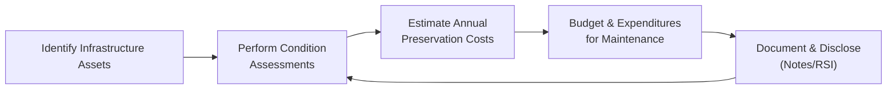

## 21.3 Handling Infrastructure and Specific Disclosures

Infrastructure assets—such as roads, bridges, tunnels, sewer systems, and other public service networks—often represent a substantial portion of a government’s long-lived assets. Unlike typical capital assets with clearly defined useful lives, infrastructure presents unique challenges that require specialized accounting and disclosures. The Governmental Accounting Standards Board (GASB) provides guidance on how governments should report and disclose these critical public resources, putting significant emphasis on transparency and accountability. This section explores the intricacies of infrastructure accounting, highlights the modified approach, and reviews other specialized disclosures that may apply to state and local governments.

----------------------------------------------------------------------------
### Importance of Infrastructure in Governmental Accounting

Infrastructure assets are vital to delivering public services and maintaining economic well-being. In many communities, the quality and reliability of roads, bridges, and water treatment facilities are both expensive to develop and time-consuming to replace or rehabilitate. As a result, the proper accounting and disclosure for infrastructure is critical for:

• Demonstrating accountability to taxpayers, citizens, and other stakeholders.  
• Reflecting the current and long-term financial position of the government more accurately.  
• Providing transparent data to help guide policy decisions, budgeting, and funding allocations.  
• Ensuring compliance with applicable financial reporting frameworks and GASB statements.  

In Chapters 19 and 20 of this text, we established the foundations of governmental accounting, including fund structures and preparation of governmental financial statements. Now, in Chapter 21 with a focus on reconciliation and government-wide reporting, this section zeroes in on how governments can handle infrastructure assets in their financial statements and the special disclosures that accompany them.

----------------------------------------------------------------------------
### The Modified Approach for Infrastructure Assets

Historically, governments accounted for infrastructure assets under the traditional depreciation model, similar to how corporations handle fixed assets. However, GASB Statement No. 34 introduced an alternative—the modified approach—for reporting “eligible infrastructure assets.” Under this approach, governments may choose not to record depreciation if they consistently maintain infrastructure at or above a certain prescribed condition level. The modified approach is designed to reflect a government’s preservation and condition-assessment efforts, rather than simply depreciating infrastructure on a time schedule.

#### Eligibility Requirements for the Modified Approach

1. Up-to-date Inventory of Eligible Assets  
   • Governments must maintain a comprehensive inventory of the infrastructure assets they plan to report under the modified approach. This inventory should detail the type of assets, location, and any other crucial identifying information.

2. Condition Assessments  
   • Periodic condition assessments are required (for example, every two to three years) to evaluate whether assets meet or exceed a predetermined condition threshold.  
   • Condition-level frameworks are typically defined by engineers or public works departments, setting criteria (e.g., a given road pavement rating) that classify asset quality.

3. Estimation of Preservation Costs  
   • Governments must estimate the annual amount needed to maintain (or preserve) the eligible assets at or above the established condition level.  
   • This amount is disclosed in the financial statements, providing users with insight into the government’s ongoing commitment to asset maintenance.

4. Maintenance of Condition Level  
   • Finally, the government must demonstrate that actual preservation expenditures are sufficient to keep the assets at or above the stated condition level.

#### Accounting Under the Modified Approach

If the government meets all of the above criteria, it does not record depreciation expense for eligible infrastructure assets. Instead, the assets continue to be reported on the Statement of Net Position (government-wide financial statements) at historical cost (net of any impairments), but with no periodic reduction through accumulated depreciation. Expenditures to maintain or preserve the asset are typically expensed as incurred, unless they extend the capacity or efficiency of the asset, in which case, they may be capitalized.

----------------------------------------------------------------------------
### Traditional Depreciation Approach vs. Modified Approach

Although the modified approach offers a unique way to demonstrate preservation efforts, many governments still use the traditional depreciation approach for all or some of their infrastructure assets. The decision depends on resource availability, administrative complexity, policy preferences, and, in some cases, local or state regulations.

| Aspect                  | Traditional Depreciation                         | Modified Approach                               |
|-------------------------|--------------------------------------------------|-------------------------------------------------|
| Accounting Treatment    | Capitalize and depreciate over estimated life.  | Maintain infrastructure at or above certain condition; no depreciation expense. |
| Condition Assessments   | Not required for accounting basis; may still happen operationally. | Mandatory periodic assessments to verify condition threshold. |
| Disclosure Focus        | Asset cost, accumulated depreciation, and net book value.            | Condition level, preservation costs, and consistency of maintenance efforts. |
| Complexity              | Easier to administer but can misrepresent actual asset condition.    | Can reflect asset condition accurately but requires more robust data gathering. |

#### Making the Choice

Most governments find that using the modified approach necessitates more comprehensive recordkeeping and engineering studies. On the other hand, it allows officials and stakeholders to see how well the infrastructure is being maintained over the long term. Given sectional references in Chapter 20 regarding budgeting and conversions, some governments initially track infrastructure in their fund statements using traditional methods but then convert to the modified approach for government-wide reporting.

----------------------------------------------------------------------------
### Condition Assessments and Preservation Costs

A cornerstone of the modified approach is the condition assessment. Unlike the simpler concept of depreciation, which systematically allocates the cost of an asset over its estimated useful life, condition assessments seek to determine if real-world service potential is being preserved. 

• Condition Rating Scales: Typically numeric (e.g., 1–5) or descriptive (e.g., “Excellent,” “Good,” “Satisfactory,” “Poor”).  
• Frequency of Assessments: Governments often schedule these assessments to coincide with budget cycles or capital improvement programs.  
• Preservation Costs vs. Improvements: Work deemed “preservation” merely keeps the asset in a consistent state (expensed) while “improvements” extend the asset’s capacity or life (capitalized).

----------------------------------------------------------------------------
### Required Disclosures Under the Modified Approach

The modified approach demands a range of disclosures outlined by GASB. Some governments report these in either the notes to the financial statements or required supplementary information (RSI). Key disclosures include:

1. Description of the Condition Assessment Methods  
   • Detailed explanation of the rating scale and measurement criteria, often referencing widely recognized engineering or industry standards.

2. Asset Condition vs. Established Condition Level  
   • Governments should disclose the actual conditions found in the latest assessment relative to the baseline condition they have committed to maintain.

3. Estimated Annual Preservation Cost vs. Actual Expenditures  
   • Disclose both the forecasted and actual expenditures for maintaining assets at or above the established condition over at least a three-year period, if available.

4. Policies for Managing Infrastructure Assets  
   • Governments must describe the overall management strategy for preserving infrastructure, including how condition data influences budget decisions.

Below is a simplified conceptual diagram illustrating the interplay between condition assessments, preservation efforts, and financial statement disclosures when using the modified approach:

In the diagram above, you can see how disclosures become an iterative cycle of assessing, budgeting, preserving, and reporting on infrastructure assets.

----------------------------------------------------------------------------
### Other Specialized Government Disclosures

Beyond infrastructure, there are numerous other items unique to governments that can require specialized disclosures. These items may not always fall under the modified approach but often intersect with larger infrastructure projects.

• Asset Retirement Obligations (AROs): Certain long-lived assets (e.g., power plants) or decommissioning liabilities (e.g., removal of water treatment facilities) can require detailed footnotes and schedules about the estimated future costs and funding plans.  
• Environmental Remediation Liabilities: Costs to remediate contamination or pollution often overlap with infrastructure projects. Governments should disclose the nature, source, and potential magnitude of cleanup efforts.  
• Conduit Debt Obligations: Governments may issue bonds for the benefit of third parties like nonprofits or economic development authorities. While these often do not appear as liabilities on the government’s balance sheet, the presence and details of conduit debt must be disclosed.  
• Intangible Infrastructure-Related Assets: For instance, certain water or mineral rights and intangible aspects of toll systems require specialized disclosure to show how these intangible rights intersect with physical infrastructure.

----------------------------------------------------------------------------
### Best Practices for Effective Infrastructure Disclosures

1. Develop a Comprehensive Asset Database  
   – Centralize all infrastructure information, including construction details, historical cost data, and maintenance schedules.

2. Coordinate with Engineers and Public Works  
   – Foster open communication between accounting staff and technical experts to ensure consistent asset condition assessments.

3. Adopt Clear Measurement Scales  
   – Use widely recognized industry standards (e.g., Pavement Condition Index for roads) to enhance credibility and comparability.

4. Document Preservation Policies and Expenditure Plans  
   – Connect the financial disclosures in the Comprehensive Annual Financial Report (commonly referred to as the ACFR) to broader policy documents and capital planning narratives.

5. Regularly Evaluate Asset Management Strategies  
   – Use the results of condition assessments not just for disclosures, but to adjust budgets, extend asset lifespans, and engage in proactive strategic planning.

----------------------------------------------------------------------------
### Common Pitfalls and Challenges

• Underestimating Preservation Costs: Governments may project unrealistically low expenditures in order to fit budget constraints, leading to underfunded maintenance.  
• Inconsistent Condition Assessments: Without standardized procedures or trained personnel, condition ratings can vary drastically among assets or across time periods.  
• Insufficient Documentation: The modified approach requires thorough, verifiable records. Inadequate documentation can undermine the confidence of auditors and financial statement users.  
• Overreliance on One-Dimensional Metrics: A simple pass/fail rating may not capture the nuanced condition of complex infrastructure, resulting in incomplete disclosures.

----------------------------------------------------------------------------
### Illustrative Case Study

Imagine a mid-sized city that owns hundreds of miles of roads, along with a network of bridges and pedestrian walkways. After grappling with outdated roads and public complaints about potholes, policymakers consider adopting the modified approach.

1. During the initial inventory, city staff compile all historical construction expenditures and relevant roadway maps.  
2. Engineers develop a Pavement Condition Index (PCI) scale, rating roads from 100 (excellent) down to 0 (impassable). They set a threshold that roads must meet an average PCI of 70 across the city.  
3. The annual cost to maintain that standard is estimated at $15 million. This is disclosed in the notes along with an explanation of the rating scale.  
4. Regulatory footnotes also include a discussion of potential environmental remediation near an old industrial corridor that intersects the city’s highway system. Although it’s not depreciation-related, the city is obligated to disclose this in the same financial reporting ecosystem.  
5. The latest condition assessment reveals that the average PCI is 72, which meets the policy’s requirement. Actual preservation expenditures were $16 million, slightly above budget due to unplanned winter weather damage. This variance is explained in the RSI to give stakeholders a full picture of capital outlays and the condition of the roads.

This narrative underscores how the modified approach works in practice—and how specialized disclosures about roads, environmental factors, and other unique aspects must come together coherently in government-wide statements.

----------------------------------------------------------------------------
### Conclusion

Managing and reporting on infrastructure goes beyond simple bookkeeping: it requires an integrated understanding of engineering assessments, budgeting processes, and transparent communication with constituents. The modified approach for infrastructure accounting—allowing governments to forgo traditional depreciation if they continuously maintain assets at or above a specified condition level—underscores the importance of proactive asset management.

At the same time, specialized government disclosures, ranging from asset retirement obligations to conduit debt, provide an in-depth view of a government’s financial commitments and contingencies. By adhering to best practices and avoiding common pitfalls, governments can deliver comprehensive, understandable, and meaningful information that supports better decision-making and enhances public trust.

Carefully review the requirements and guidelines in this section when deciding whether to implement the modified approach, and always ensure that the disclosures meaningfully communicate your infrastructure strategies to all stakeholders. With sound governance, robust internal controls, and transparent reporting, state and local governments can protect their critical infrastructure investments and maintain the public’s confidence in their stewardship.

----------------------------------------------------------------------------

## Test Your Knowledge: Modified Approach and Government Disclosures Quiz



### Which GASB statement introduced the modified approach for infrastructure assets?

- [x] GASB Statement No. 34
- [ ] GASB Statement No. 51
- [ ] GASB Statement No. 68
- [ ] GASB Statement No. 89

> **Explanation:** GASB Statement No. 34 established significant new financial reporting requirements for state and local governments, including the option for the modified approach instead of traditional depreciation.

### Under the modified approach, what must a government demonstrate about infrastructure assets?

- [x] They are maintained at or above an established condition level.
- [ ] They generate sufficient revenue to cover their maintenance costs.
- [ ] They eliminate short-term borrowing obligations.
- [ ] They carry a market-based discount rate.

> **Explanation:** A government using the modified approach must demonstrate that it is maintaining eligible infrastructure assets at or above a predetermined condition level through sufficient preservation expenditures.

### What is an essential disclosure when using the modified approach?

- [x] The estimated annual amount to maintain the asset in satisfactory condition.
- [ ] The fair value of the infrastructure based on an independent appraiser.
- [ ] A comparison to private-sector infrastructure benchmarks.
- [ ] Forecasted net revenue from user fees.

> **Explanation:** Governments must disclose the annual cost necessary to maintain or preserve eligible assets at or above the established condition level, ensuring transparency and accountability to stakeholders.

### Which best describes the purpose of periodic condition assessments?

- [x] Evaluating whether infrastructure meets a predetermined rating threshold.
- [ ] Ensuring the city’s CAFR or ACFR is filed timely.
- [ ] Determining how much depreciation expense to record.
- [ ] Identifying the fixed-asset turnover ratio.

> **Explanation:** Periodic condition assessments verify that infrastructure is maintained within acceptable standards and confirm alignment with the government’s preservation plans.

### In a government’s financial statements, where are disclosures for the modified approach commonly presented?

- [x] In the notes or as Required Supplementary Information (RSI).
- [ ] On the face of the Statement of Net Position, separate from liabilities.
- [x] In the capital outlay section of fund financial statements.
- [ ] In the general ledger footnotes only accessible to departmental staffs.

> **Explanation:** Typically, key information about condition levels and related costs appears in the notes or RSI. Some disclosures regarding capital outlays can also appear in fund financial statements to reconcile differences with government-wide reporting.

### What are the two potential classifications for outlays under the modified approach?

- [x] Preservation vs. Improvement
- [ ] Purchase vs. Revenue Expenditure
- [ ] Planning vs. Implementation
- [ ] Direct vs. Indirect Costs

> **Explanation:** The modified approach classifies infrastructure-related expenditures as preservation (expensed) or improvement (capitalized), depending on whether they simply maintain current condition or extend the asset’s capacity.

### Which of the following is a key benefit of the modified approach?

- [x] It shows stakeholders how a government is preserving rather than depreciating its infrastructure.
- [ ] It reduces a government’s reported liabilities on the Statement of Net Position.
- [x] It automatically capitalizes all types of maintenance costs.
- [ ] It changes how restricted assets are reported in fund statements.

> **Explanation:** The modified approach highlights a government’s efforts to keep its infrastructure assets at a specified condition level, offering a more service-based perspective than mere depreciation.

### Which of the following is a common pitfall when applying the modified approach?

- [x] Insufficient or inconsistent documentation of condition assessment ratings.
- [ ] Overstating depreciation expense for intangible assets.
- [ ] Using a detailed cost analysis and thorough disclosures.
- [ ] Keeping assets at a level above the threshold for expense recognition.

> **Explanation:** One major challenge is ensuring that condition assessment documentation meets all reporting requirements and is consistently applied, as inadequate records can undermine reliability.

### Which of the following scenarios generally requires specialized government disclosures?

- [x] Environmental remediation involving large public infrastructure.
- [ ] Establishing a raw materials reserve at the federal level.
- [ ] Issuing private equity shares to public investors.
- [ ] Outsourcing human resource services to a third party.

> **Explanation:** Remediation efforts, especially those tied to large infrastructure projects, typically trigger detailed disclosures related to the nature and scope of remediation liabilities.

### The modified approach generally prevents infrastructure from being subject to:

- [x] Periodic depreciation expense.
- [ ] External oversight by engineering specialists.
- [ ] Auditor review of maintenance logs.
- [ ] Historical cost determinations.

> **Explanation:** Under the modified approach, eligible infrastructure assets are not depreciated as long as the government maintains them at or above a targeted condition level.



----------------------------------------------------------------------------

## For Additional Practice and Deeper Preparation

### [Business Analysis and Reporting (BAR) CPA Mock Exams](https://www.udemy.com/course/bar-cpa-mock-exams/?referralCode=ADBE2E84BEE9CB6243CA)

**Business Analysis and Reporting (BAR) CPA Mocks:** 6 Full (1,500 Qs), Harder Than Real! In-Depth & Clear. Crush With Confidence!

- Tackle full-length mock exams designed to mirror real BAR questions.  
- Refine your exam-day strategies with detailed, step-by-step solutions for every scenario.  
- Explore in-depth rationales that reinforce higher-level concepts, giving you an edge on test day.  
- Boost confidence and minimize anxiety by mastering every corner of the BAR blueprint.  
- Perfect for those seeking exceptionally hard mocks and real-world readiness.  

_Disclaimer: This course is not endorsed by or affiliated with the AICPA, NASBA, or any official CPA Examination authority. All content is for educational and preparatory purposes only._
