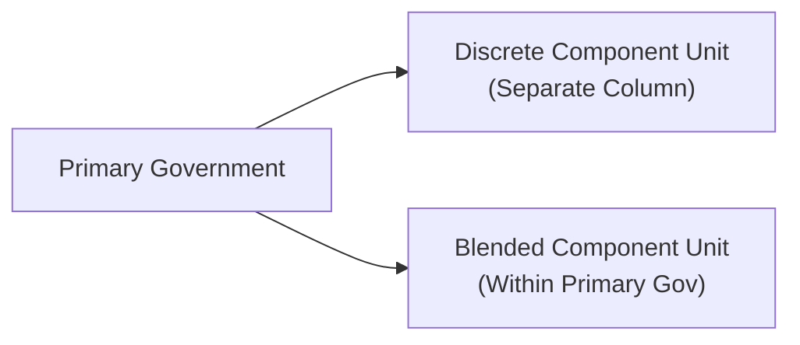

## 21.4 Reporting Component Units (Discrete and Blended)

Component units are legally separate organizations for which a primary government is financially accountable or for which the relationship with the primary government is significant enough to warrant inclusion in the Annual Comprehensive Financial Report (ACFR). Governmental Accounting Standards Board (GASB) pronouncements—particularly GASB Statements No. 14, 39, 61, and subsequent amendments—guide how state and local governments should identify and report these organizations. 

Accurate classification of component units plays a crucial role in ensuring that governmental financial statements reflect complete financial accountability. This section clarifies the criteria for determining a component unit, differentiates between discrete and blended presentations, and illustrates how to integrate these entities in the government-wide and fund-level financial statements within the ACFR.

-------------------------------------------------------------------------------
### Purpose of Component Unit Reporting

Component units are included in a primary government’s financial statements to present a more thorough picture of all entities under the government’s purview or influence. For CPA exam candidates and accountants alike, mastering component unit reporting is essential for:

• Demonstrating compliance with GASB standards.  
• Ensuring stakeholders have a comprehensive view of governmental activities.  
• Maintaining transparency and accountability by disclosing all financially relevant entities.

GASB standards emphasize consistent, transparent financial practices. The ultimate objective is to serve users of the financial statements—including citizens, oversight bodies, creditors, and other stakeholders—by offering a holistic representation of government finances.

-------------------------------------------------------------------------------
### Identifying a Component Unit

#### Financial Accountability
Under GASB Statement No. 14 (as amended), a primary government is deemed financially accountable for another entity if it either:
1. **Appoints a majority of the entity’s governing board** and can impose its will on that entity, or  
2. **Possesses a financial benefit or burden relationship** with the entity.  

In practice, “impose its will” means the primary government can significantly influence the entity’s programs or expenditures. A financial benefit or burden often is evidenced by the primary government’s obligation to subsidize the organization, or the primary government’s right to the organization’s surplus or residual assets.

#### Fiscal Dependency
Even if the primary government does not appoint a majority of the governing board, if the entity is fiscally dependent on the primary government (meaning it cannot determine its budget, levy taxes, or set user charges without approval from the primary government), it may qualify as a component unit. 

#### Significance of the Relationship
An organization might also be considered a component unit if it would be misleading to exclude it from the primary government’s financial statements due to the nature of their relationship. For example, if the government has significant influence over the financial and operational decisions of a separately incorporated non-profit, and resources flow freely between them, it may be identified as a component unit despite failing the “appointment” and “fiscal dependency” tests.

-------------------------------------------------------------------------------
### Classification: Discrete vs. Blended Presentation

Once identified as a component unit, governments must determine how to present that entity in the ACFR. The choice between **discrete presentation** and **blended presentation** hinges on the nature and the degree of the relationship between the component unit and the primary government.

#### Discrete Presentation
A discrete component unit is reported in a separate column on the government-wide statements or in the fund statements, with its financial information maintained distinctly from the primary government’s activities. Discrete presentation is common when:

• The component unit has a legally separate governing body that is not substantively the same as the primary government’s.  
• It provides services to constituents or recipients other than the primary government.  
• The economic resources and obligations remain primarily with the component unit.  

In discrete presentation, users of the financial statements can see the financial position and operations of the component unit separately, allowing for clarity in analyzing the government’s total economic resources.

#### Blended Presentation
A blended component unit is **so closely associated** with the primary government that it is, in essence, treated as part of the primary government in the financial statements. Blended presentation is appropriate when:

• The component unit’s governing body is substantively the same as the primary government’s governing body.  
• The component unit provides services almost exclusively to the primary government.  
• The component unit’s debt is expected to be repaid by the primary government’s resources.  

In such scenarios, the component unit’s funds are typically reported **as if** they were a fund of the primary government. Blended component units appear in the appropriate fund statements (e.g., governmental funds, proprietary funds) or sometimes as separate columns but within the same fund type as the primary government’s activities.

-------------------------------------------------------------------------------
### Visualizing Discrete vs. Blended Structures

Below is a Mermaid diagram to illustrate the conceptual difference between a discrete component unit and a blended component unit in relation to the primary government.

- The “Discrete Component Unit” node (B) stands on its own in the government-wide statements, highlighted in a separate column.  
- The “Blended Component Unit” node (C) is incorporated into the primary government’s presentation, often as one of its funds or as part of its general fund activities.

-------------------------------------------------------------------------------
### Integrating Component Units in the ACFR

The Annual Comprehensive Financial Report (ACFR) typically consists of:

1. **Introductory Section** (cover letter or executive summary from management).  
2. **Financial Section** – includes the auditor’s report, Management’s Discussion and Analysis (MD&A), basic financial statements, required supplementary information (RSI), and combining statements (if applicable).  
3. **Statistical Section** – typically includes trend data and other supplementary schedules.

Component units must appear in the Financial Section in either discrete or blended columns or statements. Here is how they flow into the basic financial statements:

#### Government-Wide Statements
• **Statement of Net Position**: If discrete, the component unit’s assets, liabilities, and net position appear in a separate column to the right of the primary government’s totals. If blended, these assets, liabilities, and net position are merged into the relevant columns of the primary government.  
• **Statement of Activities**: Discretely presented component units show program revenues, expenses, and net position changes in a standalone column, typically on the far-right side of the statement. Blended activities are integrated into the primary government’s program and general revenues.

#### Fund Financial Statements
• **Governmental Fund Statements** (Balance Sheet and Statement of Revenues, Expenditures, and Changes in Fund Balances): If the component unit is blended, its financial transactions are reported along with those of the primary government in the appropriate fund category. If discretely presented, it may have separate columns or separate combining statements, depending on the level of detail and the entity’s nature.  
• **Proprietary Fund Statements**: If the component unit’s sole purpose is to provide services to the primary government (and is integral to the government’s operations), it may be blended within an internal service fund or enterprise fund. Discrete component units often require their own enterprise fund statements if they operate like a business.  
• **Fiduciary Fund Statements**: If the component unit manages or holds resources in a trustee or agency capacity, but meets the criteria for component unit reporting, it may appear in the fiduciary fund financial statements under a blended approach. Typically, though, fiduciary activities are not consolidated into the government-wide statements.

-------------------------------------------------------------------------------
### Criteria for Blended vs. Discrete Presentation under GASB

#### Conditions for Blending
GASB guidance enumerates specific conditions supporting a blended approach. Chief among these are:

1. **Substantially the Same Governing Body**  
   If the primary government and component unit have the same board members, and the governing body either (1) manages the component unit as if it were a department of the primary government, or (2) includes the component unit’s operations in the primary government budget development and oversight process.  

2. **Services Provided Exclusively or Almost Exclusively**  
   If the primary government is the sole (or nearly sole) recipient of services from the component unit, indicating deep operational integration.  

3. **Debt Repayment by Primary Government**  
   If the component unit’s debts or obligations are expected to be repaid by the primary government’s resources, blending is typically appropriate.

#### Conditions for Discrete Presentation
When the criteria for blending are not met, a discrete presentation is the default. The discrete component unit will have:

• A separate governing board.  
• Services primarily directed to persons or entities other than the primary government.  
• Debt obligations largely independent of the primary government’s general credit or taxing authority.

-------------------------------------------------------------------------------
### Required Disclosures and Note Presentations

Note disclosures are critical for explaining the relationships and reasons for classifying an entity as a blended or discrete component unit. Specifically, governments must describe:

• **Rationale for Including the Entity**  
  Why the entity meets the financial accountability, fiscal dependency, or other significance criteria set forth by GASB.  

• **Basis for Presentation**  
  Whether the unit is blended or discrete, citing the GASB criteria that prompted the classification.  

• **Financial Impact**  
  Any potential impact the component unit has on the government’s financial condition or operating results.  

• **Transactions with the Primary Government**  
  If there are material interfund transactions, shared revenues, or financial guarantees, these must be disclosed for clarity and completeness.

These disclosures help readers understand the nature of the government’s oversight and influence over the component unit. For exam takers, being able to articulate these disclosure requirements is just as essential as mastering the classification rules themselves.

-------------------------------------------------------------------------------
### Example: Discretely Presented University System

Consider a state government that financially supports a separate university system with an independently elected board. Although the government appropriates funds to the university, it does not have the governing authority to impose its will, and the resources do not flow substantially to the government itself. According to GASB guidelines:

- The state government is financially accountable because it provides the university’s funding and appoints only a minority (not majority) of the board members. The board retains enough autonomy that it is not fully aligned with the state’s government structure.  
- The services are primarily provided to students (the public) rather than exclusively to the state government itself.  

Therefore, the university system would more commonly appear as a **discretely presented component unit** in the state’s ACFR. It would have a separate column in the government-wide statements, and detailed footnotes explaining its financial relationship and independence relative to the state government.

-------------------------------------------------------------------------------
### Example: Blended Financing Authority

Suppose a city creates a legally separate Financing Authority (FA) to issue bonds for constructing public buildings. The authority’s board consists precisely of the city’s city council members, and the bond repayment will come from the city’s general fund. Furthermore, the authority provides no services to external parties — its sole function is to act as a conduit for financing city projects.

This structure meets the threshold for **blended** presentation:

1. The governing body of the FA is substantively the same as the city’s.
2. FA provides services exclusively to the city.
3. The city’s general fund is on the hook for any debt repayment.  

Consequently, the financing authority’s activities are **reported within** the city’s governmental fund statements (often as a debt service fund).

-------------------------------------------------------------------------------
### Common Pitfalls and Challenges

#### Overlooking De Facto Financial Accountability
In some cases, a primary government may not directly appoint the majority of a board of a component unit but still exerts financial control (e.g., it may be legally or practically obligated to cover the unit’s liabilities). Overlooking such scenarios can misrepresent the organization’s financial landscape.

#### Misclassification Between Discrete and Blended
A particular pitfall is misclassifying a blended component unit as discretely presented (or vice versa). This error can lead to confusion over the scale of a government’s operations and distort the financial statement analysis. GASB standards require careful consideration of board composition and the extent of operational integration.

#### Insufficient Note Disclosures
Some government entities inadequately describe their relationships with component units, making it difficult for analysts, creditors, or oversight bodies to fully grasp the connections. Lack of clarity here can reduce transparency.

#### Transition from/into Component Unit Status
Significant triggers—like changes in governance structure or modifications to the entity’s purpose—may cause a unit to start or cease being a component unit. Failing to promptly disclose these transitions or properly adjust financial statements can lead to restatements and confusion.

-------------------------------------------------------------------------------
### Best Practices and Recommendations

• **Establish Clear Governance Documentation**  
  Thoroughly document each entity’s legal standing, board appointment processes, and operational interactions with the primary government. This clarity makes deciding between discrete and blended far more straightforward.

• **Conduct Regular Reviews**  
  Regularly assess whether existing component units still meet the same conditions as in prior years. If structural changes occur, re-evaluate classification promptly.

• **Leverage Flowcharts and Decision Trees**  
  Create internal flowcharts (similar to the diagram above) for quick reference. A visual approach can help staff consistently apply GASB standards.

• **Maintain Comprehensive Workpapers**  
  In the event of an audit, well-organized documentation of your classification decisions will expedite the process and help you address any queries from external auditors.

• **Engage in Ongoing Training**  
  GASB standards on component units evolve. Continuous staff development ensures your government’s financial statements remain compliant with the latest guidance.

-------------------------------------------------------------------------------
### Case Study: Municipality Incorporating a Port Authority

Imagine a medium-sized coastal municipality that interacts with a **Port Authority**, a legally separate entity established to oversee marine commerce, develop sea-lanes, and manage port-related infrastructure. Over time, the municipality begins to rely on the Port Authority for revenue generation (via dock fees and tariffs). Simultaneously, the Port Authority has difficulty meeting bond obligations, which the municipality has guaranteed. Additionally, the municipality appoints the majority of the Port Authority’s board members.

After a thorough assessment of financial accountability and governance:

1. **Board Appointment**  
   The municipality appoints four of the five board members; the only non-appointed member is an ex-officio representative from the maritime industry.  

2. **Financial Benefit or Burden**  
   The municipality is on the hook for the Port Authority’s bond obligations if revenues fall short.  

3. **Services**  
   While the Port Authority’s services extend beyond the municipality (it serves regional shipping routes), a large share of its revenue or potential costs flows back to the municipality.  

Upon review, the municipality determines that the Port Authority must be reported as a **discrete component unit** because it serves third-party shipping operations in addition to the municipality, preventing it from being blended. However, if the Port Authority’s scope were narrower—exclusively serving municipal needs and financed solely by municipal funds—it might have been classified as blended.

-------------------------------------------------------------------------------
### Connections to Other Chapters

This section on reporting component units is linked to several concepts presented throughout this guide:

- **Chapter 19: Governmental Accounting Fundamentals** – Introduces fund structures and the concept of financial accountability within government operations.  
- **Chapter 20: Preparing Governmental Financial Statements** – Explores fund-level financial statements and the intricacies of budgetary accounting, which often intersects with how component units handle appropriations and financial disclosures.  
- **Chapter 21.1: Common Adjustments (Long-Term Debt, Capital Assets)** – Reconciliations between fund-based statements and government-wide statements will frequently incorporate or eliminate component unit transactions or assets.  

-------------------------------------------------------------------------------
### References and Additional Reading

• GASB Statement No. 14: The Financial Reporting Entity  
• GASB Statement No. 39: Determining Whether Certain Organizations Are Component Units  
• GASB Statement No. 61: The Financial Reporting Entity—Omnibus  
• Government Finance Officers Association (GFOA) Best Practices and Advisories  
• AICPA Audit and Accounting Guide: State and Local Governments  

These resources delve deeper into the nuances of classification, measurement, and disclosure requirements. They provide authoritative insights into complex scenarios such as relationships with non-profit foundations, charter schools, or other special-purpose entities.

-------------------------------------------------------------------------------
### Summary

Reporting component units ensures that the ACFR truly reflects the extent of a government’s financial oversight and accountability. By understanding the criteria for financial accountability, determining the appropriate classification (blended vs. discrete), and disclosing essential information, state and local governments uphold transparency and compliance with GASB standards. 

For exam preparation, focus on:

• Recognizing component units through governance and financial accountability.  
• Differentiating the triggers for blending vs. discrete presentation.  
• Disclosing the rationale behind classification, subsequent events, and ongoing relationships.  
• Understanding the potential for cost-shifting or resource-sharing that underscores financial accountability.

The thorough application of component unit guidance ensures that stakeholders—including citizens, investors, and creditors—can rely on government financial statements for a complete picture of public resources and obligations.

-------------------------------------------------------------------------------

## Assess Your Knowledge of Component Units: Discrete vs. Blended



### A primary government creates a separate industrial development board whose members are the same as the local city council, and the board’s debt is guaranteed by the city’s direct taxing authority. Which presentation approach is most likely required?

- [x] Blended presentation
- [ ] Discrete presentation
- [ ] No presentation required
- [ ] Only disclose as Related Organization

> **Explanation:** When the board’s governing body is the same as that of the primary government and the debt is repaid by the primary government’s resources, the component unit is typically reported as blended.

### Which criterion alone generally justifies discrete rather than blended presentation?

- [ ] The primary government’s financial statements are omnipresent.
- [ ] The component unit and primary government share staff.
- [ ] The component unit’s activities serve only the primary government.
- [x] The component unit’s primary activities benefit third parties rather than the primary government.

> **Explanation:** Entities that serve third parties outside of the primary government typically appear discretely rather than blended unless certain other specific conditions for blending are met.

### In which section of the ACFR do component units primarily appear?

- [x] The Financial Section of the ACFR
- [ ] The Introductory Section only
- [ ] Only the Statistical Section of the ACFR
- [ ] They are reported separately outside the ACFR

> **Explanation:** Component units are integrated into the Financial Section of the ACFR, typically in the government-wide statements and/or as separate columns in fund statements.

### True or False: A financially dependent organization that cannot adopt its own budget, set fees, or levy taxes without approval is often a candidate for component unit status.

- [x] True
- [ ] False

> **Explanation:** Fiscal dependency is one of the key indicators that an organization might be classified as a component unit of the primary government.

### Which of the following best describes a key reason for blending a component unit?

- [x] The component unit’s debt is expected to be repaid by the primary government’s resources.
- [ ] The component unit performs a wide array of services mostly unrelated to the primary government.
- [x] The component unit’s board is entirely separate and independently appointed.
- [ ] There is a minimal exchange of resources between the unit and the primary government.

> **Explanation:** Blended component units typically rely on the primary government’s financial support (like debt repayment) and share the same or substantially the same governing body.

### A library district is funded entirely by taxes levied by the local county and must have its budget approved by the county commissioners. The district is legally separate but relies on the county’s resources. How might this district likely be presented?

- [x] As a discrete or blended component unit, depending on governance composition
- [ ] As a fiduciary fund
- [ ] Excluded from the ACFR
- [ ] Not enough information to determine

> **Explanation:** The district is fiscally dependent on the county, so it is likely reported as a component unit. Whether it is discretely presented or blended hinges on board composition and the exclusivity of services.

### Which of the following is NOT a common pitfall in component unit reporting?

- [x] Overdisclosing the relationships in the financial statements
- [ ] Misclassifying a blended component unit as discrete
- [ ] Omitting necessary disclosures for component units
- [ ] Failing to identify de facto financial accountability

> **Explanation:** Typically, too much disclosure is seldom the issue—insufficient or incomplete disclosure is more common.

### What is a key takeaway regarding component units in the government-wide statements?

- [x] Discretely presented units appear in a separate column or columns.
- [ ] Blended units are never reported together with general government operations.
- [ ] Discretely presented units must only be reported in a footnote.
- [ ] Blended units must have their own distinct financial section in the ACFR.

> **Explanation:** Discrete component units are presented in a separate column, allowing readers to distinguish their activities from those of the primary government.

### Which of the following factors often triggers a re-assessment of an entity’s status as a component unit?

- [x] Changes in governance or financial obligations
- [ ] Increased tourism in the entity’s region
- [ ] Changes in the national inflation rate
- [ ] Routine cyclical elections

> **Explanation:** A change in governance structure or financial obligations (e.g., release from certain debts or new control powers) can alter an entity’s relationship with the primary government, prompting re-evaluation.

### GASB Statement No. 14, as amended, primarily addresses:

- [x] Defining and determining the financial reporting entity
- [ ] Policing federal grants administration
- [ ] Handling only fiduciary activities
- [ ] Creating internal service fund structures

> **Explanation:** GASB Statement No. 14 (amended by subsequent statements) lays out the criteria for identifying and including component units in the financial reporting entity.



-------------------------------------------------------------------------------

## For Additional Practice and Deeper Preparation

### [Business Analysis and Reporting (BAR) CPA Mock Exams](https://www.udemy.com/course/bar-cpa-mock-exams/?referralCode=ADBE2E84BEE9CB6243CA)  

**Business Analysis and Reporting (BAR) CPA Mocks:** 6 Full (1,500 Qs), Harder Than Real! In-Depth & Clear. Crush With Confidence! 

- Tackle full-length mock exams designed to mirror real BAR questions.  
- Refine your exam-day strategies with detailed, step-by-step solutions for every scenario.  
- Explore in-depth rationales that reinforce higher-level concepts, giving you an edge on test day.  
- Boost confidence and minimize anxiety by mastering every corner of the BAR blueprint.  
- Perfect for those seeking exceptionally hard mocks and real-world readiness.  

_Disclaimer: This course is not endorsed by or affiliated with the AICPA, NASBA, or any official CPA Examination authority. All content is for educational and preparatory purposes only._
