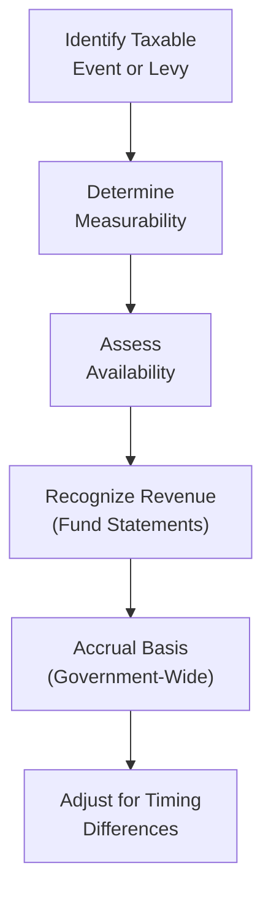

## 22.1 Nonexchange Revenues (Taxes, Grants)

Nonexchange revenues play a critical role in state and local government accounting. Unlike exchange transactions, in which each party provides and receives something of essentially equal value, nonexchange transactions arise when one party receives value without directly giving equivalent value in return. Common examples include taxes and government grants.

Within the Governmental Accounting Standards Board (GASB) framework, two major categories of nonexchange revenues are frequently examined:

• Imposed Nonexchange Revenues (e.g., property taxes, fines, forfeitures).  
• Derived Tax Revenues (e.g., sales taxes, income taxes).

GASB also defines other specific nonexchange transactions, such as government-mandated and voluntary nonexchange transactions. However, for many state and local governments, imposed and derived tax revenues remain among the largest and most commonly encountered streams.

This section breaks down key concepts, recognition triggers, eligibility requirements, and other essential accounting considerations for nonexchange revenues under GASB standards.

--------------------------------------------------------------------------------

### Overview of Nonexchange Transactions Under GASB

Under GASB standards (particularly GASB Statement No. 33, “Accounting and Financial Reporting for Nonexchange Transactions,” and subsequent clarifications), nonexchange transactions are broadly categorized into four types:

1. Imposed Nonexchange Revenues  
2. Derived Tax Revenues  
3. Government-Mandated Nonexchange Transactions  
4. Voluntary Nonexchange Transactions  

Although the focus here is primarily on imposed and derived revenues, understanding the other two categories helps place grants in context, as many grants fall under government-mandated or voluntary nonexchange transactions.

A fundamental concept in GASB’s nonexchange revenue guidance is that revenue should be recognized when the applicable and measurable “eligibility requirements” have been met. For taxes and many grants, these requirements revolve around enforceable claims, time period requirements, legal entitlements, and any relevant performance or reimbursement obligations.

--------------------------------------------------------------------------------

### 1. Imposed Nonexchange Revenues

Imposed nonexchange revenues occur when a government imposes an assessment on a non-government entity. In these cases, the taxpayer or entity subject to the levy does not receive any direct, reciprocal economic benefit. Common examples include:

• Property taxes  
• Fines and penalties  
• Certain fees or special assessments that are not exchange-based  

#### Recognition Triggers for Imposed Nonexchange Revenues

Under modified accrual accounting (used by governmental funds), revenue from imposed nonexchange transactions is typically recognized when:

1. The government has an enforceable legal claim to the resources (e.g., when property taxes are levied).  
2. The resources are “measurable and available” to finance expenditures of the current period.

In a government-wide reporting context (full accrual), recognition often occurs earlier. Property taxes, for instance, may be recognized (net of estimated refunds and uncollectible amounts) when levied, provided the amount is reliably measurable. However, because of the budgetary and legal environment, many governments still must consider the “availability” criterion for fund statements (e.g., within 60 days after fiscal year-end).

##### Example: Property Tax Recognition

Suppose a city levies $10 million in property taxes for the calendar year 2025. Under GASB guidance:

• The city establishes a property tax receivable when the levy is billed.  
• The property tax revenue is recognized in the governmental funds if it is both measurable (the city can estimate the amount to be collected) and available (the collection is expected to occur soon enough to pay current period obligations).  

If a portion of the taxes is received more than 60 days after year-end, under modified accrual fund accounting, some of that portion may be reported as deferred inflows of resources until recognized in a subsequent period.

--------------------------------------------------------------------------------

### 2. Derived Tax Revenues

Derived tax revenues are typically generated from assessments on exchanges. One party conducts a transaction, such as purchasing goods or earning income, and the government imposes a tax on that exchange. Key examples include:

• Sales taxes  
• Income taxes  
• Motor fuel taxes  

These revenues are “derived” from underlying transactions—unlike imposed revenues, which are more direct government assessments like property taxes and fines.

#### Recognition Triggers for Derived Tax Revenues

Under GASB guidance, derived tax revenues are recognized (in accrual terms) when the underlying exchange transaction takes place, provided the amount is measurable and collection is probable. For the modified accrual basis in governmental funds, recognition also requires the revenue to be “available” to finance current period expenditures.

Consider a sales tax scenario: A state imposes a 5% sales tax. The trigger for revenue recognition is when taxable sales occur. However, there is normally a lag between the date of sale, collection by the merchant, and remittance to the government. Under modified accrual procedures, revenue might be recognized in the fund statements when it is both:

1. Earned (underlying sales have taken place).  
2. Collected in time to pay current period obligations (e.g., within 60 days following the end of the fiscal period).

##### Example: Sales Tax Recognition

A county imposes a 2% sales tax on retail sales. During the last quarter of 2025, $100 million in taxable retail sales occur. Retailers remit these funds by mid-January 2026. If the county’s fiscal year ends on December 31, under modified accrual, the county would recognize revenue in 2025 if the remittance is received soon enough (e.g., by the end of February for a 60-day availability period) and is reliably measurable.

--------------------------------------------------------------------------------

### 3. Government-Mandated and Voluntary Nonexchange Transactions (Overview)

While taxes often fall within Imposed or Derived categories, grants can fall under either Government-Mandated or Voluntary Nonexchange Transactions.

• Government-Mandated Nonexchange Transactions: Occur when a government at a higher level (e.g., a state) requires a lower-level government (e.g., a county or school district) to undertake or continue a specific activity, and provides resources for that purpose.  
• Voluntary Nonexchange Transactions: Arise from legislative or contractual agreements entered into willingly by two or more parties—for example, certain grants or donations.  

#### Grants as Nonexchange Transactions

Many grants are either government-mandated or voluntary. For example, a federal grant program might require a local government to operate a specific program (government-mandated), or local governments may apply voluntarily for a competitive grant (voluntary).

Under GASB Statement No. 33, recognition of grant revenue typically depends on eligibility requirements. Among these requirements are:

1. **Time Requirements**: The resources must be used (or the performance must occur) within the specified time frame.  
2. **Purpose Restrictions**: The resources must be spent on the specified purpose.  
3. **Reimbursement (Expenditure-Driven Grants)**: The local government must incur qualifying expenditures before it can receive (or recognize) grant revenue.  
4. **Contingencies**: Grant funds are contingent upon certain conditions being met.

If these conditions are not yet fulfilled, the grant may be recognized as a “deferred inflow of resources” rather than current revenue.

--------------------------------------------------------------------------------

### 4. Measurement Focus and Basis of Accounting: Government-Wide vs. Governmental Funds

GASB requires different perspectives for government-wide statements and governmental fund statements:

• **Government-Wide Financial Statements**: Use the economic resources measurement focus and accrual basis. Nonexchange revenues (taxes, grants) are recognized when the underlying “exchange” or eligibility criteria have been met, subject to reliable measurement and probable collection.  
• **Governmental Fund Financial Statements**: Use the current financial resources measurement focus and modified accrual basis. Nonexchange revenues are recognized only if they are measurable and **available** to finance expenditures of the current period.  

This difference in basis results in timing variations between the two presentations. Often, a portion of property taxes or income taxes near year-end is treated differently in the fund statements (possibly as deferred inflows) versus the government-wide financials, which may reflect full accrual recognition.

--------------------------------------------------------------------------------

### 5. Eligibility Requirements and Typical Recognition Timing

The following table provides a concise overview of eligibility requirements and typical recognition timing for major nonexchange revenue types:

| Revenue Type                  | Eligibility/Trigger                                                | Recognition Basis (Modified Accrual)                  | Recognition Basis (Full Accrual)            |
|------------------------------|-------------------------------------------------------------------|-------------------------------------------------------|---------------------------------------------|
| Imposed (e.g., Property Tax) | Enforceable legal claim to resources (levy date/taxable event)     | When levied and resources are measurable and available | When levied and measurable (net of refunds) |
| Derived (e.g., Sales Tax)    | Underlying exchange transaction occurs (sales/income earned)       | When measurable and available for current expenditures | When underlying exchange occurs and probable |
| Grants (Government-Mandated or Voluntary) | Must meet specific eligibility (time, purpose, allowable costs) | When eligibility is met, measurable, and available     | When eligibility is met in full accrual     |

--------------------------------------------------------------------------------

### 6. Practical Examples of Nonexchange Revenue Recognition

#### 6.1 Property Tax Levies (Imposed Nonexchange)

• A county issues property tax bills on July 1 for the fiscal year ending June 30.  
• The payment due date is October 1, and delinquent notices go out December 1.  
• Some taxpayers pay on time; others are late.  
• The county recognizes property tax revenue when it can estimate collections and can expect to receive them in time to pay current liabilities. In the government-wide statements, the levied amount is recognized (less uncollectible amounts) once enforceable, typically near July 1, even if some portion is collected after year-end.

#### 6.2 Sales Tax (Derived Nonexchange)

• A state has a 5% sales tax rate; local merchants collect the tax and remit it by the 15th of the following month.  
• Total taxable sales in June are $200 million; the sales tax from June’s activity is remitted in July.  
• Under the modified accrual perspective, the state recognizes the revenue in June if the resources are expected to be received soon enough to pay June 30th liabilities (often by August 31 if a 60-day period is used).  

#### 6.3 Grants (Government-Mandated or Voluntary Nonexchange)

• A school district is awarded a federal grant of $2 million to fund afterschool tutoring programs.  
• The grant specifies that eligible costs must be incurred first and then submitted to the grantor for reimbursement.  
• As the district incurs tutoring program costs, it records expenditures. It then recognizes grant revenue to the extent of allowable expenditures under the grant agreement. If funds are received or receivable in the same period, revenue is recognized when the district is legally entitled to reimbursement (and the resources are measurable and available under modified accrual).

--------------------------------------------------------------------------------

### 7. Common Pitfalls and Challenges

1. **Misclassification of Nonexchange vs. Exchange Transactions**  
   Sometimes governments mistakenly classify certain transaction-based fees or charges as “nonexchange.” If the payer is receiving a commensurate benefit—like an admission fee to a park—this may be more properly classified as an exchange or exchange-like transaction. Ensure clarity in whether a transaction truly lacks an equivalent exchange of value.

2. **Timing of Revenue Recognition**  
   Determining the proper period and the “availability” concept can be a source of confusion. Governments should maintain robust collection data and track actual receipts to accurately measure what portion of revenues is available.

3. **Recording Grants Too Early**  
   Some governments prematurely recognize grant revenue before incurring the required expenditures or meeting other eligibility requirements. Under GASB, eligibility must be fully satisfied before revenue can be recognized.

4. **Overlooking Refund Liabilities**  
   With derived tax revenues (like sales or income taxes), governments sometimes overlook potential refunds or credits. Proper netting of revenue for expected refunds is necessary for accurate recognition.

5. **Deferred Inflows of Resources**  
   Under GASB standards, “deferred inflows of resources” may be more appropriate than “deferred revenue” in certain cases. Government accountants often face confusion, leading to classification or presentation errors in the fund statements.

--------------------------------------------------------------------------------

### 8. Best Practices for Managing Nonexchange Revenues

• **Establish Strong Internal Controls**: A consistent billing, collection, and monitoring system reduces errors in recognizing property taxes.  
• **Track Timing and Collections**: Ensure your accounting staff can differentiate between year-end revenue recognized in the current period versus revenue recognized in future periods.  
• **Document Eligibility Criteria for Grants**: Maintain checklists to confirm you have met all relevant conditions—time, purpose, matching requirements, etc.—before recording grant revenue.  
• **Coordinate with Legal and Program Officers**: For complex or specialized grants (e.g., federal highway funding or mandated social services), ensure you understand all compliance requirements to avoid revenue recognition misstatements.  
• **Train Staff on Modified Accrual Timing**: Nonexchange revenue recognition can differ significantly between government-wide and governmental fund statements. Make sure staff are comfortable reconciling differences and properly reporting in each set of statements.

--------------------------------------------------------------------------------

### 9. Visualizing the Recognition Process with a Mermaid Diagram

Below is a simple flowchart illustrating how a finance team might approach revenue recognition under GASB for nonexchange transactions. This example focuses on derived tax revenues (like sales tax) and property taxes but can be adapted for grants.

• A – The government identifies when the taxable event occurs or when property taxes are levied.  
• B – If the revenue is measurable (i.e., can be reasonably estimated), proceed.  
• C – Determine if the revenue is available within the current reporting period (for fund-level reporting).  
• D – Recognize the revenue in the governmental funds if both measurable and available.  
• E – For accrual-basis government-wide statements, recognize revenue earlier based on enforceability (for imposed revenues) or when underlying transactions occur (for derived tax revenues).  
• F – Post adjusting entries if necessary to align government-wide statements with the modified accrual approach used at the fund level.

--------------------------------------------------------------------------------

### 10. Case Study: Allocating Property Tax to Multiple Funds

Consider a city with three major governmental funds: General Fund, Debt Service Fund, and Capital Projects Fund. The city levies $10 million in property taxes, of which $6 million is for general operations, $3 million for debt service, and $1 million for capital initiatives.

1. **Upon Levy**:  
   – Government-wide statements record the entire $10 million (less estimated uncollectibles) as a receivable and revenue (assuming the levy is enforceable).  
   – At the fund level, separate revenue (and a corresponding property tax receivable) is recognized in each fund for the “available” portion. Unavailable amounts may be booked as deferred inflows of resources. For instance, the Capital Projects Fund may not consider all taxes as “available” if collections historically come in slowly and the spending needs are more long-term.

2. **Subsequent Collections**:  
   – As taxes are collected, the city reduces the receivable and increases cash.  
   – Amounts previously recorded as deferred inflows become recognized revenue in the fund statements when they become available.

--------------------------------------------------------------------------------

### 11. References and Further Reading

• GASB Statement No. 33: “Accounting and Financial Reporting for Nonexchange Transactions.”  
• GASB Codification Section N50: “Nonexchange Transactions.”  
• GASB Concept Statements No. 4 and No. 6 for definitions of elements of financial statements.  
• Government Finance Officers Association (GFOA) best practice papers on revenue forecasting and budgeting.

--------------------------------------------------------------------------------

### Conclusion

Imposed and derived tax revenues, together with grants, represent critical financial lifeblood for state and local governments. Properly classifying and recognizing these revenues under GASB guidance ensures transparency, accuracy, and compliance with budgetary and legal requirements. By focusing on the timing triggers and eligibility requirements—particularly within the context of modified accrual versus accrual accounting—finance professionals can confidently present and defend the financial position of public-sector entities.

Accurate reporting of nonexchange revenues improves stakeholder trust and aids in effective decision-making. Understanding each step of the recognition process is essential, from identifying the legal claim for property taxes to verifying the underlying exchange event for derived taxes and meeting grant conditions. Armed with these insights, you are better equipped to excel on the CPA exam and in professional practice.

--------------------------------------------------------------------------------

## Master Your Knowledge of Nonexchange Revenues: Taxes and Grants



### Property taxes are classified as which type of nonexchange revenue under GASB guidance?

- [ ] Derived tax revenues  
- [x] Imposed nonexchange revenues  
- [ ] Government-mandated nonexchange transactions  
- [ ] Voluntary nonexchange transactions  

> **Explanation:** Property taxes arise from a government-imposed assessment on property owners without a direct exchange of goods or services, making them an imposed nonexchange revenue.

### When is revenue from derived tax revenues (e.g., sales taxes) typically recognized under GASB?

- [x] When the underlying exchange transaction occurs, and the revenue is measurable and available  
- [ ] Only after the government-wide statements are prepared  
- [ ] At the beginning of the fiscal year  
- [ ] When the legislature passes the tax law  

> **Explanation:** Derived tax revenues are tied to an exchange transaction (e.g., a taxable sale), so the revenue is recognized when that exchange occurs, provided the revenue can be measured and, for modified accrual, is available to finance current obligations.

### Which of the following is most likely to be recorded as a derived tax revenue?

- [ ] Property taxes  
- [x] Sales taxes  
- [ ] Fines and penalties  
- [ ] Franchise fees  

> **Explanation:** Derived tax revenues come from an underlying transaction. Sales taxes are derived from sales transactions, whereas property taxes are imposed nonexchange revenues.

### How does the modified accrual basis affect the timing of revenue recognition for imposed and derived tax revenues?

- [x] Revenues must be measurable and available to finance current period expenditures  
- [ ] Revenues are always recognized when billed, regardless of collection  
- [ ] Revenues are never recognized until cash is in hand  
- [ ] Revenues do not require a reliable metric for recognition  

> **Explanation:** Under modified accrual, recognition hinges on the revenue being measurable and available (often defined as collectible within the current period or soon enough thereafter to pay current liabilities).

### Which of the following statements about grant revenues is true for expenditure-driven grants?

- [x] The government initially records expenditures and then recognizes revenue once it has incurred allowable costs  
- [ ] The grant funds should be fully recognized as revenue on receipt of the grant award letter  
- [x] Grant revenue can be deferred if eligibility requirements are not yet met  
- [ ] All grant revenues must be recognized immediately, regardless of time requirements  

> **Explanation:** Under GASB, the government must meet grant eligibility requirements, such as incurring allowable expenditures, before recognizing revenue. If conditions are not yet met, revenue is deferred (reported as deferred inflows).

### A city levies $5 million in property taxes and expects to collect 90% within 60 days after year-end. How much should be recognized under modified accrual in the current period?

- [x] $4.5 million  
- [ ] $5.0 million  
- [ ] $0, as none has been collected yet  
- [ ] $5.0 million minus any tax rebates  

> **Explanation:** Under modified accrual, revenue is recognized only for the portion of the levy expected to be collected in time to pay current period obligations (i.e., the portion considered “available”). Here, 90% ($4.5 million) is estimated to be collectible within that period.

### In government-wide statements, property taxes are generally recognized earlier than they are under modified accrual because:

- [x] The economic resources measurement focus and accrual basis do not require the “availability” criterion  
- [ ] The government-wide statements permit revenue to be recognized only when funds are received  
- [x] Government-wide statements align with the concept of enforceable legal claims rather than availability  
- [ ] State law prohibits delayed recognition  

> **Explanation:** Government-wide statements use accrual accounting, recognizing revenue when it is earned (or enforceable) regardless of whether it meets the “available” criterion required by modified accrual for fund statements.

### What is the primary challenge when accounting for derived tax revenues such as income and sales taxes?

- [x] Timing of when the underlying transaction occurs and ensuring revenue is measurable and available  
- [ ] Classifying them correctly in the government-wide statements  
- [ ] Applying an economic resources measurement focus  
- [ ] Determining whether they are imposed or voluntary  

> **Explanation:** Derived tax revenues center around ensuring the underlying transaction (sale of goods or earning of income) is recognized in the correct period and that the revenue is both measurable and (for modified accrual) available.

### Which of the following statements is correct regarding nonexchange revenues?

- [x] An entity receives or gives value without a direct exchange of equal value  
- [ ] Every nonexchange revenue has a refund liability  
- [ ] Nonexchange transactions never involve grants  
- [ ] Nonexchange revenues generally require an equal performance obligation  

> **Explanation:** Nonexchange revenues are defined as transactions in which one party gives or receives value without receiving or giving equal value in return. This category can include many types of taxes and grants.

### In the context of GASB regulations, nonexchange transactions are best described as:

- [x] True  
- [ ] False  

> **Explanation:** Under GASB, nonexchange transactions are those where the government does not give or receive equal (or nearly equal) value in return, such as property taxes or grants.



--------------------------------------------------------------------------------

## For Additional Practice and Deeper Preparation

### [Business Analysis and Reporting (BAR) CPA Mock Exams](https://www.udemy.com/course/bar-cpa-mock-exams/?referralCode=ADBE2E84BEE9CB6243CA)

**Business Analysis and Reporting (BAR) CPA Mocks:** 6 Full (1,500 Qs), Harder Than Real! In-Depth & Clear. Crush With Confidence!

- Tackle full-length mock exams designed to mirror real BAR questions.  
- Refine your exam-day strategies with detailed, step-by-step solutions for every scenario.  
- Explore in-depth rationales that reinforce higher-level concepts, giving you an edge on test day.  
- Boost confidence and minimize anxiety by mastering every corner of the BAR blueprint.  
- Perfect for those seeking exceptionally hard mocks and real-world readiness.

_Disclaimer: This course is not endorsed by or affiliated with the AICPA, NASBA, or any official CPA Examination authority. All content is for educational and preparatory purposes only._
