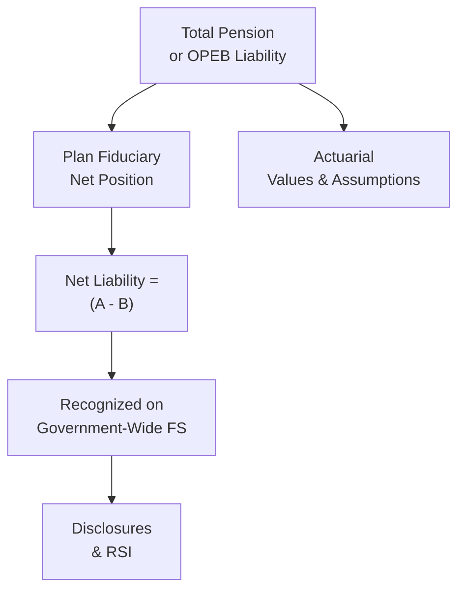

## 22.2 Net Pension Liability and OPEB

Public sector entities often offer retirement and post-employment benefits that extend well beyond the provision of salaries and wages. These benefits, which include pension plans and other post-employment benefits (OPEB), can significantly impact a government’s financial position. To ensure transparency and accountability, regulations—primarily set forth by the Governmental Accounting Standards Board (GASB)—prescribe how state and local governments must measure, present, and disclose net pension liabilities (NPL) and net OPEB liabilities (NOL). These standards aim to help financial statement users understand the long-term costs and funding status associated with these critical benefit programs.

This section provides a deep dive into how governmental entities calculate and report their pension and OPEB obligations, highlighting the impact on both the government-wide financial statements and the disclosures that accompany annual reporting. Familiarity with these standards is paramount for CPA candidates, as these requirements frequently appear in practice and on the BAR (Business Analysis and Reporting) portion of the CPA Exam.

-------------------------------------------------------------------------------

### Importance of Pension and OPEB Accounting

Pension and OPEB accounting underscores the principle that governments must provide transparent and timely information about their promises to current employees, retirees, and beneficiaries. Specifically:

• Pensions: Long-term liabilities for defined benefit plans, such as pensions, can be substantial relative to a government’s overall financial health.  
• OPEB: Reflects non-pension benefits promised to retirees, most commonly health insurance but potentially including life insurance, disability benefits, or legal services.

While these benefits are fundamental to government employment packages, historically, the costs were recognized on a “pay-as-you-go” basis. Modern standards now require recognition of liabilities as benefits are earned, ensuring stakeholders—citizens, watchdogs, creditors, and analysts—comprehend the magnitude of long-term commitments and whether they are sufficiently funded.

-------------------------------------------------------------------------------

### Overview of Relevant GASB Standards

GASB has issued various statements to address measurement and recognition of pension and OPEB obligations. The principal statements include:

• GASB Statement No. 67 & 68: Define how pension plans (GASB 67) and employers (GASB 68) measure and report pension liabilities in the financial statements.  
• GASB Statement No. 74 & 75: Similarly, outline how OPEB plans and employers, respectively, are to report their OPEB liabilities.

Although these standards differ in certain details, the overall methodology to measure net pension and OPEB liabilities often follows a parallel structure:

• Calculate the Total Pension (or OPEB) Liability (TPL or TOL).  
• Subtract the Plan Fiduciary Net Position to arrive at the Net Liability.  
• Recognize the net liability in the government-wide statements, together with deferred outflows/inflows of resources for certain types of gains or losses.

-------------------------------------------------------------------------------

### The Net Pension Liability: Concepts and Calculation

Governments commonly offer defined benefit (DB) pension plans. The net pension liability (NPL) is substantially similar across plans, though specific actuarial assumptions differ. At a high level:

1. **Total Pension Liability (TPL):**  
   - Represents the present value of all projected future pension benefits earned to date by employees and retirees.  
   - Calculated using the Entry Age Normal actuarial cost method.  
   - Demographic, economic, and mortality assumptions (e.g., life expectancy, inflation, salary growth, retirement ages) are used by actuaries.

2. **Plan Fiduciary Net Position (FNP):**  
   - Measures the resources (investments, cash, other assets) held in trust explicitly for paying pension benefits.  
   - Derived from audited financial statements of the pension plan.  
   - Changes can occur due to contributions from employers/employees, investment earnings, and benefits paid out.

3. **Net Pension Liability (NPL):**  
   - The shortfall when TPL exceeds FNP.  
   - NPL = TPL – FNP.  
   - Recognized on the Statement of Net Position at the government-wide level (accrual basis).

4. **Discount Rate Application:**  
   - A single discount rate is used, matching the expected rate of return on plan investments to the extent current assets and future contributions are sufficient to meet projected obligations.  
   - If plan assets alone are insufficient over the projected benefit terms, a high-quality municipal bond index rate is substituted for the shortfall period.

5. **Allocation for Cost-Sharing Plans:**  
   - In multi-employer cost-sharing plans, the NPL is allocated among participating employers according to their proportionate share of contributions.

#### Recognition, Deferred Outflows, and Inflows

When actual experience deviates from assumptions (e.g., differences in mortality, retirement frequency, or investment returns), or when plan assumptions are modified (e.g., discount rate adjustments, changes in expected wage growth), the resulting variances are not recognized immediately. Instead, certain elements are recognized over time as:

• **Deferred Outflows of Resources:** Typically reflect losses (e.g., lower-than-anticipated investment earnings) or changes that increase future pension expense.  
• **Deferred Inflows of Resources:** Generally reflect gains (e.g., higher-than-expected investment earnings) that reduce pension expense over future periods.

These deferred items systematically flow through the pension expense calculation, smoothing out volatility from short-term fluctuations.

-------------------------------------------------------------------------------

### The Net OPEB Liability: Concepts and Approach

Similar to pensions, OPEB (often health-related) can be significant. GASB Statements 74 (for OPEB plans) and 75 (for governments providing OPEB) mirror the pension approach:

1. **Total OPEB Liability (TOL):**  
   - The present value of long-term benefits, including medical insurance or other post-employment offerings.  
   - Uses an actuarial valuation that accounts for healthcare cost growth rates, mortality assumptions, retirement patterns, and coverage elections.

2. **OPEB Plan Fiduciary Net Position:**  
   - The dedicated assets and investments in trust for OPEB payments (if externally held in an OPEB trust).  
   - Many governments use “pay-as-you-go” financing, resulting in minimal assets, but some have begun funding OPEB trusts to offset future obligations.

3. **Net OPEB Liability (NOL):**  
   - The difference between TOL and Plan Fiduciary Net Position.  
   - Recognized as a liability at the government-wide level under accrual accounting.

4. **Discount Rate and Healthcare Trend Rates:**  
   - Unlike pensions, healthcare cost trend rates can experience more volatility (health insurance premiums often outpace general inflation).  
   - Plans must assess the potential rising costs over time.  
   - A blended discount rate may be used if plan assets alone cannot cover projected benefits.

5. **Deferred Outflows and Inflows for OPEB:**  
   - Similar to pension standards, changes in demographic/economic assumptions and actual vs. expected experience result in deferrals that amortize over time, dampening immediate volatility in OPEB expense.

-------------------------------------------------------------------------------

### Reflecting Pension and OPEB in Government-Wide Statements

#### Government-Wide View

Under accrual accounting, the government-wide financial statements (particularly the Statement of Net Position and the Statement of Activities) report the net pension and OPEB liabilities. Key points include:

• **Statement of Net Position:**  
  - Lists the full NPL/NOL as noncurrent liabilities.  
  - Includes deferred outflows and deferred inflows of resources related to changes in assumptions and investment performance.  
  - Provides a more comprehensive view of a government’s long-term fiscal obligations.

• **Statement of Activities:**  
  - Shows pension/OPEB expense for the period, net of any deferrals recognized and any adjustments from changes in assumptions.

• **Note Disclosures and Required Supplementary Information (RSI):**  
  - Entities must disclose significant actuarial assumptions and discount rates used, the changes in net pension/OPEB liability across the reporting period, and sensitivity analyses showing potential impacts of shifting discount or healthcare cost trend rates.  
  - RSI typically includes 10-year trend data, providing insights into whether a government’s liability is growing or shrinking relative to plan assets.

#### Fund-Level Reporting

Governmental funds use the modified accrual basis of accounting. Because pension and OPEB liabilities represent long-term obligations, they are typically not recorded as liabilities in the general fund or other governmental funds unless resources are due and payable at the end of the current period. Instead, the comprehensive disclosure and full-liability recognition take place in the government-wide statements. Proprietary and fiduciary fund statements, on the other hand, use accrual accounting and reflect these liabilities similarly to business-type entities.

-------------------------------------------------------------------------------

### Example: Small City Pension Liability Recognition

Imagine a small city, Townsville, operates a single-employer defined benefit plan for its public safety employees. The total pension liability, determined by an actuarial report, is $45 million. Plan fiduciary net position is $30 million. Therefore:

• Townsville’s Net Pension Liability is $15 million (=$45M – $30M).  
• Since the plan is underfunded, Townsville’s government-wide Statement of Net Position (accrual basis) reports a $15 million liability.  
• If Townsville experiences an unusually large variance in investment returns this fiscal year (say, the plan reported a $2 million shortfall relative to expected returns), the resulting difference is partially reflected in the current year’s pension expense and the remainder is deferred.  
• The Statement of Activities would then show an increased pension expense this year, plus disclosures in the notes and RSI detailing key assumptions (mortality, discount rates, etc.) and sensitivity analyses (what happens if discount rates move up or down one percentage point).

-------------------------------------------------------------------------------

### Example: OPEB Liability for Retiree Health Insurance

Suppose Townsville also offers retiree health insurance, paying a portion of monthly premiums upon retirement. An actuary calculates the total OPEB liability (TOL) as $7 million. Because the city maintains only $1 million in a dedicated OPEB trust:

• Net OPEB Liability is $6 million (=$7M – $1M).  
• Townsville recognizes this $6 million figure on the government-wide Statement of Net Position.  
• The discount rate used might be lower than the pension discount rate if the trust is not sufficiently funded.  
• If medical cost inflation rises faster than expected (e.g., 10% vs. the projected 6%), the plan experiences more significant changes in the TOL, creating additional deferrals and a larger OPEB expense.

-------------------------------------------------------------------------------

### Diagram: Pension and OPEB Liability Flow

Below is a simplified diagram illustrating the flow from total liability to net liability for pensions and OPEB. This visual can help you remember how net liabilities are derived and where they end up on the government’s financial statements.

In practice, actuaries feed demographic and economic assumptions (C) into the calculation of the Total Liability (A). Plan Fiduciary Net Position (B) is subtracted to arrive at the Net Liability (D). The net liability is recognized in the Statement of Net Position (E), with significant details, sensitivities, and historical trend data disclosed in the accompanying notes and Required Supplementary Information (RSI) (F).

-------------------------------------------------------------------------------

### Common Pitfalls and Challenges

1. **Incomplete Actuarial Data:** Errors occur when governments rely on outdated actuarial valuations or incomplete employee data. Ensuring accurate demographic records is crucial.

2. **Overly Optimistic Return Assumptions:** Governments sometimes adopt high expected rates of return on pension/OPEB trust assets. Overestimating returns can understate liabilities. Practitioners must be vigilant and evaluate discount rates critically.

3. **Healthcare Trend Rate Uncertainty:** Medical and pharmaceutical cost increases can fluctuate substantially; thus, OPEB valuations can shift materially from year to year.

4. **Multiple-Employer Plan Allocations:** In cost-sharing plans, each participating employer must verify that its proportionate share calculation is correct. Small errors can become sizeable, especially in large plans.

5. **Presentation vs. Fund Reporting:** Many new CPAs misinterpret why large liabilities do not appear in governmental fund statements. Remember: these are long-term obligations, recognized on the government-wide statements under accrual accounting, not on the modified accrual basis.

-------------------------------------------------------------------------------

### Best Practices for Effective Pension and OPEB Management

• **Regularly Update Actuarial Valuations:** Obtain fresh valuation reports to reflect the latest salary structures, mortality tables, retirement rates, and market conditions.  
• **Adopt Sound Funding Policies:** Strengthen plan investment policies, set realistic discount rates, and consider placing more assets in trust to reduce net liabilities over time.  
• **Enhance Disclosures:** Provide transparent notes and RSI (Required Supplementary Information) to help users contextualize pension and OPEB data, including how funding progress is measured.  
• **Stress Test Assumptions:** Model different scenarios (e.g., adverse market conditions, spike in medical costs) to identify potential risks.  
• **Collaborate with Actuaries:** Engage in thorough discussions to understand key assumptions, ask critical questions about the reasonableness of discount rate choices, and communicate any significant changes in demographic data.  

-------------------------------------------------------------------------------

### Critical Thinking: How NPL and NOL Affect Decision-Making

∙ **Bond Ratings:** High net pension and OPEB liabilities can adversely influence a government’s bond rating, increasing borrowing costs. Stakeholders such as credit rating agencies pay special attention to these metrics.  
∙ **Budgetary Constraints:** Larger liabilities often mean larger required contributions down the road, limiting funds available for other public services.  
∙ **Employee Recruitment and Retention:** Enhanced retirement and post-employment benefits can be attractive to potential employees, but underfunded plans pose long-term risks that can eventually lead to reduced benefits or higher employee contributions.  

-------------------------------------------------------------------------------

### Case Study: Underestimating Pension Contributions

Riverdale City sponsors a defined benefit pension plan with a target rate of return at 7.5%. Over three consecutive years, the actual rate of return was only 4%. This discrepancy led to:

• An increase in the net pension liability as the plan’s fiduciary net position eroded relative to the total liability.  
• More substantial deferred outflows of resources relating to lower-than-expected plan investment earnings.  
• A significant increase in future pension expenses, pressing the City Council to either increase its annual pension contributions or adjust benefits.

This real-world scenario accentuates the delicate relationship between actuarial assumptions and actual market performance. Overoptimistic assumptions can mask the true scale of obligations and potentially jeopardize a government’s financial stability.

-------------------------------------------------------------------------------

### References for Further Exploration

• GASB Statements No. 67, 68, 74, and 75, available at the Governmental Accounting Standards Board website (https://www.gasb.org).  
• Government Finance Officers Association (GFOA) Best Practices on Pension and OPEB administration (https://www.gfoa.org/).  
• American Institute of CPAs (AICPA) Governmental Accounting and Auditing Guides.  
• Educational resources from the National Association of State Retirement Administrators (NASRA), focusing on pension plan trends in the public sector.

-------------------------------------------------------------------------------

## Test Your Knowledge: Government Pension and OPEB Liabilities Quiz



### In government-wide financial statements, net pension liability is typically calculated as:

- [ ] Total pension liability plus plan fiduciary net position.
- [x] Total pension liability minus plan fiduciary net position.
- [ ] The present value of future benefit payments plus estimated OPEB obligations.
- [ ] None of the above.

> **Explanation:** The net pension liability is computed by subtracting plan fiduciary net position (the assets dedicated to cover pension payments) from the total pension liability (the present value of future pension benefits).

### Which factor most influences the discount rate used in measuring a government’s net pension liability?

- [x] Expected rate of return on plan investments, supplemented by a municipal bond rate if assets are projected to be insufficient.
- [ ] Inflation increases alone.
- [ ] The Consumer Price Index (CPI).
- [ ] Annual changes in the municipal bond market unrelated to plan funding.

> **Explanation:** GASB standards require using the expected long-term rate of return on plan investments, moving to a municipal bond rate only for projected periods where plan assets will not cover benefit payments.

### In a cost-sharing multiple-employer pension plan, each participating employer's net pension liability is determined:

- [ ] Through a negotiated percentage of overall plan assets by the plan’s actuary.
- [x] By allocating the plan’s collective net pension liability based on each employer’s proportionate share of contributions.
- [ ] By dividing the total pension liability equally among all employers.
- [ ] Based solely on the employer’s size and total payroll.

> **Explanation:** GASB cost-sharing provisions require the total net pension liability be allocated to each participating employer based on its proportionate share of total contributions or another reasonable basis determined by the plan.

### Why is the healthcare cost trend rate critical when measuring OPEB liabilities?

- [x] Rising healthcare costs can significantly influence projected benefit payments and, ultimately, the TOL.
- [ ] It has no impact on the TOL; only discount rates matter.
- [ ] The OPEB liability is always the same regardless of healthcare cost trends.
- [ ] The trend rate solely affects the pension portion of the liability.

> **Explanation:** Healthcare cost trend rates can escalate rapidly, raising the total projected OPEB liability. Accurate projections are essential to avoid understating the government’s financial obligations.

### Deferred outflows of resources related to pension and OPEB generally arise when:

- [x] Actual investment returns fall short of expectations, or other factors increase future pension/OPEB expense.
- [ ] A government decides to switch from a defined contribution plan to a defined benefit plan.
- [x] Demographic or economic changes lead to higher than anticipated liabilities.
- [ ] The government invests in more conservative asset classes.

> **Explanation:** Under GASB standards, certain losses (e.g., lower-than-expected investment earnings) and assumption changes that increase liabilities are recognized as deferred outflows and systematically amortized into expense over future periods.

### Which statement about fund-level vs. government-wide reporting of pension liabilities is correct?

- [x] Governmental funds typically do not show the full net pension liability because they use the modified accrual basis.
- [ ] NPL is always recorded in governmental funds and never in the government-wide statements.
- [ ] Government-wide statements use the modified accrual basis for pension liabilities.
- [ ] Fund-level statements always reflect the net pension liability in full.

> **Explanation:** Governmental funds focus on short-term resources under the modified accrual basis. Full pension liability recognition occurs in the government-wide statements, presented on an accrual basis.

### Which of the following is a best practice for managing net OPEB liability?

- [x] Regularly obtaining updated actuarial valuations.
- [ ] Ignoring changes in healthcare cost trends.
- [x] Funding an OPEB trust to reduce long-term obligations.
- [ ] Minimizing note disclosures to prevent confusion.

> **Explanation:** Routine valuations ensure accurate measurements. Funding an OPEB trust offsets liabilities by establishing plan assets. Disclosures should be transparent, not minimized.

### What is the major difference between pensions and OPEB that actuaries must consider?

- [ ] Pension costs normally exceed OPEB costs.
- [ ] OPEB only includes legal services.
- [ ] Pensions have longer lives for obligations than OPEB.
- [x] OPEB commonly includes healthcare, which uses a healthcare trend rate that can be more volatile over time.

> **Explanation:** The healthcare trend rate introduces additional complexity in OPEB valuations that is different from purely wage-based assumptions in pension calculations.

### How does an optimistic rate of return assumption affect net pension liability?

- [x] It typically understates the net pension liability because it reduces the present value of future obligations.
- [ ] It has no effect on net pension liabilities since investments are not guaranteed.
- [ ] It overstates net pension liability.
- [ ] It doubles the net pension liability to reflect additional risk.

> **Explanation:** A higher rate of return assumption lowers the present value of benefit payments, making the net liability look smaller—but it may not be realistic, resulting in underreporting of true obligations.

### A government is required to recognize the net pension liability:

- [x] In its government-wide financial statements, on an accrual basis.
- [ ] Only when the government is late on pension payments.
- [ ] Exclusively in proprietary funds.
- [ ] Only when state law mandates it.

> **Explanation:** Accrual accounting in government-wide financial statements captures the full net pension liability, ensuring stakeholders see the total scale of pension obligations.



-------------------------------------------------------------------------------

## For Additional Practice and Deeper Preparation

### [Business Analysis and Reporting (BAR) CPA Mock Exams](https://www.udemy.com/course/bar-cpa-mock-exams/?referralCode=ADBE2E84BEE9CB6243CA)

**Business Analysis and Reporting (BAR) CPA Mocks:** 6 Full (1,500 Qs), Harder Than Real! In-Depth & Clear. Crush With Confidence!

- Tackle full-length mock exams designed to mirror real BAR questions.  
- Refine your exam-day strategies with detailed, step-by-step solutions for every scenario.  
- Explore in-depth rationales that reinforce higher-level concepts, giving you an edge on test day.  
- Boost confidence and minimize anxiety by mastering every corner of the BAR blueprint.  
- Perfect for those seeking exceptionally hard mocks and real-world readiness.  

_Disclaimer: This course is not endorsed by or affiliated with the AICPA, NASBA, or any official CPA Examination authority. All content is for educational and preparatory purposes only._
