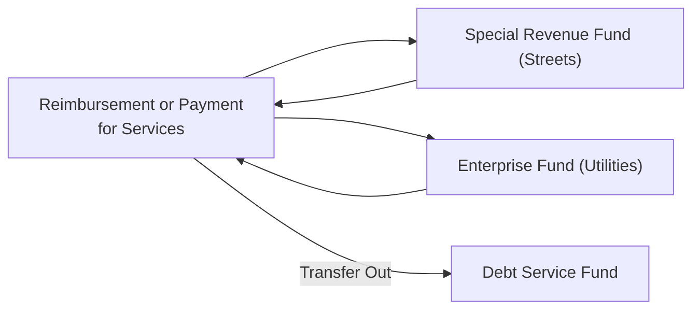

## 22.3 Interfund Transactions

Interfund transactions are flows of resources between different funds within a state or local government entity. Because these funds often serve distinct purposes and employ varying measurement focuses and bases of accounting, correctly identifying, classifying, and recording interfund transactions is essential to maintain the integrity and accuracy of governmental financial reports. This section provides a detailed overview of reciprocal vs. nonreciprocal interfund transactions, focusing on common categories such as interfund services, transfers, and reimbursements. Properly accounting for these transactions is a crucial step in ensuring that a government’s financial statements reflect a faithful representation of all resource flows.

---------------------------------------------------------------------------

### Overview and Importance
State and local governments often adopt a fund structure (as introduced in Chapter 19) to track and control resources associated with specific activities. Interfund transactions occur when one fund provides goods or services, receives a transfer, or reimburses another fund for expenditures or expenses. These transactions must be recorded and disclosed carefully to:

• Prevent double-counting revenues and expenditures/expenses.  
• Demonstrate accountability for resources.  
• Comply with governmental accounting standards established by GASB.  
• Provide transparency to stakeholders about resource flows.

In government-wide financial statements (prepared using the economic resources measurement focus and the accrual basis of accounting), many interfund transactions are eliminated to avoid overstating activity at the government-wide level. However, at the individual fund level, these transactions must be reported accurately to highlight how each fund is managing its assigned resources.

---------------------------------------------------------------------------

### Reciprocal vs. Nonreciprocal Transactions
Interfund transactions are typically categorized as either reciprocal or nonreciprocal. The distinction is founded on the concept of “exchange or exchange-like value”:

• Reciprocal transactions plant the idea of exchange or exchange-like value flowing between funds.  
• Nonreciprocal transactions involve transfers of resources without an equivalent exchange of goods or services.

This classification affects the accounts used and how governments present these transactions on the financial statements (for example, as revenues and expenses or as transfers).

#### Reciprocal Interfund Transactions
Reciprocal transactions behave similarly to transactions an organization might conduct with external entities, except they occur within different funds of the same government. Common examples include:

1. Interfund Services Provided and Used  
2. Interfund Loans  

#### Nonreciprocal Interfund Transactions
Nonreciprocal transactions do not involve an exchange of goods or services for payment. Instead, they reflect internal reallocations of revenues or expenses/expenditures. Common examples include:

1. Interfund Transfers  
2. Interfund Reimbursements  

Below is a high-level comparison that highlights the distinctive nature of reciprocal vs. nonreciprocal interfund transactions:

|                          | Reciprocal Interfund Transactions           | Nonreciprocal Interfund Transactions               |
|--------------------------|---------------------------------------------|----------------------------------------------------|
| Nature of Exchange       | Exchange-like (value given for value)       | No direct exchange or equivalence of value         |
| Accounting Treatment     | Recognized similarly to external transactions (revenue, expense) | Classified as transfers or reimbursements, not typically shown as revenue or expense unless meeting criteria |
| Examples                 | Interfund services, interfund loans         | Interfund transfers, interfund reimbursements      |

---------------------------------------------------------------------------

### Common Types of Interfund Transactions

#### 1. Interfund Services Provided and Used (Reciprocal)
An interfund service transaction arises when one fund provides services or goods to another fund, and there is an expectation of payment. This type of arrangement resembles a normal, arm’s-length exchange. Common examples include:

• The General Fund providing administrative services (e.g., human resources, accounting) to an Enterprise Fund.  
• The Internal Service Fund delivering IT support to the Special Revenue Fund.  

In these cases:  
• The fund providing the service (e.g., the General Fund) records revenue and recognizes a receivable (Due from Other Funds).  
• The fund receiving the service (e.g., the Enterprise Fund) records expenditure or expense (depending on fund type) and recognizes a payable (Due to Other Funds).

Below is a simplified illustration in Mermaid flowchart form, showing a reciprocal transaction where one fund provides a service to another and expects payment.

In government-wide financial statements, these revenues and expenses remain intact, but if both funds are governmental activities or business-type activities, the amounts may be eliminated in consolidation. However, in individual fund statements, it is crucial to reflect them accurately to highlight each fund’s specific operational and financial responsibilities.

---------------------------------------------------------------------------

#### 2. Interfund Loans (Reciprocal)
Interfund loans occur when one fund lends cash or other assets to another fund with the expectation of repayment. They are reported as either “Due To/From Other Funds” (short-term loans) or “Advances To/From Other Funds” (long-term loans). Key points include:

• Interest rates may be established (especially for extended loan durations).  
• Short-term loans typically reflect working capital needs.  
• Long-term loans must be clearly identified as noncurrent assets and liabilities, often labeled “Advance To/From Other Funds.”  

Repayment of principal and interest follows standard debt servicing procedures (albeit within the same government). Typically, no revenue or expenditure is recognized at the initial loan date because it is not an exchange for goods or services. Instead, an asset (Due From or Advance To) is recorded in the lending fund, and a corresponding liability (Due To or Advance From) is recorded by the borrowing fund.

---------------------------------------------------------------------------

#### 3. Interfund Transfers (Nonreciprocal)
Interfund transfers represent flows of assets without any expectation of equivalent exchange or repayment. A transfer might be made for a variety of reasons, such as:

• Moving unrestricted revenues collected in the General Fund to a Debt Service Fund to pay off debt.  
• Allocating resources from an Enterprise Fund to the General Fund to help fund administrative activities.  
• Shifting balances from a Special Revenue Fund upon project completion.  

On the fund financial statements, transfers typically appear as “Other Financing Sources” in the fund receiving the transfer and “Other Financing Uses” in the fund providing the transfer. These are not recorded as revenue or expenditure/expense because no exchange of goods or services has occurred.

Moreover, in government-wide financial statements, many transfers between governmental funds are eliminated to avoid inflating both revenues and expenditures artificially. However, transfers between governmental and enterprise (proprietary) funds often remain visible in the government-wide statements as part of the reconciliation between governmental activities and business-type activities.

Below is a Mermaid flowchart illustrating a nonreciprocal interfund transfer:

In this simplified diagram, the General Fund is sending resources to the Debt Service Fund to ensure there is adequate funding to pay principal and interest on outstanding debt.

---------------------------------------------------------------------------

#### 4. Interfund Reimbursements (Nonreciprocal)
Interfund reimbursements occur when one fund initially records a cost (expenditure or expense) but another fund is ultimately responsible for that cost. When the second fund pays the first fund, the expenditure or expense is reversed in the first fund, and the second fund records the appropriate charge. Key points are:

• Commonly arise if the General Fund covers a utility bill on behalf of the Enterprise Fund, and then the Enterprise Fund reimburses the General Fund.  
• The purpose is to ensure the expense is ultimately reported in the correct fund.  
• A reimbursement reverses the initially recorded cost in the fund that made the temporary payment.

For reimbursement transactions, the fund that initially paid the expense should remove (credit) its expenditure or expense account, so that the costs are recognized in the fund that is ultimately liable. This ensures that the financial statements accurately reflect which fund bears responsibility for the cost.

---------------------------------------------------------------------------

### Accounting and Reporting Implications
While the overarching concepts behind interfund transactions are straightforward, their accounting treatment demands careful attention. Key considerations:

1. **Accounts to Use**  
   • “Due From/To Other Funds” for short-term balances.  
   • “Advances To/From Other Funds” for longer-term interfund obligations.  
   • “Interfund Transfer In/Out” or “Other Financing Sources/Uses” for nonreciprocal transfers.  
   • “Reimbursements” involve a two-step process: reversing the expenditure or expense from one fund and properly recording it in another.

2. **Measurement Focus and Basis of Accounting**  
   • Governmental funds (using modified accrual) record the expenditure at the time the fund liability is incurred.  
   • Proprietary and Fiduciary funds (using accrual) recognize expenses when economic benefits are consumed.  
   • Differences in recognition points can create complexities in recording the timing of receivables/payables.  

3. **Eliminations in Government-Wide Statements**  
   • Many interfund transactions are eliminated within governmental activities or business-type activities.  
   • Transfers between government-wide and enterprise activities remain for external financial reporting if they cross the boundary of governmental vs. business-type activities.  

4. **Reporting Disclosure**  
   • Governments should disclose the nature and extent of significant interfund balances, loans, and transfers as required by GASB standards.  
   • Notes to the financial statements often detail the purpose of major transfers, outstanding repayment obligations, and reimbursement arrangements.

---------------------------------------------------------------------------

### Practical Examples and Journal Entries
Below is a set of simplified examples that illustrate core interfund transactions:

#### Example 1: Interfund Services Provided and Used
• Scenario: The General Fund provides accounting support to the Water Enterprise Fund, billing $10,000 for the month.  

General Fund (Provider)  
Dr. Due From Water Enterprise Fund ………… $10,000  
Cr. Interfund Services Revenue …………………… $10,000  

Water Enterprise Fund (Receiver)  
Dr. Utility Expense (or Professional Services) … $10,000  
Cr. Due To General Fund ……………………………… $10,000  

#### Example 2: Interfund Transfer
• Scenario: The General Fund transfers $50,000 to a Capital Projects Fund to finance a new municipal park improvement project.  

General Fund (Transfer Out)  
Dr. Other Financing Uses – Transfer Out ………… $50,000  
Cr. Cash …………………………………………………………… $50,000  

Capital Projects Fund (Transfer In)  
Dr. Cash …………………………………………………………… $50,000  
Cr. Other Financing Sources – Transfer In ……… $50,000  

#### Example 3: Interfund Loan
• Scenario: The General Fund loans $200,000 in cash to an Internal Service Fund to cover a short-term working capital shortage. The loan will be repaid at the end of the fiscal year.  

General Fund (Lender)  
Dr. Due From Internal Service Fund ……… $200,000  
Cr. Cash ………………………………………………… $200,000  

Internal Service Fund (Borrower)  
Dr. Cash ………………………………………………… $200,000  
Cr. Due To General Fund ………………………… $200,000  

#### Example 4: Interfund Reimbursement
• Scenario: The General Fund pays a $5,000 software maintenance invoice that should have been the responsibility of the IT Internal Service Fund. The Internal Service Fund reimburses the General Fund.  

Step 1: General Fund initially records the expenditure:  
Dr. Expenditures …………………………………… $5,000  
Cr. Cash ………………………………………………… $5,000  

Step 2: Internal Service Fund reimburses the General Fund, and the General Fund reverses the expenditure:  

General Fund (Recipient of Reimbursement)  
Dr. Cash ………………………………………………… $5,000  
Cr. Expenditures (reverse original charge) … $5,000  

Internal Service Fund (Responsible Payer)  
Dr. Expense ……………………………………………… $5,000  
Cr. Cash …………………………………………………… $5,000  

---------------------------------------------------------------------------

### Best Practices and Common Pitfalls
Accurate classification of interfund transactions is a central challenge in governmental accounting. The following tips can help ensure reliability:

• Establish clear written policies that outline how to distinguish between reciprocal and nonreciprocal transactions.  
• Practice consistent naming conventions for general ledger accounts (e.g., “Interfund Service Revenue,” “Due From Other Funds,” “Transfers Out,” etc.).  
• Use scheduling tools or checklists to monitor outstanding interfund balances and loan repayment terms.  
• Monitor timely settlement of Due To/From accounts to minimize the risk that short-term receivables become inadvertently long-term.  
• Always maintain adequate documentation, such as internal invoices, memos outlining the purpose of transfers, and confirmations for reimbursements.

#### Common Pitfalls to Avoid
1. **Misclassifying Transfers as Revenues**: Nonreciprocal transfers should not inflate reported revenues.  
2. **Neglecting Reimbursement Reversals**: Failing to perform the reversal entry could lead to double-counting expenditures.  
3. **Ignoring Year-End Accruals**: Overlooking the accrual basis for proprietary funds or the modified accrual basis for governmental funds can cause timing mismatches.  
4. **Late Resolution of Interfund Receivables/Payables**: Delays in clearing “Due To/From” balances create confusion, as short-term obligations become indefinite.  

---------------------------------------------------------------------------

### Real-World Applications and Case Study
Consider a scenario where a city’s General Fund manages centralized purchasing for all departments. Over a fiscal year, the General Fund buys various items for the Water Utility Fund (enterprise), the Streets Maintenance Fund (special revenue), and the Parks and Recreation Fund (another special revenue). It then allocates the professional services costs proportionally based on each fund’s usage.  

• The centralized approach streamlines vendor payments, but it may obscure clarity about which fund consumes which resources if not tracked meticulously.  
• Each departmental fund must ultimately reimburse the General Fund or record interfund services used.  
• Proper recordkeeping ensures that the city’s Comprehensive Annual Financial Report (CAFR) fairly states the true expenses of each fund and that no fund is subsidized inadvertently unless specifically approved by a policy or resolution.

---------------------------------------------------------------------------

### Diagrams: Flow of Interfund Transactions
The following Mermaid diagram provides a more comprehensive visual of some possible flows between a General Fund and various other funds:

Explanation of the diagram:

• The General Fund acts as a central hub for shared services and receives payment (reimbursement) from Special Revenue and Enterprise Funds for goods or services.  
• The General Fund might transfer resources to the Debt Service Fund (nonreciprocal transfer) to cover principal and interest on bonds.  
• These internal flows are recorded in the corresponding “Due From/To” or “Transfer In/Out” accounts, ensuring that the cost burden or financing flows are accurately assigned.

---------------------------------------------------------------------------

### Strategies for Effective Interfund Management
• Maintain a robust chart of accounts that includes unique identifiers for interfund transactions.  
• Employ charge-back systems and detailed documentation to track costs allocated among funds.  
• Conduct regular internal audits of entries labeled as “Interfund” to ensure accurate classification, especially at year-end.  
• Clarify responsibilities and usage rules for each fund so that users understand whether a transaction constitutes a service, a transfer, or a reimbursement.  

---------------------------------------------------------------------------

### References for Further Exploration
• GASB Codification Section 1800: Comprehensive guidance on classification and presentation of interfund transactions.  
• Government Finance Officers Association (GFOA) best practices in interfund activities.  
• Chapter 19 (Governmental Accounting Fundamentals), Chapter 20 (Preparing Governmental Financial Statements), and Chapter 21 (Reconciliations and Government-Wide Reporting) for more context on fund structures and measurement focuses.  
• Additional training materials on government-wide conversion and elimination entries.

---------------------------------------------------------------------------

## Mastering Interfund Transactions: Top Questions to Test Your Understanding



### Interfund transfers typically appear in fund financial statements as which of the following?
- [ ] Revenues and expenditures
- [x] Other Financing Sources and Uses
- [ ] Due To/From balances
- [ ] Current assets and current liabilities

> **Explanation:** Interfund transfers are nonreciprocal transactions and they are normally reported as Other Financing Sources (in the receiving fund) and Other Financing Uses (in the providing fund), not as revenues and expenditures.

### Which of the following best describes reciprocal interfund transactions?
- [x] Exchange-like transactions where each fund receives something of approximate equal value
- [ ] Flows of resources with no repayment requirement
- [ ] Transfers recorded as Other Financing Sources and Uses
- [ ] Loans with no interest rate or repayment terms

> **Explanation:** Reciprocal transactions are exchange or exchange-like transactions, mirroring typical business transactions, in which each fund receives direct value.

### In government-wide financial statements, which of the following is TRUE regarding many interfund transactions among governmental funds?
- [x] They are eliminated so as not to inflate total government revenues and expenditures.
- [ ] They are aggregated and reported under a single line item called “Interfund Activity.”
- [ ] They are recognized as external transactions and remain on the statements.
- [ ] They are automatically capitalized as intangible assets.

> **Explanation:** Interfund transactions between governmental funds are often eliminated in government-wide statements to avoid double-counting, ensuring the focus is on external transactions.

### Which of the following is a nonreciprocal interfund transaction?
- [ ] Interfund services provided and used
- [x] Interfund reimbursements
- [ ] Interfund loans
- [ ] All exchange-related transactions

> **Explanation:** Interfund reimbursements are considered a nonreciprocal transaction because they do not involve a new exchange of value; rather, they correct payments made on behalf of another fund.

### When the General Fund pays for an expense that should have been charged to the Internal Service Fund, and the Internal Service Fund repays that cost, the General Fund should:
- [x] Reverse the earlier expenditure recorded and record the reimbursement.
- [ ] Recognize additional revenue equal to the reimbursement.
- [x] Record Other Financing Uses upon receipt of payment.
- [ ] Record a capital outlay expenditure.

> **Explanation:** In an interfund reimbursement, the first fund removes the expenditure it initially recorded, allowing the second fund to record the correct expenditure. No new exchange revenue is recognized.

### Which account classification typically records a short-term interfund loan obligation owed by a fund?
- [x] Due To Other Funds
- [ ] Transfers Out
- [ ] Deferred Inflows of Resources
- [ ] Other Financing Uses

> **Explanation:** Short-term obligations between funds are recorded as Due To Other Funds (liability) and the lending fund records Due From Other Funds (asset).

### Which of the following pieces of information is generally required in the footnotes when disclosing interfund transactions?
- [x] The nature, purpose, and balances of significant interfund activity
- [ ] Only the interest rate charged between funds
- [x] Organizational charts but no monetary amounts
- [ ] Long-term capital projects and related bond liabilities

> **Explanation:** GASB standards require disclosure of the nature, purpose, and balances of significant interfund transactions in the notes, providing transparency to users.

### Interfund services provided and used typically charge the receiving fund for which classification?
- [x] Expenditure (in a Governmental Fund) or Expense (in a Proprietary Fund)
- [ ] Other Financing Uses
- [ ] Encumbrances
- [ ] Fund Balance

> **Explanation:** When a fund receives goods or services from another fund, it recognizes it similarly to external transactions, as an expenditure (in governmental funds) or an expense (in proprietary funds).

### Why must certain interfund transactions be eliminated in the government-wide financial statements?
- [x] To prevent overstating governmental activities’ overall revenues and expenses
- [ ] Because the accounts cannot be reconciled
- [ ] To eliminate net position in fiduciary funds
- [ ] To accelerate the timing of revenue recognition

> **Explanation:** Interfund transactions among governmental funds are eliminated to ensure that revenues and expenses are not double-counted, providing a clearer picture of the governmental entity’s activities as a whole.

### A true statement regarding interfund loans is:
- [x] They are reported as Due To/From or Advances To/From depending on their term duration.
- [ ] They cannot charge interest among governmental funds.
- [ ] They must be recorded as revenue and expenditure simultaneously.
- [ ] They are never subject to any repayment terms.

> **Explanation:** Interfund loans can be either short-term or long-term. For short-term, they are Due To/From; for long-term, they are Advances To/From. Repayment terms and interest may apply, but they are not recognized as revenues or expenditures upon issuance.



---------------------------------------------------------------------------

## For Additional Practice and Deeper Preparation

### [Business Analysis and Reporting (BAR) CPA Mock Exams](https://www.udemy.com/course/bar-cpa-mock-exams/?referralCode=ADBE2E84BEE9CB6243CA)

**Business Analysis and Reporting (BAR) CPA Mocks:** 6 Full (1,500 Qs), Harder Than Real! In-Depth & Clear. Crush With Confidence!

- Tackle full-length mock exams designed to mirror real BAR questions.  
- Refine your exam-day strategies with detailed, step-by-step solutions for every scenario.  
- Explore in-depth rationales that reinforce higher-level concepts, giving you an edge on test day.  
- Boost confidence and minimize anxiety by mastering every corner of the BAR blueprint.  
- Perfect for those seeking exceptionally hard mocks and real-world readiness.

_Disclaimer: This course is not endorsed by or affiliated with the AICPA, NASBA, or any official CPA Examination authority. All content is for educational and preparatory purposes only._
