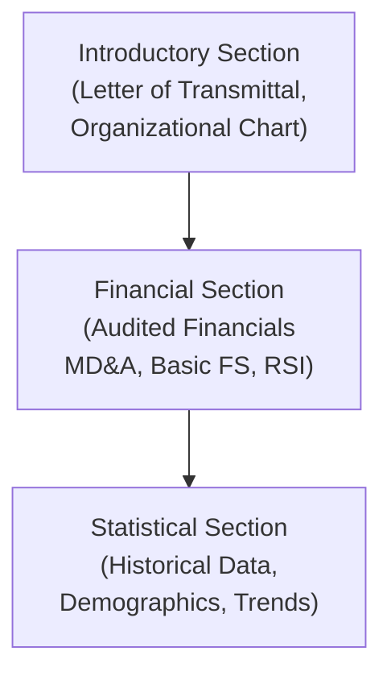
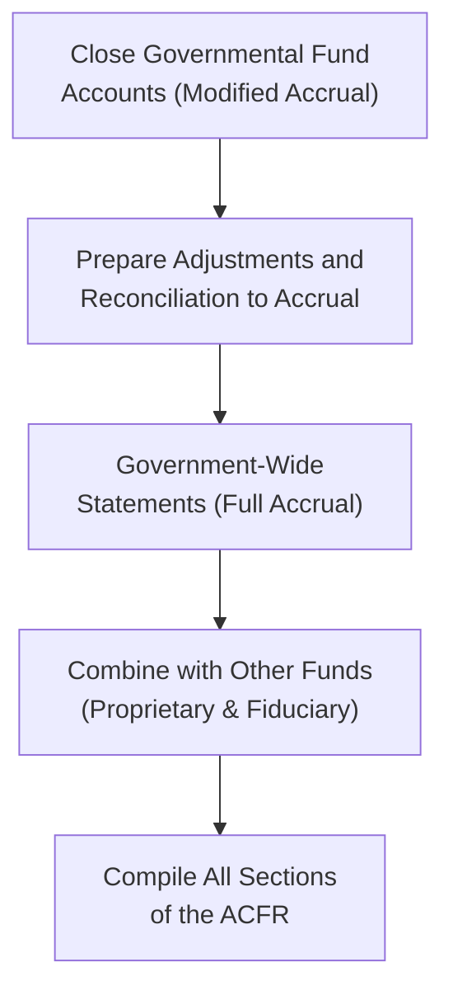

## 22.4 Closing Entries and ACFR Components

Closing entries in governmental accounting differ significantly from those in the for-profit or even nonprofit sectors. Governmental organizations must adhere to the modified accrual basis of accounting for their funds, reconcile their activities to government-wide financials on a full accrual basis, and prepare a complete Annual Comprehensive Financial Report (ACFR) that fairly represents their financial position and changes therein. This section delves into the step-by-step process of closing governmental funds, addresses key considerations for year-end closing of budgetary accounts and encumbrances, and outlines the components and structure of the ACFR based on Governmental Accounting Standards Board (GASB) requirements.

--------------------------------------------------------------------------------
## Overview

Governmental funds operate under the current financial resources measurement focus, which measures inflows and outflows of expendable (typically cash) resources. As a result:

• Revenues are recorded when they become both measurable and available.  
• Expenditures are recognized when the related liability is incurred (with some exceptions such as debt service on long-term debt).  

Importantly, government accounting also employs budgetary accounts—Estimated Revenues, Appropriations, and other budgetary control elements—to ensure compliance and accountability with legally adopted budgets.

The Annual Comprehensive Financial Report (ACFR) is prepared to communicate a government’s overall financial health, including both government-wide and fund-level statements, as well as required supplementary information (RSI). The ACFR comprises an Introductory Section, Financial Section, and Statistical Section. Each component facilitates transparency, comparability, and insight into the finances of state or local governments.

--------------------------------------------------------------------------------
## Closing Entries for Governmental Funds

Closing entries in governmental accounting typically occur at the end of the fiscal year to “close out” nominal accounts (i.e., temporary accounts) so that fund balances reflect the net results of each fund’s activities. Let us review each step in detail.

### Step 1: Close Budgetary Accounts
Budgetary accounts reflect the government’s planned and authorized revenues and expenditures. Before closing them, the organization must ensure all budgetary amendments, transfers, and supplemental appropriations are recorded.

Common budgetary accounts include:
• Estimated Revenues  
• Appropriations  
• Budgetary Fund Balance (or Encumbrances, if recognized in certain systems)

At year-end, it is necessary to reverse or close the net effect of all budgetary entries so that these budgetary accounts do not affect the new fiscal year.

Below is a simplified illustration of typical budgetary account closings:

1. Debit Appropriations and Credit Estimated Revenues to reverse their original entries.  
2. Debit or credit Budgetary Fund Balance to balance the entry.  

At this point, the government entity effectively removes any residual budgetary activity, ensuring the new fiscal year starts with a clean slate.

### Step 2: Close Operating (Nominal) Accounts
Similar to closing entries in commercial accounting, government funds also need to reset nominal account balances—Revenues, Expenditures, and Other Financing Sources/Uses. This step results in the year-end net change being transferred into the Fund Balance account.

For example, if the fund has realized more revenues than expenditures in a given period, the credit side of the closing entry will be to Fund Balance, reflecting an increase. Conversely, if expenditures outpaced revenues, Fund Balance will be debited to reflect a decrease.

1. Debit all Revenue accounts and credit Expenditure accounts to zero them out.  
2. The balancing entry is either a debit or credit to Fund Balance, depending on whether net resources have increased or decreased.

### Step 3: Address Encumbrances
Encumbrances are commitments related to unperformed (executory) contracts for goods or services. At year-end, there can be two scenarios:

• Encumbrances Lapse: Under modified accrual accounting, unexpended encumbrances may be “closed” or carried forward into the next period if authorized by law or policy. A new appropriation might be necessary in the next budget cycle to fulfill these obligations.  
• Encumbrances Do Not Lapse: In some cases, the government may re-establish encumbrances in the new fiscal year, effectively rolling them forward to ensure completeness of budget control.

Either way, adjusting journal entries (AJEs) will be made to ensure encumbrances reported in the old fiscal year either close out or roll forward appropriately into the new fiscal year. This process also ensures that budget-to-actual comparisons remain meaningful and reflect proper controls over spending authority.

### Step 4: Transfer Residual Balances
Fund Balance is classified in governmental funds according to five possible categories (nonspendable, restricted, committed, assigned, or unassigned). Governments must ensure each fund’s ending balance is properly allocated among these categories based on constraints or specific future uses approved by external bodies or the sponsoring government body.

--------------------------------------------------------------------------------
## Practical Example of Closing Entries

Below is a simplified illustration reflecting typical year-end closing entries for the General Fund of a small city, focusing on the big-picture accounts. Assume the budgetary accounts and operating accounts have the following balances:

• Estimated Revenues: $3,000,000  
• Appropriations: $2,900,000  
• Actual Revenues (Revenue account): $2,950,000  
• Actual Expenditures (Expenditure account): $2,850,000  

An excerpt of typical closing entries might look like this:

1) Closing Budgetary Accounts

(1)  
  Dr. Appropriations 2,900,000  
  Cr. Estimated Revenues 3,000,000  
  Cr. Budgetary Fund Balance 100,000  

Now the net effect of budgetary accounts is neutralized.

2) Closing Nominal Operating Accounts

(2)  
  Dr. Revenue 2,950,000  
  Cr. Expenditure 2,850,000  
  Cr. Fund Balance 100,000  

After this entry, the revenue and expenditure accounts are brought to zero, and Fund Balance has been increased by $100,000, representing the net “surplus.”  

3) Addressing Encumbrances (assuming no lapses)

If there were existing encumbrances outstanding for $50,000, the municipality would typically remove or close these encumbrances at year-end and reestablish them in the subsequent fiscal year if legally permitted. For instance:

(3) Year-End Removal of Encumbrances  
  Dr. Budgetary Fund Balance—Reserve for Encumbrances 50,000  
  Cr. Encumbrances  50,000  

(4) Beginning of Next Year to Reestablish Encumbrances  
  Dr. Encumbrances 50,000  
  Cr. Budgetary Fund Balance—Reserve for Encumbrances 50,000  

These steps ensure that budgetary control over committed funds continues into the new fiscal year.  

--------------------------------------------------------------------------------
## Introduction to the Annual Comprehensive Financial Report (ACFR)

Once funds are closed and balances are properly stated, the governmental entity proceeds to prepare the Annual Comprehensive Financial Report (ACFR). The ACFR is the official name for the report previously known as the Comprehensive Annual Financial Report; the updated terminology alleviates undesirable homophones in the acronym and aligns with current GASB guidance.

An ACFR aims to provide detailed insight into the financial performance and condition of a government across multiple dimensions, ensuring transparency and accountability. Although each government may organize its report slightly differently, GASB guidelines (particularly GASB Statement No. 34 and subsequent statements) establish a recommended minimum structure.

### ACFR Structure
Typically, the ACFR is divided into three main sections:

1. Introductory Section  
2. Financial Section  
3. Statistical Section  

Below is a Mermaid diagram illustrating a high-level overview of the ACFR structure:

Each section includes different components:

• Introductory Section: Typically contains a letter of transmittal from financial officers or executives, an organizational chart, a list of principal officials, and other background context.  

• Financial Section: The most substantial section, presenting the independent auditor’s report, Management’s Discussion and Analysis (MD&A), the government-wide and fund-level financial statements, notes to the financial statements, and the required supplementary information (RSI).  

• Statistical Section: A compilation of trend data related to financial, demographic, economic, and operational measures over multiple years. This information allows users to analyze changes and trends in the government’s finances and service capacity.

--------------------------------------------------------------------------------
## Detailed Components of the Financial Section

Given its central role in demonstrating accountability, the Financial Section is commonly subdivided into these parts:

1. Management’s Discussion and Analysis (MD&A)  
   MD&A provides an overview of the government’s operations and financial results for the fiscal year. It is presented before the financial statements and notes, offering context such as significant economic factors, changes in services, and capital activities.

2. Basic Financial Statements  
   a. Government-Wide Financial Statements:  
      • Statement of Net Position (full accrual basis, focusing on economic resources).  
      • Statement of Activities (full accrual basis, reflecting expenses and program revenues).  

   b. Fund Financial Statements:  
      • Governmental Funds: Balance Sheet and Statement of Revenues, Expenditures, and Changes in Fund Balances.  
      • Proprietary Funds: Statement of Net Position, Statement of Revenues, Expenses, and Changes in Net Position, Statement of Cash Flows.  
      • Fiduciary Funds: Statement of Fiduciary Net Position, Statement of Changes in Fiduciary Net Position.  

   c. Notes to the Financial Statements:  
      These notes offer essential disclosures explaining the accounting policies, commitments, contingencies, and detailed schedules required for complete transparency.

3. Required Supplementary Information (RSI)  
   This section often includes budget-to-actual comparisons for major governmental funds and disclosures regarding pensions and other post-employment benefits. RSI can also contain schedules mandated by GASB to help readers further evaluate trends and policy compliance.

--------------------------------------------------------------------------------
## Statistical Section

The Statistical Section supplies detailed data in five distinct categories, typically spanning at least ten years. According to GASB Statement No. 44, the categories typically include:

• Financial Trends  
• Revenue Capacity  
• Debt Capacity  
• Demographic and Economic Information  
• Operating Information  

This data provides historical perspective and insight into how the government’s financial condition and performance have evolved. Readers can observe the effect of economic cycles, significant capital projects, demographic shifts, and changes in service demands over time.

--------------------------------------------------------------------------------
## Putting It All Together: From Closing Entries to ACFR

The journey from closing entries to a published ACFR involves multiple layers of reconciliation and reporting. After funds are closed out, government-wide statements must incorporate any adjustments for accrual-based items—such as long-term debt, capital assets, pension obligations, and other items not recognized by the modified accrual approach in the governmental funds.

Below is a simplified flow to illustrate the relationship between fund-based closing entries and final government-wide reporting:

1. Each governmental fund completes its closing entries, ensuring revenues, expenditures, and budgetary accounts are properly zeroed out and that fund balances end up accurate.  
2. Reconciliation entries are prepared to convert modified accrual results to full accrual data for government-wide statements. These adjustments might include adding back capital assets and the related depreciation, recording or adjusting long-term liabilities, and adjusting revenues or expenses to the accrual basis.  
3. Proprietary (enterprise and internal service) and fiduciary funds, which often use accrual-based statements, are also folded into the government-wide statements (although fiduciary funds are excluded from the government-wide statements, they are reported separately in the fund statements).  
4. Finally, the ACFR document is put together by combining the Introduction, Financial, and Statistical sections. The government’s independent auditors will issue an opinion on the fair presentation of the basic financial statements per generally accepted accounting principles (GAAP).

--------------------------------------------------------------------------------
## Best Practices and Common Pitfalls

1. Thorough Reconciliation  
   Governments should adopt systematic procedures to ensure that each fund’s ending balance reconciles with the amounts presented in government-wide statements. Common reconciliation challenges include overlooked accruals for interest on long-term debt or large-scale capital projects.

2. Clear Budgetary Accounting  
   Maintaining precise accounts for budgetary entries is crucial. A mismatch between actual expenditures and legally authorized (appropriated) budgets can lead to compliance findings. Governments should have robust processes for amending budgets mid-year and properly reflecting these changes in their accounting system.

3. Accurately Managing Encumbrances  
   Governments often treat encumbrances as budgetary reservations. Mismanagement of these records can lead to inaccurate year-end financial statements and confusion about available spending authority.

4. Timely and Organized Workpapers  
   Efficient year-end closing requires a strong system of internal controls, clear documentation for all transactions, and well-organized workpapers that facilitate both internal reviews and the external audit.

5. Communicating the ACFR Content  
   Although the ACFR is a technical document, governments should strive for clarity in presenting data. The MD&A and notes should explain key facts and figures in understandable terms, highlighting budget variances, capital projects, and high-level trends to assist non-financial stakeholders.

--------------------------------------------------------------------------------
## References for Further Exploration

• Government Finance Officers Association (GFOA): Best practice documents and guidelines for preparing ACFRs.  
• GASB Statements, especially GASB No. 34 (Basic Financial Statements—and Management’s Discussion and Analysis—for State and Local Governments) and subsequent updates.  
• The AICPA State and Local Government Audit and Accounting Guide.  
• The authoritative pronouncements found in GASB Codification of Governmental Accounting and Financial Reporting Standards.  

Learning to meticulously close out a government’s funds, while thoroughly compiling an ACFR, empowers public finance professionals to provide robust transparency. The year-end closing process is the foundation, and the ACFR is the crowning achievement of a government’s financial accountability.

--------------------------------------------------------------------------------

## Quiz: Governmental Closing Entries and ACFR



### Which statement best describes why governmental funds must perform closing entries annually?

- [x] They use nominal accounts that must be reset to zero so that a new budgetary cycle may begin.
- [ ] They must record all infrastructure assets as expenses before re-establishing new appropriations.
- [ ] They have fewer internal controls than proprietary funds, requiring more frequent alignment.
- [ ] They use encumbrance accounting to close capital funds into proprietary accounts.

> **Explanation:** Governmental funds rely on nominal (temporary) revenue and expenditure accounts under modified accrual. These must be zeroed out at fiscal year-end to start the next budget cycle fresh, and to properly update fund balances.

### Which account would typically be credited when an Excess of Revenues over Expenditures is closed at year-end in a governmental fund?

- [x] Fund Balance
- [ ] Estimated Revenues
- [ ] Revenues
- [ ] Expenditures

> **Explanation:** When closing nominal accounts, if there is a surplus (excess of revenues over expenditures), the net amount is credited to Fund Balance, representing an increase to the fund’s equity.

### How are encumbrances usually handled at year-end if the commitments are still valid and expected to carry over?

- [x] They are closed in the old fiscal year and re-established in the new fiscal year.
- [ ] They remain on the same encumbrance ledger and do not need adjusting entries.
- [ ] They are recognized as estimated expenditures in the current fiscal year.
- [ ] They are recorded as revenues carried forward to the new year.

> **Explanation:** At year-end, the original encumbrances are typically reversed and then re-established if the items are still needed and authorized for the following fiscal period. This ensures ongoing budgetary control and clarity in financial reporting.

### In governmental accounting, what is the key focus of the modified accrual basis used for the General Fund?

- [x] Measurement of current financial resources and near-term inflows/outflows.
- [ ] Full recognition of all economic resources and net position.
- [ ] Matching revenues and expenses over long periods.
- [ ] Consolidating proprietary funds with fiduciary funds immediately.

> **Explanation:** The modified accrual basis emphasizes current financial resources, recording revenues when measurable and available, and expenditures generally when liabilities are incurred.

### Which of the following is NOT a section of the Annual Comprehensive Financial Report (ACFR)?

- [ ] Introductory Section
- [x] Managerial Cost Section
- [ ] Financial Section
- [ ] Statistical Section

> **Explanation:** The ACFR includes an Introductory Section, a Financial Section, and a Statistical Section. While “management’s discussion and analysis” is an important part of the Financial Section, there is no dedicated “Managerial Cost Section” in a standard ACFR format.

### What is the primary purpose of the Statistical Section in an ACFR?

- [x] To provide multi-year trends and demographic data for better contextual understanding of financial statements.
- [ ] To summarize only the current year’s most significant transactions.
- [ ] To serve as a confidential report for internal management use only.
- [ ] To isolate negative financial information away from the main financial statements.

> **Explanation:** The Statistical Section supplies users with up to ten years of historical data on financial, demographic, economic, and operational trends, helping to reveal how the government’s financial health changes over time.

### How does Management’s Discussion and Analysis (MD&A) help users of the ACFR?

- [x] It provides an executive-level overview of a government’s financial performance, highlighting significant changes and resulting trends.
- [ ] It replaces the auditor’s letter to explain the technical details of the engagement.
- [x] It may discuss future economic factors but not forward-looking statements.
- [ ] It isolates pension obligations from current liabilities.

> **Explanation:** MD&A offers a narrative-based overview of the financial statements, analyzing current-year activities and providing context for significant changes in a government’s financial position. It may include forward-looking factors but often avoids specific forward-looking statements regarding future performance.

### Which of the following generally would NOT be included as Required Supplementary Information (RSI)?

- [ ] Budget-to-actual schedules
- [ ] Pension-related disclosures
- [ ] Infrastructure condition assessments under the modified approach
- [x] Marketing budget disclaimers for local tourism agencies

> **Explanation:** RSI typically includes items such as budgetary comparison schedules for major funds, pension and OPEB schedules, and, when applicable, infrastructure condition assessments. Marketing disclaimers for local tourism agencies are not usually required by GASB pronouncements.

### Why is it critical to reconcile the governmental funds’ modified accrual statements to the government-wide full accrual statements?

- [x] To account for long-term assets and liabilities not recognized under modified accrual.
- [ ] To identify opportunities for outsourcing government services to private vendors.
- [ ] To merge state-level budgets with federal-level appropriations.
- [ ] To standardize outcomes across all enterprise funds.

> **Explanation:** In order to present a complete government-wide perspective under full accrual accounting, various long-term items (e.g., fixed assets, long-term debt, pension liabilities) must be recognized, which are not measured in the modified accrual-based funds. The reconciliation ensures that the statements are consistent and transparent.

### True or False: Fiduciary funds are consolidated into the government-wide Statement of Net Position.

- [x] True
- [ ] False

> **Explanation:** Under GASB standards, fiduciary fund activities (e.g., custodial or pension funds) are generally excluded from the government-wide statements because the resources are not available to support the government’s own programs. However, the entity does present fiduciary fund statements as part of the fund financial statements. Some practitioners may refer to partial reporting in notes, but they are not fully consolidated into the government-wide Statement of Net Position.



--------------------------------------------------------------------------------

## For Additional Practice and Deeper Preparation

### [Business Analysis and Reporting (BAR) CPA Mock Exams](https://www.udemy.com/course/bar-cpa-mock-exams/?referralCode=ADBE2E84BEE9CB6243CA)  

**Business Analysis and Reporting (BAR) CPA Mocks:** 6 Full (1,500 Qs), Harder Than Real! In-Depth & Clear. Crush With Confidence!

- Tackle full-length mock exams designed to mirror real BAR questions.  
- Refine your exam-day strategies with detailed, step-by-step solutions for every scenario.  
- Explore in-depth rationales that reinforce higher-level concepts, giving you an edge on test day.  
- Boost confidence and minimize anxiety by mastering every corner of the BAR blueprint.  
- Perfect for those seeking exceptionally hard mocks and real-world readiness.  

_Disclaimer: This course is not endorsed by or affiliated with the AICPA, NASBA, or any official CPA Examination authority. All content is for educational and preparatory purposes only._
