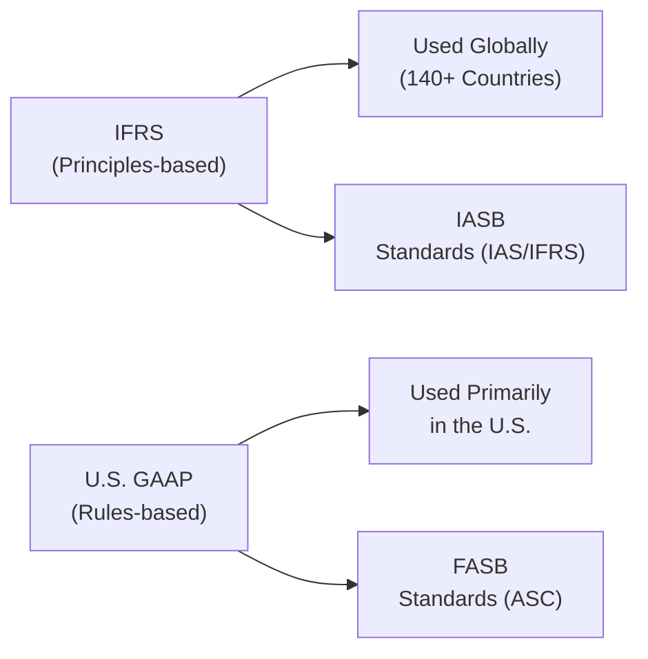
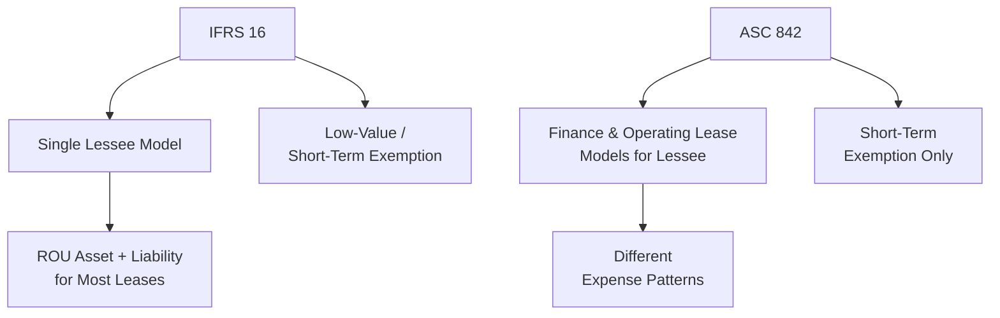

## 23.1 IFRS vs. U.S. GAAP Key Differences

International Financial Reporting Standards (IFRS) and U.S. Generally Accepted Accounting Principles (U.S. GAAP) represent two of the most influential financial reporting frameworks worldwide. While IFRS is governed by the International Accounting Standards Board (IASB) and focuses on a more principles-based approach, U.S. GAAP is under the purview of the Financial Accounting Standards Board (FASB) and is largely considered more rules-based. Understanding these key differences is essential for CPAs, financial analysts, and business leaders navigating global transactions, preparing consolidated financial statements, or analyzing cross-border investments.

This section focuses on major areas where IFRS and U.S. GAAP diverge, with particular emphasis on:
• Revenue Recognition  
• Leases  
• Financial Instruments  
• Intangible Assets  

References to relevant chapters and sections throughout this BAR guide will help you contextualize these differences in practical settings.  

---

### Overview of IFRS vs. U.S. GAAP

IFRS is used in more than 140 countries worldwide. It aims to reflect the economic substance of transactions by leveraging broad principles, encouraging professionals to exercise judgment. U.S. GAAP provides more prescriptive guidance, often including industry-specific rules and abundant implementation examples. While the conceptual frameworks of both IFRS and U.S. GAAP share similarities—such as emphasizing decision-useful information, relevance, reliability, and comparability—significant differences exist in application and disclosure requirements.

In many instances, IFRS can provide more room for professional judgment and flexibility, while U.S. GAAP’s extensive codification can offer more detailed guidance in specialized circumstances. However, this can also lead to intricate compliance requirements, especially for multinational corporations coping with both standards.

---

### Revenue Recognition

Revenue is one of the most important figures in financial statements, as it drives a company’s profitability, performance metrics, and shareholder value. Under both sets of standards, there has been significant convergence in recent years, particularly with IFRS 15 and ASC 606. Despite this, nuanced differences remain.

#### Core Principles

• IFRS 15 (Revenue from Contracts with Customers): Emphasizes the transfer of control of goods or services to the customer. The Five-Step Model in IFRS 15 aligns closely with U.S. GAAP’s ASC 606.  
• ASC 606 (Revenue from Contracts with Customers): Summarizes revenue recognition into a five-step process, focusing on contract identification, performance obligations, transaction price, allocation, and timing of revenue recognition.

#### Key Differences

1. Collectibility Threshold  
   – Under ASC 606, an entity must conclude that it is probable (defined as a 75–80% chance in practice) that they will collect substantially all of the consideration.  
   – Under IFRS 15, “probable” takes on a lower threshold, often interpreted closer to “more likely than not” (above 50%).  

2. Contract Modifications and Terminations  
   – IFRS 15 tends to combine separate contract modifications more frequently, requiring a reevaluation of all performance obligations.  
   – ASC 606 prescribes more detailed rules for determining whether a modification should be treated as a separate contract or part of the existing contract.  

3. Variable Consideration  
   – Both standards require estimation of variable consideration; IFRS 15 often applies a narrower constraint principle called the “variable consideration constraint,” which requires that revenue recognized should not be subject to significant reversal.  
   – U.S. GAAP uses similar language but typically includes more industry-specific application examples (e.g., for software, licensing, franchising).  

4. Illustrative Guidance  
   – IFRS 15 includes broad implementation guidance that strongly emphasizes principles.  
   – ASC 606 includes both general principles and extensive industry-specific examples (e.g., telecom, construction, software) that can sometimes produce slight variations in practice.  

For a deeper dive into U.S. GAAP revenue recognition, see Chapter 12: Revenue Recognition in this BAR guide. For IFRS-based insights, IFRS 15 is the principal standard to consult, alongside the exposure drafts and additional IFRS Interpretations Committee guidance.

---

### Leases

Accounting for leases has experienced significant revisions, with IFRS 16 and ASC 842 now in effect—majorly influencing reported assets, liabilities, and financial ratios.

#### Core Principles

• IFRS 16 (Leases): Moved to a single lessee accounting model, largely eliminating the distinction between operating and finance leases. Lessees are required to recognize a right-of-use (ROU) asset and a lease liability for all leases (except short-term and low-value leases).  
• ASC 842 (Leases): Retains a dual-model approach for lessees—while both finance and operating leases require ROU asset and lease liability recognition, operating lease expenses are presented differently in the income statement compared to finance leases.

#### Key Differences

1. Lessee Accounting for Short-Term/Low-Value Assets  
   – IFRS 16 provides an explicit exemption for leases that are low-value (e.g., laptops, office equipment).  
   – ASC 842 allows a short-term lease exemption but does not explicitly permit a low-value asset exemption.  

2. Classification of Operating vs. Finance Leases (for Lessees)  
   – Under IFRS 16, practically all leases for lessees are accounted for similarly, except for disclosure differences for short-term and low-value leases.  
   – Under ASC 842, a lease can be classified as either operating or finance, impacting how the expense is presented (front-loaded amortization for finance leases vs. a straight-line lease expense for operating leases).  

3. Lessor Accounting  
   – IFRS 16 modifies lessor accounting requirements minimally from the prior IAS 17. Lessors continue to classify leases as operating or finance.  
   – ASC 842 has parallels for lessors, building on existing guidance from older standards but includes additional rules for the sale-and-leaseback transactions.  

4. Presentation and Disclosure  
   – IFRS 16 arguably requires more streamlined presentation: a single ROU asset line could be presented under property, plant, and equipment.  
   – ASC 842 allows or sometimes requires disaggregation in the notes, potentially resulting in more line items in the balance sheet.  

For more on lease accounting under U.S. GAAP, consult Chapter 16: Leases – Lessor Accounting and Sale-Leaseback. IFRS 16 guidance is found in IASB literature, supported by illustrative examples that demonstrate a singular approach to lease capitalization.

---

### Financial Instruments

Financial instruments—spanning cash, equity, debt, derivatives, and hybrid securities—can present some of the most intricate differences between IFRS and U.S. GAAP. These differences can profoundly affect a firm’s balance sheet, income statement, and capital structure analysis.

#### Core Principles

• IFRS 9 (Financial Instruments): Introduced a classification and measurement approach based on an entity’s business model and the contractual cash flow characteristics of the instrument. It also introduced an expected credit loss (ECL) model for impairment.  
• ASC 320/321/815 (Investment Securities, Equity Investments, and Derivatives) and ASC 326 (Credit Losses): U.S. GAAP uses classification categories such as Held-to-Maturity (HTM), Available-for-Sale (AFS), and Trading. The current expected credit losses (CECL) model addresses the timing and amount of loss recognition.

#### Key Differences

1. Classification and Measurement  
   – IFRS 9 uses three main categories (amortized cost, fair value through other comprehensive income, and fair value through profit or loss).  
   – U.S. GAAP has distinct categories for debt (HTM, AFS, Trading) and different rules for equity investments (carried at fair value with changes recognized in net income, unless a practicability exception is used).  

2. Impairment Models  
   – IFRS 9 ECL Model: Requires recognition of 12-month expected credit losses on initial recognition, moving to lifetime expected credit losses if credit risk increases significantly.  
   – ASC 326 CECL Model: Requires immediate recognition of lifetime expected credit losses on all financial assets measured at amortized cost, but with possible adjustments if credit risk is minimal.  

3. Hedging Relationships  
   – IFRS 9 relaxed certain hedge accounting requirements, allowing more principal-based hedging relationships that align with risk management activities.  
   – ASC 815 has strict documentation and effectiveness testing requirements, though recent amendments introduced simplifications (e.g., for “critical terms match”).  

4. Reclassification of Financial Assets  
   – IFRS 9 restricts reclassifications unless the entity’s business model changes.  
   – U.S. GAAP typically prohibits reclassifications out of Trading and imposes other constraints on shifting between categories.  

For more details, refer to Chapter 15: Derivatives, Hedges, and Financial Instruments in this guide.  

---

### Intangible Assets

Intangible assets—covering trademarks, patents, internally developed software, and goodwill—are essential to many industries, especially technology and pharmaceuticals. While IFRS and U.S. GAAP share broad similarities in initial recognition and amortization, notable differences exist in impairment testing and development cost capitalization.

#### Core Principles

• IFRS (IAS 38, IAS 36): Generally permits internally generated intangible assets to be recognized under certain conditions, requiring the recognition of development costs once technical feasibility is established. Impairment testing is performed at the cash-generating unit (CGU) level.  
• U.S. GAAP (ASC 350, ASC 985, and related): Classifies intangible assets as definite or indefinite-lived, with indefinite-lived intangibles (e.g., goodwill) tested for impairment at least annually. For software, ASC 985-20 (software for sale) or ASC 350-40 (internal-use software) specify capitalization thresholds.

#### Key Differences

1. Recognition of Development Costs  
   – IFRS: Development costs are capitalized once technical feasibility and economic viability are established. Research costs are expensed as incurred.  
   – U.S. GAAP: Generally more restrictive (e.g., software development) and heavily reliant on specific guidance such as ASC 985-20 for externally marketed software vs. ASC 350-40 for internal-use software.  

2. Impairment Testing  
   – IFRS: A one-step approach at the CGU level. If the asset’s carrying amount exceeds its recoverable amount, an impairment loss is recognized immediately.  
   – U.S. GAAP: Goodwill follows a two-step approach unless an optional qualitative assessment is used. If the carrying value of a reporting unit exceeds its fair value, an impairment is recorded.  

3. Reversals of Impairment  
   – IFRS: Allows reversal of impairment losses for certain assets (but not for goodwill) if there has been a change in estimates used to determine recoverable amount.  
   – U.S. GAAP: Prohibits the reversal of all impairment losses of long-lived assets, including intangible assets.  

4. Indefinite vs. Finite Lives  
   – IFRS: Intangibles can be deemed indefinite if there is no foreseeable limit to the period over which the asset is expected to generate cash flows.  
   – U.S. GAAP: Indefinite-lived intangibles are tested for impairment annually (or more frequently if indicators arise), while finite-lived intangibles are amortized.  

For a more in-depth take, refer to Chapter 10: Indefinite-Lived Intangible Assets and Goodwill and Chapter 11: Internally Developed Software and R&D.  

---

### Case Study Example

A mid-sized technology firm based in the United States acquires a European software startup. After the acquisition, the parent company (reporting under U.S. GAAP) attempts to consolidate financials. Key challenges and differences arise:

• Revenue Recognition: The European subsidiary uses IFRS 15 to account for multiple-element software licenses. The U.S. entity must align these to ASC 606. While similar in principle, the details of collectibility thresholds and contract modification can yield slight timing differences in recognized revenue.  
• Leases: The subsidiary has offices under IFRS 16. Recognizing office leases on a single model means a significant right-of-use asset. The parent in the U.S. still needs to label these leases under ASC 842 as either operating or finance.  
• Financial Instruments: The subsidiary classifies certain investment securities at fair value through profit or loss under IFRS 9. Under ASC 320, the parent might reclassify these as “Trading” or “Available-for-Sale,” leading to differences in unrealized gains or losses recognized in net income vs. other comprehensive income.  
• Intangible Assets: Development costs for the startup’s software under IFRS are partially capitalized. Under U.S. GAAP, the classification between internal-use vs. externally marketed software may trigger earlier or later expense recognition.

Ultimately, reconciling these differences requires careful analysis and documentation, highlighting the importance of robust policies, internal controls, and guidance from corporate IFRS and U.S. GAAP specialists.

---

### Best Practices and Common Pitfalls

1. Align Accounting Policies Early  
   – Multinational groups should align their group reporting manual (GRM) to reduce confusion and inconsistencies between IFRS and U.S. GAAP treatments.

2. Document Judgments Thoroughly  
   – Because IFRS is more principles-based, professional judgment is more prevalent. While U.S. GAAP has more explicit rules, it still allows for interpretive decisions regarding classification, measurement, and presentation. Thorough documentation is critical to support these judgments during audits.

3. Stay Current with Updates  
   – Both the IASB and FASB issue periodic amendments. Changes to IFRS 16 or ongoing improvements to ASC 842, clarifications to IFRS 15 or updates to ASC 606, or further guidance on IFRS 9 and ASC 326 can significantly impact financial reporting. Always stay up to date on exposure drafts and new pronouncements.

4. Expect Differences in Calculations and Timing  
   – Even when overall principles converge (e.g., IFRS 15 vs. ASC 606), small operational details can lead to differences in revenue recognition, lease liability measurement, impairment triggers, and fair value calculations.

5. Implement Strong Internal Controls Over Financial Reporting (ICFR)  
   – Companies using dual reporting must ensure that processes are in place for accurate consolidation and elimination entries, especially when handling intangible asset valuations or derivative hedge relationships.

---

### Practical Tips for Exam Success

• Know the Big Picture: Understand how IFRS and U.S. GAAP are structured and governed. Refer to conceptual framework similarities and differences.  
• Master the Terminology: Familiarize yourself with IFRS 15, IFRS 16, IFRS 9, IAS 38, IAS 36 terminology vs. ASC 606, ASC 842, ASC 326, ASC 350, etc.  
• Connect to Real-World Scenarios: IFRS vs. U.S. GAAP differences frequently appear in multinational M&A deals, cross-border leasing, and software or technology development.  
• Use Memorization Hooks: For instance, IFRS often has a single approach in areas like leasing (IFRS 16), while U.S. GAAP retains a dual approach (ASC 842 for operating and finance leases).  
• Practice Conversions: Work through examples of adjusting financial statements from IFRS-based statements to U.S. GAAP (and vice versa) to understand the mechanical steps.

---

### Additional References for Further Exploration

• IFRS Foundation Website (ifrs.org) – Access to IFRS Standards and official interpretations.  
• FASB Accounting Standards Codification (asc.fasb.org) – Authoritative source for U.S. GAAP.  
• Deloitte’s IFRS in Focus and EY’s IFRS Developments – Provide timely updates on global accounting changes.  
• KPMG’s IFRS and U.S. GAAP Comparison – Detailed guides comparing specific IFRS and U.S. GAAP topics.  

---

## Test Your Knowledge: IFRS vs. U.S. GAAP Accounting Differences



### Which body governs the issuance of IFRS?
- [x] The International Accounting Standards Board (IASB)
- [ ] The Financial Accounting Standards Board (FASB)
- [ ] The Securities and Exchange Commission (SEC)
- [ ] The Governmental Accounting Standards Board (GASB)

> **Explanation:** IFRS is set by the IASB, whereas U.S. GAAP is issued by the FASB.

### Which of the following is a key difference in IFRS vs. U.S. GAAP revenue recognition?
- [x] The concept of "probable" collectibility threshold in IFRS is generally lower than in U.S. GAAP.
- [ ] U.S. GAAP has no threshold for collectibility considerations.
- [x] IFRS allows revenue recognition only on receipt of cash.
- [ ] IFRS has entirely separate standards that do not align with the five-step model.

> **Explanation:** IFRS 15 and ASC 606 largely converge, but the “probable” threshold for collectibility under IFRS is typically interpreted as a lower hurdle than the U.S. GAAP requirement.

### Under IFRS 16, how are leases generally accounted for by lessees?
- [x] As a single model requiring recognition of a right-of-use asset and lease liability for most leases.
- [ ] As two contrasting models: operating vs. finance, similar to U.S. GAAP.
- [ ] They are expensed immediately when initiated.
- [ ] They are recorded in equity only.

> **Explanation:** IFRS 16 uses a single lessee model, except for exemptions for short-term or low-value leases.

### Which standard addresses leases under U.S. GAAP?
- [x] ASC 842
- [ ] ASC 606
- [ ] IFRS 16
- [ ] IAS 36

> **Explanation:** ASC 842 governs lease accounting in U.S. GAAP, distinguishing between finance and operating leases for lessees.

### Under IFRS 9, how is the impairment of financial assets generally measured?
- [x] Using an Expected Credit Loss (ECL) model, recognizing 12-month ECL on initial recognition and lifetime ECL if credit risk increases significantly.
- [ ] Using a single-step incurred loss model.
- [x] Using only a qualitative approach without any numeric measurements.
- [ ] Using historical cost only.

> **Explanation:** IFRS 9 uses the ECL model. When there is a significant increase in credit risk, entities must transition from recognizing 12-month expected credit losses to lifetime expected credit losses.

### Which of the following best describes intangible asset impairment under IFRS?
- [x] A one-step approach at the cash-generating unit (CGU) level, disallowing reversals for goodwill.
- [ ] A prescriptive two-step approach for all assets, including goodwill.
- [ ] Assets are only tested upon disposal.
- [ ] Reversal of losses is prohibited for all intangible assets.

> **Explanation:** Under IFRS, impairment is assessed at the CGU level. Impairment of goodwill cannot be reversed, but certain other intangible impairments can be reversed if specific conditions are met.

### How are low-value leases typically treated under IFRS 16?
- [x] They are exempt from recognition in the balance sheet.
- [ ] They must always be recognized as finance leases.
- [x] They must be recorded under operating leases only.
- [ ] They are capitalized at the highest possible discount rate.

> **Explanation:** IFRS 16 provides a practical expedient for low-value leases, allowing expense recognition on a straight-line basis without recognizing an ROU asset and lease liability.

### In U.S. GAAP, how do you account for internally developed software intended for external sale?
- [x] Capitalize development costs after technological feasibility is established and expense research costs before it.
- [ ] Expense all costs related to software development.
- [ ] Recognize software as inventory on completion.
- [ ] Defer all software costs until the point of sale.

> **Explanation:** ASC 985-20 provides for capitalization of software development costs only after achieving technological feasibility is demonstrated, which is consistent with U.S. GAAP rules.

### Under IFRS, which standard primarily addresses intangible asset recognition and measurement?
- [x] IAS 38
- [ ] IFRS 15
- [ ] IFRS 16
- [ ] IFRS 9

> **Explanation:** IAS 38 prescribes the criteria and measurement for intangible assets. IFRS 15 covers revenue, IFRS 16 covers leases, and IFRS 9 focuses on financial instruments.

### When comparing IFRS 16 and ASC 842, the most notable difference for lessees is:
- [x] IFRS 16 uses a single model for lessee accounting, while ASC 842 retains two models (finance and operating) for expense recognition patterns.
- [ ] Both standards eliminate the need for ROU assets.
- [ ] Under IFRS 16, no leases go on the balance sheet, while ASC 842 requires all leases to be capitalized.
- [ ] Under ASC 842, lessors only use a single method.

> **Explanation:** IFRS 16 mandates one lease model for lessees, whereas ASC 842 distinguishes between finance and operating leases in terms of expense recognition.



---

## For Additional Practice and Deeper Preparation

### [Business Analysis and Reporting (BAR) CPA Mock Exams](https://www.udemy.com/course/bar-cpa-mock-exams/?referralCode=ADBE2E84BEE9CB6243CA)  

**Business Analysis and Reporting (BAR) CPA Mocks:** 6 Full (1,500 Qs), Harder Than Real! In-Depth & Clear. Crush With Confidence!  

- Tackle full-length mock exams designed to mirror real BAR questions.  
- Refine your exam-day strategies with detailed, step-by-step solutions for every scenario.  
- Explore in-depth rationales that reinforce higher-level concepts, giving you an edge on test day.  
- Boost confidence and minimize anxiety by mastering every corner of the BAR blueprint.  
- Perfect for those seeking exceptionally hard mocks and real-world readiness.  

_Disclaimer: This course is not endorsed by or affiliated with the AICPA, NASBA, or any official CPA Examination authority. All content is for educational and preparatory purposes only._
