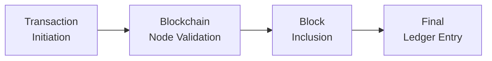
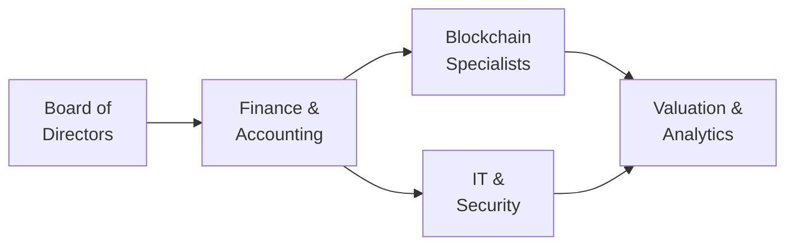

## 23.3 Blockchain, Cryptoassets, and Related Disclosures

Blockchain technology and cryptoassets continue to reshape the financial landscape, introducing innovation while also raising new challenges for accountants, auditors, and regulators. From custody and security considerations to fair value measurements, accountants must stay informed about the implications of distributed ledgers, tokenized transactions, and evolving standards. This section details key accounting and reporting perspectives, along with best practices to help you navigate this emerging area.

### Understanding Blockchain in the Accounting Context
Blockchain is a type of distributed ledger technology (DLT) enabling peer-to-peer verification of transactions without reliance on a single centralized authority. Each transaction is appended to the ledger in a “block,” linked cryptographically to all previous blocks, forming a “chain” of data. This framework theoretically improves transparency, reduces the risk of fraud, and can streamline reconciliation.

• A distributed ledger system means multiple nodes maintain an identical copy of the ledger.  
• Transactions are synchronized in near real-time among participants.  
• Data integrity is enhanced by cryptographic hashing, making the ledger tamper-evident.  

While blockchain’s decentralized features promise efficiency and security, they also raise questions about how to establish proper internal controls, evaluate risk, and ensure reliable financial disclosures.

### Types of Cryptoassets
Cryptoassets are digital representations of value that rely on cryptography for security and typically exist on blockchain networks. Common categories include:

• Cryptocurrencies: Tokens designed primarily as mediums of exchange (e.g., Bitcoin, Ethereum).  
• Utility Tokens: Provide holders access to specific services or products within a blockchain ecosystem (e.g., a token used for transaction fees or software licenses).  
• Security Tokens: Represent ownership interests, such as digital stocks or bonds, often subject to securities regulations.  
• Stablecoins: Pegged to an underlying asset or basket of assets (e.g., fiat currencies or commodities) in an effort to minimize volatility.

Each cryptoasset type may entail different accounting treatments and disclosures due to its underlying economic substance and regulatory classification. In practice, many entities hold cryptocurrencies as intangible assets with indefinite life for financial statement purposes. Others may treat them as inventory if held for resale or as financial instruments if meeting specific criteria.

### Internal Control Implications
Implementing effective internal controls over digital assets is critical. Unlike traditional bank accounts, cryptoasset wallets and blockchain transactions can be more prone to theft, irretrievable losses, or unapproved transfers if proper controls are not in place. Key considerations include:

• Custody Solutions: Entities may use “cold storage” (offline) or “hot storage” (online) wallets. Custody choices have implications for access controls, security protocols, and potential auditing challenges.  
• Private Keys and Multisignature Arrangements: Strict procedures are needed to safeguard cryptographic keys. Loss or theft of a private key can permanently restrict a company’s access to its own assets.  
• Segregation of Duties: Personnel responsible for transaction initiation, recordkeeping, and custody must have clear-cut responsibilities to prevent unauthorized transactions.  
• Transaction Authorization and Monitoring: Implement real-time or near-real-time alerts for large transactions, requiring multiple approvals to enhance oversight.

Where companies rely on blockchain-based systems for recordkeeping, careful evaluation of the completeness, accuracy, and reliability of the ledger is required. Entities should reference guidance in COSO’s Enterprise Risk Management (ERM) Framework (see Chapter 8) to tailor their internal controls to the specific risks posed by blockchain transactions.

### Valuation Considerations
Valuing cryptoassets can be particularly challenging due to high volatility, limited liquidity, and diverse valuation methodologies. Under U.S. GAAP, cryptocurrencies typically fall under the scope of ASC 350 Intangible Assets; they are often accounted for as indefinite-lived intangible assets, tested for impairment but not marked upward through income if fair value recovers.

Key valuation aspects include:

• Market Volatility: An active market may exist for highly traded tokens like Bitcoin, but prices can fluctuate significantly.  
• Impairment Testing: If a token’s fair value drops below its carrying amount, an impairment loss is recognized.  
• Observable Inputs: If an active exchange or multiple exchanges are available, an entity’s valuation team must determine the principal market and assess the reliability of quoted prices.  
• Level of Valuation Inputs: Depending on the token’s liquidity and market data availability, the fair value measurement may be deemed a Level 2 or Level 3 measurement under ASC 820.

In some instances, if a cryptoasset does not meet the characteristics of a digital intangible (e.g., stablecoins fully collateralized by cash equivalents), classification under financial instruments or inventory standards might be more appropriate.

### Financial Reporting and Disclosures
Users of financial statements increasingly demand transparency around a company’s crypto-related activities. Disclosures must be robust, addressing the nature and extent of involvement with cryptoassets, the impact on financial position and performance, and associated risks. Areas to highlight:

• Significant Accounting Policies: Entities should clearly state their policy for recognizing, measuring, and impairing digital assets.  
• Risk Factors: Include discussion of price volatility, regulatory uncertainties, cybersecurity concerns, and liquidity risks.  
• Methods and Assumptions: For intangible assets, detail assumptions used in determining fair value and assessing impairment.  
• Revenue Recognition Impact: If cryptoassets are used as consideration in a revenue transaction, reference the five-step model in ASC 606 (see Chapter 12).  
• Subsequent Events: Rapid price swings may require disclosure if a significant impairment arises between the balance sheet date and the issuance date of the statements.

The SEC has issued staff guidance indicating that certain crypto-related activities may be material to investors and may require more extensive disclosure. In a public company context, accountants must align their disclosures with the broader guidance discussed in Chapter 17 on SEC reporting (Regulations S-X and S-K).

### Real-World Illustration: Company X and Its Bitcoin Treasury Strategy
Company X, a mid-sized technology firm, decides to invest excess cash in Bitcoin. During initial adoption, it invests USD 10 million at an average cost of USD 40,000 per coin. It classifies these holdings as indefinite-lived intangible assets under ASC 350, with initial recognition on the balance sheet at cost.

• Market fluctuations cause the fair value of Bitcoin to decline to USD 35,000, marking an impairment indicator. The company records an impairment loss for the difference between carrying amount and fair value.  
• Later, Bitcoin’s price rebounded to USD 45,000, but GAAP does not allow reversing the impairment via the income statement (assuming indefinite-life classification).  
• Company X’s disclosures explain that the intangible asset is highly volatile, subject to frequent valuation checks, and that losses may be recognized earlier than gains.

### Case Study: Blockchain Inventory Tokenization
Consider a retailer using a private blockchain system to tokenize its inventory items. Each shipment of consumer electronics is recorded on-chain once a vendor confirms the invoice, significantly reducing reconciliation time.

• Automated Smart Contracts: Payment is escrowed in stablecoins and released upon confirmation of goods’ arrival.  
• Reduced Processing Time: Supplier and retailer confirm transaction data once; the system propagates the updated ledger among all nodes.  
• Internal Control Strength: The immutable transaction record allows real-time auditing, albeit the retailer must confirm data integrity on every node for completeness.

While such automation can streamline cost accounting (see Chapter 5), the company must ensure that the technology meets the thresholds for reliable evidence, properly capturing ownership, and verifying transfer-of-title events in accordance with ASC 606 on revenue recognition or inventory accounting rules.

### Diagram: Typical Flow of a Blockchain Transaction

In the diagram:  
• The transaction starts with an initiation request (A).  
• Validator nodes confirm the accuracy and legitimacy of the transaction (B).  
• A new block is created and appended to the chain (C).  
• The ledger update is finalized and propagated to all nodes (D).  

### Auditing Crypto Transactions
Auditors face new challenges verifying existence and ownership of digital assets and ensuring transactions are not misstated. Common approaches involve:

• Confirmation of Wallet Balances: Reviewing cryptographic proof of addresses and verifying them against blockchain explorers.  
• Testing Controls: Ensuring robust entity-level and activity-level controls are in place for management of private keys and user access.  
• Substantive Testing: Verifying significant blockchain transactions via node or block explorer to validate authenticity.  
• Use of Specialist Skills: Auditors may need IT experts to interpret complex smart contract code or to confirm that a token is properly restricted to the client’s address.

Given the complexity and novel risks in crypto-related engagements, many audit firms deploy specialized teams conversant with blockchain technology to address potential pitfalls in verifying intangible asset valuations, existence, rights, obligations, and disclosures.

### Common Pitfalls
• Misclassification of digital tokens as cash equivalents or financial instruments, whereas many are intangible assets.  
• Inadequate or weak custody and security protocols leading to irreparable losses or theft.  
• Overlooking regulatory developments, such as classification of tokens as securities, which affects compliance and disclosure requirements.  
• Failing to properly account for impairment or not disclosing the impact of volatility on earnings.  
• Underestimating the complexity of “smart contracts,” which can embed obligations or rights impacting revenue recognition, contingent liabilities, or intangible assets.  

### Best Practices and Recommendations
• Stay Current on Regulations: Monitor guidance from FASB, SEC, PCAOB, and global bodies like IFRS.  
• Enhance Risk Assessment: Leverage the frameworks in Chapter 8 (Risk Assessment and Prospective Analysis) to identify vulnerabilities in blockchain processes.  
• Develop Robust Policies: Outline the steps to address acquisition, safekeeping, impairment testing, and disposal or exchange of cryptoassets.  
• Invest in Technology Expertise: Train or hire professionals skilled in blockchain analytics for both internal control and external audit perspectives.  
• Maintain Transparent Disclosures: Provide clear, consistent, and sufficiently detailed disclosures, especially for stakeholders less familiar with crypto technology.  

### Additional Real-World Factors
• Central Bank Digital Currencies (CBDCs): Governments may issue official digital currencies impacting monetary policy, financial instrument classification, and cross-border transactions.  
• Mining Operations: Entities engaging in “mining” or “staking” to earn new tokens must properly measure expenses (power, hardware) and recognize or value their mined crypto.  
• Environmental, Social, and Governance (ESG) Dimension: High energy consumption for certain proof-of-work cryptocurrencies can introduce reputational and sustainability reporting considerations.  

### Visualizing Organizational Roles for Cryptoassets

• Board of Directors (A) establishes overarching strategy and risk tolerance.  
• Finance & Accounting (B) sets policies, performs bookkeeping, ensures compliance.  
• Blockchain Specialists (C) liaise with technology teams to validate on-chain records.  
• IT & Security (D) oversees secure wallet management, infrastructure, and threat assessments.  
• Valuation & Analytics (E) consolidates data for financial statements, focusing on fair value recognition and impairment.

By integrating these roles effectively, organizations can establish a supportive framework that addresses the unique challenges of blockchain-based transactions and cryptoassets.

### Conclusion
Blockchain and cryptoassets continue to transform the financial reporting landscape, offering both opportunities and risks. While the technology brings potential to enhance transparency and efficiency, entities must be keenly aware of—and prepared for—their internal control, valuation, and disclosure challenges. A structured approach that aligns with relevant accounting standards, coupled with robust internal controls and thorough disclosures, can help organizations harness the benefits of blockchain while mitigating material misstatements or compliance pitfalls.

By drawing on frameworks discussed throughout this guide—including capital structure analyses (Chapter 8), public company reporting (Chapter 17), and intangible asset impairment (Chapter 10)—accountants and financial professionals can confidently address the complexities presented by this emerging domain. Keep an eye on regulatory developments, technical innovations, and best practices in risk assessment to stay ahead in this rapidly evolving space.

## Quiz: Blockchain and Cryptoassets



### Which feature best describes blockchain technology in a financial context?

- [x] A tamper-evident distributed ledger maintained across multiple nodes
- [ ] A single, centralized ledger that updates once a day
- [ ] A system exclusively controlled by a government authority
- [ ] A paper-based record for digital transactions

> **Explanation:** Blockchain is a decentralized and cryptographically secured ledger, hosted across numerous nodes. This makes it difficult to alter and ensures data integrity.

### Which of the following is the most common classification of cryptocurrencies, such as Bitcoin, under U.S. GAAP?

- [ ] A cash equivalent
- [ ] A liability
- [x] An indefinite-lived intangible asset
- [ ] A financial asset with a guaranteed minimum value

> **Explanation:** Under most U.S. GAAP guidance, cryptocurrencies like Bitcoin are accounted for as indefinite-lived intangible assets, subject to impairment testing.

### What is the primary challenge with using quoted exchange prices to value cryptoassets?

- [x] High volatility and variations across exchanges
- [ ] Lack of any available market for trades
- [ ] Universal prices that never change
- [ ] No official IFRS or GAAP guidelines

> **Explanation:** Crypto prices can fluctuate dramatically, and different exchanges may show varying prices. These factors complicate determining a reliable fair value.

### How should a company typically handle the private keys associated with its crypto wallet?

- [x] Restrict access through robust internal controls and possibly multisignature arrangements
- [ ] Share them publicly to verify transparency
- [ ] Dispose of them after each transaction
- [ ] Leave them unsecured for offline audits

> **Explanation:** The security of private keys is paramount. Loss or theft of private keys poses a substantial risk to the company’s assets.

### Which disclosure is most critical if an entity holds significant cryptoassets as part of its investment strategy?

- [x] The nature of the assets, the applicable accounting policy, and the associated impairment losses
- [ ] The CEO’s personal interest in digital assets
- [x] Detailed price history of cryptoasset quotes over the last five years
- [ ] Restricting access to year-end data only

> **Explanation:** Investors need to know the entity’s material holdings, their accounting treatment, and impairment recognized. While historical pricing can be pertinent, the main focus is on the methodology and assumptions used in presenting cryptoassets on the financial statements.

### Which would be an example of a strong control over a cryptoasset transaction?

- [x] Implementing real-time alerts requiring multiple approvals for significant outflows
- [ ] Allowing open access to employees for any transfer
- [ ] Relying entirely on external consultants for transaction approvals
- [ ] Posting all private keys in a publicly accessible file

> **Explanation:** Having alerts, approvals, and strict permissions fosters robust controls over digital assets. Public or unmanaged access introduces significant risk.

### A technology company mineshares new digital tokens through proof-of-work. Which expense is likely to be most relevant to track?

- [x] Utility costs for the equipment to process transactions
- [ ] Depreciation of intangible software licenses
- [x] Third-party fees incurred by the central bank
- [ ] Off-balance sheet intangible amortization

> **Explanation:** Mining requires substantial computing power, making energy consumption a core operational cost. Properly categorizing and tracking these costs is essential for accurate financial reporting.

### Why might an auditor consult a blockchain specialist when examining a company’s crypto transactions?

- [x] To validate the legitimacy of blockchain transactions and understand smart contract code
- [ ] To rely solely on the client’s own explanation of the ledger
- [ ] To bypass all standard audit procedures
- [ ] To convert cryptoassets into fiat currency

> **Explanation:** Specialist knowledge may be critical for reviewing the technical aspects of blockchain-based transactions, ensuring proper verification and addressing potential risks.

### Which is typically the most significant exposure for a company holding large volumes of volatile cryptoassets?

- [x] Price fluctuation and impairment losses
- [ ] Guaranteed buy-back by central banks
- [ ] Zero risk to intangible assets
- [ ] Ironclad insurance coverage

> **Explanation:** Volatility can lead to frequent impairments, directly impacting financial statements. No standard guarantee exists for cryptoassets, and insurance coverage may only partially mitigate losses.

### An impairment in a cryptoasset can be reversed through the income statement under U.S. GAAP once the market recovers.

- [x] True
- [ ] False

> **Explanation:** Under typical U.S. GAAP treatment of indefinite-lived intangible assets, any post-impairment recovery in asset value generally cannot be recognized through the income statement.



## For Additional Practice and Deeper Preparation

### [Business Analysis and Reporting (BAR) CPA Mock Exams](https://www.udemy.com/course/bar-cpa-mock-exams/?referralCode=ADBE2E84BEE9CB6243CA)

**Business Analysis and Reporting (BAR) CPA Mocks:** 6 Full (1,500 Qs), Harder Than Real! In-Depth & Clear. Crush With Confidence!

- Tackle full-length mock exams designed to mirror real BAR questions.  
- Refine your exam-day strategies with detailed, step-by-step solutions for every scenario.  
- Explore in-depth rationales that reinforce higher-level concepts, giving you an edge on test day.  
- Boost confidence and minimize anxiety by mastering every corner of the BAR blueprint.  
- Perfect for those seeking exceptionally hard mocks and real-world readiness.  

_Disclaimer: This course is not endorsed by or affiliated with the AICPA, NASBA, or any official CPA Examination authority. All content is for educational and preparatory purposes only._
