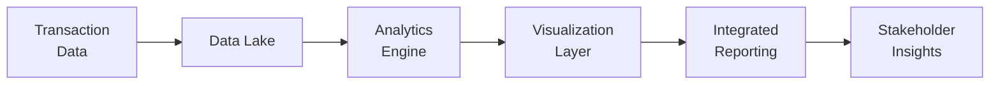

## 23.4 Future Trends in Analytics and Reporting

As global markets evolve and the volume of information grows exponentially, the accounting and reporting landscape is transforming at a rapid pace. This section explores emerging trends in analytics and reporting and how they are reshaping traditional accounting processes. We will delve into real-time reporting capabilities, advanced data analytics, integrated reporting frameworks (including environmental, social, and governance [ESG] components), and the increasing role of automation and technology. By understanding these developments, CPAs can equip themselves for the future demands of the profession and deliver greater value to stakeholders.

---

### The Shifting Landscape of Accounting Data

#### The Rise of Big Data
Data has become the engine driving modern business strategy. Rather than relying solely on traditional financial statements and historical analysis, organizations are tapping into massive reservoirs of structured and unstructured data—often referred to as “big data”—to gain deeper insights. Big data encompasses not only the volume of information, but also:
• Velocity: The speed at which new data is generated.  
• Variety: Data types include transactional, social media, sensor, geolocation, and more.  
• Veracity: The reliability and accuracy of data.  
• Value: The ultimate aim to extract actionable insights.

#### Evolving Stakeholder Expectations
On top of traditional financial metrics—such as earnings per share, net income, and EBITDA—stakeholders (investors, regulators, and the general public) now expect additional layers of reporting. These include real-time performance indicators, sustainability metrics, and other nonfinancial data. New frameworks have emerged, promoting a broader perspective on organizational performance that extends beyond profitability to include social and environmental impact.

---

### Real-Time and Continuous Reporting

#### Breaking Away from the Quarterly Cycle
A major development that has been unfolding is the concept of real-time or continuous reporting. Rather than waiting for quarter-end or year-end closings, organizations are beginning to leverage:
• Automated transaction recording.  
• AI-based reconciliations.  
• Cloud-based accounting systems.  

These innovations offer the ability to generate near real-time assessments of financial performance. By analyzing data continuously, management can make more agile decisions in response to market shifts or operational changes.

#### Benefits and Challenges
Real-time reporting enhances an organization’s ability to pivot, but it also presents challenges:
• System Overload: High infrastructure demands may strain legacy systems.  
• Data Governance: Increased volume of data calls for robust governance to ensure integrity.  
• Security Concerns: Continuous data processing must address cybersecurity risks.  
• Regulatory Compliance: Jurisdictions differ in what level of real-time disclosure is feasible or permissible.

---

### Integrated Reporting Frameworks

#### Holistic View of Performance
Traditional financial statements tell a narrow story focused on historical data. In contrast, integrated reporting frameworks (such as those championed by the International Integrated Reporting Council [IIRC]) emphasize the “six capitals” model: financial, manufactured, intellectual, human, social and relationship, and natural capital. These frameworks aim to provide a holistic view of value creation over the short, medium, and long term.

#### ESG and Sustainability
Environmental, social, and governance (ESG) metrics are gaining traction as key components of integrated reporting. Regulators, including the SEC in the United States and the European Commission, are increasingly mandating disclosures on issues like carbon footprint and board diversity. ESG factors can significantly influence investment decisions, brand reputation, and overall risk exposure.

#### Practical Example

Consider a consumer products company adopting an integrated reporting approach. In addition to top-line revenue growth and profit margins, the company discloses greenhouse gas emissions and community engagement efforts. By demonstrating commitment to sustainability, it not only adheres to regulations but also strengthens relationships with ethically minded customers and investors.

---

### Advanced Data Analytics

#### Predictive and Prescriptive Analytics
Going beyond historical (descriptive) analytics, companies are moving into predictive and prescriptive realms:
• Predictive Analytics: Uses statistical models and machine learning to forecast future events, such as sales peaks and inventory needs.  
• Prescriptive Analytics: Leverages optimization algorithms and simulations to recommend actions that yield the best outcome (e.g., how to allocate marketing spend for maximum ROI).

#### The Evolving Role of CPAs
CPAs are increasingly expected to be data-savvy. Beyond mere bookkeeping and assurance, accounting professionals must:
• Understand how to source, clean, and integrate data.  
• Perform advanced analytical methods or interface with data science teams.  
• Interpret results in the context of compliance, strategy, and risk management.  

#### Example: Fraud Detection
Data analytics tools can help identify unusual spikes in transactions or suspicious patterns that deviate from historical norms. Machine learning algorithms are often able to isolate anomalies more efficiently than manual audits. By flagging questionable elements, CPAs can investigate and address fraud risks earlier and more effectively.

---

### Automation and Artificial Intelligence

#### From RPA to Cognitive Automation
Robotic Process Automation (RPA) is already streamlining repetitive tasks such as invoice processing, reconciliations, and report generation. Advances in AI and machine learning are pushing automation further:
• Cognitive Automation: Systems can interpret unstructured documents (e.g., reading and classifying PDFs) using natural language processing (NLP).  
• Self-Learning Reconciliations: Algorithms that learn from prior reconciliations, detecting anomalies faster over time.  

#### Charting Future Opportunities 
Below is a simplified flow diagram illustrating how data might move from transactional sources to analytics platforms and ultimately form an integrated report:

In this workflow:  
• Transaction Data flows into a consolidated Data Lake.  
• The Analytics Engine (machine learning, predictive models, etc.) processes the data.  
• Findings are visualized in dashboards or real-time reports.  
• Integrated Reports are generated, allowing CPAs and management to deliver holistic insights to stakeholders.

---

### The Convergence of Global Standards

#### IFRS, U.S. GAAP, and ISSB
The International Financial Reporting Standards (IFRS) Foundation has established the International Sustainability Standards Board (ISSB) to create a standardized global framework for ESG disclosures. Meanwhile, the U.S. GAAP system continues to evolve with guidance from the Financial Accounting Standards Board (FASB). As these frameworks converge, CPAs will need to master nuanced differences and help organizations navigate dual or multiple reporting requirements.

#### Harmonizing Non-Financial Reporting
Beyond IFRS and U.S. GAAP, organizations may choose to align with other frameworks such as the Global Reporting Initiative (GRI) or the Task Force on Climate-related Financial Disclosures (TCFD). Over time, consolidation of frameworks is expected, with regulators encouraging or mandating standardized non-financial disclosures for global comparability.

---

### Extended Assurance and Third-Party Validation

#### The Demand for Credibility
As integrated, real-time, and ESG disclosures grow, so too will the need for assurance services beyond traditional financial statement audits. Stakeholders increasingly require independent validation of sustainability metrics, greenhouse gas (GHG) reports, and other non-financial data.

#### The Evolving Toolkit
To address these expanded assurance needs, CPAs may employ specialized auditing procedures, data forensic tools, or advanced analytics to test:
• Data lineage (tracing data back to its origin).  
• Consistency across disparate data sources.  
• Accuracy of computations within advanced analytics or machine learning algorithms.  
• Completeness of ESG and sustainability reporting frameworks.

---

### The Role of Blockchain in Reporting

#### Immutable Ledgers
Blockchain technology offers an immutable, distributed ledger capable of verifying transactions in near real-time. This can strengthen data integrity, reduce reconciliation efforts, and streamline audits. While still in its infancy for mainstream financial reporting, several pilot projects in supply chain traceability and cross-border transactions show its potential.

#### Challenges to Adoption
• Complexity: Implementation requires specialized knowledge.  
• Regulatory Uncertainty: Policies concerning blockchain may vary across jurisdictions.  
• Scalability and Performance: Large transaction volumes can strain blockchain networks.

Nevertheless, CPAs should stay informed, as blockchain-driven innovations may radically alter the audit and reporting landscape in the coming years.

---

### Best Practices to Embrace Future Trends

• Invest in Technology Infrastructure: Robust systems are essential to support real-time analysis, data volume, and advanced analytics.  
• Hybrid Skill Development: CPAs should develop strong analytical skills, data literacy, and understanding of nonfinancial frameworks such as GRI and TCFD.  
• Governance and Internal Controls: Strengthen monitoring and control processes over new data sources, especially for real-time or automated analytics.  
• Ongoing Professional Education: Continuous learning in AI, ESG frameworks, and emerging software solutions keeps CPAs relevant in a rapidly shifting environment.  

---

### Common Pitfalls and Strategies to Overcome Them

1. Data Quality Issues:  
   – Pitfall: Insights are only as good as the data fed into systems.  
   – Strategy: Implement strict data governance, standard definitions, and robust data validation routines.

2. Technology Overreliance:  
   – Pitfall: Blind trust in automation can overlook anomalies or data manipulation.  
   – Strategy: Maintain human oversight, cross-verifying key outputs and investigating red flags.

3. Underestimating Training Needs:  
   – Pitfall: New platforms and analytic tools can overwhelm staff if training is insufficient.  
   – Strategy: Provide ongoing education, cross-functional collaboration, and hands-on practice sessions.

4. Fragmented Reporting Context:  
   – Pitfall: Data silos lead to inconsistent narratives across financial statements, sustainability reports, and investor presentations.  
   – Strategy: Foster integrated disclosures, ensuring alignment and consistency of financial and non-financial reporting.

5. Under-Communicating Results:  
   – Pitfall: Sophisticated models often yield complex findings that management and stakeholders struggle to interpret.  
   – Strategy: Emphasize clear visualization, executive summaries, and “plain language” explanations to bridge the gap between technical depth and practical understanding.

---

### Real-World Case Study: Technology Integration for Accelerated Reporting

ABC Tech, a mid-sized software firm, sought to streamline its monthly close process and explore real-time reporting. The finance team implemented a cloud-based enterprise resource planning (ERP) system integrated with an analytics platform powered by machine learning. Key outcomes included:

• Faster Close Cycle: Monthly closes dropped from 10 days to 3 days.  
• Enhanced Accuracy: Automated transaction matching reduced manual errors and rework.  
• Real-Time Dashboards: Sales, cost of goods sold (COGS), and operating expenses were available on demand with near real-time accuracy.  
• On-the-Fly Forecasting: A predictive model offered forward-looking revenue projections based on client usage patterns and subscription renewal rates.  

By pairing advanced technology with staff retraining and robust internal controls, ABC Tech significantly improved its financial agility and insight generation.

---

### Future Outlook: Where Do We Go from Here?

• Wider Adoption of AI: Machine learning and deep learning solutions will continuously expand in scope, offering better forecasting, anomaly detection, and real-time decision support.  
• Regulatory Mandates for ESG: Global alignment on sustainability reporting standards will likely push organizations to integrate ESG disclosures into mainstream financial statements.  
• Real-Time Audits: External auditors may gradually shift to continuous auditing, reviewing transactions as they occur rather than performing periodic sampling.  
• Personalized Stakeholder Reporting: Investor relations teams might tailor dashboards or microreports to meet specific investor needs, leveraging data analytics to highlight relevant KPIs.  

As the boundaries of accounting and analytics continue to blur, CPAs who embrace technology and continue to build expertise in integrated reporting are poised to thrive.

---

### Additional References

• International Integrated Reporting Council (IIRC): <https://integratedreporting.org>  
• Global Reporting Initiative (GRI): <https://www.globalreporting.org>  
• Task Force on Climate-Related Financial Disclosures (TCFD): <https://www.fsb-tcfd.org/>  
• Sustainability Accounting Standards Board (SASB): <https://www.sasb.org/>  
• International Sustainability Standards Board (ISSB): <https://www.ifrs.org/groups/international-sustainability-standards-board/>

---

## Quiz: Future Trends in Analytics and Reporting



### Which of the following best describes the purpose of real-time reporting?

- [ ] To produce strictly annual financial statements.  
- [x] To provide ongoing visibility into financial and operational performance.  
- [ ] To ensure compliance with IFRS only.  
- [ ] To reduce the cost of paper-based records.  

> **Explanation:** Real-time reporting focuses on delivering continuous access to financial and operational data, allowing management and stakeholders to respond quickly to market and operational changes.

### Which framework emphasizes six forms of capital, including natural and social capital?

- [ ] U.S. GAAP  
- [ ] COSO ERM  
- [x] Integrated Reporting (IIRC)  
- [ ] IFRS Foundation  

> **Explanation:** The Integrated Reporting (IIRC) framework takes a holistic approach to performance by including financial, manufactured, intellectual, human, social and relationship, and natural capital.

### A primary benefit of advanced data analytics for CPAs is:

- [x] The ability to identify fraud or irregularities through anomaly detection.  
- [ ] Complete automation of all manual tasks without oversight.  
- [ ] Replacing audits with fully AI-driven processes.  
- [ ] Eliminating the need for financial statements.  

> **Explanation:** Advanced analytics can quickly highlight suspicious activity or trends, enabling CPAs to investigate potential fraud before it escalates.

### One potential drawback of continuous reporting practices is:

- [ ] More transparent disclosures for stakeholders.  
- [x] Higher costs and resource requirements to maintain real-time systems.  
- [ ] Reduced internal control requirements.  
- [ ] Lower investor expectations.  

> **Explanation:** Continuous, real-time reporting often requires robust (and sometimes expensive) systems and well-trained personnel to manage and interpret the increased data inflows.

### What is a key advantage of blockchain technology in financial reporting?

- [x] It provides an immutable record, boosting transparency and trust.  
- [ ] It is mandated globally by all major accounting standards.  
- [x] It eliminates all fraud.  
- [ ] It reduces the need for data backups.  

> **Explanation:** Blockchain's central advantage is its immutable and distributed ledgers, which increase trust in data integrity. However, it is not a cure-all for fraud nor is it universally mandated.

### Integrated reporting seeks primarily to:

- [x] Provide a holistic view of value creation and sustainability.  
- [ ] Replace financial statements with non-financial metrics.  
- [ ] Restrict reporting to environmental factors only.  
- [ ] Focus solely on cost-reduction strategies.  

> **Explanation:** Integrated reporting complements traditional financial statements by also including non-financial performance measures and demonstrating how an organization creates value over time.

### Which of the following is a common pitfall when implementing real-time analytics?

- [x] Insufficient data governance.  
- [ ] Improved efficiency.  
- [x] Reduced transaction verification.  
- [ ] Less frequent data updates.  

> **Explanation:** While real-time analytics can increase efficiency, a lack of rigorous data governance can lead to errors, inconsistencies, or security issues, compromising the reliability of the insights generated.

### Why is it valuable for CPAs to learn machine learning techniques?

- [x] To better interpret predictive analyses and improve decision-making.  
- [ ] To replace all accountants with robots.  
- [ ] To eliminate the need for financial regulation.  
- [ ] To ensure compliance with tax laws only.  

> **Explanation:** By understanding machine learning, CPAs can identify the strengths and limitations of advanced analytical models, providing better insights and strategic guidance.

### One reason regulators are pushing for standardized ESG disclosures is:

- [x] To allow comparability across companies and industries.  
- [ ] To reduce the role of CPAs in corporate governance.  
- [ ] To only focus on cost savings.  
- [ ] To downplay environmental concerns.  

> **Explanation:** Regulators want consistent and comparable ESG information so investors and other stakeholders can effectively assess corporate performance on sustainability issues.

### Continuous assurance refers to the idea that:

- [x] Audits and validations can happen regularly or even in real-time, rather than periodically.  
- [ ] Financial statements are only produced yearly.  
- [ ] No manual oversight is needed during audits.  
- [ ] Audit professionals are only needed during mandatory review periods.  

> **Explanation:** Continuous assurance extends traditional auditing by allowing for real-time or frequent validation of financial and non-financial data, enhancing transparency and risk management.



---

## For Additional Practice and Deeper Preparation

### [Business Analysis and Reporting (BAR) CPA Mock Exams](https://www.udemy.com/course/bar-cpa-mock-exams/?referralCode=ADBE2E84BEE9CB6243CA)

**Business Analysis and Reporting (BAR) CPA Mocks:** 6 Full (1,500 Qs), Harder Than Real! In-Depth & Clear. Crush With Confidence!

- Tackle full-length mock exams designed to mirror real BAR questions.  
- Refine your exam-day strategies with detailed, step-by-step solutions for every scenario.  
- Explore in-depth rationales that reinforce higher-level concepts, giving you an edge on test day.  
- Boost confidence and minimize anxiety by mastering every corner of the BAR blueprint.  
- Perfect for those seeking exceptionally hard mocks and real-world readiness.

_Disclaimer: This course is not endorsed by or affiliated with the AICPA, NASBA, or any official CPA Examination authority. All content is for educational and preparatory purposes only._
