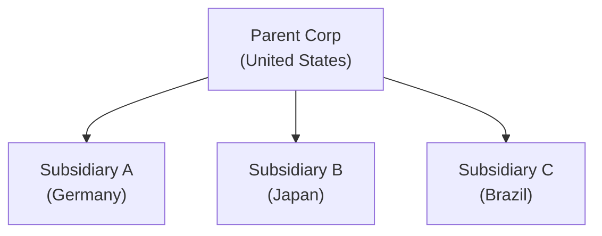
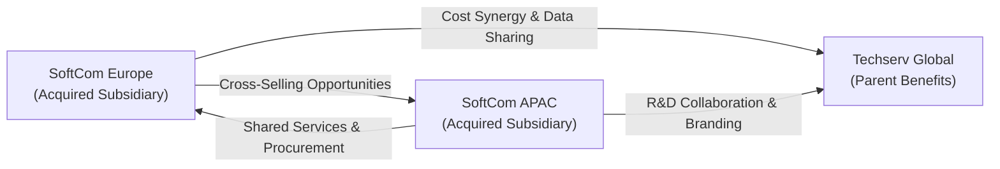

## 24.1 Multi-Entity, Multinational Acquisition

Mergers and acquisitions (M&A) involving entities from different countries and multiple corporate structures present a labyrinth of accounting, regulatory, and operational challenges. In this section, we will examine key considerations in executing a multi-entity, multinational acquisition. You will learn how to determine the appropriate consolidation framework, address foreign exchange transactions and translations, allocate goodwill, and evaluate synergies for optimal post-acquisition performance. This material aligns closely with earlier discussions in Chapter 14 (Business Combinations, Consolidations, and Foreign Operations), Chapter 9 (Valuation Techniques and Investment Decisions), and Chapter 10 (Indefinite-Lived Intangible Assets and Goodwill), providing a practical context for applying those concepts in a real-world scenario.

---

### Introduction

A multi-entity, multinational acquisition encompasses acquiring targets in more than one jurisdiction or consolidating multiple subsidiaries under a single corporate umbrella. Typically, such transactions aim to:

• Expand the acquirer’s global footprint and market share.  
• Leverage R&D and intangible assets across borders.  
• Integrate supply chains, reduce costs, and realize economies of scale.  
• Diversify cash flows and currency exposure.  

Before, during, and after the acquisition, thorough attention must be paid to legal structures, statutory reporting requirements, consolidation methodology, foreign exchange management, tax implications, and synergy analysis. These topics are tested on the BAR section of the CPA Exam, reflecting the complexity of modern business operations.

---

### Key Steps in the Acquisition Process

In a multi-entity, multinational setting, the acquisition process typically involves the following steps:

• Target Identification & Due Diligence: Examining the financial health, operational processes, and regulatory environment of each target subsidiary.  
• Valuation & Deal Structuring: Applying various valuation methods (discussed in Chapter 9) and negotiating deal terms that consider local regulations, currency risks, and capital structure implications.  
• Financing & Regulatory Approval: Arranging cross-border financing, satisfying local government approval, ensuring compliance with foreign investment regulations, and addressing potential antitrust laws.  
• Accounting for the Business Combination: Determining the acquisition date, measuring the fair value of acquired assets (including intangible and goodwill), liabilities, and noncontrolling interests, if any.  
• Post-Acquisition Integration & Synergy Realization: Consolidating operations, addressing redundancies, optimizing supply chains, and enacting strategic initiatives to realize synergy targets.

---

### Consolidation Mechanics and Financial Reporting

Central to a multi-entity, multinational acquisition is the application of consolidation rules under U.S. GAAP (ASC 805, Business Combinations, and ASC 810, Consolidation) or IFRS (IFRS 3, Business Combinations, and IFRS 10, Consolidated Financial Statements). Additional guidance may be found in Chapter 14 of this guide.

#### Determining the Consolidation Approach

• Identify the Controlling Entity (Parent): The acquirer typically obtains more than 50% of the voting shares or controlling interest in the target’s governance.  
• Recognize Subsidiaries and Affiliates: Subsidiaries with a controlling interest are fully consolidated, whereas affiliates with significant influence but no control are usually accounted for under the equity method.  
• Evaluate Variable Interest Entities (VIEs): Certain entities might qualify as VIEs for which consolidation is required even without majority ownership or voting control if the acquirer is the primary beneficiary.

#### Goodwill and Intangible Asset Allocation

As detailed in Chapter 10, any excess of the fair value of purchase consideration over the fair value of net identifiable assets is recorded as goodwill. For multi-entity acquisitions, goodwill may be recognized at multiple reporting units, especially if integrated targets remain distinct from an operational or reporting perspective. Key intangible assets include:

• Brand names or trademarks specific to each region.  
• Patented technologies or software solutions recognized differently in each jurisdiction.  
• Customer relationships and supply chain networks benefiting different segments within the group.

#### Consolidated Financial Statements

Consolidated financial statements aggregate the parent and its subsidiaries’ financial statements into a single presentation. Steps include:

1. Combine like items (assets, liabilities, income, expenses).  
2. Eliminate intercompany balances and transactions (e.g., intercompany sales of goods or services).  
3. Recognize noncontrolling interests if the parent does not own 100% of the subsidiary.  
4. Address foreign currency translation or remeasurement when preparing group-level financials.

---

### Foreign Exchange Considerations

Foreign exchange issues are among the most challenging aspects of a multi-entity, multinational acquisition. Chapter 14.3 offers a general overview. This section dives deeper into:

• Exchange Rate Exposure: Transaction risk (e.g., currency exchange for an intercompany loan), translation risk (consolidating foreign subsidiary financials), and economic risk (long-term impact on competitiveness).  
• Functional vs. Reporting Currency: Identifying each subsidiary’s functional currency (the primary currency in which the entity operates). Subsequent translation into the parent’s reporting currency typically follows specific accounting guidelines:  
  – Income statement items are translated at average exchange rates over the reporting period.  
  – Assets and liabilities are translated at the balance sheet date exchange rates.  
  – Equity components use historical exchange rates.  
  – Translation adjustments are accumulated in Other Comprehensive Income (OCI).  
• Remeasurement for Entities Operating in High-Inflation or Non-Functional Currencies: If a subsidiary uses a currency other than its functional currency to maintain books, remeasurement is required rather than translation.  

#### Managing Foreign Exchange Risk

Strategies to mitigate currency fluctuations include:

• Natural Hedges: Balancing local currency revenue with local currency costs.  
• Financial Instruments: Using derivatives such as forward contracts, swaps, or options to hedge transaction risks. (See Chapter 15 for detailed guidance on accounting for derivatives and hedging.)  
• Multicurrency Netting: Offsetting payables and receivables in the same currency across subsidiaries.  

---

### Synergy Analysis

Realizing synergies—both financial and strategic—is a primary motivation behind acquisitions. Synergy can be thought of as the extra value that the combined entity can achieve over and above what the two entities can accomplish independently.

#### Types of Synergies

1. Cost Synergies: Reductions in operating expenses, such as consolidated procurement, shared services, elimination of duplicate functions, or combined logistics.  
2. Revenue Synergies: Cross-selling opportunities, expanded customer bases, and product line integration that drives top-line growth.  
3. Financial Synergies: Access to lower cost of capital, improved foreign exchange management, and optimized tax positions.  
4. Intangible Synergies: Enhanced reputation or brand value, broader R&D capabilities, and accelerated innovation.

#### Estimating and Monitoring Synergies

• Capital Budgeting Tools: Use net present value (NPV) and internal rate of return (IRR) to estimate the paid price against potential synergy benefits (see Chapter 8.2 for more on capital budgeting).  
• Integration Teams: Establish committees across finance, operations, and IT to track synergy realization.  
• Balanced Scorecard: Utilize nonfinancial metrics—like supplier lead time, customer retention, or new product launches—alongside financial measures to track synergy success (see Chapter 6 for the Balanced Scorecard approach).

---

### Practical Diagram of a Multi-Entity Structure

Below is a simplified Mermaid diagram illustrating how a parent corporation, headquartered in the United States, might structure its foreign subsidiaries after an acquisition. Each subsidiary operates in its primary functional currency, but all results are consolidated into the parent’s U.S. dollar reporting currency.

Each subsidiary may have unique reporting, statutory requirements, and timing differences for local audit submission. Additionally, expect various challenges around intercompany elimination. Internal transactions among B, C, and D (e.g., shipping components from Germany to Japan) must be removed in consolidated statements to avoid double counting of revenues and expenses.

---

### Integration Strategies in a Multinational Setting

A comprehensive integration plan addresses:

• Organizational Culture and Management Structures: Align leadership styles, compensation, and performance metrics across geographies.  
• Technology Platforms and Data: As discussed in Chapter 3, consistent data analytics tools, shared databases, and robust system integration are critical for real-time performance tracking.  
• Transfer Pricing Policies: Ensure compliance with local and global regulations, establishing arm’s-length pricing for intercompany transactions, factoring in tax, customs, and currency implications.  
• Regulatory Compliance: Differences in IFRS vs. U.S. GAAP (Chapter 23) or local statutory requirements can delay or complicate timely financial reporting.

---

### Real-World Example: Hypothetical Techserv Global Acquisition

To illustrate, consider a scenario where Techserv Global, a U.S. software conglomerate, acquires a 60% controlling stake in SoftCom Europe GmbH (headquartered in Germany) and an 80% stake in SoftCom APAC KK (headquartered in Japan). Each has various subsidiaries throughout Europe and Asia.

1. Deal Structure:  
   – Techserv issues new equity for the SoftCom stake in Germany and arranges a cash transaction financed by a U.S. syndicated loan for the SoftCom unit in Japan.  
   – The final purchase consideration is $1.5 billion for SoftCom Europe and $2.2 billion for SoftCom APAC.

2. Valuation and Purchase Price Allocation (PPA):  
   – Fair Value of Net Assets for SoftCom Europe is $1.0 billion; $500 million is recognized as goodwill.  
   – For SoftCom APAC, $1.6 billion of fair value of net identifiable assets results in $600 million in goodwill.  
   – Customer relationships in both regions are valued at $300 million collectively.

3. Foreign Currency Translation:  
   – The German entity’s functional currency is the Euro (EUR), and the Japanese entity’s functional currency is the Yen (JPY).  
   – SoftCom Europe uses IFRS in statutory reporting, SoftCom APAC uses local Japanese GAAP for statutory, but both are aligned to IFRS for local consolidation. Techserv Global must convert these financials to U.S. GAAP and translate them into USD for group reporting.

4. Consolidation:  
   – Techserv includes SoftCom Europe as a consolidated entity with a 40% noncontrolling interest.  
   – SoftCom APAC’s 20% noncontrolling interest is also reflected separately.  
   – All intercompany receivables, payables, sales, and cost of sales among Techserv, SoftCom Europe, and SoftCom APAC are eliminated.

5. Synergy Targets:  
   – Shared R&D to develop integrated software solutions for U.S., European, and Asian markets.  
   – Combined marketing and branding campaigns.  
   – Centralization of certain procurement activities (e.g., cloud infrastructure, hardware).

---

### Illustrative Synergy Flow

The following Mermaid diagram represents how synergy flows from the newly acquired subsidiaries back to the parent. These synergy drivers not only reduce costs but also potentially increase revenues, thus justifying the premium Techserv paid.

---

### Best Practices and Common Pitfalls

**Best Practices:**
• Early Integration Planning: Begin synergy and integration discussions during due diligence to streamline post-acquisition activities.  
• Consistent Accounting Policies: Harmonize revenue recognition methods (Chapter 12), capitalization policies for intangible assets (Chapter 10), and foreign currency practices (Chapter 14.3).  
• Robust Data Infrastructure: Implement integrated ERP systems and analytics platforms (Chapters 3 and 7) to manage performance across multiple geographies.  
• Ongoing Monitoring of Key Metrics: Track synergy progress through regular updates to both financial and nonfinancial KPIs.

**Common Pitfalls:**
• Underestimating Cultural Differences: A mismatch in business cultures or management styles can slow integration, erode trust, and dampen synergy realization.  
• Overlooking Working Capital Management: Cross-border acquisitions often require bridging currency mismatches in accounts payable and receivable, generating significant liquidity strain if unaddressed.  
• Fragmented Information Systems: Inconsistent data, chart of accounts, or system platforms complicate real-time reporting, delaying financial closes and synergy assessments.  
• Failure to Recognize IFRS vs. U.S. GAAP Differences: Detailed analysis of intangible assets, revenue recognition, hedging, and pensions across multiple jurisdictions can reveal “hidden” liabilities or unrecognized assets if not properly accounted for.

---

### Additional References for Deeper Exploration

• Chapter 14: “Business Combinations, Consolidations, and Foreign Operations” – A thorough breakdown of consolidation and foreign currency translation.  
• Chapter 10: “Indefinite-Lived Intangible Assets and Goodwill” – Insights for allocation and impairment testing.  
• Chapter 15: “Derivatives, Hedges, and Financial Instruments” – Guidance for mitigating foreign exchange volatility.  
• Chapter 23: “Emerging Issues in Accounting and Analysis” – IFRS vs. U.S. GAAP key differences and evolving regulatory standards.  
• Chapter 9: “Valuation Techniques and Investment Decisions” – Tools to evaluate multi-entity acquisition feasibility and synergy potential.

---

### Conclusion

Multi-entity, multinational acquisitions present a dynamic—and often daunting—set of accounting, strategic, and operational challenges. Integration success hinges on mastering foreign exchange considerations, developing consistent global consolidation frameworks, and accurately identifying and realizing synergies. By applying the technical guidance discussed throughout this guide—particularly in cost accounting, valuation, and consolidated reporting—you will be well-equipped to navigate any complex cross-border transaction. This competence is directly tested in the BAR section of the CPA Examination, reflecting the global nature of modern business.

Gaining practical experience through real or simulated scenarios, as well as actively keeping pace with innovations in data analytics and evolving regulatory environments, will bolster your professional preparedness. With a strong foundation in consolidation mechanics, synergy analysis, and foreign exchange management, you can shape successful, integrated multinational entities that deliver sustainable performance.

---

## Test Your Knowledge: Multinational Acquisition, Synergies, and FX Risk Quiz



### In a multi-entity, multinational acquisition under U.S. GAAP, which situation generally triggers full consolidation?
- [ ] Ownership of at least 20% of voting rights.
- [ ] Significant influence over a foreign affiliate.
- [x] Having a controlling financial interest (typically more than 50% ownership).
- [ ] Having a strategic alliance with another entity.

> **Explanation:** Full consolidation typically applies when the acquirer controls the entity, often signified by ownership exceeding 50%. Significant influence alone does not constitute “control” and usually leads to the equity method.

### When preparing consolidated financial statements with foreign subsidiaries, which exchange rate method is generally used for income statement items under U.S. GAAP?
- [x] Average rate for the period.
- [ ] Spot rate at the end of the period.
- [ ] Historical exchange rate at the beginning of the period.
- [ ] Weighted average of the prior reporting period.

> **Explanation:** Under the current rate method, income statement items are generally translated at the average rate over the reporting period.

### Which of the following best describes a common cost synergy in a multinational acquisition?
- [x] Consolidating procurement functions across subsidiaries.
- [ ] Improving employee morale through cultural training.
- [ ] Launching a new product appealing to local tastes in various countries.
- [ ] Creating marketing programs in local languages.

> **Explanation:** Cost synergies often stem from streamlining or combining back-office and operational activities such as procurement, logistics, or payroll functions.

### In a consolidated statement, how is goodwill generally recognized?
- [x] As the excess of purchase price over the fair value of net identifiable assets.
- [ ] At the net book value of acquired assets less assumed liabilities.
- [ ] As the difference between fair value of assets and liabilities multiplied by the interest rate.
- [ ] Allocated entirely to the acquirer’s retained earnings.

> **Explanation:** Goodwill is recorded as the difference between the purchase price and the fair value of identifiable net assets acquired under ASC 805 or IFRS 3.

### Which strategy would best mitigate transaction exposure in foreign currencies?
- [x] Using forward contracts to lock in known exchange rates.
- [ ] Maintaining multiple petty cash accounts in different currencies.
- [x] Implementing natural hedges between revenues and expenses.
- [ ] Reporting results in local currency only.

> **Explanation:** Transaction exposure arises from actual cross-border transactions. Forward contracts and natural hedges (matching local currency revenues with local currency costs) are effective methods to manage or reduce the volatility of currency movements.

### What is a key difference between translation and remeasurement under foreign currency accounting rules?
- [x] Translation applies when a subsidiary’s functional currency is its local currency; remeasurement applies when books are not maintained in the functional currency.
- [ ] Remeasurement involves using average exchange rates for assets and liabilities.
- [ ] Translation uses historical exchange rates for the income statement.
- [ ] Translation is always performed before consolidation, while remeasurement after consolidation.

> **Explanation:** Translation is for subsidiaries operating primarily in their local currency (functional currency), while remeasurement is necessary when the subsidiary’s accounting records are in a currency other than its functional currency.

### Which of the following might create a noncontrolling interest in the consolidated financial statements?
- [x] The acquired subsidiary is only 70% owned by the parent.
- [ ] The parent issues preferred stock to finance the acquisition.
- [x] Ownership of 80% in a subsidiary with 20% held by external investors.
- [ ] Buying 40% of the voting shares in the open market.

> **Explanation:** When the parent owns less than 100% but still holds control, a noncontrolling interest in the subsidiary is recognized. Purchasing only 40% does not yield control.

### What is the primary purpose of eliminating intercompany transactions in consolidation?
- [x] To prevent double counting of revenues and expenses within the group.
- [ ] To adjust for foreign exchange valuation.
- [ ] To ensure intangible assets are valued at fair value.
- [ ] To measure noncontrolling interests accurately.

> **Explanation:** Intercompany eliminations remove internal sales, expenses, and balances that inflate group results, ensuring that consolidated statements reflect only transactions with outside parties.

### If the acquirer has determined that identifiable net assets have a fair value of $500 million and the acquisition price is $620 million, how much goodwill is recognized?
- [x] $120 million
- [ ] $500 million
- [ ] $620 million
- [ ] $0 million

> **Explanation:** Goodwill is the excess of the purchase price over the fair value of net identifiable assets, or $620 million – $500 million = $120 million.

### In a multinational acquisition, synergy often includes expanding global market share. Is this statement true or false?
- [x] True
- [ ] False

> **Explanation:** Synergy frequently covers both cost reductions and revenue enhancements, including tapping new geographic markets, leveraging global customer bases, and streamlining supply chains to grow market share.



---

## For Additional Practice and Deeper Preparation

### [Business Analysis and Reporting (BAR) CPA Mock Exams](https://www.udemy.com/course/bar-cpa-mock-exams/?referralCode=ADBE2E84BEE9CB6243CA)

**Business Analysis and Reporting (BAR) CPA Mocks:** 6 Full (1,500 Qs), Harder Than Real! In-Depth & Clear. Crush With Confidence!

- Tackle full-length mock exams designed to mirror real BAR questions.  
- Refine your exam-day strategies with detailed, step-by-step solutions for every scenario.  
- Explore in-depth rationales that reinforce higher-level concepts, giving you an edge on test day.  
- Boost confidence and minimize anxiety by mastering every corner of the BAR blueprint.  
- Perfect for those seeking exceptionally hard mocks and real-world readiness.  

_Disclaimer: This course is not endorsed by or affiliated with the AICPA, NASBA, or any official CPA Examination authority. All content is for educational and preparatory purposes only._
