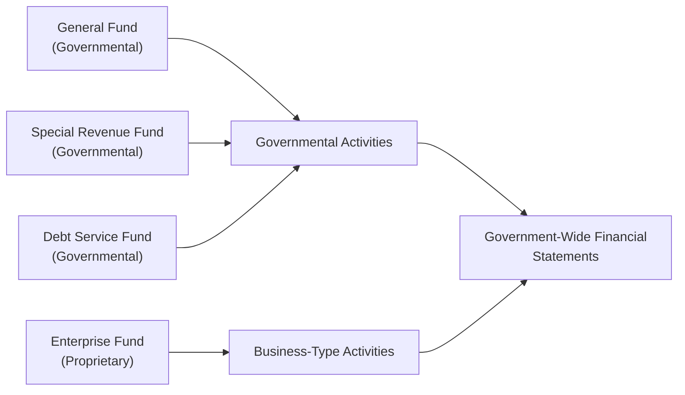

## 24.2 Governmental Entities with Fund Consolidations

Effectively consolidating multiple governmental funds into government-wide statements presents one of the most nuanced and critical aspects of public sector financial reporting. This process underscores the inherent complexity of combining different fund types—each with its own measurement focus and basis of accounting—into a single set of consolidated statements that reveal the overall fiscal health of a government. In this section, we examine (1) the key characteristics of fund-level financial statements, (2) the methodologies used to reconcile these statements to the government-wide perspective, and (3) essential disclosures in an Annual Comprehensive Financial Report (ACFR). Finally, we showcase these concepts in a cohesive mini-case featuring a practical example of multi-fund consolidation.

-------------------------------------------------------------------------------
## Overview of Governmental Fund Structures

Governmental entities frequently manage a variety of funds, each aligning with specific operational missions and accounting standards (see Chapters 19–22). By design, each fund is a separate accounting entity, tracking unique resources, obligations, and activities. Common fund types include:

• General Fund: Captures the majority of day-to-day governmental operations and revenue sources (e.g., property taxes, sales taxes).  
• Special Revenue Funds: Manage resources restricted or committed for specified purposes, such as public libraries or road maintenance.  
• Capital Projects Funds: Account for financial resources intended for acquisition or construction of major capital facilities.  
• Debt Service Funds: Accumulate resources for the payment of principal and interest on long-term debt.  
• Permanent Funds: Handle endowments or trust arrangements where principal remains intact while earnings support government activities.

In addition to these governmental funds, many governments operate proprietary (enterprise and internal service) funds and fiduciary funds, each subject to distinct reporting rules. While Chapters 19–22 discuss the details extensively, below is a brief reminder:

• Proprietary (Enterprise) Funds: Report on business-like activities that generate user fees, such as public utilities or airports.  
• Proprietary (Internal Service) Funds: Provide services predominantly to other governmental units on a cost-reimbursement basis.  
• Fiduciary Funds: Track resources held in a trustee or agency capacity and generally exclude in government-wide statements.

-------------------------------------------------------------------------------
## Key Differences: Fund-Level vs. Government-Wide Statements

Before delving into consolidations, understanding the differences between fund-level and government-wide statements is essential:

1. Basis of Accounting:  
   – Governmental funds use the modified accrual basis, focusing on short-term financial resources. Revenues are recognized when measurable and available, while expenditures are recorded when the underlying liability is incurred (if typically expected to be liquidated with current resources).  
   – Government-wide statements apply the full accrual basis, focusing on economic resources. Operating revenues and expenses are recognized similarly to private-sector accounting rules.

2. Measurement Focus:  
   – Governmental funds measure short-term financial assets and liabilities, omitting some long-term items such as most capital assets and long-term debt from fund statements.  
   – Government-wide statements measure all economic resources, including capital assets (net of depreciation) and long-term liabilities.

3. Reporting Objectives:  
   – Fund-Level Statements: Demonstrate compliance with budgets, restrictions, and fund-specific mandates.  
   – Government-Wide Statements: Provide a broad view of the government’s overall financial position and long-term operational results.

Because of these contrasts, governmental fund operations do not simply “roll up” to the government-wide perspective without adjustments. The consolidation and reconciliation processes are critical steps to bridge these accounting and reporting differences.

-------------------------------------------------------------------------------
## The Consolidation Process: Governmental Funds into Government-Wide

### Step 1: Aggregate All Governmental Funds
The initial step is to consolidate all governmental funds (e.g., General Fund, Special Revenue Funds, Debt Service Funds, Capital Projects Funds, Permanent Funds) into a single combined statement. At this point, all interfund activity among these funds is still visible—these transactions must later be eliminated at the government-wide level.

### Step 2: Eliminate Interfund Balances and Transfers
Many funds engage in interfund transfers or hold payables/receivables with each other. For instance, the General Fund might transfer finances to a Special Revenue Fund, or it may owe a short-term loan to a Capital Projects Fund. At the government-wide level, such internal activity is eliminated so that only external (truly third-party) transactions remain. Eliminating interfund balances prevents inflating overall assets or liabilities.

### Step 3: Convert Fund-Level Modified Accrual Transactions to Full Accrual
To arrive at the economic resources focus, adjustments are required for:

• Capital Assets: Governmental funds typically expense capital outlays in the period purchased. At the government-wide level, these assets are capitalized and depreciated over their useful lives.  
• Long-Term Liabilities: Debt proceeds are recognized as “other financing sources” in governmental fund statements. Conversely, government-wide statements treat them as long-term liabilities. Debt service expenditures often need to be reclassified into principle (liability reduction) and interest expense.  
• Other Adjustments: Examples include recognition of accrued liabilities (such as compensated absences, pensions, or other post-employment benefits), adjusting property tax revenues to a full-accrual perspective, and eliminating any inflows/outflows not recognized under full accrual accounting (e.g., unavailable revenue under modified accrual).

### Step 4: Combine Governmental and Business-Type Activities
Most governments also operate proprietary funds for business-type activities. Enterprise Funds are combined into the “Business-Type Activities” column of the government-wide statement of net position (and statement of activities), while Internal Service Funds are generally consolidated with governmental activities if they primarily serve governmental departments.

### Step 5: Compile the Government-Wide Financial Statements
After eliminating interfund balances, adding in capital assets, subtracting long-term liabilities, and adjusting for accrued revenues/expenses, the final “government-wide” statements are prepared:

• Statement of Net Position (governmental activities, business-type activities, total primary government)  
• Statement of Activities (expanding on program revenues vs. general revenues, net expense by function, changes in net position)

The outcome of these processes is a holistic representation of the government’s overall financial health, bridging from discrete, fund-level financial information to a comprehensive, full-accrual view.

-------------------------------------------------------------------------------
## ACFR Disclosures and Reconciliations

A hallmark of governmental reporting is the Annual Comprehensive Financial Report (ACFR). Within an ACFR, specific disclosures and supplementary schedules clarify the consolidation steps and ensure transparency:

• Reconciliation Schedules: Required by GASB (Governmental Accounting Standards Board) to reconcile fund balances in the balance sheet of governmental funds to the net position of governmental activities. A similar statement reconciles changes in fund balances on the statement of revenues, expenditures, and changes in fund balances to the changes in net position on the statement of activities.  
• Note Disclosures: Offer details on capital assets, long-term debt, pension liabilities, OPEB liabilities, and any governmental or enterprise funds not discretely shown in other statements.  
• Combining Statements: For nonmajor funds, many governments provide combining statements in the ACFR’s supplementary information. These statements show how various small funds ultimately roll into one aggregated column in the primary fund statements.  
• Statistical Section: Though not directly tied to consolidation, the statistical section of an ACFR provides historical trends, revenue capacity, debt capacity, and demographic data that further contextualize the financial statements.

Below is a simplified reconciliation approach to illustrate how these schedules typically appear:

1. Fund Balance – Total Governmental Funds  
2. Add: Capital Assets (net of accumulated depreciation)  
3. Subtract: Long-Term Liabilities (e.g., general obligation bonds)  
4. Adjust for Accrued Revenues: e.g., property taxes not yet recognized under modified accrual but recognized under full accrual  
5. Adjust for Accrued Expenses: e.g., accrued interest, compensated absences  
6. Result: Net Position of Governmental Activities

-------------------------------------------------------------------------------
## Mini-Case: Sunville City – Consolidating Multiple Funds

To illustrate these concepts, let us examine a hypothetical government, Sunville City, which maintains several funds:

• General Fund (GF)  
• Special Revenue Fund – Library (SRF)  
• Debt Service Fund (DSF)  
• Enterprise Fund – City Utilities (EF)  
• Internal Service Fund – Fleet Management (ISF)

### Scenario Overview
Sunville City ends its fiscal year with the following simplified data:

1. General Fund  
   – Fund Balance (modified accrual): $700,000  
   – Interfund Payable to DSF: $50,000  
   – Net Capital Outlays in Current Year: $200,000 (treated as expenditures in GF statements)

2. Special Revenue Fund – Library  
   – Fund Balance (modified accrual): $200,000  
   – Receivable from GF: $20,000  
   – Capital Expenditures in the Year: $100,000 (treated as expenditures in SRF statements)

3. Debt Service Fund  
   – Fund Balance (modified accrual): $150,000  
   – Bonds Payable: $1,000,000 (used for city-wide projects)  
   – Interest Payable: $30,000  
   – Received Transfer from GF: $200,000  

4. Enterprise Fund – City Utilities  
   – Net Position (full accrual): $1,500,000  
   – Internal service usage: This EF purchases fleet management services from the ISF.  

5. Internal Service Fund – Fleet Management  
   – Net Position (full accrual): $300,000  
   – Primarily serves governmental functions (General Fund, Library vehicles, etc.). This suggests it will be consolidated under Governmental Activities in the government-wide statements.

#### Governmental Funds Consolidation
First, we combine the General Fund, Special Revenue Fund, and Debt Service Fund under modified accrual:

(1) Identify combined fund balance:
   – GF: $700,000  
   – SRF: $200,000  
   – DSF: $150,000  
   – Total combined fund balance (governmental funds): $1,050,000  

(2) Eliminate Interfund Activities:
   – GF owes DSF $50,000.  Eliminate this payable and the corresponding receivable in DSF.  
   – GF transfers $200,000 to DSF. At the combined funds level, this transfer is recognized as an “other financing source” for DSF and a reduction of resources in GF. For the combined total, the $200,000 net effect is zero (although it remains recorded at the combined statements before final government-wide elimination).  

#### Adjusting to Full Accrual: Government-Wide View
Adjust for capital assets and long-term debt:

• Capital Assets: The $300,000 total capital expenditures for GF and SRF need to be capitalized. Assume a five-year useful life with no depreciation recognized in the first year for simplicity. The addition to capital assets is $300,000 collectively.  
• Long-Term Liabilities: The $1,000,000 of outstanding bonds is recognized as a liability in the government-wide statements.  
• Interest Payable: $30,000 recognized as a current liability in the government-wide statements.  
• Internal Service Fund: The $300,000 net position from the Fleet Management Fund will generally roll into Governmental Activities if it predominantly serves governmental funds.  
• Eliminated Interfund: The $50,000 payable from GF to DSF is also removed in the final consolidation.  

Calculation of Governmental Activities Net Position (simplified):

1. Fund Balance – Total Governmental Funds: $1,050,000  
2. Plus: Newly Capitalized Assets: $300,000  
3. Subtract: Bonds Payable: $(1,000,000)  
4. Subtract: Interest Payable: $(30,000)  
5. Add: Internal Service Fund Net Position: $300,000  
6. Result: $620,000 Net Position (Governmental Activities)

Meanwhile, the City Utilities (Enterprise Fund) retains its $1,500,000 net position in the Business-Type Activities column. Ultimately, in the government-wide Statement of Net Position, you would see something akin to:

• Governmental Activities: $620,000  
• Business-Type Activities: $1,500,000  
• Total Primary Government: $2,120,000  

### ACFR Disclosures
Sunville City’s ACFR includes:

• A Reconciliation Schedule bridging the $1,050,000 total governmental fund balances to the $620,000 net position of governmental activities.  
• Explanatory footnotes detailing significant interfund transactions, capital asset accounting policies, the outstanding bond obligations, and the reasoning for combining the Internal Service Fund with governmental activities.  
• Combining statements for the library fund and other smaller funds if they exist.  
• Budgetary comparisons and schedules, especially for the General Fund and major Special Revenue Funds.

-------------------------------------------------------------------------------
## Visualizing the Consolidation Flow

Below is a simplified Mermaid diagram illustrating the flow from multiple funds to a consolidated government-wide perspective:

Explanation:
• The General Fund, Special Revenue Fund, and Debt Service Fund combine into the Governmental Activities column.  
• The Enterprise Fund forms the Business-Type Activities column.  
• Together, both columns flow into the final presentation of government-wide financial statements.

-------------------------------------------------------------------------------
## Common Pitfalls in Fund Consolidations

1. Failing to Eliminate Interfund Activity  
   – Leaving transfers, interfund receivables, or payables uneliminated may inflate assets, liabilities, or revenues and expenditures across the consolidated statements.

2. Misclassification of Capital Outlays  
   – Overlooking the need to capitalize and depreciate items in the government-wide statements, leading to underestimation of total net assets and misrepresented expenditures.

3. Inconsistent Handling of Long-Term Liabilities  
   – Governmental funds treat bond proceeds as an inflow of current resources. However, at the government-wide level, it constitute debt that must be carried on the balance sheet.

4. Overlooking Internal Service Fund Allocations  
   – If an internal service fund primarily benefits governmental activities, its net position typically merges with governmental activities in the government-wide statements. Failing to account for this can distort both net position and expenses in governmental and proprietary columns.

5. Omitting Required Reconciliation Schedules  
   – GASB requires clear reconciliations between fund-level statements (modified accrual) and the government-wide statements (full accrual). Skipping these reconciliations diminishes transparency and could lead to audit findings.

-------------------------------------------------------------------------------
## Best Practices and Strategies

1. Maintain Detailed Workpapers  
   – Track each fund’s transactions in separate ledgers, then systematically identify interfund transactions, capital asset activity, and long-term debt for government-wide conversion.

2. Automate Interfund Eliminations  
   – Use modern accounting software to flag interfund transfers and balances early, reducing manual error. As taught in Chapter 3 (Data and Analytics), leveraging technology can streamline data processing and produce robust audit trails.

3. Document Accounting Policies Thoroughly  
   – Make sure capitalization thresholds, depreciation methods, and bond accounting practices are consistently applied, especially during the year-end closing process.

4. Provide Clear Explanations in ACFR  
   – Support each reconciliation line item with references to footnotes detailing capital asset purchases, bond proceeds, interest accruals, or internal service fund consolidation. Clarity fosters stakeholder confidence.

5. Continuously Update Staff and Stakeholders  
   – Regular training for accounting staff, audit committees, and elected officials ensures everyone understands the complexities of fund consolidations and the resultant disclosures.

-------------------------------------------------------------------------------
## References for Further Exploration

• GASB Codification, Section 2200: Comprehensive Annual Financial Report  
• Chapters 19–21 of this guide: Governmental accounting fundamentals, financial statement preparation, reconciling modified accrual to full accrual  
• GFOA (Government Finance Officers Association) publications on best practices for ACFR preparation  
• “Governmental Accounting, Auditing, and Financial Reporting” by Stephen J. Gauthier

-------------------------------------------------------------------------------
## Quiz: Governmental Fund Consolidations and ACFR Reporting



### In fund-level statements for governmental funds, capital outlays are typically reported as:
- [x] Expenditures
- [ ] Capital assets
- [ ] Depreciation expense
- [ ] Long-term liabilities

> **Explanation:** Under modified accrual accounting for governmental funds, expenditures for capital items are recognized when the expenditure occurs. At the government-wide level, these outlays are converted to capital assets and depreciated over time.

### Which of the following accurately describes the objective of a reconciliation schedule?
- [ ] Explaining variance in the Enterprise Fund’s revenue cycles
- [x] Bridging the gap between fund-level financials (modified accrual) and government-wide financials (full accrual)
- [ ] Eliminating materiality thresholds for financial reporting
- [ ] Revealing fiduciary fund activities for public view

> **Explanation:** GASB requires reconciliations in the ACFR that show how the fund-level statements convert to government-wide statements, ensuring stakeholders understand adjustments for capital assets, long-term liabilities, and accrual-based transactions.

### In government-wide reporting, how should an internal service fund that primarily benefits governmental activities be presented?
- [x] Consolidated within Governmental Activities
- [ ] Consolidated within Business-Type Activities
- [ ] Excluded from the government-wide financial statements
- [ ] Treated as a fiduciary fund

> **Explanation:** If the internal service fund primarily benefits governmental operations, its net position and activities merge into Governmental Activities for the government-wide statements, aligning with the economic resources approach.

### Which of the following items must be subtracted from the total fund balance of governmental funds to reach net position in the government-wide statements?
- [ ] Interfund receivables
- [ ] Prepaid expenses
- [x] Long-term liabilities (such as bonds payable)
- [ ] Short-term deferred inflows

> **Explanation:** To convert from fund-level modified accrual to government-wide accrual, you must subtract outstanding long-term debt from the total governmental fund balance.

### An interfund payable between a Special Revenue Fund and a General Fund appears in the preliminary consolidation. In the final government-wide statements, that payable:
- [x] Is eliminated against the corresponding interfund receivable
- [ ] Is reported as a long-term liability
- [x] Triggers interest expense
- [ ] Remains on the face of the statements to measure fund liquidity

> **Explanation:** Interfund payables and receivables are internal transactions that should be eliminated within the same government-wide activity.

### Why is depreciation typically not captured in governmental fund statements?
- [x] Because governmental funds use the modified accrual basis focusing on current financial resources
- [ ] Because capital assets are never used in governmental activities
- [ ] Because depreciation is conceptually incompatible with public finances
- [ ] Because it is recorded only for fiduciary funds

> **Explanation:** Under modified accrual, governmental funds recognize expenditures rather than depreciation. Depreciation is recorded in government-wide financials to reflect the long-term consumption of assets.

### In Sunville City’s mini-case, the $300,000 net position from the Fleet Management Internal Service Fund is:
- [x] Reported under Governmental Activities in government-wide statements
- [ ] Reported under Business-Type Activities due to its self-supporting nature
- [x] Eliminated entirely
- [ ] Recognized as a direct liability in the Debt Service Fund

> **Explanation:** Because the Internal Service Fund mainly services governmental departments, it belongs under Governmental Activities in the government-wide statements, boosting overall net position.

### What key advantage do ACFR reconciliation schedules provide to financial statement users?
- [x] They promote transparency by showing how fund balances convert to net position
- [ ] They enable off-balance sheet financing
- [ ] They summarize all non-spendable resources
- [ ] They remove the need for external audits

> **Explanation:** Reconciliation schedules explain the transitions between modified and full accrual accounting measures, thus reinforcing transparency and understandability of government finances.

### A city issues bonds and recognizes the proceeds in its General Fund. How does this transaction appear in the government-wide statements?
- [x] As an increase in long-term liabilities
- [ ] As an inflow of revenue in the Statement of Activities
- [ ] As an increase in net investment in capital assets
- [ ] As an increase in fund balance

> **Explanation:** Bond proceeds in a governmental fund are initially recorded as “other financing sources,” but in government-wide statements, they create a long-term liability rather than a revenue inflow.

### A Reconciliation Schedule helps readers realize that:
- [x] True
- [ ] False

> **Explanation:** Indeed, the Reconciliation Schedule addresses differences in measurement focus and basis of accounting, explaining how fund-level results translate into the holistic government-wide presentation.



-------------------------------------------------------------------------------
## For Additional Practice and Deeper Preparation

### [Business Analysis and Reporting (BAR) CPA Mock Exams](https://www.udemy.com/course/bar-cpa-mock-exams/?referralCode=ADBE2E84BEE9CB6243CA)

**Business Analysis and Reporting (BAR) CPA Mocks:** 6 Full (1,500 Qs), Harder Than Real! In-Depth & Clear. Crush With Confidence!

- Tackle full-length mock exams designed to mirror real BAR questions.  
- Refine your exam-day strategies with detailed, step-by-step solutions for every scenario.  
- Explore in-depth rationales that reinforce higher-level concepts, giving you an edge on test day.  
- Boost confidence and minimize anxiety by mastering every corner of the BAR blueprint.  
- Perfect for those seeking exceptionally hard mocks and real-world readiness.  

_Disclaimer: This course is not endorsed by or affiliated with the AICPA, NASBA, or any official CPA Examination authority. All content is for educational and preparatory purposes only._
