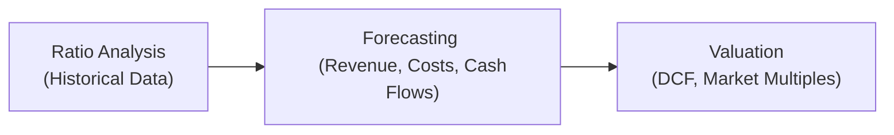

## 24.4 Integrative Scenarios for Ratios, Forecasts, and Valuation

Achieving mastery in Business Analysis and Reporting (BAR) requires the ability to bring together multiple disciplines—ratio analysis, forward-looking modeling, and thorough valuation techniques—into a cohesive framework. This section aims to show you how to integrate core concepts from Chapters 4 (Financial Statement Analysis), 7 (Budgeting and Forecasting), 9 (Valuation Techniques and Investment Decisions), and 23 (Emerging Issues in Accounting and Analysis), among others. By weaving together performance measurement, prospective analysis, and IFRS/GAAP differences, you will see how real-world decision-makers use accounting data to project future performance and assign a fair value to enterprises.

This chapter features:

• A conceptual overview of how ratio analysis sets the stage for accurate forecasting.  
• Methods for constructing pro forma financial statements using historical insights.  
• Valuation approaches (Discounted Cash Flows, market multiples, and others) that link forecasts to equity or enterprise value.  
• Considerations for IFRS vs. U.S. GAAP differences that influence reported figures and, ultimately, valuation.  
• A practical case study that demonstrates how these components meld into one integrative scenario.

--------------------------------------------------------------------------------

## The Importance of Integrating Ratios, Forecasts, and Valuation

Financial ratios offer a snapshot of historical performance. However, an organization’s true value also depends on its future cash flows, strategic outlook, and market conditions. By translating ratio findings into forecast assumptions (e.g., growth rates, profit margins, working capital needs), analysts build pro forma statements. These prospective statements form the foundation for valuations—be it a Discounted Cash Flow model or a market-based approach. At each step, IFRS/GAAP differences can alter recognized revenue, expenses, or intangible assets, influencing ratio trends and future estimates.

In Chapter 4, you learned how to dissect profitability, liquidity, and solvency via ratio analysis. Now, we extend these insights to a forward-looking approach:  
• Historical profitability ratios guide prospective gross margin targets.  
• Liquidity and cash flow metrics inform future working capital modeling.  
• Solvency ratios, including debt-to-equity, help set assumptions for capital structure.  

Once these assumptions are well-established, we shift to constructing forecasts, as discussed in Chapter 7. With a credible set of pro forma statements, we apply valuation methods from Chapter 9 to determine an enterprise’s worth. This integrated method underscores how each step relies on the preceding one’s data and assumptions.

--------------------------------------------------------------------------------

## Conceptual Flow from Historical Ratios to Valuation

Below is a simplified diagram illustrating how historical ratios feed into forecasting models, and subsequently into valuation:

• A["Ratio Analysis   (Historical Data)"]: This involves evaluating trends in revenue growth, profit margins, liquidity, leverage, and efficiency.  
• B["Forecasting   (Revenue, Costs, Cash Flows)"]: Here, you integrate those trends and assumptions into future income statements, balance sheets, and statements of cash flows.  
• C["Valuation  (DCF, Market Multiples)"]: Finally, the forecasts drive valuation models, which then yield equity or enterprise values depending on your method.

--------------------------------------------------------------------------------

## Ratio Analysis as the Foundation

### Revisiting Key Ratios and Their Interpretations

• Profitability Ratios: These include Net Profit Margin, Return on Assets (ROA), and Return on Equity (ROE). By analyzing how these have trended over time, you can infer changes in product mix, cost structure, or pricing strategies.  

• Liquidity Ratios: Current ratio and quick ratio measure a company’s ability to meet short-term obligations. Historical patterns in these ratios help estimate the company’s future working capital needs.  

• Solvency Ratios: Leverage metrics such as Debt-to-Equity (D/E) and Interest Coverage Ratio can show how a firm balances growth via debt vs. equity. You may adjust capital structure assumptions in your forecast if the company’s debt load is too high or historically volatile.  

• Efficiency Ratios: Turnover ratios (inventory, receivables, payables) point to how efficiently a firm manages its operational cycle. Historical patterns offer clues about future day sales outstanding (DSO), day sales in inventory (DSI), and day payables outstanding (DPO).  

These ratios, covered extensively in Chapter 4, lay the groundwork for the prospective analysis you will use in forecasting and valuation.

--------------------------------------------------------------------------------

## Building Forecasts from Historical Analysis

### Step 1: Establish Key Assumptions

Drawing on historical ratios informs the baseline for forecasting. For instance, if a company’s historical revenue growth rate is averaging 8%, you might adopt 6–10% as a plausible range for future growth, adjusting for economic cycles, emerging competitors, and strategic plans.

• Sales Growth Rate: Should reflect macroeconomic conditions, industry trends, and company-specific strategies.  
• Gross Margin and Operating Margin: Derived from average historical ratios, adjusted for known cost-saving initiatives or changes in product mix.  
• Capital Expenditure (CapEx) Requirements: In Chapter 7, you learned to map out capital budgeting in line with growth targets. Historical CapEx-to-sales and depreciation patterns inform future spending.  
• Working Capital Needs: Use historical turnover ratios to project receivables, inventory, and payables cycles.  

### Step 2: Develop Pro Forma Statements

Based on your assumptions, you create pro forma Income Statements, Balance Sheets, and Statements of Cash Flows for a specified forecast horizon (commonly 5–10 years, depending on the industry and the company’s growth stage). While IFRS and GAAP mostly align on the general structure of financial statements, certain line items—especially intangible assets, revenue recognition patterns, and R&D costs—can differ.

Pro Forma Income Statement Components:  
• Revenue = Last year’s revenue × (1 + Estimated growth rate)  
• Cost of Goods Sold (COGS) = Revenue × (1 – Gross Margin)  
• Operating Expenses = Estimated from prior trends (e.g., as a % of revenue)  
• Operating Income (EBIT) = Revenue – COGS – Operating Expenses  

Then incorporate taxes, interest expense, and other line items to arrive at Net Income.  

Pro Forma Balance Sheet Components:  
• Current Assets (Accounts Receivable, Inventory) often linked to sales or COGS via historical turnover ratios.  
• Long-Term Assets (PPE, intangible assets) reflect capital expenditures minus depreciation/amortization. Capitalization rules under IFRS or GAAP can alter intangible asset accounting.  
• Liabilities (Accounts Payable, Long-Term Debt) and Equity are balanced to reflect your forecasted debt issuance or repayment strategy and any changes to share capital.  

Pro Forma Statement of Cash Flows:  
• Operating cash flows come from net income adjusted for non-cash items and changes in working capital.  
• Investing cash flows chiefly reflect CapEx and intangible asset expenditures (or their disposition if IFRS vs. GAAP rules differ on capitalization).  
• Financing cash flows may include dividends, share buybacks, or new debt/equity issuance.

### Step 3: Sensitivity Analysis and Scenario Planning

To strengthen the reliability of forecasts, incorporate techniques from Chapter 7:  
• Sensitivity Analysis: Vary critical assumptions—like sales growth or discount rates—to see their impact on forecasted outcomes.  
• Scenario Planning: Build best-case, worst-case, and base-case projections, each with unique assumptions. This approach provides a flexible view of how the company might respond to market volatility or operational shifts.

--------------------------------------------------------------------------------

## IFRS vs. U.S. GAAP Differences Affecting Forecasts

In an integrative scenario, IFRS/GAAP alignment becomes crucial because differences can cascade into altered forecasts and valuations. Chapter 23.1 describes frequent discrepancies, including:

• Revenue Recognition: IFRS is often less prescriptive but more principles-based than U.S. GAAP’s detailed guidelines. For multi-element arrangements, IFRS might bundle or separate deliverables differently.  
• R&D and Internally Developed Software: IFRS typically requires capitalization if certain feasibility criteria are met, whereas GAAP can be more restrictive, especially for research expenditures. These distinctions affect both the Income Statement (expense vs. capitalization) and Balance Sheet (carrying value of intangible assets).  
• Leases: IFRS 16 vs. ASC 842 can alter how lease liabilities and right-of-use assets appear, changing coverage and leverage ratios, which then flow into your forecasts.  
• Provisions and Contingencies: IFRS typically requires recognizing provisions earlier or more broadly than GAAP might.  

When building integrative scenarios, you may construct parallel forecasts under each framework to project how financial statements might vary. This practice is crucial for companies with multinational operations or for analysts seeking a deeper comparative approach.

--------------------------------------------------------------------------------

## Valuation Approaches: From Forecasts to Enterprise Value

Drawing on the prospective financial statements, you can value a company using methodologies outlined in Chapter 9. Below are the main approaches and how they tie back to your forecasts.

### Discounted Cash Flow (DCF)

A DCF calculates the present value of future free cash flows (FCF), typically projected over 5–10 years, plus a terminal value. The cost of capital (WACC) serves as the discount rate. Any IFRS/GAAP-driven differences in operating income, depreciation, or capitalized costs can shift FCF forecasts, thus shifting DCF results.

A simplified DCF formula for enterprise value is:


   \text{Enterprise Value} = \sum_{t=1}^{n}\frac{FCF_{t}}{(1 + WACC)^{t}} + \frac{\text{Terminal Value}}{(1 + WACC)^{n}}


Where:  
• FCF_t is the free cash flow in year t, derived from your pro forma statements.  
• WACC is the weighted average cost of capital.  
• Terminal Value is often calculated using either a perpetuity growth model or an exit multiple approach.

### Market Multiples Approach

Alternatively, or in combination, market multiples (e.g., EV/EBITDA, P/E ratio) can be applied. Again, the numbers used (EBIT, EBITDA, or net income) depend on what the standards allow or require for reporting. IFRS or GAAP differences influencing line items can lead to different computed ratios.

### Other Approaches and Adjustments

• Asset-Based Approach: More common for asset-intensive businesses or liquidation scenarios. IFRS vs. GAAP differences in asset valuations (e.g., revaluation under IFRS) can produce disparities in carrying amounts.  
• Real Options: For businesses with heavy R&D or uncertain future projects, real option analysis can refine valuation. IFRS might give different guidance on intangible project costs, thereby subtly impacting the data used.

--------------------------------------------------------------------------------

## Practical Case Study: GlobalTech Solutions

Let’s walk through a condensed scenario to illustrate how these pieces fit together.

### Background

GlobalTech Solutions is a mid-sized technology firm with headquarters in the United States but significant R&D and software development operations in Europe. Internal reports show that the U.S. parent follows U.S. GAAP, but European subsidiaries use IFRS. GlobalTech’s CFO wants a cohesive valuation relying on a forecast that reconciles IFRS/GAAP differences.

### Historical Performance and Ratio Analysis

• Revenue Growth: Averaged 12% annually over the last 3 years. However, the tech sector is trending downward, prompting the CFO to project a base-case growth rate at 10%.  
• Gross Margin: Under both IFRS and GAAP, the firm’s last audited financials reflect a consistent 50% margin. A shift to more cloud-based subscription services could raise IFRS revenue recognition earlier in multi-year deals, slightly inflating short-term revenue.  
• R&D Treatment: Under IFRS, certain development costs are capitalized, increasing intangible asset balances and reducing immediate expenses. Under GAAP, such costs are generally expensed until the software is technologically feasible. This difference yielded a 2% higher net income under IFRS for the last fiscal year.

### Forecast Assumptions

• Sales Growth: 10% (base case), with a high/low range of 12%/8%.  
• Gross Margin: 52% (anticipated improvement from increased subscription-based sales).  
• SG&A: Estimated at 20% of revenue, consistent with historical patterns.  
• CapEx: Around 5% of revenue, plus intangible asset capitalization for development costs if IFRS rules are applied at the consolidated level.  
• Working Capital: DSO of 45 days, DPO of 30 days, stable inventory levels because the business primarily deals with software licenses and cloud services.

### Pro Forma Highlights

GlobalTech’s pro forma Income Statement for next year (base case under IFRS perspective):  
• Revenues: $1.10 billion (10% growth)  
• Gross Profit: $572 million (52% margin)  
• Operating Expenses (SG&A and R&D): $220 million  
• Operating Income (EBIT): $352 million  
• Net Income: $273 million  

Comparatively, under GAAP, immediate expensing of more R&D could reduce EBIT by $20 million and thus reduce net income to $258 million.

### Valuation Results

1. DCF Approach:  
   • Projected 5-year free cash flow: Grows from $210 million in Year 1 to $350 million in Year 5 (base case).  
   • WACC: 9%  
   • Terminal Growth Rate: 3%  

   Carrying out the discounting yields an enterprise value of $3.2 billion under IFRS-based forecasts. Under GAAP-based forecasts (with lower net income in early years, but eventually similar terminal value), enterprise value stands at $3.0 billion. The difference primarily arises from the capitalization of development costs and the resulting higher near-term free cash flows under IFRS.

2. Market Multiples:  
   • EV/EBITDA for comparable software-as-a-service (SaaS) firms is around 15×.  
   • GlobalTech’s first-year forecasted EBITDA under IFRS is $380 million (where capitalized R&D is amortized over future periods rather than fully expensed). Under GAAP, EBITDA might be $360 million.  

   Applying a 15× multiple to IFRS-based EBITDA gives $5.7 billion enterprise value. GAAP-based EBITDA yields $5.4 billion.  

In practice, analysts might reconcile both sets of statements or lean on one standard more heavily, especially for official valuations. Nonetheless, understanding the effect of IFRS vs. GAAP can help management and investors see both near-term and long-term implications of accounting choices.

--------------------------------------------------------------------------------

## Best Practices and Common Pitfalls

• Consistency in Forecasting: Use historical ratios without mixing IFRS and GAAP figures unless you make explicit, well-documented adjustments.  
• Balance Realism and Optimism: Overly aggressive growth or underestimated costs can inflate valuations and mislead stakeholders.  
• Clear Disclosures: Where IFRS vs. GAAP differences exist—particularly around revenue recognition and intangible capitalization—disclose how these items shift the forecast.  
• Scenario Planning: Because the future is inherently uncertain, develop multiple scenarios using different assumptions for both financial performance and external factors like interest rates or macroeconomic conditions.  
• Ongoing Revision: Pro forma statements are living documents. Regularly revisit assumptions as new information emerges, updating the forecast for maximum relevance.

--------------------------------------------------------------------------------

## References for Further Exploration

• International Financial Reporting Standards (IFRS): www.ifrs.org  
• Financial Accounting Standards Board (FASB) for U.S. GAAP: www.fasb.org  
• Chapter 4 of this guide: In-depth coverage of ratio analysis.  
• Chapter 7 of this guide: Techniques for budgeting, forecasting, and scenario analysis.  
• Chapter 9 of this guide: Detailed valuation methods, including real options.  
• Chapter 23.1 of this guide: Detailed comparisons between IFRS and U.S. GAAP.  

--------------------------------------------------------------------------------

## Mastering Integrative Scenarios

By combining ratio analysis with forward-looking pro forma statements and valuation models, you unlock a powerful toolset for decision-making. Understanding not just the numbers but also the underlying accounting standards that shape those numbers is crucial, especially if you operate—or plan to operate—on a global scale.

Whether you are preparing for the BAR exam or applying these skills in practice, always remain attentive to how historical data, forward-looking assumptions, and IFRS/GAAP differences harmonize (or conflict) to produce a robust and credible valuation. As testing scenarios become more complex, your ability to link these elements cohesively will be a key differentiator in your performance on exam day and in your professional career.

--------------------------------------------------------------------------------

## Test Your Knowledge: Integrative Financial Analysis Quiz



### Which of the following best describes the primary benefit of integrating ratio analysis with forecasting?

- [ ] It guarantees accurate future outcomes.  
- [x] It aligns historical insights with future assumptions for more credible projections.  
- [ ] It enables companies to avoid all contingencies.  
- [ ] It removes the need for professional judgment in financial modeling.  

> **Explanation:** Integrating ratio analysis (historical trends) with forecasting creates more grounded assumptions, making financial projections more realistic and actionable.

### How do IFRS capitalization rules for R&D commonly differ from U.S. GAAP?

- [ ] Under IFRS, all R&D costs must be recognized as expenses in the period incurred.  
- [x] IFRS often allows capitalization of development costs once certain feasibility criteria are met, while GAAP is more restrictive.  
- [ ] GAAP requires the same capitalization rules as IFRS.  
- [ ] IFRS and GAAP have identical rules for R&D treatment.  

> **Explanation:** IFRS allows certain development expenditures to be capitalized once technological and economic feasibility is established, whereas GAAP is more restrictive, often requiring research and development to be expensed as incurred.

### In a discounted cash flow (DCF) model, which set of financial statements is most crucial for deriving free cash flow?

- [ ] The pro forma statement of shareholders’ equity only.  
- [ ] The pro forma income statement only.  
- [x] All pro forma statements (income statement, balance sheet, statement of cash flows) because free cash flow depends on operating, investing, and financing activities.  
- [ ] Historical statements only, without regard to the future outlook.  

> **Explanation:** Free cash flow is derived by adjusting net income for non-cash items, changes in working capital, and capital expenditures from the pro forma statements. You need all three statements to capture these components accurately.

### Which of the following scenarios could create a discrepancy in profit margins under IFRS vs. U.S. GAAP?

- [ ] Identical classification of expenses in both frameworks.  
- [x] Differing rules on capitalizing internally developed software.  
- [ ] Identical ways of accounting for capital leases.  
- [ ] Consistent depreciation methods for tangible assets.  

> **Explanation:** Differing rules on capitalizing development costs can shift expenses from the income statement (GAAP) to the balance sheet (IFRS), thus increasing operating income and altering profit margins.

### Which ratio is most likely to be directly impacted when a company capitalizes costs rather than expenses them in the current period?

- [x] Return on Assets (ROA).  
- [ ] Current Ratio.  
- [x] Debt-to-Equity Ratio.  
- [ ] Quick Ratio.  

> **Explanation:** Capitalizing costs increases total assets, which can improve ROA. Additionally, if financed by new debt, it may also affect D/E. However, any effect on the current ratio or quick ratio is typically indirect unless short-term liabilities are directly involved.

### Which of the following best describes sensitivity analysis in forecasting?

- [x] Testing how changes in a key assumption (e.g., sales growth) might affect the forecast.  
- [ ] Estimating standard costs for a manufacturing process.  
- [ ] Calculating dividends payable for shareholders.  
- [ ] Converting from modified accrual to full accrual in governmental accounting.  

> **Explanation:** Sensitivity analysis examines how small or large changes in a key assumption (like growth rate or discount rate) can materially affect financial forecasts.

### What is one key consideration when applying a market multiples approach for valuation?

- [x] Ensuring that the peer group used for multiples has similar business models, growth rates, and risk profiles.  
- [ ] Using only the company’s internal financial metrics for the comparison.  
- [x] Ignoring IFRS/GAAP differences entirely.  
- [ ] Focusing solely on short-term cash flows.  

> **Explanation:** The comparables used should be similar in risk, growth trajectories, and operations. IFRS vs. GAAP nuances can also affect reported earnings and EBITDA, so adjustments may be necessary.

### How might the adoption of IFRS 16 vs. ASC 842 impact a key financial ratio?

- [ ] Balance sheet totals remain unaffected under both standards.  
- [ ] There is no effect on any liability accounts.  
- [ ] The quick ratio decreases under both standards.  
- [x] Differences in right-of-use assets and lease liabilities can alter the Debt-to-Equity ratio.  

> **Explanation:** While both IFRS 16 and ASC 842 bring most leases onto the balance sheet, subtle IFRS 16 vs. ASC 842 differences can result in variations in total liabilities and the reported right-of-use asset, thus affecting leverage metrics.

### In a multi-national consolidating environment, why is it essential to be aware of IFRS/GAAP differences?

- [ ] The differences help reduce external audit costs.  
- [ ] The differences eliminate the need for cross-border financing.  
- [x] The differences can lead to variations in reported revenues, expenses, and assets, which affects consolidated ratios and valuation.  
- [ ] It only matters for tax authorities, not financial statement users.  

> **Explanation:** IFRS/GAAP differences influence how items are recognized, leading to variations in consolidated reporting, which in turn changes financial ratios and valuation outcomes.

### When performing scenario planning, which statement is true?

- [x] Each scenario should have its own set of consistent assumptions regarding growth, costs, currency fluctuations, etc.  
- [ ] Only one scenario is needed, as multiple scenarios can confuse stakeholders.  
- [ ] Scenarios should all produce the same final results.  
- [ ] Scenario planning is only relevant for short-term forecasts.  

> **Explanation:** Each scenario describes a plausible alternative future with a consistent set of assumptions, ensuring a robust exploration of different potential outcomes.



--------------------------------------------------------------------------------

## For Additional Practice and Deeper Preparation

### [Business Analysis and Reporting (BAR) CPA Mock Exams](https://www.udemy.com/course/bar-cpa-mock-exams/?referralCode=ADBE2E84BEE9CB6243CA)

**Business Analysis and Reporting (BAR) CPA Mocks:** 6 Full (1,500 Qs), Harder Than Real! In-Depth & Clear. Crush With Confidence!

- Tackle full-length mock exams designed to mirror real BAR questions.  
- Refine your exam-day strategies with detailed, step-by-step solutions for every scenario.  
- Explore in-depth rationales that reinforce higher-level concepts, giving you an edge on test day.  
- Boost confidence and minimize anxiety by mastering every corner of the BAR blueprint.  
- Perfect for those seeking exceptionally hard mocks and real-world readiness.

_Disclaimer: This course is not endorsed by or affiliated with the AICPA, NASBA, or any official CPA Examination authority. All content is for educational and preparatory purposes only._
