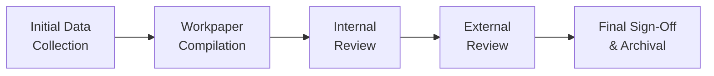

## 25.1 Error-Prone Areas and Workpaper Management

Effective workpaper management is crucial for ensuring the accuracy and reliability of financial reporting. In a fast-paced environment, even the most experienced professionals can make mistakes if proper controls and documentation processes are not in place. Errors in accounting records can lead to restatements, reputational damage, and financial losses. By understanding common error-prone areas and implementing thorough workpaper guidelines—supported by practical checklists and robust review processes—professionals can significantly reduce the risk of oversight or misapplication of standards. This chapter focuses on the typical pitfalls encountered during financial reporting, offers real restatement cases for reference, and presents actionable strategies for robust workpaper management.

-------------------------------------------------------------------------------
### Introduction to Error-Prone Areas

The Business Analysis and Reporting (BAR) section of the CPA exam emphasizes the importance of reliable financial statements. Throughout previous chapters, such as Chapter 4 (Financial Statement Analysis) and Chapter 7 (Budgeting and Forecasting), we delved into the foundations and forward-looking aspects of financial data. However, across nearly all areas of accounting practice, several recurrent pitfalls continuously challenge professionals:

• Revenue Recognition Errors: Misinterpretation of performance obligations, misunderstanding of variable consideration, or failure to apply the Five-Step Model (ASC 606) properly.  
• Complex Transactions with Intangibles: Goodwill impairment testing (see Chapter 10) and software development costs (see Chapter 11) often present timing and classification ambiguities.  
• Lease Accounting Pitfalls: Misapplication of lessor vs. lessee criteria, incorrect sale-leaseback treatment, or classification issues (see Chapter 16).  
• Consolidations and Foreign Operations: Inaccurate elimination entries or currency translation oversights (Chapter 14).  
• Derivatives and Hedge Accounting: Complexity in fair value measurements, hedge designation, and disclosures (Chapter 15).  
• Governmental Accounting: Conversions from modified accrual to full accrual, improper alignments with GASB requirements (Chapters 19 to 22).  

These areas require ongoing attention and robust documentation to prevent errors from creeping into final statements.

-------------------------------------------------------------------------------
### The Role of Workpapers

Workpapers are the backbone of any solid accounting or auditing process. They serve as the detailed supporting evidence for all numbers reported in financial statements. Workpapers typically include source documents, reconciliations, memos, schedules, and review notes—collectively providing a trail that external auditors, regulators, or internal stakeholders can follow to confirm the completeness and accuracy of financial records.

Effective workpaper management entails:

• Consistency in Formatting and Labeling: Standard naming conventions and cross-referencing for easy navigation.  
• Adequate Detailing: Clarity on data sources, assumptions, calculations, and reconciliations.  
• Audit Trail Preservation: Ensuring every figure in the financial statements can be traced back to a supporting workpaper or external document.  
• Logical Sequencing: Arranging workpapers to follow a natural flow—e.g., from raw data extraction, to summary schedules, to final consolidation.  

A well-managed set of workpapers will help catch misstatements early, streamline review processes, and meet the expectations of both internal and external reviewers.

-------------------------------------------------------------------------------
### Common Error-Prone Areas in Greater Detail

While numerous issues can arise throughout the accounting cycle, certain areas are known to be particularly prone to errors or omissions. Below are a few, along with strategies for mitigating each risk:

#### 1. Revenue Recognition Timing and Accuracy
• Issue: Revenue recorded too early or delayed beyond the performance obligation completion point.  
• Mitigation: Maintain a documented checklist of all performance obligations under ASC 606, referencing Chapter 12 for multiple performance obligations and variable considerations.

#### 2. Cost Allocation and Inventory Valuation
• Issue: Incorrect application of standard costing, job order costing, or process costing can lead to misstatements in inventory and cost of goods sold (see Chapter 5).  
• Mitigation: Incorporate variance analysis schedules that break down labor, overhead, and material variances, with clear sign-offs from responsible managers.

#### 3. Lease Classification and Residual Value Estimations
• Issue: Lessor accounting, incorrectly measured interest income from finance leases, or inaccurate assessment of fair value.  
• Mitigation: Automate lease calculations where possible; apply consistent discount rates (Chapter 16) and confirm them against market data.

#### 4. Goodwill and Indefinite-Lived Intangibles
• Issue: Failure to test goodwill for impairment when triggering events occur, or using outdated assumptions in fair value calculations.  
• Mitigation: Document every annual and interim impairment analysis with cross-references to third-party valuations or industry benchmarks (Chapter 10).

#### 5. Derivatives: Hedge Documentation and Fair Value
• Issue: Missing hedge documentation at inception or inaccurate fair value modeling, especially with embedded derivatives (see Chapter 15).  
• Mitigation: Keep a dedicated file detailing hedge designations and ongoing effectiveness testing. Collaborate with valuation specialists for complex instruments.

#### 6. Foreign Currency Translation/Remeasurement
• Issue: Confusion over functional currency vs. reporting currency, leading to inconsistent translations or remeasurement gains/losses (Chapter 14).  
• Mitigation: Establish a monthly or quarterly review routine, applying the correct exchange rates uniformly and reconciling differences.

#### 7. Governmental Fund Conversions
• Issue: Missed consolidation entries or double reporting of transactions in proprietary or fidiciary funds.  
• Mitigation: Maintain an “adjusting entries” ledger that ties fund-level statements to government-wide statements (Chapters 20 and 21).

-------------------------------------------------------------------------------
### Real-World Restatement Examples

Significant restatements alert us to the importance of robust processes:

1. **Revenue Overstatement Case**  
   A multinational software company recently restated several quarters of revenue because sales commissions were recorded at the wrong time. The company had incorrectly accelerated revenue in the quarter of contract signing, ignoring the fact that customer acceptance criteria were not fulfilled. This resulted in material misstatements of both revenue and net income.

2. **Misclassification of Software Development Costs**  
   A technology startup capitalized internal development costs beyond the point of technological feasibility (see Chapter 11). External auditors uncovered that large portions of R&D expenditures should have been expensed. The subsequent restatement wiped out significant reported intangible assets and considerably lowered retained earnings.

3. **Lease Accounting Oversights**  
   A retail chain misapplied the new lease standards, booking lease renewal options prematurely as assets. The resulting restatement showed a substantial reduction in right-of-use assets and corrected future rental obligations.

These cases highlight the necessity of meticulously documenting assumptions and calculations in workpapers, cross-referencing relevant standard guidance, and subjecting all material items to a thorough review process.

-------------------------------------------------------------------------------
### Diagram: Visualizing Workpaper Flow

The following Mermaid diagram provides a high-level overview of the typical workpaper flow, from initial data entry to final review:

• A["Initial Data  Collection"]: Source data gathered from ERP systems, bank statements, or operational records.  
• B["Workpaper  Compilation"]: Accountants compile schedules, memos, and linking documents.  
• C["Internal  Review"]: Supervising accountants or managers analyze supporting documentation for accuracy.  
• D["External  Review"]: Depending on organizational size, this might involve external auditors or consultants.  
• E["Final Sign-Off  & Archival"]: Final sign-offs are obtained, and documents are archived for future reference and compliance.

-------------------------------------------------------------------------------
### Best Practices for Thorough Workpaper Review

1. **Establish a Clear Review Hierarchy**  
   Define roles (e.g., staff preparer, senior reviewer, partner in charge) to ensure multiple levels of checking.  

2. **Implement Dedicated Checklists**  
   Checklists can mitigate reliance on memory or heuristics. For instance, a “Revenue Recognition Checklist” might list the Five-Step Model questions for each contract.

3. **Maintain Version Control**  
   Conflicts can arise when multiple team members update the same workbook or file. A systematic version control system avoids confusion and duplication.

4. **Cross-Reference to Authoritative Standards**  
   Embedding references to ASC, GASB, or IFRS paragraphs within memos clarifies how conclusions align with current regulations.

5. **Evidence of Review**  
   Each reviewer should sign and date their review steps, making accountability clear and facilitating future audits.

6. **Scheduled Peer Reviews**  
   Rotate responsibilities among peers so fresh eyes can catch subtle mistakes a primary preparer might overlook.

-------------------------------------------------------------------------------
### Sample Checklists for Error-Prone Areas

Below are example checklists that can be adapted to specific organizational needs. These lists are not exhaustive but provide a starting framework for a robust review.

#### Revenue Recognition Checklist:
• Is each performance obligation clearly identified and properly allocated?  
• Are variable considerations (e.g., rebates, discounts, returns) accurately estimated?  
• Does revenue recognition timing match the date when control transfers to the customer?  
• Have contract modifications been accounted for (e.g., contract combination, distinct goods/services)?  
• Have relevant disclosures been included, such as contract balances or significant judgments?

#### Goodwill Impairment Checklist:
• Has a qualitative assessment been performed before proceeding to quantitative tests?  
• Are the reporting units clearly defined and consistently applied?  
• Have forecasts or valuation models used in the impairment test been reconciled with budgets or industry benchmarks?  
• Is the discount rate current and representative of market conditions?  
• Are there any post-balance-sheet events that may trigger an interim impairment test?

#### Lease Accounting Checklist:
• Are lease classification decisions (operating vs. finance) documented with relevant discount rates?  
• Have lease renewal options or purchase options been considered, and are they reasonably certain to occur?  
• Are all variable lease payments recognized correctly?  
• Are sale-leaseback transactions accounted for in line with ASC 842?  
• Have relevant disclosures, including maturity analysis, been included in the notes?

-------------------------------------------------------------------------------
### Managing Data and Automation to Minimize Errors

As discussed in Chapter 3 (Data and Analytics), leveraging technology tools can significantly reduce manual errors. Automated software solutions track changes, enforce standard naming conventions, and prompt users to complete certain fields before finalizing documentation. Additionally, cloud-based collaboration platforms support real-time updates and preserve an audit trail of every adjustment.

• **Robotic Process Automation (RPA):** Helps in repetitive, rule-based tasks like data entry or reconciliations, thus freeing up time for analytical review.  
• **Advanced Analytics and AI:** Tools that flag outliers or unusual trends in large datasets, which might otherwise be missed through manual checks.

-------------------------------------------------------------------------------
### Strategies for Ongoing Improvement

Error prevention is an iterative process. Organizations should:

• Conduct Regular Training: Provide ongoing education on updates to FASB, GASB, or IFRS standards.  
• Encourage a Culture of Inquiry: Foster an environment where team members feel comfortable challenging assumptions and asking clarifying questions.  
• Perform Post-Mortem Analyses: When an error is found, conduct a root-cause analysis to understand where breakdowns occurred.  
• Keep Abreast of New Standards (See Chapter 23): With emerging reporting requirements surrounding cryptoassets or new pronouncements from the SEC, CPAs must stay vigilant.

-------------------------------------------------------------------------------
### Practical Workpaper Management Example

Imagine a mid-sized manufacturing company with multi-location inventory and various revenue streams. The accounting team employs a shared drive with read/write permissions set by role. Each quarter’s close cycle starts with:

1. Gathering source data from ERP modules for sales, purchases, and production.  
2. Preparing cost schedules for each production run (job order costing).  
3. Circulating those schedules to cost accountants for initial review.  
4. Aggregating approved numbers (material usage, overhead allocation) into a master workbook.  
5. Having senior staff cross-check overhead variance calculations and verify that budget assumptions match actual usage.  
6. Documenting any reconciling items or unusual transactions in a memo, referencing specific GAAP sections.  
7. Locking the workbook version after each major update to preserve a snapshot of the data.  
8. Delivering final schedules to the external auditors for testing.

At each stage, checklists safeguard the process. Any time a discrepancy is identified (e.g., a negative inventory balance or a cost variance beyond tolerance), it is flagged and traced back to the relevant schedule.

-------------------------------------------------------------------------------
### Real-World Example: Internal Controls Preventing a Restatement

A global consumer electronics manufacturer discovered a potential restatement risk tied to intangible asset valuations for a newly acquired subsidiary’s software. However, the internal review process caught the error before any financial statements were published. The root cause traced back to a misapplied discount rate for the developed technology’s future cash flows. By adhering to an internal intangible asset valuation checklist, the organization identified the error, corrected the calculations, and avoided a regulatory filing delay.

-------------------------------------------------------------------------------
### Conclusion

Error-prone areas and the management of workpapers are two sides of the same coin. On one hand, understanding where mistakes commonly arise (in such areas as revenue recognition, cost allocation, goodwill impairment, or governmental accounting) helps direct attention and resources toward robust review procedures. On the other hand, a well-organized and transparent workpaper system ensures that the entire financial reporting process is well-documented, consistent, and open to scrutiny.

Through the use of checklists, detailed reviews, version control, and automated solutions, accounting and finance teams can significantly minimize the risk of restatements and maintain a high standard of financial integrity. As you prepare for the BAR exam—and, more importantly, for real-life financial reporting scenarios—focusing on these principles will strengthen your organization’s internal controls, preserve stakeholder confidence, and help ensure that critical information is reliable and accessible.

-------------------------------------------------------------------------------
## Sharpen Your Skills: Error-Prone Areas and Workpaper Management Quiz



### Which of the following is commonly regarded as a highly error-prone area in financial reporting?

- [ ] Minor petty cash transactions
- [x] Revenue recognition under multiple performance obligations
- [ ] Standard payroll expense calculations
- [ ] Non-monetary donation disclosures

> **Explanation:** Revenue recognition, particularly under ASC 606, involves identifying multiple performance obligations and properly allocating considerations—a process fraught with complexities that can easily produce misstatements if not carefully documented.

### Which best describes the importance of workpaper management?

- [x] It ensures that each figure in the financial statements can be traced back to reliable supporting documentation.
- [ ] It reduces the need for internal controls and oversight.
- [ ] It replaces external audits by embedding all necessary disclosures.
- [ ] It eliminates the need for peer review or second-level checks.

> **Explanation:** Proper workpaper management provides a clear audit trail for each reported item, from source documents to final statements, ensuring transparency and accuracy.

### Which of the following practices is essential for preventing errors in goodwill impairment testing?

- [x] Regularly updating discount rates to reflect current market conditions
- [ ] Recognizing goodwill impairments only when net income is unusually high
- [ ] Ignoring qualitative testing if the business is profitable
- [ ] Applying the same impairment assumptions across all subsidiaries indiscriminately

> **Explanation:** Goodwill impairment testing must reflect current market assumptions, especially discount rates, to be accurate. Additionally, qualitative testing can prompt an interim test even in profitable conditions.

### What is a primary goal of using version control systems in managing workpapers?

- [x] Preventing conflicting file revisions when multiple team members work on the same documents
- [ ] Eliminating the need for checklists
- [ ] Restricting knowledge-sharing to a single reviewer at a time
- [ ] Allowing untracked edits to be made freely

> **Explanation:** Version control systems help avoid confusion when changes are made by different team members, preserving a transparent history of each edit for auditing and review purposes.

### Which of the following statements about lease accounting controls is correct?

- [x] Management should review renewal options regularly to determine whether they are “reasonably certain” to be exercised.
- [ ] Once a lease term is established, it is never updated.
- [x] Identical discount rates can be applied across all types of leases without justification.
- [ ] Presentation of lease disclosures is optional following ASC 842.

> **Explanation:** Regularly reviewing renewal options is crucial for accurate lease classification. However, the discount rate selection must be justified and may vary among leases. Full disclosure under ASC 842 is mandatory for transparency.

### In governmental accounting, which fund conversion issue often leads to errors?

- [x] Double-reporting transactions when consolidating proprietary and fiduciary funds
- [ ] Understating petty cash
- [ ] Overestimating small interest expenses
- [ ] Not reviewing local tax rates

> **Explanation:** When combining governmental funds into government-wide statements, confusion over proprietary and fiduciary fund transactions can result in duplications. Proper adjustments and reconciliations help avoid these pitfalls.

### Which control measure best helps identify incorrect foreign currency translation rates?

- [x] Automating the entry and reconciliation of exchange rates
- [ ] Relying solely on manual input of exchange rates performed annually
- [x] Compiling all foreign transactions into one globally aggregated rate
- [ ] Restricting currency translation to quarterly intervals only

> **Explanation:** Automation reduces human input errors and ensures consistent application of daily, weekly, or monthly exchange rates. Manual one-time entry can lead to outdated data if not regularly reviewed.

### What is the most effective way to ensure that intangible asset valuations are accurate?

- [x] Cross-referencing final valuations with industry benchmarks and peer valuations
- [ ] Skipping impairment tests if the year’s net income meets expectations
- [ ] Using predetermined rates for all intangible valuations with no detailed explanation
- [ ] Excluding the intangible asset details from workpaper documentation

> **Explanation:** Benchmarking valuations against similar industry data and thoroughly documenting assumptions are key for justifying intangible asset values and minimizing errors.

### What is one recommended practice after discovering a material error in workpaper documentation?

- [x] Conduct a root-cause analysis and incorporate the findings into future checklists
- [ ] Substitute the correct figures quietly without notice
- [ ] Delay disclosure until the next fiscal year if no one has asked about it
- [ ] Merge the erroneous and correct versions into a new “blended” figure

> **Explanation:** By performing a root-cause analysis, organizations can prevent repeated mistakes and improve documentation processes, ensuring that errors are rectified promptly and transparently.

### True or False: A real-time, cloud-enabled collaboration platform can help maintain an audit trail, reduce duplication, and allow for version control in workpaper management.

- [x] True
- [ ] False

> **Explanation:** Real-time platforms preserve a clear revision history, assign responsibilities, and reduce errors related to multiple file copies—all of which strengthen internal controls.



-------------------------------------------------------------------------------
## For Additional Practice and Deeper Preparation

### [Business Analysis and Reporting (BAR) CPA Mock Exams](https://www.udemy.com/course/bar-cpa-mock-exams/?referralCode=ADBE2E84BEE9CB6243CA)

**Business Analysis and Reporting (BAR) CPA Mocks:** 6 Full (1,500 Qs), Harder Than Real! In-Depth & Clear. Crush With Confidence!  

- Tackle full-length mock exams designed to mirror real BAR questions.  
- Refine your exam-day strategies with detailed, step-by-step solutions for every scenario.  
- Explore in-depth rationales that reinforce higher-level concepts, giving you an edge on test day.  
- Boost confidence and minimize anxiety by mastering every corner of the BAR blueprint.  
- Perfect for those seeking exceptionally hard mocks and real-world readiness.  

_Disclaimer: This course is not endorsed by or affiliated with the AICPA, NASBA, or any official CPA Examination authority. All content is for educational and preparatory purposes only._
