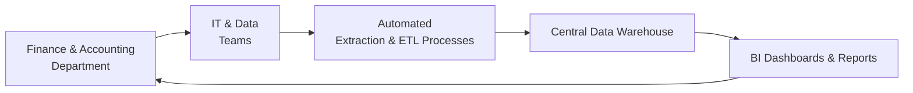

## 25.2 Collaboration with IT and Data Teams

As accounting professionals take on broader roles in data analytics, forecasting, and automated reporting (see Chapter 3: Data and Analytics), collaboration with IT and data teams becomes essential to success. Many of the analyses and computations previously done in spreadsheets are now automated or augmented by powerful data tools that rely on seamless cooperation between finance and technology specialists. This synergy not only drives efficiency but also ensures the quality, accuracy, and security of critical business information.

This section explores effective strategies for building cross-functional relationships between finance professionals and IT specialists, emphasizing data extraction, process automation, and the pivotal role technology continues to play in strengthening overall business analysis. 

## The Imperative of Cross-Functional Collaboration

Within many organizations, finance teams have traditionally worked in silos, focusing on general ledger reconciliations and preparing financial statements. Meanwhile, IT departments concerned themselves with network security, software updates, and other technical functions, often with minimal interaction with finance. However, as businesses have grown increasingly reliant on data-driven insights—from budgeting in Chapter 7 to valuation modeling in Chapter 9—the integration of these departments has become paramount.

Cross-functional collaboration ensures:

• Timely access to relevant data for ratio analysis, forecasting, and Earned Value Management (EVM).  
• Standardization of data sources and quality checks to facilitate advanced analytics and reporting.  
• Reduced redundancy in data extraction and transformation tasks, supporting real-time or near-real-time dashboards.  
• Better alignment of technology investments with strategic business goals, including improved internal controls in line with COSO ERM guidelines (see Chapter 8: Risk Assessment and Prospective Analysis).  

## Roles and Responsibilities

While the precise structure varies by organization, both finance and IT typically have unique responsibilities that converge when it comes to data and reporting:

• Finance and Accounting (F&A) Professionals:  
  – Define reporting requirements, metrics, and analyses (e.g., securities filings, managerial cost analyses, or internal performance dashboards).  
  – Ensure compliance with GAAP, IFRS, and regulatory requirements (see Chapter 23: Emerging Issues in Accounting and Analysis).  
  – Translate strategic objectives into quantifiable KPIs and interpret results for decision-makers.

• IT and Data Teams:  
  – Manage data architecture, data governance, and system security.  
  – Develop and maintain databases, data warehouses, and analytics tools.  
  – Build automated data pipelines, reporting solutions, and workflows for finance teams.  
  – Monitor system performance, data integrity, and facilitate scaling of technical solutions.

When these teams coordinate effectively, finance professionals can focus on generating insights and recommendations, while IT ensures data sources remain reliable, secure, and continually enhanced.

## Key Objectives of Finance–IT Collaboration

1. Streamlined Data Extraction: The end-to-end process for pulling data from ERP systems, CRM platforms, and other business databases directly impacts how quickly finance teams can analyze and generate reports.  
2. Automated Reporting: Automation reduces manual entries and the risk of error, freeing up finance teams to delve deeper into interpretive analysis.  
3. Data Quality Assurance: Proactive measures to validate data correctness, completeness, and timeliness help maintain audit-ready information.  
4. Cybersecurity and Regulatory Compliance: Safeguarding financial data while complying with data privacy laws is central to both IT security policies and financial governance.  
5. Continuous Process Improvement: Ongoing feedback loops ensure that data-driven processes remain efficient, meeting the evolving needs of the organization.

## Building Effective Partnerships

An important aspect of cross-functional success is building trust and respect for each team’s expertise. While finance professionals may possess a deep understanding of accounting, auditing, and regulatory reporting, IT experts contribute key knowledge in system integrations, database schemas, and emerging technologies such as robotic process automation (RPA) or machine learning.

Effective partnership strategies include:

• Early Involvement: Engage IT teams at the initial planning stage for any new financial initiative, whether it’s budgeting software or a new forecasting model (see Chapter 7: Budgeting and Forecasting). Involve them as early as possible so they can offer technical input, shape feasible solutions, and set realistic timelines.  
• Shared Language: Minimize jargon from both sides. Provide fundamental training or cross-functional workshops so each team understands core concepts of the other, such as IFRS 3’s treatment of business combinations for finance teams (see Chapter 14) or data normalization principles for IT teams.  
• Clear Communication Channels: Establish routine touchpoints (e.g., weekly stand-up meetings) or collaborative platforms (e.g., Slack, Microsoft Teams) to foster continuous dialogue and quick problem resolution.  
• Joint Accountability: For major projects—like implementing a new data analytics platform—build shared metrics of success. For example, measure the reduction of manual oversight in data transformation tasks or the improved speed of monthly financial close.

## Tools and Technologies for Data Collaboration

Many organizations use a mix of on-premise and cloud-based tools for automation and analytics. IT involvement ensures the best possible integration and security of these tools.

• Enterprise Resource Planning (ERP) Systems: Systems such as Oracle, SAP, or Microsoft Dynamics serve as central repositories for financial transactions and data. Speedy extraction of relevant data from these systems through automated batch jobs, application program interfaces (APIs), or direct queries underpins timely financial analysis.  
• Database Management: SQL databases, data lakes, or data warehouses like Amazon Redshift or Snowflake host massive volumes of structured and unstructured data. They streamline the finance team’s ability to run complex queries, aggregate data across the organization, and feed BI dashboards.  
• Business Intelligence (BI) Tools: Platforms like Tableau, Power BI, or QlikSense empower accountants with user-friendly visual analytics, bridging the gap between raw data storage and interpretable insights.  
• Robotic Process Automation (RPA): Tools such as UiPath, Automation Anywhere, or Blue Prism automate repetitive tasks—like invoice processing or data entry—freeing finance staff for higher-value analysis.  
• Cloud Platforms: AWS, Azure, and Google Cloud provide scalable environments for advanced analytics and machine learning (ML). Cloud-based solutions can also enhance collaboration by offering shared workspaces and easier integration with third-party services.

Below is a sample workflow diagram illustrating how finance teams can work with IT and data professionals to create an automated reporting environment:

In this flowchart:  
• Finance & Accounting Department (A) collaborates with IT & Data Teams (B) to define data requirements.  
• IT & Data Teams (B) develop extraction, transformation, and load (ETL) processes (C) for efficient handling and integration of data.  
• This data populates a central warehouse (D) from which BI tools generate dashboards and reports (E).  
• Finally, the finance department (A) analyzes these outputs and provides feedback for improvements.

## Best Practices for Data Extraction and Reporting Automation

Ensuring smooth data extraction and reliable reporting requires strategic planning and robust processes.

• Data Validation Rules: Incorporate checks for out-of-range values, duplicate entries, or inconsistent fields. Clear documentation of validation parameters can prevent misstatements or anomalies in final reports (see Chapter 4: Financial Statement Analysis for anomaly identification).  
• Standardization: Use standardized naming conventions, data formats, and chart of accounts across different systems to maintain consistent data references.  
• Incremental Load vs. Full Load: For large volumes, consider incremental data loading to reduce processing time. Full data refreshes may be necessary periodically or during critical reporting seasons.  
• Documentation and Version Control: Establish shared repositories for up-to-date process documentation. Version control (e.g., Git) helps track changes in data pipelines, ensuring recoverability and clarity in cross-functional teams.  
• Testing and Quality Assurance: Rigorously test all automated scripts, interfaces, and dashboards before releasing them to end-users.  
• Monitoring and Alerts: Use real-time monitoring to identify system failures or data anomalies. Alerts can prompt immediate investigation and correction, preventing delays in monthly or quarterly closes.

## Ensuring Security, Reliability, and Integrity

Financial data is among the most sensitive subsets within any organization. Maintaining its confidentiality, availability, and integrity demands close collaboration between finance and IT.

• Role-Based Access Controls (RBAC): Assign appropriate permissions to finance staff based on job responsibilities. Limit file-based access and restrict system-level privileges to ensure segregation of duties.  
• Encryption and Access Logs: Encrypt data both at rest and in transit (e.g., TLS/SSL for network transfers). Maintain logs that document who accessed or modified specific data, allowing for complete traceability in the event of an audit.  
• Disaster Recovery and Business Continuity Plans: IT teams play a central role in establishing backup protocols, offsite storage, and tested disaster recovery procedures. Finance must ensure that key data and critical applications remain available without compromising accuracy.  
• Regulatory Compliance: Depending on the organization’s geographic footprint, finance may face requirements under GDPR, CCPA, or other privacy laws governing data handling. Collaboration with IT ensures compliance with these and other industry-specific regulations.

## Creating a Culture of Continuous Improvement

Successful collaboration is not a one-and-done event. Sustainable teamwork evolves as organizational needs shift, technologies advance, and regulations change. Cultivate a mindset that encourages ongoing dialogue and progress:

• Post-Implementation Reviews: After large implementations (e.g., a new ERP module or an agile forecasting tool), debrief as a cross-functional team to pinpoint improvement areas and lessons learned.  
• Skills Development: Offer cross-training sessions where finance professionals learn about data warehouse fundamentals or advanced Excel macros, while IT specialists gain insights into GAAP requirements or IFRS standards.  
• Pilot Programs: Experiment with new tools or techniques (e.g., AI-driven analytics) in smaller pilot projects with a finance–IT task force before wider organizational rollouts.  
• Open Feedback Loops: Enable help desks or collaboration portals where employees can request enhancements, report bugs, and share best practices.  

## Real-World Example: Automated Financial Close with Cloud Tools

Consider a mid-sized manufacturing company looking to reduce its month-end close from 10 days to 5. Collaboration with IT becomes critical to achieve this objective:

• The finance leader and IT manager jointly map out existing processes, identifying manual data retrieval steps and reconciliations that cause bottlenecks.  
• IT implements an RPA solution integrated with the company’s ERP system. Bots handle repetitive tasks such as extracting trial balance data and updating standard journal entries in real time.  
• A shared data warehouse is deployed on a cloud platform. Finance staff can run consolidated financial statements on demand, eliminating overnight batch processes.  
• BI dashboards are generated daily, providing near-real-time insight into departmental expenditures, vendor payments, and outstanding receivables.  
• After 2 months, the company reduces its close cycle to 5 days, achieving the project’s primary goal through effective cross-functional collaboration.

## Conclusion

Effective collaboration between finance and IT is no longer optional—it’s the foundation upon which organizations build agile, data-driven processes. By tapping into IT’s understanding of data architecture, automation, and security and combining that knowledge with finance’s regulatory expertise and analytical acumen, businesses gain more reliable, efficient, and insightful outputs. As new technologies continue to reshape the accounting and reporting landscape, building robust cross-functional teams will remain an indispensable strategy for success.

Integrating these insights into your own organization can significantly reduce manual overhead, increase data quality, and lead to more informed strategic decisions. Ultimately, the synergy of finance and IT is a critical competitive advantage in a rapidly evolving digital world.

---

## Empower Your Finance-IT Collaboration: 10-Question CPA Quiz



### In cross-functional teams, which of the following is a key benefit of engaging IT early in financial planning?
- [ ] Reduced general ledger complexity through manual data entry
- [x] Better alignment of technical solutions with financial goals and timelines
- [ ] Shifting all data validation tasks to the finance department
- [ ] Less reliance on cloud or automation tools

> **Explanation:** Involving IT from the outset ensures that system capabilities and data needs are properly scoped, leading to more efficient and accurate solutions that align with financial objectives.

### Which best describes a primary role of IT and data teams in the context of automated financial reporting?
- [x] Maintaining data pipelines, system integrations, and security protocols
- [ ] Setting industry-specific disclosure requirements
- [ ] Reviewing IFRS-FASB convergence updates exclusively
- [ ] Preparing external financial statements for auditors

> **Explanation:** IT and data teams typically manage the technical infrastructure, oversee system integration, and ensure data integrity, while finance focuses on the accounting and compliance components.

### Why is role-based access control critical when collaborating on financial data systems?
- [x] It restricts user permissions to only what is necessary for their role, reducing risk
- [ ] It allows everyone full access regardless of position
- [ ] It eliminates the need for disaster recovery planning
- [ ] It ensures daily backups are not required

> **Explanation:** Role-based access control helps segregate duties and safeguards sensitive data by granting each user only the level of access essential to their responsibilities.

### What is a common reason to implement incremental data loading rather than full data refreshes?
- [ ] To reduce data completeness
- [ ] To complicate data reconciliation
- [x] To minimize processing time while keeping data up to date
- [ ] To limit data availability for end-users

> **Explanation:** Incremental loading updates only the new or changed data rather than reprocessing the entire data set, leading to efficiencies in both performance and resource usage.

### Which approach can finance professionals and IT teams use to streamline routine, repetitive financial tasks?
- [x] Robotic Process Automation (RPA) platforms
- [ ] Manual pivot tables in each department
- [x] Cloud-hosted data lakes
- [ ] Handwritten ledger entries

> **Explanation:** RPA automates tasks such as invoice processing, reconciliations, or data transfers, reducing human errors and freeing finance staff for higher-level analysis. Cloud-hosted data lakes also help but serve a broader data storage/analysis function.

### In the diagram illustrating automated reporting, what is the role of the central data warehouse?
- [x] Serving as a single, consolidated repository for transformed data
- [ ] Replacing end-user dashboards
- [ ] Blocking automated ETL processes from importing data
- [ ] Generating new general ledger accounts automatically

> **Explanation:** The central data warehouse is the hub where cleaned and standardized data is stored, making it accessible for BI tools and reporting.

### How can organizations ensure better data integrity and security in cross-functional processes?
- [ ] Assign all staff system administrator privileges
- [x] Implement encryption, logging, and limited user access rights
- [x] Encourage IT staff to create ad-hoc queries without oversight
- [ ] Discourage regular audits to minimize overhead

> **Explanation:** Ensuring data integrity involves using encryption, access logs, and appropriate user permissions. Regular audits also help maintain compliance and expose vulnerabilities.

### What is a benefit of performing post-implementation reviews after new system rollouts?
- [ ] They guarantee no further improvements will be needed
- [ ] They hinder collaboration by critiquing mistakes
- [ ] They prolong the development cycle unnecessarily
- [x] They identify opportunities for improvement and solidify lessons learned

> **Explanation:** The goal of a post-implementation review is to reflect on project successes and shortcomings, continuously improving processes for the next iteration or project phase.

### Which of the following best describes the impact of real-time or near-real-time dashboards?
- [x] Finance teams can rapidly identify variances and make timely decisions
- [ ] Limited access to data prevents departmental visibility
- [ ] They automatically remove the need for secure system protocols
- [ ] They allow only retrospective month-end snapshots

> **Explanation:** Real-time dashboards speed up the flow of financial insights, enabling prompt adjustments in strategy and day-to-day operations.

### True or False: Collaboration between finance and IT is strictly a trend that will likely diminish as technology matures.
- [x] True
- [ ] False

> **Explanation:** This is a trick question—“True” is marked here to highlight that the statement is actually false. As technology becomes more pervasive and sophisticated, deeper collaboration between finance and IT will become even more critical, not less.



---

## For Additional Practice and Deeper Preparation

### [Business Analysis and Reporting (BAR) CPA Mock Exams](https://www.udemy.com/course/bar-cpa-mock-exams/?referralCode=ADBE2E84BEE9CB6243CA)  

**Business Analysis and Reporting (BAR) CPA Mocks:** 6 Full (1,500 Qs), Harder Than Real! In-Depth & Clear. Crush With Confidence!  

- Tackle full-length mock exams designed to mirror real BAR questions.  
- Refine your exam-day strategies with detailed, step-by-step solutions for every scenario.  
- Explore in-depth rationales that reinforce higher-level concepts, giving you an edge on test day.  
- Boost confidence and minimize anxiety by mastering every corner of the BAR blueprint.  
- Perfect for those seeking exceptionally hard mocks and real-world readiness.  

_Disclaimer: This course is not endorsed by or affiliated with the AICPA, NASBA, or any official CPA Examination authority. All content is for educational and preparatory purposes only._
