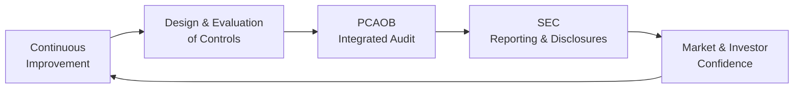
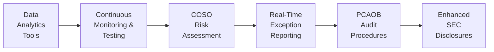

## 25.4 Leveraging COSO, PCAOB, and SEC Guidance

Internal controls serve as the backbone of financial reporting, risk management, and regulatory compliance. When it comes to delivering reliable and transparent financial statements, three primary pillars guide organizations in the United States: the Committee of Sponsoring Organizations of the Treadway Commission (COSO), the Public Company Accounting Oversight Board (PCAOB), and the Securities and Exchange Commission (SEC). This section explores how these pillars work together, emphasizing practical strategies to align internal control systems with external reporting mandates. We will also reference other chapters in this book to complete the overarching context of robust business analysis and reporting, particularly where technical accounting standards and data analytics converge.

By delving into the synergy between COSO, PCAOB, and SEC guidance, CPAs can better fulfill their responsibilities for designing, testing, and reporting on internal controls. This synergy is not merely theoretical—it provides operational scaffolding that ensures public confidence in financial statements and fosters a structured environment for risk assessment and compliance. Regardless of an entity’s size or complexity, understanding how these frameworks and regulatory bodies intersect can strengthen both an organization’s internal processes and its external credibility.

### COSO in a Nutshell
COSO’s Internal Control – Integrated Framework is widely recognized as the gold standard for designing and implementing internal controls. It offers five key components:

• Control Environment.  
• Risk Assessment.  
• Control Activities.  
• Information and Communication.  
• Monitoring Activities.  

These five components, explained in detail in previous chapters on internal controls (Chapter 3 for data integrity and Chapter 8 for risk assessments), form a holistic approach that addresses various aspects of corporate governance, ethical values, and operational risk. COSO’s framework is not prescriptive on the specific controls to implement; rather, it sets forth principles to guide companies in designing controls that align with their strategies and objectives.

Beyond internal control, COSO has also developed an Enterprise Risk Management (ERM) Framework, which expands risk management practices beyond traditional financial controls into strategy, operational processes, and decision-making. While this chapter focuses on the Internal Control – Integrated Framework, understanding ERM can enrich your approach to comprehensive risk mitigation and long-term business sustainability.

### PCAOB’s Role in Auditing Internal Controls
The PCAOB is tasked with overseeing the audits of public companies as established by the Sarbanes-Oxley Act (SOX). One of its landmark contributions is the set of standards for auditing internal control over financial reporting. PCAOB Auditing Standard No. 5 (AS 2201) sets forth requirements for an integrated audit—combining the audit of internal controls with the audit of financial statements—to conclude whether the organization’s control system is effective. Key highlights include:

• Risk-Based Approach. Auditors identify areas posing the highest risk of material misstatement and tailor their procedures accordingly.  
• Top-Down Approach. Audit planning flows from entity-level controls—those that govern the entire organization—to detailed process-level or transaction-level controls.  
• Reporting on Material Weaknesses. Auditors must report any material weaknesses that could, individually or in the aggregate, lead to significant misstatements in the financial statements.  

By mandating heightened accountability for both management and auditors, PCAOB standards aim to reassure investors that the financial data they rely on has been subjected to rigorous evaluations of the underlying control structure.

### SEC Guidance for Public Companies
Public companies in the United States operate under the regulatory auspices of the SEC, which requires them to comply with periodic filing obligations (e.g., Form 10-K, Form 10-Q, and 8-K). In the realm of internal control, the SEC’s primary mandate is found under Section 404 of SOX, which obligates management to:

• Formally assess and certify the effectiveness of the company’s internal controls over financial reporting.  
• Disclose any material weaknesses.  
• Engage an independent auditor to attest to management’s assessment.  

The SEC has offered interpretive guidance to help management evaluate the design and effectiveness of their internal control over financial reporting. This guidance complements COSO by providing a framework for robust disclosures, bridging the gap between conceptual frameworks and actual regulatory compliance. Additionally, the SEC imposes strict rules on financial disclosures, ensuring that investors have timely, accurate information to make informed decisions.

### Why Synergy Matters
Individually, COSO, PCAOB, and the SEC each serve distinct purposes. But true value emerges at the intersection of these frameworks and regulatory requirements. Aligning these standards achieves:

• Streamlined Controls Implementation. COSO’s flexible principles help you design the control environment; PCAOB standards guide you in verifying those controls; and SEC mandates compel external disclosure and compliance.  
• Enhanced Stakeholder Confidence. Consistency among COSO, PCAOB, and SEC reduces discrepancies between management’s perspective and audit findings, boosting investor and creditor confidence in the company’s reported financial health.  
• Reduced Compliance Risks. Harmonization of controls and external audit requirements can reduce duplication of efforts and the chance of failing to meet regulatory deadlines.  
• Proactive Risk Management. By combining risk-focused auditing techniques with broad control environment strategies (COSO) and stringent reporting obligations (SEC), organizations can anticipate and address risk before it escalates into costly issues.  

From the perspective of the CPA candidate, a deep understanding of these three pillars is critical in developing a holistic view. It also forms a major component of the Business Analysis and Reporting (BAR) exam, where questions often test not just theoretical knowledge, but the practical handling of integrated audit and disclosure scenarios (see Chapters 12 and 14 for revenue recognition and business combinations complexities, respectively).

### Components of an Integrated Internal Control System
While earlier chapters discuss internal control activities and the use of data analytics for continuous monitoring (see Chapter 3 and Chapter 7), here we consider an integrated approach that incorporates COSO’s principles, PCAOB’s auditing standards, and the SEC’s regulatory requirements. Below is a high-level overview of how the system might look when these pillars work in unison:

In this diagram:  
• COSO Framework (A) provides the conceptual backbone for internal control.  
• Design & Evaluation of Controls (B) translates COSO’s principles into tangible processes and procedures.  
• PCAOB Integrated Audit (C) independently assesses these controls and the related financial disclosures.  
• SEC Reporting & Disclosures (D) require companies to file external reports on control effectiveness and financial data.  
• Market & Investor Confidence (E) emerges from consistent, transparent reporting.  
• Continuous Improvement loops back to the COSO Framework (A), prompting regular reviews and enhancements.

Viewed as a cycle, this arrangement underscores that compliance—and the public trust it fosters—is not a one-time activity but an ongoing process that evolves with the organization and regulatory landscape.

### Practical Tips for CPA Candidates and Practitioners

Establish Cross-Functional Collaboration  
Internal control does not reside only in the accounting department. It involves cross-functional teams: IT, operations, legal, compliance, and more. By ensuring that each function understands both the control environment (COSO) and the external requirements (PCAOB/SEC), your organization can maintain holistic coverage of potential risks.  

Document Thoroughly and Consistently  
Whether you are management or an external auditor, documentation lays the groundwork for demonstrating compliance. Clear, consistent documentation of control activities, risk assessments, and remediation efforts is vital when the PCAOB reviews auditor workpapers or when the SEC staff examines a company’s filings.  

Perform Ongoing Monitoring  
A robust monitoring strategy (as outlined in COSO’s Monitoring Activities component) can save significant resources by identifying issues early. Proactive monitoring also enhances the reliability of interim financial statements and can streamline external audits, since the PCAOB encourages reliance on effective internal monitoring.  

Leverage Data Analytics and Automation  
Chapter 3 highlights how automation and data analytics significantly reduce the manual effort of testing and reconciling accounts. Tools that integrate real-time analytics into transaction processing can catch anomalies promptly and generate dashboards for internal stakeholders. By weaving such technology into your control activities, you bolster both efficiency and reliability.  

Stay Current on Guidance and Updates  
PCAOB standards and SEC regulations are subject to change. New forms, interpretive releases, and staff guidance can shift the compliance landscape. Regularly consult authoritative sources and professional literature. Referring to the Governmental Accounting Standards Board (GASB) and the Financial Accounting Standards Board (FASB) for new pronouncements may also be necessary if you operate in both governmental and private sectors (see Part IV for State and Local Government Accounting nuances).

### Real-World Scenarios

Case Study 1: Rapidly Growing Tech Company  
Scenario: A mid-sized software-as-a-service (SaaS) firm expands from private ownership to a public listing. As part of this transition, the firm needs to enhance its internal controls to meet SOX Section 404 requirements.  
• COSO Application. The company conducts a COSO-based gap analysis, focusing on control environment improvements such as establishing a formal code of ethics and a separate risk committee.  
• PCAOB Implications. The external auditor conducts an integrated audit, identifying critical risk areas like revenue recognition for subscription-based products. Testing focuses on management’s controls around contract terms, billing cycles, and deferred revenue.  
• SEC Mandates. Form S-1 and subsequent Form 10-K disclosures detail how management assessed internal controls, disclosing any identified material weaknesses and corrective actions.  

Outcome: The organization invests heavily in automated solutions to track subscriptions, which strengthens both revenue accuracy and investor confidence.  

Case Study 2: Manufacturing Conglomerate Facing High Risk of Inventory Manipulation  
Scenario: A large manufacturer with multiple global subsidiaries worries about potential inventory misstatements due to complex logistic chains.  
• COSO Application. Management updates the risk assessment matrix to highlight inventory control vulnerabilities, adding new oversight mechanisms and frequent cycle counts.  
• PCAOB Implications. During the integrated audit, auditors adopt a top-down approach—examining entity-level controls at corporate headquarters, then drilling down to each subsidiary’s inventory management system.  
• SEC Mandates. In its 10-K, the conglomerate discloses the new internal controls implemented and any material weaknesses discovered, along with remediation steps.  

Outcome: Enhanced cycle counts and real-time inventory tracking reduce discrepancies, allowing for timely detection of errors and minimizing the likelihood of significant restatements.

### Common Pitfalls and How to Avoid Them

Overreliance on Checklists  
While checklists help ensure consistency, solely relying on them can lead to a “tick-the-box” mindset that overlooks unique operational risks. Avoid this by tailoring your COSO-based approach to specific organizational circumstances.  

Failing to Address IT General Controls  
In an age of big data and complex systems, ignoring IT general controls underestimates the significance of technology in modern accounting operations. Ineffective IT controls often lead to widespread vulnerabilities in financial reporting.  

Underestimating the Importance of Tone at the Top  
Control environments thrive or wither based on leadership’s stance. Leaders who do not exemplify ethical behavior can undermine strong processes, rendering your entire framework vulnerable.  

Inadequate Training and Communication  
You can design the most sophisticated controls, but if employees do not understand them, they will fail in practice. A robust training program that explains both the why and the how of each control measure is essential.

### Integrating with Other Frameworks and Recent Discussions
• COSO ERM. While the internal control framework narrows in on safeguarding the reliability of financial reporting, ERM extends the conversation to strategic, operational, and reputational risks. This integration fosters a culture of risk-awareness.  
• IFRS vs. U.S. GAAP. Chapter 23 discusses how IFRS might differ from U.S. GAAP, affecting the design and testing of internal controls, especially for multinational companies scrutinized by PCAOB if they list in the U.S.  
• AICPA Code of Professional Conduct. Although not an official regulatory body like the SEC or PCAOB, the AICPA outlines ethical standards that parallel COSO’s emphasis on integrity.  

### Taking It a Step Further
For CPA candidates preparing for the BAR exam, the synergy among COSO, PCAOB, and SEC frameworks is more than a theoretical exercise. It is a practical requirement in day-to-day professional life, ensuring both compliance and the broader goal of transparent capital markets. To test your mastery, you might explore sample tasks such as:

• Drafting a management representation letter for PCAOB audits of internal control.  
• Conducting a walkthrough of SEC filings to ensure they align with COSO-based disclosures.  
• Proposing control improvements based on observed deficiencies in a hypothetical integrated audit scenario.  

These activities deepen your understanding of each component’s role and the overall orchestration needed to keep internal control systems robust.

### Additional Diagram: Role of Data Analytics
Below is a diagram illustrating how data analytics can strengthen the synergy of COSO, PCAOB, and SEC requirements:

• Data Analytics Tools (A) feed into Continuous Monitoring & Testing (B).  
• Insights from real-time analytics inform COSO Risk Assessment (C), identifying high-risk areas.  
• Continuous monitoring yields Real-Time Exception Reporting (D), allowing both management and auditors to address issues proactively.  
• PCAOB Audit Procedures (E) can leverage these exception reports to focus on higher-risk transactions.  
• Ultimately, Enhanced SEC Disclosures (F) reflect this iterative process, reassuring stakeholders of accurate and timely reporting.

### References for Further Exploration
• COSO (Committee of Sponsoring Organizations of the Treadway Commission): “Internal Control – Integrated Framework” (2013)  
• PCAOB Auditing Standard No. 5 (AS 2201): “An Audit of Internal Control over Financial Reporting That Is Integrated with An Audit of Financial Statements”  
• SEC Final Rule Release No. 33-8238: “Management’s Report on Internal Control over Financial Reporting and Certification of Disclosure in Exchange Act Periodic Reports”  
• COSO (Committee of Sponsoring Organizations of the Treadway Commission): “Enterprise Risk Management – Integrating with Strategy and Performance” (2017)  

By tapping into these resources and applying the guidance within your organization or client engagements, you will be well-prepared to demonstrate the synergy between internal controls and external reporting obligations. In turn, this will meet the rigorous requirements of the BAR exam and, more importantly, instill lasting value in your professional practice.

----------------------------------------------------------------------------------------------

## Mastering COSO, PCAOB, and SEC Requirements: Test Your Knowledge



### COSO's Internal Control – Integrated Framework is primarily composed of which of the following components?

- [x] Control Environment, Risk Assessment, Control Activities, Information and Communication, Monitoring
- [ ] Control Environment, Substantive Testing, Audit Sampling, Compliance Verification, Monitoring
- [ ] Sampling Methods, Risk Mitigation, Data Protocols, Portfolio Management, Performance Assessment
- [ ] Transfer Pricing, Earnings Management, Financial Reconciliation, Audit Risk, Governance Grid

> **Explanation:** COSO's five components are Control Environment, Risk Assessment, Control Activities, Information and Communication, and Monitoring Activities.

### According to PCAOB Auditing Standards, an integrated audit combines:

- [x] An audit of internal control over financial reporting with an audit of financial statements
- [ ] The audit of risk assessment with the audit of reporting disclosure notes
- [ ] The audit of governmental funds with the audit of proprietary funds
- [ ] The audit of managerial accounting techniques with an SEC investigation

> **Explanation:** PCAOB Auditing Standard No. 5 (AS 2201) requires auditors to perform a combined audit of both the financial statements and the internal controls over financial reporting.

### Which of the following best describes the SEC’s stance under SOX Section 404?

- [x] Management must assess and certify the effectiveness of its internal controls over financial reporting
- [ ] Only the external auditors are required to certify the effectiveness of internal controls
- [ ] Companies are exempt from any disclosures if they meet COSO standards
- [ ] Regulators only require disclosures of significant deficiencies, not material weaknesses

> **Explanation:** Section 404 mandates that management provide an assertion on internal control effectiveness, while independent auditors also attest to that assertion.

### A primary benefit of using data analytics in internal control testing is:

- [x] Real-time identification of anomalies for immediate remediation
- [ ] Eliminating the need for any physical inventory counts
- [ ] Completely replacing substantive testing procedures required by the PCAOB
- [ ] Automating the issuance of a formal audit opinion

> **Explanation:** Data analytics can flag anomalies as transactions occur, enabling prompt corrective actions and potentially reducing costly restatements or audits.

### What is a common pitfall when organizations rely solely on checklists for compliance?

- [x] They may overlook unique operational risks that are not on standardized lists
- [ ] They become fully compliant without needing external verification
- [x] They can inadvertently cause duplicative controls that inflate expenses
- [ ] They eliminate the need for top-down risk assessments

> **Explanation:** Standard checklists provide structure but may fail to capture complexities or unique vulnerabilities. Additionally, overloading on standardized controls can inflate overhead without necessarily mitigating critical risks.

### Which of the following is true regarding the interaction between COSO and PCAOB in practice?

- [x] COSO provides a framework for designing controls, while PCAOB standards guide in auditing them
- [ ] PCAOB informs companies which specific controls they must implement
- [ ] COSO deals exclusively with governmental accounting, whereas PCAOB handles corporate accounting
- [ ] COSO and PCAOB requirements are always identical

> **Explanation:** COSO lays out principles for establishing an effective control environment, while PCAOB standards focus on how auditors should evaluate the effectiveness of those controls.

### The top-down approach in the PCAOB’s integrated audit involves:

- [x] Evaluating entity-level controls first, then moving down to significant accounts and transactions
- [ ] Starting with transaction-level walkthroughs and skipping corporate governance controls
- [x] Building audit procedures solely from sampling methods at the account level
- [ ] Focusing on external disclosures before examining internal processes

> **Explanation:** The PCAOB’s top-down methodology begins at the entity level (governance, control environment) and narrows down to significant accounts, processes, and assertions.

### Under COSO’s Monitoring Activities, a key advantage of continuous monitoring is:

- [x] Identifying control breakdowns promptly
- [ ] Eliminating the need for annual audits
- [ ] Halting all business operations for risk assessment
- [ ] Delegating all monitoring to external consultants

> **Explanation:** Continuous monitoring lets organizations detect and correct control deficiencies in near real-time, preventing issues from escalating or going unnoticed until after the financial reporting period.

### Which filing format typically discloses material internal control weaknesses discovered during the year for a public company?

- [x] Form 10-K
- [ ] Form 8-K only
- [ ] Proxy Statement
- [ ] Annual Budget Summary

> **Explanation:** The annual Form 10-K typically includes management's assessment of internal controls and any material weaknesses identified or remediated.

### An organization’s commitment to ethical values is essential because:

- [x] Tone at the top influences the efficacy of the entire internal control environment
- [ ] Ethics eliminates the need for auditor testing
- [ ] Unethical behavior rarely affects financial statements
- [ ] It substitutes for SEC compliance

> **Explanation:** A positive tone at the top, manifested through ethical behavior, helps cultivate a culture that respects and upholds the internal control structure, reinforcing each COSO component.



----------------------------------------------------------------------------------------------

## For Additional Practice and Deeper Preparation

### [Business Analysis and Reporting (BAR) CPA Mock Exams](https://www.udemy.com/course/bar-cpa-mock-exams/?referralCode=ADBE2E84BEE9CB6243CA)

**Business Analysis and Reporting (BAR) CPA Mocks:** 6 Full (1,500 Qs), Harder Than Real! In-Depth & Clear. Crush With Confidence!

- Tackle full-length mock exams designed to mirror real BAR questions.  
- Refine your exam-day strategies with detailed, step-by-step solutions for every scenario.  
- Explore in-depth rationales that reinforce higher-level concepts, giving you an edge on test day.  
- Boost confidence and minimize anxiety by mastering every corner of the BAR blueprint.  
- Perfect for those seeking exceptionally hard mocks and real-world readiness.  

_Disclaimer: This course is not endorsed by or affiliated with the AICPA, NASBA, or any official CPA Examination authority. All content is for educational and preparatory purposes only._
