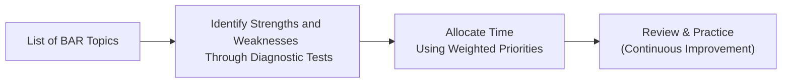

## 26.1 Time Allocation and Prioritization

Effective time allocation is one of the most critical factors in successfully preparing for the Business Analysis and Reporting (BAR) section of the Uniform CPA Examination. Whether you are working full-time, recently graduated, or balancing personal commitments, you need a flexible yet structured plan to address every facet of the BAR syllabus. This section provides a practical framework and tested tools to help you prioritize your study hours and optimize your chances of success.

Having already explored foundational concepts throughout the book—from Financial Statement Analysis (Chapter 4) and Managerial/Cost Accounting Essentials (Chapter 5) to Governmental Accounting (Chapters 19–22)—you now face the final challenge of ensuring broad coverage of all necessary content while efficiently managing your review time. The tips and strategies offered here aim to help you build a high-impact schedule, reduce the risk of last-minute cramming, and concentrate on the most vital areas that tend to appear in the BAR exam.

---

### Identifying Key Topics and Subtopics

The BAR portion of the CPA exam tests a broad range of knowledge, from traditional financial accounting fundamentals to more advanced analytical techniques and reporting standards. To effectively allocate your time, it is helpful to list and categorize these topics before beginning formal study. Consider referencing the main sections from this guide:

• Part II (Business Analysis): Financial Statement Analysis, Cost Accounting, Non-Financial/Non-GAAP Measures, Budgeting, Forecasting, and Valuation Techniques.  
• Part III (Technical Accounting and Reporting): Indefinite-Lived Intangibles, Revenue Recognition, Stock-Based Compensation, Derivatives, Consolidations, and more.  
• Part IV (State and Local Government Accounting): Fund structures, conversion streams, reconciliations, and specialized transactions.  

Within each chapter and subchapter, pinpoint the high-priority concepts that frequently appear in exam questions (e.g., ratio analysis trends, the five-step revenue recognition model in ASC 606, or IFRS vs. U.S. GAAP differences). A practical strategy is to highlight those sections in your study materials and designate them as “priority topics” in your study schedule.

---

### Planning a Weighted Study Schedule

A common mistake is to devote the same amount of time to every chapter, which could mean overemphasizing less frequently tested areas while underestimating the complexity of more critical concepts. Instead, consider a weighted approach that tailors your study to the importance and complexity of each topic.  

1. Assign weight to each topic based on:  
   - Relative complexity (Is the topic conceptually difficult?).  
   - Frequency of appearance in past exams (Which topics tend to appear most?).  
   - Personal proficiency (Where do you tend to struggle?).  

2. Prioritize coverage of areas where you have minimal background or recent exposure.  
3. Use the weighting system to set weekly or bi-weekly targets.  

Below is a sample table illustrating a 7-week schedule for BAR. The “Time Allocation” column is a recommendation based on topic weightings and complexity.

| Topic Category                                      | Time Allocation (Approx.) | Weighting Rationale                                                                |
|-----------------------------------------------------|---------------------------|-------------------------------------------------------------------------------------|
| Financial Statement Analysis (Ch. 4)                | 15% of total study time   | High frequency on the BAR, requires ratio calculations, trend analysis, etc.        |
| Cost/Managerial Accounting (Ch. 5)                  | 15% of total study time   | Critical to demonstrating business analysis; variances often tested extensively.    |
| Non-Financial/Non-GAAP & Budgeting (Ch. 6 & Ch. 7)  | 10% of total study time   | Moderately tested; often integrated with finance or operational case studies.       |
| Advanced Reporting (Revenue, Stock Comp, etc.)      | 20% of total study time   | Critical and dense; revenue recognition under ASC 606 and stock-based comp are core. |
| Governmental Accounting (Ch. 19–22)                 | 15% of total study time   | Typically appears in multiple-choice and simulation; requires specialized rules.     |
| Valuation and Analytics (Ch. 9, plus analytics)     | 15% of total study time   | Involves NPV/IRR calculations, synergy valuation, real options, plus data analysis.  |
| Final Review, Mocks, and Weak Areas                 | 10% of total study time   | Time to consolidate findings, complete final simulations, and revisit tough topics.  |

This distribution is only one example and should be tailored to your specific goals and strengths. For instance, if you find Governmental Accounting particularly challenging, you might allocate 20% instead of 15% to that segment.

---

### Diagnostic Testing to Guide Priorities

Before you set your final study schedule, assess your baseline. Take a set of diagnostic practice tests or short quizzes covering the main BAR topic areas. By evaluating your results, you can objectively determine which chapters need additional attention.  

• Look for patterns in your diagnostic scores. If you struggle significantly with advanced reporting areas like stock-based compensation or derivatives, note that you should increase focus in those topics.  
• For each topic, ask yourself whether you missed conceptual questions or calculation-intensive ones. This insight helps you prioritize areas for deeper review.  
• Make it a practice to periodically re-test yourself on the same topics to see if your grasp has improved.

Below is a simple flowchart illustrating how you can use diagnostic tests to inform and iterate on your time allocation:

- Step A: Draft a comprehensive list of all BAR topics.  
- Step B: Take a diagnostic test to identify areas of strength/weakness.  
- Step C: Apply results to create or adjust your weighted study schedule.  
- Step D: Continuously practice and refine your plan based on new insights.

---

### Incorporating Practical Exercises and Case Studies

While reading textbooks and notes is essential, investing time in practical exercises can lead to deeper retention. Practical exercises include:

• Working through Task-Based Simulations (TBS) that address multiple steps of the accounting cycle or complex IFRS vs. U.S. GAAP reconciliation.  
• Performing ratio analysis on real-world financial statements, applying knowledge from Chapters 4 and 6.  
• Creating “mini-forecasts” and budgets (from Chapter 7) for hypothetical companies, including sensitivity analyses.  
• Reviewing real public company filings to identify intangible asset disclosures, revenue recognition notes, and segment reporting structures (Chapters 10–12 and 17).  

These hands-on tasks not only help you retain theoretical content but also develop the application skills crucial for the BAR exam’s higher-order tasks.

---

### Balancing Depth vs. Breadth

Given the volume of material in the BAR exam, a perpetual challenge is achieving the right balance between covering every single detail (depth) and ensuring you do not miss entire topics (breadth). Consider the following balancing strategies:

• Focus on the big-picture frameworks first. For instance, master the conceptual approach to analyzing goodwill impairment (Chapter 10) even if you cannot memorize every numeric threshold in ASC 350.  
• If you have limited time in the final weeks, concentrate on areas you have repeatedly struggled with, then refresh your familiarity with less-challenging material.  
• Use mind maps or quick reference sheets (see Chapter 27 for Key Formulas, Ratios, and Quick Reference) to revisit major points quickly.  

---

### Best Practices for Time-Block Scheduling

Time-block scheduling involves dividing your day or week into dedicated periods for specific tasks. For instance, you might focus on advanced reporting for two hours in the morning, followed by a one-hour lunch break, then a two-hour session on governmental accounting in the afternoon. Apply these best practices to maximize your results:

• Schedule your most challenging topics during your peak productivity times—often mid-morning for many people.  
• Alternate topics to maintain focus. For instance, pair a conceptual subject like Non-GAAP measures (Chapter 6) with a more calculation-driven topic like cost accounting (Chapter 5).  
• Reward yourself with short breaks or transitions after tackling complex materials.  
• Track your time spent daily or weekly, and hold yourself accountable for meeting allocated goals.  

---

### Leveraging Digital Tools and Apps

Leverage technology to make your self-study process more efficient:

• Calendar and To-Do Apps: Tools like Google Calendar or Trello for day-to-day scheduling and tracking smaller tasks.  
• Spreadsheet Dashboards: Create a simple dashboard in Excel or Google Sheets to log hours studied per topic and measure your progress.  
• Mobile Flashcard Apps: Revisit key formulas, definitions, or IFRS–U.S. GAAP differences even when you have only a few spare minutes.  
• Online Mock Platforms: Practice with high-yield question banks and AI-based learning solutions that adapt to your performance.  

---

### Adjusting Priorities in Real Time

Your plan should remain dynamic. If you discover that you have greatly underestimated the difficulty of a particular subtopic—like, say, the complexities of embedded derivatives (Chapter 15)—shift your schedule and devote more hours to that or consider seeking extra resources.  

It helps to set weekly or bi-weekly “checkpoints” to reassess. At each checkpoint, ask:

1. Have I kept up with my target hours for each topic category?  
2. Am I making the progress I expected, or encountering unexpected challenges?  
3. Do I need to reassign time from easier topics to particularly tough ones?  

---

### Sample 8-Week Study Plan

Below is an example of how you might structure an 8-week BAR study plan, assuming you have roughly 15–20 hours per week to dedicate:

• Week 1:  
  - Diagnostic tests and quick refresher on core financial statements (Chapters 2, 4).  
  - Initiate review of Cost Accounting (Chapter 5).  

• Week 2:  
  - Deeper dive into Financial Statement Analysis (Chapter 4); practice ratio calculations.  
  - Begin advanced coverage of Revenue Recognition (Chapter 12).  

• Week 3:  
  - Managerial/Cost Accounting deeper coverage (variance analysis).  
  - Non-GAAP measurements and the Balanced Scorecard approach (Chapter 6).  

• Week 4:  
  - Governmental Accounting basics (Chapter 19, Chapter 20).  
  - Tackle intangible assets and goodwill (Chapter 10).  

• Week 5:  
  - Advanced topics: Stock-based compensation (Chapter 13) and foreign currency translation (Chapter 14).  
  - Start building your consolidated knowledge through short case studies.  

• Week 6:  
  - Complete Governmental Accounting advanced segments (Chapters 21–22).  
  - Revisit Valuation Techniques (Chapter 9).  
  - Perform midterm mock exam to measure progress and recalibrate.  

• Week 7:  
  - Review key trouble spots (derivatives, hedges from Chapter 15).  
  - Engage in full-length practice test bridging multiple topics.  
  - Focus on IFRS vs. U.S. GAAP differences (Chapter 23).  

• Week 8:  
  - Final consolidation, review simulations and prior test answers.  
  - Light coverage of emergent topics (blockchain, cryptoassets, etc. from Chapter 23).  
  - Ensure readiness for exam day, practice time management in mocks.  

This plan is not prescriptive; it simply illustrates how time allocations might be organized around core topics, problem sets, and simulation practice in a progressive manner.

---

### Case Study: Reallocating Time After Early Mock Scores

Imagine a candidate, Ally, who spent the first four weeks of her study plan focusing heavily on financial statement analysis and revenue recognition. By the mid-point of Week 5, she started taking full-length mock exams. Reviewing her performance, she realized that she consistently struggled with:

• Governmental Accounting’s intricacies around funds and reconciliations.  
• Variance analysis in Cost Accounting, especially overhead allocations.  

She decided to reallocate an additional 5% of her total weekly study hours for the remainder of her plan to these areas, reducing the time she had initially set aside for intangible assets (where she was performing relatively well). This pivot better aligned her focus with her evolving needs.

---

### Common Pitfalls and How to Avoid Them

• Overcommitting to a Single Topic: Spending 50% of study time on advanced accounting standards might jeopardize coverage of broad areas like budgeting, forecasting, or government-wide statements.  
• Last-Minute Cramming: Waiting until the final weeks to tackle heavy topics like derivative accounting or capital budgeting tools often leads to incomplete mastery.  
• Ignoring Self-Assessment: Without frequent quizzes, it’s hard to measure knowledge gaps. Many candidates who forgo ongoing self-assessment end up surprised by weaknesses too late in the process.  
• Insufficient Practice on Calculation-Heavy Content: Neglecting practice for NPV calculations, ratio analysis, or scenario-based budgeting can lead to time pressure during the exam.  

---

### Final Tips for Effective Prioritization

• Make incremental progress each day, and track your hours.  
• Use color-coded notes or spreadsheets to visualize your strongest and weakest areas.  
• Balance question drill sessions with reading and note-taking for robust conceptual understanding.  
• Systematically review your earlier chapters’ notes at least once every two weeks to avoid “topic drift.”  
• Enlist a study partner or mentor if possible, to compare progress and exchange targeted resources.

By thoughtfully designing your study schedule, and continuously refining it based on performance feedback, you can tackle the BAR section more confidently and efficiently. Striking the right balance between coverage and depth, and devoting adequate time to your most challenging areas, will give you the best chance of meeting—or exceeding—your target score.

---

## Master the BAR Section: Time Allocation and Prioritization Quiz



### Which of the following is a key first step in creating an effective BAR study schedule?

- [x] Listing and categorizing each BAR exam topic.
- [ ] Completing multiple full-length mocks.
- [ ] Focusing on reading entire textbooks without a plan.
- [ ] Avoiding diagnostics and starting with advanced topics.

> **Explanation:** Before allocating study hours, you should list and categorize topics to understand the exam scope and identify priorities.

### What is the primary advantage of using a weighted study approach for BAR preparation?

- [ ] It ensures all topics receive equal coverage.
- [ ] It helps skip difficult subjects.
- [x] It tailors study time according to topic complexity and personal needs.
- [ ] It favors only the most frequently tested questions.

> **Explanation:** A weighted study approach customizes time spent based on difficulty, importance, and your current proficiency in each topic.

### According to the sample schedule, which topic might generally require the largest portion of your BAR study time?

- [ ] Non-Financial Measures
- [ ] Governmental Accounting 
- [x] Advanced Reporting Topics (e.g., ASC 606, Stock Compensation)
- [ ] Budgeting and Forecasting

> **Explanation:** Advanced reporting (e.g., complex revenue recognition, stock-based compensation) is often quite extensive and may warrant more study hours.

### When should you re-evaluate and potentially adjust your time allocation?

- [ ] After completing the entire study plan.
- [x] At regular checkpoints (e.g., weekly or bi-weekly).
- [ ] Only if you fail the CPA exam.
- [ ] Never adjust; stick to the original plan.

> **Explanation:** Reevaluation should be done periodically to adjust to new insights from diagnostic tests or changing levels of comprehension.

### Why is it crucial to integrate practical exercises and case studies into your study plan?

- [ ] They reduce study time significantly.
- [ ] They focus only on theoretical frameworks.
- [x] They help in applying theoretical concepts to real-world scenarios.
- [ ] They replace all practice questions.

> **Explanation:** Practical exercises and case studies make learning more interactive and help solidify understanding by applying concepts to realistic problems.

### What does “balanced coverage” imply in the context of BAR exam preparation?

- [ ] Studying only the most common topics.
- [x] Finding the right combination of depth and breadth across all subjects.
- [ ] Using only your strongest areas to maximize points.
- [ ] Ignoring advanced concepts to cover simpler ones thoroughly.

> **Explanation:** Balanced coverage means addressing all tested areas at an appropriate depth level, ensuring no topic is neglected while focusing where you need it most.

### What is a recommended strategy for tackling the most challenging topics?

- [ ] Delay them until the week before the exam.
- [x] Study them during your peak productivity hours.
- [ ] Focus solely on reading and memorizing definitions.
- [ ] Avoid them entirely and hope they don’t appear on the exam.

> **Explanation:** The highest difficulty topics often require clarity and focus best attained during peak productivity times.

### How can a candidate use diagnostic quizzes or tests most effectively?

- [ ] Take them only after finalizing your entire study schedule.
- [x] Use them to identify high-priority areas and guide time allocation.
- [ ] Focus on pass/fail results rather than specific weak spots.
- [ ] Ignore them if you’re confident in your knowledge.

> **Explanation:** Diagnostic quizzes highlight where you need the most improvement, helping you make informed decisions about time allocation.

### What is one major pitfall to avoid in BAR exam preparation?

- [x] Overcommitting to a single topic and neglecting broader coverage.
- [ ] Reviewing weaker areas multiple times.
- [ ] Using a color-coded spreadsheet to track your progress.
- [ ] Preparing self-assessment quizzes for each topic area.

> **Explanation:** Spending too much time on one topic may result in insufficient coverage of other areas that also appear on the exam.

### True or False: Time-block scheduling should include short breaks and realistic transitions between study sessions.

- [x] True
- [ ] False

> **Explanation:** Incorporating brief, deliberate breaks and transitions helps maintain focus and boosts study efficiency.



## For Additional Practice and Deeper Preparation

### [Business Analysis and Reporting (BAR) CPA Mock Exams](https://www.udemy.com/course/bar-cpa-mock-exams/?referralCode=ADBE2E84BEE9CB6243CA)  

**Business Analysis and Reporting (BAR) CPA Mocks:** 6 Full (1,500 Qs), Harder Than Real! In-Depth & Clear. Crush With Confidence!  

- Tackle full-length mock exams designed to mirror real BAR questions.  
- Refine your exam-day strategies with detailed, step-by-step solutions for every scenario.  
- Explore in-depth rationales that reinforce higher-level concepts, giving you an edge on test day.  
- Boost confidence and minimize anxiety by mastering every corner of the BAR blueprint.  
- Perfect for those seeking exceptionally hard mocks and real-world readiness.  

_Disclaimer: This course is not endorsed by or affiliated with the AICPA, NASBA, or any official CPA Examination authority. All content is for educational and preparatory purposes only._
