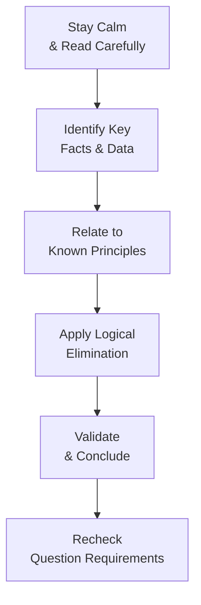
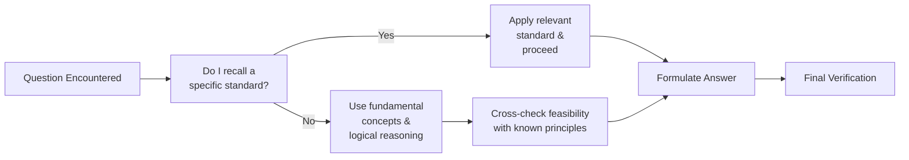

## 26.2 Handling Complex, Unfamiliar Scenarios

In your journey through the Business Analysis and Reporting (BAR) section of the CPA Exam, you will inevitably encounter complex or unfamiliar scenarios that defy straightforward application of memorized rules. These scenarios might involve advanced financial instruments, intricate consolidation structures, new technology implementations, government fund reconciliations, or novel business models. Sometimes, you may feel that the question surpasses your immediate scope of preparation. This chapter focuses on logic-based strategies to help you approach—often successfully—the queries that seem to “come out of left field.”

Embracing a structured and analytical mindset is at the core of navigating complexity. By systematically dissecting the provided data, aligning it with your fundamental principles, and applying the exam’s guidelines, you can leverage logic rather than perfect recall. Below, we explore practical frameworks, real-life examples, and best practices for managing the unknown. This will encourage you to remain calm, strategic, and resilient during your exam, even when the topic is new or the prompt is convoluted.

---

## The Importance of Calm, Rational Thinking

Complex scenarios can be challenging because they typically require synthesis of multiple concepts and the ability to adapt. Anxiety, especially under exam conditions, can impede our ability to think critically. When faced with an unfamiliar question, begin by grounding yourself in the following mindset:

• Stay calm: Remind yourself that the exam is testing your problem-solving abilities as much as your accounting knowledge.  
• Restate the scenario: Paraphrase the scenario in your own words to clarify the key points.  
• Identify known elements: Mark any definable pieces of information (e.g., interest rates, financial statement components, references to specific standards, or types of alleged misstatements).  
• Pinpoint the objective: Determine if the question focuses on interpretation, measurement, classification, or disclosure.

Turning to logic allows you to reframe the challenge as a puzzle. You may not perfectly recall FASB ASC references or intricacies of Governmental Accounting (Chapters 19–22), but by applying fundamental principles and best practices, you can often eliminate wrong choices and arrive at a reasonable answer.

---

## Leveraging Fundamental Principles

While advanced technical detail is valuable, exam success often hinges on strong mastery of foundation-level skills. For instance, consider how primary accounting principles, such as the matching principle and revenue recognition, are universal across many topics. When cornered by a subject you did not deeply study, return to your “toolkit” of fundamentals:

• Double-Entry Accounting and Key Relationships: Recall that every transaction or event affects at least two accounts. Logical reasoning about debits and credits—even at a conceptual level—can reveal an internal consistency check for the question.  
• Conservatism and Neutrality: If you’re asked about unusual disclosures or contingency treatments, recall the overarching conservative bias in accounting that ensures potential losses are recognized earlier than gains.  
• Substance over Form: The economic essence of a transaction often drives recognition and measurement. If the scenario describes complex financing or special purpose entities, try to re-interpret them in simpler economic terms.

---

## A Five-Step Framework for Deconstructing Complexity

Below is a structured approach you can apply to nearly any complex problem. The sequence helps ensure you address all aspects:

1. Understand the Context  
   • Read the entire prompt carefully.  
   • Identify the nature of the entity (for-profit, nonprofit, governmental).  
   • Highlight special circumstances (foreign currency components, intangible assets, extraordinary changes).

2. Extract Key Data  
   • Make notes of all numerical data, relevant time frames, or key standard references in the prompt.  
   • List them systematically and note potential pitfalls (e.g., partial year, multiple methods).

3. Map to Basic Principles  
   • Ask yourself: which fundamental or intermediate-level principle might apply?  
   • Is there a direct or analogous standard from prior knowledge (e.g., similar to ASC 606 for revenue, or ASC 842 for leases, etc.)?

4. Apply Logic and Process of Elimination  
   • If multiple-choice, evaluate each option in the context of consistent logic:  
     – “Does selecting this option violate a well-known principle?”  
     – “Is there a conceptual mismatch if I choose this approach?”  
   • If you must produce a calculation, test the plausibility of your results.

5. Conclude and Double-Check  
   • Revisit the question to ensure the requirement is fully addressed (disclosure vs. measurement, recognition vs. classification).  
   • If there is time, look for arithmetic or conceptual mistakes.

---

## Example: Encountering an Unfamiliar Consolidation Situation

Consider an exam scenario where you are asked to evaluate the consolidation of a hybrid partnership structure with partial foreign-owned interests. The prompt provides complicated organizational charts and references Variable Interest Entities (VIEs). You might not thoroughly recall the detailed guidance on VIEs in ASC 810 or IFRS 10. However, by systematically applying your knowledge of controlling financial interest, you can approach the question logically:

• Identify the controlling party: Does the company in question have power over the investee’s most significant activities and absorb the risks and rewards inherent in the entity?  
• Evaluate changes in ownership: Even if the scenario is partially reminiscent of a simpler subsidiary relationship, look for whether any noncontrolling interest (NCI) is recognized.  
• Ascertain the presence of a “primary beneficiary”: If the main subject of the question is effectively controlling the structure by design, consolidation is typically required.

Even with limited recall of the exact steps or standard references, a reasoned approach can often lead you to the “best possible” answer choice among the provided options.

---

## Combining Financial and Managerial Insights

Complex scenarios often straddle lines between financial accounting, managerial accounting, and data analytics. For instance, a novel question might require you to:

• Interpret how overhead allocations might shift if new technology is introduced.  
• Identify the most relevant KPI (Key Performance Indicator) that aligns with a strategic objective.  
• Evaluate a unique cost structure under activity-based costing (ABC).  

When your memory of ABC is hazy, revert to broad cost classification and behavior (see Chapter 5). Then apply logic regarding how overhead is realistically consumed by certain activities.

---

## Handling Emerging Technologies and Data Questions

Rapidly evolving technologies such as blockchain, software-as-a-service (SaaS) arrangements, and advanced data analytics can introduce scenarios that feel unprecedented. In these cases:

• Ground yourself in the principle that technology’s “form” might be new (e.g., intangible tokens, data streams), but the “substance” is likely similar to intangible assets or data management frameworks.  
• Consider the nature of the transaction: Is it akin to a subscription-based revenue model, or is it akin to a perpetual license?  
• Refer back to the guidance on software revenue recognition (Chapter 12), intangible assets (Chapter 10 & 11), or derivatives if token-based hedges are in question (Chapter 15).

This approach is all about bridging the gap between new technology and established accounting foundations.

---

## Diagram: The Mind Map for Tackling Unfamiliar Exam Questions

Below is a Mermaid diagram illustrating a step-by-step process to deal with complex, unfamiliar exam scenarios. Focus on synergy between data extraction, principle mapping, and logic-based elimination.

• A: Stay Calm & Read Carefully – Start by embracing composure, re-read question details.  
• B: Identify Key Facts & Data – Note numerical figures, references, or relevant timelines.  
• C: Relate to Known Principles – Recall fundamental concepts or analogous guidelines.  
• D: Apply Logical Elimination – Use consistency checks and reasoned approach to evaluate options.  
• E: Validate & Conclude – Finalize your answer, ensuring internal consistency.  
• F: Recheck Question Requirements – Confirm alignment with the prompt’s original question.

---

## Practice in Hypothetical Vignettes

Let’s illustrate with additional targeted examples that simulate exam realities.

### Vignette 1: Partial-Year Acquisition with Earn-Out

Data Points:  
• Company A acquires Company B on July 1 for $2 million.  
• Purchase agreement includes an earn-out contingent upon B’s next 12-month EBIT.  
• Question: How should the contingent payment be recognized at acquisition?

Logical Approach:  
1. Remember that contingent consideration is typically recognized at fair value on the acquisition date and adjusted through earnings in subsequent periods.  
2. If memories of topic references (ASC 805) are hazy, use the principle that acquisition-related liabilities must be measured at a best estimate (fair value).  
3. If a plausible option among the choices suggests immediate recognition as goodwill or intangible liability, weigh the logic of “the fair value approach to contingent consideration.”

Result: Even without the precise ASC 805 reference, you can identify that the liability for contingent consideration is recognized at the acquisition date based on fair value estimates.

---

### Vignette 2: Government Fund Reconciliation with Capital Assets

Data Points:  
• Governmental fund statements are prepared using modified accrual.  
• The question references unrecorded capital assets in an internal service fund, not recognized in the governmental fund statements.  
• You’re asked to provide an adjustment in the government-wide statement.

Logical Approach:  
1. Recognize that capital assets are recorded on the government-wide statements (full accrual).  
2. Understand that internal service fund balances often revert to governmental activities in the government-wide statements.  
3. Even if hazy, logic dictates an adjustment to reflect those assets in the consolidated government-wide statement of net position.

Result: By recalling the fundamental difference between fund-based and government-wide reporting, you can work through the bridging entry even if the details of each statement are partly forgotten (Chapter 19–21).

---

## Strategies for Complex Managerial Accounting Questions

Managerial accounting questions often provide data-laden scenarios about product costing, overhead allocation, or budgeting. In these cases:

• Identify relevant vs. irrelevant costs: Focus on the costs that truly impact the decision, such as incremental or opportunity costs.  
• Remember volume vs. price vs. mix: Break down drivers that might affect profit margins.  
• Evaluate feasibility: Are the overhead allocations or derived profitability metrics logically consistent with real-world production dynamics?

These steps rely on your foundational knowledge (Chapter 5) but also on your ability to parse unique contexts quickly.

---

## Using Data Analytics for Problem-Solving

Data analytics appears frequently in the BAR discipline—especially in the context of anomaly detection, forecasting, or variance analysis (Chapters 3 and 7). When a question references a suspicious pattern spotted through an analytics tool:

• Recall that analytics are an extension of ratio studies or trend analysis.  
• If you are unsure of the advanced functionalities of the technology, focus on the underlying principle: anomalies might suggest misstatements, potential fraud, or needed reclassifications.  
• Align suspected anomalies with appropriate controls or verification steps (COSO guidance from Chapter 8).

---

## Common Pitfalls and “Traps”

1. Overthinking or second-guessing: Once you logically identify a strong answer, do not talk yourself out of it without a credible reason.  
2. Unstructured reading of the question: Skimming the question or ignoring details can lead to misunderstandings.  
3. Not focusing on the “call of the question”: Ensure you truly answer what is asked, whether it’s about measurement, disclosure, or an appropriate calculation.

---

## Case Study: Comprehensive DigiTech Scenario

Imagine a complex prompt integrating everything from intangible asset capitalization to derivative hedging. DigiTech Corp. invests in a new software project (internally developed) and uses forward contracts to hedge the price of certain intangible tokens it uses in its blockchain-based SaaS refundable deposit system. The exam question asks you for the correct accounting treatment after the fair value of the intangible tokens soared.

You might be faced with partial recollections about intangible assets, hedge accounting (Chapter 15), and technology intangible rules (Chapter 11). By methodically applying:

• ASC 350 guidelines for intangible assets to ascertain whether costs are capitalized (e.g., post-technological feasibility for software).  
• Hedge accounting fundamentals, identifying whether the forward contract qualifies as a cash flow or fair value hedge.  
• The principle that intangible tokens, if classified as indefinite-lived, do not get amortized but need periodic impairment assessments.

Despite incomplete recall, you can piece together the plausible approach by focusing on core standards for intangible assets, hedging classification, and fair value measurement logic.

---

## Ensuring Logic Prevails Over Memory Gaps

Rigid memorization often crumbles under the weight of a new or ambiguous prompt. However, organized logic endures. This mindset not only helps on exam day but also in real-world accounting and auditing roles, where standard references may not always be on hand.  

Key tips you can use:

• Rehearse short, 1–2 minute “read-and-paraphrase” methods to interpret complex prompts quickly.  
• Practice deriving crucial elements from partial data sets to build resilience in uncertain exam moments.  
• Engage in group discussions or study sessions that simulate these “what if?” scenarios to reinforce logic-based problem-solving.

---

## Additional Mermaid Diagram: Logic vs. Recall Decision Tree

Here’s a second diagram illustrating the synergy between “Logic-based approach” vs. “Recall-based approach” when faced with complexity:

• A: Do I recall a specific standard? If yes, apply it. If no, rely on fundamental concepts.  
• B: If Standard Recalled, apply it directly, then finalize the answer.  
• C: If Not Recalled, pivot to logical processes.  
• D: Cross-check feasibility and consistency with general principles.  
• E & F: Arrive at your conclusion and do a final check.

---

## Building Confidence for the Unknown

It’s common to feel uncertain when working through these daunting setups. Yet, the more you practice, the more natural the logical approach becomes. Once you have tested your abilities across multiple practice questions and recognized that you can indeed tackle the unknown, you develop self-assurance. That confidence can be a deciding factor on exam day—knowing that your structured approach can handle surprises.

---

## Encouraging Critical Thinking

• Compare: Where else have you encountered a similar idea under IFRS vs. U.S. GAAP?  
• Contrast: How does the scenario differ from standard or typical transactions?  
• Challenge: Are there red flags or anomalies in the data that would suggest an alternative approach?

By consistently training yourself to ask these questions—even in high-pressure contexts—you garner deeper conceptual strength that outperforms sheer memorization.

---

## References and Further Exploration

• AICPA, “Uniform CPA Examination Blueprints,” for up-to-date guidance on tested topics.  
• FASB ASC Codification: For direct references on business combinations (ASC 805), intangibles (ASC 350–360), revenue (ASC 606), derivatives (ASC 815), and more.  
• COSO ERM Framework: Risk-based thinking for analyzing unfamiliar business risk scenarios (Chapter 8).  
• Governmental Accounting Standards Board (GASB) for public sector accounting complexities (Chapters 19–22).

If you wish to delve deeply into advanced scenario-based questions, consider targeted practice exams and specialized review courses that replicate real test pressures. Real-world case studies, supplemented with peer discussions, can further bolster your confidence.

---

## Quiz Title

Improve Your Exam Readiness: Complex & Unfamiliar Scenarios Quiz



### When encountering an unfamiliar exam scenario, which step should come first?

- [x] Remaining calm and carefully reading the question background.
- [ ] Jumping directly to recall-based analysis.
- [ ] Immediately selecting a likely answer choice.
- [ ] Skipping the question altogether to save time.

> **Explanation:** Pausing to read the question carefully ensures you understand the context. This calm approach allows you to identify key data and structure your path forward logically.

### Which principle is most helpful when an exam question references intangible tokens but provides limited official guidance?

- [x] Substance over form.
- [ ] Strict matching principle only.
- [x] Fundamental intangible asset valuation guidelines.
- [ ] Conservatism only applies to physical assets.

> **Explanation:** Substance over form ensures you consider the economic essence of intangible tokens, while fundamental intangible asset valuation principles guide how to treat them. Both are crucial to bridging knowledge gaps.

### What is the primary purpose of a “logic-based problem-solving” approach on the BAR exam?

- [x] To provide a structured way to tackle questions beyond one’s immediate expertise.
- [ ] To memorize large volumes of GAAP without reading the question details.
- [ ] To reduce the need for critical thinking.
- [ ] To shortcut calculations by guessing.

> **Explanation:** Logic-based problem-solving serves as a structured framework, especially for questions in unfamiliar territories, ensuring that foundational concepts and rational steps guide you toward the most reasonable answer.

### What is the best strategy when you cannot recall the precise formula for calculating intangible asset impairment during the exam?

- [x] Identify whether the asset is finite- or indefinite-lived, and then apply the relevant general principles.
- [ ] Skip the question entirely as it can’t be solved without the exact formula.
- [ ] Assume all intangible assets are treated exactly like goodwill.
- [ ] Randomly pick a formula from older standards.

> **Explanation:** Knowing whether an asset is finite- or indefinite-lived provides direction (e.g., required amortization or annual impairment testing), guiding a plausible answer even without the precise formula.

### Which approach should be used to reconcile the difference between modified accrual and full accrual in governmental accounting?

- [x] Convert capital outlays and long-term debt transactions to align with government-wide reporting.
- [ ] Treat all transactions as if they were commercial transactions.
- [x] Ignore fund differences and focus solely on net income adjustments.
- [ ] Remove budgetary basis entirely without adjustment.

> **Explanation:** Government-wide reporting requires adjustments from modified accrual (fund focus) to full accrual accounting; recognizing and including capital assets and long-term liabilities is essential.

### If the exam introduces a novel software arrangement with partial-year recognition, which step can help decipher correct accounting?

- [x] Determine whether the revenue recognition model mimics a subscription or a license-based model.
- [ ] Immediately apply undiscounted ASC 450 rules.
- [ ] Assume all revenue is recognized upfront.
- [ ] Convert the software arrangement to a derivative instrument by default.

> **Explanation:** Distinguishing whether it resembles a subscription (ongoing obligations) or license (point-in-time obligations) leads to different recognized revenue patterns. This logic-based differentiation can illuminate the correct approach.

### When encountering complicated cost-allocation scenarios, which fundamental concept is most important?

- [x] Cost behavior and how it relates to production activities.
- [ ] Precise IFRS guidance for intangible licenses.
- [x] Arbitrary distribution of expenses does not matter.
- [ ] Eliminating overhead altogether if uncertain.

> **Explanation:** Understanding how costs behave (fixed, variable, or mixed) and which activities consume overhead is the cornerstone of logical cost allocation approaches, especially in activity-based costing.

### Which technique should you use to ensure your final answer remains consistent with known accounting principles?

- [x] Final plausibility check against the scenario’s fundamental economic reality.
- [ ] Rely only on a memorized formula and ignore any unusual data.
- [ ] Flip a coin between two feasible answers.
- [ ] Only confirm the numeric correctness of calculations.

> **Explanation:** Even if calculations seem correct, a final comparison to fundamental economic principles ensures there are no major conceptual errors.

### If a question provides partial data and references advanced data analytics, what is your initial logical step?

- [x] Identify any anomalies in the data and map them to common risk factors.
- [ ] Assume that analytics always yield 100% accurate results.
- [ ] Disregard data analytics as a “minor” aspect.
- [ ] Default to IFRS guidelines on intangible assets.

> **Explanation:** Advanced data analytics typically highlight outliers or anomalies for further review. Anchoring your approach in fundamental risk and control principles helps you interpret the question logically.

### True or False: You should abandon a question if it immediately seems too complex.

- [x] True
- [ ] False

> **Explanation:** While it might initially seem tempting to skip complex scenarios, the recommended approach is to break the question down calmly. Use fundamental principles and step-by-step logic. You might discover you have enough insight to answer correctly.



---

## For Additional Practice and Deeper Preparation

### [Business Analysis and Reporting (BAR) CPA Mock Exams](https://www.udemy.com/course/bar-cpa-mock-exams/?referralCode=ADBE2E84BEE9CB6243CA)

**Business Analysis and Reporting (BAR) CPA Mocks:** 6 Full (1,500 Qs), Harder Than Real! In-Depth & Clear. Crush With Confidence!

- Tackle full-length mock exams designed to mirror real BAR questions.  
- Refine your exam-day strategies with detailed, step-by-step solutions for every scenario.  
- Explore in-depth rationales that reinforce higher-level concepts, giving you an edge on test day.  
- Boost confidence and minimize anxiety by mastering every corner of the BAR blueprint.  
- Perfect for those seeking exceptionally hard mocks and real-world readiness.

_Disclaimer: This course is not endorsed by or affiliated with the AICPA, NASBA, or any official CPA Examination authority. All content is for educational and preparatory purposes only._
