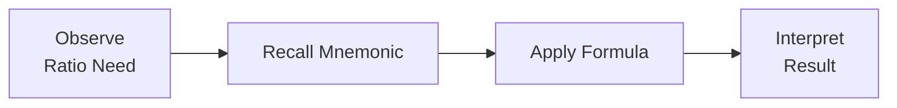

## 26.3 Memory Hooks and Ratio Remembering

Preparing for the Business Analysis and Reporting (BAR) section of the CPA exam often requires a quick and accurate recall of key financial ratios and related metrics. In high-pressure exam scenarios, you need to confidently apply formulas, make sense of the results, and integrate them with broader analytical judgments. Memory hooks, mnemonics, and structured frameworks can help you retrieve critical information swiftly and accurately. This chapter section provides a comprehensive guide to developing these memory devices, ensuring that you can gracefully tackle ratio-driven questions with minimal hesitation.

In the sections that follow, you will learn a variety of approaches to memorizing and consolidating knowledge of financial ratios, including liquidity, profitability, leverage, and operational efficiency ratios. You will also discover a systematic method to group them under easily-remembered categories and see how these memory hooks integrate with the broader exam strategy outlined in previous chapters. Since ratios were extensively covered in Chapter 4 of this guide, we will build upon that foundation here, but with an intense focus on recall strategies and practical application.

---

### Importance of Quick Ratio Recall Under Exam Pressure

Before diving into specific memory hooks, let’s remind ourselves why immediate and accurate recall is crucial:

• Time Efficiency  
Exam questions often combine conceptual knowledge, data analysis, and interpretive skills. Having a mental “library” of formulas saves time, allowing you to devote more attention to analyzing the numbers rather than remembering how to calculate them.

• Confidence Boost  
When you can immediately recall a ratio formula—such as the quick ratio or debt-to-equity ratio—you gain momentum and confidence. This psychological advantage can significantly reduce anxiety and help you maintain a positive exam rhythm.

• Effective Analysis  
Simply memorizing formulas isn’t enough; you must also be able to interpret their meaning. Quick recall of key ratios paves the way for stronger interpretation, as you can move swiftly from calculation to insight.

---

### Building Blocks of Memory: Categorizing Ratios

A robust starting point for memory hooks lies in systematically categorizing the myriad of ratios you will encounter. Most financial ratios fall into four high-level categories: Liquidity, Profitability, Leverage (or Solvency), and Efficiency (or Activity). Creating a mental framework helps you store and retrieve related ratios under distinct headings.

1. Liquidity Ratios  
   • Current Ratio  
   • Quick (Acid-Test) Ratio  
   • Cash Ratio  
   • Working Capital

2. Profitability Ratios  
   • Gross Margin (Gross Profit Margin)  
   • Operating Margin  
   • Net Profit Margin  
   • Return on Assets (ROA)  
   • Return on Equity (ROE)

3. Leverage (Solvency) Ratios  
   • Debt-to-Equity  
   • Debt-to-Total Assets  
   • Times Interest Earned (Interest Coverage)  
   • Equity Multiplier

4. Efficiency (Activity) Ratios  
   • Inventory Turnover  
   • Accounts Receivable Turnover  
   • Accounts Payable Turnover  
   • Total Asset Turnover  
   • Days Sales Outstanding (DSO)

Organize these in a way that resonates with you personally. Some prefer alphabetical lists, while others might prefer grouping by financial statement area (e.g., the Balance Sheet first, then the Income Statement). Chapter 4 of this guide offers deeper discussions of formula derivations and usage; refer to that material to reinforce your understanding.

---

### Mnemonics for Key Ratios

Mnemonics are memorable phrases or acronyms that help store and recall information. They can be whimsical or straightforward—whatever resonates most with your learning style. Below are a few examples:

1. Current Ratio = Current Assets ÷ Current Liabilities  
   • Mnemonic Cue: “CA over CL helps me see liquidity well.”  
   • Alternatively, you might employ something like: “CALi: Current Assets over Liabilities.”

2. Quick Ratio = (Current Assets – Inventory) ÷ Current Liabilities  
   • Mnemonic Cue: “Quick means we strip out slow-to-sell inventory.”  
   • “Q = (CA – I) ÷ CL.” Some find it easier to imagine the letter ‘Q’ as a circle minus a small slice (inventory).

3. Net Profit Margin = Net Income ÷ Net Sales  
   • Mnemonic Cue: “N over N: Net income over Net sales.”  
   • Symbolic memory: “N // N,” to remind that there’s “net over net.”

4. Return on Equity (ROE) = Net Income ÷ Average Shareholders’ Equity  
   • Mnemonic Cue: “ROE: Ni/Eq.” Pronounce “Ni/Eq” as “Knee-Eck.”  
   • Alternatively: “ROE is the net result on the owners’ nest egg.”

5. Debt-to-Equity = Total Liabilities ÷ Total Equity  
   • Mnemonic Cue: “Liabilities weigh on Equity.”  
   • Some find the acronym “L/E” (Liabilities over Equity) easier to recall.

Tailor these mnemonics to your own habits or sense of humor. The more personal or distinctive, the more likely you are to remember them in a stressful environment.

---

### Chunking: Grouping Ratios into Manageable Blocks

“Chunking” refers to the cognitive strategy of grouping large amounts of information into smaller, more manageable sets. Instead of memorizing 20 formulas as discrete elements, try classifying them under a small set of mnemonic headings.

For instance, recall the phrase “LPLE” (Liquidity, Profitability, Leverage, Efficiency). Under “L,” keep 3–4 key liquidity ratios. Under “P,” keep 3–5 profitability ratios. Do the same for “L” (leverage) and “E” (efficiency). The chunking approach fosters a more organized retrieval system in your mind. When you see a question about how fast a company converts inventory into sales, you automatically jump to the “E” category in your mental library for “inventory turnover” or “days in inventory.”

---

### Visual Memory Techniques

Visual aids and imagery can drastically enhance recall. Many learners retain formulas more effectively using color-coded charts or by transforming abstract numbers into pictures. Below are some creative ways to apply visual enhancements:

• Color-Coded Index Cards: Write each category of ratio in a specific color. For example, liquidity ratios in blue, profitability in green, and so on.  
• Mind Mapping: Place “Ratios” at the center and branch out to each category, sub-branching to each specific ratio.  
• Diagrammatic Representation: Some test-takers enjoy small sketches (like stacks of coins for equity, or water for liquidity ratios) associating an image with each formula.

Try building your personal memory palace of formulas, imagining walking through a virtual “museum” in your mind where each room is dedicated to a ratio category. As silly as it may sound, anchoring intangible concepts to vivid visual elements can lock them into memory.

---

### The Relationship Matrix: Linking Ratios to Each Other

Another powerful way to build memory retention is through interlinking. Ratios often overlap or give different angles on related metrics. For instance:

• Current Ratio vs. Quick Ratio  
  Both measure short-term liquidity but differ by whether they exclude inventory.  
• Gross Profit Margin vs. Operating Margin vs. Net Profit Margin  
  All measure profitability, but at different stages (gross, operating, and final net stages).  
• Debt-to-Equity vs. Debt-to-Total Assets  
  Both measure leverage but with different benchmarks in the denominator.

Constructing mental webs or tables where these related ratios are placed side by side helps you recall them more naturally than if you memorized them in isolation. During the exam, you may see a question about short-term liquidity, which might prompt you to consider current ratio, quick ratio, and working capital qualities in tandem.

---

### Example: Using a Flowchart to Cement Memory Hooks

Below is a simple Mermaid.js diagram illustrating how memory hooks can be integrated into the problem-solving approach for ratio questions. In your mind’s eye, you imagine a sequence: Identify the ratio category needed → Recall the corresponding mnemonic or formula → Calculate the ratio → Interpret the result.

• A: You read a question about short-term debt payment capacity.  
• B: You recall “LiQ, LiQ: Current ratio and Quick ratio.”  
• C: You apply the formula (e.g., Current Assets ÷ Current Liabilities).  
• D: You interpret whether the result suggests sufficient liquidity.

By rehearsing this sequence repeatedly, it becomes almost second nature during the exam.

---

### Case Study: Applying Memory Hooks in a Time-Sensitive Question

Imagine a scenario where you have a consolidated set of financial statements and a question that asks: “Based on the provided financial data, evaluate the company’s short-term liquidity position. Which ratio(s) would be most relevant, and how would you interpret an unusually high figure?”

1. Identify the Ratio Category – You see “short-term liquidity,” so you jump to the liquidity category.  
2. Recall Specific Formula – Using your chunking approach, you identify the “Current Ratio = CA ÷ CL” and the “Quick Ratio = (CA – Inventory) ÷ CL.”  
3. Mnemonic Use – “CALi” or “Quick strips inventory.”  
4. Compute the Ratio – Suppose you find a current ratio of 3.2 and a quick ratio of 1.4.  
5. Interpretation – A current ratio of 3.2 might indicate strong coverage, yet the quick ratio of 1.4 reveals that much of the liquidity is tied up in inventory. If the question states “interpret an unusually high figure,” you might note that extremely high liquidity can also indicate underutilized assets or poor inventory management.

In exam practice, the ability to leap directly to the correct formula, interpret the ratio swiftly, and tie it back to your knowledge of business operations will boost both speed and accuracy.

---

### Cross-Referencing Ratios With Prior Chapters

As a quick reminder:

• Chapter 4: “Financial Statement Analysis” – Thorough coverage of ratio analysis fundamentals, calculations, and interpretation techniques.  
• Chapter 5: “Managerial and Cost Accounting” – Highlights cost behaviors and cost-volume-profit analyses that can pair well with certain profitability ratios.  
• Chapter 6: “Non-Financial and Non-GAAP Measures” – Addresses how some measures, such as EBITDA or Free Cash Flow, can interact with standard GAAP-based ratios.  
• Chapter 7: “Budgeting and Forecasting” – Discusses how ratio-driven insights can forecast future performance.  
• Chapter 8: “Risk Assessment and Prospective Analysis” – Explores how liquidity, profitability, and leverage metrics play into risk considerations.  

When studying for the BAR exam, cycle through these chapters to see how each ratio’s conceptual underpinnings fit into broader financial analysis contexts.

---

### Best Practices for Ratio Memory Retention

• Regular Repetition  
Review your mnemonic list daily or at least weekly. Space-based repetition helps push the information from short-term to long-term memory.

• Practice Under Timed Conditions  
Simulate exam constraints. Practice computing any ratio from memory in less than 30 seconds to build speed and confidence.

• Use Real-World Examples  
Pick companies you know, gather basic data from their financial statements (e.g., from annual reports), and compute at least three ratios. Tying the ratio to real data makes the memory more “sticky.”

• Link Ratios to Red Flags  
Remember that certain ratio thresholds might point to red flags (e.g., times interest earned below 2). This real-world dimension can help you remember not just the formula but also the meaning behind the number.

---

### Common Pitfalls and How to Avoid Them

Despite thorough memorization, mistakes can still occur under exam pressure. Watch out for these pitfalls:

• Mixing Up Numerator and Denominator  
Sometimes, a minor reversal (e.g., substituting “Total Equity ÷ Total Liabilities” for “Total Liabilities ÷ Total Equity”) can devastate your answer. Use consistent mnemonics to avoid mix-ups.

• Forgetting Adjustments  
Some ratios (e.g., Adjusted Quick Ratio or Times Interest Earned) may require more nuanced data like interest expense or removing intangible items. Make sure your memory hooks remind you to check for adjustments.

• Not Paying Attention to Averages  
ROE, ROA, and others typically use average balances of equity or assets (particularly for interim statements). Always verify whether to use “opening + closing ÷ 2” or another average method if indicated.

• Incomplete Interpretation  
A ratio is only as useful as its interpretation. Validate your ratio context: is the company seasonal? Did they have a one-time event which skews results? The exam often demands you interpret or explain meaning, not just compute.

---

### Structured Practice Drills

In addition to direct memorization, consider these drills for deeper mastery:

• Drill 1: Rapid-Fire Formula Recall  
Write 10 ratio names on one side of flashcards and their formulas on the other side. Shuffle them daily and practice retrieving definitions in random order.

• Drill 2: Scenario-Based Applications  
Create or use practice scenarios (financial statements, partial data sets, etc.) to choose the best ratio for answering a question. Force yourself to articulate why you chose that ratio.

• Drill 3: Pairing Statements  
Take an Income Statement and a Balance Sheet from any practice question. Write out as many relevant ratios as you can. This not only reinforces recall but also trains you to find the relevant information quickly on the statements.

• Drill 4: Peer Quizzing  
If you study in groups, ask each other to recite a ratio and then question them on possible interpretations and real-world implications.

---

### Practical Example: Linking Liquidity to Profitability

Here’s a hypothetical piece of financial data:

• Current Assets: $500,000  
• Inventories: $200,000  
• Current Liabilities: $250,000  
• Sales: $1,200,000  
• Net Income: $100,000  
• Total Equity: $400,000

Let’s do two quick ratio calculations and tie them back using memory hooks:

1. Current Ratio  
   (CA ÷ CL) = ($500,000 ÷ $250,000) = 2.0  
   Mnemonic: “CALi” (Current Assets over Liabilities) → “2.0 means we have $2 of current assets for every $1 of current liabilities.”

2. Quick Ratio  
   [(CA – Inventory) ÷ CL] = [($500,000 – $200,000) ÷ $250,000] = ($300,000 ÷ $250,000) = 1.2  
   Mnemonic: “Quick strips out inventory—1.2 is decent but not as high.”

3. Net Profit Margin  
   (Net Income ÷ Sales) = ($100,000 ÷ $1,200,000) ≈ 8.3%  
   Mnemonic: “N over N: Net income over Net sales.” → “8.3% margin.”

4. ROE  
   (Net Income ÷ Total Equity) = ($100,000 ÷ $400,000) = 25%  
   Mnemonic: “Ni/Eq” or “knee-eck.” → “ROE = 25%, fairly robust.”

By mentally linking liquidity to profitability, you can see that a strong ROE may be supported by an adequate liquidity position that ensures the company can meet its short-term obligations and continue to operate profitably. Practicing these interconnections helps deepen and solidify ratio memory.

---

### Leveraging Technology and Apps

Technological tools can reinforce your memory hooks. Many mobile applications, online flashcard platforms, or spaced-repetition software can help you systematically review ratios. Consider:

• Anki or Quizlet: Create flashcards for each ratio, with a mnemonic on one side and the formula on the other.  
• Practice Worksheets (Online or Excel-Based): Automatically generate random ratio questions from a bank of problem sets.  
• Collaborative Platforms: If you study with friends, consider storing your memory hooks and examples in a shared drive for group access.

---

### Tying It Together With Confidence

To maximize your exam performance, combine:

• Structured Memory Hook Development  
• Regular Practice and Timed Drills  
• Integrated Understanding of How Ratios Interrelate  
• Real-World Data Interpretation Skills  

By applying these strategies, you’ll not only remember the formulas but also grasp their deeper business implications. This synergy between recall and reasoning is essential in the BAR section of the CPA exam, ensuring you’re able to go beyond rote computation and effectively communicate findings.

---

### References for Further Exploration

Below are some resources to deepen your understanding of memory techniques and ratio analysis:

• “Make It Stick: The Science of Successful Learning” by Peter C. Brown, Henry L. Roediger III, and Mark A. McDaniel.  
• “Financial Statement Analysis” by Martin S. Fridson and Fernando Alvarez.  
• Websites like Khan Academy (khanacademy.org) for fundamental accounting and finance refresher material.  
• Online courses focusing on cognitive psychology and memory techniques (Coursera, edX, or Udemy).  

Return to these references when you find yourself needing fresh perspectives on recall methods or deeper dives into specific ratio categories.

---

## Amplify Your CPA Memory Skills: Ratio Mastery Quiz



### Which of the following best describes the purpose of mnemonics when remembering financial ratios?

- [ ] To compress complex data into simplified numbers
- [x] To create memorable cues that help retrieve formulas quickly
- [ ] To replace thorough understanding with quick shortcuts
- [ ] To standardize all ratios under one naming system

> **Explanation:** Mnemonics serve as memory aids, helping test-takers recall formulas quickly. They do not replace conceptual understanding; rather, they supplement it.

### How does “chunking” improve recall of accounting formulas and ratios?

- [x] It groups similar concepts, making them easier to remember
- [ ] It removes the need for study
- [ ] It merges unrelated formulas into one overarching formula
- [ ] It discourages deeper analysis

> **Explanation:** Chunking organizes multiple items under thematic headings, reducing cognitive load and improving memory retention.

### Which ratio is typically associated with the mnemonic “CA over CL”?

- [x] Current Ratio
- [ ] Quick Ratio
- [ ] Debt-to-Equity
- [ ] Gross Profit Margin

> **Explanation:** “CA over CL” represents “Current Assets over Current Liabilities,” which gives the Current Ratio.

### Which pairing of ratios both measure a firm’s ability to cover short-term liabilities?

- [x] Current Ratio and Quick Ratio
- [ ] Debt-to-Equity and Times Interest Earned
- [ ] ROA and ROE
- [ ] Operating Margin and Earnings Per Share

> **Explanation:** Both Current Ratio and Quick Ratio assess a firm’s short-term liquidity strength—how well it can meet upcoming obligations.

### Which memory strategy involves linking formulas with strong mental images or color coding?

- [x] Visual Memory Techniques
- [ ] Exclusive Indexing
- [x] Mind Mapping
- [ ] Reverse Engineering

> **Explanation:** Visual memory methods (e.g., color-coded charts or mind maps) create stronger recall by leveraging pictorial cues.

### What does a substantially higher Current Ratio than Quick Ratio typically suggest?

- [x] A significant portion of current assets is held in inventory
- [ ] The company is more profitable than average
- [ ] The company is experiencing negative cash flow
- [ ] Long-term debt levels are dangerously high

> **Explanation:** When the Current Ratio is much higher than the Quick Ratio, it indicates that removing inventory drastically lowers liquidity, meaning a heavy reliance on inventory to meet obligations.

### Which of the following best defines the phrase “N over N” in the context of ratio mnemonics?

- [x] Net Income over Net Sales
- [ ] Net Cash Flow over Net Assets
- [x] Net Liabilities over Net Assets
- [ ] Net Equity over Net Liabilities

> **Explanation:** “N over N” stands for “Net Income over Net Sales,” referencing Net Profit Margin. The mnemonic helps fix the formula in memory.

### Why is forgetting the use of averages a common pitfall in ratios like ROE and ROA?

- [x] The numerator is often reported only once, so averages can be overlooked
- [ ] The exam never includes interim statements
- [ ] Averages are only relevant to IFRS, not U.S. GAAP
- [ ] Averages apply exclusively to profitability ratios

> **Explanation:** Ratios that use balance sheet items (e.g., equity, assets) frequently require averaging beginning and end-of-period balances. Students often forget to do this under exam pressure.

### How might you interpret a Times Interest Earned ratio below 2?

- [x] It indicates potential difficulty in covering interest payments
- [ ] It signifies exceptionally strong solvency
- [ ] It implies net operating losses
- [ ] It shows exceedingly high liquidity

> **Explanation:** A Times Interest Earned (TIE) ratio below 2 is generally considered a warning sign that a company could struggle to meet its interest obligations.

### True or False: A recommended memory strategy is to practice recalling each ratio’s formula in under 30 seconds.

- [x] True
- [ ] False

> **Explanation:** Practicing quick recall of ratio formulas under timed conditions fosters speed and accuracy—key advantages for exam success.



---

## For Additional Practice and Deeper Preparation

### [Business Analysis and Reporting (BAR) CPA Mock Exams](https://www.udemy.com/course/bar-cpa-mock-exams/?referralCode=ADBE2E84BEE9CB6243CA)

**Business Analysis and Reporting (BAR) CPA Mocks:** 6 Full (1,500 Qs), Harder Than Real! In-Depth & Clear. Crush With Confidence!

- Tackle full-length mock exams designed to mirror real BAR questions.  
- Refine your exam-day strategies with detailed, step-by-step solutions for every scenario.  
- Explore in-depth rationales that reinforce higher-level concepts, giving you an edge on test day.  
- Boost confidence and minimize anxiety by mastering every corner of the BAR blueprint.  
- Perfect for those seeking exceptionally hard mocks and real-world readiness.  

_Disclaimer: This course is not endorsed by or affiliated with the AICPA, NASBA, or any official CPA Examination authority. All content is for educational and preparatory purposes only._
