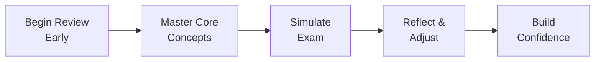

## 26.4 Building Confidence and Cutting Stress

Building confidence and reducing stress are critical components of a successful CPA exam experience, especially for the Business Analysis and Reporting (BAR) section. Even with the most thorough study plan, anxiety can creep in and undermine your performance. By proactively developing mental readiness tactics, following a final week checklist, and adhering to a structured test-day routine, you can approach the BAR exam prepared, calm, and focused. This chapter explores practical strategies, real-life examples, and supportive frameworks to ensure you boost confidence and keep nerves at bay.

## Encouraging Mental Readiness: Laying the Foundation

A strong mental framework is essential for performing well on the BAR section. Mental readiness refers to the ability to handle the exam’s demands—both content-wise and psychologically—without succumbing too heavily to anxiety or doubt. This mindset isn’t formed overnight; it’s cultivated through consistent routines, healthy habits, and a belief in your own competence.

### Understanding the Intensity of the BAR Exam

The BAR section requires not only financial acumen—covering everything from ratio analysis (see Chapter 4) to complex valuation models (see Chapter 9)—but also strong business analytical thinking, risk assessment, and prospective analysis skills (see Chapter 8). The breadth of knowledge can feel overwhelming. However, recognizing the density of the material will help you plan more effectively and prevent last-minute cram sessions. Time management, as discussed in Chapter 1.2, forms the backbone of your preparation strategy, ensuring you dedicate enough practice to each exam area.

### Cultivating a Growth Mindset

A growth mindset empowers you to view challenges as opportunities for improvement. Instead of fearing exam obstacles, consider each difficult practice question or complex financial scenario as a stepping stone to deeper comprehension. When you struggle with a specific topic—like derivative accounting (Chapter 15) or intangible asset impairment (Chapter 10)—use this as a prompt to revisit the relevant materials and strengthen your foundation. Overcoming moments of frustration or confusion fosters resilience, a key trait for success on exam day.

### Breaking Down Anxiety through Visualization

Visualization is an effective method of reducing exam-related anxiety. Visualization techniques can include:

• Walking through a tough simulation: Close your eyes and imagine the entire experience of reading a scenario, analyzing the data, and methodically working through each calculation to reach a correct solution.  
• Envisioning exam day success: Picture yourself calmly arriving at the test center, feeling prepared and at ease, and completing each question with confidence.

By mentally rehearsing success, you condition yourself to respond more effectively and calmly in real exam settings.

## Final Week Checklist

Your final week of preparation should revolve around consolidating knowledge, sharpening exam-specific skills, and reducing unexpected surprises. This checklist is an extension of Chapter 26.1’s broader exam strategy and serves as a practical tool to ensure no critical tasks slip through the cracks.

• Review High-Value Topics: Revisit heavily weighted exam areas, such as financial statement consolidations (Chapter 14) or revenue recognition (Chapter 12). Use summary notes, formula sheets, and practice questions to refresh your memory.  
• Refine Your Timing Strategy: Simulate at least one full-length practice test in a timed environment to calibrate pacing. This helps you gain a realistic sense of how much time to allocate to each question or task-based simulation (TBS).  
• Perform a Final Technical Check: Double-check that your calculator, any permitted reference materials, and tutorials for scheduling exam sections are in order. Confirm your exam appointment location and time.  
• Prepare Mentally and Physically: Aim for consistent sleep patterns, balanced meals, and light exercise. A clear mind and healthy body drastically improve concentration and memory retention.  
• Confirm Logistics: Ensure you have valid identification, the required files (if online-based exam scheduling is needed), and any color-coded notes or cheat sheets you plan to review until the last moment (within allowable guidelines).

## Building Confidence Through Systematic Practice

Confidence and comfort with exam content often stem from repeated exposure to a variety of question types and scenarios. In earlier chapters, we explored complex scenarios such as advanced managerial accounting (Chapter 5) and case studies spanning multinational acquisitions (Chapter 24). Reworking these scenarios—especially under timed conditions—can reduce performance anxiety by familiarizing you with potential pitfalls and the mental effort required to solve advanced problems.

### Employing Incremental Learning

Instead of racing through all topics in a single spree, employ incremental learning:

• Start with fundamental topics (e.g., ratio analysis in Chapter 4), ensuring your proficiency in essential data computations.  
• Move to intermediate subjects (e.g., budgeting and forecasting in Chapter 7), where you layer additional tools such as predictive analytics.  
• Progress to advanced items (e.g., IFRS vs. U.S. GAAP differences in Chapter 23) only after you have strong comfort with foundational material.

Incremental learning can reduce stress by allowing you to build upon each success instead of confronting highly complex issues without a foundation.

### Simulating High-Pressure Environments

Try replicating exam-day conditions to acclimate yourself to testing pressures. For instance:

• Create a quiet study space where you have limited access to breaks.  
• Establish a fixed start and end time.  
• Integrate short “brain breaks” at intervals consistent with actual exam rules.  

Over time, these simulations train your mind to navigate the stress and timing constraints inherent in real testing conditions, making actual exam day feel more manageable.

## Methodical Test-Day Routine

Your test-day routine can make or break your performance. Up to this point, you’ve cultivated a robust knowledge base and tested it in practice environments—now it’s time to ensure a smooth fulfillment of your potential in the official exam setting.

### Start with a Calm Morning

• Wake Up Early: Give yourself enough time to go through a non-rushed morning routine. A frantic start often carries over and amplifies exam stress.  
• Eat a Balanced Meal: Aim for foods that provide sustained energy—complex carbohydrates, protein, and healthy fats—avoiding excessive sugar or caffeine.  
• Light Exercise or Stretching: Brief morning stretches or a short walk can release tension, sharpen your focus, and stabilize your mood.

### Arrive Prepared and Early

• Over-Preparing Beats Under-Preparing: Bring everything you might need for sign-in or in-case-of-emergency scenarios, including a light jacket, extra pencils, or a bottled drink if permitted.  
• Settle In: Once you arrive, take a moment to gather your thoughts and scan the environment. Familiarity with your surroundings can reduce last-minute jitters.

### Use Strategic Breaks Wisely

During the exam, time is precious, but short rests can enhance concentration. Punching through a four-hour exam with zero breaks might harm focus during the final stretch of questions. A minute or two of breath work or mental refresh can help you refocus, so long as you keep track of the ticking clock.

## Stress-Reduction Strategies

Even with perfect preparation, exam anxiety can surface. Here are some immediate strategies to mitigate stress:

• Controlled Breathing: Inhale deeply for four seconds, hold for two seconds, and exhale for four seconds. Repeat several times to slow your heartbeat and clear your mind.  
• Positive Affirmations: Revisit motivational reminders in your mind: “I’ve prepared thoroughly. I know these concepts. I’m capable.”  
• Grounding Techniques: If you find yourself panicking, focus on objects around you to reorient yourself. Identifying specific sights or sounds can anchor you in the present moment, diverting attention from racing thoughts.

## Case Study: Overcoming Exam Anxiety

Amanda, a first-time BAR candidate with an extensive background in public accounting, found that her test simulations consistently generated scores well above passing thresholds. Yet, when faced with the actual environment at a testing center, Amanda’s nerves caused her to freeze. Recognizing her anxiety, Amanda adopted these habits:

• Weekly Mock Exams with Accountability: She paired with a peer, scheduling weekly mock tests to get comfortable with external pressure.  
• Visualizing Success: Each night, she spent five minutes picturing a calm, controlled exam scenario and writing down how she would handle common pitfalls.  
• Structured Breaks: During the exam, Amanda took brief, timed breaks to reset her state of mind.  
• Debriefing and Reflection: After each mock exam, she reflected on what triggered her stress and rehearsed strategies to overcome these triggers in the next session.

On her second attempt, Amanda passed with a strong margin. By coupling effective stress-management techniques with thorough content mastery, she translated her practice exam performance into real exam success.

## Error-Prone Areas and Quick Wins

Though mental readiness is crucial, you should also be aware of commonly tricky content areas that can spike test anxiety:

• Derivative Disclosures and Hedges (Chapter 15): Many candidates struggle with distinguishing fair value vs. cash flow hedges. A quick refresher can build confidence.  
• Consolidations & Acquisitions (Chapter 14): Eliminating intercompany transactions or properly accounting for non-controlling interests can be detail-heavy.  
• Budgeting Nuances (Chapter 7): Rolling forecasts, zero-based budgeting, and sensitivity analysis can be tested in multi-step simulations.

Studying these high-yield areas can provide a quick boost in confidence. Recalling a handful of well-rehearsed topics in which you excel can mitigate fear, remind you of your competence, and keep stress manageable.

## Visualization of the Confidence-Building Cycle

Below is a simple flowchart illustrating the cyclical approach to building exam confidence. It reminds you to begin early, master core concepts, simulate exams, make adjustments, and ultimately reinforce confidence:

In this visualization:

• Begin Review Early: Start your exam prep before deadlines loom.  
• Master Core Concepts: Ensure strong foundational understanding of high-weighted areas.  
• Simulate Exam: Practice under conditions that mimic real testing.  
• Reflect & Adjust: Identify weak spots, then refine techniques or revisit study materials.  
• Build Confidence: Approach the exam with self-assurance, knowing you have effectively rehearsed.

## Best Practices for Last-Minute Revision

Although cramming is seldom ideal, some consistent strategies can help if you need a final brush-up:

• Quick Reference Sheets: Before the last week, compile a succinct “cheat sheet” of frequently tested formulas, ratio definitions, and Governmental Accounting conversion rules (Chapters 19–21). Browsing these bullet points helps jog memory without overwhelming you with details.  
• Practice under Time Pressure: Run through 5–10 multiple-choice questions under a strict countdown to keep your mind alert and exam-ready.  
• Targeted Mini-Simulations: If you identify significant uncertainty in a topic—such as intangible asset valuation (Chapter 10)—a short, scenario-based question can offer immediate clarity and reinforce easy-to-forget details.

## Nurturing a Positive Mindset

Success on the BAR exam often involves intangible factors that transcend simple content mastery:

• Embrace the Journey: You’ve poured effort into mastering advanced accounting, business processes, risk assessment, and forecasting. View exam day as your chance to showcase how far you’ve come.  
• Trust Your Preparation: Familiarize yourself with the exam blueprint (see Chapter 1.1) to confirm you’ve covered all major areas. Knowing you’ve adhered to the official guidelines fosters confidence.  
• Practice Self-Compassion: On days when you feel unprepared or anxious, recognize that emotional ups and downs are a normal part of intensive study. Temporary setbacks don’t define your final outcomes.

## Practical Illustrations: Planning Your Exam Day

Imagine scheduling your exam for an 8 a.m. slot. Here’s how your morning might unfold:

• 5:30 a.m.–6:00 a.m.: Wake up, eat a balanced breakfast (like oatmeal with fruit).  
• 6:00 a.m.–6:30 a.m.: Light review of key formulas and IFRS vs. GAAP distinctions.  
• 6:30 a.m.–7:00 a.m.: Commute, staying mindful of traffic. Use positive affirmations.  
• 7:00 a.m.–7:15 a.m.: Arrive at the testing center early to handle sign-in procedures safely.  
• 7:15 a.m.–7:40 a.m.: Relax, perhaps reviewing short notes for complex topics like derivatives or intangible impairments.  
• 7:40 a.m.: Begin the exam check-in process.  

The structure fosters mental calmness by minimizing rushing, leaving you with extra minutes to handle unforeseen hiccups. If your exam is in the afternoon, consider a similar sequence but shift the timing accordingly—sleep a full eight hours and keep your circadian rhythms in mind to ensure maximum alertness.

## References for Further Exploration

• Mindset: The New Psychology of Success (Carol S. Dweck) – A classic read on transitioning from a fixed mindset to a growth mindset.  
• Super Better (Jane McGonigal) – Explores gamification strategies for tackling life challenges, including exam anxiety.  
• Chapter 1 and Chapter 26 of this guide – Offer broad exam strategies and final review notes, complementing this section’s stress-management focus.  
• National Alliance on Mental Illness (NAMI) – Provides resources on anxiety reduction and coping strategies for high-pressure situations.

Below, you’ll find an interactive quiz that checks your understanding of critical stress-reduction approaches, final-week preparation best practices, and exam-day routines.

--------------------------------------------------------------------------------

## Master BAR Exam Confidence: Stress-Reduction Quiz



### Which of the following best describes mental readiness for the BAR section?

- [ ] A reliance on last-minute cramming to memorize keystone accounting details.  
- [x] A holistic approach that includes consistent study habits, stress management, and confidence-building.  
- [ ] Avoiding all practice exams to minimize anxiety.  
- [ ] Relying solely on luck and spontaneity during the exam.  

> **Explanation:** Mental readiness merges multiple factors—broad knowledge, repeated test simulations, stress-management strategies, and a supportive mindset. Cramming alone is insufficient.

### What is a key benefit of visualizing exam-day success?

- [x] It conditions the mind to respond calmly and confidently on exam day.  
- [ ] It guarantees a higher score with little to no study.  
- [ ] It distracts you from substantial exam content.  
- [ ] It lowers your practice test scores.  

> **Explanation:** Visualization primes you for success by creating neural pathways that reduce panic and enhance composure, but it must be paired with consistent preparation and content mastery.

### Which practice can help simulate actual testing conditions during study sessions?

- [x] Timing each section, limiting breaks, and replicating exam constraints.  
- [ ] Going through material in a relaxed setting without any time pressure.  
- [ ] Studying only non-BAR-related topics.  
- [ ] Avoiding the use of any breaks or rests.  

> **Explanation:** Simulating real exam environments—time constraints, structured break times, and limited resources—builds your capacity to handle stress and manage time effectively.

### Why is it beneficial to review error-prone topics in the final week?

- [x] Targeting challenging areas strengthens weak points, thereby increasing confidence.  
- [ ] Memorizing random facts is the only reliable strategy.  
- [ ] To replace all revision of solid topics already mastered.  
- [ ] To promote a sense of panic and confusion.  

> **Explanation:** Dedicate extra attention to tricky issues—such as derivative accounting or complex consolidations—so you can resolve uncertainties and enter the exam with greater assurance.

### What is a key feature of an effective test-day morning routine?

- [x] Allowing enough time to eat a balanced meal and avoid rushing.  
- [ ] Waking up as late as possible to “store energy.”  
- [x] Light stretches or a short walk to release tension.  
- [ ] Skipping breakfast to gain extra study time.  

> **Explanation:** Starting the day calmly, nourishing your body, and performing light exercises can significantly ease physical and mental tension, boosting overall exam performance.

### Which of the following is most useful for regaining focus mid-exam if panic arises?

- [x] Controlled breathing techniques and grounding your senses.  
- [ ] Exiting the exam prematurely.  
- [ ] Speed-reading every question to finish quickly.  
- [ ] Neglecting to monitor the clock.  

> **Explanation:** Deep breathing and other grounding methods help reset your focus. Hasty rushing or leaving the exam can hinder your ability to finish thoroughly.

### How can weekly mock exams with a peer help manage stress?

- [x] They introduce accountability and allow for realistic pressure simulation.  
- [ ] They are only a distraction and add no real value.  
- [x] They reveal patterns in your performance that you can work on improving.  
- [ ] They guarantee a perfect score on exam day.  

> **Explanation:** Regular mock exams are invaluable for identifying your limitations under pressure. They also allow peer discussion on exam strategies and highlight areas needing deeper review.

### Why should you keep track of short breaks during the exam?

- [x] Brief mental rests can recharge focus, yet overuse of breaks can deplete overall exam time.  
- [ ] Every break lengthens the exam beyond permissible limits.  
- [ ] Breaks cause mental fatigue.  
- [ ] Breaks have no impact on performance.  

> **Explanation:** Short strategic breaks help refresh your mind, but you must remain conscious of time limits to maximize your score potential.

### Which is an example of incremental learning during BAR exam prep?

- [x] Focusing on foundational cost accounting before moving on to advanced IFRS differences.  
- [ ] Reading about advanced topics first to “get them out of the way.”  
- [ ] Studying complex foreign currency transactions with no prior background.  
- [ ] Only memorizing last-minute summary sheets.  

> **Explanation:** Incremental learning considers your existing foundation and gradually introduces more complex subject matter, creating a steady upward trajectory of competence.

### Practicing positive affirmations during study and on exam day is:

- [x] True  
- [ ] False  

> **Explanation:** Positive affirmations reinforce your sense of capability and resilience, which can reduce stress and keep you motivated both during study periods and the actual exam.



--------------------------------------------------------------------------------

## For Additional Practice and Deeper Preparation

### [Business Analysis and Reporting (BAR) CPA Mock Exams](https://www.udemy.com/course/bar-cpa-mock-exams/?referralCode=ADBE2E84BEE9CB6243CA)  

**Business Analysis and Reporting (BAR) CPA Mocks:** 6 Full (1,500 Qs), Harder Than Real! In-Depth & Clear. Crush With Confidence! 

- Tackle full-length mock exams designed to mirror real BAR questions.  
- Refine your exam-day strategies with detailed, step-by-step solutions for every scenario.  
- Explore in-depth rationales that reinforce higher-level concepts, giving you an edge on test day.  
- Boost confidence and minimize anxiety by mastering every corner of the BAR blueprint.  
- Perfect for those seeking exceptionally hard mocks and real-world readiness.  

_Disclaimer: This course is not endorsed by or affiliated with the AICPA, NASBA, or any official CPA Examination authority. All content is for educational and preparatory purposes only._
