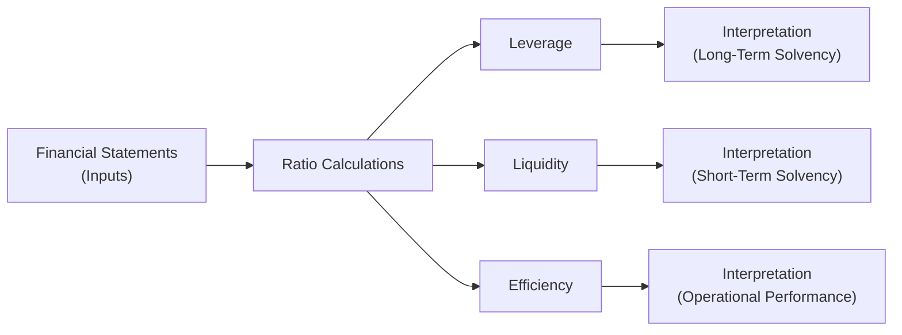

## 27.2 Leverage, Liquidity, and Efficiency Metrics

Financial ratios are indispensable tools for evaluating an entity’s financial stability, short-term solvency, long-term risk profile, and operational performance. As covered in earlier chapters (especially Chapter 4 on Financial Statement Analysis), ratio analysis empowers analysts, auditors, and other stakeholders to make informed judgments about the health of a company. This section focuses on the three broad categories of ratios—Leverage, Liquidity, and Efficiency—providing concise definitions and core formulas. Practical considerations and cautionary notes on interpretive limitations are also highlighted to ensure a well-rounded application of these metrics.

--------------------------------------------------------------------------------
### Overview of Ratio Categories

Ratios serve as simplified indicators of detailed financial data. By expressing relationships between financial statement items (e.g., current assets vs. current liabilities, or total debt vs. total equity), these metrics can pinpoint strengths and weaknesses that might be overlooked by raw numbers alone. Each category—Leverage, Liquidity, and Efficiency—answers a distinct set of questions:

• Leverage Ratios: Assess how a company finances operations and growth, indicating long-term solvency and risk from debt financing.  
• Liquidity Ratios: Examine short-term solvency by comparing near-term obligations with available resources.  
• Efficiency Ratios: Measure how effectively a company manages its assets and liabilities in day-to-day operations, highlighting turnover speed and productivity.

Below is a conceptual diagram illustrating the relationships among these ratio categories, their input sources, and their focal points within financial analysis:

In practice, these categories often overlap or influence each other. For instance, a highly leveraged company might still be very liquid if it holds significant cash balances, but the cost of servicing that debt can harm overall efficiency and profitability. Consequently, performing a well-rounded analysis entails evaluating all relevant ratios in context, supplemented by qualitative assessment (e.g., industry outlook, competitive positioning, managerial expertise).

--------------------------------------------------------------------------------
### Leverage Ratios

Leverage ratios spotlight how much debt and equity finance a company’s operations. They also shed light on a company’s ability to handle unexpected financial difficulties (e.g., economic downturns or interest rate increases). While higher leverage can amplify returns for shareholders, it also escalates the risk profile, as significant interest and principal repayments burden the entity over time.

#### Debt-to-Equity (D/E) Ratio
Definition: Measures the proportion of company financing from creditors versus owners.  
Formula (in KaTeX):

\text{Debt-to-Equity} = \frac{\text{Total Liabilities}}{\text{Total Shareholders' Equity}}

Interpretation:  
• A ratio > 1.0 suggests the company relies more on debt than equity.  
• A ratio < 1.0 indicates more equity financing than debt financing.  

Key Considerations:  
• Total Liabilities might include all short-term and long-term debts (depending on the context and definitions used).  
• Industry norms vary considerably. For instance, capital-intensive industries (e.g., airlines, utilities) often have higher D/E ratios than tech or service-based firms.  
• Exclude intangible or certain assets from equity in specialized analyses to get a more conservative viewpoint.

#### Debt-to-Total-Assets (D/A) Ratio
Definition: Shows the portion of total assets financed by creditors.  
Formula (in KaTeX):

\text{Debt-to-Total-Assets} = \frac{\text{Total Liabilities}}{\text{Total Assets}}

Interpretation:  
• The higher the ratio, the greater the share of assets financed through borrowing.  
• A rising D/A may signal increased financial risk over time, especially if cash flow generation does not keep pace.

Key Considerations:  
• Use consistent definitions of liabilities and assets to avoid confusion.  
• Might be more meaningful to separate interest-bearing debt from non-interest-bearing obligations.

#### Times Interest Earned (TIE)
Definition: Indicates a company’s capability to pay interest on its outstanding debt from operating earnings.  
Formula (in KaTeX):

\text{Times Interest Earned} = \frac{\text{EBIT}}{\text{Interest Expense}}

where \\( \text{EBIT} \\) is earnings before interest and taxes.  

Interpretation:  
• A TIE ratio of 1.0 means the company’s operating income just covers its interest expense.  
• Values comfortably above 1.0 demonstrate a sustainable capacity to meet interest payments, while values near or below 1.0 signal elevated default risk.

Key Considerations:  
• EBIT can vary significantly from net income due to interest, taxation, and non-cash charges.  
• Different versions of this ratio might use EBITDA instead of EBIT, especially for capital-intensive companies with heavy depreciation charges.

#### Practical Example of Leverage Analysis
Consider a manufacturing company, XY Manufacturing, with the following figures:  
• Total Liabilities = \$2,000,000  
• Total Shareholders’ Equity = \$1,500,000  
• Total Assets = \$3,500,000  
• EBIT = \$400,000  
• Interest Expense = \$80,000  

• D/E = \$2,000,000 / \$1,500,000 = 1.33  
• D/A = \$2,000,000 / \$3,500,000 = 0.57  
• TIE = \$400,000 / \$80,000 = 5.0  

This moderate level of leverage (D/E of 1.33) combined with a TIE of 5.0 suggests XY Manufacturing adequately manages debt service, though caution is warranted if interest rates rise or sales decline.

--------------------------------------------------------------------------------
### Liquidity Ratios

Liquidity ratios evaluate the firm’s capacity to meet short-term obligations (e.g., payables, accrued expenses) using readily available assets (e.g., cash, marketable securities, receivables). A healthy liquidity position typically safeguards against insolvency under normal operating cycles.

#### Current Ratio
Definition: Assesses how many dollars of current assets are available to cover each dollar of current liabilities.  
Formula (in KaTeX):

\text{Current Ratio} = \frac{\text{Current Assets}}{\text{Current Liabilities}}

Interpretation:  
• A ratio around 2.0 is often viewed as comfortable.  
• A ratio < 1.0 might imply liquidity issues.  

Key Considerations:  
• A high current ratio isn’t always beneficial if it stems from excessive or obsolete inventory.  
• Qualitative factors matter (e.g., quality of receivables).

#### Quick (Acid-Test) Ratio
Definition: Removes less liquid or harder-to-convert current assets—most notably inventory—providing a clearer sense of immediate liquidity.  
Formula (in KaTeX):

\text{Quick Ratio} = \frac{\text{Cash + Marketable Securities + Accounts Receivable}}{\text{Current Liabilities}}

Interpretation:  
• Ratios closer to or above 1.0 suggest a healthy ability to meet immediate obligations.  
• Companies heavily reliant on inventory or specialized production might show a lower quick ratio more reflective of their operating cycle.

Key Considerations:  
• Mismatched maturity structure of liabilities can still cause liquidity crunches, even with favorable quick ratios.  
• Customer concentration or poor receivables management can erode the reliability of accounts receivable as a quick asset.

#### Cash Ratio
Definition: Focuses strictly on the most liquid of assets—cash and near-cash equivalents—to gauge a company’s essential “emergency” liquidity.  
Formula (in KaTeX):

\text{Cash Ratio} = \frac{\text{Cash + Marketable Securities}}{\text{Current Liabilities}}

Interpretation:  
• Often significantly less than 1.0, since businesses typically do not keep enough idle cash to cover all current liabilities at once.  
• Useful for stress-testing an entity’s ability to survive sudden cash demands.

Key Considerations:  
• Too high a cash ratio might indicate underutilized resources that could be invested in productive assets.  
• Global or multinational companies must consider foreign exchange constraints on cash holdings abroad.

#### Operating Cash Flow Ratio
Definition: Compares operating cash flow (OCF) from the statement of cash flows to current liabilities, emphasizing an entity’s ability to generate operating cash to meet short-term debt.  
Formula (in KaTeX):

\text{Operating Cash Flow Ratio} = \frac{\text{Operating Cash Flow}}{\text{Current Liabilities}}

Interpretation:  
• A higher number implies stronger ongoing internal cash generation, mitigating liquidity risk.  
• Especially pertinent for businesses whose accounting net income might differ significantly from actual cash flows due to accrual accounting complexities.

Key Considerations:  
• Seasonal fluctuations might temporarily distort the ratio.  
• Enhanced by segregating cash flow sources (i.e., from core operations vs. one-time items).

#### Practical Example of Liquidity Analysis
Suppose ABC Services has:  
• Current Assets = \$600,000  
• Inventory (a large portion of Current Assets) = \$200,000  
• Current Liabilities = \$400,000  
• Cash + Marketable Securities = \$100,000  
• Accounts Receivable = \$150,000  
• Operating Cash Flow = \$250,000  

• Current Ratio = \$600,000 / \$400,000 = 1.5  
• Quick Ratio = (\$100,000 + \$150,000) / \$400,000 = 0.625  
• Cash Ratio = \$100,000 / \$400,000 = 0.25  
• Operating Cash Flow Ratio = \$250,000 / \$400,000 = 0.625  

Although the current ratio is acceptable, the quick ratio uncovers that ABC Services may have difficulty meeting obligations without relying on inventory turnover. The company’s relatively low operating cash flow ratio suggests more thorough cash management is needed.

--------------------------------------------------------------------------------
### Efficiency Ratios

Efficiency ratios—sometimes called “asset utilization” or “turnover” ratios—measure how productively a company uses its assets to generate revenue. Higher turnover implies faster conversion of resources into sales, which typically enhances profitability and reduces holding or financing costs.

#### Inventory Turnover
Definition: Indicates how swiftly a company sells and replaces inventory.  
Formula (in KaTeX):

\text{Inventory Turnover} = \frac{\text{Cost of Goods Sold (COGS)}}{\text{Average Inventory}}

Interpretation:  
• A high ratio suggests efficient inventory management but could also hint at frequent stockouts if too high.  
• A low ratio indicates slow-moving or possibly obsolete inventory tying up cash.

Key Considerations:  
• Seasonal sales patterns often require calculating turnover on a monthly or quarterly basis.  
• Average Inventory calculation might involve a simple average of beginning and ending balances or a rolling average for more precision.

#### Accounts Receivable (AR) Turnover
Definition: Evaluates how efficiently a company collects from customers.  
Formula (in KaTeX):

\text{AR Turnover} = \frac{\text{Net Credit Sales}}{\text{Average Accounts Receivable}}

Interpretation:  
• Higher turnover reflects timely collections and reduced risk of bad debts.  
• Lower turnover indicates potential collection concerns or lenient credit terms.

Key Considerations:  
• Some industries, such as construction or government contracting, have inherently longer receivable cycles.  
• Exclude cash sales if focusing purely on credit sales turnover.

#### Accounts Payable (AP) Turnover
Definition: Measures the rate at which a company pays its suppliers.  
Formula (in KaTeX):

\text{AP Turnover} = \frac{\text{Cost of Goods Sold (or Purchases)}}{\text{Average Accounts Payable}}

Interpretation:  
• A high turnover points to rapid payments, possibly missing out on extended credit terms.  
• A lower turnover indicates slower payment but can improve short-term cash flow—however, it may jeopardize supplier relations.

Key Considerations:  
• Some companies deliberately stretch payables to optimize cash management, especially if it does not harm vendor relationships.

#### Asset Turnover
Definition: Reflects the efficiency of using all assets to generate revenue.  
Formula (in KaTeX):

\text{Asset Turnover} = \frac{\text{Net Sales}}{\text{Average Total Assets}}

Interpretation:  
• Higher turnover suggests the company is effectively deploying its asset base for sales generation.  
• A low turnover might imply overinvestment in assets or underutilized capacity.

Key Considerations:  
• Look at underlying reasons for an unusually high or low ratio (e.g., new fixed assets not yet operational, intangible assets not captured accurately on the balance sheet).

#### Days Sales Outstanding (DSO) and Days Payable Outstanding (DPO)
Definition: While related to turnover metrics, DSO and DPO express the average number of days a receivable or payable remains outstanding.  
Formulas (in KaTeX):

\text{DSO} = \frac{\text{Average Net AR}}{\text{Total Credit Sales}} \times \text{Number of Days in Period}


\text{DPO} = \frac{\text{Average AP}}{\text{Total Credit Purchases}} \times \text{Number of Days in Period}

Interpretation:  
• A higher DSO means it takes longer to collect from credit customers.  
• A higher DPO means the company takes longer to pay its suppliers.

Key Considerations:  
• Industry norms and credit terms heavily influence acceptable DSO and DPO ranges.  
• Align DSO and DPO with the company’s overall working capital strategy for balanced liquidity.

--------------------------------------------------------------------------------
### Caution on Interpretive Limitations

While ratios deliver critical insights, they are not foolproof. Analysts should bear in mind:

1. **Industry Variations**: Comparing ratios across different industries without normalizing data can lead to misleading conclusions.  
2. **Accounting Policies**: Variation in accounting methods (e.g., depreciation, inventory valuation, revenue recognition) can distort ratio comparisons across firms or periods.  
3. **Seasonality and Cyclicality**: Certain businesses exhibit significant seasonal swings, making single snapshot ratios less meaningful.  
4. **Quality of Underlying Data**: Ratios are only as reliable as the financial statements from which they are derived. Potential manipulation, estimation errors, or incomplete disclosures can diminish reliability.  
5. **Macro Factors**: Economic conditions like interest rate movements, inflation, and currency fluctuations can sharply impact a ratio’s trend or interpretation.  

Rather than relying on standalone ratios, best practice involves triangulating multiple measures, reviewing multi-year trends, and integrating qualitative factors (e.g., management quality, innovation pipeline) into the analysis.

--------------------------------------------------------------------------------
### Practical Tips and Best Practices

• **Use Benchmarking**: Compare ratios against industry peers, well-established competitors, or average industry benchmarks for context.  
• **Combine Ratios with Non-Financial Metrics**: Include operational data (e.g., product returns, employee turnover) to gain a holistic outlook on business health.  
• **Stress Test**: Perform scenario analyses on key ratios (e.g., simulating a rise in interest rates or a drop in sales).  
• **Revisit Regularly**: Update ratios every reporting period to track trends and identify early warning signals.  
• **Integrate with Forecasting**: As highlighted in Chapter 7 on Budgeting and Forecasting, incorporate ratio expectations into pro forma financial statements.

--------------------------------------------------------------------------------
### References for Further Exploration

1. White, G. I., Sondhi, A. C., & Fried, D. (2002). The Analysis and Use of Financial Statements.  
2. Palepu, K., Healy, P., & Peek, E. (2019). Business Analysis and Valuation: IFRS Edition.  
3. [Financial Accounting Standards Board (FASB) website](https://www.fasb.org/) and [International Financial Reporting Standards (IFRS) website](https://www.ifrs.org/) for ongoing updates in accounting standards influencing ratio calculations and disclosures.

--------------------------------------------------------------------------------

## Mastering Financial Health: Leverage, Liquidity, and Efficiency Quiz



### Which ratio best measures a company's capital structure by comparing its obligations to its owners' equity?
- [ ] Current Ratio
- [x] Debt-to-Equity Ratio
- [ ] AR Turnover
- [ ] Asset Turnover

> **Explanation:** The debt-to-equity (D/E) ratio specifically measures the relationship between a company’s total liabilities (obligations) and its shareholders’ equity.

### A high Quick Ratio, in contrast to a moderate Current Ratio, generally indicates:
- [ ] The company has excess inventory that may be obsolete.
- [x] The company can meet short-term obligations with its most liquid assets.
- [ ] The company is overly reliant on leverage for expansion.
- [ ] The company must restructure its payables for improved efficiency.

> **Explanation:** The Quick Ratio excludes inventory, focusing on the most liquid assets such as cash, marketable securities, and receivables. A higher Quick Ratio signifies strong immediate liquidity.

### Which statement is true when the Times Interest Earned (TIE) ratio is exactly 1.0?
- [ ] The company’s EBIT is just enough to cover interest expenses.
- [ ] The company is not profitable enough to pay interest without additional financing.
- [x] Both of the above
- [ ] None of the above

> **Explanation:** A TIE ratio of 1.0 means the company’s earnings before interest and taxes precisely match its interest obligations, indicating no cushion above the required interest payments.

### If a company’s Cash Ratio is very high relative to its peers, it might suggest:
- [x] The company is holding too much cash that could be used for profitable investments.
- [ ] The company will struggle to pay its short-term liabilities.
- [ ] The company has excessive leverage.
- [ ] The company is likely to fail its interest obligations.

> **Explanation:** While strong liquidity is generally positive, an excessively high Cash Ratio may indicate underutilized assets, missing out on potential returns.

### If a business has very high inventory turnover compared to industry averages, this could mean:
- [x] It efficiently manages and sells its inventory.
- [ ] It is not effectively collecting on credit sales.
- [x] There is a risk of stockouts if inventory is kept too lean.
- [ ] It pays its suppliers too slowly.

> **Explanation:** High inventory turnover often signifies efficient inventory management. However, if inventory is too low, the company risks stockouts and missed sales opportunities.

### Which factor can greatly distort ratio comparisons across different companies?
- [x] Accounting policy variations (e.g., methods used for depreciation)
- [ ] The strict use of baseline formulas
- [ ] The universal applicability of ratio analysis
- [ ] The same interest rate environment

> **Explanation:** Companies may use different accounting conventions (e.g., straight-line vs. declining-balance depreciation), resulting in differing financial statement figures that can mislead direct comparisons.

### The Operating Cash Flow Ratio is especially preferable to net-income-based ratios when:
- [x] Evaluating the ability to cover current liabilities from core operations.
- [ ] A firm uses a percentage-of-completion method for all transactions.
- [x] Identifying short-term cash flow adequacy for unexpected obligations.
- [ ] Assessing purely the profitability of a single product line.

> **Explanation:** Unlike net-income-based measures, operating cash flow focuses on actual cash inflows and outflows from day-to-day operations, providing insights on liquidity coverage.

### A drastic drop in AR Turnover over consecutive periods might signal:
- [x] Customers are taking longer to pay or the company has relaxed credit policies.
- [ ] The company has improved its liquidity.
- [ ] A short supply of raw materials.
- [ ] Rapidly increasing inventory turnover.

> **Explanation:** Decreasing AR Turnover typically means accounts receivable are staying on the books longer, possibly due to extended credit terms or slower collections.

### Which best practice could help minimize common pitfalls in ratio interpretation?
- [x] Triangulating different ratios together for a fuller picture.
- [ ] Relying on one ratio alone in isolation.
- [ ] Collecting data solely from a single year’s statements.
- [ ] Avoiding external benchmarking.

> **Explanation:** Relying on a single ratio or snapshot year can be misleading. Triangulating multiple ratios and benchmarking over time is crucial for robust analysis.

### Leverage ratios primarily focus on:
- [x] True
- [ ] False

> **Explanation:** Leverage ratios concentrate on the extent to which a company finances its operations with debt and its ability to meet long-term obligations, thereby reflecting its long-term financial risk profile.



--------------------------------------------------------------------------------

## For Additional Practice and Deeper Preparation

### [Business Analysis and Reporting (BAR) CPA Mock Exams](https://www.udemy.com/course/bar-cpa-mock-exams/?referralCode=ADBE2E84BEE9CB6243CA)

**Business Analysis and Reporting (BAR) CPA Mocks:** 6 Full (1,500 Qs), Harder Than Real! In-Depth & Clear. Crush With Confidence!

- Tackle full-length mock exams designed to mirror real BAR questions.  
- Refine your exam-day strategies with detailed, step-by-step solutions for every scenario.  
- Explore in-depth rationales that reinforce higher-level concepts, giving you an edge on test day.  
- Boost confidence and minimize anxiety by mastering every corner of the BAR blueprint.  
- Perfect for those seeking exceptionally hard mocks and real-world readiness.  

_Disclaimer: This course is not endorsed by or affiliated with the AICPA, NASBA, or any official CPA Examination authority. All content is for educational and preparatory purposes only._
