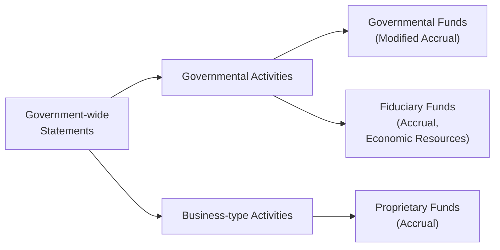

## 27.4 Governmental Accounting Reference Tables

This section offers a collection of key Governmental Accounting Standards Board (GASB) statements, their primary focus, and their typical usage scenarios in state and local governments. These reference tables aim to support both emerging and seasoned accounting professionals seeking a quick refresher on the wide range of standards that shape governmental financial reporting and transparency. Drawing upon concepts introduced in Chapters 19 through 22 of this guide, this reference consolidates core information into concise bullet points so that you can easily locate authoritative guidance when dealing with real-world government accounting issues.

It is important to understand how these GASB pronouncements intersect with the fundamental structures of governmental entities—such as funds, measurement focus, and basis of accounting. By mastering these references, practitioners and CPA candidates can strengthen their comprehension and application of governmental accounting principles, ensuring high-quality, standards-compliant financial statements.

---

### Purpose and Utility of Governmental Accounting Reference Tables

• Provide a foundation for referencing key GASB statements and guidance.  
• Support quicker decision-making and clarity when facing nuanced or complex governmental transactions.  
• Complement deep-dive discussions in Chapters 19–22, offering quick bullet-point highlights.  
• Enhance exam preparation by summarizing each standard’s primary objective and key usage scenarios.

---

### Core Governmental Accounting Structures Recap

Before diving into individual GASB statements, remember that governmental accounting involves multiple layers of reporting. Government-wide financial statements emphasize broad overview and economic resources measurement focus (accrual basis of accounting), while fund-based statements focus on particular funds using different measurement focuses. As discussed in Chapters 19–21:

• Governmental Funds (e.g., General Fund, Special Revenue Fund, Debt Service Fund, Capital Projects Fund, Permanent Fund) use the modified accrual basis and a current financial resources measurement focus.  
• Proprietary Funds (Enterprise and Internal Service) rely on the accrual basis and economic resources measurement focus, similar to for-profit entities.  
• Fiduciary Funds (Pension, Investment, Private-Purpose, and Custodial) also use the accrual basis with an economic resources measurement focus but are reported only in fund statements, not in government-wide statements.

The following Mermaid diagram illustrates the high-level structural relationships in governmental accounting:

Above, government-wide statements are the umbrella that consolidates activities across the entity. However, the detailed figures often originate in separate funds with distinct bases of accounting, which then must be reconciled to the government-wide viewpoint.

---

### Overview of Key GASB Statements

Below are bullet-point references to major GASB statements frequently encountered in typical state and local government scenarios. These references summarize the purpose, the main coverage areas, and the typical usage or application for each pronouncement. For more detailed discussion, see the Governmental Accounting chapters in this text (Chapters 19 through 22).

---

#### GASB 34 – Basic Financial Statements (and MD&A) for State and Local Governments

• Purpose:  
  - Introduces government-wide financial statements (Statement of Net Position and Statement of Activities).  
  - Outlines requirements for Management’s Discussion & Analysis (MD&A).

• Key Coverage:  
  - Defines the structure and format of government-wide reporting.  
  - Establishes two sets of statements: the government-wide statements (accrual basis) and the fund-based statements (modified accrual for governmental funds).

• Typical Usage:  
  - Most fundamental for external financial reporting of state and local governments.  
  - Governs the presentation of major vs. non-major funds and the reconciliation between fund statements and government-wide statements.

---

#### GASB 54 – Fund Balance Reporting and Governmental Fund Type Definitions

• Purpose:  
  - Clarifies fund balance classifications for governmental funds (nonspendable, restricted, committed, assigned, unassigned).  
  - Defines proper usage of governmental fund types (General, Special Revenue, etc.).

• Key Coverage:  
  - Guidance on how to present resources earmarked for specific use vs. those available for general spending.  
  - Mandates consistent terminologies for the different categories of fund balance.

• Typical Usage:  
  - Helps governments accurately communicate the extent of legally constrained resources.  
  - Reveals fiscal flexibility by distinguishing unassigned from restricted or committed balances.

---

#### GASB 68 – Accounting and Financial Reporting for Pensions

• Purpose:  
  - Provides the framework for pensions provided by state and local governmental employers.  
  - Requires recognition of the Net Pension Liability (NPL) on the government-wide Statement of Net Position.

• Key Coverage:  
  - Actuarial assumptions, discount rates, and measurement dates.  
  - Disclosure requirements, sensitivity analyses, and required supplementary information (RSI).

• Typical Usage:  
  - Recognizing pension-related expenses in a manner consistent with economic reality.  
  - Smoothing certain gains/losses over future periods via deferred outflows/inflows of resources.  

• Formula Reference: Net Pension Liability (NPL):
  
  $$
  \text{Net Pension Liability} = \text{Total Pension Liability} - \text{Plan Fiduciary Net Position}
  $$

---

#### GASB 75 – Accounting and Financial Reporting for Postemployment Benefits Other Than Pensions (OPEB)

• Purpose:  
  - Extends the pension liability concept in GASB 68 to include health care and other benefits offered after retirement (OPEB).  
  - Recognizes Net OPEB Liability on the Statement of Net Position.

• Key Coverage:  
  - Defines measurement of OPEB liability and expense.  
  - Addresses discount rates, actuarial valuations, and disclosures similar to pensions.

• Typical Usage:  
  - Ensures comparability in how governments report long-term OPEB obligations.  
  - Accommodates separate trusts or pay-as-you-go financing strategies.

---

#### GASB 84 – Fiduciary Activities

• Purpose:  
  - Clarifies the criteria for identifying fiduciary activities (pension or OPEB plans, custodial funds, private-purpose trusts, etc.).  
  - Improves the consistency and comparability of fiduciary fund reporting.

• Key Coverage:  
  - Guidance on when a government is controlling assets in a fiduciary capacity.  
  - Requirements regarding how fiduciary funds should be presented in separate statements.

• Typical Usage:  
  - Helps differentiate fiduciary funds that do not belong to the government’s own resources but are held in trust or as an agent for others.  
  - Identifies which inflows/outflows belong in proprietary or governmental funds vs. fiduciary funds.

---

#### GASB 87 – Leases

• Purpose:  
  - Establishes a single model for lease accounting.  
  - Requires recognition of certain lease assets and liabilities by lessees and lessors, beyond the short-term classification.

• Key Coverage:  
  - Differentiation between short-term leases and long-term leases.  
  - Rights to use assets and corresponding lease liabilities must be reported on the Statement of Net Position.

• Typical Usage:  
  - Ensures governments account for the economic substance of lease transactions.  
  - Mirrors similar changes in private-sector lease accounting, promoting comparability.

---

#### GASB 94 – Public-Private and Public-Public Partnerships (PPPs)

• Purpose:  
  - Addresses PPP arrangements such as service concession arrangements and other forms of partnership.  
  - Outlines recognition, measurement, and disclosure requirements.

• Key Coverage:  
  - Guidance on how to treat PPP asset transfers, revenue-sharing agreements, and related liabilities/deferrals.  
  - Clarifies classification of relevant revenues, expenses, and capital outlays.

• Typical Usage:  
  - Useful for governments engaging with private entities to finance, build, or operate public infrastructure (e.g., toll roads, public buildings).  
  - Ensures transparency about ownership and operation obligations over the project’s lifecycle.

---

#### GASB 96 – Subscription-Based Information Technology Arrangements (SBITAs)

• Purpose:  
  - Provides accounting guidance for subscription-based IT services where governments pay for the right to use vendors’ software or cloud solutions.  
  - Aligns with lease-like treatment for intangible rights-to-use assets.

• Key Coverage:  
  - Recognizes a subscription liability and corresponding intangible leased asset.  
  - Requires disclosures about significant terms, conditions, and renewal options.

• Typical Usage:  
  - Governments increasingly rely on subscription-based IT services (e.g., hosting arrangements, SaaS).  
  - Ensures consistent accounting similar to GASB 87’s framework for lease assets and liabilities.

---

### Quick Reference Table: Common GASB Statements in State/Local Accounting

Below is a concise table summarizing high-profile GASB standards and where they primarily apply. Use this for quick scanning during practice or exam prep:

| GASB Std | Area of Coverage                                 | Key Focus                               | Common Govt Scenarios                    |
|----------|--------------------------------------------------|-----------------------------------------|------------------------------------------|
| **34**   | Basic Financial Statements & MD&A                | Government-wide vs. Fund Fin. Reporting | All general-purpose external reporting   |
| **54**   | Fund Balance & Def. of Govt Fund Types           | Fund balance classifications            | Clarification of fund usage & categories |
| **68**   | Pension Accounting & Reporting                   | Net Pension Liability & expense         | Employer-sponsored pension plans         |
| **75**   | OPEB Accounting & Reporting                      | Net OPEB Liability & expense            | Retiree health and life insurance        |
| **84**   | Fiduciary Activities                             | Identification of fiduciary funds       | Trust/custodial funds reporting          |
| **87**   | Lease Accounting                                 | Asset & liability recognition           | Long-term government leasing contracts   |
| **94**   | Public-Private/Public-Public Partnerships (PPP)  | Asset transfers, revenue-sharing        | Concession arrangements, toll roads      |
| **96**   | Subscription-Based IT Arrangements (SBITA)       | Liabilities & intangible rights-of-use  | Cloud-based software solutions           |

---

### Practical Examples of Applying GASB Standards

• Budgetary Shortfalls & GASB 54:  
  - A city’s General Fund experiences unexpected shortfalls. The city uses restricted and committed classifications to highlight resources that cannot be used for general purposes. GASB 54 ensures clarity in distinguishing which amounts remain legally protected vs. free for reallocation.

• Pension Funding & GASB 68:  
  - A county with a defined benefit pension plan measures its Net Pension Liability each year using updated actuarial assumptions. GASB 68 ensures that future service costs and interest are properly recorded and that the liability is recognized in the government-wide statements.

• OPEB Health Plans & GASB 75:  
  - A school district offering postemployment healthcare calculates present values of estimated benefit outlays. GASB 75 requires disclosure of this long-term commitment and includes sensitivity analyses reflecting discount-rate variations.

• Major Lease Agreement & GASB 87:  
  - A transit authority enters a 10-year lease for additional parking facilities. GASB 87 mandates that the entity record a Lease Asset (the right to use the parking structure) and a Lease Liability (the obligation to make lease payments) on government-wide statements.

• Technology Subscriptions & GASB 96:  
  - A city migrates its ERP system to a cloud-based Software-as-a-Service (SaaS) model. GASB 96 stipulates that the city treats the subscription similarly to a lease, with intangible rights-of-use and associated liability if the subscription meets specific contractual definitions.

---

### Best Practices and Common Pitfalls

• Regularly Update Actuarial Reports:  
  - For pension and OPEB standards (GASB 68 and GASB 75), failing to update actuarial valuations can distort liability calculations and hamper transparency.

• Proper Fund Classification:  
  - Misclassifying resources under GASB 54 can lead to misinterpretations of fiscal health. Always ensure legal restrictions or trustee stipulations are properly documented.

• Timely Implementation:  
  - GASB releases new updates regularly. Jurisdictions often struggle to implement new standards, such as GASB 87 or GASB 96, if they lack thorough policy reviews and staff training.

• Reporting Accuracy for Fiduciary Funds:  
  - Local governments sometimes mix fiduciary activities with general operations. Ensure that fiduciary activities follow GASB 84 criteria so the correct amounts appear in fiduciary funds.

• Lease vs. Operating Agreements:  
  - Under GASB 87, practitioners sometimes confuse short-term leases or service agreements for capital leases. Confirm the arrangement qualifies under the new single-model approach.

• Documentation of Public-Private Partnerships:  
  - With PPPs (GASB 94), complexities often arise regarding asset ownership and revenue-sharing. Robust legal contracts and policy documentation aid in consistent accounting treatment.

---

### Working with GASB Statements: Implementation Tips

• Cross-Reference the Governmental GAAP Hierarchy:  
  - When in doubt, consult the official publications of GASB to ensure that your interpretations align with authoritative guidance.

• Use Flowcharts for Decision-Making:  
  - For complex standards (leases, PPPs, etc.), consider visual decision trees to confirm if a transaction meets recognition thresholds.

• Communicate Changes to Stakeholders:  
  - When implementing new GASB standards (like GASB 96 for IT subscriptions), collaborate with IT teams and budget offices to gather accurate contract data and cost structures.

• Leverage Resources in Chapter 29:  
  - Chapter 29 provides sample checklists and templates that can be adapted to track compliance with each GASB statement.

---

### Additional References and Suggested Readings

• Official GASB Website (gasb.org):  
  - Contains all published GASB statements, implementation guides, and exposure drafts.  

• AICPA’s Governmental Audit Quality Center:  
  - Offers webinars and whitepapers detailing the application of GASB guidance.  

• Government Finance Officers Association (GFOA):  
  - Publishes best practice advisories and practical toolkits for finance officers.  

• Chapters 19–22 in this guide:  
  - In-depth analyses of fund accounting, governmental transaction scenarios, conversions, and reconciliations.

---

## Governmental Accounting & GASB Mastery Quiz



### In which GASB statement are the fund balance classifications (restricted, committed, assigned, etc.) specifically addressed?

- [ ] GASB 34
- [ ] GASB 68
- [x] GASB 54
- [ ] GASB 87

> **Explanation:** GASB 54 provides detailed guidance on Fund Balance Reporting and Governmental Fund Type Definitions, introducing classifications such as nonspendable, restricted, committed, assigned, and unassigned.

### Which GASB statement primarily governs the recognition of Net OPEB Liability?

- [x] GASB 75
- [ ] GASB 34
- [ ] GASB 45
- [ ] GASB 95

> **Explanation:** While GASB 45 was the initial standard for OPEB, GASB 75 superseded it, requiring recognition of Net OPEB Liability in the government-wide financial statements.

### Under GASB 68, which formula represents the Net Pension Liability?

- [x] Net Pension Liability = Total Pension Liability – Plan Fiduciary Net Position
- [ ] Net Pension Liability = Plan Fiduciary Net Position – Actuarial Accrued Liability
- [ ] Net Pension Liability = Pension Asset – Total Plan Contributions
- [ ] Net Pension Liability = Pension Expense – Outstanding Debt

> **Explanation:** GASB 68 defines the NPL as the difference between the actuarial measure of the total pension liability and the net plan assets available to pay benefits.

### A city government has engaged a private company to build and operate a new toll bridge for 25 years. This arrangement would typically fall under:

- [ ] GASB 68
- [ ] GASB 75
- [ ] GASB 96
- [x] GASB 94

> **Explanation:** GASB 94 deals with public-private (and public-public) partnerships, including service concession arrangements and other forms of infrastructure operation agreements.

### Which of the following statements is true about GASB 87?

- [x] It establishes a single model for lease accounting for both lessees and lessors.
- [ ] It primarily addresses tax abatement disclosures for local governments.
- [x] It requires recognition of certain lease assets and liabilities in the financial statements.
- [ ] It supersedes the entire content of GASB 44.

> **Explanation:** GASB 87 applies a single leasing model for governmental entities, requiring that lessees record right-of-use assets and lease liabilities for long-term arrangements. It also contains guidance for lessors on recognizing lease receivables and deferred inflows.

### Which statement most accurately describes the focus of GASB 84?

- [x] It clarifies criteria for identifying fiduciary activities and fiduciary funds.
- [ ] It introduces modifications to the capital projects fund.
- [ ] It requires new disclosures for enterprise funds.
- [ ] It merges agency funds with internal service funds.

> **Explanation:** GASB 84 spells out how to determine when a government is holding resources for the benefit of others and clarifies fiduciary reporting.

### A municipal government paying monthly fees for a cloud-based payroll system likely falls under:

- [x] GASB 96
- [ ] GASB 74
- [x] GASB 34
- [ ] GASB 92

> **Explanation:** GASB 96 addresses subscription-based IT arrangements. However, general guidance from GASB 34 around financial statement presentation still underlies all governmental entity activities, ensuring it remains foundational.

### If a government fails to correctly identify fiduciary funds, the likely result is:

- [x] Overstating government’s own fund balances
- [ ] Understating restricted net position in enterprise funds
- [ ] Inaccurate presentation of budget-to-actual comparisons
- [ ] Overstatement of capital outlay expenditures

> **Explanation:** Misclassifying fiduciary funds in governmental or proprietary funds can inflate the government’s own resources, since fiduciary funds typically belong to external parties and should not appear as part of the government’s net position.

### Which of the following is not typically required by GASB 68 or GASB 75?

- [x] Recognition of minor contract payables as pension expenses
- [ ] Display of net liabilities in government-wide statements
- [ ] Deferred inflows/outflows of resources related to actuarial gains or losses
- [ ] Detailed disclosures regarding discount rate assumptions

> **Explanation:** GASB 68 and GASB 75 primarily address pension and OPEB obligations, requiring recognition of actuarial-based net liabilities and related disclosures. General contract payables do not factor into these standards.

### The measurement focus for Governmental Funds is:

- [x] Current financial resources
- [ ] Economic resources
- [ ] Both economic and current resources
- [ ] Modified economic accrual resources

> **Explanation:** Governmental Funds use the modified accrual basis of accounting and the current financial resources measurement focus, distinguishing them from the economic resources focus of proprietary funds and government-wide statements.



---

## For Additional Practice and Deeper Preparation

### [Business Analysis and Reporting (BAR) CPA Mock Exams](https://www.udemy.com/course/bar-cpa-mock-exams/?referralCode=ADBE2E84BEE9CB6243CA)

**Business Analysis and Reporting (BAR) CPA Mocks:** 6 Full (1,500 Qs), Harder Than Real! In-Depth & Clear. Crush With Confidence!

- Tackle full-length mock exams designed to mirror real BAR questions.  
- Refine your exam-day strategies with detailed, step-by-step solutions for every scenario.  
- Explore in-depth rationales that reinforce higher-level concepts, giving you an edge on test day.  
- Boost confidence and minimize anxiety by mastering every corner of the BAR blueprint.  
- Perfect for those seeking exceptionally hard mocks and real-world readiness.

_Disclaimer: This course is not endorsed by or affiliated with the AICPA, NASBA, or any official CPA Examination authority. All content is for educational and preparatory purposes only._
