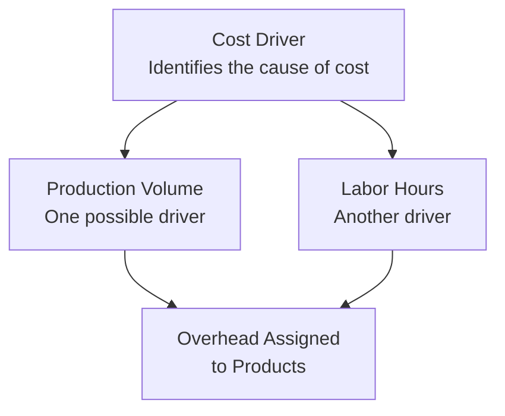

## 28.1 Core Terminology

A strong command of foundational accounting and finance terminology is critical for mastering the Business Analysis and Reporting (BAR) discipline. This section clarifies the most commonly used terms in analysis, reporting, valuation, and auditing settings. As you study these definitions, consider how each concept interrelates and recurs throughout the CPA Exam. Where relevant, references to earlier chapters will help anchor the terminology in the broader context of the BAR domain.  

Use this guide to quickly review critical ideas and develop a firm grasp of the language that underpins discussions on financial statements, government reporting, managerial accounting, and advanced analysis.

  
Introduction to Key Terms and Their Importance  
BAR involves an interdisciplinary approach, requiring CPAs to understand cost accounting, financial statement analysis, valuation techniques, and governmental standards. By grounding your understanding in these definitions, you will better appreciate the complexities discussed in earlier chapters of this guide, such as Chapter 4 (Financial Statement Analysis), Chapter 5 (Managerial and Cost Accounting Essentials), Chapter 12 (Revenue Recognition), and Chapter 19 (Governmental Accounting Fundamentals).  

Below you will find explanations of frequently encountered words in BAR settings. Familiarize yourself with these terms to reinforce core knowledge, avoid misunderstandings, and facilitate deeper study.

  
Accounting and Financial Reporting Terminology  

• Accrual Basis Accounting  
Accrual basis accounting recognizes revenues when they are earned (rather than when cash is received) and expenses when they are incurred (rather than when cash is paid). This approach provides a more accurate picture of a company’s ongoing financial activities, reflecting outstanding obligations and expected income on the financial statements. See Chapter 2.2 for basic financial statement relationships that delve into how accruals impact balance sheets and income statements.

• Accounting Cycle  
The sequence of activities from recording individual transactions to preparing financial statements. Typical steps include journalizing transactions, posting to the ledger, preparing a trial balance, making adjusting entries, and finally generating financial statements. Mastering the accounting cycle, covered in Chapter 2.3, ensures proper transaction capture and reliable financial reporting.

• Amortization  
The systematic reduction of an intangible asset’s value or the repayment of a debt. For intangible assets, amortization follows a schedule that reflects the asset’s estimated useful life (e.g., capitalized software or patents). For debt instruments, amortization schedules help allocate principal and interest across payment periods. See Chapter 11.3 regarding amortization of internally developed software.

• Asset  
A resource owned or controlled by an entity expected to provide future economic benefit. Assets can be tangible (e.g., property, equipment) or intangible (e.g., patents, goodwill). Proper valuation, classification, and reporting of assets is crucial for transparent financial statements (see Chapter 14 for business combinations and consolidated statements impacting asset recognition).

• Balance Sheet  
A financial statement showing an entity’s financial position at a specific date. It summarizes assets, liabilities, and equity; the relationship among these elements follows the fundamental accounting equation (Assets = Liabilities + Equity). Chapter 2 covers fundamental statement relationships in more detail.

• Book Value  
The net value of an asset on the balance sheet, calculated as historical cost minus accumulated depreciation or amortization. While book value is a cornerstone of GAAP-based reporting, it may differ significantly from fair value. Chapter 9 offers additional valuation context.

• Closing Entries  
Journal entries made at the end of an accounting period to transfer balances in temporary accounts (revenues, expenses, gains, and losses) to permanent equity accounts (e.g., Retained Earnings). This process “resets” temporary account balances to zero to begin the next period. For government fund accounts, see Chapter 22.4 regarding closing entries and ACFR components.

• Comparability  
A qualitative characteristic of financial information ensuring it can be used to compare different companies or different periods. Consistency in applying accounting principles fosters comparability. Refer to Chapter 17.4 on frequent reporting challenges that can adversely affect comparability.

• Consolidation  
Combining the financial statements of a parent company with its subsidiaries to produce one set of statements. This procedure eliminates intercompany transactions and ensures that the group presents itself as a single economic entity. Chapter 14 delves deeper into acquisition accounting and variable interest entities (VIEs).

• Double-Entry Accounting  
The fundamental principle behind modern bookkeeping, requiring every transaction to involve at least two accounts (debits and credits). Ensuring that total debits always equal total credits safeguards the balance sheet’s integrity and is central to the accounting cycle (Chapter 2.3).

• Fair Value Measurement  
As outlined in FASB ASC 820, fair value is the price that would be received to sell an asset or paid to transfer a liability in an orderly transaction between market participants. Fair value emphasizes market-based evidence to determine an exit price. See Chapter 9.1 for additional guidance on how fair value is applied in valuation.

• Financial Analysis  
A broad term describing techniques—including ratio analysis, trend analysis, and benchmarking—used for evaluating a company’s financial health, performance, and future prospects. Strategies for ratio analysis are laid out in Chapter 4.1, and common metrics are revisited in Chapter 27.

• Financial Statements  
Collective term for the balance sheet, income statement, statement of cash flows, statement of changes in equity, and any supplemental disclosures required under GAAP or IFRS. Each statement offers insights into different facets of an entity’s performance and stability. Chapter 17 addresses public company reporting essentials.

• Going Concern  
An assumption that an entity will continue operations indefinitely, without the intention or need to liquidate. If going concern is in doubt, disclosures must be made, highlighting potential financial difficulties. Chapter 3.4 briefly covers technology pitfalls that can also raise going concern flags in modern industries.

• Goodwill  
An intangible asset recognized in a business combination representing the excess of purchase price over the fair value of the acquired company’s identifiable net assets. Goodwill differs from other intangibles in that it is not amortized but tested annually (or when impairment indicators exist) under ASC 350 guidance. Chapter 10.2 details goodwill impairment testing.

• IFRS (International Financial Reporting Standards)  
Global accounting standards set by the International Accounting Standards Board (IASB). Certain multinational companies or foreign subsidiaries may prepare financial statements under IFRS. Chapter 23.1 highlights key differences between IFRS and U.S. GAAP.

• Impairment  
A permanent write-down of an asset’s carrying value, recognizing that the asset’s fair value has fallen below its book value and is not expected to recover. Goodwill and other intangible assets require periodic impairment testing, as described in Chapter 10.

• Internal Control  
Processes designed to provide reasonable assurance about the reliability of financial reporting, effectiveness and efficiency of operations, and compliance with laws and regulations. The COSO framework (Chapter 8.3) and PCAOB standards guide internal control evaluations for public companies.

• Journal Entry  
A record of a transaction in an entity’s books, chronologically detailing the accounts debited and credited for a given event. Adequate documentation of each journal entry is critical for audit readiness.

  
Managerial and Cost Accounting Terminology  

• Absorption Costing  
A method assigning all manufacturing costs to products, including both variable and fixed overhead. The per-unit cost under absorption costing factors into inventory valuation and the calculation of cost of goods sold. Contrast with variable costing, explored in Chapter 5.1.

• ABC (Activity-Based Costing)  
An overhead allocation system that identifies activities driving costs (cost drivers) and assigns costs based on consumption of those activities. Often more precise than traditional cost accounting methods. Chapter 5.2 covers ABC systems in detail.

• Budget  
A financial plan outlining expected revenues, expenses, and resource allocations over a certain period. Budgets facilitate cost control, strategic planning, and performance evaluation. Level up your budgeting knowledge in Chapter 7.

• Cost Allocation  
The process of assigning indirect or overhead costs to products or services. Allocation methods can significantly impact reported profit and cost-management strategies. Chapter 5.2 compares different accumulation systems.

• Cost Driver  
Any factor that causes a change in the cost of an activity. Common cost drivers include labor hours, machine hours, and materials used. Activity-based costing specifically uses multiple cost drivers to assign overhead more accurately.

Below is a simple illustration of how a cost driver influences overhead assignment in an ABC environment:

In this diagram, cost drivers such as production volume or labor hours funnel into the overhead pool, providing a more precise distribution of indirect costs across the products produced.

• Direct Cost  
A cost that can be traced directly to a specific product, service, or department (e.g., direct materials, direct labor). Understanding direct costs is key to accurately pricing products and managing profitability (Chapter 5).

• Fixed Cost  
A cost that remains constant in total regardless of changes in production volume or sales levels. Rent and insurance often fall under this category. Chapter 5.1 clarifies how fixed, variable, and mixed cost structures influence break-even analysis.

• Variable Cost  
A cost that changes in direct proportion to activity level or production volume (e.g., raw materials, piece-rate labor). Effective cost control requires managing variable components to optimize profits.

• Overhead  
Indirect manufacturing costs that cannot be directly traced to specific products (e.g., factory manager salaries, equipment depreciation). Overhead costs are assigned using cost drivers in ABC or through a predetermined overhead rate (Chapter 5.2).

• Standard Costing  
A cost accounting system that uses predetermined (standard) costs for materials, labor, and overhead. Variances between actual and standard costs highlight areas requiring management attention. Chapter 5.3 delves into variance analysis methodology.

• Variance Analysis  
The comparison of actual results to budgeted or standard costs to understand deviations in price, quantity, or usage. Key variances include material price, material usage, labor rate, labor efficiency, and overhead. This helps businesses adapt operational strategies and budget forecasts.

  
Financial Analysis, Valuation, and Risk Terminology  

• Capital Budgeting  
The process of evaluating potential investments or large capital expenditures to determine their profitability and alignment with company strategy. Tools like net present value (NPV) and internal rate of return (IRR) (Chapter 8.2) guide investment decisions.

• Cost of Capital  
The required return necessary to make a capital budgeting project worth undertaking. It often represents the weighted-average cost of all financing sources (WACC). Chapter 8.1 explains capital structure and its impact on cost of capital.

• Discount Rate  
The rate used in discounted cash flow (DCF) analysis to determine the present value of future cash flows. It reflects an opportunity cost of capital or targeted yield, influencing NPV calculations in Chapter 9.1.

• EBITDA (Earnings Before Interest, Taxes, Depreciation, and Amortization)  
A widely used performance measure that approximates cash flow from operations by excluding non-cash and non-operational expenses. While helpful, EBITDA is non-GAAP; see Chapter 6.3 for guidance on evaluating non-GAAP figures.

• Free Cash Flow (FCF)  
Cash generated by a business after accounting for capital expenditures required to maintain or expand its asset base. FCF is vital in valuation contexts, as it represents funds available to investors. Chapter 6.3 looks at the place of free cash flow among non-GAAP metrics.

• IRR (Internal Rate of Return)  
The discount rate at which the net present value of projected future cash flows equals zero. Managers compare IRR to the cost of capital or hurdle rate when deciding whether to proceed with a project. See Chapter 8.2 for details.

• Liquidity Ratios  
Metrics such as current ratio and quick ratio that measure an entity’s ability to meet short-term obligations. Chapter 4.1 discusses ratio analysis nuances and best practices.

• NPV (Net Present Value)  
The sum of the present values of all cash inflows and outflows associated with an investment. A positive NPV indicates that the projected returns exceed the discount rate, thus offering profit potential (Chapter 8.2).

• Risk Assessment  
The systematic identification and analysis of threats or uncertainties that can impact financial performance. COSO Enterprise Risk Management (ERM) (Chapter 8.3) provides a robust framework for evaluating and mitigating risks.

• Sensitivity Analysis  
A method to test how changes in underlying assumptions (e.g., cost of capital, sales volume) affect the outcome of a model or forecast. Chapter 7.3 covers sensitivity and scenario planning for complex budgeting.

• Synergy  
The concept that the combined value of two merged or acquired entities is greater than the sum of their separate values, often due to cost savings, revenue enhancements, and shared resources. Synergy assessments (Chapter 9.4) are integral in M&A valuations.

  
Governmental and Regulatory Terminology  

• ACFR (Annual Comprehensive Financial Report)  
A governmental entity’s annual report, providing detailed financial statements, statistical data, and compliance disclosures. Understanding the unique layout and reconciliations required for ACFRs can be found in Chapter 20 and 21.

• Fund Accounting  
A system used by governmental and nonprofit entities, segmenting resources into funds to track their specific purpose and use. Chapter 19 discusses governmental fund structures, including the measurement focus and basis of accounting for each type.

• GASB (Governmental Accounting Standards Board)  
The organization setting financial reporting standards for U.S. state and local governments. Chapters 19-22 explore GASB requirements and how they contrast with FASB rules.

• Modified Accrual Accounting  
Applied in governmental fund accounting, recognizing revenues when they become measurable and available, and expenditures when obligations are incurred. Chapter 20.1 presents details on conversions between governmental funds and government-wide financial statements.

• Proprietary Funds  
Used by governmental entities to account for activities that operate similarly to private businesses (e.g., water utilities). Proprietary funds follow accrual-based information; Chapter 19.3 covers proprietary fund reporting specifics.

• Fiduciary Funds  
Government funds used to report resources held for others in a trust or agency capacity, such as pension funds. Chapter 19.3 reviews how fiduciary funds differ from proprietary or governmental funds in structure and reporting.

  
Technological and Data Analytics Terminology  

• Big Data  
Extremely large data sets that require advanced analytical tools and strategies for processing. In accounting, big data can reveal trends and anomalies impossible to detect with traditional methods. Chapter 3.1 details how data analytics aids BAR.

• Blockchain  
A decentralized digital ledger technology, providing a tamper-proof record of transactions. While adoption varies, blockchain has implications for audit trail security and authenticity of data. Chapter 23.3 touches on the potential of cryptoassets in financial reporting.

• Cloud Computing  
On-demand access to shared computing resources, enabling companies to run applications and store data remotely. Cloud computing allows real-time collaboration, data integration, and process automation, as explained in Chapter 3.3.

• Data Visualization  
The graphical representation of information and data using charts, dashboards, and other visuals. Data visualization helps stakeholders quickly interpret financial trends and anomalies. Chapters 3.1 and 7.4 emphasize these tools for scenario and predictive analyses.

• Machine Learning (ML)  
A subset of artificial intelligence where algorithms learn and adapt from data without explicit programming. In accounting, ML can automate tasks like fraud detection and classification. Chapter 3.1 covers how predictive analytics shape forecasting.

• RPA (Robotic Process Automation)  
Software robots configured to execute routine tasks such as invoice processing, reconciliations, or data entry. RPA reduces human errors and frees accountants for analysis-driven tasks. Chapter 3.3 presents RPA fundamentals within modern accounting environments.

• XBRL (eXtensible Business Reporting Language)  
An XML-based standard for electronically tagging financial statements, facilitating data extraction and comparison by investors, regulators, and analysts. Chapter 17.3 introduces XBRL fundamentals and filing requirements for public companies.

  
Common International and Conceptual Terms  

• Convergence  
The efforts by FASB and IASB to align U.S. GAAP with IFRS for a more uniform global accounting framework. While major projects have been finalized, residual differences remain (Chapter 23.1).

• Materiality  
An accounting principle stating that if an item’s omission or misstatement could influence the economic decisions of users, it is material. Materiality thresholds vary by entity size and judgment. Chapter 26.2 suggests ways to handle material or complex items on the exam.

• Principles-Based vs. Rules-Based Accounting  
IFRS is often described as principles-based, relying on broad conceptual guidelines, whereas U.S. GAAP is typically considered rules-based, with explicit guidelines for specific scenarios. Chapter 23.1 provides illustrations of these philosophical differences.

• Professional Skepticism  
A neutral, questioning attitude used in audit and analysis. Maintaining professional skepticism helps CPAs detect fraud and errors. Chapter 6.4 notes how skepticism is crucial for interpreting non-GAAP measures.

• Regulatory Framework  
A combination of standards, guidelines, and laws (e.g., Securities Act of 1933, Sarbanes-Oxley Act of 2002) that govern corporate reporting. Chapter 17.1 details SEC Regulations S-X and S-K for publicly traded entities.

  
Conclusion and Further Resources  
Learning these terms and their nuances is essential for success in the BAR exam and in practice. As you encounter complexities—from impairment testing to hedge accounting—keep these core definitions in mind to interpret guidance accurately. For further exploration, refer to:

• FASB Accounting Standards Codification (ASC)  
• GASB Statements and Interpretations  
• IFRS Standards and Guidance  
• COSO and PCAOB frameworks  
• Chapters cited throughout this glossary for deeper context on each term  

Gaining fluency in these definitions will accelerate your studies and enhance your analytical skill set.  

  
## Test Your Knowledge: BAR Core Terminology and Definitions



### Which term refers to the rate used to discount future cash flows back to their present value for investment decisions?

- [ ] Fair value
- [x] Discount rate
- [ ] Cost of goods sold
- [ ] IRR

> **Explanation:** The discount rate captures time value of money and risk considerations to bring future cash flows to their present value.

### Which concept describes intangible assets reflecting the excess amount paid over the fair value of a target company’s net identifiable assets?

- [ ] Depreciation
- [ ] Non-GAAP measure
- [x] Goodwill
- [ ] Convergence

> **Explanation:** Goodwill arises in a business combination when the purchase price exceeds the fair value of the target’s net assets. It is periodically tested for impairment rather than amortized.

### What is the key difference between managerial and financial accounting?

- [ ] Managerial focuses on internal decision-making, financial focuses on external reporting.
- [ ] Managerial uses accrual basis, financial uses cash basis only.
- [ ] Managerial is always IFRS-based, financial is always GAAP-based.
- [ ] There is no difference; both aim at external disclosures.

> **Explanation:** Managerial accounting supports internal decision-making with detailed cost data, whereas financial accounting focuses on financial statement preparation for external stakeholders per GAAP/IFRS.

### In governmental accounting, which fund type operates similarly to a for-profit business?

- [ ] Governmental funds
- [ ] Fiduciary funds
- [x] Proprietary funds
- [ ] Special revenue funds

> **Explanation:** Proprietary funds (enterprise and internal service funds) in governmental accounting use the accrual basis and run much like private enterprises.  

### Which cost accounting system assigns costs to products based on multiple drivers and seeks to link overhead to actual resource consumption?

- [ ] Standard costing
- [ ] Process costing
- [x] Activity-based costing (ABC)
- [ ] Variable costing

> **Explanation:** ABC uses cost drivers to determine how overhead resources are consumed, enhancing precision in product cost allocations.

### Materiality in accounting means:

- [x] An omission or misstatement is significant if it could influence decisions of statement users.
- [ ] Any omission or misstatement is always material.
- [ ] Only large dollar amounts can be considered material.
- [ ] Small errors never matter.

> **Explanation:** Materiality depends on whether the omission or misstatement would affect a user’s decision, not strictly on size alone.

### When evaluating capital budgeting projects, which metric calculates a project’s expected returns by identifying the discount rate that sets NPV to zero?

- [ ] Cost of capital
- [ ] Payback period
- [x] IRR
- [ ] Profitability index

> **Explanation:** IRR is the discount rate at which the present value of future cash flows equals the initial investment, making NPV zero.

### What is the primary objective of fair value measurement?

- [ ] To record assets at historical cost.
- [ ] To align all assets at zero book value.
- [ ] To ensure intangible assets have a residual value.
- [x] To reflect an asset’s exit price in an orderly transaction.

> **Explanation:** Fair value evinces the price at which an asset can be sold or a liability settled in a current market transaction.

### Which of the following is a method used to adjust overhead costs more accurately by considering multiple cost drivers?

- [ ] Variable costing
- [x] Activity-based costing
- [ ] Process costing
- [ ] Absorption costing

> **Explanation:** ABC assigns overhead based on multiple activities and related drivers, rather than a single overhead rate.

### True or False: Professional skepticism requires auditors and accountants to openly trust client representations without further investigation.

- [ ] True
- [x] False

> **Explanation:** Professional skepticism demands a questioning attitude and critical assessment of evidence, especially where fraud or error risk is significant.



---
## For Additional Practice and Deeper Preparation

### [Business Analysis and Reporting (BAR) CPA Mock Exams](https://www.udemy.com/course/bar-cpa-mock-exams/?referralCode=ADBE2E84BEE9CB6243CA)  

**Business Analysis and Reporting (BAR) CPA Mocks:** 6 Full (1,500 Qs), Harder Than Real! In-Depth & Clear. Crush With Confidence!

- Tackle full-length mock exams designed to mirror real BAR questions.  
- Refine your exam-day strategies with detailed, step-by-step solutions for every scenario.  
- Explore in-depth rationales that reinforce higher-level concepts, giving you an edge on test day.  
- Boost confidence and minimize anxiety by mastering every corner of the BAR blueprint.  
- Perfect for those seeking exceptionally hard mocks and real-world readiness.  

_Disclaimer: This course is not endorsed by or affiliated with the AICPA, NASBA, or any official CPA Examination authority. All content is for educational and preparatory purposes only._
