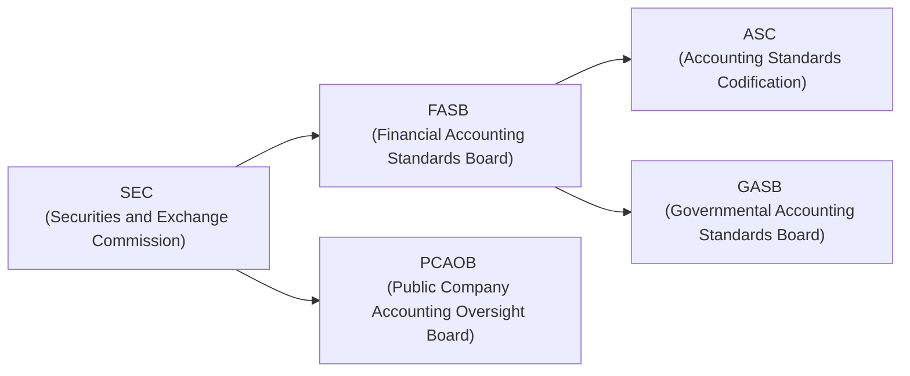

## 28.2 Industry and Regulatory Acronyms

Acronyms play an essential role in the business, finance, and accounting arenas. For professionals and learners alike, mastering these shorthand terms is crucial for effective communication, understanding technical guidance, and keeping pace with regulatory changes. This section provides a detailed reference for commonly encountered acronyms within the Business Analysis and Reporting (BAR) discipline. Along with their full forms, each acronym’s significance and potential applications in the accounting and financial fields are discussed. This topic is closely aligned with the overarching themes found in the preceding chapters of your BAR study guide, tying standard-setting bodies, financial compliance, and government regulations into a single, coherent resource.

Using these acronyms accurately can streamline your study process, enhance your exam performance, and strengthen your professional correspondence. Being able to interpret nuanced nuances—such as the difference between a standard and a codification—ensures clarity in applying authoritative guidance and analyzing financial data.

---

### The Value of Acronyms in Accounting and Reporting

Accounting and financial reporting are governed by numerous standards, regulations, and pronouncements. Whether referencing codifications (ASC), internationally recognized frameworks (IFRS), or governmental standards (GASB), each acronym reflects an established body of guidance. Acronyms also reduce the space required to cite specific sections in financial statements or business discussions, thereby improving efficiency. However, given their volume, staying organized and confident in your usage of acronyms can pose a challenge. This section can serve as a quick reference for clarifying acronyms, so you can focus on deeper analysis of financial topics without the confusion of deciphering specialized terms.

---

### Major Standard-Setting Boards and Oversight Bodies

#### FASB 
• Full Form: Financial Accounting Standards Board  
• Significance: FASB is the primary standard-setting organization for financial accounting standards for public and private entities in the United States. Their work results in the issuance of Accounting Standards Updates (ASUs) that amend the codification, ensuring timely guidance.  
• Relevance: FASB guidance is essential for preparing financial statements in conformity with Generally Accepted Accounting Principles (GAAP), which are mandatory for most U.S. corporations and are integral to financial analysis for BAR professionals.

#### GASB 
• Full Form: Governmental Accounting Standards Board  
• Significance: GASB is responsible for establishing accounting and financial reporting standards for state and local governmental entities within the U.S. It sets authoritative guidance that underpins government-wide financial statements, fund-based reporting, and more.  
• Relevance: Chapters 19 through 22 in this BAR guide detail how GASB standards shape budgets, debt administration, and financial disclosures in the public sector, making GASB references central to governmental accounting practice.

#### SEC 
• Full Form: Securities and Exchange Commission  
• Significance: The SEC enforces federal securities laws and oversees the U.S. securities markets, ensuring transparency and investor protection. It has ultimate authority over U.S. public companies’ financial disclosures and reporting.  
• Relevance: Public companies must file registration forms and periodic reports (such as 10-K and 10-Q) following SEC rules, vital for anyone analyzing corporate financial statements or preparing for advanced reporting scenarios.

#### PCAOB 
• Full Form: Public Company Accounting Oversight Board  
• Significance: PCAOB sets auditing standards for public companies in the United States and oversees the audits of broker-dealers to protect investors’ interests. It emerged from the Sarbanes-Oxley Act of 2002, which aimed to restore trust in the auditing profession.  
• Relevance: Knowledge of PCAOB standards is crucial for auditors and for professionals interpreting audit outcomes. BAR candidates benefit from understanding these standards to interpret external audit reports effectively.

#### AICPA 
• Full Form: American Institute of Certified Public Accountants  
• Significance: AICPA is the national professional organization of Certified Public Accountants in the U.S. It influences professional conduct, administers the Uniform CPA Examination, and provides guidance on private company audits and accounting standards.  
• Relevance: Since you’re taking the CPA exam, many references to study materials, ethical standards, and continuing education programs will come from the AICPA.

---

### Foundational Accounting Frameworks and Codifications

#### ASC 
• Full Form: Accounting Standards Codification  
• Significance: The ASC is the single source of authoritative U.S. GAAP for nongovernmental entities, published by the FASB. It reorganizes thousands of U.S. GAAP pronouncements into roughly 90 topics.  
• Relevance: Familiarity with codification topics and their numbering system (e.g., ASC 606 for revenue recognition) helps you navigate financial reporting requirements quickly and accurately—especially critical for the BAR exam.

#### GAAP 
• Full Form: Generally Accepted Accounting Principles  
• Significance: GAAP encompasses a set of accounting principles, standards, and procedures that companies must follow when compiling financial statements in the United States.  
• Relevance: GAAP is the foundation of all financial reporting tasks and a cornerstone concept for accountants, auditors, and analysts.

#### IFRS 
• Full Form: International Financial Reporting Standards  
• Significance: IFRS are internationally recognized accounting standards originally developed and now maintained by the International Accounting Standards Board (IASB). Many countries require or permit IFRS for publicly-traded companies, making these standards essential for global operations.  
• Relevance: Chapter 23 of this guide discusses key IFRS vs. U.S. GAAP differences—valuable knowledge for multinational business reporting and comparative financial statement analysis.

#### IASB 
• Full Form: International Accounting Standards Board  
• Significance: IASB is the independent body responsible for developing and issuing IFRS. Composed of global experts, the IASB continuously revises standards to keep pace with evolving economic realities.  
• Relevance: Advisable for candidates planning to work with multinational companies or aspiring to demonstrate cross-border accounting expertise.

---

### Additional Pronouncements and Committees

#### EITF 
• Full Form: Emerging Issues Task Force  
• Significance: The EITF assists the FASB by addressing emerging accounting issues swiftly, issuing consensus positions that become part of GAAP.  
• Relevance: EITF pronouncements help reduce diversity in practice. Being aware of current EITF topics ensures you’re up to date with the latest tricky areas in accounting.

#### IFRIC 
• Full Form: IFRS Interpretations Committee  
• Significance: IFRIC provides guidance on interpreting IFRS and resolves accounting issues with ambiguous or conflicting application. It ensures consistent global implementation of IFRS standards.  
• Relevance: For those dealing with multi-jurisdictional reporting or complex IFRS-based financials, IFRIC rulings are key to uniform application.

#### COSO 
• Full Form: Committee of Sponsoring Organizations  
• Significance: COSO offers widely-accepted frameworks for internal control (the COSO Internal Control—Integrated Framework) and enterprise risk management (ERM).  
• Relevance: COSO frameworks are frequently referenced in audits, risk assessment, and internal control design. BAR professionals handling management’s discussion and analysis (MD&A) or robust internal control evaluation rely on COSO guidance.

#### ERM 
• Full Form: Enterprise Risk Management  
• Significance: ERM stands for the broad approach to identifying, evaluating, and responding to risks that might affect an entity’s objectives. COSO’s ERM framework is considered a primary model.  
• Relevance: As described in Chapter 8, systematic risk assessment is integral to prospective financial analysis and budget planning, connecting risk management with strategic decision-making.

---

### Auditing and Review Services

#### SAS 
• Full Form: Statements on Auditing Standards  
• Significance: Issued by the AICPA Auditing Standards Board, SAS address the key rules for auditing nonpublic (private) entities’ financial statements in the U.S.  
• Relevance: Aligning financial information with SAS ensures reliability and credibility. Understanding SAS helps in analyzing or preparing private company audit reports, especially relevant if you consult for or operate within private entities.

#### SSARS 
• Full Form: Statements on Standards for Accounting and Review Services  
• Significance: Also issued by the AICPA, SSARS guidance dictates the procedures for compilations and reviews of financial statements for nonpublic companies.  
• Relevance: If you perform or review less extensive engagements than an audit, SSARS knowledge is vital. Many smaller organizations rely on these levels of service for financial reporting.

#### EDGAR 
• Full Form: Electronic Data Gathering, Analysis, and Retrieval  
• Significance: EDGAR is the SEC’s electronic filing system, where publicly traded companies submit their financial reports, registration statements, and other required documents.  
• Relevance: As a BAR professional, EDGAR’s database is a valuable resource to research real-world corporate disclosures, analyze competitor filings, and track historical data for ratio analysis and forecasting.

---

### Governmental Bodies and Financial System Regulators

#### FDIC 
• Full Form: Federal Deposit Insurance Corporation  
• Significance: The FDIC insures deposits at U.S. banks and thrift institutions, supervising financial institutions for safety and consumer protection.  
• Relevance: Analysts evaluating banks or shaping budgets in the financial sector need to understand FDIC guidelines and the effect on risk management, especially during economic downturns.

#### OCC 
• Full Form: Office of the Comptroller of the Currency  
• Significance: The OCC charters, regulates, and supervises all national banks and federal savings associations in the U.S.  
• Relevance: Banking regulations can significantly affect financial statement disclosures. Understanding OCC regulations helps in creating more robust risk analyses for lenders or financial institutions.

#### FRB 
• Full Form: Federal Reserve Board  
• Significance: The FRB sets monetary policy in the U.S., influencing interest rates, the money supply, and overall economic stability.  
• Relevance: Chapter 8 of this guide references market influences. FRB policies on rates can dramatically impact financing costs, demand, and budgeting decisions in multiple industries.

#### NCUA 
• Full Form: National Credit Union Administration  
• Significance: The NCUA regulates, charters, and supervises federal credit unions, similar to how the OCC oversees banks.  
• Relevance: Understanding specialized regulations for credit unions is necessary if you analyze or audit their financial statements, especially for local or niche markets.

---

### Digital Reporting and Business Processes

#### XBRL 
• Full Form: eXtensible Business Reporting Language  
• Significance: XBRL is an XML-based framework for the electronic communication of business and financial data, improving transparency and comparability.  
• Relevance: Public companies are required by the SEC to file financial reports in XBRL format. In Chapter 17, you’ll find more about how XBRL tags can streamline data analytics and expedite financial statement reviews.

#### RPA 
• Full Form: Robotic Process Automation  
• Significance: RPA refers to software “robots” or AI-led automation that performs repetitive tasks, especially in data entry, reconciliations, and routine data extraction.  
• Relevance: As covered in Chapter 3, RPA significantly reduces human error and improves efficiency in the accounting cycle. The synergy between XBRL and RPA can transform high-volume financial reporting processes.

---

### Real-World Applications: A Visual Overview

Below is a simplified Mermaid diagram to illustrate the relationship and hierarchy among major U.S. standard-setters, oversight bodies, and key codifications that shape the professional environment of BAR candidates:

• The SEC oversees public company disclosures and can influence FASB.  
• The PCAOB writes auditing standards for public companies.  
• FASB sets standards for private and public (within the SEC environment) U.S. companies.  
• GASB governs the public sector (state, local governments).  
• ASC houses the codified, authoritative guidance from FASB.

This pathway underscores how multiple bodies interact to form the regulatory environment. By understanding the distinctions and overlaps between these entities, BAR candidates can more effectively decode complex financial reporting standards.

---

### Practical Examples and Case Studies

1. Public Company Reporting Scenario  
   A large technology company preparing its annual 10-K might solely rely on ASC (from FASB) for revenue recognition (ASC 606) and intangible asset valuation (ASC 350/360) but also refer to SEC regulations for disclosures in Management’s Discussion and Analysis (MD&A). The external auditors will follow PCAOB standards.

2. Governmental Entity Reporting  
   A city preparing its Comprehensive Annual Financial Report (CAFR) uses GASB statements and engages an independent CPA firm whose audit procedures follow AICPA guidance for government audits. This work must conform to both GASB pronouncements and local regulations.  

3. Global Firm with IFRS  
   A multinational conglomerate that reports under IFRS needs to stay updated with any IFRIC interpretations to ensure compliant financial statements. The firm must reconcile significant IFRS-GAAP differences if it also lists securities in the U.S.

---

### Best Practices for Mastering Acronyms

• Keep a Personal “Glossary of Terms” Handy: This chapter can serve as a foundation. Tailor a personal reference document as you encounter additional acronyms, ensuring you note contexts and references to official guidance.  
• Cross-Reference with Official Pronouncements: Reviewing official websites such as fasb.org, gasb.org, sec.gov, ifrs.org, and aicpa.org helps confirm the accuracy and currency of your acronyms.  
• Embrace Mnemonics and Memory Aids: Devise rhymes or word associations (e.g., “FASB and GAAP go hand-in-hand”) to help retain new acronyms.  
• Practice with Real Filings: Skim through 10-Ks on EDGAR or Governmental CAFRs to see acronyms in real-world contexts. This bridges theoretical knowledge with practical application.  
• Evaluate Context Carefully: Do not assume an acronym always references the same entity. For instance, IFRS can refer to both the overall set of “International Financial Reporting Standards” or a specific IFRS standard like IFRS 9 for financial instruments. Context is key.

---

### Common Pitfalls and Challenges

• Overusing or Misusing Acronyms: Be mindful that excessive acronyms can hamper clarity, especially if multiple references appear consecutively in a document.  
• Confusing Governmental vs. Nongovernmental Standards: GASB (governmental) vs. FASB (private sector) differences require precise usage. Check fund-based vs. accrual-based references in your analysis.  
• Failing to Update References: Standards evolve, and so do acronyms (e.g., transferring from old “IAS” references to “IFRS”). Keep track of new guidance and replaced references.  
• Overlooking IFRIC/EITF Clarifications: Some changes in interpretation might not be recorded in the main body of IFRS or GAAP immediately; following interpretation committees helps refine best practices.

---

### Encouraging Critical Thinking

While memorizing acronyms can make you proficient in referencing rules, the ultimate goal is building a comprehensive understanding of the standards behind them. Ask yourself what problem each regulatory body aims to address, and how their guidance ensures transparency, comparability, and reliability of financial reports. This approach fosters deep learning, well beyond the rote memorization of acronyms.

---

### References for Further Exploration

• FASB Official Website (https://www.fasb.org)  
• GASB Official Website (https://www.gasb.org)  
• IFRS Foundation (https://www.ifrs.org)  
• SEC EDGAR Database (https://www.sec.gov/edgar.shtml)  
• PCAOB Standards and Guidance (https://pcaobus.org)

Many recognized accounting programs and online resources also offer micro-courses focusing on navigating the codification and IFRS platforms. These resources reinforce your comprehension of acronyms and accelerate your mastery of advanced financial reporting.

---

## Master Your Acronyms: Essential CPA BAR Quiz



### Which of the following organizations is primarily responsible for establishing financial accounting and reporting standards for U.S. state and local governments?

- [ ] FASB
- [ ] SEC
- [x] GASB
- [ ] PCAOB

> **Explanation:** GASB (Governmental Accounting Standards Board) develops GAAP for U.S. state and local governments, ensuring transparency and consistency in public sector reporting.

### What does “ASC” stand for in U.S. GAAP?

- [x] Accounting Standards Codification
- [ ] Auditing Standards Committee
- [ ] Authorized Statement on Compliance
- [ ] Accounting Security Commission

> **Explanation:** ASC is the Accounting Standards Codification, the official compilation of U.S. GAAP maintained by the FASB.

### Which acronym refers to the body that oversees the audits of public companies?

- [ ] AICPA
- [ ] COSO
- [x] PCAOB
- [ ] IRA

> **Explanation:** The Public Company Accounting Oversight Board (PCAOB) sets standards for and supervises the audits of public companies to protect investors’ interests.

### IFRS stands for:

- [x] International Financial Reporting Standards
- [ ] International Financial Risk Standards
- [ ] Institutional Framework for Regulatory Systems
- [ ] International Forum for Risk Strategy

> **Explanation:** IFRS (International Financial Reporting Standards) guide financial reporting globally under the purview of the IASB.

### Which organization is known for proposing frameworks such as the Integrated Internal Control Framework and ERM?

- [x] COSO
- [ ] EITF
- [x] Committee of Sponsoring Organizations
- [ ] IFRIC

> **Explanation:** COSO, or Committee of Sponsoring Organizations, publishes internal control and ERM frameworks widely used to manage and assess enterprise risk.

### Which of the following pairs focuses on interpreting emerging or unclear accounting guidance?

- [x] EITF and IFRIC
- [ ] FASB and IASB
- [ ] GASB and AICPA
- [ ] SEC and PCAOB

> **Explanation:** Both EITF (Emerging Issues Task Force) under FASB and IFRIC (IFRS Interpretations Committee) under IASB offer clarifications on intricate or ambiguous accounting issues.

### EDGAR is best described as:

- [x] The SEC’s electronic filing database
- [ ] A specialized government fund
- [x] A system for retrieving corporate disclosures
- [ ] A private clearinghouse for credit information

> **Explanation:** EDGAR (Electronic Data Gathering, Analysis, and Retrieval) is the SEC’s electronic system that stores filings, annual reports, and other corporate disclosures for public review.

### Which regulator was formed as a result of the Sarbanes-Oxley Act of 2002?

- [ ] FASB
- [x] PCAOB
- [ ] IFRS
- [ ] GASB

> **Explanation:** The Public Company Accounting Oversight Board was established by the Sarbanes-Oxley Act to strengthen corporate governance and public audits.

### RPA in an accounting context refers to:

- [x] Robotic Process Automation
- [ ] Regulatory Public Audits
- [ ] Regularized Procedure Assessment
- [ ] Real-Time Predictive Analytics

> **Explanation:** Robotic Process Automation (RPA) automates repetitive tasks in accounting workflows, improving efficiency and accuracy in data processing.

### A key difference between FASB and GASB is that GASB:

- [x] Issues standards for state and local governments
- [ ] Oversees publicly traded companies
- [ ] Administers the CPA Exam
- [ ] Manages enforcement of IFRS globally

> **Explanation:** GASB sets financial reporting standards specifically for U.S. governmental entities, while FASB focuses on guidance for private-sector entities and nonprofits.



---

## For Additional Practice and Deeper Preparation

### [Business Analysis and Reporting (BAR) CPA Mock Exams](https://www.udemy.com/course/bar-cpa-mock-exams/?referralCode=ADBE2E84BEE9CB6243CA)

**Business Analysis and Reporting (BAR) CPA Mocks:** 6 Full (1,500 Qs), Harder Than Real! In-Depth & Clear. Crush With Confidence!

- Tackle full-length mock exams designed to mirror real BAR questions.  
- Refine your exam-day strategies with detailed, step-by-step solutions for every scenario.  
- Explore in-depth rationales that reinforce higher-level concepts, giving you an edge on test day.  
- Boost confidence and minimize anxiety by mastering every corner of the BAR blueprint.  
- Perfect for those seeking exceptionally hard mocks and real-world readiness.  

_Disclaimer: This course is not endorsed by or affiliated with the AICPA, NASBA, or any official CPA Examination authority. All content is for educational and preparatory purposes only._
