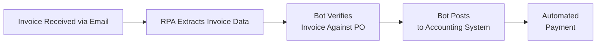
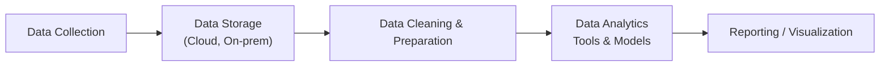

## 28.3 Digital and Tech-Driven Terminology

Technology continues to reshape the landscape of accounting and business analysis, making it crucial for modern CPAs to understand a rapidly expanding set of digital terms. By integrating technical knowledge with financial expertise, professionals can leverage new tools and processes for efficiency, accuracy, and strategic insight. This section highlights essential digital and tech-driven terminology with a direct bearing on financial reporting, audit, business analysis, and overall accounting processes. Cross-reference concepts from Chapter 3: Data and Analytics for deeper context.

### Technology’s Impact on Accounting and Reporting
Modern financial professionals increasingly rely on emerging technologies—ranging from automation solutions to machine learning algorithms—to streamline workflows, analyze vast datasets, and produce timely insights. CPAs who understand and harness these digital tools are better equipped to address complex business scenarios, identify inconsistencies, and proactively manage risks.

Below, we explore the most commonly referenced digital and technology-related terms in accounting and finance. Each definition emphasizes practical use cases, best practices, potential pitfalls, and the strategic value for CPAs in both public and corporate environments.

---

### Artificial Intelligence (AI)

Artificial Intelligence (AI) refers to computer systems designed to perform tasks commonly associated with human cognition—such as learning, problem-solving, and decision-making. AI capabilities often extend to predictive analytics and natural language processing (NLP). Within accounting, AI-driven applications can:

• Automate Data Entry and Classification: Algorithms can be trained to accurately categorize transactions based on text descriptions or vendor information.  
• Detect Fraud and Irregularities: Pattern recognition in large datasets helps uncover anomalies in real time.  
• Generate Predictive Insights: Forecast future trends in revenue, expenses, or other key performance indicators (KPIs).  

From a BAR perspective, AI augments the accountant’s skill set by providing more timely and accurate information for decision-making. For example, an AI model might identify unusual journal entries in real time, giving CPAs the chance to investigate transactions that could lead to material misstatements of financial results.

A basic example of a statistical measure for AI-driven forecasting is the Mean Squared Error (MSE):


\text{MSE} = \frac{1}{n} \sum_{i=1}^{n} (y_i - \hat{y}_i)^2
  

where yᵢ is the actual value and ŷᵢ is the predicted value at observation i. Financial analysts use MSE to evaluate the predictive performance of an AI model in forecasting revenue, cash flows, or expense line items.

---

### Robotic Process Automation (RPA)

Robotic Process Automation (RPA) involves using software “bots” to execute routine, repetitive tasks across different applications. These tasks typically include data entry, reconciliations, and report generation—all crucial for month-end closes or compliance reporting. RPA’s primary advantages:

• Enhanced Efficiency: Bots run 24/7, reducing manual delays.  
• Error Reduction: Eliminates human error for standardized tasks that require high accuracy.  
• Cost Savings: Allows accounting staff to focus on higher-value analytical tasks rather than clerical duties.  

Within an accounts payable process, for instance, an RPA bot can extract invoice data from emails or a vendor portal, match details to purchase orders in the accounting system, and archive supporting documents automatically. This fosters shorter close cycles and improved data reliability.

Below is a simple Mermaid diagram illustrating how RPA can be integrated into a typical accounts payable cycle:

“Flowchart 1: RPA integration in the accounts payable cycle”

---

### Internet of Things (IoT)

The Internet of Things (IoT) refers to interconnected devices—ranging from sensors and smartphones to embedded industrial machines—that gather, exchange, and analyze data. Within the realm of accounting and financial reporting, IoT can facilitate:

• Real-Time Inventory Tracking: Machinery sensors in a manufacturing plant update inventory records automatically.  
• Asset Utilization and Depreciation Insights: Sensors track usage hours, enabling more accurate depreciation estimates.  
• Compliance and Monitoring: Organizations can set alarms or triggers for unauthorized usage of equipment, reducing compliance risks.  

For managerial accountants, IoT-driven data offers opportunities to refine product costing by closely monitoring direct labor hours, machine hours, and overhead allocation based on real-time conditions. This convergence of data from physical machines into the accounting system allows more accurate cost estimates and operational insights (see Chapter 5: Managerial and Cost Accounting Essentials for cost allocation discussions).

---

### Blockchain and Distributed Ledgers

A blockchain is a decentralized, cryptographically secured database (or ledger) maintained by multiple participants without a central authority. Each transaction is bundled into “blocks” that are chronologically linked. In accounting and auditing, blockchain technology can:

• Improve Transaction Transparency: Multiple parties can corroborate the integrity of a transaction in real time.  
• Automate Contract Execution: Smart contracts can automatically enforce terms (e.g., payment release upon shipment).  
• Provide Immutable Records: Hard-to-tamper transactions build trust among entities.  

The potential advantage is a single source of truth that can reduce the need for reconciliations and manual checks. However, accountants must still evaluate internal controls (Chapter 8 references COSO ERM) and ensure that off-chain events (like physically shipping goods) align with on-chain data.

---

### Cloud Computing

Cloud computing involves delivering computing resources—servers, storage, databases, networking, software—over the internet on a pay-as-you-go basis. In accounting, popular cloud-based services include:

• Software as a Service (SaaS): Subscription-based financial or ERP systems (for instance, QuickBooks Online, NetSuite, or SAP) that eliminate the need for expensive on-premise installations.  
• Infrastructure as a Service (IaaS): Outsourcing hardware maintenance to providers like Amazon Web Services or Microsoft Azure, offering scalable and flexible resources for data-intensive tasks.  
• Platform as a Service (PaaS): Development and deployment platforms that allow businesses to build custom financial applications without managing the underlying infrastructure.  

Financial professionals increasingly rely on cloud computing for real-time data sharing, global collaboration, and advanced analytics. From a risk management viewpoint, cloud providers typically have robust security protocols, but accountants must understand data privacy regulations and ensure compliance with relevant guidelines (Sarbanes-Oxley, GDPR, etc.).

---

### Data Analytics and Big Data

“Big Data” refers to datasets too large or complex for traditional data-processing tools. When harnessed properly, big data provides deep insights into customer behaviors, operational efficiencies, and potential market opportunities. Data analytics within accounting can improve:

• Budgeting and Forecasting: Large volumes of historical and econometric data can feed machine learning models for scenario analysis.  
• Fraud Detection: Outlier detection algorithms sift through transactional data for unexpected patterns.  
• Key Performance Indicators (KPIs): Assessing profitability by product line, region, or sales channel in real time.  

Below is a simplified illustration of a data analytics pipeline that shows how accountants can move from raw data to meaningful insights:

“Flowchart 2: Example of a typical data analytics pipeline”

Walking through large datasets to identify trends, CPAs can provide actionable analysis for management—an ability sometimes called the “modern CFO toolkit.”

---

### Data Visualization Tools

Data visualization tools such as Tableau, Power BI, and Qlik help convert raw data into meaningful charts, graphs, and dashboards. For financial professionals, effective data visualization:

• Enhances Stakeholder Engagement: Presents financial metrics in easily digestible formats for quick executive decisions.  
• Allows Dynamic Drill-Down: Users can move from a high-level KPI into granular transaction data.  
• Facilitates Real-Time Monitoring: Dashboards update automatically, providing continuous insight into performance.  

A strong visualization skillset reduces the gap between data and decision by clarifying complex relationships such as cost-volume-profit or segment profitability. Integrating visuals into board presentations, investor communications, or internal management reports can elevate the clarity and persuasiveness of financial conclusions (see Chapter 4: Financial Statement Analysis for ratio and trend interpretation).

---

### Data Governance and Security

Data governance outlines the policies, processes, and accountability mechanisms that ensure data accuracy, consistency, and security throughout its lifecycle. For CPAs, key considerations:

• Access Controls: Restricting sensitive financial data to authorized personnel.  
• Audit Trails: Maintaining logs that track data changes, crucial for Sarbanes-Oxley compliance.  
• Regulatory Compliance: Aligning with privacy directives such as GDPR or consumer protection laws.  

With expanding data volumes and the integration of multiple systems, strong governance practices reduce risk and enhance reliability in financial statements. Security protocols—like encryption or multi-factor authentication—serve as essential layers of protection for financial data, especially in cloud environments.

---

### Natural Language Processing (NLP)

Natural Language Processing (NLP) is a branch of AI focusing on the interaction between human language and computer systems. In an accounting context:

• Document Analysis: NLP can scan contracts, invoices, or text-based records to extract key data fields.  
• Chatbots: Accounting firms develop question-and-answer systems to handle basic client inquiries, such as how to retrieve lost invoices or interpret expense thresholds.  
• Sentiment Analysis: Public accountants can examine social media or press releases to gauge market sentiment on a client’s performance, identifying broader reputational risks that may affect valuations or revenue forecasts.  

Given the text-heavy nature of financial documents, NLP can significantly streamline audit procedures by identifying relevant clauses in large contract datasets (see Chapter 12: Revenue Recognition for contract analysis).

---

### Machine Learning vs. Deep Learning

Machine Learning (ML) is a broad field encompassing algorithms that allow systems to learn patterns from data. Deep Learning (DL) is a subfield of ML that uses neural networks with multiple hidden layers to model complex relationships. While ML methods such as linear regression or decision trees are widely used for financial statement modeling, deep learning can tackle more intricate tasks like:

• Image Recognition: Might be relevant for automated expense verification using OCR (optical character recognition).  
• Speech Processing: Transcribing and analyzing financial calls, investor updates, or committee meetings.  

Deep learning solutions are typically resource-intensive, requiring substantial volumes of training data. CPAs who grasp the fundamentals of how these algorithms function can better evaluate reliability, glean insights from outputs, and challenge model assumptions.

---

### Cybersecurity

Cybersecurity encompasses measures—technology, processes, and controls—designed to protect networks, devices, programs, and data from attack, damage, or unauthorized access. As accountants handle sensitive financial data, cybersecurity breaches can lead to:

• Data Manipulation: Potentially causing inaccurate financial reporting.  
• Reputational Harm: Eroding stakeholder trust in a company’s financial statements.  
• Regulatory Penalties: Failure to comply with regulations can trigger audits, fines, or lawsuits.  

Proficiency in cybersecurity best practices is essential for CPAs to collaborate effectively with IT teams, especially when designing or monitoring internal controls over financial systems.

---

### Predictive vs. Prescriptive Analytics

• Predictive Analytics leverages historical data and statistical algorithms (including AI) to forecast future events or behaviors. In a BAR context, predicting future sales volume or receivables collectability can shape revenue accruals and reserve estimates.  
• Prescriptive Analytics goes a step further by suggesting actions or strategies to obtain a desired outcome—often incorporating optimization methods to weigh different scenarios (e.g., cost minimization, ROI maximization).

As these analytics frameworks evolve, financial professionals who understand them can help guide strategic business decisions, beyond traditional historical-based reporting.

---

### Virtual and Augmented Reality (VR/AR)

While less common in mainstream accounting, Virtual Reality (VR) and Augmented Reality (AR) are emerging in specialized areas:

• Remote Audits: AR could help auditors virtually inspect physical inventory or fixed assets at remote client locations.  
• Training and Onboarding: VR-based simulations prepare new staff for complex audit procedures, especially in specialized industries.  

Though still nascent, these technologies may become more relevant as remote work and global collaboration continue to expand.

---

### Best Practices for Leveraging Tech-Driven Solutions

• Maintain Continuous Learning: Stay updated with new software releases, frameworks, or relevant coding languages.  
• Collaborate with IT & Data Specialists: Ensure proper system integration and data architecture.  
• Validate Model Outputs: Regardless of the automation or intelligence level, accountants must exercise professional skepticism (see Chapter 6: Non-GAAP Measures).  
• Manage Change: Adopt a structured approach when introducing new technology. Communicate benefits, provide training, and anticipate user adoption barriers.  

Modern CPAs remain ultimately responsible for data integrity, compliance, and interpretive insights conveyed through financial reports. Technology can automate tasks and enhance analysis, but cannot replace the need for sound professional judgment.

---

### Common Pitfalls and Challenges

• Overreliance on Automation: Blindly trusting AI or RPA outputs can lead to material misstatements if input data is flawed.  
• Data Silos: Inconsistent data structures across departments can impede the effectiveness of analytics tools.  
• Hidden Costs: Migrating to cloud services or implementing large-scale automation may require extensive setup and ongoing subscription costs.  
• Lack of Governance: Poorly managed data can create compliance risks, especially with evolving privacy laws.  

Balancing opportunities and risks is essential. CPAs should conduct thorough cost-benefit analyses to decide when, where, and how to deploy specific technologies.

---

### Real-World Example: AI-Driven Expense Approval

A mid-sized tech company implements an AI tool to process and approve employee expense reports. The system extracts data from digital receipts and cross-references each expense with company policy. Suspicious entries (e.g., out-of-range amounts or repeated vendor usage) are flagged for manual review by management. Accounts payable staff, previously tasked with combing through each report, now focus on anomalies and vendor negotiations. The end result is a more streamlined process, better compliance, and improved spend analysis across the organization.

---

### References for Further Exploration

• AICPA’s “Audit Analytics and Technology” guidance  
• Gartner’s Emerging Tech Research on AI, RPA, and Data Analytics Platforms  
• ISACA’s “Blockchain Framework and Guidance”  
• CPA Canada’s “Audit Data Analytics Guide”  
• IFRS Foundation’s resources on digital reporting  
• COSO’s “Enterprise Risk Management” (ERM) framework  

Continue exploring these topics in conjunction with Chapters 3 (Data and Analytics), 5 (Managerial and Cost Accounting Essentials), and related content within Part II: Business Analysis.

---

## Master the Fundamentals of Tech: Digital Terminology Quiz



### Which of the following best describes Artificial Intelligence (AI) in an accounting context?

- [ ] A static rule-based system that executes predefined instructions.  
- [x] Systems designed to learn, predict, and make decisions using data.  
- [ ] A collection of hardware components that automate supply chain logistics.  
- [ ] An encrypted ledger for storing transaction data.  

> **Explanation:** AI uses advanced algorithms to learn from data and make adaptive predictions or decisions, setting it apart from simple rule-based automation solutions.

### Which technology primarily uses software “bots” to automate repetitive, rule-based tasks?

- [ ] Machine Learning  
- [ ] Blockchain  
- [ ] Internet of Things (IoT)  
- [x] Robotic Process Automation (RPA)  

> **Explanation:** RPA helps streamline tasks like data entry, reconciliations, and report generation by delegating them to software bots.

### One potential risk of relying too heavily on AI models for financial forecasting is:

- [x] The AI’s outputs might be trusted without proper validation.  
- [ ] Having to manually re-key every single transaction.  
- [ ] Inability to handle large datasets.  
- [ ] Making audits impossible to perform.  

> **Explanation:** AI-based forecasts must still undergo validation and verification to ensure accuracy; blind reliance can result in significant misstatements.

### What is the main advantage of using IoT in manufacturing cost accounting?

- [ ] It eliminates the need for managerial accountants entirely.  
- [ ] It restricts real-time data flow, reducing overhead.  
- [x] It provides real-time machine usage data for more accurate cost allocation.  
- [ ] It complicates inventory tracking processes.  

> **Explanation:** IoT sensors in manufacturing enable real-time tracking of machine hours and resource usage, improving direct cost allocation accuracy.

### Which statement about blockchain technology is correct?

- [x] Blockchain provides a decentralized ledger of transactions that is difficult to tamper with.  
- [ ] Blockchain is exclusively for stock-based compensation transactions.  
- [x] Blockchain replaces IFRS with cryptocurrency accounting rules.  
- [ ] Blockchain cannot incorporate smart contracts.  

> **Explanation:** Blockchain is a decentralized ledger known for its cryptographic security and tamper resistance. One of its common applications involves the use of smart contracts.

### Cloud computing typically offers the following benefit:

- [x] On-demand scalability without needing physical server installations.  
- [ ] Complete immunity to any form of cybersecurity threat.  
- [ ] The elimination of regulatory compliance for financial data.  
- [ ] Unrestricted public visibility into financial archives.  

> **Explanation:** Cloud technology allows organizations to scale resources as needed, paying for only the storage and processing they require.

### Which function is NOT typically associated with a data visualization tool?

- [ ] Converting complex data sets into interactive graphs or dashboards.  
- [x] Automatically preparing year-end adjusting entries.  
- [ ] Offering dynamic drill-down for in-depth analysis.  
- [x] Integrating real-time performance monitoring.  

> **Explanation:** While data visualization tools excel at displaying and analyzing information in real time, they typically do not create or post accounting entries on their own.

### NLP (Natural Language Processing) can help auditors by:

- [ ] Replacing all internal review steps.  
- [ ] Developing physical inventory counts.  
- [x] Scanning large volumes of contracts to extract key terms automatically.  
- [ ] Eliminating the need for any human oversight in audits.  

> **Explanation:** NLP can efficiently search digital documents (e.g., contracts, policy documents) for relevant clauses or discrepancies, aiding auditors.

### A primary concern for CPAs when implementing new tech solutions is:

- [x] Data governance and security.  
- [ ] Overly flexible budgeting and forecasting.  
- [ ] Complete manual data re-entry.  
- [ ] Guaranteed exemption from all audits.  

> **Explanation:** Ensuring proper data governance and security helps maintain data integrity and regulatory compliance, which is a critical concern for CPAs.

### True or False: Machine Learning (ML) focuses on building algorithms that learn patterns from data, while Deep Learning (DL) is a subfield of ML utilizing multi-layered neural networks.

- [x] True  
- [ ] False  

> **Explanation:** Deep Learning is indeed a specific subset of ML that employs neural networks for more complex tasks, such as image recognition and speech processing.



---

## For Additional Practice and Deeper Preparation

### [Business Analysis and Reporting (BAR) CPA Mock Exams](https://www.udemy.com/course/bar-cpa-mock-exams/?referralCode=ADBE2E84BEE9CB6243CA)

**Business Analysis and Reporting (BAR) CPA Mocks:** 6 Full (1,500 Qs), Harder Than Real! In-Depth & Clear. Crush With Confidence!

- Tackle full-length mock exams designed to mirror real BAR questions.  
- Refine your exam-day strategies with detailed, step-by-step solutions for every scenario.  
- Explore in-depth rationales that reinforce higher-level concepts, giving you an edge on test day.  
- Boost confidence and minimize anxiety by mastering every corner of the BAR blueprint.  
- Perfect for those seeking exceptionally hard mocks and real-world readiness.  

_Disclaimer: This course is not endorsed by or affiliated with the AICPA, NASBA, or any official CPA Examination authority. All content is for educational and preparatory purposes only._
