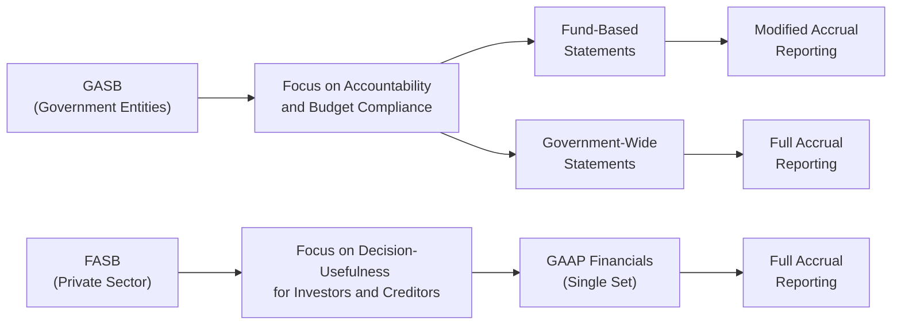

## 28.4 GASB vs. FASB Notable Contrasts

Understanding the differences between the Governmental Accounting Standards Board (GASB) and the Financial Accounting Standards Board (FASB) is crucial for any accounting professional preparing for the Business Analysis and Reporting (BAR) section of the Uniform CPA Examination. While both boards aim to enhance the clarity, consistency, and transparency of financial reporting, their standards cater to different types of entities—governmental organizations for GASB, and private- or public-sector (non-governmental) organizations for FASB. These differences influence everything from conceptual frameworks to specific accounting treatments. This section outlines key contrasts, referencing common areas of divergence, and highlights relevant statements to deepen your analytical and reporting skills.

--------------------------------------------------------------------------------
  
### Overview of GASB vs. FASB

GASB governs accounting and financial reporting for state and local governments within the United States. Its standards focus on accountability, budgetary compliance, and “public stewardship” of resources. FASB, on the other hand, sets accounting standards for private entities, encompassing for-profit corporations and not-for-profit organizations (excluding governmental not-for-profits). Its conceptual framework prioritizes decision-usefulness for investors, creditors, and other stakeholders primarily interested in economic performance and financial position.

Both GASB and FASB operate under the Financial Accounting Foundation (FAF), which provides oversight and appoints board members. However, each board has its distinct mission and conceptual framework to guide how standards are proposed, developed, and implemented.

--------------------------------------------------------------------------------

### Conceptual Framework Differences

• Objectives of Financial Reporting
  – **GASB**: Emphasizes accountability and interperiod equity, focusing on how public resources are raised and used in providing services. GASB Statement No. 1 underscores the role of financial statements in demonstrating compliance with legislated budgets.  
  – **FASB**: Aims primarily to provide information useful in making investment, credit, and other economic decisions. FASB’s Statement of Financial Accounting Concepts (SFAC) No. 8 highlights the importance of valuation relevance and faithful representation for investors and creditors.

• Reporting Entity Considerations
  – **GASB**: Centers on the concept of primary governments and component units, reflecting the variety of services performed by a governmental entity.   
  – **FASB**: Focuses on controlling financial interests, variable interest entities (VIEs), and consolidated financial statements under ASC 810.

• User Needs
  – **GASB**: Public constituents, legislators, creditors (e.g., bondholders), and oversight bodies prioritize budget compliance, resource constraints, and service efforts.  
  – **FASB**: Equity shareholders, institutional investors, analysts, and creditors are interested in financial performance, earnings, cash flows, and governance.

--------------------------------------------------------------------------------

### Measurement Focus and Basis of Accounting

A crucial distinction between GASB and FASB emerges in the measurement focus and basis of accounting. Governmental entities must produce two categories of financial statements:

1. **Government-Wide Statements** (Full Accrual)  
   – Utilize an economic resources measurement focus, similar to FASB, where all assets and liabilities are reported.

2. **Fund-Based Statements** (Modified Accrual for Governmental Funds)  
   – Recognize revenues when they become measurable and available. Expenditures typically recorded when liabilities are incurred.

By contrast, **FASB requires full accrual** basis accounting for all for-profit entities, with revenue recognized when earned and expenses when incurred. Not-for-profit entities under FASB do not use modified accrual; they adhere to accrual-based guidance with specialized classifications (e.g., net assets with donor restrictions vs. without donor restrictions).

--------------------------------------------------------------------------------

### Side-by-Side Comparison of Typical Items

To highlight the contrasts, the following table compares selected items under GASB vs. FASB standards, citing relevant pronouncements.

| **Accounting Area**                  | **GASB Guidance**                                                                                                             | **FASB Guidance**                                                                                                             |
|--------------------------------------|-------------------------------------------------------------------------------------------------------------------------------|-------------------------------------------------------------------------------------------------------------------------------|
| **Financial Statements**             | GASB Statement No. 34 – Government-Wide Statements & Fund Financial Statements                                              | FASB Concepts and ASC 205 (Presentation of Financial Statements)                                                              |
| **Capital Assets**                   | GASB Statement No. 34 and GASB 51 (for intangible assets)                                                                     | FASB ASC 360 (Property, Plant, and Equipment) and ASC 350 (Intangibles – Goodwill and Other)                                  |
| **Pensions**                         | GASB 67 (Plans) and GASB 68 (Employers) – Net Pension Liability; GASB 73, GASB 75 for OPEB                                   | FASB ASC 715 (Compensation – Retirement Benefits)                                                                             |
| **Revenue Recognition**              | GASB 33 (Accounting and Financial Reporting for Nonexchange Transactions) and other specialized guidance                     | FASB ASC 606 (Revenue from Contracts with Customers)                                                                         |
| **Derivative Instruments**           | GASB 53 (Accounting and Financial Reporting for Derivative Instruments)                                                      | FASB ASC 815 (Derivatives and Hedging)                                                                                       |
| **Net Position vs. Net Assets**      | Net position is used in government-wide statements (restricted, unrestricted, net investment in capital assets)              | Net assets (stockholders’ equity in for-profit entities, net assets in not-for-profit entities)                               |
| **Fund Balance Classifications**     | Nonspendable, restricted, committed, assigned, unassigned (GASB 54)                                                          | Not applicable to for-profit entities; not-for-profits follow ASC 958 (net assets with/without donor restrictions)            |
| **Lease Accounting**                 | GASB 87 for leases (recognizes intangible right-to-use asset)                                                                | FASB ASC 842 for leases                                                                                                       |
| **Component Units & VIEs**          | GASB 14, 39, 61, 80, 90 for blended/discrete component units                                                                 | FASB ASC 810 (Consolidations), including VIE guidance                                                                        |

--------------------------------------------------------------------------------

### Financial Statement Presentation

Under GASB standards, governmental entities prepare both government-wide financial statements (similar to corporate accrual accounting) and fund-based statements designed to capture specific activities (governmental, proprietary, and fiduciary funds). Each of these statements serves a unique purpose:

• **Government-Wide Financial Statements**  
  – Present a long-term, overall view of the government’s financial position.  
  – Consist of the Statement of Net Position and Statement of Activities, focusing on the economic resources measurement and full accrual basis.

• **Fund Financial Statements**  
  – Separate resources into different accounting funds (e.g., General Fund, Special Revenue Fund).  
  – Track inflows/outflows of current financial resources (modified accrual for governmental funds).  

In contrast, **FASB standards** require all business entities to prepare a **single set of general-purpose financial statements** on an accrual basis:

• **Statement of Financial Position** (Balance Sheet)  
• **Statement of Comprehensive Income** (Income Statement plus Other Comprehensive Income)  
• **Statement of Cash Flows**  
• **Statement of Changes in Shareholders’ Equity** (or Net Assets for not-for-profits)  

Not-for-profit organizations also follow **ASC 958**, which emphasizes net assets classification (with donor restrictions vs. without donor restrictions), but they do not prepare separate governmental fund statements.

--------------------------------------------------------------------------------

### Focus on Accountability vs. Decision-Usefulness

**GASB** focuses on public accountability:  
• Emphasizes whether resources were raised and used according to legal or budgetary mandates.  
• Demonstrates whether current-year revenues can cover current-year expenses or if past/current actions shift financial burdens to future taxpayers.  
• Is vital for evaluating compliance with state or municipal charters, bond covenants, and voter-approved initiatives.

**FASB** focuses on decision-usefulness for capital providers:  
• Highlights earnings, cash flows, and changes in equity for investors and creditors.  
• Guides investment, lending, and other resource allocation decisions based on financial performance and risk evaluation.  
• Encourages uniform performance metrics across industries, allowing comparability for shareholder and creditor analysis.

--------------------------------------------------------------------------------

### Practical Example: Intangible Assets in Government vs. Private Sector

Consider a municipality investing in specialized environmental software to manage water treatment data:

• **GASB**:  
  – Relevant standard: GASB Statement No. 51 (Accounting and Financial Reporting for Intangible Assets).  
  – If the municipality develops software internally, certain development phase costs may be capitalized; research and preliminary stage costs are expensed.  
  – Post-implementation/operation costs are typically expensed unless they extend the useful life or functionality significantly.  
  – The software value appears in the Statement of Net Position under capital assets or intangible assets, net of accumulated amortization.

• **FASB**:  
  – Relevant standard: ASC 350 (Intangibles – Goodwill and Other) and ASC 985 for software.  
  – Internally developed software costs in the application development stage may be capitalized; ongoing maintenance is expensed.  
  – Additional complexities arise for software as a service (SaaS), where intangible asset recognition may differ.  
  – The intangible asset is reported on the Balance Sheet at cost, net of amortization or impairment losses.

In both cases, the core principle (capitalizing certain development costs for software) is similar, but the nature of disclosures, classification, and the overarching framework differ based on the GASB vs. FASB environment.

--------------------------------------------------------------------------------

### Example: Pension and OPEB Accounting

Public pension plans often loom large in state and local government financial statements. Under GASB:

• **GASB 68 (Employers)** and **GASB 67 (Plans)** define the Net Pension Liability as the difference between the total pension liability and the plan’s net assets.  
• Government-wide statements require recognition of the net pension liability on the Statement of Net Position.  
• Expenses are allocated systematically to reflect service cost, interest on the liability, and changes in plan fiduciary net position.

Under **FASB ASC 715**, an employer’s pension obligations are reported based on the projected benefit obligation (PBO). Differences exist in how changes in assumptions or actuarial gains/losses are recognized in Other Comprehensive Income (OCI). For not-for-profit organizations under FASB, similar rules apply, but OCI may be referred to as changes in net assets without donor restrictions.

--------------------------------------------------------------------------------

### Derivatives Accounting Contrasts

• **GASB 53**:  
  – Governmental entities record derivative instruments at fair value.  
  – The focus is on hedge effectiveness with changes reported as deferred outflows/inflows if the derivative is deemed an effective hedge under GASB’s criteria.  
  – If ineffective, changes in fair value flow through the Statement of Activities.

• **FASB ASC 815**:  
  – Entities record derivatives at fair value, with changes recognized in earnings or OCI, based on the nature of hedges (fair value hedge, cash flow hedge, net investment hedge).  
  – Hedge accounting is contingent on meeting strict criteria, including documentation and ongoing effectiveness testing.  

Though the principles overlap, the classification of deferred outflows/inflows under GASB diverges from FASB’s reliance on OCI for certain hedging relationships.

--------------------------------------------------------------------------------

### Diagram: High-Level Comparison of GASB vs. FASB

Below is a simplified Mermaid flowchart illustrating the core differences in reporting emphasis:

• **Left Branch (GASB)**: Emphasizes both fund-based and government-wide statements, with modified accrual in governmental funds and full accrual in government-wide financials.  
• **Right Branch (FASB)**: Primarily focuses on a single set of full accrual financial statements for all private enterprises and not-for-profits.

--------------------------------------------------------------------------------

### Common Pitfalls and Challenges in Comparing GASB and FASB

1. **Misapplication of Fund Accounting**: Students often confuse fund-based statements with standard accrual reporting. Remember that only GASB standards require modified accrual accounting for certain funds, whereas FASB never does.  
2. **Disclosures Around Public Stewardship**: GASB calls for additional accountability disclosures, including budget-to-actual comparisons, which are foreign in FASB-based statements.  
3. **Classification of Net Assets**: Governmental entities use the term “net position” with specific restrictions, while FASB references “net assets” or “equity.”  
4. **Overlap in Pension and OPEB**: Both have net liability concepts, but the measurement, presentation, and disclosure details differ, leading to confusion if one tries to apply private-sector rules to public entities or vice versa.  
5. **Timing of Revenue Recognition**: Under GASB, nonexchange transactions (taxes, grants) may be recognized differently compared to typical exchange transactions in FASB-based entities, especially regarding availability periods.  
6. **Lease Accounting Classifications**: GASB 87 and FASB ASC 842 share many conceptual underpinnings but differ in terminology and certain application thresholds.

--------------------------------------------------------------------------------

### Best Practices for BAR Candidates

• **Stay Focused on Entity Type**: Ensure you correctly identify whether an entity is subject to GASB or FASB. The correct standard application hinges on the nature of the entity (government vs. private/not-for-profit).  
• **Leverage Summaries and Flowcharts**: Summaries of standards can help keep critical differences at your fingertips. Flowcharts allow you to visualize which standards apply to which types of transactions.  
• **Review Official Pronouncements**: For deeper knowledge, consult specific GASB and FASB statements in detail, especially for complex topics such as pensions or derivatives.  
• **Practice with Real-World Scenarios**: Construct sample transactions—e.g., a municipality issuing bonds or a private tech startup granting stock options—and apply the relevant standard.  
• **Cross-Reference with Other Chapters**: Governmental accounting topics are covered thoroughly in Chapters 19–22 of this guide. Technical accounting and reporting for private entities can be found in Chapters 10–18.

--------------------------------------------------------------------------------

### Case Study: Lease Accounting

Imagine a local government leasing a new administrative office building, while a private manufacturer leases specialized equipment.

• **Government Context (GASB)**:  
  – Under GASB 87, the government-lessee would record a lease liability and an intangible right-to-use lease asset.  
  – Annual budgeting processes and debt limit restrictions may come into play.  
  – Disclosures may involve future lease payments separated by purpose or function in the governmental funds.

• **Private Sector (FASB)**:  
  – Under ASC 842, the manufacturer-lessee classifies the lease as operating or finance.  
  – Records a lease liability and a right-of-use asset and recognizes lease expense over the term for operating leases.  
  – Impact on debt ratios and compliance with covenants is central to investor and creditor analysis.

Despite the conceptual similarities—both statements aim to ensure lease obligations appear on the balance sheet—practical application differs due to the distinctive accountability framework for governments.

--------------------------------------------------------------------------------

### Additional References and Resources

Below is a non-exhaustive list of relevant pronouncements and materials to further your study:

• **GASB Pronouncements**  
  – GASB Statement No. 34: Basic Financial Statements—and Management’s Discussion and Analysis—for State and Local Governments.  
  – GASB Statement No. 51: Accounting and Financial Reporting for Intangible Assets.  
  – GASB Statement No. 68: Accounting and Financial Reporting for Pensions.  
  – GASB Statement No. 87: Leases.  

• **FASB Pronouncements**  
  – FASB ASC 606: Revenue from Contracts with Customers.  
  – FASB ASC 715: Compensation—Retirement Benefits.  
  – FASB ASC 815: Derivatives and Hedging.  
  – FASB ASC 842: Leases.

• **Official Websites**  
  – [GASB.org](https://www.gasb.org) for exposure drafts, frequently asked questions, and implementation guides.  
  – [FASB.org](https://www.fasb.org) for Codification updates, Accounting Standards Updates (ASUs), and conceptual framework resources.

--------------------------------------------------------------------------------

### Conclusion

GASB and FASB standards serve different constituencies, which explains variations in objectives, measurement focus, and accounting treatments. For BAR candidates, recognizing these differences is essential when analyzing financial statements, especially when dealing with complex areas like pensions, leases, derivatives, or intangible assets. By mastering these contrasts, you can better interpret financial information across governmental and private-sector entities, ultimately honing the analytical skills expected of a CPA specializing in Business Analysis and Reporting.

Staying mindful of these foundational differences—alongside active learning strategies, case study exercises, and continuous reference to the official pronouncements—will position you well for success on the BAR section. Whether you are preparing a government-wide Statement of Net Position or a corporate Balance Sheet, clarity in applying the right framework ensures accurate, transparent, and decision-useful financial reports.

--------------------------------------------------------------------------------

## GASB vs. FASB Contrasts Quiz: Mastering Governmental and Private Sector Accounting Differences



### Which of the following is the primary focus of GASB’s conceptual framework?

- [ ] Providing guidance on for-profit corporate performance metrics
- [ ] Prioritizing corporate earnings and investor return
- [ ] Achieving comparability across multinational corporations
- [x] Emphasizing accountability and interperiod equity for government entities

> **Explanation:** GASB's standards aim to ensure that government use of public resources reflects accountability and stewardship, a core focus of interperiod equity and budget compliance.

### Which statement best describes a crucial difference between GASB and FASB reporting?

- [x] GASB requires fund-based statements in addition to government-wide statements.
- [ ] GASB mandates only a single set of full accrual statements.
- [ ] FASB requires modified accrual for not-for-profit organizations.
- [ ] FASB forbids using an economic resources measurement focus.

> **Explanation:** GASB standards call for both fund-based (modified accrual) and government-wide (full accrual) financial statements. FASB typically addresses only full accrual statements for private entities.

### Under GASB 68, which of the following terms is used to describe the liability for pension benefits in government-wide statements?

- [ ] Projected benefit obligation
- [ ] Expected benefit obligation
- [ ] Accumulated benefit obligation
- [x] Net pension liability

> **Explanation:** GASB 68 focuses on reporting the net pension liability, calculated as the difference between total pension liability and plan net position.

### In FASB-based private sector accounting, changes in the fair value of a derivative designated as a cash flow hedge generally:

- [ ] Go directly to retained earnings without disclosure.
- [ ] Are disclosed only if there are realized gains/losses at settlement.
- [ ] Are treated identically to government hedges.
- [x] Are recorded in Other Comprehensive Income (OCI) until reclassified into earnings.

> **Explanation:** Under ASC 815, effective portions of changes in the fair value of a cash flow hedge are recognized in OCI and reclassified into earnings as the hedged transaction affects earnings.

### Which statement is true regarding intangible assets under GASB?

- [x] Certain development phase expenses for internally generated software can be capitalized.
- [ ] All intangible asset costs must be expensed as incurred.
- [x] Software capitalized as an intangible must be amortized over its useful life.
- [ ] GASB does not allow capitalization for any intangible asset.

> **Explanation:** GASB 51 provides guidance for intangible assets, including software. Development phase costs are capitalizable, and the intangible asset is typically amortized over its estimated useful life.

### Which of the following is a primary user group of GASB-based financial reports?

- [x] Municipal bondholders and legislative oversight bodies
- [ ] Corporate shareholders and underwriters
- [ ] Venture capitalists specializing in startups
- [ ] Foreign private issuers

> **Explanation:** GASB-based financial reports are primarily used by stakeholders interested in government accountability, including municipal bondholders, legislative bodies, oversight entities, and the public.

### In comparing GASB vs. FASB objectives, which statement is correct?

- [x] GASB focuses on public accountability; FASB focuses on decision-usefulness.
- [ ] GASB and FASB share identical objectives and conceptual frameworks.
- [x] GASB emphasizes budget-to-actual reporting; FASB does not.
- [ ] FASB’s conceptual framework primarily addresses tax-exempt bonds.

> **Explanation:** GASB is oriented toward accountability and budget compliance, while FASB primarily focuses on investor and creditor decision-usefulness. Furthermore, GASB requires budget-to-actual analysis, while FASB does not.

### Under GASB, the fund-based statements typically use:

- [x] Modified accrual for governmental funds
- [ ] Full accrual for governmental funds
- [ ] Cash basis for enterprise funds
- [ ] No basis of accounting is specified

> **Explanation:** Governmental fund statements under GASB use the modified accrual basis, reflecting current financial resources. Proprietary funds, however, use full accrual.

### When comparing pension disclosures between GASB and FASB, which is accurate?

- [x] Governmental entities under GASB often report a net pension liability on their Statement of Net Position.
- [ ] Pension liabilities in government entities are often off-balance sheet.
- [ ] FASB requires separate pension funds for each department.
- [ ] GASB uses the projected benefit obligation (PBO) concept from SFAS 87 uniformly.

> **Explanation:** GASB 68 requires net pension liability reporting on the government-wide Statement of Net Position. The PBO concept is specific to FASB standards (ASC 715).

### GASB 53 vs. FASB ASC 815 differ primarily in:

- [x] Using deferred outflows and inflows vs. Other Comprehensive Income (OCI) in certain hedges
- [ ] Reporting no fair value changes for derivatives
- [ ] Prohibiting hedge accounting under either standard
- [ ] Requiring a single methodology for derivative valuation

> **Explanation:** While both mandate fair value accounting for derivatives, GASB records effective hedge changes in deferred outflows/inflows, while FASB typically uses OCI for effective portions of hedge gains/losses.



--------------------------------------------------------------------------------

## For Additional Practice and Deeper Preparation

### [Business Analysis and Reporting (BAR) CPA Mock Exams](https://www.udemy.com/course/bar-cpa-mock-exams/?referralCode=ADBE2E84BEE9CB6243CA)

**Business Analysis and Reporting (BAR) CPA Mocks:** 6 Full (1,500 Qs), Harder Than Real! In-Depth & Clear. Crush With Confidence!  

- Tackle full-length mock exams designed to mirror real BAR questions.  
- Refine your exam-day strategies with detailed, step-by-step solutions for every scenario.  
- Explore in-depth rationales that reinforce higher-level concepts, giving you an edge on test day.  
- Boost confidence and minimize anxiety by mastering every corner of the BAR blueprint.  
- Perfect for those seeking exceptionally hard mocks and real-world readiness.  

_Disclaimer: This course is not endorsed by or affiliated with the AICPA, NASBA, or any official CPA Examination authority. All content is for educational and preparatory purposes only._
