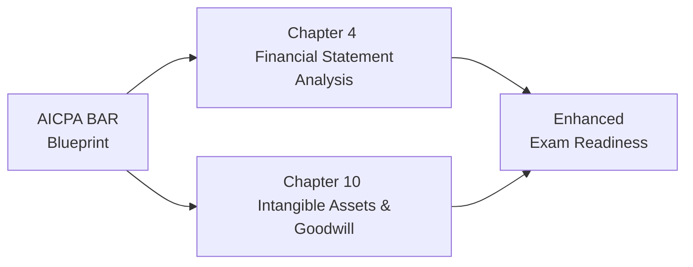

## 29.1 Blueprint Cross-Referencing

Navigating the CPA Examination effectively requires more than just rote memorization—it demands a strategic approach that aligns your study resources with the AICPA’s published blueprint. The Business Analysis and Reporting (BAR) section’s official blueprint lays out which content areas, tasks, and skill levels the exam will address. By cross-referencing each chapter of this BAR Examination Supplemental Guide with the AICPA guidelines, you can target your learning activities more efficiently, minimizing blind spots and maximizing exam readiness. In this section, we will explore how to interpret and apply the AICPA BAR Blueprint, articulate an easy-to-use cross-map between major content areas of the blueprint and the relevant chapters in our text, and outline best practices to keep your study approach structured. We will also provide illustrative examples, real-life scenarios, and a Mermaid diagram to clarify how blueprint cross-mapping supports a deeper conceptual grasp of the topics.

-------------------------------------------------------------------------------
## Purpose and Importance of Blueprint Cross-Referencing

Effective blueprint cross-referencing serves several key objectives:

• Ensures Complete Coverage. The AICPA blueprint explicitly identifies each topic and task that may appear on the exam. Matching these tasks to the chapters in this guide helps ensure that your review is comprehensive and that you do not inadvertently skip any content area.  
• Enhances Retention. When you know exactly why a topic is relevant to a specific skill assessment, you are more likely to engage substantively with the material. This purposeful learning often leads to higher retention and understanding.  
• Improves Time Management. Rather than studying all subjects with the same level of detail, you can allocate your time according to blueprint weightings. Heavily tested topics demand additional focus, whereas less emphasized areas can be studied more efficiently.  
• Clarifies Skill Level Requirements. The BAR section blueprint usually specifies four skill areas: Remembering and Understanding, Application, Analysis, and Evaluation. Cross-referencing helps identify which chapters target each skill area, allowing you to practice higher-level cognitive tasks on the most relevant subjects.  

By marrying our guide’s chapters to the official AICPA blueprint sections, you can track your progress in a disciplined manner that reflects the structure of the actual exam. This synergy between the blueprint and a comprehensive study manual is a proven method for streamlining your road to certification.

-------------------------------------------------------------------------------
## Understanding the AICPA BAR Blueprint Structure

Before diving into the cross-referencing table, let us briefly review how the AICPA organizes the BAR blueprint. While the blueprint may be updated periodically, it typically includes:

1. Content Areas. Broad categories such as Financial Statement Accounts and Disclosures, GAAP vs. IFRS, Governmental Accounting, Analytical Procedures, Risk Assessment, and more. Each content area is subdivided into detailed tasks.  
2. Representative Tasks. Specific tasks or abilities that candidates are expected to perform, such as “Analyze cost structures to forecast profitability” or “Evaluate the impact of currency fluctuations on foreign operations.”  
3. Skill Levels. The blueprint outlines the approximate percentage of exam questions addressing each level of learning, from basic remembering/understanding to advanced evaluation/judgment tasks.  
4. Sample Allocations. The AICPA typically indicates approximate weighting (for example, 15–25% of the exam might test certain aspects of Financial Statement Analysis).  

Your first step should be to read the entire BAR blueprint carefully. Highlight the sections you find most challenging and compare them to the relevant chapters in this guide. Many questions hinge on conceptual clarity, which is precisely where cross-referencing can save you time and frustration.

-------------------------------------------------------------------------------
## Cross-Referencing Overview

Below, you will find a broad overview that maps significant blueprint tasks and content areas to the corresponding chapters/sections of this BAR Examination Supplemental Guide. While the official blueprint is more granular, this “lookup map” will help you home in on the main chapters relevant to each exam subtopic. Use this table in concert with the official blueprint to fine-tune your review plan.

| Blueprint Main Topic                                  | Representative Tasks (Example)                                             | Relevant Chapters in This Guide                                     |
|--------------------------------------------------------|-----------------------------------------------------------------------------|----------------------------------------------------------------------|
| Financial Statement Analysis                           | • Analyze liquidity, solvency, and profitability ratios   • Identify potential anomalies | • Ch. 4 (Financial Statement Analysis)   • Ch. 9 (Valuation Techniques) |
| Managerial and Cost Accounting                         | • Classify costs as fixed, variable, or mixed   • Calculate variances, interpret results | • Ch. 5 (Managerial and Cost Accounting Essentials)                  |
| Non-Financial and Non-GAAP Measures                    | • Evaluate Balanced Scorecard metrics   • Interpret calculated EBITDA or Free Cash Flow  | • Ch. 6 (Non-Financial and Non-GAAP Measures)                        |
| Budgeting and Forecasting                              | • Prepare flexible budgets   • Develop rolling forecasts and run sensitivity analyses     | • Ch. 7 (Budgeting and Forecasting)                                  |
| Risk Assessment and Prospective Analysis               | • Evaluate cost of capital   • Perform and interpret NPV/IRR analyses                    | • Ch. 8 (Risk Assessment and Prospective Analysis)   • Ch. 9 (Valuation Techniques) |
| Technical Accounting: Intangibles, Software, Revenue   | • Recognize and test goodwill for impairment   • Apply R&D capitalization rules           | • Ch. 10 (Intangible Assets & Goodwill)   • Ch. 11 (Internally Developed Software)   • Ch. 12 (Revenue Recognition) |
| Business Combinations, Derivatives, Leases             | • Account for M&A transactions   • Identify derivative instruments and hedge accounting   | • Ch. 14 (Business Combinations & Foreign Operations)   • Ch. 15 (Derivatives)   • Ch. 16 (Leases) |
| Governmental Accounting                                | • Distinguish fund structures   • Prepare and reconcile governmental fund statements      | • Ch. 19 (Gov. Acctg. Fundamentals)   • Ch. 20 (Preparing Gov. Financial Statements)   • Ch. 21 (Reconciliations)   • Ch. 22 (Specialized Transactions) |
| Emerging Issues, IFRS vs. GAAP                         | • Compare IFRS vs. U.S. GAAP differences   • Evaluate cryptoasset disclosures             | • Ch. 23 (Emerging Issues)                                           |
| Communication & Reporting Insights                     | • Address SEC reporting guidelines   • Utilize XBRL for external reporting                | • Ch. 17 (Public Company Reporting)   • Ch. 25 (Practical Insights and Implementation) |
| Data Analytics & Technology                            | • Evaluate data integrity   • Implement process automation (RPA)                          | • Ch. 3 (Data and Analytics)   • Sections in Ch. 2 and Ch. 25 referencing technology collaboration |

These pairings are by no means exhaustive; rather, they serve as a roadmap to guide you in focusing on the relevant chapters when you study specific tasks or content areas from the official blueprint. Inside each referenced chapter, you will also find sub-sections that more precisely align with realm-specific tasks (e.g., “ASC 606 Variable Considerations” or “COSO ERM Overview”).

-------------------------------------------------------------------------------
## Step-by-Step Blueprint Cross-Referencing

Here is a recommended approach for using this cross-map to structure your study:

1. Identify Blueprint Priorities. Review the AICPA’s published weightings. For instance, if the blueprint reveals that Financial Statement Analysis comprises a substantial portion of questions, allocate extra revision time to Chapter 4.  
2. Look Up Corresponding Chapter Sections. Once you know which segment of the blueprint you want to study, locate the relevant chapter in the table above. Pay special attention to subtopics or tasks explicitly mentioned in that blueprint section.  
3. Dive Into the Chapter and Take Notes. Read the assigned sections thoroughly. Jot down key formulas, conceptual frameworks, and sample Journal Entries or data analytics approaches.  
4. Reinforce With Practice Questions. At the end of each chapter in this guide (or using external question banks), practice problems that focus on the skill level the blueprint calls for. For advanced analysis tasks, try multi-step scenario questions or case studies.  
5. Maintain a Cumulative Tracker. Keep an organized checklist or spreadsheet. Mark which blueprint tasks you have studied in depth and which chapters you have covered. Any questions that remain unclear should be revisited in a second pass.  

This cyclical process keeps you closely aligned with the official exam structure and ensures that, by the time you finish your studies, you have thoroughly covered all areas the AICPA expects you to master.

-------------------------------------------------------------------------------
## Visualizing Cross-Referencing with a Mermaid Diagram

Below is a simple Mermaid diagram illustrating how the AICPA BAR Blueprint (node A) links to two sample chapters from this guide (nodes B and C), which ultimately connect to enhancing your understanding (node D). While simplified, this visual shows how cross-referencing can create a “network” rather than a linear path, ensuring you continually build on your knowledge.

This network-oriented study approach underscores that you may find multiple chapters relevant to one blueprint topic. Likewise, a single chapter may address several blueprint categories.

-------------------------------------------------------------------------------
## Illustrative Example: Mapping Goodwill Impairment to the Blueprint

To demonstrate applied blueprint cross-referencing in a real-world context, consider the technical accounting topic of goodwill impairment:

• Official Blueprint Reference. The AICPA BAR Blueprint might list, under “Acquisition Accounting and Related Disclosures,” tasks such as: “Evaluate the recognition and measurement of goodwill, test for impairment, and account for related disclosures.”  
• Matching Chapter. Chapter 10 in our guide, “Indefinite-Lived Intangible Assets and Goodwill,” comprehensively addresses the recognition, evaluation, and impairment testing for goodwill.  
• Skill-Level Focus. Goodwill often demands Analysis- and Evaluation-level tasks. You must not only recall the impairment procedure (Remembering and Understanding) but also perform and interpret a hypothetical impairment test (Application), assess whether an impairment is necessary based on multiple variables (Analysis), and ultimately draw conclusions on the proper financial statement treatment (Evaluation).  
• Example Scenario. Picture an entity acquiring a smaller tech start-up. Post-acquisition, a significant industry downturn triggers a potential goodwill impairment. The blueprint demands that you analyze intangible asset valuations under uncertain conditions. Cross-reference Chapter 10 of this guide to walk through the step-by-step impairment test, including best disclosures in compliance with ASC 350.  

By following the cross-reference from the blueprint to Chapter 10, you confirm you are covering the relevant conceptual knowledge and the advanced skill level needed for actual exam questions, especially those presented as scenario-based Task-Based Simulations (TBSs).

-------------------------------------------------------------------------------
## Best Practices, Pitfalls, and Strategies

• Best Practices  
  – Keep the Blueprint Handy. Print it or save a PDF version. Tally each task once you have studied and practiced questions thoroughly.  
  – Align Notes with Blueprint Tasks. Whenever you take notes, label them with the corresponding blueprint task references. This approach organizes your study materials around exam requirements.  
  – Segment Study by Skill Level. Dedicate separate reviews for tasks requiring advanced analytics or evaluation, ensuring you practice complex scenario questions for these.  

• Common Pitfalls  
  – Overlooking Low-Weighted Areas. Even though some topics may carry a small percentage, they can still appear in the exam unexpectedly. Skipping entire sections can be costly.  
  – Mixing Up GAAP and IFRS. For advanced tasks, especially in business combinations or foreign operations, watch carefully for any IFRS-based questions. Cross-referencing IFRS coverage (e.g., Chapter 23) can avert confusion.  
  – Underestimating Time for Governmental Accounting. The AICPA frequently includes niche governmental questions. Match blueprint tasks to Chapters 19–22 to ensure you do not minimize coverage in these areas.  

• Strategies to Overcome Challenges  
  – Start with Familiar Topics. Build momentum by covering areas you are comfortable with, then tackle the more difficult tasks progressively.  
  – Use Spaced Repetition. After studying a blueprint topic thoroughly, revisit it periodically to refresh your memory.  
  – Combine Theory with Practice. Theory alone is never enough. For each blueprint content area, solve related practice questions or illustrate an example scenario.  

-------------------------------------------------------------------------------
## Real-World Scenario: Governmental Budget Shortfalls

Suppose the blueprint highlights the task: “Analyze budgetary compliance and interpret encumbrances in a governmental fund environment.” This could appear under the Governmental Accounting content area. Cross-reference with:

• Chapters 19, 20, 21, and 22  
• Specifically examine “Budgetary Accounting, Encumbrances, and Lapsing” in Chapter 20  

In a real-world setting, imagine a large metropolitan city that faces a mid-year revenue shortfall. The local government, operating under a legally adopted budget, must address this shortfall while also meeting designated expenditures for public services. From the blueprint perspective, you are expected to evaluate both short-term budgetary compliance (which uses modified accrual accounting for governmental funds) and long-term fiscal impact (which might use government-wide full accrual financials). Chapter 20 guides you through how to reconcile these perspectives, using example financial statements to highlight the differences between modified and full accrual bases.

This scenario underscores how blueprint cross-referencing ensures you do not confuse private sector or nonprofits with governmental guidelines. Spreading your study across multiple chapters—each focusing on a different facet of governmental fund structures—prepares you for the variety of questions the BAR exam might present.

-------------------------------------------------------------------------------
## Additional References

For a deeper understanding of the AICPA BAR Blueprint and the intricacies of cross-referencing, consider:

• AICPA’s Official Uniform CPA Examination Blueprints: https://www.aicpa.org/becomeacpa  
• COSO’s Enterprise Risk Management Framework  
• FASB’s Accounting Standards Codification (ASC) Online Database  
• Governmental Accounting Standards Board (GASB) for specialized governmental tasks  

You may also benefit from specialized review courses that integrate blueprint cross-referencing directly into their question banks. These resources often allow you to filter questions by blueprint task, skill level, and content area, further optimizing your study.

-------------------------------------------------------------------------------
## Test Your Knowledge: AICPA BAR Blueprint Cross-Referencing



### Which of the following best describes the purpose of cross-referencing your study materials to the AICPA BAR Blueprint?

- [ ] It replaces the need for reading the AICPA BAR Blueprint.  
- [x] It ensures alignment between your study approach and tested topics.  
- [ ] It provides a shortcut to skip less weighted areas.  
- [ ] It guarantees a passing score without additional study.  

> **Explanation:** Cross-referencing ensures that the content you review directly corresponds to the tasks and topics listed in the BAR Blueprint. This alignment increases the likelihood of comprehensive exam coverage.

### What benefit does labeling your study notes with specific blueprint tasks provide?

- [ ] It lengthens your study time.  
- [ ] It confuses your study approach.  
- [x] It organizes your review materials according to exam requirements.  
- [ ] It limits your exposure to various topics.  

> **Explanation:** Labeling your notes with blueprint references helps segment your learning based on exam objectives, ensuring you cover all critical areas systematically.

### In the context of the AICPA BAR Blueprint, which chapters would you cross-reference if you encounter tasks related to governmental fund reconciliations?

- [x] Chapters 19, 20, and 21.  
- [ ] Chapters 1, 2, and 3.  
- [ ] Chapters 13, 14, and 15.  
- [ ] Chapters 25 and 26.  

> **Explanation:** Governmental fund reconciliations are covered extensively in Chapters 19–21, which tackle governmental accounting fundamentals, statement preparation, and adjustments for government-wide reporting.

### How does knowing the AICPA’s skill level distribution (e.g., Remembering and Understanding vs. Evaluation) help in your exam preparation?

- [x] It informs the complexity and depth of practice questions you should attempt.  
- [ ] It is optional information with no effect on your study strategy.  
- [ ] It only matters for simulation-based questions.  
- [ ] It allows you to bypass remembering definitions and formulas.  

> **Explanation:** Understanding skill levels helps you tailor your practice to the cognitive complexity emphasized by the exam, so you can prepare for scenario-based questions requiring higher-level examination or evaluation.

### If the blueprint indicates that "Revenue Recognition" holds a high percentage of the exam weighting, which chapters from this guide are most relevant?

- [ ] Chapters 1 and 3 only.  
- [ ] Chapters 17–18.  
- [x] Chapters 12 and possibly Chapters 10–11 for related intangible asset considerations.  
- [ ] Chapter 25 exclusively.  

> **Explanation:** Revenue Recognition under ASC 606 is primarily covered in Chapter 12. Chapters 10 and 11 may also address related intangible considerations that can influence revenue recognition nuances.

### Why is it advisable not to overlook topics with low weighting in the blueprint?

- [x] They can still appear in the exam and potentially affect your total score.  
- [ ] The BAR exam never asks questions from low-weighted areas.  
- [ ] Low-weighted areas are never tested in simulations.  
- [ ] The AICPA blueprint excludes low-weighted areas from the final exam.  

> **Explanation:** Even though an area may have a smaller percentage weighting, it can still appear on the exam. Missing questions in these areas could harm your overall score.

### Which chapters in this guide would you cross-reference for tasks related to variance analysis and cost classification?

- [ ] Chapter 4 on ratio analysis.  
- [x] Chapter 5 on managerial and cost accounting essentials.  
- [ ] Chapter 14 on business combinations.  
- [ ] Chapter 23 on emerging issues.  

> **Explanation:** Variance analysis and cost classification (fixed, variable, mixed) are detailed in Chapter 5, making it vital for managerial and cost accounting tasks.

### What is a practical first step in leveraging the cross-reference table provided in this section?

- [x] Identify your highest-priority blueprint topics to direct extra study time.  
- [ ] Memorize the cross-reference table without examining the official blueprint.  
- [ ] Skip the table and rely solely on the official blueprint.  
- [ ] Study only from the sections marked as advanced skill levels.  

> **Explanation:** Reviewing and prioritizing the blueprint topics that carry the heaviest weight ensures you effectively allocate your time and effort where it matters most.

### According to the text, which of the following is a best practice in blueprint cross-referencing?

- [x] Create and maintain a checklist that aligns your study progress with the official blueprint tasks.  
- [ ] Focus exclusively on advanced-level tasks.  
- [ ] Study entire chapters without referencing the blueprint.  
- [ ] Rely solely on practice questions without reading theoretical material.  

> **Explanation:** Maintaining a structured check-off system that aligns each topic in the official blueprint with chapters or subtopics in your study guide is an excellent method for ensuring clarity and thoroughness.

### Using a network-oriented approach to cross-referencing implies:

- [x] Multiple chapters may support a single blueprint topic, and one chapter may cover multiple blueprint tasks.  
- [ ] You should study chapters in alphabetical order.  
- [ ] There is an entirely separate blueprint for each chapter.  
- [ ] The AICPA does not allow cross-referencing in the exam.  

> **Explanation:** A network-oriented approach acknowledges the interconnected nature of accounting topics, ensuring a chapter can address various aspects of the blueprint, while a single blueprint topic may leverage knowledge from multiple chapters.



-------------------------------------------------------------------------------
## For Additional Practice and Deeper Preparation

### [Business Analysis and Reporting (BAR) CPA Mock Exams](https://www.udemy.com/course/bar-cpa-mock-exams/?referralCode=ADBE2E84BEE9CB6243CA)

**Business Analysis and Reporting (BAR) CPA Mocks:** 6 Full (1,500 Qs), Harder Than Real! In-Depth & Clear. Crush With Confidence!

• Tackle full-length mock exams designed to mirror real BAR questions.  
• Refine your exam-day strategies with detailed, step-by-step solutions for every scenario.  
• Explore in-depth rationales that reinforce higher-level concepts, giving you an edge on test day.  
• Boost confidence and minimize anxiety by mastering every corner of the BAR blueprint.  
• Perfect for those seeking exceptionally hard mocks and real-world readiness.

_Disclaimer: This course is not endorsed by or affiliated with the AICPA, NASBA, or any official CPA Examination authority. All content is for educational and preparatory purposes only._
