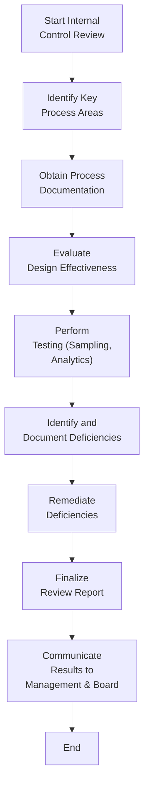
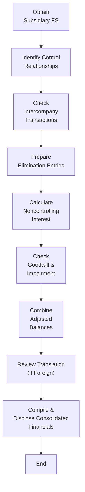
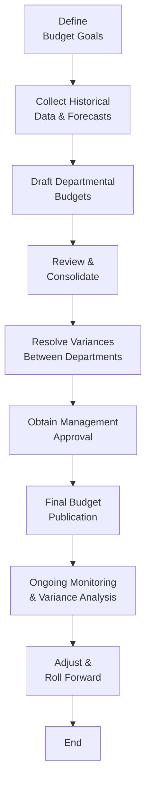

## 29.2 Sample Checklists and Flowcharts

This section provides ready-to-use tools for internal control reviews, consolidation steps, and budgeting programs. By leveraging these checklists and flowcharts, CPA candidates can efficiently structure their analyses, enhance clarity in complex processes, and ensure alignment with the knowledge tested in both the Business Analysis and Reporting (BAR) Examination and real-world accounting environments.

Use these resources in combination with related chapters in this guide. For instance, reference Chapter 7 for deeper budgeting insights and Chapter 14 for more detailed consolidation discussions. Apply these templates systematically to maintain an organized workflow and reduce the risk of oversight. Whether you are an experienced professional or just starting out, these checklists and flowcharts offer consistent benchmarks for thoroughness and accuracy.

---

### The Value of Checklists and Flowcharts

• Consistency: Standardized checklists and flowcharts ensure you never miss critical steps in processes such as internal control evaluations, consolidation, or budget creation.  
• Efficiency: Streamlined procedures reduce repetition of work, helping you focus on analysis rather than guesswork.  
• Comprehensiveness: Visual depictions allow you to understand the interconnections among various tasks, from data gathering to final reporting.  
• Accountability: Clear documentation supports audit requirements and fosters transparent communication with stakeholders.  

Emphasizing both planning and execution, these documents act as living tools. They should be updated periodically to reflect new regulations, organizational structure changes, and technology updates such as those discussed in Chapter 3 (Data and Analytics).

---

### Internal Control Review Checklists

Internal control assessments are pivotal in maintaining the integrity and reliability of financial reporting. High-level audits and reviews typically include segregation of duties, physical and logical access controls, transaction authorization, and monitoring activities. Below is a comprehensive checklist that you might deploy.

#### Internal Control Review Checklist

• Governance and Oversight:  
  - Confirm the existence of a formal organizational structure documenting reporting lines and authority.  
  - Examine the board of directors’ or audit committee’s oversight processes (see COSO ERM framework in Chapter 8.3).  

• Risk Assessment:  
  - Identify relevant risks that may affect financial reporting reliability.  
  - Evaluate whether management has set up risk mitigation strategies aligned with the organization’s objectives.  

• Control Activities:  
  - Verify proper segregation of duties, especially in critical processes such as cash disbursements and financial reporting.  
  - Confirm that approvals and authorizations are in place for unusual or significant transactions.  
  - Examine IT general controls, including system access, change management, and production oversight.  

• Information and Communication:  
  - Ensure processes exist to collect and share pertinent financial information internally and externally.  
  - Evaluate the adequacy of documentation and recordkeeping across relevant departments (e.g., revenue, payroll).  

• Monitoring:  
  - Inspect periodic internal audits and their frequency.  
  - Verify any deficiency remediation and continuous improvement activities.  

A well-structured review leverages data analytics (see Chapter 3) to detect anomalies, while human oversight ensures that computerized control lapses are identified promptly. Combine these approaches to achieve balanced assurance.

---

### Consolidation Steps Checklist

For organizations with subsidiaries, joint ventures, or variable interest entities, consolidation can be complex. Use the following checklist to guide your process:

#### Consolidation Steps Checklist

• Pre-Consolidation Preparation:  
  - Gather all relevant financial statements, ensuring consistent accounting policies and year-end dates (e.g., addressing IFRS-US GAAP differences if needed per Chapter 23.1).  
  - Evaluate the existence of intercompany transactions and confirm which need elimination.  

• Determination of Control:  
  - Ascertain the controlling entity and identify any noncontrolling interests.  
  - Evaluate any variable interest entities (VIEs) under ASC 810 (Chapter 14.2).  

• Elimination Entries:  
  - Remove intercompany sales, loans, and dividends.  
  - Adjust for any unearned profits in ending inventory or fixed assets.  

• Translation or Remeasurement (if applicable):  
  - For foreign operations, confirm the functional currency and apply the correct translation or remeasurement method (Chapter 14.3).  
  - Eliminate translation gains or losses recognized in the subsidiary financial statements where required.  

• Goodwill and Impairment:  
  - Review and test goodwill recognized in a previous business combination for impairment (Chapter 10.2).  
  - Check indefinite-lived intangibles for impairment triggers.  

• Consolidation Disclosure:  
  - Ensure all relevant footnotes (e.g., noncontrolling interests, related party disclosures) comply with ASC 810 and SEC requirements (Chapter 17).  
  - Present consolidated statements with correct labeling for controlling and noncontrolling interest, along with appropriate references.  

The glory of consolidation is in the details. Each step builds upon the prior one, transforming numerous entities into a single cohesive reporting perspective. Rigorous application of the items in this checklist will minimize errors and align final statements with GAAP or IFRS.

---

### Budgeting Program Checklist

Budgeting serves as both a strategic and an operational tool. Comprehensive budgets encompass revenue estimations, production planning, and resource allocations. Here is a generalized checklist to strengthen your budgeting process:

#### Budgeting Program Checklist

• Planning and Objective Setting:  
  - Define short- and long-term goals (see Chapter 7.1’s Master Budgeting).  
  - Identify budget drivers (e.g., sales volume, raw material costs).  

• Data Collection:  
  - Gather historical data from finance, sales, and operations for baseline calculations.  
  - Verify the reliability of source data (Chapter 3.4 on Data Integrity).  

• Budget Preparation:  
  - Develop a revenue budget, production budget, and overhead budgets in alignment with organizational objectives.  
  - Assess capacity constraints and resource availability.  
  - Incorporate cost of sales, R&D, and capital expenditure budgets as needed.  

• Consolidation of Budgets:  
  - Combine departmental budgets into an overarching master budget.  
  - Cross-check for consistency and reasonableness.  

• Review and Approval:  
  - Present the draft budget to senior management or governance committees for approval.  
  - Adjust based on feedback and sign off on final figures.  

• Ongoing Monitoring:  
  - Conduct variance analysis (Chapter 5.3) to compare actual vs. budgeted results.  
  - Update rolling forecasts or re-forecasts to adapt to market and operational changes (Chapter 7.2).  

While budgets theoretically project required resources, accommodating real-world dynamics is crucial. Scenario planning, as mentioned in Chapter 7.3, can mitigate potential volatility in economic conditions.

---

### Sample Flowcharts

Flowcharts offer a visual representation of sequence and decision points. The diagrams below use Mermaid.js syntax, with each node enclosed in bracketed quotes. Adapt these designs to your organization’s specific processes and maintain them as living documents.

---

#### Flowchart: Internal Control Review

Explanation of Steps:

• Start Internal Control Review: Clarify the scope (which cycle or sub-cycle, e.g., revenue or procurement).  
• Identify Key Process Areas: Pinpoint the processes that significantly impact financial reporting.  
• Obtain Process Documentation: Reference existing procedures and flowcharts created by the finance or operations teams.  
• Evaluate Design Effectiveness: Judge if the control design appropriately addresses identified risks.  
• Perform Testing: Conduct tests of controls, covering attributes such as validity, authorization, and completeness.  
• Identify and Document Deficiencies: Record any control gaps, weaknesses, or exceptions found during testing.  
• Remediate Deficiencies: Develop or adjust controls to address the identified issues.  
• Finalize Review Report: Summarize findings, including remediation timelines.  
• Communicate Results: Provide relevant management and the board with a concise, actionable overview.  

---

#### Flowchart: Consolidation Steps

Explanation of Steps:

• Obtain Subsidiary FS: Verify the completeness and quality of each subsidiary’s financial data.  
• Identify Control Relationships: Determine which entities must be consolidated based on ownership thresholds and variable interest analysis.  
• Check Intercompany Transactions: Identify sales, payables, or investments that require elimination.  
• Prepare Elimination Entries: Record all eliminations, ensuring no double counting or earnings overstatements.  
• Calculate Noncontrolling Interest: Reflect correct portions of net income and equity that belong to minority shareholders.  
• Check Goodwill & Impairment: Update or test goodwill (ASC 350) for IFRS or US GAAP.  
• Combine Adjusted Balances: Aggregate daily, monthly, or quarterly adjustments.  
• Review Translation: Convert foreign subsidiary accounts to the parent’s reporting currency, noting CTA (cumulative translation adjustment).  
• Compile & Disclose Consolidated Financials: Produce final statements with all necessary footnotes and management commentary.  

---

#### Flowchart: Budgeting Process

Explanation of Steps:

• Define Budget Goals: Outline primary objectives, such as revenue growth, cost containment, or market share.  
• Collect Historical Data & Forecasts: Gather internal data from ERP systems and external market research.  
• Draft Departmental Budgets: Let each department propose figures consistent with organizational goals.  
• Review & Consolidate: Combine departmental budgets to form a cohesive plan.  
• Resolve Variances: Address conflicts between departments over resource allocation.  
• Obtain Management Approval: Finalize budgets pending sign-off from senior leadership or governance committees.  
• Final Budget Publication: Distribute the approved budget across the organization.  
• Ongoing Monitoring & Variance Analysis: Compare actual performance to budget regularly, identifying root causes of deviations.  
• Adjust & Roll Forward: Maintain a rolling forecast, adjusting your plan based on real-time conditions.  

---

### Practical Tips and Best Practices

• Leverage Collaborative Software: Tools such as enterprise planning software or cloud-based solutions improve version control and real-time edits for checklists and flowcharts.  
• Train Key Personnel: Encourage cross-training among finance, IT, and operations teams to foster robust internal control and budgeting processes.  
• Stay Updated: Regulatory changes—like new SEC or FASB pronouncements—can quickly make existing checklists obsolete. Regularly revisit and refine your tools.  
• Document Rationale: Along with ticking off items in a checklist, add context for why each step matters. This elevates an otherwise mechanical process into a thoughtful, value-added analysis.  
• Use Data Analytics: Chapter 3 details how leveraging RPA, cloud platforms, and data visualization can detect anomalies or inefficiencies not easily spotted with traditional methods.  
• Communicate and Collaborate: Flowcharts, in particular, are excellent for bridging communication gaps. Share them with cross-functional teams to bring everyone onto the same page.  

---

### Further Resources

For deeper learning and reference, explore these materials:

• COSO Integrated Framework (see Chapter 8.3) – Guidance on designing and assessing internal controls.  
• AICPA’s Audit and Accounting Guides – Industry-specific guidelines for control considerations, consolidation, and budgeting.  
• Gartner and IDC Reports – Overviews of the latest technologies in budgeting tools and internal control software.  
• Chapter 5 (Managerial and Cost Accounting Essentials) – Additional cost classification checklists.  
• Chapter 12 (Revenue Recognition) – For details on recognizing revenue when analyzing budgetary revenue line items.  

---

## Test Your Knowledge: Checklists and Flowcharts for CPA Exam Success



### Which of the following is a primary advantage of using standardized checklists?

- [x] They promote consistency and prevent omission of key steps.
- [ ] They reduce the complexity of accounting standards.
- [ ] They eliminate the need for analytical reviews.
- [ ] They ensure budgets never require revisions.

> **Explanation:** Standardized checklists help maintain consistency in procedures and reduce the likelihood of missing critical tasks.

### Which item should be included when preparing an internal control review checklist?

- [x] Evaluation of IT general controls.
- [ ] Determination of functional currency for foreign subsidiaries.
- [ ] Budgeted capital expenditures for the fiscal year.
- [ ] Non-GAAP performance measures.

> **Explanation:** IT general control evaluation (access, change management, etc.) is essential for assessing internal controls.

### In a consolidation process flowchart, the step immediately following preparation of elimination entries often involves:

- [x] Calculating noncontrolling interest.
- [ ] Reviewing departmental budgets.
- [ ] Performing variance analysis for production costs.
- [ ] Evaluating physical inventory counts.

> **Explanation:** Consolidated statements generally reflect the proper attribution of equity and net income to noncontrolling interests after intercompany balances are eliminated.

### How can flowcharts specifically enhance the budgeting process?

- [x] By visualizing the sequence of tasks and decision points.
- [ ] By eliminating all intercompany transactions.
- [ ] By confirming the functional currency for subsidiaries.
- [ ] By ensuring intangible assets are tested for impairment.

> **Explanation:** Flowcharts show how tasks interconnect and reveal critical decision points, making the budgeting process more transparent.

### Which statement best describes a beneficial use of data analytics in internal control reviews?

- [x] Identifying unusual trends or transactions that signal potential control weaknesses.
- [ ] Replacing all manual testing procedures.
- [x] Pinpointing duplication or overlap in control activities.
- [ ] Eliminating the need for management review and approval.

> **Explanation:** Data analytics tools can quickly surface anomalies, highlight redundant controls, and facilitate more targeted testing.

### Which of the following elements is most relevant for a budgeting checklist?

- [x] Collecting historical data from finance and sales.
- [ ] Reviewing translation adjustments in foreign subsidiaries.
- [ ] Posting elimination entries for intercompany loans.
- [ ] Performing a stock-based compensation valuation.

> **Explanation:** Budgeting relies on collecting relevant historical and current data, particularly from finance and sales, to forecast future performance.

### When reviewing a subsidiary’s financial statements to determine consolidation requirements, which step is essential?

- [x] Identifying if the parent has a controlling financial interest.
- [ ] Verifying the accuracy of intangible asset impairments.
- [x] Evaluating IT system upgrades in progress.
- [ ] Detailing R&D amortization schedules.

> **Explanation:** Determining control is critical in deciding whether a subsidiary is consolidated.

### During the budgeting flowchart’s “Resolve Variances” step, which aspect is typically addressed?

- [x] Negotiating resource allocation disputes among departments.
- [ ] Checking goodwill for impairment.
- [ ] Eliminating intercompany profits.
- [ ] Designing job-order cost systems.

> **Explanation:** Budgets often require reconciliation of competing departmental demands to align with organizational goals.

### Which of the following usually appears in a final consolidation disclosure?

- [x] Noncontrolling interest details.
- [ ] Master budget for the next fiscal year.
- [ ] Departmental overhead variance analysis.
- [ ] Detailed payroll transaction listings.

> **Explanation:** Consolidated statements must reflect separate lines for noncontrolling interests and related disclosures.

### True or False: Flowcharts are static documents and should not be revised once approved.

- [x] True
- [ ] False

> **Explanation:** This is a trick question. Well-designed internal flowcharts are living documents. However, as many organizations incorrectly treat them as static resources, it can lead to outdated representations of processes. The best practice is to revise and update them regularly.  



---

## For Additional Practice and Deeper Preparation

### [Business Analysis and Reporting (BAR) CPA Mock Exams](https://www.udemy.com/course/bar-cpa-mock-exams/?referralCode=ADBE2E84BEE9CB6243CA)

**Business Analysis and Reporting (BAR) CPA Mocks:** 6 Full (1,500 Qs), Harder Than Real! In-Depth & Clear. Crush With Confidence!

- Tackle full-length mock exams designed to mirror real BAR questions.  
- Refine your exam-day strategies with detailed, step-by-step solutions for every scenario.  
- Explore in-depth rationales that reinforce higher-level concepts, giving you an edge on test day.  
- Boost confidence and minimize anxiety by mastering every corner of the BAR blueprint.  
- Perfect for those seeking exceptionally hard mocks and real-world readiness.  

_Disclaimer: This course is not endorsed by or affiliated with the AICPA, NASBA, or any official CPA Examination authority. All content is for educational and preparatory purposes only._
