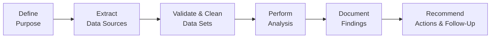
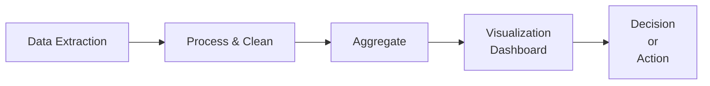

## 29.3 Data Analytics Workpapers

Data analytics workpapers serve as the backbone of any robust financial or managerial analysis process. These structured documents allow accountants and analysts to properly query data, validate information, and document their analytical findings for stakeholders and auditors. By thoroughly organizing data analytics workpapers, professionals ensure transparency, reproducibility, and efficiency in all stages of financial reporting, forecasting, and business advisory. This section consolidates best practices, templates, and illustrative examples to guide financial professionals in creating, managing, and communicating insights drawn from data.

---

### Importance of Data Analytics Workpapers

Data analytics workpapers are more than simple checklists of results—they are systematic records that mirror the entire data analytics lifecycle. Well-organized workpapers:

• Enhance Quality: Standardize the process of data gathering, transformation, analysis, and review, minimizing errors and omissions.  
• Improve Transparency: Document how data was sourced, cleaned, enriched, and analyzed, enabling auditors and stakeholders to understand and verify conclusions.  
• Reinforce Compliance: Demonstrate adherence to relevant guidance from professional bodies (AICPA, PCAOB) and corporate policies on data governance and security.  
• Facilitate Collaboration: Offer structured formats that make it easier for teams—particularly those in different locations or time zones—to work on the same data sets.  

While data analytics processes can vary widely in scope—from small internal projects to large-scale cross-departmental initiatives—this chapter aims to address universal concepts, templates, and recommended procedures in alignment with professional standards.

---

### Aligning with Chapter 3: Data and Analytics

Earlier in Chapter 3 (Data and Analytics), we introduced foundational tools and techniques used in analytics, including data visualization platforms, queries, robotic process automation (RPA), and cloud data storage. This section applies and expands on those fundamentals by focusing on how to formalize your findings into consistent and easily navigable workpapers. The content here will help you extend the knowledge from Chapter 3 into a more structured, auditable framework.

---

### Core Components of Data Analytics Workpapers

Every data analytics workpaper package typically includes the following elements:

• Purpose Statement and Scope: Succinctly define the objectives of the analysis.  
• Data Sources and Descriptions: Clarify where data originates (e.g., ERP systems, CSV files, cloud applications).  
• Data Validation and Cleaning Methods: Outline the checks performed for completeness and accuracy.  
• Analytical Procedures: Describe the techniques, queries, and statistical tests employed.  
• Findings and Insights: Summarize key outcomes, anomalies, trends, or issues discovered.  
• Action Items or Follow-Up: Note any recommended adjustments or deeper analyses.  

Below is a typical diagram illustrating an end-to-end data analytics workflow and how it maps to different sections of your workpapers.

In your data analytics workpapers, each of these steps should be distinctly described and thoroughly documented.

---

### Structuring the Data Query Process

A clear structure for data queries prevents confusion and supports quick review by decision-makers or third-party auditors. Below is an example of how you might label and organize your queries within a workpaper format:

• Name and Description of Query: “Sales_Data_Analysis_Q1” – Summarizes revenue by product category for the first quarter.  
• Purpose: The objective of this query is to analyze profitability trends for Q1 across three major product lines.  
• Data Source: Identify the specific tables or data sets, e.g., “ERP_Sales_Transactions_2025Q1.”  
• Query Logic / SQL or NoSQL Script: Provide the exact script or data manipulation code.  
• Expected Output: Outline the type of data columns (e.g., “Product_Category,” “Sales_Amount,” “Gross_Margin”).  
• Actual Output: Copy or link to the resulting data set.  
• Validation Checks: Document how you verified the completeness (e.g., total record count) and accuracy (e.g., reconciling sample transactions to the general ledger).  
• Observations and Next Steps: State whether results need further analysis or hold immediate implications for the final deliverable.  

This approach is essential in ensuring each data set’s lineage is trackable and that every user who references or updates the file understands the context and methodology.

---

### Validating Data Sets

One of the most critical parts of any data analytics project is data validation. Proper validation techniques reduce the risk of basing decisions on incomplete or inaccurate data. Below are key validation practices:

• Referential Integrity Checks: Confirm that foreign keys in one table (e.g., “Customer_ID”) match valid entries in the source table.  
• Reasonableness Tests: Compare transaction counts against historical averages or known business cycles.  
• Reconciliation to System Reports: Ensure data sets reconcile to official system-of-record reports, such as monthly or quarterly statements.  
• Missing Value Analysis: Identify null or missing fields, then determine whether they are genuine omissions, or errors introduced during import.  

For each validation test, document:  
1. Purpose of the test (e.g., “Ensuring completeness of foreign key relationship”).  
2. Method used (e.g., “SQL join to check orphan records in the transactions table”).  
3. Outcome or key metrics (e.g., “0.2% orphan records discovered”).  
4. Resolution (e.g., “Records were examined and corrected or excluded from final analysis”).  

Maintain these data validation test results in a dedicated section or annex within your workpapers. By centralizing these details, you establish a clear audit trail.

---

### Sample Workpaper Layout

Below is a concise illustration of a recommended workpaper layout. While each organization may tailor the structure to fit specific needs, these fundamental headings are widely applicable:

1) Executive Summary or Purpose  
   • Clearly define project scope, objectives, and high-level approach.  

2) Master Data Source Log  
   • List all data sets, with version control and date of extraction.  

3) Query Inventory  
   • Catalog of queries used, their objectives, and scripts or references to them.  

4) Data Validation Results  
   • Outcomes of validation tests (e.g., anomalies, reconciling differences, data cleansing notes).  

5) Analytical Procedures  
   • Document each statistical or data mining procedure conducted.  
   • Refer to any relevant standard or reference used.  

6) Visualization and Dashboards  
   • Screen captures or embedded links to data visualization resources (e.g., business intelligence tools).  

7) Findings and Action Items  
   • Summarize your conclusions, highlight critical metrics, and propose next steps.  

8) Reviewer’s Comments or Sign-Off  
   • Include spaces or fields for peer review, manager sign-off, or external auditor notes.  

---

### Practical Example: Financial Statement Ratio Analysis

Consider a scenario where you are analyzing a large manufacturing company’s quarterly financials. You aim to compute their current ratio, quick ratio, and debt-to-equity ratio to spot early warning signs of liquidity issues. Here is how you might structure your analytics workpaper:

#### Purpose and Context
• Purpose: Evaluate the liquidity and solvency of XYZ Manufacturing Inc. for Q2 2025 in alignment with concerns raised by internal auditors.  
• Context: Company underwent a significant expansion in Q1 2025, taking on additional debt.

#### Data Sources
• GL_BalanceSheet_Q2_2025.csv extracted from the company’s ERP system on July 15, 2025.  
• Consolidated Financial Statements for reference and reconciliations.

#### Queries/Procedures
• Query 1: SELECT line_items for Current Assets, Current Liabilities from the Q2 Balance Sheet.  
• Query 2: SELECT line_items for Long-Term Debt and Equity from the same dataset.  
• Data Aggregation: Summation of relevant accounts to compute ratios.

#### Data Validation
• Compared the total assets from the extracted dataset to the official Q2 published statement; difference < 0.1%.  
• Checked key line items (e.g., “Accounts Payable,” “Accounts Receivable”) for consistent naming or classification.  
• Found minor classification discrepancies (office equipment was recorded under “Other Assets” instead of “Property, Plant & Equipment”). Adjusted in the final analysis.

#### Calculations and Formulas
In accounting, classic ratios such as the current ratio are often computed as:


\text{Current Ratio} = \frac{\text{Current Assets}}{\text{Current Liabilities}}


Similarly, for the quick ratio:


\text{Quick Ratio} = \frac{\text{Cash + Marketable Securities + Receivables}}{\text{Current Liabilities}}


These formulas should be included—with any slight modifications relevant to a particular industry—in the final workpapers for reproducibility.

#### Findings
• Current Ratio: 1.34 (down from 1.51 in the previous quarter).  
• Quick Ratio: 0.90 (a notable decrease from 1.11 last quarter).  
• Debt-to-Equity Ratio: 2.00 (and rising).  

#### Recommended Actions
• Monitor short-term liquidity more frequently as raw material purchases have increased.  
• Explore potential restructuring of short-term debts into long-term notes.  
• Discuss classification errors with the accounting team to ensure consistency in future financial statements.

Providing these details in the workpapers offers a transparent and methodical record of how the ratios were calculated, what data was used, and which issues may warrant further attention.

---

### Integration with Analytics Tools

Data analytics workpapers in modern organizations frequently interface with business intelligence (BI) tools and data visualization platforms. Examples include Power BI, Tableau, or cloud-based solutions such as Google BigQuery for complex queries. In your workpapers, include references (e.g., links, screenshots, or designated file paths) to dynamic resources that showcase real-time dashboards or pivot tables. By doing so, you:

• Maintain a live record of analysis for real-time updates.  
• Support advanced analytics such as regression modeling, variance analysis, or what-if forecasting.  
• Provide stakeholders with interactive ways to explore the data behind the final results.

---

### Documenting Findings with Data Visualizations

Well-designed charts, tables, and dashboards can be embedded in or referenced from your workpapers to illustrate trends and anomalies. Consider the use of a bubble chart to identify relationships between different financial statement items or a line chart to track monthly net income trends. For instance:

Such a diagram can remind reviewers of the general flow from raw data to the final insights. Screenshots of actual dashboards can support deeper understanding of the key metrics observed. Always include commentary or references explaining what the charts indicate (e.g., “The spike in row C indicates a seasonal surge in sales”).

---

### Common Pitfalls and How to Avoid Them

Though analytics workpapers aim to enhance integrity, several pitfalls can undermine their reliability:

• Overlooking Data Security: Failing to safeguard sensitive data (e.g., PII, confidential financials) can compromise both compliance (e.g., GDPR, CCPA) and trust.  
• Isolated Workpapers: Storing workpapers in random locations or separate departmental drives can lead to inconsistent data references and a lack of version control.  
• Poor Linking or Cross-Referencing: If your queries and data validations reference different naming conventions or scattered locations, reconciling them becomes difficult.  
• Inadequate Sign-Off: Without formal checkpoints for review or approval, errors can go unnoticed until external audit or stakeholder scrutiny.  
• Scope Creep: Adding last-minute changes or unscheduled queries to the analytics can muddy the purpose and complexity of the original scope, making it harder to finalize and sign off.

To mitigate these pitfalls, enforce strong data governance policies, adopt centralized repositories or collaboration platforms, and establish drafting, peer review, and sign-off protocols. Leverage the resources in Chapter 3 (Data and Analytics) to ensure your data environment is reliable and secure.

---

### Best Practices and a Culture of Continuous Improvement

• Embrace Version Control: Utilize tools like Git or SharePoint’s version tracking to document each incremental change.  
• Incorporate Metadata: Add short, descriptive metadata whenever new data sets or transformations are introduced—for instance, location, date, purpose, responsible party.  
• Develop Data Dictionaries: Maintain definitions of commonly used terms and metrics. This helps standardize language across queries, ensuring that “Total Sales” has the same meaning for every user.  
• Perform Regular Maintenance: Archive outdated workpapers and ensure new data sets are introduced with updated logs.  
• Cross-Train Teams: Avoid knowledge silos by training finance staff in basic data querying, and IT staff in fundamental accounting principles so they can share a common language.

---

### Additional Templates and Resources

In Appendix 29.2 of this book, you will find templates for checklists and flowcharts that can be applied to data analytics workpapers. Consider customizing these resources to fit the specific nature of your projects, whether you are analyzing corporate budgeting trends, performing due diligence for a business combination, or evaluating government funds under different measurement focus techniques.

For those interested in deeper exploration, valuable references include:

• “Data Analytics for Internal Auditors” by the Institute of Internal Auditors (IIA).  
• AICPA “Audit Data Analytics Guide,” detailing best practices and common pitfalls in data-driven engagements.  
• Online courses in SQL, Python for Finance, or specialized cloud analytics (provided by platforms like Coursera, edX, or specialized sites).  

---

### Conclusion

Data analytics workpapers remain integral to any finance professional seeking to leverage robust data insights while upholding quality, transparency, and compliance. By embracing structured formats, meticulous documentation, and continuous review, you position your analytics function as a significant driver of informed and strategic decisions. Whether you are preparing analysis for external audits, internal management reports, or prospective valuations, proper workpaper management undoubtedly strengthens your overall financial reporting framework.

---

## Adeptness in Data Analytics Workpapers: Quiz with Essential Insights



### Which of the following is a primary benefit of well-structured data analytics workpapers in financial audits?

- [x] They provide transparency and allow for efficient review by stakeholders and auditors.
- [ ] They minimize the use of technology in data analysis.
- [ ] They reduce the need for consistent data documentation practices.
- [ ] They eliminate the requirement for version control.

> **Explanation:** Well-structured workpapers grant a clear, transparent overview of the data analysis process, making it easier for stakeholders to verify results.  

### A robust data analytics workpaper typically includes:

- [x] Data validation methods, master data source logs, and analytical procedures.
- [ ] Unstructured notes about findings without version control.
- [ ] Company marketing brochures and social media pages.
- [ ] Unrelated financial statements from prior years’ audits only.

> **Explanation:** Workpapers should contain master data source logs, validation approaches, thorough analytical procedures, and a structured record of findings.  

### What is one key advantage of embedding BI dashboards (like those from Power BI or Tableau) into data analytics workpapers?

- [x] They offer interactive and real-time insights for reviewers.
- [ ] They reduce the transparency of financial statements.
- [ ] They eliminate the need for historical data.
- [ ] They limit collaboration among finance and IT teams.

> **Explanation:** Integrating dashboards or data visualizations allows stakeholders to explore data interactively, fostering deeper insights and timely decisions.  

### Which practice helps combat “scope creep” in data analytics workpaper preparation?

- [x] Defining the project purpose and scope before beginning analysis.
- [ ] Accepting all requests for additional metrics and calculations.
- [ ] Delaying management approvals until the last minute.
- [ ] Merging data sources from unrelated projects to one master file.

> **Explanation:** Clearly establishing the project purpose and scope before starting is key to staying on track and preventing unplanned expansions.  

### Common data validation procedures include:

- [x] Reasonableness checks on transaction counts and cross-verification with system-of-record statements.
- [ ] Randomly skipping the reconciliation process to save time.
- [x] Checking for orphan records or missing fields.
- [ ] Relying solely on assumptions that all data is accurate.

> **Explanation:** Good data validation includes reasonableness checks, reconciling system-of-records, and verifying data completeness and accuracy (e.g., checking orphan records).  

### To keep workpapers easily auditable and transparent, the best practice is:

- [x] Using consistent naming conventions and maintaining query scripts within the workpaper files.
- [ ] Multiple staff using the same file concurrently with no version control.
- [ ] Relying exclusively on memory to recall data transformations.
- [ ] Linking to files stored on personal local drives without documentation.

> **Explanation:** Transparent and auditable procedures require consistent naming, versioning, and thorough documentation of each data transformation.  

### How can professionals best avoid confusion when multiple individuals contribute to the same analytics project?

- [x] Centralizing collaborative platforms and version control measures.
- [ ] Storing large volumes of data in personal folders.
- [x] Defining data dictionaries for critical metrics and terms.
- [ ] Restricting comments and annotations in the workpapers.

> **Explanation:** Centralizing documentation and version control, as well as using standardized data dictionaries, helps multiple contributors work seamlessly.  

### Which element is most important to include when documenting each data query?

- [x] Specific purpose or objective for the query.
- [ ] Irrelevant screenshots from other unrelated dashboards.
- [ ] Private employee details for human resources tasks.
- [ ] Personal opinions outside the project scope.

> **Explanation:** Each query should be accompanied by a stated purpose or objective, ensuring clarity of why the query was performed and how it aligns with the project’s goals.  

### When embedding screenshots of dashboards in your workpapers, you should:

- [x] Provide context about what the charts indicate and why the metrics are relevant.
- [ ] Assume the reviewer automatically understands all visual elements.  
- [ ] Include no textual references or explanations.
- [ ] Never use color coding as it causes confusion.

> **Explanation:** Readers benefit from clear explanations that link visual elements to your findings, ensuring that charts and graphs have practical meaning.  

### Properly designed data analytics workpapers ultimately allow organizations to:

- [x] Ensure transparency, reproducibility, and compliance in finance-related analytics workflows.
- [ ] Eliminate the need for external auditing procedures entirely.
- [ ] Freeze dashboards in place and disallow updates for real-time data.
- [ ] Remove managerial oversight from financial processes.

> **Explanation:** Workpapers transparently track each step in the analytics workflow and facilitate reproducibility, making them vital for compliance and strong financial decision-making.  



---

## For Additional Practice and Deeper Preparation

### [Business Analysis and Reporting (BAR) CPA Mock Exams](https://www.udemy.com/course/bar-cpa-mock-exams/?referralCode=ADBE2E84BEE9CB6243CA)

**Business Analysis and Reporting (BAR) CPA Mocks:** 6 Full (1,500 Qs), Harder Than Real! In-Depth & Clear. Crush With Confidence!

- Tackle full-length mock exams designed to mirror real BAR questions.  
- Refine your exam-day strategies with detailed, step-by-step solutions for every scenario.  
- Explore in-depth rationales that reinforce higher-level concepts, giving you an edge on test day.  
- Boost confidence and minimize anxiety by mastering every corner of the BAR blueprint.  
- Perfect for those seeking exceptionally hard mocks and real-world readiness.

_Disclaimer: This course is not endorsed by or affiliated with the AICPA, NASBA, or any official CPA Examination authority. All content is for educational and preparatory purposes only._

---
