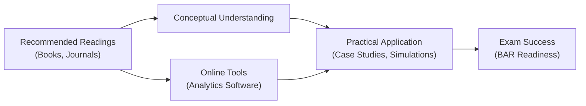

## 29.4 Recommended Readings and Online Tools

The Business Analysis and Reporting (BAR) section of the CPA Exam requires mastery over a wide array of practices—ranging from broad financial statement analysis to detailed data analytics and governmental accounting. This chapter focuses on two critical enablers of success: the carefully selected reading resources that deepen your conceptual understanding and the digital tools that streamline workflows and automate routine tasks. By integrating the resources recommended here into your study plan, you will not only strengthen your knowledge base but also gain confidence in tackling the complex scenarios typically tested on the BAR exam. This chapter divides recommended resources into the following major areas:

• Authoritative Literature & Accounting Standards  
• Business Periodicals & Scholarly Journals  
• Advanced Analytics and Visualization Tools  
• Online Learning Platforms & Discussion Forums  
• Governmental Accounting Resources  
• Specialized Data and Forecasting Platforms  

Throughout this guide, you will see pointers to specific chapters where the resources could be directly applied. The aim is to help you assimilate these materials into your existing study framework.

---

### Authoritative Literature & Accounting Standards

One of the more challenging components of the BAR exam is the need to interpret and apply an extensive set of accounting standards in real-world scenarios. Access to direct authoritative literature helps you stay up to date with changes in GAAP, which is crucial for success in both exam contexts and professional practice.

1. **FASB Accounting Standards Codification (ASC):**  
   • Website: <https://asc.fasb.org>  
   • Why It’s Important: Contains the source of authoritative U.S. GAAP. The site is regularly updated, ensuring you stay current with newly issued Accounting Standards Updates (ASUs).  
   • Usage Tip: Review the codification for complex areas such as Revenue Recognition (ASC 606), Leases (ASC 842), and Fair Value Measurements (ASC 820), discussed in Chapters 12, 16, and 15 respectively.

2. **GASB Governmental Accounting Standards:**  
   • Website: <https://www.gasb.org/>  
   • Why It’s Important: Essential for Chapter 19 through Chapter 22, where state and local government accounting concepts are covered in depth.  
   • Usage Tip: Focus on conceptual frameworks, fund accounting, and disclosures for public institutions.

3. **IFRS Standards (by IFRS Foundation):**  
   • Website: <https://www.ifrs.org/>  
   • Why It’s Important: Chapter 23 highlights the key differences between U.S. GAAP and IFRS. A thorough understanding of these distinctions is critical, especially for multinational and global transaction scenarios.  
   • Usage Tip: Pay close attention to IFRS 15 (Revenue), IFRS 16 (Leases), and IFRS 9 (Financial Instruments), which are systematically compared with U.S. equivalents throughout this guide.

4. **COSO Integrated Framework for Enterprise Risk Management (ERM):**  
   • Website: <https://www.coso.org/>  
   • Why It’s Important: Chapters 8 and 9 often reference risk assessment and enterprise-wide risk management strategies. COSO frameworks provide a structured approach to evaluating and mitigating risk.  
   • Usage Tip: Use their executive summaries as a refresher before tackling exam questions involving internal controls or sophisticated risk scenarios.

---

### Business Periodicals & Scholarly Journals

Reading widely on financial and accounting developments improves your ability to interpret and analyze real-world events under exam conditions. You will gain deeper insights into evolving trends and how to apply fundamental concepts in practice.

1. **Journal of Accountancy (AICPA):**  
   • Website: <https://www.journalofaccountancy.com/>  
   • Topics Covered: Frequent updates on regulatory changes, practice management tips, and professional ethics.  
   • Relevance: Articles often highlight the practical implications of emerging accounting standards, thereby helping readers contextualize newly tested areas on the BAR exam.

2. **The CPA Journal:**  
   • Publication by the New York State Society of CPAs  
   • Topics Covered: Case studies in financial reporting, taxation, managerial accounting, and internal controls.  
   • Relevance: Offers deep dives into advanced or emerging issues, which can be tested in integrated case studies (Chapter 24).

3. **Harvard Business Review (HBR):**  
   • Website: <https://hbr.org/>  
   • Topics Covered: Leadership, strategy, general management, and high-level discussions of technological impacts on business.  
   • Relevance: While not strictly accounting, reading HBR helps you adopt a broader strategic and managerial perspective, enriching your analysis and critical thinking for the exam.

4. **Financial Executive Magazine (FEI):**  
   • Website: <https://www.financialexecutives.org/>  
   • Topics Covered: Analyzes trends in corporate finance, compliance, and governance.  
   • Relevance: Resourceful for bridging the gap between technical standards and executive-level decision-making. Helpful for prospective analysis and capital structure discussions (Chapters 8 & 9).

5. **CFO Magazine:**  
   • Website: <https://www.cfo.com/>  
   • Topics Covered: News and insights on financial leadership, budgeting, performance metrics, and corporate governance.  
   • Relevance: Perfect for managers and analysts seeking a deeper understanding of cost controls, capital budgeting, and risk management—ideal complements to relevant coursework in Chapters 5 through 7.

---

### Advanced Analytics and Visualization Tools

With the significance of data analytics in modern accounting, as covered in Chapter 3, proficiency in relevant digital tools can help you transform raw data into actionable insights. Below are some platforms that frequently appear in practice and enhance your preparation for the BAR exam’s analytics components.

1. **Microsoft Excel, Power Query, and Power Pivot:**  
   • Why It’s Important: Offers a comprehensive solution for data cleaning, transformation, and modeling.  
   • Usage Tip: Create pivot tables for quick ratio calculations (Chapter 4) and incorporate scenario analysis and data tables for budgeting exercises (Chapter 7).

2. **Tableau:**  
   • Why It’s Important: Renowned for powerful data visualization capabilities.  
   • Usage Tip: Drill down into large datasets for ratio and trend analysis, capturing anomalies, and preparing interactive dashboards that mimic real-life managerial reporting.

3. **Power BI:**  
   • Why It’s Important: Provides robust data cleaning, integration, and visualization. Used widely in finance departments to streamline analytics.  
   • Usage Tip: Integrate multiple data sources—such as sales, operations, and finance—to visualize cost behaviors and variance analyses (Chapter 5).

4. **Alteryx:**  
   • Why It’s Important: Ideal for data blending, advanced analytics, and automating repetitive tasks—especially beneficial if you need to handle large datasets or complex transformations.  
   • Usage Tip: Set up quick workflows to calculate overhead rates, compile multi-company consolidation data (Chapter 14), or simulate capital budgeting decisions (Chapter 9).

5. **R and Python (Pandas, NumPy, SciPy, etc.):**  
   • Why It’s Important: Widely used for statistical computing, machine learning, and advanced analytics in finance.  
   • Usage Tip: Automate variance analysis by running scripts that process real-time data or examine correlations between financial metrics (Chapter 3). You can use Jupyter Notebooks for an interactive, code-based environment.

---

### Online Learning Platforms & Discussion Forums

The CPA journey can be greatly enriched by virtual study groups, discussion boards, and specialized online courses that delve into BAR-related topics. While self-study is valuable, engaging in interactive forums often provides the missing piece for clarifying doubts and sharing problem-solving approaches.

1. **AICPA’s Online Learning & Webinars:**  
   • Website: <https://www.aicpa.org/training>  
   • Why It’s Important: Direct insights from industry experts and staff members who develop CPA exam content.  
   • Usage Tip: Attend live or on-demand webinars for timely coverage of new standards or complexities in existing ones.

2. **Becker, Gleim, and Wiley Online CPA Review Platforms:**  
   • Why They’re Important: Comprehensive courses with practice problems, simulations, and progress tracking.  
   • Usage Tip: Use their specialized “data analytics” modules to get hands-on with spreadsheets and real-world problem sets. Compare your performance on advanced simulations with peers to identify areas of improvement.

3. **Reddit r/CPA Candidates and r/Accounting Forums:**  
   • Why They’re Important: Peer communities where you can read stories from other candidates, share study schedules, or troubleshoot a confusing concept in real-time.  
   • Usage Tip: Exercise caution; always cross-check information from user posts with official or known reliable sources.

4. **LinkedIn Learning:**  
   • Why It’s Important: Offers numerous specialized courses in financial analysis, forecasting, data analytics, and more.  
   • Usage Tip: Curate short courses that augment your weaker areas, such as advanced analytics or IFRS vs. GAAP differences, ensuring a more holistic learning approach.

---

### Governmental Accounting Resources

Governmental accounting topics (Chapters 19 through 22) can feel exceptionally novel, as the basis of accounting differs from commercial entities. Utilizing reputable resources can help you master these distinct concepts.

1. **Government Finance Officers Association (GFOA):**  
   • Website: <https://www.gfoa.org/>  
   • Why It’s Important: Provides best practices, advisories, and leadership insights on public finance.  
   • Usage Tip: Read practical examples of budgetary controls, fund accounting, and financial reporting for municipalities.

2. **Comptroller’s Office Websites for Various States:**  
   • Why They’re Important: Each U.S. state may have specific reporting guidelines and case studies.  
   • Usage Tip: Look for annual reports and budgeting practices as real-life examples that correlate with the theories in Chapter 20 and Chapter 21.

3. **Comprehensive Annual Financial Reports (CAFR) or Annual Comprehensive Financial Reports (ACFR):**  
   • Why They’re Important: Provide real-world illustrations of governmental entity financial statements, including fund-level and government-wide statements.  
   • Usage Tip: Practice performing reconciliations and ratio analyses on sections of actual ACFRs—this is a great way to gain practical insight into the complexities discussed in Chapter 21.

---

### Specialized Data and Forecasting Platforms

For advanced financial modeling, prospective analysis, and scenario planning—central to Chapters 7 through 9—consider supplementing your standard toolset with platforms built for sophisticated projections and risk analysis.

1. **Bloomberg Terminal:**  
   • Why It’s Important: Comprehensive market and economic data, real-time analytics, and robust forecasting tools.  
   • Usage Tip: Practice pulling ratio data on peer companies to build industry benchmarks (Chapter 4) and assess synergy potentials in M&A scenarios (Chapter 9).

2. **S&P Capital IQ and FactSet:**  
   • Why They’re Important: Offer in-depth company financials, industry analyses, and valuation metrics.  
   • Usage Tip: Generate quick analyses on cost of capital, capital structure, and enterprise valuations—great references to refine your capital budgeting and prospective analysis skills (Chapter 8).

3. **PitchBook:**  
   • Why It’s Important: Provides extensive private market data, including valuations, funding rounds, and M&A transactions.  
   • Usage Tip: Valuable for building real-option valuation methods (Chapter 9) and monitoring intangible asset valuations (Chapter 10, Chapter 11).

---

### Practical Example: Integrating Readings with Automated Analytics

To illustrate how these recommended readings and tools can converge in practice, consider this fictional scenario:

• You have been assigned a financial modeling task for a mid-size healthcare company.  
• You begin by reading new FASB updates related to revenue recognition adjustments for healthcare services (accessed through the FASB ASC portal).  
• You then consult The CPA Journal to gain insights into real-world examples of reimbursements and variable considerations in the healthcare space.  
• Next, you import the company’s historical revenue data into Power BI, using custom visualizations to pinpoint anomalies and forecast prospective revenue streams under different regulatory and economic conditions.  
• Finally, you cross-reference the scenario with IFRS guidelines (Chapter 23) because the company is also expanding internationally, ensuring consistent financial reporting across multiple jurisdictions.

By weaving together updated literature, robust analytics, and a keen understanding of GAAP vs. IFRS divergences, you equip yourself with the capacity to tackle nuanced exam tasks and demonstrate professional excellence.

---

### Mermaid Diagram: Recommended Resources and Tools Flow

Below is a simple Mermaid diagram illustrating how the various resources flow into your study and practice:

This diagram shows how reading resources and online tools independently enhance your domain knowledge and hands-on skills, converging into practical application and ultimately driving you toward success on the BAR exam.

---

### Best Practices and Pitfalls

• **Stay Current:** The BAR exam often incorporates recently issued or amended standards. Follow FASB and GASB announcements, as well as updates circulated in reputable periodicals like the Journal of Accountancy.  
• **Cross-Reference Multiple Sources:** Never rely on a single text for advanced topics. Combining academic references, official standards, and real-world examples fosters a holistic understanding.  
• **Leverage Automation Wisely:** Tools such as Excel, Power BI, or R can rapidly process thousands of data points. However, if you trust automation blindly, you risk overlooking data integrity issues. Always perform reasonableness checks and reconciliations.  
• **Practice with Real Data Sets:** The complexities covered in Chapters 3 and 4 become clearer when you handle genuine financial data. Whether it’s an SEC filing from EDGAR or a government CAFR, hands-on experience is invaluable.  
• **Confirm Relevance:** Select reading materials that align with your targeted sections (e.g., intangible assets for Chapter 10, or derivative accounting for Chapter 15) to avoid drowning in excessive or irrelevant detail.

---

### References

• FASB Accounting Standards Codification. (n.d.). <https://asc.fasb.org>  
• IFRS Resources. (n.d.). <https://www.ifrs.org/>  
• GASB Standards & Guidance. (n.d.). <https://www.gasb.org/>  
• Journal of Accountancy. (n.d.). <https://www.journalofaccountancy.com/>  
• Harvard Business Review. (n.d.). <https://hbr.org/>  
• AICPA Training & Webinars. (n.d.). <https://www.aicpa.org/training>  
• GFOA Best Practices. (n.d.). <https://www.gfoa.org/>  

Force multiplication in your exam preparation comes from using these references in tandem. It helps sharpen your ability to connect conceptual information with scenario-based questions that are typical of the BAR exam.

---

## Quiz: Mastering BAR Resources and Tools



### Which of the following authoritatively contains the up-to-date compilation of U.S. GAAP?

- [ ] Government Finance Officers Association (GFOA)
- [ ] Journal of Accountancy
- [x] FASB Accounting Standards Codification (ASC)
- [ ] The CPA Journal

> **Explanation:** The ASC is the official platform for all current non-governmental U.S. GAAP, ensuring the most authoritative and updated standards.

### When using online accounting forums as a study tool, what is the best practice to ensure accuracy?

- [ ] Use information from forum posts as the only source of truth.
- [x] Cross-check forum information with official or validated resources.
- [ ] Disregard official statements if forum consensus conflicts with them.
- [ ] Avoid forums entirely to save time.

> **Explanation:** While online forums can be informative, it is essential to compare information gleaned from peers with official standards, textbooks, or reliable academic sources.

### Which platform is known for robust data visualization capabilities that allow for intuitive dashboards in financial analysis?

- [ ] GFOA
- [ ] IFRS Foundation
- [x] Tableau
- [ ] Journal of Accountancy

> **Explanation:** Tableau is widely regarded as a powerful tool for data visualization, enabling finance professionals to create interactive dashboards for financial and managerial reporting.

### Which resource is ideal for accessing private market data, including valuations and M&A transactions?

- [x] PitchBook
- [ ] Power BI
- [ ] LinkedIn Learning
- [ ] The CPA Journal

> **Explanation:** PitchBook gives detailed insights into private company valuations, funding landscapes, and M&A trends—crucial for advanced deal analysis and valuation topics in Chapter 9.

### In regard to Alteryx, which statement is most accurate?

- [x] It is frequently used to automate large-scale data workflows and advanced analytics.
- [ ] It only supports basic features, such as pivot tables and standard charts.
- [x] It can be integrated with multiple data sources for complex transformations.
- [ ] It is primarily used for simple single-point data entry operations.

> **Explanation:** Alteryx excels at automating complex data workflows, integrating numerous data sources, and conducting sophisticated analytics. It goes far beyond basic features like pivot tables.

### Why are CAFRs or ACFRs important for CPA candidates specializing in governmental accounting?

- [x] They offer real-world illustrations of fund-level and government-wide statements.
- [ ] They are not relevant to government entities.
- [ ] They replace the FASB codification for private sector companies.
- [ ] They only apply to IFRS-based reporting.

> **Explanation:** Comprehensive (Annual) Financial Reports provide examples of detailed transactions, reconciliations, and disclosures specific to public sector accounting, aligning with Chapters 19–22 of this guide.

### Which statement best summarizes the importance of reading Harvard Business Review (HBR) for CPA exam candidates?

- [x] It offers insights into broader strategic management and leadership trends, enhancing critical thinking in financial analysis.
- [ ] It is solely dedicated to GAAP accounting updates.
- [x] It features narrowly focused technical content for regulatory compliance.
- [ ] It is the only authoritative source of risk management frameworks.

> **Explanation:** While HBR does not focus exclusively on accounting standards, it provides valuable perspectives on business strategy and leadership—skills that indirectly benefit the analytical depth expected on the BAR exam.

### Which approach helps prevent over-reliance on automated analytics tools?

- [x] Consistently performing reasonableness checks and reconciliations.
- [ ] Avoiding analytics tools whenever possible.
- [ ] Only using defaults provided by software for calculations.
- [ ] Blindly trusting sample data from training materials.

> **Explanation:** Even the most advanced analytics tools require human oversight to confirm outputs. Conduct reasonableness checks and ensure data integrity aligns with expected outcomes.

### What is the primary benefit of subscribing to Journal of Accountancy for BAR exam preparation?

- [x] Up-to-date coverage of regulatory changes and professional ethics within accounting.
- [ ] Exclusive coverage of staff-level tax topics unrelated to BAR.
- [ ] Concentrated focus on manufacturing cost allocations.
- [ ] Physical copies are mandatory for exam admission.

> **Explanation:** The Journal of Accountancy provides timely coverage of AICPA initiatives, regulatory updates, and changes in professional standards that can directly affect BAR exam content.

### True or False: IFRS Standards can be ignored unless you are only practicing in non-U.S. jurisdictions.

- [x] True
- [ ] False

> **Explanation:** While IFRS is not directly enforced on entities using U.S. GAAP, significant multinational transactions and comparative financial statements require IFRS knowledge. Chapter 23 emphasizes key IFRS vs. GAAP differences relevant to the BAR exam.



---

## For Additional Practice and Deeper Preparation

### [Business Analysis and Reporting (BAR) CPA Mock Exams](https://www.udemy.com/course/bar-cpa-mock-exams/?referralCode=ADBE2E84BEE9CB6243CA)

**Business Analysis and Reporting (BAR) CPA Mocks:** 6 Full (1,500 Qs), Harder Than Real! In-Depth & Clear. Crush With Confidence!  

- Tackle full-length mock exams designed to mirror real BAR questions.  
- Refine your exam-day strategies with detailed, step-by-step solutions for every scenario.  
- Explore in-depth rationales that reinforce higher-level concepts, giving you an edge on test day.  
- Boost confidence and minimize anxiety by mastering every corner of the BAR blueprint.  
- Perfect for those seeking exceptionally hard mocks and real-world readiness.  

_Disclaimer: This course is not endorsed by or affiliated with the AICPA, NASBA, or any official CPA Examination authority. All content is for educational and preparatory purposes only._
