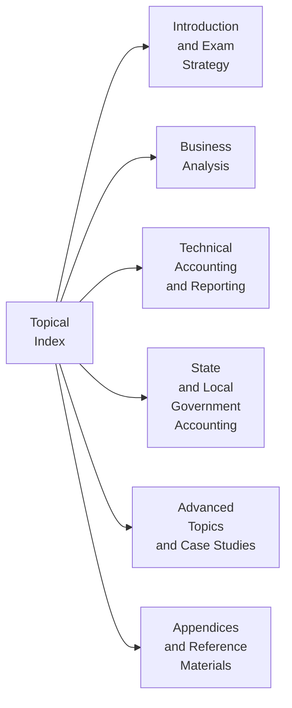

## 30.1 Topical Index

This Topical Index is designed to be your quick-reference companion for pinpointing exactly where key ideas, concepts, and terminologies appear throughout the “Certified Public Accountant (CPA, AICPA®), Uniform CPA Examination Blueprints (Effective date: January 2025): Business Analysis and Reporting (BAR) Examination Supplemental Guide.” It is organized alphabetically by major subject areas and individual topics, enabling you to swiftly search and find all relevant sections. Where appropriate, subtopics are listed under a broader heading to help you correlate connected ideas.

Use this resource as a jumping-off point to deepen your knowledge in a specific area, brush up on essential standards, or identify all chapters that touch upon a concept you’d like to revisit. Where possible, references are provided with chapter numbers and subchapter titles to guide you directly to the most relevant reading.

Feel free to explore the index as your study path evolves. If you’re preparing for the Uniform CPA Examination or simply broadening your accounting and business analysis acumen, the Topical Index will help you build a strong foundation and quickly find the information you need.

---

## How to Navigate This Topical Index

• Locate the major subject area or keyword of interest in alphabetical order.  
• Under each major heading, find subtopics that align with specific themes within the broader concept.  
• Cross-reference the connected chapters and subchapters listed in parentheses (e.g., (Chapter 4.1) or (Chapter 9.3)) for an in-depth reading of that particular subject.  
• When uncertain where a topic may appear, scan through related keywords and synonyms, as many entries cross-reference each other.  
• Integrate this index with the Glossary in Chapter 28 for definitions of any unfamiliar terms.  

---

## Visual Overview of Index Connectivity

Below is a simple visual that illustrates how the Topical Index ties into various parts of this book. Each node represents major topic groupings, referencing entire sections or chapters from Parts I to VI.

Use this diagram as a quick reminder of how the index can guide you across the entire study material—from your initial exam strategy all the way to advanced topics, government accounting, and final review or reference materials.

---

## Alphabetical Listing of Topics

Below, you will find an extensive list of topics arranged alphabetically. Each entry includes short clarifications and references to specific chapters. If you seek a more expansive explanation, you may go directly to those chapters.

### A

Absorption Costing  
• Overview and Distinction from Variable Costing  
• See Chapter 5.1 (Cost Classifications) and Chapter 5.2 (Cost Accumulation Systems)  

Accounting Changes and Estimates  
• Impacts on Financial Statements and Disclosures  
• See Chapter 2.1 (Revisiting Key Accounting Foundations) and Chapter 17 (Public Company Reporting Essentials)  

Accounting Foundations  
• Core Concepts, Transaction Recording, Double Entry  
• See Chapter 2.1 (Revisiting Key Accounting Foundations)  

Activity-Based Costing (ABC)  
• Cost Tracing and Allocation  
• See Chapter 5.2 (Cost Accumulation Systems)  

Agile Approaches to Budgeting  
• Rolling Forecasts, Zero-Based Budgeting  
• See Chapter 7.2 (Rolling Forecasts and Zero-Based Budgeting)  

Analytics and Data Visualization  
• Tools, Techniques, and Integrations  
• See Chapter 3.1 (Data Analytics for BAR), Chapter 3.2 (Integrating Data from Multiple Sources)  

Asset Valuation  
• Income, Market, and Asset Approaches  
• See Chapter 9.1 (Valuation Approaches)  

---

### B

Balanced Scorecard  
• Financial and Non-Financial Measures  
• See Chapter 6.1 (The Balanced Scorecard Approach)  

Benchmarking  
• Industry Comparisons, Best Practices  
• See Chapter 4.3 (Benchmarking and Industry Comparisons)  

Big Data  
• Role in Modern Accounting, Data Integrity  
• See Chapter 3.1 (Data Analytics for BAR), Chapter 3.4 (Ensuring Data Integrity and Accuracy)  

Blockchain  
• Emerging Trends, Cryptoassets  
• See Chapter 23.3 (Blockchain, Cryptoassets, and Related Disclosures)  

Budgeting  
• Master, Operating, Financial Budgets  
• See Chapter 7.1 (Master Budgeting)  

Business Combinations  
• Acquisition Accounting and Consolidations  
• See Chapter 14.1 (Acquisition vs. Asset Purchase Accounting), Chapter 14 (Business Combinations, Consolidations, and Foreign Operations)  

Business Processes  
• Transaction Cycles, Efficiency Analysis  
• See Chapter 2.3 (Business Processes and Transaction Cycles)  

---

### C

Capital Budgeting  
• NPV, IRR, Payback Period  
• See Chapter 8.2 (Capital Budgeting Tools), Chapter 9 (Valuation Techniques and Investment Decisions)  

Capital Structure  
• Leverage, Cost of Debt vs. Equity  
• See Chapter 8.1 (Capital Structure and Cost of Capital)  

Cloud Platforms  
• Storage of Financial Data, Integrations  
• See Chapter 3.3 (Automations, RPA, and Cloud Platforms)  

COSO ERM  
• Enterprise Risk Management Framework  
• See Chapter 8.3 (COSO ERM Overview for Business Analysis)  

Cost Accounting  
• Classification, Accumulation, Overhead  
• See Chapter 5 (Managerial and Cost Accounting Essentials)  

Currency Translation  
• Foreign Currency Translation/Remeasurement  
• See Chapter 14.3 (Foreign Currency Translation and Remeasurement)  

Current and Emerging Regulations  
• SEC Proposed Pronouncements, IFRS Differences  
• See Chapter 23.2 (SEC Proposed and New Pronouncements)  

---

### D

Data Analytics  
• Software, Tools, Techniques  
• See Chapter 3 (Data and Analytics)  

Data Integrity  
• Ensuring Accuracy and Reliability  
• See Chapter 3.4 (Ensuring Data Integrity and Accuracy)  

Derivatives  
• Swaps, Options, Futures, IFRS Comparisons  
• See Chapter 15 (Derivatives, Hedges, and Financial Instruments)  

Disclosures  
• Footnote Requirements, SEC Regulations  
• See Chapter 17 (Public Company Reporting Essentials), Chapter 10.4 (Best Practices in Disclosures)  

Divestitures  
• Strategic Considerations, Accounting Implications  
• See Chapter 9.2 (Mergers, Acquisitions, and Divestitures Considerations)  

---

### E

EBITDA  
• Non-GAAP Measure, Adjustments  
• See Chapter 6.3 (Evaluating EBITDA, Free Cash Flow, and Other Non-GAAP Metrics)  

Employee Benefit Plans  
• Defined Contribution, Defined Benefit, Pension Liabilities  
• See Chapter 18 (Employee Benefit Plans)  

Enterprise Risk Management  
• Assessing and Mitigating Multi-Faceted Risks  
• See Chapter 8.3 (COSO ERM Overview for Business Analysis)  

Ethics and Professional Skepticism  
• Importance in Reporting Non-GAAP Measures  
• See Chapter 6.4 (Interpreting Non-GAAP Reporting with Professional Skepticism), Chapter 25.1 (Error-Prone Areas and Workpaper Management)  

Exam Strategies  
• Time Management, Complex Scenario Handling  
• See Chapter 1 (Understanding the BAR Section), Chapter 26 (Exam Strategies and Final Review)  

---

### F

Fair Value Hedges vs. Cash Flow Hedges  
• Differences in Accounting Treatments  
• See Chapter 15.2 (Fair Value vs. Cash Flow Hedges)  

Financial Instruments  
• Classification, Measurement, and Disclosure  
• See Chapter 15 (Derivatives, Hedges, and Financial Instruments)  

Financial Ratios  
• Profitability, Liquidity, Solvency  
• See Chapter 4.1 (Ratio Analysis)  

Financial Statement Analysis  
• Horizontal, Vertical, Trend  
• See Chapter 4 (Financial Statement Analysis)  

Foreign Operation Reporting  
• Currency, IFRS vs. GAAP  
• See Chapter 14.3 (Foreign Currency Translation and Remeasurement)  

Forecasting  
• Sensitivity Analysis, Scenario Planning  
• See Chapter 7.3 (Sensitivity Analysis and Scenario Planning)  

---

### G

GAAP vs. IFRS  
• Key Differences, Future Convergence  
• See Chapter 23.1 (IFRS vs. U.S. GAAP Key Differences)  

Goodwill  
• Recognition, Impairment Testing  
• See Chapter 10 (Indefinite-Lived Intangible Assets and Goodwill)  

Government Accounting  
• Government-Wide vs. Fund Statements  
• See Chapter 19 (Governmental Accounting Fundamentals), Chapter 20 (Preparing Governmental Financial Statements)  

---

### H

Hedge Accounting  
• Fair Value, Cash Flow, and Net Investment Hedges  
• See Chapter 15.2 (Fair Value vs. Cash Flow Hedges)  

Horizontal Analysis  
• Comparative Financial Statements Over Time  
• See Chapter 4.2 (Horizontal, Vertical, and Trend Analysis)  

Human Resource Metrics  
• Non-Financial Measures  
• See Chapter 6 (Non-Financial and Non-GAAP Measures)  

---

### I

Impairment Testing  
• Goodwill, Indefinite vs. Finite-Lived Intangibles  
• See Chapter 10.2 (Goodwill Impairment Testing and Disclosures)  

Income Approach to Valuation  
• Discounted Cash Flow (DCF), Capitalization Methods  
• See Chapter 9.1 (Valuation Approaches)  

Index Usage  
• Strategies for Quick Topic Location  
• See Current Section (30.1 Topical Index) and Chapter 30.2 (Authoritative Literature Excerpts)  

Information Technology Integration  
• Working with Data Teams, RPA  
• See Chapter 3.3 (Automations, RPA, and Cloud Platforms), Chapter 25.2 (Collaboration with IT and Data Teams)  

Internally Developed Software  
• Capitalization Rules, Amortization  
• See Chapter 11 (Internally Developed Software and R&D)  

Inventory Valuation Methods  
• FIFO, LIFO, Weighted Average  
• See Chapter 2.2 (Basic Financial Statement Relationships), Chapter 5.1 (Cost Classifications)  

Investments  
• Classification, Equity vs. Consolidation  
• See Chapter 15.1 (Types of Derivatives), Chapter 14 (Business Combinations)  

---

### J

Job Order Costing  
• Custom Products and Services  
• See Chapter 5.2 (Cost Accumulation Systems)  

Joint Ventures  
• Accounting, Disclosure  
• See Chapter 14.2 (Variable Interest Entities and Noncontrolling Interests)  

Journal Entries  
• Stock Compensation, Complex Transactions  
• See Chapter 13.4 (Illustrations and Journal Entries)  

---

### K

Key Performance Indicators (KPIs)  
• Non-Financial Measures, Balanced Scorecard  
• See Chapter 6.2 (Operational Indicators and Customer Metrics), Chapter 6.1 (The Balanced Scorecard Approach)  

---

### L

Leases  
• Lessor Accounting, Residual Values  
• See Chapter 16 (Leases – Lessor Accounting and Sale-Leaseback)  

Liquidity Ratios  
• Current Ratio, Quick Ratio, Cash Ratio  
• See Chapter 4.1 (Ratio Analysis)  

Long-Term Debt  
• Governmental vs. Commercial Treatments  
• See Chapter 21.1 (Common Adjustments), Chapter 20 (Preparing Governmental Financial Statements)  

---

### M

Machine Learning Applications  
• Predictive Forecasting, Data Cleansing  
• See Chapter 3.1 (Data Analytics for BAR: Tools and Techniques), Chapter 7.4 (Using Data Patterns and Predictive Analytics)  

Management Commentary  
• Effective Communication of Findings  
• See Chapter 25.3 (Communicating Findings and Recommendations)  

Material Variances  
• Cost Analysis, Budget vs. Actual  
• See Chapter 5.3 (Variance Analysis)  

Mergers and Acquisitions  
• Valuation Challenges, Synergies  
• See Chapter 9.2 (Mergers, Acquisitions, and Divestitures Considerations)  

Modified Accrual  
• Governmental Accounting Basis  
• See Chapter 19.4 (Measurement Focus and Basis of Accounting), Chapter 20.1 (Modified Accrual vs. Full Accrual Conversions)  

---

### N

Net Pension Liability  
• Governmental Reporting of Pension Obligations  
• See Chapter 22.2 (Net Pension Liability and OPEB)  

Non-GAAP Measures  
• EBITDA, Adjusted EPS, Free Cash Flow  
• See Chapter 6 (Non-Financial and Non-GAAP Measures)  

NPV and IRR  
• Capital Budgeting Calculations  
• See Chapter 8.2 (Capital Budgeting Tools)  

---

### O

OPEB (Other Post-Employment Benefits)  
• Governmental Liability Calculations, Disclosures  
• See Chapter 22.2 (Net Pension Liability and OPEB)  

Operational Indicators  
• Production Capacity, Efficiency, Defect Rates  
• See Chapter 6.2 (Operational Indicators and Customer Metrics)  

Overhead Application  
• Traditional vs. Activity-Based  
• See Chapter 5.2 (Cost Accumulation Systems)  

---

### P

Payback Period  
• Investment Recovery Time  
• See Chapter 8.2 (Capital Budgeting Tools)  

Performance Obligations  
• Multiple Deliverables, ASC 606  
• See Chapter 12.2 (Multiple Performance Obligations and Variable Considerations)  

Predictive Analytics  
• Forecasting, Sensitivity, Scenario Analysis  
• See Chapter 7.4 (Using Data Patterns and Predictive Analytics)  

Public Company Requirements  
• SEC Regulations, XBRL  
• See Chapter 17 (Public Company Reporting Essentials)  

---

### Q

Quality and Continuous Improvement  
• Production Metrics, Customer Satisfaction  
• See Chapter 6.2 (Operational Indicators and Customer Metrics)  

Quantitative Methods  
• Variance, Ratio, Trend Analysis  
• See Chapter 4 (Financial Statement Analysis), Chapter 5.3 (Variance Analysis)  

Quick Ratio (Acid-Test)  
• Liquidity Metrics  
• See Chapter 4.1 (Ratio Analysis)  

---

### R

Ratio Analysis  
• Profitability, Liquidity, Management Efficiency  
• See Chapter 4.1 (Ratio Analysis)  

Real Options  
• Complexity in Investment Decision-Making  
• See Chapter 9.3 (Real Option Valuation and Complex Modeling)  

Research and Development  
• Capitalization vs. Expense, Key Examples  
• See Chapter 11.2 (Differentiating Research from Development)  

Revenue Recognition  
• Five-Step Model, Licenses, Royalties  
• See Chapter 12 (Revenue Recognition)  

Risk Assessment  
• Identification, Prioritization, Mitigation  
• See Chapter 8 (Risk Assessment and Prospective Analysis)  

Rolling Forecasts  
• Adaptive Budget Strategies  
• See Chapter 7.2 (Rolling Forecasts and Zero-Based Budgeting)  

RPA (Robotic Process Automation)  
• Process Efficiency in Accounting  
• See Chapter 3.3 (Automations, RPA, and Cloud Platforms)  

---

### S

Sale-Leaseback  
• Financing vs. True Sale, Lessor Perspective  
• See Chapter 16.3 (Sale-Leaseback Arrangements)  

Scenario Planning  
• “What-If” Sensitivity and Varying Inputs  
• See Chapter 7.3 (Sensitivity Analysis and Scenario Planning)  

SEC Reporting  
• Regulations S-X, S-K, Timing  
• See Chapter 17.1 (SEC Regulations S-X and S-K)  

Segment Reporting  
• ASC 280, Disclosures  
• See Chapter 17.2 (Segment Reporting)  

Sensitivity Analysis  
• Budgeting, Forecasting, Decision Support  
• See Chapter 7.3 (Sensitivity Analysis and Scenario Planning)  

Software-as-a-Service (SaaS)  
• Revenue Recognition, Licenses  
• See Chapter 12.3 (Licenses, Royalties, Software/SaaS Arrangements)  

Stock-Based Compensation  
• Equity vs. Liability, Vesting Conditions  
• See Chapter 13 (Stock-Based Compensation)  

Strategic Cost Management  
• Lean Practices, Value Chain Analysis  
• See Chapter 5 (Managerial and Cost Accounting Essentials)  

---

### T

Tax Implications  
• Not Covered Extensively in This Guide but Relevant for Exam  
• Interwoven in Business Combinations, Capital Structure Chapters (See Chapter 8, Chapter 14)  

Technology Feasibility  
• Internally Developed Software  
• See Chapter 11.3 (Amortization and Technological Feasibility)  

Trend Analysis  
• Observing Performance Over Multiple Periods  
• See Chapter 4.2 (Horizontal, Vertical, and Trend Analysis)  

---

### U

Uncertain Tax Positions  
• Contingent Liabilities and ASC 740  
• Generally Referenced in Chapter 2.1 (Foundations), though primarily tested in other CPA sections  

Units-of-Service Measures  
• Governmental Entities, Healthcare Specific  
• See Chapter 19.1 (Fund Structures), Chapter 20 (Preparing Governmental Financial Statements)  

---

### V

Valuation  
• Income, Market, Asset Approaches  
• See Chapter 9 (Valuation Techniques and Investment Decisions)  

Variable Costing  
• Managerial Analysis, Decision Making  
• See Chapter 5.1 (Cost Classifications), Chapter 5.2 (Cost Accumulation Systems)  

Variance Analysis  
• Material, Labor, Overhead, Sales  
• See Chapter 5.3 (Variance Analysis)  

Vertical Analysis  
• Percentages of Base Amount on Financial Statements  
• See Chapter 4.2 (Horizontal, Vertical, and Trend Analysis)  

VIE (Variable Interest Entity)  
• Consolidation Criteria  
• See Chapter 14.2 (Variable Interest Entities and Noncontrolling Interests)  

Volume, Price, Mix Variances  
• Sales and Production Effects  
• See Chapter 5.4 (Volume, Price, and Mix Effects)  

---

### W

WACC (Weighted Average Cost of Capital)  
• Blending Cost of Equity and Debt  
• See Chapter 8.1 (Capital Structure and Cost of Capital)  

Workpaper Management  
• Organization, Documentation, Quality Checks  
• See Chapter 25.1 (Error-Prone Areas and Workpaper Management)  

Working Capital  
• Liquidity Analysis, Cash Conversion Cycle  
• See Chapter 4.1 (Ratio Analysis), Chapter 4.4 (Identifying Anomalies and Potential Red Flags)  

---

### X

XBRL (eXtensible Business Reporting Language)  
• Electronic Tagging for SEC Filings  
• See Chapter 17.3 (XBRL Fundamentals)  

---

### Y

Year-End Close  
• Procedures, Adjusting Entries  
• See Chapter 2.4 (The Role of Technology and Data in Modern Accounting), Chapter 21.4 (Reporting Component Units)  

---

### Z

Zero-Based Budgeting  
• Emerging Budget Practice for Cost Control  
• See Chapter 7.2 (Rolling Forecasts and Zero-Based Budgeting)  

Z-Scores (Financial Distress)  
• May Indicate Potential Insolvency Risks  
• Commonly Referenced in Chapter 4.4 (Identifying Anomalies and Potential Red Flags)  

---

These categories merely scratch the surface of what the BAR Examination Supplemental Guide offers. The references lead you to the most pertinent discussions for each topic. For more fundamental definitions, see the Glossary in Chapter 28. For specialized checklists or templates, see Chapter 29. And if you need to connect these topics to specific authoritative standards, look into Chapter 30.2 (Authoritative Literature Excerpts) and Chapter 29.1 (Blueprint Cross-Referencing).

---

## Practical Formula Reminder

Many of the chapters within this guide rely on standard formulas for financial calculations. As a refresher, here is one frequently encountered formula in both managerial and financial contexts:

Weighted Average Cost of Capital (WACC):


WACC = \left(\frac{E}{V}\right) R_e + \left(\frac{D}{V}\right) R_d (1 - T)


where:  
• E = Market value of the firm’s equity  
• D = Market value of the firm’s debt  
• V = E + D (total market value of capital)  
• Rₑ = Cost of equity  
• R_d = Cost of debt  
• T = Corporate tax rate  

For a more comprehensive list of formulas related to business analysis, budgeting, valuation, and risk assessment, consult Chapter 27 (Key Formulas, Ratios, and Quick Reference).

---

## References for Further Exploration

• FASB Accounting Standards Codification (ASC): https://asc.fasb.org  
• GASB Publications for Governmental Accounting: https://www.gasb.org  
• AICPA Resources on Financial Reporting: https://www.aicpa.org  
• IFRS Foundation: https://www.ifrs.org  

Each organization above provides additional interpretations, clarifications, and updates, ensuring your knowledge base remains current and authoritative.

---

## Put Your Knowledge to the Test: BAR Topical Index Mastery Quiz



### How does the Topical Index assist learners in the BAR Examination Supplemental Guide?

- [ ] It replaces the need to read entire chapters in detail.  
- [x] It directs students to the correct chapters for deeper reading on specific topics.  
- [ ] It only provides a glossary of terms.  
- [ ] It is only relevant for those studying governmental accounting.  

> **Explanation:** The Topical Index is meant to guide learners to relevant chapters quickly and efficiently, not to replace thorough study.

### Which chapter should you consult for a deeper look at the COSO ERM framework?

- [ ] Chapter 3.4 (Ensuring Data Integrity and Accuracy)  
- [x] Chapter 8.3 (COSO ERM Overview for Business Analysis)  
- [ ] Chapter 24.1 (Multi-Entity, Multinational Acquisition)  
- [ ] Chapter 25 (Practical Insights and Implementation)  

> **Explanation:** COSO ERM concepts are elaborated in Chapter 8.3 which focuses on Enterprise Risk Management within business analyses.

### Where would you find detailed information on internally developed software capitalization?

- [ ] Chapter 2.3 (Business Processes and Transaction Cycles)  
- [ ] Chapter 5.2 (Cost Accumulation Systems)  
- [x] Chapter 11 (Internally Developed Software and R&D)  
- [ ] Chapter 14 (Business Combinations, Consolidations, and Foreign Operations)  

> **Explanation:** Chapter 11 addresses internally developed software and associated accounting rules.

### What is a key focus of Chapter 5 (Managerial and Cost Accounting Essentials)?

- [x] Understanding cost classifications and accumulation systems.  
- [ ] Evaluating IFRS vs. GAAP differences.  
- [ ] Identifying anomalies in governmental accounting statements.  
- [ ] Conducting advanced hedge accounting.  

> **Explanation:** Chapter 5 explores cost classifications, cost accumulation, and variance analyses, central to managerial accounting.

### Which chapter covers sale-leaseback arrangements from a lessor’s perspective?

- [x] Chapter 16 (Leases – Lessor Accounting and Sale-Leaseback)  
- [ ] Chapter 9.1 (Valuation Approaches)  
- [x] Chapter 15 (Derivatives, Hedges, and Financial Instruments)  
- [ ] Chapter 17 (Public Company Reporting Essentials)  

> **Explanation:** Chapter 16 directly discusses leases from the lessor's perspective, including sale-leaseback transaction specifics.

### Where can you find guidance on Non-GAAP measures like EBITDA?

- [ ] Chapter 14 (Business Combinations, Consolidations, and Foreign Operations)  
- [ ] Chapter 27.4 (Governmental Accounting Reference Tables)  
- [x] Chapter 6.3 (Evaluating EBITDA, Free Cash Flow, and Other Non-GAAP Metrics)  
- [ ] Chapter 10.1 (Recognition of Goodwill and Other Intangibles)  

> **Explanation:** Chapter 6 devotes substantial attention to EBITDA and other non-GAAP metrics, discussing how to interpret them.

### Which reference would most benefit someone seeking advanced analytics techniques for predictive modeling in accounting?

- [ ] Chapter 1 (Understanding the BAR Section)  
- [x] Chapter 3.1 (Data Analytics for BAR: Tools and Techniques)  
- [x] Chapter 7.4 (Using Data Patterns and Predictive Analytics)  
- [ ] Chapter 28.3 (Digital and Tech-Driven Terminology)  

> **Explanation:** Advanced analytics techniques appear in Chapters 3.1 and 7.4, focusing on tools, techniques, data patterns, and predictive modeling.

### Which chapter focuses on the Balanced Scorecard approach?

- [ ] Chapter 12 (Revenue Recognition)  
- [ ] Chapter 14 (Business Combinations, Consolidations, and Foreign Operations)  
- [x] Chapter 6.1 (The Balanced Scorecard Approach)  
- [ ] Chapter 18.2 (Plan Investments and Funding Status)  

> **Explanation:** Chapter 6.1 elaborates on how Balanced Scorecards integrate financial and non-financial perspectives.

### Where can you learn about IFRS vs. U.S. GAAP key differences and updates?

- [ ] Chapter 2.3 (Business Processes and Transaction Cycles)  
- [x] Chapter 23.1 (IFRS vs. U.S. GAAP Key Differences)  
- [ ] Chapter 16.3 (Sale-Leaseback Arrangements)  
- [ ] Chapter 28.4 (GASB vs. FASB Notable Contrasts)  

> **Explanation:** Chapter 23.1 looks specifically at significant IFRS vs. U.S. GAAP differences as part of emerging issues.

### True or False: The Topical Index provides direct cross-references to relevant chapters for each subject but does not include actual verbatim standards or official regulations.

- [x] True  
- [ ] False  

> **Explanation:** The Topical Index guides learners to chapters; it does not replicate or replace official accounting standards within its content.



---

## For Additional Practice and Deeper Preparation

### [Business Analysis and Reporting (BAR) CPA Mock Exams](https://www.udemy.com/course/bar-cpa-mock-exams/?referralCode=ADBE2E84BEE9CB6243CA)

Business Analysis and Reporting (BAR) CPA Mocks: 6 Full (1,500 Qs), Harder Than Real! In-Depth & Clear. Crush With Confidence!

• Tackle full-length mock exams designed to mirror real BAR questions.  
• Refine your exam-day strategies with detailed, step-by-step solutions for every scenario.  
• Explore in-depth rationales that reinforce higher-level concepts, giving you an edge on test day.  
• Boost confidence and minimize anxiety by mastering every corner of the BAR blueprint.  
• Perfect for those seeking exceptionally hard mocks and real-world readiness.  

_Disclaimer: This course is not endorsed by or affiliated with the AICPA, NASBA, or any official CPA Examination authority. All content is for educational and preparatory purposes only._
