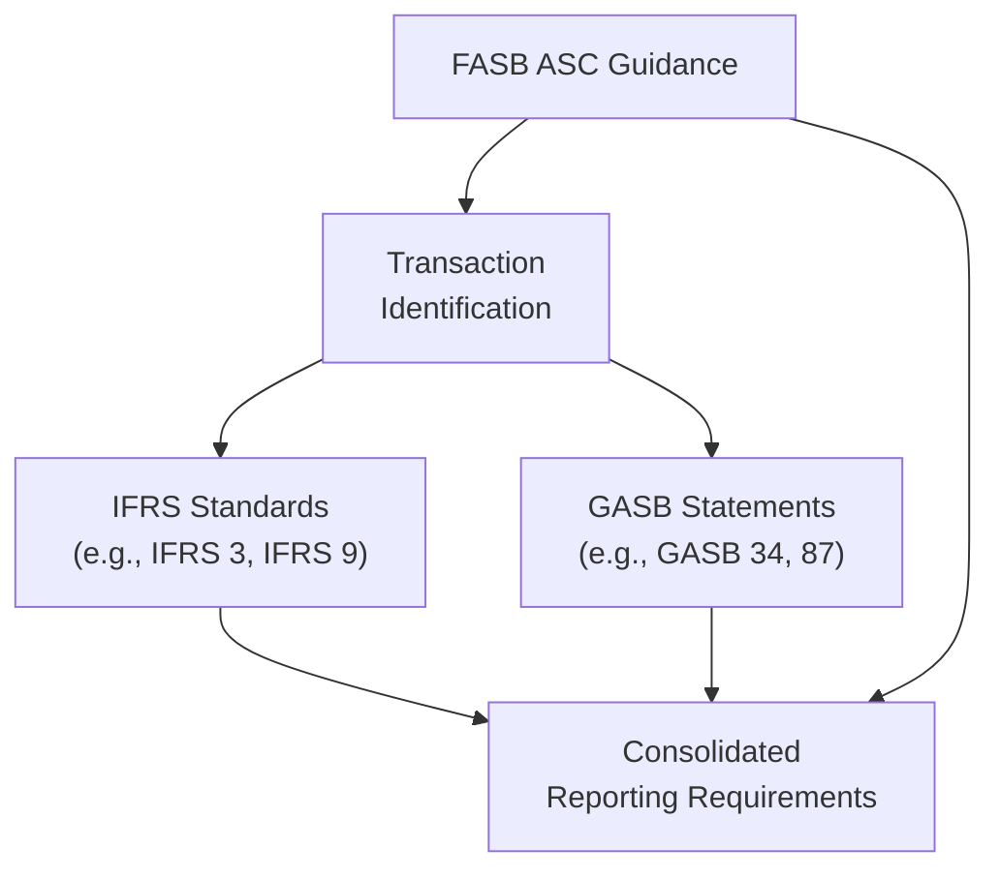
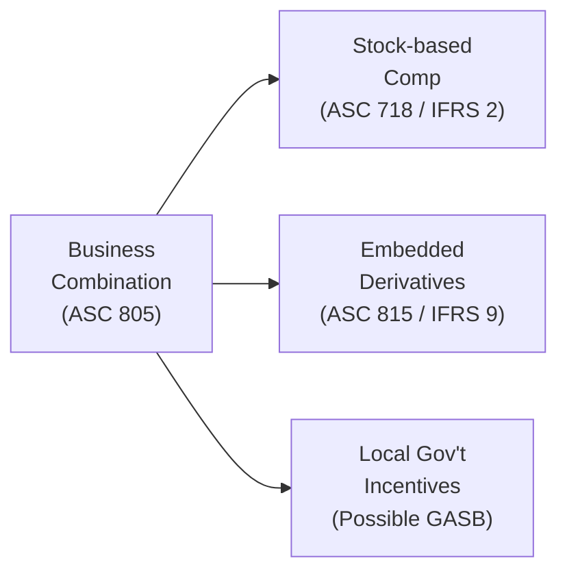

## 30.2 Authoritative Literature Excerpts

Authoritative literature underpins every principle, standard, and practice discussed throughout this guide. For the Business Analysis and Reporting (BAR) exam, a working knowledge of relevant codifications—notably from the Financial Accounting Standards Board (FASB), International Financial Reporting Standards (IFRS), and the Governmental Accounting Standards Board (GASB)—reinforces your analytical abilities and strengthens your conceptual framework. This section presents authoritative references that complement and expand on the concepts detailed in previous chapters, with an emphasis on short citations and succinct explanations. These excerpts and references are intended to enhance your research skills rather than duplicate or replicate entire codified texts.

This chapter introduces you to the structure of authoritative literature, including U.S. GAAP (via FASB’s Accounting Standards Codification), IFRS promulgations, and GASB statements for state and local government reporting. Each reference is linked to specific topics found throughout Parts I–V of this guide, especially relevant for advanced analysis and the real-world application of reporting principles.

--------------------------------------------------------------------------------
  
### Purpose and Organization of Authoritative Citations

Authoritative citations in this section are organized to:
• Highlight key areas of the codification and correlate them to specific chapters in this guide.  
• Provide short references for further consultation (e.g., “ASC 805-10-05 for business combination scope”), without duplicating entire standard paragraphs.  
• Offer quick glimpses into IFRS and GASB references that mirror or contrast with U.S. GAAP.  
• Enhance your cross-functional research skills critical to the BAR exam’s case-based scenarios.  

Throughout the BAR exam, you will often encounter tasks requiring you to recall or locate references in authoritative literature quickly. Becoming familiar with standard numbering and general structure can expedite your ability to verify treatments for financial statements, managerial reports, and operational analyses.

--------------------------------------------------------------------------------

### Selected FASB Codification References

Below are frequently encountered FASB Accounting Standards Codification (ASC) references relevant to the Business Analysis and Reporting discipline. These short citations highlight essential concepts and where they connect with the content found in Parts II, III, and IV of this guide.

#### Financial Statement Analysis and Ratios

• ASC 205 – Presentation of Financial Statements  
  - Provides guidelines for the classification and presentation of financial information.  
  - Explored in Chapter 4 (Financial Statement Analysis) and Chapter 9 (Valuation Techniques).  

• ASC 220 – Comprehensive Income  
  - Covers the reporting of items that bypass net income but affect equity.  
  - Connects to advanced performance measurement in Chapter 6 (Non-Financial and Non-GAAP Measures) and ratio analysis for comprehensive income statements.

#### Revenue Recognition

• ASC 606 – Revenue from Contracts with Customers  
  - Central to understanding revenue recognition criteria, performance obligations, and variable considerations.  
  - Heavily cross-referenced in Chapter 12 (Revenue Recognition).  
  - Ties into forecasting models (Chapter 7) and prospective analysis (Chapter 8) when building robust financial projections.

#### Intangible Assets and Goodwill

• ASC 350 – Intangibles—Goodwill and Other  
  - Outlines recognition, measurement, and impairment testing of intangible assets, including goodwill.  
  - Explored in Chapter 10 (Indefinite-Lived Intangible Assets and Goodwill) for acquisition-related accounting and subsequent measurement.

• ASC 730 – Research and Development  
  - Clarifies R&D expense treatment and intangible asset capitalization.  
  - Relevant in Chapter 11 (Internally Developed Software and R&D), particularly for differentiating research from development phases.  

#### Business Combinations and Consolidations

• ASC 805 – Business Combinations  
  - Governs accounting for mergers, acquisitions, and divestitures.  
  - Cross-referenced in Chapter 9 (Valuation Techniques and Investment Decisions) and Chapter 14 (Business Combinations, Consolidations, and Foreign Operations).  

• ASC 810 – Consolidation  
  - Details how to consolidate subsidiaries, variable interest entities (VIEs), and noncontrolling interests.  
  - Ties to Chapter 14’s advanced coverage of consolidation complexities and foreign currency transactions.  

#### Managerial and Cost Accounting Overlaps (Limited Codification Guidance)

While managerial and cost accounting are more internal processes, certain codification references like ASC 330 (Inventory), ASC 705 (Cost of Sales), and ASC 710 (Compensation) may be relevant in managerial analysis. Chapters 5 (Managerial and Cost Accounting Essentials) and 8 (Risk Assessment and Prospective Analysis) discuss these overlaps, illustrating how external reporting interacts with internal data.

#### Leases and Off-Balance Sheet Conduct

• ASC 842 – Leases  
  - Establishes new regulations for recognizing lease assets and liabilities.  
  - Chapters 16 (Leases – Lessor Accounting and Sale-Leaseback) and 17 (Public Company Reporting Essentials) highlight the financial statement presentation and disclosure complexities.  

#### Stock-Based Compensation

• ASC 718 – Compensation—Stock Compensation  
  - Governs measurement, classification, and recognition of equity-based compensation.  
  - Closely aligned with Chapter 13 (Stock-Based Compensation), discussing vesting conditions and fair value measurement.  

#### Derivatives, Hedges, and Financial Instruments

• ASC 815 – Derivatives and Hedging  
  - Encompasses guidance on derivatives, including interest rate swaps, futures, and options.  
  - See Chapter 15 (Derivatives, Hedges, and Financial Instruments) for insights on hedge accounting, embedded derivatives, and presentation.  

--------------------------------------------------------------------------------

### IFRS References for Comparative Analysis

Candidates may encounter scenarios contrasting IFRS with U.S. GAAP. A robust understanding of IFRS parallels or differences is beneficial in multinational transactions or broad-based analysis. While many IFRS standards address topics similar to FASB guidance, the structural organization differs. Below are key references with short citations.

#### IFRS 15 – Revenue from Contracts with Customers

• Mirrors ASC 606 with its five-step model; includes various illustrative examples.  
• Relevant in cross-border transactions or when referencing IFRS-based financials in Chapter 12 (Revenue Recognition).  

#### IFRS 3 – Business Combinations

• Aligns with ASC 805 in many respects but has differences in measuring noncontrolling interests and goodwill.  
• Explored in Chapter 9 (Valuation Techniques) and Chapter 14 (Business Combinations) when evaluating synergy assessments in M&A deals.

#### IFRS 16 – Leases

• Corresponds to ASC 842; both emphasize right-of-use asset and lease liability recognition on balance sheets.  
• Chapter 16’s coverage of lessor accounting and sale-leaseback transactions highlights IFRS 16’s approach for lessor income and residual values.  

#### IFRS 9 – Financial Instruments

• Overlaps ASC 815 (Derivatives), ASC 320 (Investments), and others. Covers classification and measurement of financial assets and liabilities, impairment, and hedging.  
• Chapter 15 (Derivatives, Hedges, and Financial Instruments) references IFRS 9’s categories for financial assets and expected credit loss model.  

#### IFRS 2 – Share-based Payment

• Parallel to ASC 718 in many respects, addressing recognition of stock-based compensation.  
• Ties to Chapter 13 (Stock-Based Compensation) for IFRS vs. U.S. GAAP differences in classification and fair value measurement.  

--------------------------------------------------------------------------------

### GASB References for State and Local Government Accounting

For candidates working with state and local governments, understanding GASB statements is vital. The following references correlate with Part IV (State and Local Government Accounting).

#### GASB 34 – Basic Financial Statements and Management’s Discussion and Analysis

• Foundation for governmental financial statement presentation (government-wide and fund-based).  
• Chapter 19 (Governmental Accounting Fundamentals) and Chapter 20 (Preparing Governmental Financial Statements) detail the modified accrual requirements and preparation steps.

#### GASB 54 – Fund Balance Reporting and Governmental Fund Type Definitions

• Defines the categories of fund balance (nonspendable, restricted, committed, assigned, unassigned).  
• Ties into Chapter 19 and Chapter 20 when illustrating fund structures and classification.  

#### GASB 68 – Accounting and Financial Reporting for Pensions

• Outlines pension liability recognition, discount rates, and net pension liabilities.  
• Reinforced in Chapter 18 (Employee Benefit Plans) and Chapter 22 (Specialized Transactions and Events) for state and local government contexts.

#### GASB 87 – Leases

• Establishes single-approach model for lease accounting in government entities, reflecting intangible right-to-use assets.  
• Chapter 16’s governmental perspective and Chapter 20’s proprietary fund statements highlight the interplay with private sector lease models under FASB or IFRS.  

--------------------------------------------------------------------------------

### Navigating Authoritative Literature Efficiently

The BAR exam often includes case-based questions requiring quick referencing of authoritative literature. Below is a practical approach to speed up your research:

1. Identify the Topic: Clearly define the issue at hand (e.g., intangible asset impairment, revenue recognition, or government fund accounting).  
2. Locate the Subtopic: In the FASB Codification, subtopics follow the major topic numbers. For IFRS or GASB, find the relevant standard.  
3. Review Recognition and Measurement Sections: A large portion of exam scenarios revolves around initial measurement, subsequent measurement, or derecognition.  
4. Check Disclosure Requirements: Many BAR questions include how to present or disclose items within financial statements.  

--------------------------------------------------------------------------------

### Practical Example: Comparing Revenue Recognition under ASC 606 and IFRS 15

An emerging software vendor, operating in both the U.S. and Europe, enters into contracts that bundle software licenses and implementation services. Under both ASC 606 and IFRS 15, the vendor must:

1. Identify the contract and the separate performance obligations.  
2. Determine the transaction price, including variable considerations (e.g., usage-based royalties).  
3. Allocate the transaction price to each performance obligation (software license vs. customized onboarding services).  
4. Recognize revenue when or as performance obligations are satisfied (over time for services, point in time for software license delivery).  

While the core five-step process is nearly identical, local regulatory nuances exist. For instance, IFRS 15 allows additional judgment in some disclosure aspects, while ASC 606 includes more prescriptive guidance in certain areas. In practice, both frameworks aim for a consistent depiction of revenue, yet subtle differences in judgment and disclosures persist.

--------------------------------------------------------------------------------

### Visualizing the Interplay Among Standards

When addressing multifaceted transactions—e.g., a business combination that includes goodwill, intangible assets, derivatives for hedging FX exposure, and stock-based compensation—it helps to visualize how multiple standards and boards intersect.  

This diagram underscores the importance of identifying the correct standard-setter(s) based on the nature of the entity and transaction. A software company with foreign subsidiaries might rely on IFRS references for local statutory reporting, while compliance with federal regulations (e.g., SEC) demands FASB standards. State and local government units must adhere to GASB pronouncements. Ultimately, a comprehensive vantage point ensures accurate, compliant, and cohesive reporting.

--------------------------------------------------------------------------------

### A Deeper Look at Research: The Codification’s Structure

Within the FASB Codification, you will encounter the following levels and organization:

• Areas: The broadest category (e.g., General Principles, Presentation, Assets).  
• Topics: Under each area (e.g., Topic 805 for Business Combinations).  
• Subtopics: Provide specificity (e.g., 805-10 for Overall Guidance, 805-20 for Identifiable Assets and Liabilities).  
• Sections: Delve into recognition, measurement, disclosure, etc.  
• Paragraphs: The most granular, binding guidance.

Similar hierarchical structures exist within IASB publications. However, IFRS organizes standards individually (e.g., IFRS 9, IFRS 15, IFRS 16), each with scope, definitions, recognition, and disclosure subsections. GASB statements apply a statement-by-statement approach, sometimes supplemented by implementation guides.

--------------------------------------------------------------------------------

### Common Pitfalls

1. Mixing U.S. GAAP and IFRS Guidance Incorrectly: Ensure you remain clear on which framework you are applying.  
2. Overlooking Scope Exceptions: Some subtopics have exceptions for specific industries or transaction types.  
3. Failing to Disclose Properly: The exam often tests not just measurement but how to present results in financial statements.  
4. Confusing Modified Accrual with Full Accrual: Particularly in state and local government accounting, candidates must watch for baseline measurement and recognition differences.  

--------------------------------------------------------------------------------

### KaTeX Illustration: Discounting Tools

Authoritative literature often references discounted cash flow (DCF) techniques. In IFRS 9 and ASC 820 (Fair Value Measurement), the idea of discounting future cash flows is central:


\text{PV of Cash Flows} = \sum_{t=1}^{n} \frac{CF_t}{(1 + r)^t}


Where:  
• CFₜ = estimated cash flow in period t.  
• r = discount rate (or Weighted Average Cost of Capital, as applicable).  
• n = number of periods over which cash flows are projected.

This formula is the backbone of valuations under IFRS 9, IFRS 16 (lease liabilities), ASC 805 (acquired intangible valuations), and more. Familiarizing yourself with the time value of money concept is vital for analyzing a range of items from capital budgeting to goodwill impairment tests.

--------------------------------------------------------------------------------

### Case Study: Hybrid Arrangements Requiring Multiple Standards

A manufacturing conglomerate acquires a target overseas. The deal includes embedded derivatives in certain supply contracts, intangible assets for proprietary technology, and share-based compensation to the target’s key employees upon closure. The following references may apply:

• ASC 805 (Business Combinations): Initial recognition and measurement.  
• ASC 815 (Derivatives and Hedging): Identifying embedded derivatives in the supply contracts.  
• IFRS 2 (Share-Based Payment) or ASC 718 if the arrangement stems from a cross-border perspective.  
• IFRS 9 or ASC 815 for ongoing fair value measurement of derivatives.  
• Local government incentives, if any portion of the manufacturing plant is subsidized, might involve referencing GASB in certain sub-entities (though typically, GASB would be less relevant for a private conglomerate unless dealing with a government-run entity).  

Visually, you can think of each portion of the transaction as a puzzle piece, requiring separate references:

Each rectangular node addresses a different authoritative domain, ensuring appropriate recognition, measurement, and subsequent accounting.

--------------------------------------------------------------------------------

### Best Practices in Using the Literature

• Keep Updated: The FASB, IASB, and GASB issue updates regularly. Stay informed on Accounting Standards Updates (ASUs), IFRS amendments, and GASB statements.  
• Practice Targeted Searches: Use the FASB Codification’s search tools effectively. If researching intangible impairment, try searching “impairment intangible ASC 350” in the codification tool.  
• Maintain a Research Log: Document your references with direct citations in practice sessions, so you can confidently replicate the process in an exam setting.  
• Consult Implementation Guides: GASB and IFRS often publish supplemental guides that clarify ambiguous topics with examples.

--------------------------------------------------------------------------------

### Suggested References for Further Reading

• FASB Codification Site: https://asc.fasb.org  
• IFRS Foundation: https://www.ifrs.org/issued-standards/list-of-standards/  
• GASB Official Website: https://www.gasb.org/home  
• IFRS Interpretations Committee Agenda Decisions: Explores real-world issues that often arise in practice.  
• AICPA Online Resources: Offers curated guidance, briefs, and practice aids addressing evolving topics such as cryptoassets or sustainability reporting.  

--------------------------------------------------------------------------------

### Conclusion

Authoritative literature excerpts represent the essential framework that underpins all accounting, reporting, and analytical tasks you will face during the BAR exam. By becoming proficient in referencing and interpreting guidance from FASB, IFRS, and GASB, you build a robust foundation for addressing both straightforward and complex scenarios. This skill—anchored in precise identification, measurement, and disclosure requirements—positions you for success not only on the exam but in any professional setting that demands compliance, clarity, and analytical rigor.

Use the references provided in this section as a springboard for in-depth research. Revisit codification paragraphs when encountering intricate points—whether intangible assets, derivative hedges, governmental funds, or enterprise-wide IFRS conversions. Continuous practice with authoritative literature transforms static memorization into dynamic problem-solving, enabling you to approach the BAR exam’s challenges with confidence and competence.

--------------------------------------------------------------------------------

## Authoritative Literature & Accounting Standards Quiz



### Which of the following is the primary standard governing goodwill impairment under U.S. GAAP?  
- [ ] ASC 606  
- [ ] ASC 718  
- [x] ASC 350  
- [ ] IFRS 3  

> **Explanation:** ASC 350, Intangibles—Goodwill and Other, establishes the accounting for goodwill impairments.  

### Under IFRS, which standard aligns closely with U.S. GAAP’s ASC 606 on revenue recognition?  
- [ ] IFRS 9  
- [x] IFRS 15  
- [ ] IFRS 16  
- [ ] IFRS 10  

> **Explanation:** IFRS 15, Revenue from Contracts with Customers, is the direct equivalent to ASC 606 in many respects.  

### For state and local government accounting, which GASB standard introduced the government-wide financial statements?  
- [x] GASB 34  
- [ ] GASB 54  
- [ ] GASB 68  
- [ ] GASB 87  

> **Explanation:** GASB 34 requires government-wide statements and expanded governmental fund reporting.  

### What is the primary objective of ASC 805?  
- [ ] To govern lease classification for lessors  
- [ ] To provide definitions for stock-based compensation  
- [x] To outline the accounting for business combinations  
- [ ] To set forth ranking criteria for government funds  

> **Explanation:** ASC 805 covers business combinations, explaining how to recognize assets, liabilities, and any goodwill or gains on the purchase.  

### Which codification topic deals primarily with derivative instruments and hedging activities?  
- [ ] ASC 718  
- [x] ASC 815  
- [ ] ASC 740  
- [ ] ASC 205  

> **Explanation:** ASC 815, Derivatives and Hedging, governs the accounting for derivative instruments, hedge relationships, and their related disclosures.  

### Which IFRS standard regulates the recognition and measurement of financial assets and liabilities?  
- [ ] IFRS 2  
- [ ] IFRS 15  
- [x] IFRS 9  
- [ ] IFRS 16  

> **Explanation:** IFRS 9 covers the classification, measurement (including impairment), and hedging for financial instruments.  

### GASB 54 primarily addresses:  
- [ ] Pension reporting for state entities  
- [ ] Derivatives in local government  
- [x] Fund balance reporting and governmental fund definitions  
- [ ] Interfund transfers  

> **Explanation:** GASB 54 clarifies fund balance classifications and defines when each type of governmental fund is to be used.  

### Which codification topic offers guidance on intangible assets, such as patents and trademarks, for U.S. GAAP?  
- [ ] ASC 606  
- [ ] ASC 842  
- [ ] ASC 830  
- [x] ASC 350  

> **Explanation:** ASC 350 addresses intangible assets (both finite- and indefinite-lived) and includes guidance on amortization and impairment.  

### ASC 718 primarily deals with:  
- [x] Stock-based compensation  
- [ ] Revenue from contracts with customers  
- [ ] Retirement benefits  
- [ ] Nonexchange transactions  

> **Explanation:** ASC 718 covers compensation in the form of equity awards, stock options, and other share-based payments.  

### True or False: IFRS 16 requires both lessees and lessors to recognize a right-of-use asset and corresponding liability for nearly all lease contracts, mirroring ASC 842 closely.  
- [x] True  
- [ ] False  

> **Explanation:** IFRS 16 is substantially converged with ASC 842, requiring lessees to recognize ROU assets and lease liabilities; differences exist but the core model is similar.  



--------------------------------------------------------------------------------

## For Additional Practice and Deeper Preparation

### [Business Analysis and Reporting (BAR) CPA Mock Exams](https://www.udemy.com/course/bar-cpa-mock-exams/?referralCode=ADBE2E84BEE9CB6243CA)

**Business Analysis and Reporting (BAR) CPA Mocks:** 6 Full (1,500 Qs), Harder Than Real! In-Depth & Clear. Crush With Confidence!  

- Tackle full-length mock exams designed to mirror real BAR questions.  
- Refine your exam-day strategies with detailed, step-by-step solutions for every scenario.  
- Explore in-depth rationales that reinforce higher-level concepts, giving you an edge on test day.  
- Boost confidence and minimize anxiety by mastering every corner of the BAR blueprint.  
- Perfect for those seeking exceptionally hard mocks and real-world readiness.  

_Disclaimer: This course is not endorsed by or affiliated with the AICPA, NASBA, or any official CPA Examination authority. All content is for educational and preparatory purposes only._
