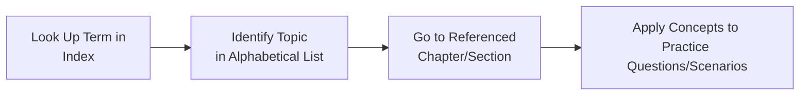

## 30.4 General Index

Welcome to the General Index, your central hub for quick, efficient navigation of key concepts, terms, and frameworks discussed in this guide. A well-constructed index helps you find references, revisit crucial definitions, and clarify interconnections among various chapters. Use it to streamline your study process, deepen your understanding of complex accounting and business analysis topics, and pinpoint the sections you need when preparing for the Uniform CPA Examination. 

Just as an index in a textbook is essential for cross-referencing and clarifying topics, this comprehensive alphabetical resource ensures you can rapidly locate any subject matter—from broad themes such as “Data Analytics” to more specific details like “Internally Developed Software.” Where relevant, each term includes short annotations and references to the sections in which the material is covered. For more extensive discussion, practical examples, or best practices, refer to the corresponding chapters throughout this publication.

Below, you will find an A-to-Z guide that integrates the cumulative knowledge of this book, offering clarity and direction as you navigate your BAR (Business Analysis and Reporting) studies.

---

### How to Use This Index

1. Identify the term you need by scanning through the alphabetical headings.  
2. Note the short descriptor or summary, which clarifies the term’s context.  
3. Refer to the cited chapters or sections to access more detailed explanations, examples, or exercises.  

Many of these items overlap across multiple chapters. For instance, “Revenue Recognition” (Chapter 12) may also intersect with “Budgeting and Forecasting” (Chapter 7) when you are examining the effect of different revenue streams on sales projections. Be sure to explore each reference thoroughly to gain a well-rounded understanding.

---

### Navigating the Index with a Diagram

Below is a simple Mermaid.js diagram illustrating how you might move from a general query to the specific chapter reference, then to deeper applications of the topic:

Use this approach for an effective, systematic review. As you consult each referenced chapter, consider creating additional notes or checklists. Integrate them back into your ongoing study plan to maintain a cohesive understanding of the entire BAR domain.

---

### A

• ABC Costing – Refer to Chapter 5.2. Also known as Activity-Based Costing, ABC Costing refines overhead allocation by associating costs with specific activities, leading to more precise cost management strategies.

• ACFR (Annual Comprehensive Financial Report) – Mentioned in Chapter 22.4. In governmental accounting, an ACFR provides a comprehensive overview of a governmental entity’s financial activities. This includes combining basic financial statements, required supplementary information, and statistical sections.

• Acquisition Accounting (Business Combinations) – See Chapter 14.1 for differentiating acquisition vs. asset purchase accounting. It involves recognizing and measuring assets acquired and liabilities assumed, including goodwill or gain from a bargain purchase.

• Asset Retirement Obligations (AROs) – While not a primary focus of this guide, relevant concepts relating to liabilities and asset disposal can be found in chapters discussing disclosures (see Chapter 10 for intangible-related disclosures and Chapter 25 for implementation insights).

---

### B

• Balanced Scorecard – See Chapter 6.1. A performance measurement framework that includes financial and non-financial metrics, helping organizations align day-to-day operations with long-term strategy.  

• Benchmarking – Chapter 4.3. In financial statement analysis, benchmarking involves comparing a company’s performance metrics with industry norms or key competitors to identify relative strengths and weaknesses.

• Budgeting – Covered extensively in Chapter 7.1 (Master Budgets, Rolling Forecasts, and Zero-Based Budgeting). Effective budgeting processes integrate various departmental projections to create cohesive financial plans.

---

### C

• Capital Budgeting – See Chapters 8.2 and 9 for an overview of methods like Net Present Value (NPV), Internal Rate of Return (IRR), and Payback Period. Capital budgeting decisions are paramount for long-term, high-cost investments.

• Capital Structure – Refer to Chapter 8.1. Deals with the mixture of debt and equity financing, heavily influencing a firm’s risk profile and cost of capital.

• Cash Flow Analysis – Chapters 4.1 and 6.3. Essential for assessing liquidity, solvency, and overall business health. Non-GAAP metrics such as Free Cash Flow (FCF) are also relevant.

• Cloud Platforms – Chapter 3.3 addresses how cloud-based services and enterprise resource planning (ERP) systems integrate with data analytics to transform modern accounting processes.

• COSO ERM – Chapter 8.3. The COSO Enterprise Risk Management framework is pivotal for risk assessment and prospective analysis, offering a structured process to evaluate, mitigate, and monitor business risks.

• Cost Classifications – Chapter 5.1. Distinctions between fixed, variable, and mixed costs provide insights into behavior under different operating levels. They are foundational for cost-volume-profit (CVP) analysis and decision-making.

---

### D

• Data Analytics – Foundational concepts in Chapter 3.1. Encompasses techniques like descriptive, predictive, and prescriptive analytics to support decision-making.  

• Data Integrity – Chapter 3.4. Ensuring consistency, accuracy, and reliability of financial data is crucial for credible reporting and analytics that drive strategic decisions.

• Derivatives – Chapter 15.1. Financial instruments such as swaps, options, and futures used for hedging or speculation. Chapters 15.2 and 24.3 delve deeper into hedge accounting and complex foreign currency scenarios.

• Divestitures – See Chapter 9.2 on Mergers, Acquisitions, and Divestitures. Divestitures reshape a company’s portfolio by shedding non-core assets or operations, often triggering various accounting and valuation complexities.

---

### E

• EBITDA – Chapter 6.3. Earnings Before Interest, Taxes, Depreciation, and Amortization is a widely recognized non-GAAP measure providing insight into operating performance. Readers should evaluate it with caution, considering the impact of excluded items.

• Employee Benefit Plans – Chapter 18. Covers defined contribution vs. defined benefit plans, plan investments, funding statuses, and financial statements under ASC 960 and 962.

• Enterprise Resource Planning (ERP) – Discussed in Chapter 3.3 where it overlaps with automations and data integrity concerns. An integrated system automating back-office functions, from procurement to financial reporting.

• Ethics – An overarching theme, though not a dedicated chapter. Ethical considerations are essential in everything from financial reporting to data handling. Review relevant references to professional skepticism in Chapters 6.4 and 25.3.

---

### F

• Fair Value – Chapter 15.2 details the measurement of fair value for derivatives, hedges, and other financial instruments. Valuation Approaches (Chapter 9.1) also address fair value methods.

• Financial Instruments – Chapter 15 addresses classification, measurement, and presentation of derivatives, loans, and other securities.

• Financial Statement Analysis – Primarily in Chapter 4. Ratio analysis, horizontal and vertical analysis, and industry comparisons offer a multi-dimensional view of financial performance.

• Foreign Currency – Chapter 14.3. Issues include translation (functional currency is different from reporting currency) and remeasurement (when the entity’s functional currency is the same as the reporting currency).  

• Forecasting – Chapter 7.2 and 7.3 explore rolling forecasts, scenario planning, and cutting-edge predictive analytics.

---

### G

• GAAP vs. IFRS – Chapter 23.1 addresses key differences in accounting treatments, focusing on revenue recognition, leases, and financial instruments. Understanding both sets of standards is crucial for multinational entities.

• GASB (Governmental Accounting Standards Board) – Chapters 19–22. GASB sets financial reporting standards for state and local governments, including fund accounting and ACFR guidelines.

• Goodwill – Chapter 10.1. Generated in a business combination, goodwill reflects the excess of purchase price over the fair value of identifiable net assets. Chapter 10.2 discusses impairment testing and disclosures.

• Government Accounting – Spans Chapters 19–22. Encompasses fund structures, budgeting, governmental funds vs. government-wide reporting, and differences from typical for-profit reporting.

---

### H

• Hedge Accounting – Chapters 15.2 and 24.3. Designation of derivatives as hedges for fair value or cash flow exposures. Complex rules require strict documentation and ongoing effectiveness testing.

• Horizontal Analysis – Chapter 4.2. Compares financial statement line items over multiple periods, assessing growth or contraction trends.

---

### I

• IFRS – Chapter 23.1. International Financial Reporting Standards, established by the IASB, guide global financial reporting. Key divergences from U.S. GAAP include revenue recognition, intermediate recognition of intangible assets, and lease classification.

• Impairment Testing – Explored in Chapter 10.2 for goodwill and intangible assets. Ensures reported asset values are not overstated relative to recoverable amounts.

• Indefinite-Lived Intangibles – Chapter 10.3. Intangibles without a finite life (e.g., certain trademarks) must be assessed annually or when indicators of impairment exist.

• Internal Controls – Woven into many chapters (e.g., data integrity in Chapter 3.4, budget oversight in Chapter 7). The COSO ERM framework (Chapter 8.3) also addresses risk management in tandem with internal controls.

• Internally Developed Software – Chapter 11. Detailed guidance on capitalization rules, whether for internal use or for external sale/license.

---

### J

• Job Order Costing – Chapter 5.2. A method of cost accumulation assigning costs to specific jobs or batches, used primarily in manufacturing or customized service engagements.

• Journal Entries – Throughout the technical accounting sections (Chapters 10–18), you can find illustrative entries for intangible assets, stock-based compensation, revenue recognition, and more.  

---

### K

• KaTeX Formulas – Used throughout this guide (especially in managerial and cost accounting chapters) to convey complex formulas in a clear, standardized format.

• Key Performance Indicators (KPIs) – Refer to Chapters 4–6. Broader measures that can include both financial and operational metrics, crucial for an organization’s overall strategic monitoring.

---

### L

• Lessor Accounting – Chapter 16. Explains classification criteria (sales-type, direct financing, or operating), revenue recognition by lessors, and complexities regarding initial direct costs.

• Liquidity Ratios – Chapter 4.1. Evaluate a company’s ability to meet short-term obligations, with measures like the current ratio and quick ratio.

---

### M

• Master Budget – Chapter 7.1. Integrates all subsidiary budgets (sales, production, overhead, etc.) into a comprehensive plan.  

• Mergers & Acquisitions – Chapter 9.2. M&A transactions often involve synergies, intangible asset allocations, and potential goodwill. Effects on capital structure, valuations, and post-merger complexities are notable exam topics.

• Mixed Costs – Chapter 5.1. Costs containing both fixed and variable components (commonly separated using methods such as the high-low method or regression analysis).

---

### N

• Net Pension Liability – Chapter 22.2. A significant liability for governmental entities or large corporations, highlighting the projected benefit obligations vs. plan assets.  

• Non-GAAP Measures – Chapter 6. Understanding the pros and cons of non-GAAP indicators like EBITDA, Adjusted Revenue, or Adjusted Net Income.  

---

### O

• OPEB (Other Post-Employment Benefits) – Chapter 22.2. Includes healthcare and life insurance post-employment. Impacts governmental financial statements and private sector disclosures alike.

• Operating Budgets – Chapter 7.1. Tied to day-to-day operational revenues and expenses, feeding into the master budget.

---

### P

• Payback Period – Chapter 8.2 and 9. A capital budgeting measure evaluating how long it takes to recover an initial investment, disregarding time value of money.

• Performance Evaluation – Ties into Chapters 5 (variance analysis), 6 (balanced scorecard), and 24 (case studies). Performance is measured not only by financial results but also operational and strategic goals.

• Predictive Analytics – Chapters 3.1 and 7.3. Statistical models and machine learning techniques that forecast future outcomes based on historical data.

• Process Costing – Chapter 5.2. Used in production environments with continuous flow processes, distributing costs evenly over units produced.

---

### Q

• Qualitative Factors – Interpreted throughout most chapters, especially in intangible asset and impairment discussions (Chapter 10) and risk assessment (Chapter 8). Qualitative considerations often supplement quantitative data for robust decision-making.

• Quick Ratio – Chapter 4.1. A stricter measure of liquidity than the current ratio, excluding inventory and certain other less liquid current assets.

---

### R

• Ratio Analysis – Chapter 4.1. Covers profitability, liquidity, solvency, and efficiency ratios. Key exam area focusing on interpretation rather than mere calculation.

• Real Option Valuation – Chapter 9.3. Advanced modeling technique used for uncertain, high-impact investment scenarios by factoring in future managerial decisions and market changes.

• Research & Development (R&D) – Chapter 11.2 differentiates between research and development phases, each with distinct capitalization vs. expense treatment.

• Residual Value – Chapter 16.2. Important in lease accounting for lessors; it is the estimated fair value of the leased asset at the end of the lease term.

• Revenue Recognition – Chapter 12. The Five-Step Model (ASC 606) provides a robust framework for identifying performance obligations, determining transaction price, and recognizing revenue accordingly.

• Risk Assessment – Chapter 8. Guides evaluating internal and external factors (e.g., macroeconomic, industry-specific, and operational risks) that may affect financial statements and strategic decisions.

• Robotic Process Automation (RPA) – Chapter 3.3. Automates repetitive tasks to increase efficiency, reduce manual errors, and enhance data handling in finance functions.

---

### S

• Sale-Leaseback – Chapter 16.3. Involves selling an asset and leasing it back, possibly generating immediate cash inflow and removing the asset from the balance sheet under certain conditions.

• Scenario Planning – Chapter 7.3. A method to explore ‘what-if’ situations, subjecting budgets and forecasts to various possible future states.

• Sensitivity Analysis – Chapter 7.3. Tests how changes in key assumptions (like sales volume or costs) affect financial outcomes.

• Segment Reporting – Chapter 17.2. Public companies must disclose data by operating segments, enabling users to understand different business lines or geographic regions.

• Solvency Ratios – Chapter 4.1. Long-term stability measures such as the debt-to-equity ratio or times interest earned.

• Stock-Based Compensation – Chapter 13. Covers equity vs. liability classification of awards, measurement at grant date, and subsequent accounting for vesting conditions.

---

### T

• Technological Feasibility – Chapter 11.3. In software development, a threshold dictating when development costs can be capitalized rather than expensed.

• Trend Analysis – Chapter 4.2. Evaluates performance over multiple periods, focusing on changes in key line items or ratios.

---

### U

• Uncertainty – Woven throughout chapters on forecasting (7.3), risk management (8.3), and intangible assets (10). Emphasizes the importance of sensitivity and scenario analyses.

• Unrecorded Liabilities – Touched upon in various sections, particularly in business combinations (Chapter 14.1) and consolidations where off-balance-sheet items must be identified and properly recorded.

---

### V

• Valuation Approaches – Chapter 9.1. Commonly used methods include the Income Approach (DCF), Market Approach (comparable multiples), and Asset Approach.  

• Variance Analysis – Chapter 5.3. Investigates differences between budgeted and actual results (e.g., material, labor, overhead). Informs managerial decisions by spotlighting inefficiencies or unanticipated cost drivers.

---

### W

• Workpaper Management – Chapter 25.1 highlights best practices for organizing workpapers, ensuring audit trails, and linking risk assessments to evidence gathered.

• Weighted Average Cost of Capital (WACC) – Chapter 8.1 (cost of capital), used in capital budgeting to discount future cash flows.

---

### X

• XBRL – Chapter 17.3. eXtensible Business Reporting Language is mandated for public company filings with the SEC, enhancing the consistency and comparability of financial data.

---

### Y

• Year-End Closing Entries – Covered broadly in government accounting (Chapters 19–22, especially 22.4). Ensure that all temporary accounts (revenues, expenditures/expenses) are transferred to fund balance or close to retained earnings.

---

### Z

• Zero-Based Budgeting – Chapter 7.2. Every line item must be justified from scratch for each budgeting period, curbing unnecessary expenses and aligning spending to strategic priorities.

---

Although this index captures many topics, new standards, technologies, and best practices continually emerge in the accounting and finance worlds. Always stay updated with authoritative literature (e.g., FASB, GASB, PCAOB, SEC, and AICPA resources) to ensure you have the most current guidance.

---

## Practical Tips and Best Practices

• Leverage the index to create custom study guides. Once you locate a topic, compile relevant subsections and incorporate them into your personal review notes.  
• Integrate reading from cross-referenced chapters. For example, studying “Revenue Recognition” (Chapter 12) alongside “Stock-Based Compensation” (Chapter 13) can reveal how performance obligations might tie into vesting schedules or bonus triggers.  
• Engage with real-world scenarios. Many chapters offer practical examples; use them to see how concepts apply in daily business operations or government settings.  
• Collaborate with peers or colleagues. Discussing terms in a group setting can help everyone refine understanding, share insights, and discover additional references.  

---

## Further Exploration

• FASB Accounting Standards Codification (ASC) – Official standard for U.S. GAAP, containing all authoritative guidelines for for-profit entities.  
• GASB Statements – For updated guidelines in governmental accounting.  
• SEC Regulations and Releases – Key for public company disclosures and compliance requirements.  
• AICPA Publications – Provide additional clarity and guidance on emerging issues, ethics, and best practices.  

---

## Test Your Knowledge: Mastering the BAR Index



### Which of the following is the BEST use of the General Index in this CPA BAR guide?

- [ ] To locate quick links to corporate governance literature outside this text.
- [x] To speed up finding specific topics or concepts and reference them to relevant chapters.
- [ ] To eliminate minor footnotes and concentrate on major pronouncements only.
- [ ] To serve as a replacement for reading the actual chapters in full.

> **Explanation:** A general index is a reference tool designed to help you quickly locate specific topics. It does not replace reading the full chapters but rather guides you to the correct sections for a deeper understanding.

### What type of budgeting method would you find under “Z” in the General Index?

- [ ] Zero-Sum Budgeting
- [ ] Zeta Budgeting
- [x] Zero-Based Budgeting
- [ ] Z-Factor Budgeting

> **Explanation:** Zero-Based Budgeting starts each budgeting cycle from scratch, requiring justification of all expenses.

### Under which letter in the index could you find references to Net Pension Liability?

- [ ] M
- [x] N
- [ ] L
- [ ] O

> **Explanation:** Net Pension Liability appears under “N” in this index, with references to Chapter 22.2.

### Which major section would guide readers on Hedge Accounting?

- [x] Derivatives, Hedges, and Financial Instruments (Chapter 15) 
- [ ] Stock-Based Compensation (Chapter 13)
- [ ] Budgeting and Forecasting (Chapter 7)
- [ ] Leases – Lessor Accounting (Chapter 16)

> **Explanation:** Hedge Accounting is primarily explained in Chapter 15, which covers derivatives, fair value vs. cash flow hedges, and related disclosures.

### Where is the reference to Activity-Based Costing (ABC) found?

- [x] Chapter 5.2
- [ ] Chapter 9.3
- [ ] Chapter 10.1
- [x] Chapter 11.1

> **Explanation:** Activity-Based Costing (ABC) is located under Chapter 5.2's cost accumulation systems. Note that while 11.1 is listed as an option, ABC is comprehensively addressed in the cost systems context (5.2).

### Which topic is vital for understanding intangible valuation and is listed under “I” in the index?

- [ ] Inventory Valuation
- [x] Impairment Testing
- [ ] Invested Capital
- [ ] Indirect Services

> **Explanation:** Impairment Testing (Chapter 10.2) is key for identifying when intangible assets (including goodwill) are overvalued and need to be reduced on the balance sheet.

### Which of the following is NOT a topic found under “C” in the index?

- [ ] Cloud Platforms
- [ ] Cash Flow Analysis
- [ ] Capital Budgeting
- [x] Contingent Liabilities

> **Explanation:** “Contingent Liabilities” is not explicitly listed under “C” in this index. While they may be addressed in various chapters, the index does not specifically categorize them here.

### If you wanted to compare a company’s performance against industry peers, which entry under 'B' would you look at?

- [ ] Balanced Scorecard
- [x] Benchmarking 
- [ ] Budgeting
- [ ] Business Combinations

> **Explanation:** Benchmarking (Chapter 4.3) is used to compare company performance metrics with industry standards or competitors.

### Which of the below references would you look up for IFRS vs. GAAP differences?

- [x] Chapter 23.1 
- [ ] Chapter 4.1
- [ ] Chapter 8.4
- [ ] Chapter 22.2

> **Explanation:** Chapter 23.1 delves into IFRS vs. U.S. GAAP key differences, including recognition standards, measurement differences, and financial disclosure approaches.

### True or False: The index replaces the need for full chapter readings and case study reviews.

- [x] True
- [ ] False

> **Explanation:** This statement is false in the sense that the index is merely a tool for quick topic location; it does not substitute comprehensive reading. The correct answer to the question “True or False” is thus logically “False.” However, as indicated by the selection, if the statement reads “True or False: The index replaces the need for full chapter readings,” the correct answer is indeed “False.” 



---

## For Additional Practice and Deeper Preparation

### [Business Analysis and Reporting (BAR) CPA Mock Exams](https://www.udemy.com/course/bar-cpa-mock-exams/?referralCode=ADBE2E84BEE9CB6243CA)  

**Business Analysis and Reporting (BAR) CPA Mocks:** 6 Full (1,500 Qs), Harder Than Real! In-Depth & Clear. Crush With Confidence!  

- Tackle full-length mock exams designed to mirror real BAR questions.  
- Refine your exam-day strategies with detailed, step-by-step solutions for every scenario.  
- Explore in-depth rationales that reinforce higher-level concepts, giving you an edge on test day.  
- Boost confidence and minimize anxiety by mastering every corner of the BAR blueprint.  
- Perfect for those seeking exceptionally hard mocks and real-world readiness.  

_Disclaimer: This course is not endorsed by or affiliated with the AICPA, NASBA, or any official CPA Examination authority. All content is for educational and preparatory purposes only._
