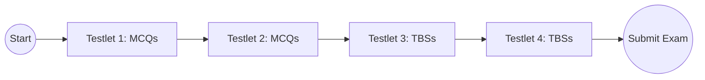

## 1.1 Purpose and Format of the CPA Exam

The Certified Public Accountant (CPA) Exam is a rigorous professional credentialing test administered by the American Institute of Certified Public Accountants (AICPA). Its purpose is to ensure that entry-level CPAs have demonstrated the requisite technical knowledge and skills needed to protect the public interest in the areas of accounting, audit, taxation, and business law. Because of its robust content, significant preparation, persistence, and a strategic study plan are critical for success.

This article provides an in-depth look at the purpose and format of the CPA Exam, including its structural components, the variety of question types, timing, and the topical coverage across the four main sections of the exam. Emphasis is placed on the Financial Accounting and Reporting (FAR) section, though many of the details similarly apply to the other sections. Understanding the exam’s layout and question types is of paramount importance, as it influences how you allocate study time, approach practice questions, and ultimately manage your exam-day strategy.

--------------------------------------------------------------------------------

### The Purpose of the CPA Exam

1. Safeguarding the Public Interest.  
   The CPA designation carries significant responsibility due to the reliance placed on financial statements by investors, creditors, regulatory agencies, and other stakeholders. Consequently, the CPA Exam focuses on identifying individuals with the depth of knowledge and ethical grounding necessary to fulfill these public responsibilities.

2. Setting a Uniform Standard.  
   The Unified CPA Examination is the single benchmark for aspiring CPAs in the United States, ensuring consistent quality and competency among new licensees, regardless of their state of licensure.

3. Ensuring a Broad Knowledge Base.  
   From financial reporting rules to governmental accounting, tax regulations, auditing, and ethics, the CPA Exam’s comprehensive approach ensures new CPAs have both breadth and depth in essential areas. FAR, in particular, is known for its detailed financial accounting standards coverage, including nongovernmental not-for-profit entities, state and local governmental entities, and public company reporting.

4. Reinforcing Professional Skepticism.  
   The exam promotes critical thinking and professional skepticism. Regardless of the exam section, candidates must show they can analyze, evaluate, and apply accounting standards to real-world scenarios, which is vital for ethical and accurate reporting.

--------------------------------------------------------------------------------

### Overview of the CPA Exam’s Structure

The CPA Exam has four distinct sections:

• Auditing and Attestation (AUD)  
• Business Environment and Concepts (BEC)  
• Financial Accounting and Reporting (FAR)  
• Regulation (REG)

Each section is taken and scored independently. Candidates typically sit for these sections one at a time, though they can take them in any order that suits their schedule and state board requirements. However, once a candidate successfully passes one exam section, a rolling 18-month window begins, during which the candidate must pass the remaining sections. Candidates who fail to meet this deadline risk losing credit for passed sections.

#### Exam Length and Timing

Effective January 2024 (continuing into 2025 and beyond, subject to official changes), each CPA Exam section is structured as follows:

• Each section of the exam is 4 hours (240 minutes) in length.  
• Candidates are provided brief breaks between testlets and a longer optional break, but the clock continues to run, so time management becomes crucial.

The total of 16 hours for the entire CPA Exam ensures that each area of competency is thoroughly evaluated. Because FAR is frequently considered one of the broader sections, understanding time management and question pacing is essential for success.

#### Question Types: MCQs and TBSs

Each exam section consists of testlets containing a combination of Multiple-Choice Questions (MCQs) and Task-Based Simulations (TBSs). Some sections, such as BEC, previously included Written Communication tasks, but adjustments by the AICPA have continually evolved the exam format to meet shifting demands.

1. Multiple-Choice Questions (MCQs).  
   • Typically, each exam section has a set of two testlets containing MCQs.  
   • MCQs are presented in a 4-option format, with only one correct answer.  
   • They assess knowledge ranging from basic concepts (e.g., definitions, formulas) to more complicated scenarios (e.g., the application of GAAP or IFRS).  
   • The difficulty level of MCQs is tailored by the AICPA's adaptive testing model. Performance on the first set of MCQs can influence the difficulty of the second set.  
   • Example (FAR context): “Which of the following items is included in accumulated other comprehensive income (AOCI)?” This question ensures you’ve mastered concepts from unrealized gains on AFS securities to foreign currency translation adjustments.

2. Task-Based Simulations (TBSs).  
   • TBSs are scenario-driven exercises that assess a candidate’s ability to apply knowledge and professional judgment.  
   • Each TBS could include several questions that require analysis of exhibits, journal entries, calculations, or concept application.  
   • TBSs often mimic real-life tasks, requiring understanding of transaction flows, financial statement preparation, or audit procedures.  
   • Within FAR, TBSs can cover advanced topics such as the correct classification of government fund activities or the allocation of intangible asset impairment within consolidated statements.  
   • Example (FAR context): A TBS might present partial financial statements and footnotes for a mid-size manufacturing corporation, asking you to correct misstated revenue recognition entries per ASC 606, or to calculate deferred taxes arising from an accelerated depreciation method.

-------------------------------------------------------------------------

### Exam Format in Practice

Below is a general look at how the CPA Exam testlets might be arranged. The following diagram demonstrates a simplified flow of the exam for any given section (the number of testlets and their contents may vary depending on the exam section, but the structure remains similar):

• Testlets 1 & 2: Typically multiple-choice questions (MCQs).  
• Testlets 3 & 4: Typically task-based simulations (TBSs).  

FAR adheres to a similar structure. Each testlet must be completed before moving on to the next one. Candidates cannot move backward once a testlet is submitted, necessitating strategic awareness of time usage.

-------------------------------------------------------------------------

### General Content Areas in the CPA Exam

Although the primary focus here is the Financial Accounting and Reporting (FAR) section, a high-level perspective of content areas across all sections reveals the depth and scope of the CPA Exam:

• FAR (Financial Accounting and Reporting)  
  - Conceptual Framework, Standard-setting, and Financial Reporting  
  - Select Financial Statement Accounts (Cash, Receivables, Inventory, PPE, Liabilities, Equity)  
  - Revenue Recognition, Leases, Investments, Fair Value, etc.  
  - Governmental Accounting (State & Local) and Not-For-Profit Accounting  
  - IFRS Comparisons  

• AUD (Auditing and Attestation)  
  - Ethics, Independence, and Professional Conduct  
  - Risk Assessment, Evidence, and Response to Risk  
  - Forming Conclusions and Reporting  
  - Professional Responsibilities  

• REG (Regulation)  
  - Ethics and Professional Responsibility  
  - Federal Taxation (Individuals, Entities)  
  - Business Law  
  - Federal Taxation of Property Transactions  

• BEC (Business Environment and Concepts)  
  - Corporate Governance  
  - Economic Concepts and Analysis  
  - Financial Management  
  - Information Technology  
  - Operations Management  

Each section is designed to assess competencies outlined in the AICPA Blueprint. While each has its own emphasis, the synergy among them prepares candidates to address a wide range of professional situations. For FAR specifically, it is vital to master the intricacies of financial statement presentation, tax entry calculations, and advanced topics like pension accounting or complex consolidations.

The depth of FAR can be attributed to the large number of standards covered and the variety of possible question scenarios. Detailed coverage of everything from fundamental financial statements to specialized accounting treatments for nonprofits and governmental entities ensures that candidates are thoroughly tested on their conceptual understanding, technical proficiency, and ability to apply GAAP in practical settings.

-------------------------------------------------------------------------

### Why Format Insight Matters for FAR

1. Study Planning and Time Allocation.  
   Knowing that FAR includes two MCQ testlets and two TBS testlets gives you a roadmap for your study plan. Since TBSs often require a more in-depth application of concepts, you might allocate extra time to practicing simulation-style problems. Recognizing the structured progression from MCQs to TBSs helps in pacing yourself so that you do not exhaust all available testing time prematurely.

2. Efficient Resource Utilization.  
   By understanding the weighting and distribution of MCQs and TBSs, FAR candidates can tailor review courses, question banks, and other learning resources accordingly. For instance, candidates who struggle with conceptual application should invest heavily in TBS practice, since that’s typically where deeper conceptual application is tested.

3. Mastery of Broad Topics.  
   From intangible assets and foreign currency transactions to complex equity transactions and consolidated statements, FAR demands a significant breadth of knowledge. Being mindful of how the exam compartments—MCQs for fundamental knowledge checks and TBSs for problem-solving—can help you ensure consistent coverage across the entire FAR blueprint.

4. Psychological Preparedness.  
   Understanding the exam format reduces pre-exam anxiety. Familiarity with question styles and the adaptive nature of MCQ testlets fosters confidence, allowing you to concentrate on demonstrating your knowledge rather than worrying about surprises on exam day.

5. Effective Time Management.  
   In FAR, you must typically maneuver through 66 MCQs and 8 TBSs (the exact number can vary slightly). If you are unaware of the typical question counts, you risk spending too much time on the first testlet and not having enough time for the advanced tasks in the TBSs. By anticipating the exam flow and question types, you can allocate each minute more judiciously.

-------------------------------------------------------------------------

### Practical Example and Case Study

Consider a FAR candidate named Alex. Before the exam, Alex invests time learning the structure of FAR:

• Alex anticipates 2 MCQ testlets with 33 MCQs each and 2 TBS testlets with 4 TBSs each.  
• Knowing the first two testlets are MCQs, Alex plans to answer them within about half of the total testing time (two hours combined), leaving the remaining time for TBS testlets.  
• Alex regularly practices simulations that incorporate multiple steps—journal entries, ratio computation, short narratives—mimicking the depth and complexity of real TBSs.  
• During practice sessions, Alex manages to finish MCQ sets quickly, saving time for TBSs that require deeper interpretation of financial disclosures and note references.  

On exam day, this approach gives Alex confidence in pacing through the testlets. Since Alex is not surprised by the format, the transition from MCQs to TBSs is smoother, resulting in efficient time usage and minimized stress. This scenario underscores how vital exam-specific format knowledge can be for overall performance.

-------------------------------------------------------------------------

### Tables and Charts for Quick Reference

Below is a simplified table summarizing the time structure and question distribution across all CPA Exam sections (note that exact figures may vary slightly based on the AICPA’s periodic updates).

| Section | Total Testing Time | # of Testlets | MCQs (Approx.) | TBSs (Approx.) |
|---------|--------------------|---------------|----------------|----------------|
| AUD | 4 hours | 5 testlets total | ~72 MCQs | ~8 TBSs |
| BEC | 4 hours | 5 testlets total | ~62 MCQs | ~4 TBSs (+ Written) |
| FAR | 4 hours | 5 testlets total | ~66 MCQs | ~8 TBSs |
| REG | 4 hours | 5 testlets total | ~76 MCQs | ~8 TBSs |

This snapshot, while subject to future modifications, helps you budget your time and anticipate question styles. FAR stands out due to its breadth of content and the significant volume of TBS tasks.

-------------------------------------------------------------------------

### Best Practices for Leveraging Exam Format

• Practice Under Timed Conditions.  
  Attempt practice exams that replicate the timing and structure of the real CPA Exam. This helps you recognize areas where you might need to speed up or allocate more study time.

• Use the Tutorial and Sample Tests from the AICPA.  
  The AICPA provides sample tests and tutorials demonstrating how to navigate the exam interface. Review them thoroughly to avoid technical surprises on exam day.

• Learn to Navigate TBS Exhibits Effectively.  
  Simulations often include multiple linked exhibits: financial statements, memos, spreadsheets, etc. Familiarity with switching between these exhibits and locating the right data quickly can save you valuable minutes.

• Develop a Personal Strategy for MCQs.  
  Some candidates prefer answering MCQs quickly and marking items for review. Others carefully pace themselves, ensuring each question is thoroughly considered without returning. Find an approach that works for you and practice it.

• Incorporate IFRS Comparisons During Preparation.  
  Since FAR includes IFRS vs. GAAP comparisons, try to anticipate TBSs where you might have to reconcile or compare IFRS-based figures with U.S. GAAP. These unique tasks often appear in simulations.

-------------------------------------------------------------------------

### References and Further Exploration

• AICPA (Official CPA Exam). The AICPA’s website offers the most up-to-date details on exam formats, blueprints, and practice resources:  
  https://www.aicpa.org/becomeacpa/cpaexam

• NASBA (National Association of State Boards of Accountancy). Check your state’s licensure requirements:  
  https://nasba.org/

• Publication: Wiley CPA Exam Review. Comprehensive coverage of each exam section, including practice questions and exam strategies.  

• Online Courses: Many platforms offer specialized courses focusing on FAR or TBS mastery. Choose one that provides ample practice materials and timely updates.

• Peer Study Groups: Joining a local CPA candidate group or an online community can facilitate the exchange of tips, experiences, and motivational support.

--------------------------------------------------------------------------------

## Mastering the CPA Exam Structure: Interactive Quiz



### The main purpose of the CPA Exam is:

- [x] To ensure that entry-level CPAs possess sufficient knowledge and skills to protect the public interest.
- [ ] To eliminate competition among accounting professionals.
- [ ] To provide an easier way for companies to recruit financial analysts.
- [ ] To serve as a mandatory requirement for bookkeepers.

> **Explanation:** The CPA Exam aims to ensure candidates meet the standardized competency and ethics requirements to serve the public interest.

### Which statement best describes how multiple-choice questions (MCQs) are presented on the CPA Exam?

- [x] They generally appear in two testlets, providing both easier and more challenging question sets.
- [ ] They only appear in one testlet at the start of the exam.
- [x] They can use adaptive difficulty, where the test adjusts the difficulty based on previous performance.
- [ ] They contain essay portions requiring long-form written answers only.

> **Explanation:** The CPA Exam typically places MCQs in two testlets that vary in difficulty; if you do well on the first testlet, the second testlet might be more advanced. Written communications appear primarily in the BEC section (subject to ongoing updates), not as part of MCQs.

### Task-Based Simulations (TBSs) mainly measure:

- [x] A candidate’s ability to apply knowledge, analyze data, and exercise professional judgment in real-world scenarios.
- [ ] The memorization of definitions and formulas only.
- [ ] How quickly a candidate can guess answers.
- [ ] Whether a candidate can write long-form essays.

> **Explanation:** TBSs replicate practical accounting and auditing tasks, ensuring that a candidate can not only recall facts but also apply them in situational contexts.

### What is the total time typically allocated for completing the FAR section of the CPA Exam?

- [x] 4 hours.
- [ ] 2 hours.
- [ ] 8 hours.
- [ ] 1 hour.

> **Explanation:** Each of the four CPA Exam sections, including FAR, generally allocates 4 hours of testing time, though additional breaks or instructions do not stop the clock.

### Which of the following is true regarding the structure of the FAR exam?

- [x] It includes both MCQs and TBSs in separate testlets.
- [ ] It contains only essay-based tasks.
- [x] Candidates cannot revisit a completed testlet once it is submitted.
- [ ] Breaks do not affect overall timing.

> **Explanation:** The FAR exam is composed of separate MCQ and TBS testlets, and once a testlet is submitted, you cannot go back and change answers. While short breaks are offered, the clock does not stop.

### Why is understanding the format of the CPA Exam particularly important for FAR candidates?

- [x] FAR covers a broad range of topics, so awareness of the exam structure aids optimal time management.
- [ ] The exam format only matters for REG and not for FAR.
- [ ] Because FAR is entirely multiple-choice.
- [ ] Because FAR is the only open-book section in the exam.

> **Explanation:** FAR’s extensive range of topics requires candidates to plan carefully how much time they spend on each testlet and sub-topic.

### Which of the following is considered a best practice for preparing for TBSs?

- [x] Practice with simulation-style problems that include multiple steps, exhibits, and data interpretation.
- [ ] Study only the multiple-choice sections.
- [x] Become comfortable switching between exhibits and references.
- [ ] Focus on short-term memorization techniques only.

> **Explanation:** TBSs often require multi-step approaches using various exhibits. Familiarizing oneself with such tasks helps improve speed and accuracy.

### How does the adaptive testing model affect the difficulty level of MCQ testlets?

- [x] Strong performance on the first testlet often leads to more difficult questions on the second testlet.
- [ ] Poor performance on the first testlet might lead to more difficult questions on the second testlet.
- [ ] It has no impact and questions remain at a constant difficulty level.
- [ ] It increases testing time if you do poorly on the first testlet.

> **Explanation:** The CPA Exam uses adaptive testing for MCQs. If you answer the first testlet’s questions correctly, the second set may become more difficult—reflecting your apparent ability level.

### In which way might IFRS comparisons appear most often in the FAR exam?

- [x] Comparative questions about GAAP vs. IFRS recognition for certain transactions.
- [ ] Only in essay sections discussing IFRS theory.
- [ ] In the BEC section as a standalone concept.
- [ ] IFRS never appears on the FAR section.

> **Explanation:** FAR includes IFRS comparisons, especially relating to recognition, measurement, and disclosure differences, and these can show up either as MCQs or in TBSs.

### True or False: The total testing time allocated to each section of the CPA Exam will stop whenever a candidate takes a short break between testlets.

- [x] True
- [ ] False

> **Explanation:** The CPA Exam clock continues running during breaks, which is why effective time management is crucial for each section.



--------------------------------------------------------------------------------

## For Additional Practice and Deeper Preparation

**[FAR CPA Hardest Mock Exams: In-Depth & Clear Explanations](https://www.udemy.com/course/far-cpa-mock-exams/?referralCode=F88050F8D5C76764F6BD)**  

**Financial Accounting and Reporting (FAR) CPA Mocks:** 6 Full (1,500 Qs), Harder Than Real! In-Depth & Clear. Crush With Confidence!

- Tackle full-length mock exams designed to mirror real FAR questions.  
- Refine your exam-day strategies with detailed, step-by-step solutions for every scenario.  
- Explore in-depth rationales that reinforce higher-level concepts, giving you an edge on test day.  
- Boost confidence and minimize anxiety by mastering every corner of the FAR blueprint.  
- Perfect for those seeking exceptionally hard mocks and real-world readiness.

_Disclaimer: This course is not endorsed by or affiliated with the AICPA, NASBA, or any official CPA Examination authority. All content is for educational and preparatory purposes only._
