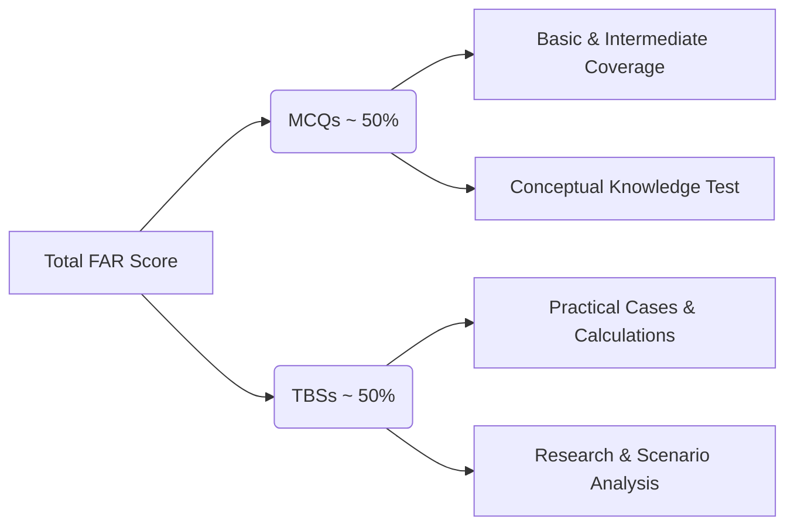
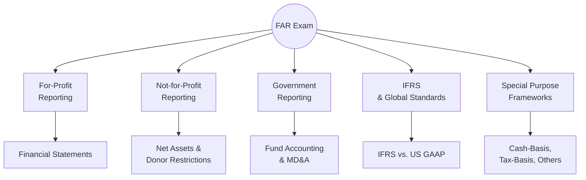

## 1.2 FAR Section in the Uniform CPA Examination

Financial Accounting and Reporting (FAR) is one of the four core sections of the Uniform Certified Public Accountant (CPA) Examination. While the other three sections — Audit (AUD), Regulation (REG), and Business Environment and Concepts (BEC) — focus on distinct areas, FAR often stands out for its breadth of topics and the depth of technical knowledge required. This section of the exam tests a candidate’s understanding of a wide range of accounting principles, reporting standards, conceptual frameworks, and financial statement preparations for various types of entities. FAR covers governmental accounting, for-profit corporations, nongovernmental not-for-profit entities, and even international frameworks, ensuring that future CPAs have a solid, comprehensive foundation in financial accounting and reporting.

This chapter focuses on understanding the importance of FAR, both from an exam perspective and for day-to-day professional practice. You will learn how FAR fits into the CPA Exam structure, what areas are tested, the approximate question distribution, and why conceptual understanding—rather than rote memorization—is critical for success.

---

### Role of FAR as One of the Four Core Exam Sections

FAR exists alongside AUD, REG, and BEC (recognizing ongoing CPA Evolution changes) as a core component of the CPA Exam. Its primary focus is ensuring that candidates have the knowledge, skills, and ability to address financial accounting and reporting issues accurately and ethically. In many ways, FAR is the backbone of the CPA’s technical competencies, given that auditing, tax compliance, and corporate finance heavily rely on accurate financial data and analysis.

FAR’s subject matter extends beyond day-to-day accounting tasks. You will demonstrate proficiency in:
• Recognizing and measuring assets, liabilities, equities, revenues, and expenses.  
• Preparing, interpreting, and analyzing financial statements and disclosures.  
• Accounting for transactions under both U.S. GAAP and IFRS.  
• Understanding not-for-profit and governmental accounting applications.

The CPA credential signifies a broad and deep mastery of accounting. Consequently, FAR ensures that prospective CPAs can navigate the complexities of today’s fast-paced and highly regulated financial reporting landscape.

---

### Overview of the FAR Exam Content and Scope

FAR is known for its wide-ranging content, spanning financial reporting standards that apply to different entities. While some exam takers might specialize in a particular niche during their careers, the CPA Exam mandates a generalist-level proficiency across the following major areas:

• General-Purpose Financial Reporting for For-Profit Entities  
• Financial Reporting for Nongovernmental Not-for-Profit Entities  
• State and Local Government Accounting and Financial Reporting  
• Public Company Reporting Topics  
• Special Purpose Frameworks (e.g., Cash-Basis, Tax-Basis)  
• Financial Statement Analysis, Ratios, and Performance Metrics  
• Selected Balance Sheet Accounts (Cash, Receivables, Inventory, Investments, Debt, Equity, etc.)  
• Selected Transactions (Accounting Changes, Contingencies, Revenue Recognition, Income Taxes, Leases, etc.)  
• IFRS Comparisons and Advanced Applications

For ease of study, these overarching topics are subdivided throughout the FAR portion of this guide into manageable chapters (see Part II through Part V of this book). Each chapter delves into standards, conceptual frameworks, measurement criteria, disclosures, and analysis techniques relevant to a particular topic, equipping you with robust knowledge and practical problem-solving skills.

---

### Approximate Question Distribution

The AICPA historically organizes FAR questions into Multiple-Choice Questions (MCQs) and Task-Based Simulations (TBSs). Although the exact number of items may vary with each exam iteration, the typical weighting structure has been around half of your final score coming from MCQs and half from TBSs. Within TBSs, advanced topics, real-world scenarios, and data sets are presented to test application-level proficiency, ensuring candidates demonstrate not just memorization, but also analytical and critical thinking skills. 

Below is a simplified overview of how these question types align:

In Multiple-Choice Questions, you are expected to identify the 'best' response from among plausible distractors. Most MCQs test your grasp of fundamental concepts such as recognition criteria for assets or the correct treatment for intangible assets. However, many MCQs also explore deeper conceptual nuances — for instance, how certain changes in accounting principles are treated under retrospective or prospective application methods.

Task-Based Simulations typically require you to apply knowledge to multi-step problems, fill in partial financial statements, or complete journal entries based on complex scenarios. Simulations may include document reviews, ratio analyses, or short case vignettes that challenge you to integrate standards from multiple topics. This portion underscores the real-world approach of the FAR exam, where a CPA’s role is to synthesize various pieces of new and historic data to form accurate financial statements and disclosures.

---

### Importance of Conceptual Understanding

While brute-force memorization of accounting rules may help answer a handful of questions, modern exam design places increasing emphasis on conceptual understanding. The FASB (Financial Accounting Standards Board) conceptual framework outlines the objectives of financial reporting, qualitative characteristics of useful information, and the elements and recognition criteria for financial statements. Becoming comfortable with these fundamentals not only helps you answer multiple-choice questions but also guides you through TBS questions where you must justify accounting treatments logically.

Many parts of FAR require the application of principles rooted in the conceptual framework. For instance:
• Determining the appropriate method to measure inventory valuation (FIFO, LIFO, Weighted Average) relies on comparability, relevance, and faithful representation.  
• Assessing revenue recognition timing entails understanding performance obligations and the matching principle.  
• Evaluating impairment of assets demands a sound grasp of what represents a recoverable cost based on the going-concern assumption.

In practice, conceptual clarity helps a CPA to reason effectively through novel or evolving accounting challenges. Even as standards change over time, the fundamental framework provides a lens through which to interpret and apply these updates rigorously.

---

### Coverage of Different Entity Types

A particularly challenging aspect of FAR is its coverage of multiple entity categories and frameworks:

• For-Profit Entities: Heavily emphasized in FAR, with comprehensive coverage of principles pertaining to private and public (SEC-registered) companies.  
• Nonprofit Organizations: Governed by somewhat different rules for net assets, donations, and restricted funds (see Chapter 4).  
• Governmental Entities: State and local governments are tested under unique measurement focuses and bases of accounting (see Chapter 5).  
• Special Purpose Frameworks: Addressing topics such as cash-basis or tax-basis reporting (see Chapter 7) ensures a broad understanding, particularly if you practice in smaller firms or specialized industries.  
• IFRS Considerations: Modern business is increasingly global, so the CPA must also understand the differences between IFRS and U.S. GAAP (see Part V for IFRS Comparisons).

By examining examples for each entity type, you begin to see how broad the FAR exam truly is. At the same time, repeated exposure to varied standards and frameworks solidifies your conceptual base and sharpens your professional judgment.

---

### Practical Examples and Case Studies

Practical examples often bring clarity to complicated accounting concepts. Consider the following simplified scenario:

Company A purchased manufacturing equipment for $100,000. The machine is expected to last ten years with no salvage value. After five years of using straight-line depreciation, Company A decides to adopt a different depreciation method for tax purposes. However, for GAAP purposes, they continue to use straight-line.  
• Under the conceptual framework, changes in method typically indicate a change in estimate if it is beneficial, but changes for tax reasons do not necessarily require retrospective application for GAAP.  
• On the FAR exam, a TBS might ask you to recast partial financial statements reflecting only the correct depreciation expense or to present journal entries showing the effect of the new method on net income and retained earnings, if any.  

Such scenarios train you to systematically approach the problem: identify the correct standard, apply conceptual reasoning, and then decide among plausible calculations or disclosures the approach that remains faithful to GAAP or IFRS, as appropriate.

---

### Visualizing FAR’s Breadth

Below is a high-level Mermaid diagram illustrating how FAR covers multiple reporting requirements across different entity types and frameworks:

You will notice multiple connections:  
• For-profit reporting is foundational, as most concepts in the conceptual framework stem from private sector accounting.  
• Nonprofit and governmental reporting add layers of complexity related to specialized standards.  
• IFRS also interconnects with for-profit standards, where differences must be recognized.  
• Special purpose frameworks challenge your ability to reconcile simplified or alternative reporting with standard GAAP.

---

### Best Practices for FAR Exam Preparation

• Study Methodically. Break down your study plan into manageable segments aligned with the exam blueprint.  
• Practice MCQs and TBSs. Use exam-emulating software to gain familiarity with the complexity and format.  
• Embrace the Conceptual Framework. As reiterated throughout the guide, a strong conceptual footing helps you handle non-routine questions.  
• Understand the “Why.” Rather than rote memorization, focus on underlying principles and rationale behind each standard.  
• Tackle Governmental and Nonprofit Early. These areas frequently surprise candidates because they differ significantly from corporate reporting.  
• Don’t Overlook IFRS. Pay close attention to IFRS divergences from GAAP, especially regarding inventory, revenue recognition, leases, and financial instruments.  
• Stay Current. While the exam does not expect you to know newly released standards immediately, being aware of pending or recent changes helps contextualize older guidance.

Most importantly, remember that FAR is comprehensive, but you are not expected to master every intricacy of accounting on the first pass. Through consistent study, repeated practice, and a steady review of both conceptual and technical details, you can develop the confidence and competence to excel on exam day.

---

### Common Pitfalls and Challenges

• Over-Reliance on Memorization. Long lists of rules are easily forgotten under stress. Understanding the reasons behind each treatment fosters long-term retention.  
• Neglecting Government and Nonprofit Accounting. Many candidates prioritize corporate topics and overlook these specialized areas until the last minute. This can be a strategic miscalculation.  
• Inadequate Time Management. FAR has vast coverage; short, focused study sessions and consistent review cycles help keep you on track.  
• Ignoring Practice Simulations. Relying solely on MCQs can leave you unprepared for real-world scenario-based tasks.  
• Failing to Read Questions Thoroughly. The difference between a correct and an incorrect answer may hinge on a single phrase regarding measurement date, classification, or a subtle IFRS/GAAP distinction.

Avoiding these pitfalls enhances both your test performance and your day-to-day desire for mastery.

---

### Strategies for Success

• Integrate Study with Real-World Interpretation. Whenever possible, tie the standards to relevant experiences or hypothetical business problems.  
• Organize Notes by Theme. Financial instruments, for instance, can be tested through multiple angles (measurement, recognition, disclosures, IFRS differences).  
• Engage Active Learning. Solve questions actively instead of passively reading materials. Write out calculations and review concept summaries.  
• Seek Peer or Instructor Feedback. If you are enrolled in a review course or have access to mentors, discuss challenging topics to clarify misunderstandings.  
• Simulate Exam Environments. Ensure familiarity with time constraints and the pressure of multi-hour test sessions.  
• Stay Positive and Motivated. Far from being an impossible hurdle, the FAR exam is a gateway to advanced professional opportunities in the accounting and finance world.

---

### References and Further Exploration

• Financial Accounting Standards Board (FASB) Codification: https://asc.fasb.org  
• Governmental Accounting Standards Board (GASB): https://www.gasb.org  
• International Financial Reporting Standards (IFRS): https://www.ifrs.org  
• American Institute of Certified Public Accountants (AICPA): https://www.aicpa.org  
• Refer to Chapters 2 through 26 in this Supplemental Guide for deeper dives into standards, frameworks, entity-specific topics, and advanced cases.

By understanding the integral role that FAR plays, appreciating the scope of its content, and preparing strategically, you will stand poised to pass this broadest section of the CPA Exam and carry forward the expertise that underpins the profession of accounting.

---

## Test Your Knowledge: FAR Section Essentials



### Which of the following best describes the primary reason FAR encompasses such a broad range of topics?

- [x] To ensure CPAs have the comprehensive technical knowledge necessary to address complex financial reporting issues for multiple entity types.
- [ ] To focus primarily on governmental accounting requirements at the state level.
- [ ] To emphasize detailed memorization of every FASB standard.
- [ ] To provide specialized training in forensic accounting only.

> **Explanation:** FAR spans multiple industries and frameworks—profit, nonprofit, governmental, and international—to prepare CPAs for diverse financial reporting environments.

### From an exam perspective, why is conceptual understanding so crucial for success in FAR?

- [x] It allows the candidate to logically deduce correct treatments and adapt to evolving standards.
- [ ] It helps the candidate memorize more rules.
- [ ] It eliminates the need for calculation-based questions.
- [ ] It solely focuses on IFRS differences.

> **Explanation:** The exam often requires applying principles from the FASB conceptual framework to real-life scenarios. Understanding the “why” behind standards improves the ability to handle unexpected or complex questions.

### Which of the following is most likely to appear as a Task-Based Simulation (TBS) in FAR?

- [x] Preparing partial financial statements and journal entries for a complex lease transaction.
- [ ] Listing the capital structure of a publicly traded company.
- [ ] Writing short essays on best practices in internal audit.
- [ ] Memorizing the definitions of key IFRS terms without application.

> **Explanation:** TBS questions frequently involve detailed scenario-based analyses, requiring integrated knowledge to complete journal entries, partial statements, or disclosures.

### What is one of the most common pitfalls students face when preparing for FAR?

- [x] Neglecting specialized areas like governmental and not-for-profit accounting until it’s too late.
- [ ] Spending too much time studying for IFRS differences.
- [ ] Having too much hands-on experience in public accounting.
- [ ] Over-familiarity with advanced managerial accounting principles.

> **Explanation:** Many candidates invest heavily in corporate accounting topics but overlook the distinct rules and procedures for nonprofits and governments, which can hold significant weight on the exam.

### Which of the following strategies can help improve performance on FAR’s multiple-choice questions?

- [x] Recapping conceptual reasons behind each accounting rule and comparing multiple options carefully.
- [ ] Selecting the first plausible answer to save time.
- [x] Reviewing canonical definitions from the FASB’s conceptual framework.
- [ ] Memorizing the structure of standard-setter organizations.

> **Explanation:** MCQs test precision and conceptual clarity. Ensuring you understand accounting rules conceptually, not just memorized, increases your likelihood of choosing the best answer.

### Why is it critical to practice Task-Based Simulations during your FAR preparation?

- [x] They reflect real-world financial statements and scenario analyses that require integrated application of multiple standards.
- [ ] They are purely theoretical and absent from actual practice.
- [ ] They alleviate the need to study conceptual frameworks.
- [ ] They are optional according to AICPA guidelines.

> **Explanation:** TBSs mimic real client concerns and test deeper analytical skills, pushing you to apply knowledge from numerous FAR subtopics in one complex task.

### Which section of FAR is often overlooked but remains highly testable?

- [x] State and Local Government Accounting Concepts.
- [ ] Basic double-entry bookkeeping principles.
- [x] Not-for-Profit accounting frameworks.
- [ ] Personal budgeting strategies.

> **Explanation:** Candidates sometimes neglect governmental and nonprofit areas because they are unfamiliar or mistakenly believed to be less emphasized; both remain integral to FAR’s scope and are tested.

### How does IFRS coverage in FAR typically differ from GAAP coverage regarding exam expectations?

- [x] IFRS differences are tested with the assumption that a candidate recognizes key distinctions in measurement or disclosure.
- [ ] IFRS questions are tested exclusively through multiple-choice questions.
- [ ] IFRS is not included in FAR at all.
- [ ] Only IFRS for government entities is compared to GAAP.

> **Explanation:** IFRS vs. GAAP line items highlight important differences in treatment (e.g., classification of intangible assets, inventory methods, etc.). Familiarity with these differences is tested in both MCQ and TBS formats.

### What study approach maximizes efficiency and retention when preparing for FAR?

- [x] Breaking topics into smaller segments, practicing with MCQs and TBSs regularly, and performing periodic reviews.
- [ ] Focusing on memorizing entire authoritative standards word-for-word.
- [ ] Ignoring the conceptual framework and focusing solely on computational questions.
- [ ] Spending half of the time on business law study topics.

> **Explanation:** FAR covers large content areas; repeated practice and incremental learning combined with conceptual reviews foster greater retention and application skills.

### True or False: FAR exclusively covers for-profit entity accounting, leaving governmental and not-for-profit topics to other sections of the CPA Exam.

- [x] True
- [ ] False

> **Explanation:** This statement is false. FAR dedicates significant content coverage to both governmental and not-for-profit accounting. Mastery of these areas is essential for exam success.



---

## For Additional Practice and Deeper Preparation

**[FAR CPA Hardest Mock Exams: In-Depth & Clear Explanations](https://www.udemy.com/course/far-cpa-mock-exams/?referralCode=F88050F8D5C76764F6BD)**

**Financial Accounting and Reporting (FAR) CPA Mocks:** 6 Full (1,500 Qs), Harder Than Real! In-Depth & Clear. Crush With Confidence! 

- Tackle full-length mock exams designed to mirror real FAR questions.  
- Refine your exam-day strategies with detailed, step-by-step solutions for every scenario.  
- Explore in-depth rationales that reinforce higher-level concepts, giving you an edge on test day.  
- Boost confidence and minimize anxiety by mastering every corner of the FAR blueprint.  
- Perfect for those seeking exceptionally hard mocks and real-world readiness.  

_Disclaimer: This course is not endorsed by or affiliated with the AICPA, NASBA, or any official CPA Examination authority. All content is for educational and preparatory purposes only._
