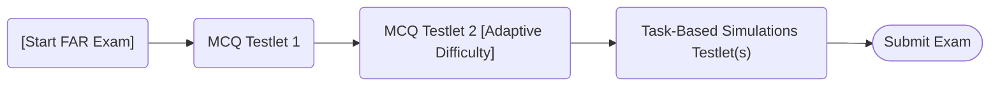

## 1.3 Scoring and Question Types (MCQs and Simulations)

Effective exam preparation begins with a clear understanding of how the Financial Accounting and Reporting (FAR) section of the Uniform CPA Examination (CPA Exam) is structured, evaluated, and scored. This knowledge empowers candidates to tailor their study strategies and approach exam questions methodically. This section delves into the scoring methodology of FAR, the weighting of question types, how to approach both Multiple-Choice Questions (MCQs) and simulations, and essential techniques to maximize exam performance.

### Scoring Overview

The CPA Exam, including FAR, employs a rigorous scoring process guided by the American Institute of Certified Public Accountants (AICPA). Each section, including FAR, is scored on a scale from 0 to 99, and a score of at least 75 is required to pass. While the exact scoring algorithms are proprietary to the AICPA, several key principles are publicly disclosed:

• Weighted Sections of the Exam: In general, FAR’s question pool is divided between Multiple-Choice Questions (MCQs) and Task-Based Simulations (TBS), often referred to simply as “simulations.” Historically, each question type carries a substantial portion of the total exam score.  
• Time Allocation: FAR provides a total of four hours of testing time. The exam typically contains multiple testlets—two containing MCQs and two or more containing simulations.  
• No Penalty for Wrong Answers: The CPA Exam does not penalize for incorrect answers. Thus, guessing on MCQs when uncertain is usually preferred to leaving a question blank.  
• Scaled Scoring: The raw score (performance on individual questions and simulations) is converted into a scaled score to provide consistency across different versions of the exam.  
• Partial Credit for Simulations: Task-Based Simulations often award partial credit. Even if you do not address every facet of a simulation correctly, you can still earn credit for portions answered accurately.

### Distribution of Question Types and Relative Weightings

The AICPA periodically clarifies the weighting of MCQs and simulations within each exam section. While changes may occur for each testing window, FAR’s distribution historically centers around allocating approximately 50% of the exam’s content to MCQs and 50% to simulations. Depending on how future exam blueprints evolve, these percentages may be slightly adjusted, yet the general framework remains stable:

• MCQs: Roughly half of the exam’s total score.  
• Task-Based Simulations (TBS): Roughly half of the exam’s total score.  

Because both question types carry significant weight, developing mastery of each is crucial. Some subtopics in the FAR Blueprint may appear more prominent in MCQs, while others may be better tested through simulations. For example, in-depth application of revenue recognition standards (ASC 606) might appear more extensively in simulations to test real-world application and professional judgment.

### The Adaptive Nature of MCQ Testlets

Although not fully adaptive at the entire exam level, each MCQ testlet in the CPA Exam is designed adaptively. The first MCQ testlet you encounter will present a range of easy to medium-difficulty questions. Depending on your performance in that testlet, you may receive a second testlet that is more advanced if you performed strongly, or a simpler testlet if you struggled. Keep the following in mind:

• The difficulty level of the second MCQ testlet does not necessarily correlate with final scoring. You can still achieve a passing score even if you perceive that the second testlet is easier or more difficult.  
• Focus on each question independently. Do not read too much into the difficulty of a subsequent testlet, as the exam’s adaptive methodology is proprietary.  

### Multiple-Choice Questions (MCQs)

The multiple-choice component of the FAR Exam measures the depth and breadth of your foundational knowledge. While MCQs are succinct, they can cover a wide array of FAR topics, from basic conceptual framework elements (discussed in Chapter 2) to complex topics like net realizable value inventory measurement and intangible asset impairments.

Structure of MCQs

• Four Answer Choices: Typical CPA Exam MCQs present four possible answers, labeled (A), (B), (C), and (D). Only one choice is correct.  
• Single or Multiple Sentences: Some MCQs might only be a few lines long, while others can involve paragraphs describing a scenario.  
• Calculations, Conceptual Knowledge, or Both: Certain For-Profit or Governmental Accounting topics test purely conceptual knowledge (e.g., differences between fund accounting and government-wide accounting), while others require calculations (e.g., depreciation, bond amortization).

Example MCQ Scenario  
Consider the following simplified MCQ to illustrate a possible format:

A company incurs costs to develop a patent-eligible technology. How are these costs treated under U.S. GAAP?  

(A) Capitalize all research and development (R&D) costs as an intangible asset.  
(B) Expense all R&D costs when incurred, but capitalize legal costs associated with the patent.  
(C) Capitalize R&D costs once technological feasibility is established.  
(D) Capitalize all R&D costs as an offset to shareholders’ equity.  

The correct answer (B) is grounded in the principle that R&D costs are expensed as incurred, but certain legal fees and costs to defend a patent may be capitalized. This conceptual knowledge is found in ASC 730, which requires immediate expensing of R&D, with specific exceptions for legal expenses in connection with intangible asset protection.

### Strategies for MCQs

• Read the Question Stem Carefully: Identify precisely what is being asked. Are you looking for the “best” authoritative standard or the “most accurate” presentation?  
• Eliminate Clearly Wrong Answers: In many cases, you can quickly eliminate at least one or two obviously incorrect choices if you thoroughly understand FASB’s conceptual framework or existing standards.  
• Watch for Distractors: MCQ distractors can be subtle; they may include partial truths or slightly correct statements in the wrong context.  
• Apply Time Management: Allocate roughly 1.25 minutes per MCQ on average. Do not spend an inordinate amount of time on a single question—mark it, make an educated guess, and revisit if time permits.  

### Task-Based Simulations (TBS)

Task-Based Simulations typically require a deeper understanding of FAR topics in a more practical or scenario-based format. These interactive problems can require data entry, completion of financial statements, or the research and application of authoritative guidance. Simulations test your ability to synthesize information, apply accounting principles, and sometimes reference accounting codification.

Characteristics of Simulations

• Scenario-Based: Each simulation presents a scenario, often describing a company or not-for-profit entity with various transactions or policy considerations.  
• Interactive Tabs and Data Files: Many TBS tasks include a series of tabs containing raw data, background information, and instructions. You must navigate these tabs efficiently to work through the problem.  
• Research or Authoritative Guidance: Certain TBS questions require referencing the FASB Accounting Standards Codification (ASC), IFRS guidance when specifically indicated, or state/local government standards for governmental accounting tasks.  
• Multiple Response Fields: You may see multiple cells or blanks to fill in. Each correct response can garner partial credit, even if you do not complete the entire scenario accurately.  

### Example TBS Scenario  
Imagine a simulation that provides multiple years of income statements, details on lease agreements, intangible assets, and the existence of foreign currency transactions. The simulation might require you to determine appropriate adjusting entries for:

• Recording foreign exchange gains or losses,  
• Classifying lease transactions as operating or finance leases, and  
• Amortizing intangible assets such as a trademark or license.  

To complete this TBS accurately, you would need to interpret relevant accounting standards (e.g., ASC 842 for leases), use the data provided in the scenario to distinguish short-term liabilities from long-term, and ensure each journal entry is consistent with GAAP requirements.

### Scoring of Simulations

One of the most significant advantages of TBS questions from a candidate’s perspective is partial credit. Even if you do not solve each component of a simulation perfectly, you can often earn points for any correctly completed parts. Occasionally, the simulation might be layered such that one mistake can carry over to subsequent responses. However, credit is awarded for correctness on each specific portion, so try to complete as many parts as possible even if earlier sections posed difficulties.

### Strategies for Simulations

• Familiarize Yourself with the Authoritative Literature: Practice navigating the FASB Codification or other relevant standards (e.g., GASB for government entities) so you can locate key guidance under exam pressure.  
• Practice Structured Note-Taking: When you first encounter a TBS, skim each tab and note the critical data (e.g., statement amounts, key transactions). Working methodically prevents oversight and keeps you organized.  
• Prioritize High-Effort, High-Reward Elements: If a simulation includes multiple tasks, tackle the portions you know best first. Earning partial credit on multiple items can raise your cumulative score significantly.  
• Manage the Clock: Simulations are more time-consuming than MCQs. You must balance thoroughness with timeliness. Be sure to leave enough time to address each TBS in the exam.

### Using a Diagram to Visualize the Exam Flow

The following diagram offers a conceptual perspective on how the FAR exam typically progresses from one testlet to the next. Note that the exact layout may vary:

#### Explanation:

• Start FAR Exam → MCQ Testlet 1: You begin with a standard difficulty set of MCQs.  
• MCQ Testlet 1 → MCQ Testlet 2: Depending on your performance, the second MCQ testlet may be more (or less) difficult.  
• MCQ Testlet 2 → Task-Based Simulations: You move to the TBS portion, which includes more in-depth scenario-based questions.  
• Task-Based Simulations → Submit Exam: Once you complete all TBS tasks, you submit your responses for scoring.

### Time Management and Overall Strategy

• MCQ vs. TBS Splits: Because simulations are more involved, it is generally advisable to allocate sufficient time (e.g., half of your total exam time) to the TBS testlets.  
• 75-Point Threshold: You do not need a perfect score on every MCQ or TBS to pass. Aim to correctly address as many questions as possible and earn partial credit on TBS even if you are not entirely confident.  
• Balancing Speed and Accuracy: Sometimes marking a difficult MCQ and returning to it later can be more beneficial than spending four or five minutes on a single item.  
• Planned Breaks: The CPA Exam interface typically allows a scheduled break after certain testlets. Use this strategically to recharge before the TBS portion.  

### Common Pitfalls

• Not Reading the Entire TBS Tab: Overlooking key data found in supplemental tabs can lead to partial or complete errors in calculating your final answers. Always double-check each tab.  
• Misinterpretation of Concepts: For example, mixing up LIFO (Last-In, First-Out) and FIFO (First-In, First-Out) or applying IFRS rules in a question specifically testing U.S. GAAP.  
• Frenetic Guessing on MCQs: While time is of the essence, hasty clicks without reasoning can lead to missing out on correct answers you might have easily deduced.  
• Poor Use of Authoritative Guidance: Knowing “where” and “how” to look up official references can boost TBS accuracy and speed.

### Professional Judgment and Real-World Application

The FAR section frequently tests not just rote memorization but also professional judgment. For instance, deciding whether a lease is “SEC capitalizable” or “operating” under ASC 842 calls for analyzing the underlying lease terms. Similarly, determining when to capitalize versus expense certain costs tests your ability to apply the conceptual framework from Chapter 2.2 (FASB Conceptual Framework: Objectives, Qualitative Characteristics, Elements).

Consider a scenario that requires deciding the appropriate year to recognize a property tax revenue for a local government fund. The correct solution involves analyzing both time-based eligibility requirements and the measurement focus of governmental funds. A TBS testing this knowledge ensures you fully understand the nuance of government accounting (explored in Chapter 5).

### Practical Examples and Real-World Scenarios

• Revenue Recognition TBS: Suppose you see a schedule of project milestones for a software development contract. You must decide how to allocate the transaction price among performance obligations, whether to accelerate recognition upon completion of a milestone, and how to factor in variable consideration.  
• Government Budgetary TBS: You might be given a city’s proposed budget, a ledger of encumbrances, and year-end adjustments. The simulation requires you to reconcile the budgetary accounts to the fund financial statements—testing the “budgetary to GAAP” conversion process.  
• Inventory Costing Comparison MCQ: An MCQ scenario might illustrate two different companies using LIFO and FIFO, respectively, with rising prices. You are asked which entity reports a higher cost of goods sold in that period.  

### Leveraging Resources from the Exam Interface

During the exam, you have access to limited on-screen resources, including:

• Calculator: Useful for performing quick calculations, such as interest amortization or average cost computations.  
• Authoritative Literature Database: In TBS testlets, you can reference standard-setting materials, such as the FASB Codification. Practice using the search functionality ahead of time so that you do not waste precious minutes searching incorrectly.  

If you practice with third-party review courses that simulate these resources, you will be more prepared.

Continued Learning and Reference

Sections throughout this guide reference standards and concepts that frequently appear in MCQs and TBS:

• Chapter 2.2 details key aspects of the FASB Conceptual Framework.  
• Chapter 3 and Chapter 4 discuss the structure of financial statements for for-profit and not-for-profit entities, respectively.  
• Chapter 5 delves into Governmental Accounting, an area known to appear in TBS.  
• Chapter 26 offers complex illustrations and in-depth practice scenarios that mirror the integrated nature of TBS questions.

### Conclusion

The FAR Exam’s scoring methodology is multifaceted yet fair—rewarding accurate, methodical approaches to MCQs as well as comprehensive, scenario-based reasoning in simulations. Understanding how you will be tested and how your responses translate into exam scores helps you prioritize study topics, refine test-taking strategies, and maintain confidence as you work through each testlet. Armed with clarity on scoring and test question formats, you are in a strong position to develop mastery across a broad range of FAR topics.

Adding consistent practice, seeking reliable feedback, and familiarizing yourself thoroughly with the exam interface can greatly bolster your readiness to tackle both MCQs and TBS effectively. With well-rounded preparation, you can confidently approach the FAR section of the CPA Exam and significantly improve your odds of earning that crucial passing score of 75 or above.

## Test Your Knowledge: CPA FAR Scoring & Question Techniques Quiz



### In the FAR exam scoring model, which statement is most accurate?
- [ ] MCQs are usually worth 80% and TBS 20% of the total score.  
- [ ] There is a penalty for guessing wrong answers on MCQs.  
- [x] The scoring is scaled, and partial credit is awarded for portions of correct answers in simulations.  
- [ ] A cumulative raw score of 75% always translates to a final score of 75.  

> **Explanation:** The CPA Exam uses scaled scoring and assigns partial credit on simulations. There is no penalty (negative marking) for an incorrect MCQ, and the traditional breakdown is closer to a 50-50 split between MCQs and TBS.  

### Which of the following best describes the “adaptive” nature of MCQ testlets on the CPA Exam?
- [x] The difficulty of the second MCQ testlet may increase or decrease based on your performance on the first testlet.  
- [ ] The TBS testlets adapt to your MCQ performance to provide either simpler or more complex scenarios.  
- [x] Your performance on earlier MCQs can influence which MCQs you see later.  
- [ ] The entire exam’s difficulty is fixed at the baseline, so there is no adaptive mechanism.  

> **Explanation:** The CPA Exam adapts at the testlet level. After Testlet 1, the second MCQ testlet can vary in difficulty based on how well you did on the first set.  

### What is the recommended approach if you encounter a difficult MCQ that is taking too long to solve?
- [x] Make an educated guess, mark the question, and move on to manage time efficiently.  
- [ ] Skip the question entirely since incorrect answers carry a penalty.  
- [ ] Spend as long as needed to ensure absolute accuracy, even if it impacts time for other questions.  
- [ ] Change the answer to “C” if you are not sure.  

> **Explanation:** Because there is no penalty for guessing, it’s best to provide your best guess and move on. You can always revisit it if time remains at the end of the testlet.  

### Which of the following is a core benefit of Task-Based Simulations for candidates?
- [ ] There is no partial credit in TBS, making them easier to evaluate.  
- [ ] TBS never require referencing any authoritative literature.  
- [x] TBS grant partial credit even if you do not complete all parts perfectly.  
- [ ] TBS are scored purely by the number of journal entries you create.  

> **Explanation:** TBS offer partial credit, which is a major advantage for candidates. Even if you fail to answer some components, you can earn points for the portions you complete correctly.  

### What is the best strategy for tackling TBS items you are most confident about?
- [x] Address them first to secure partial credit and build momentum.  
- [ ] Skip them to tackle the hardest ones first.  
- [x] Confirm your initial response with relevant authoritative guidance if time permits.  
- [ ] Complete them last so the easier parts feel like a quick finish.  

> **Explanation:** Focusing on areas of strength first helps you gain partial credit early; using authoritative guidance can confirm your solutions and bolster your confidence.  

### During the FAR exam, which action is recommended when researching a codification topic in a TBS?
- [x] Familiarize yourself with the table of contents or search function to quickly locate relevant subtopics.  
- [ ] Enter random search terms to find hidden clues.  
- [ ] Rely solely on memory; time is too short to consult the codification.  
- [ ] Skip the codification entirely, as TBS never require direct referencing.  

> **Explanation:** Efficiently using the authoritative guidance by searching relevant subtopics is crucial for timely and accurate TBS responses.  

### Which statement is correct about the final scaled score of the FAR exam?
- [x] A scaled score of 75 is required to pass, regardless of the raw percentage correct.  
- [ ] Scores are reported as a raw fraction of correct answers (e.g., 80% correct = score of 80).  
- [x] The exact computation of the scaled score is undisclosed, but partial credit is factored in.  
- [ ] A scaled score of 90 is required for advanced certifications.  

> **Explanation:** The AICPA uses a proprietary scaled scoring model. Raw scores convert to a scale from 0 to 99, with 75 as the passing threshold.  

### When budgeting your exam time, which strategy is most effective for MCQs vs. TBS sections of FAR?
- [x] Allocate roughly half your time to TBS since they are more detailed and involved.  
- [ ] Spend two-thirds of the total exam time on MCQs to guarantee accuracy.  
- [ ] Aim to finish TBS within the first 30 minutes and then return to MCQs.  
- [ ] Do not track time; rely on intuition for time management.  

> **Explanation:** TBS typically require more analysis, calculations, and referencing so candidates often allocate up to half of the four-hour window to handle them adequately.  

### Which of the following best describes the correct approach to evaluating lease classification in a TBS?
- [x] Consult ASC 842 for lease criteria (operating vs. finance), then apply the facts from the TBS scenario.  
- [ ] Always label new leases as finance leases under GAAP.  
- [ ] Treat all leases as operating leases to avoid confusion or errors.  
- [ ] Assume IFRS standards override U.S. GAAP for all lease evaluations.  

> **Explanation:** ASC 842 provides specific lease classification criteria. You must analyze details about lease term, present value of payments, and ownership transfer aspects to determine if it is finance or operating.  

### In the FAR section of the CPA Exam, candidates must score:
- [x] True  
- [ ] False  

> **Explanation:** Candidates must earn a scaled score of at least 75 to pass the FAR section.  



---

## For Additional Practice and Deeper Preparation

[**FAR CPA Hardest Mock Exams: In-Depth & Clear Explanations**](https://www.udemy.com/course/far-cpa-mock-exams/?referralCode=F88050F8D5C76764F6BD)

Financial Accounting and Reporting (FAR) CPA Mocks: 6 Full (1,500 Qs), Harder Than Real! In-Depth & Clear. Crush With Confidence!

• Tackle full-length mock exams designed to mirror real FAR questions.  
• Refine your exam-day strategies with detailed, step-by-step solutions for every scenario.  
• Explore in-depth rationales that reinforce higher-level concepts, giving you an edge on test day.  
• Boost confidence and minimize anxiety by mastering every corner of the FAR blueprint.  
• Perfect for those seeking exceptionally hard mocks and real-world readiness.

_Disclaimer: This course is not endorsed by or affiliated with the AICPA, NASBA, or any official CPA Examination authority. All content is for educational and preparatory purposes only._
