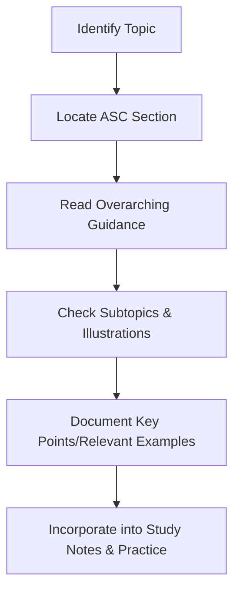

## 1.4 Study Methodology and Exam Strategies

Preparing for the Financial Accounting and Reporting (FAR) section of the CPA Exam is a significant challenge, but it can be conquered efficiently with a structured and strategic approach. This chapter outlines methods to help you master the FAR blueprint topics, from conceptual understanding to practical problem-solving. You will explore time management, practice question strategies, and reviewing authoritative literature such as FASB codification, as well as other indispensable study techniques. By integrating the following guidelines into your study plan, you will be better equipped to both comprehend the subject matter and excel on exam day.

### Understanding the Importance of a Balanced Approach

Many CPA candidates focus heavily on practice questions without adequately grounding themselves in conceptual frameworks. Conversely, some learners immerse themselves in theory while neglecting application. A well-rounded study methodology must combine conceptual clarity with rigorous practice to hone problem-solving skills. 

Achieving this balance involves:
• Familiarizing yourself with both the overview and the details of each FAR topic.  
• Reinforcing knowledge through multiple-choice questions (MCQs) and simulations.  
• Iterating between theory and practice so that concepts become intuitively ingrained rather than memorized.  

### Crafting a Structured Study Plan

Constructing a study schedule that covers all FAR topics thoroughly and leaves you enough time for final reviews is crucial. Begin by listing each topic’s relative weight, referencing the CPA Examination Blueprints provided by the AICPA. Then allocate study hours accordingly, ensuring that higher-weighted topics receive proportionate attention.

A recommended plan often includes:
• Weekly breakdowns focusing on specific FAR content areas (e.g., Revenue Recognition or Leases).  
• Periodic checkpoints to test mastery (e.g., short quizzes or progress tests).  
• Scheduled reviews and comprehensive practice exams in the final weeks.  

Try to simulate exam conditions during practice sessions to become comfortable with the pacing and pressure of the real exam environment.

### Time Allocation Strategies

Time allocation can be broken down into three key phases:

1. Preliminary Learning:  
   In the first few weeks, prioritize reading your primary study materials or textbooks, watching detailed lectures, or reviewing official guidance. Take notes focusing on conceptual underpinnings. You might consider referencing sections from Part II and Part III of this guide, which cover fundamental concepts in financial reporting and specific balance sheet accounts.  

2. Intensive Practice:  
   After forming a conceptual base, dedicate a significant portion of your day to practicing MCQs and simulations aligning with each topic. Your goal is not just to find the “right” answer but to understand the underlying reasoning. If you find yourself guessing frequently, revisit the conceptual framework (see Chapter 2) to fill knowledge gaps.  

3. Final Review and Mock Testing:  
   As exam day approaches, shift toward comprehensive practice exams to simulate the exam experience. Focus on any weaker areas, and review the FASB Codification or IFRS differences (refer to Chapter 25) for advanced clarification.  

### Incorporating the Conceptual Framework in Your Studies

The FASB conceptual framework provides a roadmap for understanding why certain accounting standards exist. It explains the objectives of financial reporting, qualitative characteristics of useful information, and the elements of financial statements. Whenever you encounter a complex question, ask yourself:  
• Which elements of the conceptual framework apply here?  
• How do these elements inform recognition, measurement, or disclosure requirements?  

By grounding your practice in the conceptual framework, you’ll develop the ability to derive answers logically rather than relying on rote memorization.

### Using Authoritative Literature for Deeper Insight

Reviewing authoritative literature, such as FASB’s Accounting Standards Codification (ASC), is essential for complex or ambiguous topics. The U.S. GAAP hierarchy (explained in Chapter 2.4) provides clarity on the relative authority of different sources. Familiarizing yourself with research tools will help you navigate the Codification effectively not only for the exam but also for future professional practice.

1. Target Specific Areas  
   If you are struggling with areas like revenue recognition (ASC 606) or lease accounting (ASC 842), consult those Codification sections directly. Identify key definitions, measurement criteria, and disclosure requirements.

2. Practice Research Simulations  
   The CPA Exam includes simulations that test your ability to research and reference authoritative literature. Develop your research abilities early. For instance, practice searching the Codification for specific guidance on intangible assets (see Chapter 14) or complex financial instruments (bonds, derivatives) to refine your skill.

3. Document and Summarize  
   Maintain a short reference document or digital notes capturing critical points from the Codification, with relevant subtopics that you can revise quickly. Summaries help you recall the logic behind each standard and reduce the load during final reviews.

### Strategies for Tackling MCQs and Simulations

FAR includes multiple-choice questions (MCQs), task-based simulations (TBSs), and occasionally research-based simulations. Each question type demands a unique approach:

#### Multiple-Choice Questions (MCQs)

• Read the entire question carefully. Understand the scenario, the numbers, and what is being asked before looking at the answer choices.  
• Identify key words such as “most likely,” “best describes,” and “except,” which can drastically alter the correct answer choice.  
• Eliminate clearly incorrect options first. This narrows your choices and improves your odds of getting the right answer.  
• Avoid dwelling too long on a single question. If stuck, mark the question, move on, and return later if time permits.

#### Task-Based Simulations (TBSs)

• Break down the scenario into smaller tasks. Look for the main requirements: Are you preparing a journal entry, calculating a ratio, or adjusting a balance sheet figure?  
• For complex transactions, refer to your knowledge of FASB Codification or IFRS (if relevant) and apply step-by-step logic.  
• Manage your exam time efficiently. TBSs can be time-consuming, so allocate enough minutes based on the complexity or point value of each simulation.  
• Verify your final answers and confirm that your approach aligns with recognized accounting standards.

Below is a simplified diagram illustrating how to approach a TBS:

### Memorization with Purpose

While conceptual understanding is paramount, certain elements of FAR might require memorization (e.g., classification of funds in governmental accounting, or the specific lines in the statement of cash flows). The key is to memorize with purpose—knowing the “why” behind those details. Flashcards and mnemonic devices can be helpful supplementary tools, but always tether them to your broader conceptual framework.

### Practice Testing Under Exam Conditions

The FAR exam is timed, which can induce stress and significantly impact performance. To mitigate anxiety:
1. Simulate Exam Environment: Turn off all external distractions, use a timer, and set up a practice exam scenario.  
2. Use Scratch Paper Strategically: Practice note-taking shortcuts or abbreviations so you can outline your calculations and reasoning quickly during the real exam.  
3. Track Your Time: Develop an internal sense of how long to spend per question or simulation.  

### Reviewing and Reinforcing Knowledge

An effective review process involves quickly identifying knowledge gaps and addressing them. Consider the following cycle for ongoing mastery:

1. Take a Topic-Specific Quiz: Identify which subtopics remain problematic.  
2. Revisit the Underlying Concepts: Check your notes, textbooks, or lectures to clarify misunderstandings.  
3. Practice Focused Exercises: Hone in on those subtopics with targeted MCQs and TBSs.  
4. Summarize Learned Points: Update your notes with new insights to avoid repeated mistakes in the future.

### Managing Test Anxiety and Staying Motivated

Continuous preparation can be mentally taxing. Incorporate breaks and stress-management techniques:
• Schedule short walks or breaks every 90 minutes.  
• Consider study groups for peer support and collaborative discussion.  
• Maintain a balanced lifestyle by incorporating exercise, proper nutrition, and adequate rest.  

Moreover, keep track of small victories (like mastering a tricky concept or improving your practice exam score) to remain motivated and to gain the confidence to tackle the next challenge.

### Real-World Scenarios and Case Studies

Where possible, link what you learn to real-world scenarios. Suppose you are analyzing how revenue recognition rules apply in a consolidated entity scenario (see Chapter 26). You might think of a retail conglomerate that sells both physical products and online subscription services, requiring you to identify performance obligations under a single contract. Aligning case studies to daily business contexts helps solidify your knowledge.

### Leveraging Study Materials and Resources

Aside from this guide, you may discover additional learning materials beneficial to your understanding of FAR:
• Online courses and boot camps that provide structured lectures, quizzes, and additional practice.  
• Peer-run or professional forums where you can clarify doubts and discuss tricky topics.  
• AICPA’s official sample tests and released questions to familiarize yourself with exam-like content.  

Select resources judiciously. Quality over quantity is often the best approach. Using too many resources can be overwhelming and may create inconsistency in content coverage.

### Best Ways to Review Authoritative Literature

Consulting FASB codification or IFRS standards (refer to Chapter 25) should be systematic. Create a mental (or written) map of key sections:
• Classification and Measurement: ASC 320 (investments), ASC 842 (leases), etc.  
• Recognition: ASC 606 (revenue recognition), ASC 450 (contingencies).  
• Disclosures: ASC 235, or industry-specific disclaimers.  

You can visualize your research mapping in a diagram:

The more you practice reading and summarizing these sections, the more adept you will become at performing targeted research during exam simulations and in your professional endeavors.

### Putting It All Together

Success in FAR requires a seamless blend of theoretical knowledge, technical proficiency, and exam-day strategy. Here is a concise action plan:
• Start each FAR topic with conceptual exploration.  
• Follow up with high-volume practice questions that highlight strengths and weaknesses.  
• Engage with authoritative literature for areas of uncertainty or complexity.  
• Conduct personal progress checks and full-length practice exams.  
• Refine time management to ensure you can handle both MCQs and TBSs effectively.  

Maintaining this process-driven and structured approach will significantly enhance your confidence and performance when it’s time to face the FAR section of the CPA Exam.

---

## Test Your FAR Study Strategy Knowledge



### Which balance is most effective when studying for the FAR exam?
- [x] A balanced approach that alternates between conceptual learning and practice.
- [ ] Only conceptual reading until all topics are mastered, then practice.
- [ ] Only practicing questions, ignoring conceptual foundations.
- [ ] Relying solely on flashcards for memorization.
> **Explanation:** A well-rounded methodology combines understanding the conceptual framework with rigorous practice. This ensures that you have a solid foundation and can handle various question types effectively.

### Which of the following tips can most help in addressing weak areas?
- [x] Taking a short progression quiz, identifying issues, revisiting notes, and practicing again.
- [ ] Avoiding thorough reviews and focusing on new unrevised topics.
- [x] Leveraging the FASB Codification for complex issues.
- [ ] Ignoring your original mistakes, believing new material is more important.
> **Explanation:** Identifying weaker areas, addressing them with conceptual reviews, and reinforcing them with targeted practice helps fill knowledge gaps effectively. Using authoritative literature promotes deeper understanding.

### What is the primary advantage of practicing research simulations using authoritative literature?
- [x] Gaining familiarity with navigation and key sections in the Codification.
- [ ] Memorizing lengthy codification sections verbatim.
- [ ] Simplifying note-taking by ignoring the complexity of the standard.
- [ ] Ensuring that you can guess the guidance without full reading.
> **Explanation:** Research simulations often require referencing specific Codification sections. Familiarity with the layout and how to quickly locate information is crucial for saving time during the exam.

### What is an efficient way to manage your time during the FAR exam?
- [x] Establish a rhythm for MCQs, then allocate remaining time to TBSs proportionally.
- [ ] Spend all your time on the first testlet and guess the rest.
- [ ] Complete each TBS before reading the instructions.
- [ ] Wait until the last 15 minutes to answer TBSs.
> **Explanation:** Proper pacing across MCQs and TBSs is essential. By allocating time proportionally, you minimize the risk of running out of time to complete or review the simulations.

### When might a candidate rely on memorization rather than conceptual understanding?  
- [x] When learning certain rules for government or nonprofit fund classifications, while still understanding the rationale behind them.
- [ ] When dealing with basic managerial accounting principles that do not apply to FAR.
- [x] When mastering standard outlines, such as statement of cash flows sections. 
- [ ] Never. Memorization has no role in studying for FAR.  
> **Explanation:** Some limited memorization is inevitable (e.g., detailed fund classifications). However, tying those items to the broader conceptual or logical framework increases retention and comprehension.

### What is a recommended office-like setup for simulating the test environment?
- [x] A quiet environment, timed sessions, and minimal distractions.
- [ ] Casual environment with TV on for background noise.
- [ ] Group discussions during the test simulation.
- [ ] Using mobile devices and social media while practicing.
> **Explanation:** A controlled and quiet environment, free from distractions, replicates testing conditions and builds your focus and endurance for exam day.

### Which approach is best for tackling TBSs in an orderly manner?
- [x] Reading the entire scenario carefully, breaking down the tasks, and applying relevant ASC guidance.
- [ ] Jumping straight to numerical entries without understanding the context.
- [x] Double-checking each step to ensure alignment with recognized standards.
- [ ] Skipping any items that seem too complex to save time.
> **Explanation:** Carefully reading the task requirements and prioritizing relevant guidance ensures accuracy. Breaking the simulation into smaller chunks and verifying entries is a disciplined, methodical approach.

### Why is it essential to connect real-world scenarios with FAR topics?
- [x] It helps to contextualize theoretical concepts, improving retention and practicality.
- [ ] Real-world scenarios have no relevance to exam questions.
- [ ] It simplifies the exam by always revealing the correct answers.
- [ ] It replaces the need for practicing MCQs or TBSs.
> **Explanation:** Connecting knowledge to practical contexts improves understanding and learning retention, making theoretical principles easier to recall and apply under exam conditions.

### Where can you find official sample tests that replicate the exam environment?
- [x] Through the AICPA's official website and materials.
- [ ] By randomly searching social media.
- [ ] In any unverified online forums.
- [ ] They are not publicly available.
> **Explanation:** The AICPA offers free sample tests and practice questions, which are valuable for understanding the CPA Exam structure and question formats.

### FAR exam success is most likely when:
- [x] You combine structured study sessions, timed quizzes, reviews of authoritative literature, and final comprehensive practice.
- [ ] You binge study everything in the last week.
- [ ] You focus exclusively on IFRS differences.
- [ ] You rely on luck and guesswork for complex topics.
> **Explanation:** Passing FAR (and all other CPA sections) requires a disciplined approach that includes conceptual study, practice, and strategic final reviews. Relying on luck or cramming in the final week is not advisable.



---

## For Additional Practice and Deeper Preparation

[**FAR CPA Hardest Mock Exams: In-Depth & Clear Explanations**](https://www.udemy.com/course/far-cpa-mock-exams/?referralCode=F88050F8D5C76764F6BD)

Financial Accounting and Reporting (FAR) CPA Mocks: 6 Full (1,500 Qs), Harder Than Real! In-Depth & Clear. Crush With Confidence!

- Tackle full-length mock exams designed to mirror real FAR questions.  
- Refine your exam-day strategies with detailed, step-by-step solutions for every scenario.  
- Explore in-depth rationales that reinforce higher-level concepts, giving you an edge on test day.  
- Boost confidence and minimize anxiety by mastering every corner of the FAR blueprint.  
- Perfect for those seeking exceptionally hard mocks and real-world readiness.  

_Disclaimer: This course is not endorsed by or affiliated with the AICPA, NASBA, or any official CPA Examination authority. All content is for educational and preparatory purposes only._
