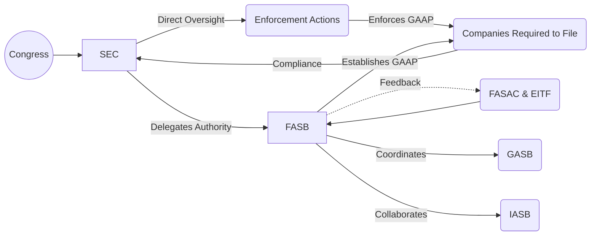

## 2.1 FASB, SEC, and Other Standard-Setters (Historical Context and Roles)

Financial reporting in the United States is guided by a carefully structured standard-setting environment. At the center of this environment stands the Financial Accounting Standards Board (FASB), which is recognized by the Securities and Exchange Commission (SEC) for defining U.S. Generally Accepted Accounting Principles (GAAP) for nongovernmental for-profit entities. Other standard-setters such as the Governmental Accounting Standards Board (GASB), the International Accounting Standards Board (IASB), and various international and domestic bodies also influence or directly shape accounting standards. This chapter delves into their historical evolution and explains how these entities interact to create, enhance, and revise the standards that underpin financial reporting.

-------------------------------------------------------------------------------
### Historical Context: The Evolution of Accounting Standard-Setting

Understanding the roles of the modern standard setters requires a look back into early 20th-century events that laid the groundwork for the regulatory framework we have today.

#### Early 1900s and the Need for Standardization
Prior to the Great Depression of the 1930s, there were few uniform guidelines regulating how companies reported their financial information. As markets grew and became more complex, the necessity for consistent, transparent financial reporting practices emerged. Investors, regulators, and business leaders noticed the risks of incoherent or misleading financial disclosures, underscoring the need for robust and reliable standards.

#### The Great Depression and Legislative Response
The stock market crash of 1929 acted as a catalyst for government involvement in financial markets. In 1933 and 1934, Congress passed landmark legislative acts—the Securities Act of 1933 and the Securities Exchange Act of 1934. These acts introduced mandatory disclosures and created the Securities and Exchange Commission (SEC):

• Securities Act of 1933: Required companies seeking to issue securities to the public to register their offerings and provide significant financial and corporate disclosures.  
• Securities Exchange Act of 1934: Established the SEC, granting it broad authority over securities markets and the power to enforce compliance with the new regulations.

From its inception, the SEC recognized the importance of consistent accounting standards. However, the SEC delegated the responsibility for developing specific accounting principles to private-sector bodies, closely supervising their work while ensuring that investor protection remained paramount.

#### The AICPA’s Early Involvement
The American Institute of Certified Public Accountants (AICPA), originally known as the American Institute of Accountants (AIA), has historically played a foundational role in standard setting. Two major committees preceded the modern FASB:

1. Committee on Accounting Procedure (CAP), 1939–1959  
2. Accounting Principles Board (APB), 1959–1973  

• Committee on Accounting Procedure (CAP): Formed by the AICPA, CAP issued Accounting Research Bulletins (ARBs) to guide practitioners in areas such as revenue recognition and inventory valuation. However, CAP lacked a cohesive conceptual foundation, somewhat limiting its long-term effectiveness.  

• Accounting Principles Board (APB): Replacing CAP, the APB was tasked with creating more robust and theoretically guided principles. Its pronouncements, known as APB Opinions, advanced standard setting. Yet, the APB faced controversies regarding independence, as many of its members held full-time positions at major accounting firms or corporations.  

By the early 1970s, mounting criticism of the APB’s slow and sometimes reactive standard-setting approach led to a major reorganization—culminating in the establishment of the FASB.

-------------------------------------------------------------------------------
### Transition to the Modern Era: The Birth of the FASB

#### Establishment of the FASB
In 1973, the Financial Accounting Foundation (FAF) created the Financial Accounting Standards Board (FASB) as an independent, full-time body dedicated to developing financial standards. The FASB formed a cornerstone in a tripartite structure:

• Financial Accounting Foundation (FAF): Oversees the FASB and acts as a parent organization, responsible for funding and appointments to the Board.  
• Financial Accounting Standards Board (FASB): Issues new accounting standards (Accounting Standards Updates, or ASUs) and concepts under a well-defined due process.  
• Financial Accounting Standards Advisory Council (FASAC): Provides guidance and feedback to the FASB, ensuring that diverse stakeholder views are considered.  

The FASB’s establishment represented a significant move toward ensuring that standard setting would be led by individuals dedicated solely to the public interest, rather than balancing corporate or institutional pressures. This move brought more stability, independence, and consistency to U.S. GAAP.

#### Principle-Based and Rules-Based Approaches
Historically, standard setters wrestle with whether to adopt:

• (1) A principles-based approach, emphasizing underlying objectives and conceptual frameworks.  
• (2) A rules-based approach, offering prescriptive, often detailed instructions.

The FASB has sought to balance these two extremes, aiming for standards that are grounded in a strong conceptual foundation while providing sufficient clarity to prevent misinterpretation.

#### FASB’s Commitment to Transparency, Due Process, and Outreach
The FASB follows an extensive due process, ensuring that stakeholders—including investors, auditors, preparers, and the general public—have opportunities to comment on proposed standards. This typically includes:

• Issuance of Discussion Papers or Invitation-to-Comment documents.  
• Exposure Drafts that detail proposed changes and request public input.  
• Public roundtable meetings and project updates.  
• Final Accounting Standards Update (ASU) release, incorporating feedback.

This transparency aims to ensure a rigorous process that remains in the public interest, refining standards as needed based on stakeholder feedback.

-------------------------------------------------------------------------------
### The SEC’s Role and Authority

Although the FASB is the principal standard setter for the private sector, the SEC retains the final statutory authority to prescribe accounting principles for U.S. public companies. The interplay between the SEC and the FASB reflects a functional balance:

1. Delegated Authority: The SEC recognizes the FASB as the designated standard setter for GAAP. However, the SEC may challenge or modify standards if necessary to protect investors or market integrity.  
2. Oversight and Enforcement: Public companies submit periodic filings (10-K, 10-Q, 8-K, etc.) to the SEC, each requiring conformity with GAAP. The SEC’s Division of Corporation Finance reviews these filings to ensure compliance.  
3. Enforcement Actions: If a company’s filings are misleading or not in accordance with GAAP, the SEC can impose fines, sanctions, or other enforcement actions.

Despite the delegation of day-to-day standard-setting responsibilities, the SEC’s overarching power serves as a safeguard to ensure that U.S. capital markets remain well-regulated, robust, and credible.

-------------------------------------------------------------------------------
### Other Key Standard-Setters in the United States

While the FASB focuses on nongovernmental for-profit entities, other bodies in the United States also hold significant roles in shaping accounting standards or guidelines for specialized areas.

#### Governmental Accounting Standards Board (GASB)
• Purpose: GASB sets standards for U.S. state and local governmental entities.  
• Structure: Similar to the FASB, the GASB operates under the umbrella of the Financial Accounting Foundation (FAF).  
• Priority: Enhances transparency, accountability, and decision-usefulness in governmental financial statements.  

GASB standards apply to cities, counties, and other public institutions, ensuring that taxpayers and other stakeholders can assess how public funds are managed.

#### Private Company Council (PCC)
• Role: The PCC works with the FASB to identify areas in GAAP where accounting alternatives for private companies process can be simplified without reducing information usefulness.  
• Impact: Private companies can apply certain PCC-endorsed standards or alternatives, potentially reducing compliance burdens while maintaining high-quality financial reporting.

#### Emerging Issues Task Force (EITF)
• Function: The EITF, established by the FASB, addresses narrow, emerging accounting issues in a timely manner, giving guidance that can be codified into U.S. GAAP.  
• Process: Quick resolution to reduce uncertainty or diversity in practice, improving comparability and consistency.

-------------------------------------------------------------------------------
### International Influences and the IASB

In an increasingly globalized economy, the International Accounting Standards Board (IASB) has gained prominence. The IASB sets International Financial Reporting Standards (IFRS), adopted by numerous countries worldwide. Although the SEC has not mandated the use of IFRS by domestic issuers in the U.S., many multinational corporations and foreign private issuers are exposed to IFRS requirements. The SEC permits foreign private issuers to file financial statements in IFRS without reconciling them to U.S. GAAP, broadening IFRS’s international reach.  

#### Convergence and Ongoing Collaboration
From around 2002 through the 2010s, the FASB and IASB engaged in active “convergence projects,” aiming to reduce differences between U.S. GAAP and IFRS in areas such as revenue recognition, leases, and financial instruments. While full convergence remains an aspirational goal rather than a reality, significant progress has been made toward aligning core principles. The continued dialogue fosters cross-border investment and comparability of financial statements, benefiting global markets.

-------------------------------------------------------------------------------
### Interaction Among Standard-Setters

The interplay among these bodies can be visualized in a simplified diagram showing how organizations influence one another and the standards that result:

• Congress passes legislation that underpins the SEC’s authority.  
• The SEC delegates standard-setting to the FASB (for nongovernmental for-profit entities).  
• The FASB, with input from advisory councils like the FASAC and EITF, issues authoritative standards.  
• The GASB and IASB remain separate but often aligned for specialized areas or global convergence.  
• Companies comply with standards and file with the SEC, which can enforce those standards through regulatory actions.

-------------------------------------------------------------------------------
### Best Practices and Common Pitfalls

Below are several best practices and pitfalls to keep in mind when analyzing or applying GAAP:

• Stay Abreast of Updates: Regularly monitor FASB announcements, ASUs, and SEC bulletins. Accounting evolves, and staying up to date helps avoid misapplication of outdated guidance.  

• Understand the Conceptual Framework: Familiarity with the frameworks described in FASB Concepts Statements can lead to better judgments in novel or unclear areas.  

• Avoid Overreliance on Rules: U.S. GAAP can be extensive, but a mechanistic, checklist approach may overlook the substance of transactions. Strive to meet the objectives and essence of standards.  

• Watch for Industry-Specific Guidance: Certain industries (e.g., banking, insurance, utilities) have unique accounting nuances. Be mindful of specialized FASB guidance or other relevant bodies.  

• Rating and Supervisory Agencies: For regulated industries, the Federal Reserve, FDIC, OCC, or other supervisory agencies may require additional accounting or reporting adjustments. Failing to coordinate with these regulators may lead to compliance issues.

-------------------------------------------------------------------------------
### Real-World Applications and Examples

1. **Public Company Reporting Example**  
   Suppose a large, publicly traded technology company faces a complex revenue transaction involving multiple performance obligations. The FASB’s revenue recognition standard (ASC 606) guides how to separate and allocate consideration across each performance obligation. The SEC will review the 10-K or 10-Q filings to ensure the disclosure properly reflects the transaction under GAAP.  
   • Correct application: Transparent, consistent revenue recognition aligned with ASC 606.  
   • Potential pitfalls: Fragmented or incomplete disclosures that might lead to SEC inquiries or restatements.

2. **Private Company Council (PCC) Alternative**  
   A family-owned manufacturing business might elect a PCC alternative for goodwill amortization over a specified time, easing the valuation complexities required for annual goodwill impairment tests. This alternative typically reduces compliance burdens while still providing relevant disclosures to financial statement users.

3. **Convergence Impact**  
   A U.S.-based global manufacturing conglomerate must produce separate financial statements under IFRS for certain foreign markets. Convergence on standards like ASC 842/IFRS 16 for leases helps reduce the divergences in how leasing arrangements are accounted for, simplifying cross-border comparisons of the company’s performance.  

-------------------------------------------------------------------------------
### Future Outlook and Emerging Trends

• **Technology and Standard Setting**: As technology reshapes financial reporting, standard setters will address emerging issues such as digital assets (e.g., cryptocurrencies) and machine learning-driven transactions.  
• **Sustainability Reporting**: Investors increasingly demand sustainability metrics, with some pushing for standardized environmental, social, and governance (ESG) disclosures. While not yet fully integrated into GAAP, the momentum around ESG may eventually prompt new pronouncements.  
• **Increasing Globalization**: As capital markets become more globally integrated, the ongoing collaboration and partial convergence between the FASB and IASB may expand to new key areas.

-------------------------------------------------------------------------------
### References for Further Exploration

• Financial Accounting Standards Board – Official Website:  
  <https://www.fasb.org>  

• Securities and Exchange Commission – Official Website:  
  <https://www.sec.gov>  

• Governmental Accounting Standards Board – Official Website:  
  <https://www.gasb.org>  

• IFRS Foundation and the International Accounting Standards Board  
  <https://www.ifrs.org>  

• AICPA Publications and Guidance  
  <https://www.aicpa.org>  

• PCAOB (Public Company Accounting Oversight Board)  
  <https://pcaobus.org>  

• Industry-Specific Accounting Guides (Various Publishers)

-------------------------------------------------------------------------------
## Test Your Knowledge of FASB, SEC, and Standard-Setters



### Which event primarily spurred the U.S. government to enhance financial reporting regulations and establish the SEC?
- [ ] World War I
- [ ] The launch of the AICPA
- [x] The Great Depression and the 1929 stock market crash
- [ ] The implementation of IFRS in Europe

> **Explanation:** The creation of the SEC was driven by the financial turmoil following the 1929 stock market crash, ultimately leading to Congress passing the Securities Exchange Act of 1934.  

### Which organization is primarily responsible for setting accounting standards recognized by the SEC for publicly traded U.S. companies?
- [ ] The AICPA
- [ ] The IASB
- [x] The FASB
- [ ] The GASB

> **Explanation:** Though the SEC has statutory authority to set accounting standards, it has historically recognized the FASB as the private-sector body responsible for developing GAAP.  

### What is the most significant difference between a rules-based and a principles-based approach to standard setting?
- [ ] Whether the standards are enforced by the SEC
- [ ] The use of tax regulations in financial reporting
- [x] The degree of reliance on specific, prescriptive accounting rules versus an overarching conceptual basis
- [ ] The location of headquarters for the standard setter

> **Explanation:** A rules-based approach is characterized by detailed, explicit guidance, while a principles-based approach builds on a framework of objectives and broad concepts.  

### Which body sets accounting standards for state and local governmental entities in the United States?
- [x] GASB
- [ ] FASB
- [ ] APB
- [ ] IASB

> **Explanation:** The Governmental Accounting Standards Board (GASB) is charged with setting U.S. GAAP for state and local governments.  

### How does the Private Company Council (PCC) interact with the FASB?
- [x] It advises the FASB on accounting complexities facing private companies and recommends simpler standards.
- [ ] It issues standards that override FASB’s standards for public companies.
- [x] It develops alternatives to existing standards specifically for private companies.
- [ ] It enforces GAAP compliance.

> **Explanation:** The PCC works alongside the FASB to create accounting simplifications for private companies while maintaining the reliability of financial reporting.  

### Which of the following is NOT part of the FASB’s due process?
- [x] Unilaterally issuing final standards without public input
- [ ] Issuing exposure drafts
- [ ] Holding public roundtables
- [ ] Collecting stakeholder feedback

> **Explanation:** FASB maintains a transparent process that includes multiple avenues for public input before issuing final standards.  

### What is the primary purpose of the Emerging Issues Task Force (EITF)?
- [x] To provide timely guidance on narrowly scoped financial reporting issues
- [ ] To regulate and penalize audit firms
- [x] To reduce diversity in practice for specific accounting questions
- [ ] To establish rules for enforcing GAAP in federal agencies

> **Explanation:** The EITF quickly resolves new or unique accounting questions and issues guidance that becomes part of the overarching U.S. GAAP Codification once approved by the FASB.  

### In what way does the SEC carry out its role in enforcing GAAP?
- [x] By reviewing company filings such as 10-Ks and 10-Qs
- [ ] By issuing IFRS standards
- [ ] By developing auditing standards for private companies
- [ ] By passing new federal legislation annually

> **Explanation:** The SEC reviews and can challenge public company filings, ensuring they conform to GAAP.  

### Which statement best captures the overall relationship between the FASB and the IASB?
- [x] They maintain separate sets of standards but have collaborated to converge certain topics.
- [ ] They issue identical standards.
- [ ] The FASB enforces IFRS in the U.S.
- [ ] The IASB fully defers to FASB for all revenue recognition standards.

> **Explanation:** Although full convergence is not complete, the FASB and IASB have worked closely on key projects to reduce differences between U.S. GAAP and IFRS.  

### The SEC has ultimate authority over U.S. accounting standards for public companies. True or False?
- [x] True
- [ ] False

> **Explanation:** The SEC can overrule private sector standards if it deems changes necessary to protect investors, though in practice, it delegates standard setting to the FASB.  



-------------------------------------------------------------------------------
## For Additional Practice and Deeper Preparation

**[FAR CPA Hardest Mock Exams: In-Depth & Clear Explanations](https://www.udemy.com/course/far-cpa-mock-exams/?referralCode=F88050F8D5C76764F6BD)**  

**Financial Accounting and Reporting (FAR) CPA Mocks:** 6 Full (1,500 Qs), Harder Than Real! In-Depth & Clear. Crush With Confidence!

- Tackle full-length mock exams designed to mirror real FAR questions.  
- Refine your exam-day strategies with detailed, step-by-step solutions for every scenario.  
- Explore in-depth rationales that reinforce higher-level concepts, giving you an edge on test day.  
- Boost confidence and minimize anxiety by mastering every corner of the FAR blueprint.  
- Perfect for those seeking exceptionally hard mocks and real-world readiness.

_Disclaimer: This course is not endorsed by or affiliated with the AICPA, NASBA, or any official CPA Examination authority. All content is for educational and preparatory purposes only._
