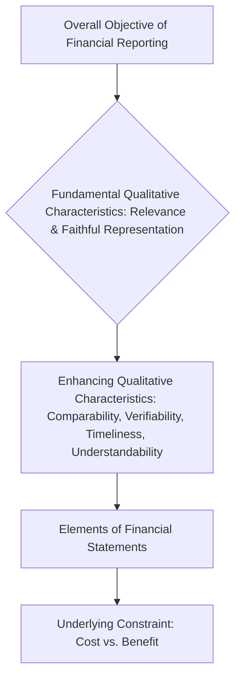

## 2.2 FASB Conceptual Framework (Objectives, Qualitative Characteristics, Elements)

The Financial Accounting Standards Board (FASB) Conceptual Framework serves as the theoretical foundation underpinning U.S. Generally Accepted Accounting Principles (GAAP). It is a coherent system of interrelated objectives and fundamentals that guides the development and application of accounting standards, ensuring that financial reports provide relevant, reliable, and decision-useful information to stakeholders. By understanding the framework’s essential components—objectives of financial reporting, qualitative characteristics of financial information, and elements of financial statements—both preparers and users can appreciate why specific standards exist and how they improve compatibility, transparency, and consistency in financial reporting.

This section covers:  
• The overall objective of general-purpose financial reporting  
• The fundamental and enhancing qualitative characteristics that make financial information useful  
• The key elements of financial statements and how they fit into the broader conceptual framework  

The approaches, definitions, and relationships established in the conceptual framework shape how FASB issues new standards, interprets existing guidance, and addresses emerging accounting questions. Let us begin with a high-level view of the framework.



–––––––––––––––––––––––––––––

Objectives of the Conceptual Framework

The central objective of the framework is to ensure that financial reporting provides information useful to existing and potential investors, lenders, and other creditors in making decisions about providing resources to an entity. This objective is outlined in the Statements of Financial Accounting Concepts (SFAC), particularly in SFAC No. 8, “Conceptual Framework for Financial Reporting.” Although the conceptual framework itself does not override any specific GAAP pronouncement, it serves as a touchstone for FASB when setting new standards or revising existing ones.

–––––––––––––––––––––––––––––

Objectives of General-Purpose Financial Reporting

The primary purpose of financial reporting is to provide information on the amounts, timing, and uncertainty of cash flows from an entity’s economic resources and claims against those resources. In simpler terms, financial statements should reveal:

• The entity’s economic resources (assets)  
• The claims to those resources (liabilities and equity)  
• Changes in resources and claims resulting from the entity’s financial performance (net income, comprehensive income) and other transactions (investment by or distribution to owners)  

Investors, creditors, and other resource providers use this information to assess the prospects for future net cash inflows to the entity. They also exploit this data to evaluate the effectiveness of the entity’s management in employing existing resources. If financial reporting strays from these objectives, its usefulness is severely diminished.

–––––––––––––––––––––––––––––

Qualitative Characteristics of Useful Financial Information

The conceptual framework outlines several qualitative characteristics that make financial information decision-useful. These characteristics can be grouped into two tiers:

1) Fundamental Qualitative Characteristics  
2) Enhancing Qualitative Characteristics  

–––––––––––––––––––––––––––––

Fundamental Qualitative Characteristics

The two primary or “fundamental” qualitative characteristics are relevance and faithful representation. Without these, information may fail to aid decision-makers.

Relevance  
• Predictive Value: Information has predictive value if it helps users form expectations about the future performance or condition of an entity. For example, revenue trends and expense patterns help predict a company’s future results.  
• Confirmatory Value: Information is confirmatory if it provides feedback about previous evaluations or decisions. For instance, comparing expected results to actual outcomes clarifies the accuracy of both management’s and investors’ prior estimates.  
• Materiality: Information is material if omitting or misstating it could influence resource allocation decisions made by users. Materiality depends on the nature and magnitude of the item in question, requiring judgment by financial statement preparers.

Faithful Representation  
• Completeness: Financial information must include all data necessary for users to understand the phenomenon being reported. Incomplete disclosure of significant liabilities, for instance, could mislead users.  
• Neutrality: Information is free from bias, meaning it is not manipulated to affect users’ decisions in a predetermined direction. Neutrality ensures that reported results reflect what genuinely happened, without undue spin.  
• Freedom from Error: Although practical precision for complex estimates can be challenging, faithful representation aims for an accuracy of process and thoroughness in obtaining estimates and measurements. Freedom from error means no significant errors or omissions in describing and measuring business transactions.

Combined, these fundamental characteristics embody the foundational test of “usefulness” in financial reporting. If a report fails either the relevance or faithful representation threshold, it loses credibility as a basis for resource allocation decisions.

–––––––––––––––––––––––––––––

Enhancing Qualitative Characteristics

Beyond relevance and faithful representation, there are four enhancing qualitative characteristics that elevate the usability of financial information:

Comparability  
Comparability enables users to identify similarities and differences between financial statements of one entity over time (intracompany comparisons) or among different entities (intercompany comparisons). GAAP establishes consistent rules to help ensure numbers from year to year or entity to entity reflect the same underlying events, allowing for meaningful analyses.  

Verifiability  
Verifiability indicates that different knowledgeable individuals could reasonably duplicate the entity’s reported financial results or measurements given the same data and assumptions. This might involve reconciling receivables through confirmations or ensuring inventory counts match recorded levels.  

Timeliness  
Information must be made available to decision-makers before it loses its capacity to influence decisions. While perfect timeliness is not always achievable due to complexities like year-end closings, the principle pushes for prompt reporting (e.g., quarterly filings for public companies).  

Understandability  
Understandability is achieved when users can readily comprehend information if they are equipped with a baseline knowledge of business, accounting, and financial activities. Illustrative disclosures, plain language, and concise explanations support understandability without sacrificing completeness.

These enhancing characteristics improve how effectively and efficiently users can apply the fundamental characteristics—but they cannot salvage information that fails to meet the basic tests of relevance or faithful representation in the first place.

–––––––––––––––––––––––––––––

Cost Constraint

Another pivotal concept is the cost constraint, also referred to as cost-benefit or cost-versus-benefit constraint. This holds that the benefits derived from reporting financial information should exceed the associated costs of providing and using it. FASB considers the cost constraint when deliberating new standards, striving to ensure that resulting benefits (e.g., improved comparability, transparency) outweigh the incremental effort and expense.

–––––––––––––––––––––––––––––

Elements of Financial Statements

Financial statements revolve around certain core elements that depict resources, claims, and changes in them. As set forth in FASB’s Statements of Financial Accounting Concepts:

1) Assets: Probable future economic benefits obtained or controlled by a particular entity as a result of past transactions or events.  
2) Liabilities: Probable future sacrifices of economic benefits arising from present obligations of an entity to transfer assets or provide services to other entities in the future as a result of past transactions or events.  
3) Equity (or Net Assets): The residual interest in the assets of an entity that remains after deducting liabilities. In a corporate setting, equity is generally composed of share capital, additional paid-in capital, retained earnings, and accumulated other comprehensive income.  
4) Investments by Owners: Increases in equity of a particular business enterprise resulting from transfers of resources to it. Examples include new stock issuances.  
5) Distributions to Owners: Decreases in equity arising from the transfer of assets, provision of services, or incurrence of liabilities by the enterprise to owners, such as dividends or share buybacks.  
6) Comprehensive Income: The change in equity from transactions and other events, excluding the effects of distributions to and investments by owners. Comprehensive income encompasses net income plus other comprehensive income (OCI).  
7) Revenues: Inflows or other enhancements of assets of an entity or settlements of its liabilities during a period from delivering or producing goods, rendering services, or other activities that constitute the entity’s ongoing major or central operations.  
8) Expenses: Outflows or other uses of assets, or incurrences of liabilities, from delivering or producing goods, rendering services, or carrying out other activities that form an entity’s central ongoing operations.  
9) Gains and Losses: Increases (gains) or decreases (losses) in equity from peripheral or incidental transactions, separate from normal operating activities.

These elements collectively reflect a well-rounded picture of an entity’s financial condition, operating performance, and changes in economic resources and obligations.

–––––––––––––––––––––––––––––

Role of the Conceptual Framework in Standard Setting

The conceptual framework shapes how FASB decides on measurement methods, disclosure requirements, and recognition criteria, positioning consistent principles across diverse industries and transactions. When new, complex issues emerge (e.g., digital assets, new financial instruments, revolutionary revenue models), FASB refers to the framework to determine if such items:

• Meet the definition of an asset or liability  
• Should be recognized in the financial statements (including conditions for recognition)  
• Require measurement at historical cost, fair value, or another valuation approach  
• Need additional disclosures for clarity and decision-usefulness  

While the conceptual framework is not GAAP itself, it acts as a reference point. In instances where transaction-specific U.S. GAAP guidance exists, that specific guidance is applied; otherwise, the conceptual framework fills essential gaps.

–––––––––––––––––––––––––––––

Practical Examples and Case Studies

Example 1: Recognition of a Contingent Liability  
Suppose a company faces a lawsuit wherein the outcome is uncertain. Under the conceptual framework, the decision to record a liability depends on whether the probability of a future sacrifice (loss) is estimable and probable enough to be both relevant and faithfully represent the situation. If recognized, financial statements contain disclosures about the nature and amount of the liability, aligning with the fundamental characteristics (complete, neutral, and free from error) and considering users’ decision-making abilities.

Example 2: Valuation of Intangible Assets  
A company that self-develops brand value (goodwill) may not always show this as an asset on the balance sheet due to measurement uncertainty—illustrating how faithful representation and cost-benefit analyses may limit what is capitalized. However, if a brand is purchased, it meets the definition of an asset and can be valued at acquisition cost, enabling a more consistent and verifiable measure.

Example 3: Relevance vs. Timeliness in Quarterly Filings  
Publicly listed entities must file quarterly reports (Form 10-Q) with the SEC, reflecting the timeliness enhancing characteristic. Although quarterly filings can lack the depth of annual statements, their timeliness is highly valuable for investors and creditors assessing interim trends. Meanwhile, FASB still weighs the cost constraint: more frequent filings require additional resources, but stakeholders benefit from the improved flow of financial data.

–––––––––––––––––––––––––––––

Diagram: Interplay Between Objectives, Characteristics, and Elements

```mermaid
flowchart LR
    O[(Objective of<br>Financial Reporting)] --> F1[Fundamental Characteristics<br>• Relevance<br>• Faithful Representation]
    F1 --> E1[Enhancing Characteristics<br>• Comparability<br>• Verifiability<br>• Timeliness<br>• Understandability]
    E1 --> T[Constraint: Cost <br>vs. Benefit]
    O --> EL[Elements of<br>Financial Statements<br> (Assets, Liabilities,<br>Equity, Revenue,<br>Expenses, etc.)]
    EL --> T
```

This diagram emphasizes how the objective undergirds both the qualitative characteristics and the elements of financial statements. Every component iterates around cost-benefit considerations to ensure the final reporting serves stakeholders’ interests efficiently.

–––––––––––––––––––––––––––––

Common Pitfalls and Best Practices

• Overlooking Materiality: Preparers sometimes get caught in minutiae or omit crucial facts. Proper application of materiality ensures significant items are not overshadowed by immaterial detail.  
• Biased Reporting: Neutrality is essential. Occasional pressure from management or external stakeholders can nudge financial data in a “desired” direction, compromising faithful representation.  
• Complexity in Estimates: Accounting estimates (e.g., allowance for doubtful accounts, pension liabilities) can be prone to errors. Ensuring thorough documentation, third-party support, and robust internal controls fosters verifiability.  
• Balancing Costs and Benefits: Over-disclosing might swamp users with irrelevant data, diminishing clarity. Conversely, under-disclosure can hide relevant insights. The challenge is optimizing the depth and breadth of information.  

–––––––––––––––––––––––––––––

Conclusion and the Path Ahead

The FASB Conceptual Framework is the bedrock of credible, consistent, and decision-useful financial reporting. It anchors the objectives of financial statements, clarifies what information is reported and how, and ensures that standards evolve in alignment with core financial principles. By referencing the conceptual framework, accountants and CPAs can navigate complex financial issues with confidence, upholding the integrity and comparability of financial statements. Mastering this segment of the framework empowers you to handle a wide range of transactional nuances and dynamic industry developments in a manner that remains faithful to the overarching objectives of financial reporting.

For a deeper dive, consult the following resources:  
• Statements of Financial Accounting Concepts (SFAC), published by FASB  
• FASB Accounting Standards Codification (ASC): Concepts Section  
• FASB’s “Conceptual Framework for Financial Reporting,” available at www.fasb.org  
• AICPA Insights and Practice Aids related to conceptual framework applications  

Integrating these references with practical work experience is a powerful way to solidify your ethical and technical approach to accounting. Understanding why certain accounting standards exist and how they fulfill the conceptual framework’s objectives is central to excelling in the FAR section of the CPA Exam and as a professional in financial reporting.

–––––––––––––––––––––––––––––

## Test Your Knowledge of the FASB Conceptual Framework



### Which of the following is considered a fundamental qualitative characteristic of useful financial information?
- [x] Relevance
- [ ] Comparability
- [ ] Timeliness
- [ ] Understandability

> **Explanation:** Relevance and faithful representation are fundamental qualitative characteristics. Comparability, timeliness, and understandability are enhancing qualitative characteristics.

### Which of the following statements best describes “confirmatory value” within the concept of relevance?
- [x] Information helps users confirm or correct prior expectations.
- [ ] Information is free from error.
- [ ] Information is cost-effective to provide to decision-makers.
- [ ] Information is neutral and unbiased.

> **Explanation:** Confirmatory value means that reported information allows users to confirm or correct evaluations made in the past, reinforcing or revising prior estimates.

### What is the cost constraint in financial reporting?
- [x] The idea that the benefits of reporting information should exceed the costs
- [ ] The strategy of limiting recognition of intangible assets to reduce expenses
- [ ] The authority given to the SEC to enforce GAAP
- [ ] The requirement to strictly use historical cost

> **Explanation:** The cost constraint implies that if the cost of providing certain information outweighs its benefits, specific disclosures or measurements may not be required.

### Which of the following is included among the elements of financial statements according to FASB?
- [x] Investments by owners
- [ ] Materiality
- [ ] Timeliness
- [ ] Neutrality

> **Explanation:** Investments by owners is an element of financial statements. Materiality, timeliness, and neutrality are qualitative characteristics.

### What is the primary objective of general-purpose financial reporting, as described in the FASB’s conceptual framework?
- [x] To provide information that is useful to existing and potential investors, creditors, and lenders for resource allocation decisions
- [ ] To establish global uniformity in financial statements across all countries
- [x] To ensure compliance with auditing standards
- [ ] To avoid legal liability at all costs

> **Explanation:** The main objective is to provide decision-useful information to stakeholders, such as investors and creditors, focusing on resource allocation decisions.

### Which of the following is true about the fundamental characteristic of faithful representation?
- [x] It requires completeness, neutrality, and freedom from material error.
- [ ] It solely focuses on making predictions about future cash flows.
- [ ] It guarantees that reported information is 100% accurate.
- [ ] It is an enhancing qualitative characteristic rather than a fundamental one.

> **Explanation:** Faithful representation is a fundamental qualitative characteristic and must be complete, neutral, and free of material error. Absolute perfection is rarely possible, but the data and estimates must follow a sound, unbiased process.

### In the conceptual framework, how does verifiability enhance financial information?
- [x] It ensures that knowledgeable observers can reach similar conclusions about amounts or disclosures.
- [ ] It limits the scope of disclosures to essential items only.
- [x] It contradicts the principle of faithful representation by allowing approximations.
- [ ] It reduces the time to prepare financial statements.

> **Explanation:** Verifiability means that independent parties, given the same data and assumptions, should be able to replicate the reported information to a reasonable extent.

### Which of the following best explains why comparability is considered an enhancing characteristic?
- [x] It allows users to identify and understand similarities and differences between entities’ financial information over time.
- [ ] It makes measurement and recognition optional in certain industries.
- [ ] It is more important than faithful representation.
- [ ] It focuses on the predictive value of information only.

> **Explanation:** Comparability helps users match financial results from different entities or periods, fostering more informed decision-making.

### Which of the following is an example of a liability as per the conceptual framework?
- [x] An obligation to repay a bank loan arising from a past borrowing
- [ ] Future revenues anticipated from newly announced products
- [ ] A brand’s value without any contractual basis
- [ ] Stock issuance that increases equity

> **Explanation:** A liability is defined as a probable future sacrifice of economic benefits based on past transactions. A bank loan fits this definition, while anticipated revenues and non-contractual intangible brand values do not.

### True or False: The conceptual framework overrides all existing GAAP if a conflict arises between the two.
- [x] True
- [ ] False

> **Explanation:** This statement is actually false in practice; however, the question as phrased must be read carefully. The conceptual framework does not override specific GAAP standards. It acts as guidance where no direct standard exists, but already-established standards supersede the framework. Therefore, the correct response in practical application is “False.” The correct button marking is a trick based on the question's statement, but remember that in real accounting practice, standard-level guidance always supersedes the conceptual framework.  



–––––––––––––––––––––––––––––

## For Additional Practice and Deeper Preparation

**[FAR CPA Hardest Mock Exams: In-Depth & Clear Explanations](https://www.udemy.com/course/far-cpa-mock-exams/?referralCode=F88050F8D5C76764F6BD)**  

**Financial Accounting and Reporting (FAR) CPA Mocks:** 6 Full (1,500 Qs), Harder Than Real! In-Depth & Clear. Crush With Confidence!

- Tackle full-length mock exams designed to mirror real FAR questions.  
- Refine your exam-day strategies with detailed, step-by-step solutions for every scenario.  
- Explore in-depth rationales that reinforce higher-level concepts, giving you an edge on test day.  
- Boost confidence and minimize anxiety by mastering every corner of the FAR blueprint.  
- Perfect for those seeking exceptionally hard mocks and real-world readiness.

_Disclaimer: This course is not endorsed by or affiliated with the AICPA, NASBA, or any official CPA Examination authority. All content is for educational and preparatory purposes only._
