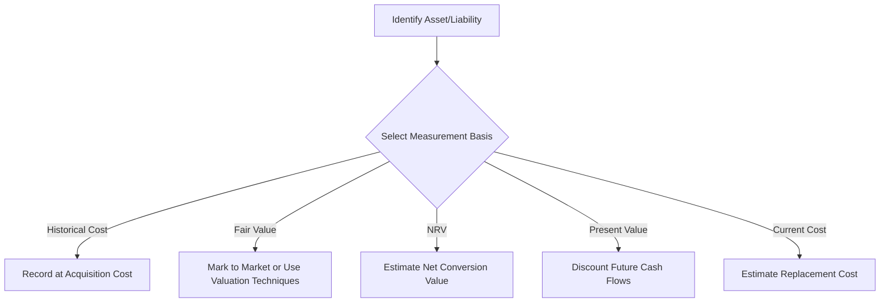
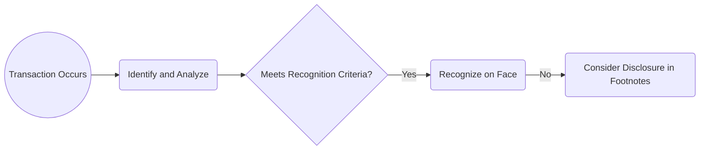

## 2.3 Measurement, Recognition, and Disclosure Concepts

This section focuses on one of the most essential pillars of financial reporting: how and why elements of financial statements are measured, recognized, and disclosed. These concepts form the underpinnings of reliable and transparent financial statements, ensuring that users can make informed economic decisions. We will examine core measurement attributes (e.g., historical cost, fair value) as well as the criteria that inform whether an item should be recognized in the body of the financial statements or disclosed in the notes. We will also highlight the importance of consistent application of these principles, explore best practices, discuss common pitfalls, and offer a series of real-world examples to deepen understanding.

-------------------------------------------------------------------------------

### Overview

The conceptual framework established by the Financial Accounting Standards Board (FASB) sets forth the objectives and qualitative characteristics that guide financial reporting. Among these guiding principles is the need to select appropriate measurement bases (e.g., historical cost, fair value, net realizable value, present value) that best reflect the economic reality of transactions. Additionally, understanding recognition criteria—the point at which an item is formally recorded and presented on the face of the financial statements—versus the decision to merely disclose information is paramount for consistent and comparable reporting.

Measurement, recognition, and disclosure concepts are deeply intertwined with the fundamental qualitative characteristics of relevance, faithful representation, comparability, verifiability, timeliness, and understandability. They also serve to maintain consistency within firm-level accounting policies and across industries at large.

-------------------------------------------------------------------------------

### Core Measurement Attributes

Accurate measurement provides the basis upon which financial statements are built. Different measurement attributes exist in U.S. GAAP, each reflecting a different lens through which to capture the economic reality of an asset, liability, or transaction.

#### Historical Cost

• Definition: The amount paid (or liability incurred) at the time of acquisition.  
• Usage: Commonly applied to property, plant, and equipment (PP&E), intangibles upon initial recognition, and many inventory items.  
• Rationale: Viewed as an objective, verifiable benchmark.  
• Limitations: May become less relevant over time, especially during periods of significant inflation or rapid technological change.  

#### Fair Value

• Definition: The price that would be received to sell an asset or paid to transfer a liability in an orderly transaction between market participants at the measurement date (per FASB ASC 820).  
• Usage: Often applied to financial instruments, including trading securities, derivatives, and certain long-lived assets subjected to impairment testing.  
• Rationale: Enhances relevance by reflecting current market conditions.  
• Limitations: May introduce volatility in financial statements; requires robust market data and valuation techniques.  

#### Net Realizable Value (NRV)

• Definition: The estimated selling price in the ordinary course of business, minus reasonably predictable costs of completion, disposal, and transportation.  
• Usage: Frequently used in measuring accounts receivable (less allowance for doubtful accounts) and some inventories.  
• Rationale: Provides a conservative assessment of an asset's cash conversion potential.  
• Limitations: Primarily relevant for short-term assets and subject to judgment and estimation.  

#### Present Value

• Definition: The discounted future cash flows associated with an asset or liability, reflecting the time value of money and risk factors.  
• Usage: Applied to long-term receivables, payables (e.g., bonds and notes), and certain leases.  
• Rationale: Captures the economic substance of cash flows over time.  
• Limitations: Sensitive to assumptions about discount rates, timing, and risk adjustments.  

#### Current Cost

• Definition: The cost that would be incurred to acquire or replace an asset under current market conditions.  
• Usage: Less common in U.S. GAAP but used in certain inflation-adjusted reporting and in some IFRS contexts.  
• Rationale: Reflects the replacement value of an asset.  
• Limitations: Requires market data and can be subject to volatility and estimation.  

Below is a simplified diagram summarizing the measurement attribute selection process:

Each attribute aims to capture a different aspect of the asset or liability’s economic value. Depending on the nature of the transaction and existing authoritative guidance (e.g., FASB ASC Topics 820 for fair value or 330 for inventory), accountants must carefully evaluate which measurement basis provides the most relevant and faithfully representative information to users.

-------------------------------------------------------------------------------

### Recognition Concepts and Criteria

Recognition is the act of formally recording an item in the financial statements with a dollar amount. Accounting literature, particularly the FASB’s Statements of Financial Accounting Concepts (SFAC No. 5 and No. 8), provides a conceptual basis for deciding when to recognize an asset, liability, revenue, or expense. 

#### Key Recognition Criteria

1. The item meets the definition of an element in the financial statements (e.g., asset, liability, equity, revenue, or expense).  
2. It is probable that any associated future economic benefit (for an asset) or economic sacrifice (for a liability) will arise.  
3. The item has a relevant measurement attribute that can be reliably measured.  

Only when these criteria are satisfied do accountants typically record the item in the entity’s books. If the criteria are not met, the item may still warrant disclosure (e.g., in footnotes), where qualitative information can be provided to users without impacting the face of the financial statements.

#### Revenue Recognition

Revenue is recognized when control of the goods or services has transferred to the customer, and it is probable that the entity will collect the consideration to which it is entitled. Under ASC 606 (Revenue from Contracts with Customers), the five-step model is used:  
1. Identify the contract(s) with a customer.  
2. Identify the performance obligations in the contract.  
3. Determine the transaction price.  
4. Allocate the transaction price to the performance obligations.  
5. Recognize revenue when (or as) the entity satisfies a performance obligation.  

#### Expense Recognition

Expense recognition (or “matching”) generally occurs as resources are consumed or when liabilities are incurred. The principle of matching aligns expenses directly or indirectly with the revenues they help generate (e.g., cost of goods sold recognized when the corresponding revenue is recorded).

-------------------------------------------------------------------------------

### Disclosure Considerations

Financial statement disclosures provide context, clarity, and additional information about recognized items or about certain unrecognized events, conditions, or risks that might affect the entity’s financial position and performance. Disclosures are crucial to fully portray the economic substance of transactions:

#### Why Disclosures Matter

1. Supplement the amounts recognized on the financial statements.  
2. Provide qualitative and quantitative information about key areas of uncertainty, such as contingent liabilities, related-party transactions, or changes in accounting policies.  
3. Enhance transparency, comparability, and decision-usefulness.

#### Recognition vs. Disclosure

Choosing between recognition and disclosure can be a nuanced process. Items that are uncertain in amount or timing, or that do not fully qualify for recognition (yet have a material potential effect on the entity’s financial position or performance), are more likely to be presented in the notes. For example:
- Commitments and contingencies that do not meet the probable and estimable criteria for a liability.  
- Potential legal claims for which the outcome cannot be reasonably estimated.  
- Significant subsequent events that do not adjust the financial statements but are material to users' understanding of the entity’s position.  

When significant judgements or estimates are involved—such as fair value measures classified under Level 3 of the fair value hierarchy—the footnotes are often substantial, describing the valuation methodologies, assumptions, and sensitivities.

-------------------------------------------------------------------------------

### The Importance of Consistent Application

Consistency in measurement, recognition, and disclosure builds trust and comparability across time and across entities. Without consistent application of accounting policies:
- Trends would be obscured, making it harder for investors and creditors to track performance.  
- Comparisons among similar entities would become less meaningful.  
- Users would face challenges in interpreting results, potentially leading to poor economic decisions.

However, the framework also acknowledges that changes or updates to accounting methods may be warranted when required by new accounting standards or when a more reliable, relevant method becomes available. In such circumstances, proper disclosure and retrospective or prospective application (as appropriate) ensure that users understand the nature and effect of the change.

-------------------------------------------------------------------------------

### Real-World Illustrations and Examples

Below are scenarios that illustrate how measurement and recognition decisions can impact financial reporting:

• A manufacturing firm acquires new machinery for $100,000. At the date of purchase, the historical cost of $100,000 becomes the appropriate measurement. Although the machinery might be revalued under IFRS or subject to impairment testing if its fair value declines significantly below book value, under most U.S. GAAP scenarios, the machinery remains at historical cost less accumulated depreciation unless it is held for sale or needs an impairment writedown.

• A retailer factors its receivables to a financing company. The transaction’s substance determines recognition: If the receivables are sold “without recourse” and the risk of ownership shifts, the retailer derecognizes the receivable and records any resulting gain or loss. If the criteria for sale are not met (e.g., with recourse arrangement), the transaction might be recorded as a borrowing rather than a sale, highlighting the importance of correct balance sheet presentation and disclosure.

• A software-as-a-service (SaaS) provider sells subscriptions with bundled services. Under ASC 606, management must identify each performance obligation (e.g., software license, implementation services, phone support) and allocate the transaction price accordingly. This process involves measurement using stand-alone selling prices and results in the recognition of revenue over time or at a point in time, depending on the nature of the obligation.

• A company has a pending lawsuit. If it is probable that a liability has been incurred and the amount can be reasonably estimated, the company recognizes a loss contingency and liability. If it is only “reasonably possible”—rather than probable—that a liability exists, the company discloses the nature of the contingency in the notes without recording the liability.

-------------------------------------------------------------------------------

### Best Practices and Common Pitfalls

1. **Best Practices**  
   - Maintain robust documentation to support the chosen measurement attributes and recognition decisions.  
   - Use internal controls and cross-functional teams (finance, operations, legal) to scrutinize estimates and assumptions.  
   - Provide transparent and thorough disclosures, especially for complex areas such as fair value measurement at Level 3.  
   - Stay current on new standards (e.g., updates in ASC Topics) and adapt measurement techniques in line with authoritative guidance.

2. **Common Pitfalls**  
   - Overlooking intangible or contingent assets or liabilities (e.g., failing to recognize intangible assets acquired in a business combination).  
   - Underestimating or overestimating fair value changes due to flawed valuation models or outdated assumptions.  
   - Confusing recognition with disclosure—some items might only merit note disclosure rather than recognition, potentially leading to overstatement of assets or liabilities.  
   - Inconsistent application of accounting policies across reporting periods, leading to a lack of comparability.

-------------------------------------------------------------------------------

### Conclusion

Measurement, recognition, and disclosure concepts form the backbone of high-quality financial statements. Without consistent and appropriate selection of measurement attributes, clear criteria for recognition versus disclosure, and thorough explanatory notes, financial information becomes less reliable and less relevant. An effective accountant or CPA candidate must master these concepts to ensure transparency, comparability, and faithful representation of an entity’s financial health and performance.  

Through carefully reasoned judgment, adherence to FASB’s accounting standards, and awareness of industry best practices, professionals can deliver financial statements that serve the overarching goal of supporting informed business and investment decisions.

-------------------------------------------------------------------------------

### References for Further Exploration

• FASB ASC 820: Fair Value Measurement  
• FASB Conceptual Framework (SFAC No. 5, No. 6, and No. 8)  
• FASB ASC 606: Revenue from Contracts with Customers  
• FASB ASC 450: Contingencies  
• IFRS Conceptual Framework (for comparison with U.S. GAAP)  
• IAS 16: Property, Plant, and Equipment (IFRS)  
• Additional discussion on IFRS differences can be found in Chapter 25 of this guide.

-------------------------------------------------------------------------------

## Check Your Understanding: Measurement, Recognition & Disclosure Mastery



### Which measurement basis reflects the original amount paid to acquire an asset?

- [x] Historical cost
- [ ] Fair value
- [ ] Net realizable value
- [ ] Current cost

> **Explanation:** Historical cost captures the asset’s acquisition cost at the date of purchase or incurrence of liability, generally unaffected by subsequent changes in market value.

### What does “probable” mean in the context of recognizing a loss contingency?

- [ ] More than a 25% likelihood
- [x] Likely to occur (commonly interpreted as approx. > 70-75% chance)
- [ ] Absolutely certain
- [ ] Only slightly greater than “reasonably possible”

> **Explanation:** U.S. GAAP offers guidance indicating that “probable” generally means the future event is likely to occur, often interpreted around 70-75% or above. This threshold must be met, along with a reasonable estimate of the amount, to record the liability.

### Under ASC 606, which of the following is part of the five-step model for revenue recognition?

- [x] Identify the performance obligations in the contract
- [ ] Post entries for a final adjusting journal
- [ ] Perform horizontal analysis
- [ ] Evaluate discontinued operations

> **Explanation:** Step Two of the ASC 606 model involves identifying the performance obligations in the contract. The other items listed are not part of the five-step model.

### In most cases, what is the primary limitation of historical cost as a measurement basis?

- [x] It may become less relevant over time due to inflation or changing economic conditions
- [ ] It is too volatile and difficult to verify
- [ ] It relies heavily on Level 3 fair value assumptions
- [ ] It cannot be applied to tangible assets

> **Explanation:** A common criticism of historical cost is that it does not reflect current economic conditions, thus becoming less relevant. It is, however, quite verifiable and typically less volatile than fair value.

### If an asset's current market price is used for measurement, which basis are we likely using under U.S. GAAP?

- [x] Fair value
- [ ] Historical cost
- [x] Net realizable value
- [ ] Present value

> **Explanation:** Fair value generally relies on current market data, while net realizable value can also reflect a type of current value but specifically takes into account costs of completion and disposal. Both may use a form of “current” inputs, but fair value is primarily associated with market-based measurements.

### When a company applies the principle of matching, which pairing is correct?

- [x] Expenses are recognized in the same period as related revenues
- [ ] Revenues are always recognized once cash is received
- [ ] Expenses are recognized only upon final settlement of liabilities
- [ ] Liabilities are recognized only when payments are disbursed

> **Explanation:** Matching prescribes that expenses should be recognized in alignment with the revenues they help generate, irrespective of cash flows.

### Which of the following is an example of disclosure rather than recognition?

- [x] A lawsuit that is reasonably possible but not probable
- [ ] Depreciation expense recorded each month
- [x] Revenue posted for goods delivered
- [ ] Impairment loss on a machine included in the income statement

> **Explanation:** When a loss contingency is only “reasonably possible” and not probable or estimable, U.S. GAAP generally requires footnote disclosure rather than recording a liability on the balance sheet.

### In the event a fair value hierarchy uses unobservable inputs that require significant judgment, under which level does the fair value measurement fall?

- [x] Level 3
- [ ] Level 1
- [ ] Level 2
- [ ] Level 4

> **Explanation:** Level 3 is the category for measurements based mainly on unobservable inputs and significant management assumptions, as opposed to Level 1 (quoted prices in active markets) and Level 2 (observable inputs besides quoted prices).

### Which concept helps ensure that financial statements from different reporting periods are comparable?

- [x] Consistency in application of accounting principles
- [ ] Historical cost basis at all times
- [ ] Switching from GAAP to IFRS frequently
- [ ] Using varied measurement methods in each period

> **Explanation:** Consistency in the application of accounting principles from one period to the next ensures comparability in the financial statements, barring mandated changes or improvements in accounting methods.

### True or False: A company must always disclose all non-financial information in its footnotes.

- [x] True
- [ ] False

> **Explanation:** Certain non-financial data, especially if it directly affects users’ understanding of the financial position and performance or is required by regulatory guidance, should be disclosed to provide a complete picture. Not every piece of non-financial data is required, but material elements often must be included for transparency.



-------------------------------------------------------------------------------

## For Additional Practice and Deeper Preparation

**[FAR CPA Hardest Mock Exams: In-Depth & Clear Explanations](https://www.udemy.com/course/far-cpa-mock-exams/?referralCode=F88050F8D5C76764F6BD)**  

**Financial Accounting and Reporting (FAR) CPA Mocks:** 6 Full (1,500 Qs), Harder Than Real! In-Depth & Clear. Crush With Confidence! 

- Tackle full-length mock exams designed to mirror real FAR questions.  
- Refine your exam-day strategies with detailed, step-by-step solutions for every scenario.  
- Explore in-depth rationales that reinforce higher-level concepts, giving you an edge on test day.  
- Boost confidence and minimize anxiety by mastering every corner of the FAR blueprint.  
- Perfect for those seeking exceptionally hard mocks and real-world readiness.  

_Disclaimer: This course is not endorsed by or affiliated with the AICPA, NASBA, or any official CPA Examination authority. All content is for educational and preparatory purposes only._
