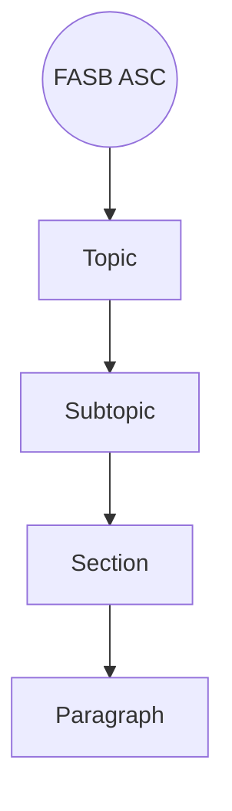

## 2.4 Hierarchy of U.S. GAAP and Researching the Codification

Ensuring compliance with U.S. Generally Accepted Accounting Principles (GAAP) is a cornerstone of maintaining transparency, consistency, and comparability in financial reporting. This section explores the evolution and current state of the U.S. GAAP hierarchy, provides strategies for navigating the FASB Accounting Standards Codification (ASC), and offers effective research tools and techniques for aspiring CPAs. By mastering these steps, you will be well-prepared to find relevant guidance for any accounting situation.

### Introduction

Financial reporting in the United States follows the rules and guidelines established under U.S. GAAP. Historically, various accounting standards were issued by multiple bodies, including the Financial Accounting Standards Board (FASB), the American Institute of Certified Public Accountants (AICPA), and the Emerging Issues Task Force (EITF). This resulted in a complex patchwork of pronouncements and interpretations.

In 2009, the FASB introduced the Accounting Standards Codification, which simplified the structure of U.S. GAAP by integrating all existing standards into a single, authoritative source. It also effectively superseded the prior “levels” of GAAP, meaning all accounting literature now flows from or into specific topics, subtopics, sections, and paragraphs of the Codification. Understanding this structure and how to conduct effective research within the Codification is essential for financial accountants, auditors, and those preparing for the Uniform CPA Examination.

This chapter section outlines the key layers of authority in GAAP, highlights common resources within the Codification, provides guidance on efficient research techniques, and demonstrates best practices and potential pitfalls in practical scenarios.

---

### The Hierarchy of U.S. GAAP

Prior to the establishment of the Accounting Standards Codification, GAAP was organized in multiple layers of authority, commonly referred to as a “hierarchy.” That hierarchy, which was embedded in various auditing standards, broadly identified which documents and pronouncements accountants should consult first when confronted with an accounting issue. However, once the Codification took effect on July 1, 2009, all previous levels of GAAP were integrated into a single system (the ASC), and everything outside the Codification was relegated to non-authoritative status (with a few explicit exceptions, such as SEC guidance for public companies).

Although the pre-Codification hierarchy no longer formally guides how we search for standards, understanding it offers insight into how GAAP is structured and why certain guidance has more authority than other forms of literature. At a high level, the standard-setting environment and hierarchy of U.S. GAAP look like this:

• FASB (Financial Accounting Standards Board) issues ASUs (Accounting Standards Updates).  
• EITF (Emerging Issues Task Force) addresses new or unusual market conditions, quickly interpreting how GAAP should be applied.  
• SEC (Securities and Exchange Commission) issues authoritative regulations for publicly traded companies, such as Regulation S-X and Staff Accounting Bulletins (SABs).  

All these authoritative pronouncements are woven into the ASC. The FASB ASC is now the single “go-to” repository for relevant U.S. GAAP guidance. Understanding each entity’s role within GAAP helps in appreciating the conceptual foundation and practicality of the Codification.

---

### Navigating the FASB Accounting Standards Codification

The FASB Accounting Standards Codification is structured by Topic, Subtopic, Section, and Paragraph, forming a logical pyramid that organizes financial accounting and reporting standards. Each section has a uniform four-digit numerical reference (Topic-Subtopic-Section-Paragraph), making it possible to locate specific guidance rapidly.

Below is a simplified diagram illustrating how the ASC is organized:

• Topic: The broad category of accounting transactions or financial statement elements, e.g., “ASC 605 – Revenue Recognition” or “ASC 350 – Intangibles – Goodwill and Other.”  
• Subtopic: Within each Topic, Subtopics address particular aspects or transactions, e.g., “350-20” specifically deals with goodwill.  
• Section: Each Subtopic is further broken down into sections covering specific subject areas, such as scope, recognition, measurement, subsequent measurement, disclosure, and implementation guidance.  
• Paragraph: Within each section, paragraphs provide the actual authoritative text, sometimes supported by implementation guidance and illustrative examples.

#### Example: Locating Guidance on Goodwill

Goodwill accounting is found in Topic 350 “Intangibles – Goodwill and Other.” The Subtopic for goodwill is “350-20.” Within that Subtopic, you might find the recognition guidance in Section 25, subsequent measurement guidance in Section 35, and disclosures in Section 50. Each requirement is described in numbered paragraphs, such as “ASC 350-20-35-30.” This reference means:

• Topic 350  
• Subtopic 20  
• Section 35 (Subsequent Measurement)  
• Paragraph 30  

Such references ensure clarity and precision when citing specific rules.

---

### Performing Effective Research in the Codification

Mastering the Codification is invaluable for both exam preparation and day-to-day accounting practice. Here is a systematic approach:

Identify the Accounting Issue  
Before jumping into the Codification, precisely define the accounting question. Are you trying to decide whether to capitalize or expense a certain cost? Do you need to determine the measurement basis for a new type of intangible asset? A clear scope enables you to search effectively.

Select Keywords and Topics  
List the key terms associated with your question. For debt issues, use terms like “interest,” “amortization,” and “notes payable.” For intangible asset queries, consider words like “amortization,” “goodwill,” “identifiable,” and “finite lived.” These keywords will help you locate the relevant topics.

Use the Codification Browser  
The FASB provides an online portal for searching the ASC. Most researchers start by entering a keyword into the “Search” bar. If you know the Topic number (e.g., 860 for Transfers and Servicing of Financial Assets), you can navigate directly.

Filter by Subtopic  
After locating a relevant Topic, browse the Subtopics that appear in the left panel or in the table of contents. For instance, if you are analyzing indefinite-lived intangible assets, look for Subtopic 350-30 (General Intangibles Other than Goodwill).

Review Sections Thoroughly  
Each Subtopic includes multiple sections (e.g., Scope and Scope Exceptions, Initial Recognition, Subsequent Measurement, etc.). Review these sections carefully. Some sections, such as the Implementation Guidance or Illustrations, may provide examples or interpretive case studies that clarify intent.

Document and Confirm Your Findings  
Copy the relevant paragraph references (e.g., ASC 350-30-35-5) and double-check whether your issue falls within the stated scope. Make note of any references to other codification sections or SEC guidance, especially if you are dealing with a publicly traded company. Cross-referencing is vital for ensuring you do not miss relevant nuances.

Consider External Sources  
Although the Codification is authoritative for U.S. GAAP, sometimes more context is found in non-authoritative sources (e.g., AICPA Technical Q&As, accounting textbooks, or recognized industry best practices). These can provide application insights but are not official GAAP. Always confirm the final stance within the Codification.

---

### Practical Examples and Case Studies

Real-world examples underscore how to apply these research strategies and illustrate the nuances of authoritative guidance.

#### Example 1: Software Development Costs

A tech startup is developing new software intended for its internal use. The development manager wonders whether to expense all programming costs or whether some can be capitalized. Within the Codification:

• Step 1: Identify the Topic: Search for “software development costs,” leading you to Topic 350. You will find that ASC 350-40 covers internal-use software.  
• Step 2: Determine the Subtopic: 350-40 specifically addresses “Accounting for the Costs of Computer Software Developed or Obtained for Internal Use.”  
• Step 3: Find the Relevant Section: Look into Sections 25 (Recognition) and 40 (Derecognition). Section 25 will clarify which costs can be capitalized during the application development stage.  
• Step 4: Verify Scope: Confirm that the scope explicitly includes software developed for internal use and not for sale.  
• Step 5: Apply Guidance: The ASC explains which costs can be capitalized and which must be expensed.  

Through this process, you realize that coding costs incurred during the software’s application development stage can often be capitalized, subject to meeting specified criteria.

#### Example 2: Factoring Accounts Receivable

A manufacturing firm wants to factor (sell) its accounts receivable to a third-party finance company. Management needs to determine whether the transaction should be accounted for as a sale or a secured borrowing. The relevant guidance:

• Step 1: Identify the Topic: Search for “factoring of receivables,” leading to Topic 860, “Transfers and Servicing.”  
• Step 2: Subtopic: 860-10 covers the overall guidance, but specific paragraphs address the conditions for sale accounting (i.e., surrender of control).  
• Step 3: Check Sections: Section 20 includes Scope, while Section 40 addresses Derecognition. Identify requirements such as (1) legal isolation of the transferred assets, (2) transferee having the right to pledge or exchange the assets, and (3) no continuing involvement in the assets.  
• Step 4: Disclosures: Consult Section 50 for any required disclosures related to factoring or securitizations.  

If all three criteria in ASC 860-10-40-5 are met, the transaction is accounted for as a sale, otherwise it is treated as a secured borrowing.

---

### Best Practices, Common Pitfalls, and Tips

Accounting research within the Codification can be labor-intensive, especially under exam conditions or tight client deadlines. Below are some best practices to increase efficiency and accuracy:

Use a Structured Process  
Adopting a clear, step-by-step approach that begins with defining the question ensures you stay on track. Randomly browsing the Codification without a clear scope can be time-consuming.

Leverage Cross-References  
The ASC frequently references other Topics or Subtopics for further detail. For example, inventory measurement might cross-reference revenue recognition if you are dealing with sales returns. Following these links prevents missing crucial guidelines.

Watch Out for Scope Exceptions  
Certain transactions that might seem relevant to a particular section may be scoped out in a separate section. Always review the “Scope and Scope Exceptions” paragraphs to ensure the guidance applies to your scenario.

Document Your Steps  
Taking careful notes of each Codification reference not only helps you maintain an audit trail but also avoids repeating research. In a work environment, well-documented research supports audit readiness and peer reviews.

Stay Current with ASUs  
The Codification is updated with new Accounting Standards Updates (ASUs) from the FASB. Sign up for notifications or newsletters so you know when changes become effective and how they affect existing guidance.

Avoid Overreliance on Non-Authoritative Guidance  
While firm publications, textbooks, and online forums can offer helpful explanations and examples, they must be supplemented by the authoritative language in the Codification. Always confirm final answers by referencing ASC paragraphs.

Understand SEC vs. Non-SEC Guidance  
For public entities, SEC guidance can carry a level of authority that merges into the overarching GAAP realm (e.g., Regulation S-X, Staff Accounting Bulletins). Check for nuances if you are dealing with an SEC registrant.

---

### Additional References and Suggested Reading

• FASB Accounting Standards Codification (https://asc.fasb.org): The official, authoritative source of U.S. GAAP.  
• FASB (https://www.fasb.org): Publishes updates, exposure drafts, meeting minutes, and conceptual framework discussions.  
• AICPA (https://www.aicpa.org): Hosts technical Q&As, audit and accounting guides, and other resources.  
• SEC (https://www.sec.gov): Offers regulations applicable to public companies, Staff Accounting Bulletins, and guidance on filings.  
• Wiley CPA Review Materials and AICPA Exam Blueprints: Provide additional practice MCQs and simulations aligned with the Uniform CPA Examination requirements.

---

## Master the GAAP Hierarchy: Comprehensive Quiz



### Which source represents the single authoritative platform for U.S. GAAP?

- [x] The FASB Accounting Standards Codification
- [ ] The AICPA Professional Standards
- [ ] The SEC EDGAR database
- [ ] The PCAOB Auditing Standards

> **Explanation:** Since July 1, 2009, the Accounting Standards Codification is considered the single authoritative source of U.S. GAAP. Everything else is either integrated into it or non-authoritative.

### When performing accounting research, what is the first step?

- [x] Define the accounting question or issue precisely
- [ ] Browse non-authoritative sources for best practices
- [x] Identify relevant ASC Topics by searching key terms
- [ ] Document your findings in the workpapers

> **Explanation:** You generally begin research by clearly defining the issue. Simultaneously, identifying relevant ASC Topics is also critical at the outset.

### Which entity issues Accounting Standards Updates (ASUs) that modify the Codification?

- [x] The Financial Accounting Standards Board (FASB)
- [ ] The American Institute of Certified Public Accountants (AICPA)
- [ ] The Governmental Accounting Standards Board (GASB)
- [ ] The International Accounting Standards Board (IASB)

> **Explanation:** The FASB is responsible for publishing ASUs that update U.S. GAAP as reflected in the Codification.

### What is one of the key criteria in ASC 860-10 for factoring receivables to be treated as a sale instead of a secured borrowing?

- [x] The assets must be legally isolated from the transferor
- [ ] The transferor must retain active involvement with the assets
- [ ] The transferee must immediately resell the assets to a third party
- [ ] The agreement must include convertible debt instruments

> **Explanation:** For a factoring arrangement to qualify as a sale under ASC 860-10-40-5, the transferred assets must be beyond the reach of the transferor’s creditors and legally isolated, among other criteria.

### Where do you typically find illustrative examples and interpretive guidance within the Codification?

- [x] Implementation Guidance and Illustrations Sections
- [ ] FASB Board Meeting Minutes
- [x] Introductory Paragraph of each Topic
- [ ] Table of Contents

> **Explanation:** The Implementation Guidance (often labeled “S”) and Illustrations Sections in the ASC provide practical examples for applying the standards. Introductory paragraphs may contain a summary but are less likely to include full illustrations.

### What is the primary objective of the FASB Conceptual Framework in relation to the Codification?

- [x] To guide the standard-setting process, ensuring internal consistency among Topics
- [ ] To supersede existing codified standards
- [ ] To establish new IFRS guidelines
- [ ] To replace disclosures within the ASC

> **Explanation:** The Conceptual Framework provides theoretical underpinnings for consistent standard-setting but does not override existing authoritative guidance.

### Which of the following is a best practice when documenting your Codification research?

- [x] Keeping a clear record of Topic, Subtopic, Section, and Paragraph
- [ ] Only referencing the broad Topic number
- [x] Relying solely on external articles
- [ ] Citing outdated paragraphs if they are still published online

> **Explanation:** Proper referencing ensures a clear audit trail. Using credible, current paragraphs is mandatory, and external articles alone cannot substitute for the Codification.

### In the FASB Codification structure, what level comes directly after Topic?

- [x] Subtopic
- [ ] Section
- [ ] Paragraph
- [ ] Appendix

> **Explanation:** A Topic is subdivided first into Subtopics, which are subdivided further into Sections, and finally into Paragraphs.

### Why is it critical to review the “Scope and Scope Exceptions” section in the ASC?

- [x] It helps confirm if a particular standard applies to the transaction at hand
- [ ] It provides a summary of all required journal entries
- [ ] It replaces the need for Implementation Guidance
- [ ] It details IFRS differences for the specific Topic

> **Explanation:** Some standards may contain explicit exceptions that could exclude a transaction. Verifying scope ensures the correct standard is applied.

### A non-public company must adopt new FASB guidance after its effective date. True or False?

- [x] True
- [ ] False

> **Explanation:** Regardless of public or private status, once an ASU becomes effective for non-public entities, compliance is required to maintain conformity with U.S. GAAP.



---

## For Additional Practice and Deeper Preparation

**[FAR CPA Hardest Mock Exams: In-Depth & Clear Explanations](https://www.udemy.com/course/far-cpa-mock-exams/?referralCode=F88050F8D5C76764F6BD)**

Financial Accounting and Reporting (FAR) CPA Mocks: 6 Full (1,500 Qs), Harder Than Real! In-Depth & Clear. Crush With Confidence!

- Tackle full-length mock exams designed to mirror real FAR questions.  
- Refine your exam-day strategies with detailed, step-by-step solutions for every scenario.  
- Explore in-depth rationales that reinforce higher-level concepts, giving you an edge on test day.  
- Boost confidence and minimize anxiety by mastering every corner of the FAR blueprint.  
- Perfect for those seeking exceptionally hard mocks and real-world readiness.  

_Disclaimer: This course is not endorsed by or affiliated with the AICPA, NASBA, or any official CPA Examination authority. All content is for educational and preparatory purposes only._
