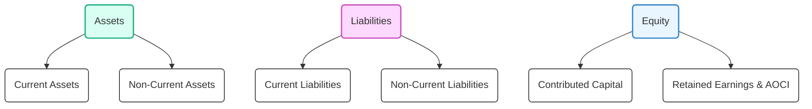

## 3.1 Comprehensive Review of the Balance Sheet (Statement of Financial Position)

The balance sheet—often referred to as the statement of financial position—provides a snapshot of an entity’s financial standing at a specified point in time. It highlights what the business owns (assets), owes (liabilities), and the net interest of owners (equity). As one of the primary financial statements, the balance sheet is central to understanding a company’s liquidity, solvency, and overall capital structure. Its importance extends to various stakeholders, including creditors, investors, regulators, and management, who rely on the balance sheet to evaluate risk, estimate future cash flows, and gauge financial flexibility.

This section comprehensively explores proper classification of balance sheet elements. It covers relevant U.S. GAAP guidance, typical presentation formats, examples, and disclosures. By the end, you will be equipped with a deeper understanding of how to prepare, read, and interpret the statement of financial position, meeting the nuances of CPA Exam requirements.

### Overview of the Balance Sheet

A balance sheet generally follows the accounting equation:

  
 \text{Assets} = \text{Liabilities} + \text{Equity} 

  
Each component reflects the resources controlled by an entity, future sacrifices of those resources, or the residual interest in net assets. The balance sheet differs from the income statement, which measures performance over a period, because the balance sheet confines its perspective to a specific date, thus capturing the outcome of all prior transactions and events up to that moment.

While the broad categories of “Assets,” “Liabilities,” and “Equity” are consistent across entities, the items within each category can vary dramatically based on industry practices, regulatory requirements, or entity-specific transactions.

### Classified vs. Non-Classified Presentations

Companies typically present their balance sheets in one of two basic formats:

• Classified Balance Sheet (most common, especially under U.S. GAAP)  
• Non-Classified (or Unclassified) Balance Sheet (less common)  

A classified balance sheet separates assets and liabilities into current and non-current (long-term) categories, offering users a snapshot of the organization’s near-term liquidity and longer-term financial obligations. Conversely, a non-classified balance sheet omits such subdivisions, grouping all assets and liabilities under broad headings without distinguishing their maturity or liquidity horizons. In both formats, the total assets equal the total of liabilities plus equity.

#### Benefits of a Classified Balance Sheet

1. Facilitation of Liquidity Assessments  
   Investors analyze current assets and current liabilities to determine a company’s ability to meet short-term obligations. Ratios such as current ratio or quick ratio originate from classified category groupings.

2. Simplification of Credit Evaluations  
   Creditors can more readily see the alignment between short-term assets and short-term liabilities, important for extended lines of credit or short-term borrowings.

3. Enhanced Decision-Making  
   Management and external stakeholders identify the types of assets deployed (e.g., intangible vs. tangible), focusing on capital structure, funding strategies, and per-period operating requirements.

### Assets Classification

Under a classified balance sheet, assets are typically segregated into “Current Assets” and “Non-Current Assets.” Current assets are expected to be consumed or converted to cash within one year or the operating cycle, whichever is longer. Non-current assets represent resources that typically provide economic benefits beyond the current period.  

#### Current Assets

Common current assets include:

• Cash and Cash Equivalents – Represent on-hand currency, demand deposits, money market accounts, and short-term investments with maturities of three months or less.  
• Trade Receivables (Net) – Arise from credit sales; reported net of any allowance for doubtful accounts.  
• Inventories – Includes raw materials, work in process, finished goods, or merchandise inventory, depending on the industry.  
• Prepaid Expenses – Payments made in advance for goods or services (e.g., rent, insurance) that benefit future periods.  
• Short-Term Investments – Typically marketable securities intended for trading or near-term usage.  

#### Non-Current Assets

These assets include:

• Property, Plant, and Equipment (PP&E) – Tangible, long-lived resources (e.g., land, buildings, machinery) carried at historical cost less accumulated depreciation (except for land, which is not depreciated).  
• Intangible Assets – Includes proprietorial rights such as patents, trademarks, or goodwill. Generally subject to amortization if they have a finite life; tested for impairment if indefinite-lived.  
• Long-Term Investments – Investments an entity intends to hold longer than one year (e.g., certain securities classified as available-for-sale or held-to-maturity).  
• Other Non-Current Assets – May include assets held for sale, long-term notes receivable, long-term deposits, or deferred charges.  

#### Example: Current vs. Non-Current Classification

A manufacturing company might have the following partial balance sheet:

Cash (checking, money market) … $50,000  
Trade Receivables (net of allowance) … $120,000  
Inventory (raw materials + WIP + finished goods) … $200,000  
Prepaid Insurance … $5,000  
PROPERTY, PLANT, AND EQUIPMENT  
– Machinery and Equipment … $500,000  
   Less: Accumulated Depreciation … ($220,000)  
– Land … $100,000  
INTANGIBLE ASSETS  
– Patents … $60,000  

In this classification, the first four items (cash, trade receivables, inventory, prepaid insurance) would appear under “Current Assets,” while the remainder are grouped under “Non-Current Assets” or distinct headings like “Property, Plant, and Equipment” and “Intangibles.”

### Liabilities Classification

Liabilities represent probable future sacrifices of economic benefits due to present obligations. For a classified balance sheet, these are subdivided into “Current Liabilities” and “Long-Term (Non-Current) Liabilities.”

#### Current Liabilities

• Accounts Payable – Amounts owed to suppliers or vendors for products or services purchased on credit.  
• Accrued Liabilities – Expenses incurred but not yet paid, such as salaries, utilities, or interest.  
• Short-Term Notes Payable – Obligations due within the next year.  
• Current Portion of Long-Term Debt – The portion of any long-term borrowing that is due within the next 12 months.  
• Other Short-Term Obligations – Includes income taxes payable, dividends payable, refunds, or customer deposits expected to be repaid within one year.

#### Non-Current Liabilities

• Long-Term Debt – Notes, bonds, or loans not due within the upcoming year or operating cycle.  
• Lease Liabilities – Obligations for leases that meet finance or operating lease criteria extending beyond 12 months.  
• Deferred Tax Liabilities – Arising from temporary differences in tax and GAAP treatment of certain items.  
• Pension and Post-Retirement Liabilities – Under defined-benefit plans, obligations for future payouts.  
• Other Long-Term Obligations – Could include asset retirement obligations or long-term warranties.

#### Example: Current vs. Non-Current Liabilities

Continuing with the previous manufacturing company example, some liabilities may appear as:

CURRENT LIABILITIES  
– Accounts Payable … $90,000  
– Accrued Wages … $12,000  
– Short-Term Note Payable … $15,000  
– Current Portion of Long-Term Debt … $10,000  

NON-CURRENT LIABILITIES  
– Bonds Payable … $120,000 (due in 5 years)  
– Deferred Tax Liability … $9,000  

### Equity Section

Equity (or shareholders’/stockholders’ equity in a corporation) represents the residual interest in the entity’s assets after deducting liabilities. While sole proprietorships or partnerships often have simpler equity structures (e.g., owner’s capital, partner equity accounts), corporations typically present:

• Contributed Capital (Common Stock, Preferred Stock)  
• Additional Paid-In Capital (APIC) – Amount received above par value for stock issuances.  
• Retained Earnings – Accumulated net income that has not been distributed as dividends.  
• Accumulated Other Comprehensive Income (AOCI) – Accumulates changes in equity that bypass net income (e.g., unrealized gains/losses on certain investments, foreign currency translation adjustments).

#### Key Considerations in Equity Presentation

• Par Value vs. No Par Value – Depending on state laws, companies may issue stock with or without par value.  
• Treasury Stock – Repurchased shares that reduce total equity. Generally reported as a deduction in the equity section.  
• Preferred Stock – Represents a hybrid security, often with specific dividend and liquidation preferences over common shares.  
• Restrictions on Retained Earnings – Certain restrictions or appropriations may be required by loan covenants or regulatory requirements.  

### Illustrative Structure of a Classified Balance Sheet

Below is a simplified example of a classified balance sheet for a fictional for-profit entity:

```
Becky’s Books, Inc.
Balance Sheet
December 31, 20XX

ASSETS
  Current Assets
    Cash and Cash Equivalents                           $  75,000
    Trade Receivables (net of allowance $5,000)          195,000
    Inventories                                          250,000
    Prepaid Insurance                                      10,000
    Total Current Assets                                 530,000

  Non-Current Assets
    Property, Plant, and Equipment
      Buildings and Equipment                            600,000
      Less: Accumulated Depreciation                   (180,000)
      Net PP&E                                          420,000
    Intangible Assets (Patents)                           70,000
    Total Non-Current Assets                            490,000

TOTAL ASSETS                                          $1,020,000

LIABILITIES AND STOCKHOLDERS' EQUITY
    Current Liabilities
      Accounts Payable                              $   85,000
      Short-Term Note Payable                           30,000
      Accrued Liabilities                               15,000
      Total Current Liabilities                        130,000

    Non-Current Liabilities
      Long-Term Debt                                   200,000
      Deferred Tax Liability                            18,000
      Total Non-Current Liabilities                    218,000

    Stockholders' Equity
      Common Stock, $1 par, 100,000 shares authorized,
       20,000 shares issued and outstanding             20,000
      Additional Paid-In Capital                       180,000
      Retained Earnings                                467,000
      Accumulated Other Comprehensive Income             5,000
      Total Stockholders' Equity                       672,000

TOTAL LIABILITIES AND STOCKHOLDERS' EQUITY         $1,020,000
```

In this example, total assets equal total liabilities plus equity ($1,020,000). Within assets, short-term resources are grouped under Current Assets, whereas Property, Plant, and Equipment and Patents are in Non-Current Assets. On the other side of the equation, short-term obligations are clearly separated from long-term debt and deferred tax liability.

### Visual Diagram of the Balance Sheet Components



Explanation of the Diagram:
• “Assets” encompass current (short-term) and non-current (long-term) components.  
• “Liabilities” split similarly into current and non-current.  
• “Equity” breaks into contributed capital (common stock, additional paid-in capital, etc.) and retained earnings, often including accumulated other comprehensive income.

### Typical Disclosures and Notes

The notes accompanying the balance sheet are critical in offering context behind the numbers. Common disclosures include:

• Summary of Significant Accounting Policies – Clarifies the methods used for revenue recognition, inventory costing, depreciation, and more.  
• Detail of Specific Accounts – E.g., the composition of inventory, major classes of PP&E, intangible assets.  
• Contingencies and Commitments – Unresolved litigation, guarantee obligations, or purchase commitments may significantly affect the entity’s future.  
• Subsequent Events – Material events occurring after the balance sheet date but before issuance of the financial statements.  
• Related Party Disclosures – Transactions with subsidiaries, management, or other affiliates.  
• Fair Value Measurements – Explanation if financial instruments or certain assets are measured at fair value (see Chapter 22).

### Best Practices and Common Pitfalls

• Proper Cutoff – Ensuring transactions are recorded in the correct period. For instance, ensuring year-end liabilities reflect all goods and services received but not yet paid.  
• Accurate Valuation – Inventory might require lower-of-cost-or-net-realizable-value application, while PP&E might exhibit impairment triggers.  
• Clarity in Classifications – Leases and debt covenants should be classified consistently with authoritative guidance.  
• Reevaluation of Deferred Taxes – Entities often miss adjusting deferred tax assets or liabilities for changes in tax rates or reversals.  
• Equity Section Mistakes – Incorrectly accounting for treasury stock or misclassifying dividends among retained earnings and paid-in capital is commonplace.

### Practical Strategies When Preparing or Reviewing the Balance Sheet

• Use Checklists – Standardize processes to ensure necessary disclosures are captured.  
• Reconcile Accounts – Periodically reconcile main accounts such as cash, receivables, payables, and inventory to prevent misstatements.  
• Monitor Debt Agreements – Identify any upcoming principle payments, which may shift from non-current to current upon reaching the 12-month window prior to maturity.  
• Evaluate Impairment Indicators – Inspect intangible assets, goodwill, or PP&E for potential impairment.  
• Validate Fair Value Inputs – If using Level 2 or Level 3 fair value measurements, document the key assumptions and data sources.

### Industry-Specific Variations

Although the underlying concepts of the balance sheet remain consistent, certain industries require niche presentations or ancillary balance sheet items. For instance, financial institutions often have a distinct classification for loans and deposit liabilities, while energy companies may highlight decommissioning obligations as a separate line item.

### Conclusion

The balance sheet (statement of financial position) is a cornerstone of financial reporting, portraying the health, liquidity, and capital structure of an entity at a point in time. By classifying, measuring, and disclosing assets, liabilities, and equity in a consistent and transparent manner, an organization demonstrates its compliance with U.S. GAAP. Analysts, examiners, and other users can then conduct informed evaluations of solvency, return on investment, and overall financial stability.

Understanding the mechanics of the balance sheet builds a solid foundation for mastering more advanced financial topics, including ratio analysis, equity transactions, and consolidated financial statements. As you progress through FAR exam preparation, keep in mind the synergy between the balance sheet, income statement, and statement of cash flows—each statement reflects different perspectives on the same transactions and events. With diligent study and practice, you’ll gain the ability to dissect, interpret, and critique the nuanced aspects of financial position reporting.

---

## Test Your Knowledge of the Balance Sheet for FAR Exam Success



### Which statement best describes the purpose of a classified balance sheet?

- [ ] It focuses solely on analyzing long-term debt structure.
- [x] It distinguishes between short-term and long-term assets and liabilities for clarity and liquidity analysis.
- [ ] It ensures all strategic plans are recorded as intangible assets.
- [ ] It consolidates multiple entities’ financial positions into one document.

> **Explanation:** A classified balance sheet separates assets and liabilities into current and non-current classifications, helping users assess near-term liquidity and long-term solvency more effectively.

### Under U.S. GAAP, which of the following is typically presented as a current asset?

- [x] Inventories
- [ ] Goodwill
- [x] Accounts receivable
- [ ] Equipment with a useful life of 10 years

> **Explanation:** Inventories and accounts receivable are generally considered current assets because they will be consumed or converted to cash within the next year or operating cycle. Goodwill and equipment are non-current.

### Which item most commonly appears under stockholders’ equity?

- [x] Accumulated Other Comprehensive Income (AOCI)
- [ ] Accrued Wages
- [ ] Current Portion of Long-Term Debt
- [ ] Asset Retirement Obligation

> **Explanation:** AOCI is part of stockholders’ equity and includes gains or losses that bypass net income (e.g., unrealized gains on available-for-sale securities). Accrued wages and current portion of long-term debt are liabilities, and an asset retirement obligation is also a liability.

### What is a key benefit of distinguishing current liabilities from non-current liabilities?

- [x] It allows for better insight into the entity’s short-term payment obligations.
- [ ] It eliminates the need for disclosures about bond indentures.
- [ ] It automatically classifies all lease liabilities as non-current.
- [ ] It streamlines compliance with SEC reporting, removing the MD&A requirement.

> **Explanation:** By classifying liabilities as current or non-current, users can quickly determine the amount and timing of obligations the entity faces within the next year. This classification has no impact on the MD&A requirement or automatic classification of leases.

### Which of the following could appear as a contra account in the balance sheet?

- [x] Allowance for Doubtful Accounts
- [ ] Trade Receivables (Gross)
- [x] Accumulated Depreciation
- [ ] Dividends Payable

> **Explanation:** Allowance for doubtful accounts is a contra asset account netted against gross receivables, while accumulated depreciation is a contra asset account offsetting PP&E. Dividends payable is a liability, not a contra account.

### When preparing a classified balance sheet, which asset category usually comes first?

- [x] Current Assets
- [ ] Property, Plant, and Equipment
- [ ] Intangible Assets
- [ ] Deferred Tax Assets

> **Explanation:** Under a classified balance sheet, current assets are presented before non-current categories (PP&E, intangibles). This grouping emphasizes near-term asset liquidity.

### How should a company report Treasury Stock on the balance sheet?

- [x] As a deduction in the stockholders’ equity section.
- [ ] As a non-current asset.
- [x] As a current liability if shares will be reissued within 12 months.
- [ ] As part of retained earnings.

> **Explanation:** Treasury stock is recorded as a contra equity account, reducing total stockholders’ equity. It is neither an asset nor a liability.

### What is typically the impact on the debt classification if a long-term debt matures within the next 12 months?

- [x] The portion maturing within 12 months should be reclassified as a current liability.
- [ ] The entire amount must remain as non-current debt.
- [ ] It is automatically reclassified as part of contributed capital.
- [ ] No reclassification is required if the company plans to refinance.

> **Explanation:** When a portion of a long-term debt is due within 12 months, it is reclassified to current liabilities unless the company has a binding refinancing agreement in place before the balance sheet date.

### Where is Accumulated Other Comprehensive Income (AOCI) presented on the balance sheet?

- [x] In stockholders’ equity, separate from retained earnings.
- [ ] Under non-current assets.
- [ ] As a component of current liabilities.
- [ ] Under intangible assets.

> **Explanation:** AOCI is shown as a separate component of equity, distinct from retained earnings, capturing items like unrealized gains/losses and foreign currency translation adjustments.

### A classified balance sheet includes which of the following line items under “Non-Current Assets”?

- [x] Buildings
- [ ] Accounts Payable
- [ ] Inventories
- [ ] Cash in Bank

> **Explanation:** Buildings are typically categorized under Property, Plant, and Equipment, making them non-current assets. Accounts payable, inventories, and cash belong to current classifications.



---

## For Additional Practice and Deeper Preparation

**[FAR CPA Hardest Mock Exams: In-Depth & Clear Explanations](https://www.udemy.com/course/far-cpa-mock-exams/?referralCode=F88050F8D5C76764F6BD)**  

Financial Accounting and Reporting (FAR) CPA Mocks: 6 Full (1,500 Qs), Harder Than Real! In-Depth & Clear. Crush With Confidence!

- Tackle full-length mock exams designed to mirror real FAR questions.  
- Refine your exam-day strategies with detailed, step-by-step solutions for every scenario.  
- Explore in-depth rationales that reinforce higher-level concepts, giving you an edge on test day.  
- Boost confidence and minimize anxiety by mastering every corner of the FAR blueprint.  
- Perfect for those seeking exceptionally hard mocks and real-world readiness.  

_Disclaimer: This course is not endorsed by or affiliated with the AICPA, NASBA, or any official CPA Examination authority. All content is for educational and preparatory purposes only._
