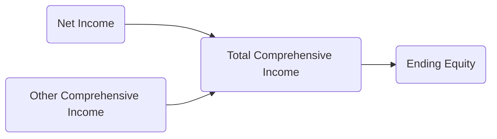
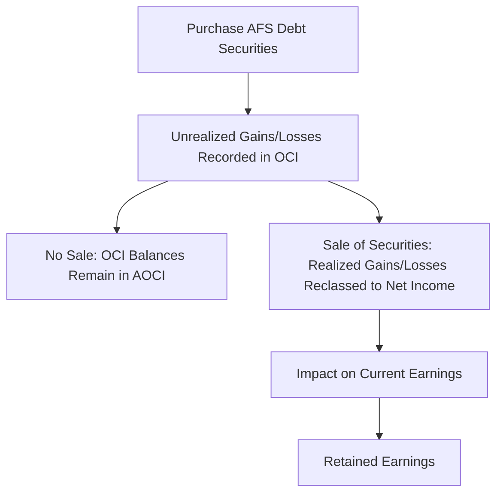

## 3.3 Statement of Comprehensive Income (OCI Components and Presentation)

The Statement of Comprehensive Income is a key financial statement that expands on the traditional Income Statement (or Statement of Operations) by incorporating elements of “Other Comprehensive Income” (OCI). While net income is the most closely followed metric for assessing an entity’s profitability, certain gains and losses bypass net income yet are still recognized under U.S. GAAP. These amounts flow directly into OCI and, along with net income, comprise “total comprehensive income.”  

In this section, we will discuss the nature of comprehensive income, the components that appear in other comprehensive income, how reclassification adjustments work, and the acceptable presentation formats for the Statement of Comprehensive Income. We will also highlight illustrative examples, diagrams, best practices, common pitfalls, and ways to navigate the complexities of OCI disclosures.

-------------------------------------------------------------------------------
## Overview of Comprehensive Income

Under U.S. GAAP, comprehensive income is defined as the change in equity of a business enterprise during a period from transactions and other events and circumstances from nonowner sources. It includes all changes in equity that are not the result of investments by owners or distributions to owners.

In simpler terms:
• Net income captures an entity’s revenues, expenses, gains, and losses that are included in the normal earnings process.  
• Other comprehensive income captures certain gains and losses not recognized in net income.  
• Total comprehensive income = Net income + Other comprehensive income.

While net income is perhaps the most scrutinized figure, OCI can represent significant changes in the economic resources and obligations of an entity. Therefore, understanding OCI is crucial for financial analysts, accountants, and other stakeholders who seek a holistic view of an entity’s financial performance.

-------------------------------------------------------------------------------
## What is Other Comprehensive Income (OCI)?

Other comprehensive income (OCI) consists of specific revenue, expense, gain, and loss items that U.S. GAAP requires to bypass net income but that still appear in the overall financial performance of an entity. The Financial Accounting Standards Board (FASB) has designated certain items as OCI due to their nature and anticipated realizations.

Key items that typically appear in OCI include:  

1. Unrealized Gains and Losses on Certain Investments  
   • Changes in the fair value of available-for-sale (AFS) debt securities (before they are sold or impaired).  
   • Unrealized gains or losses that arise during the period but have not yet been realized through a sale are included in OCI.

2. Foreign Currency Translation Adjustments  
   • Translation adjustments occur when consolidating financial statements of foreign subsidiaries whose functional currency is not the parent’s reporting currency.  
   • Gains and losses from currency translations are recognized in OCI rather than net income, reflecting the timing and volatility of currency fluctuations.

3. Gains or Losses on Cash Flow Hedges  
   • Changes in the fair value of derivative instruments designated and qualifying as cash flow hedges are generally deferred in OCI.  
   • Once the hedged transaction affects earnings, these deferred amounts are reclassified out of OCI.

4. Pension and Postretirement Benefit Plan Adjustments  
   • Accounting for defined benefit plans often generates actuarial gains and losses, prior service costs, and other remeasurement items.  
   • These items are recognized under OCI in the period they arise and are subsequently amortized into net income over time (unless the entity elects a faster method, if permitted).

5. Credit Risk Adjustments for Certain Liabilities (Own Credit Risk)  
   • Under certain circumstances, changes in fair value attributable to changes in an entity’s own credit risk on financial liabilities measured at fair value can be recorded in OCI (rather than net income).

Note that IFRS has revaluation increases for property, plant, and equipment (PPE) recognized in OCI. In U.S. GAAP, revaluations are generally not permitted outside of specialized industries; hence, this difference remains a key divergence when comparing IFRS and U.S. GAAP.

-------------------------------------------------------------------------------
## Relationship Between Net Income and OCI

Below is a mermaid diagram illustrating how net income and OCI flow into total comprehensive income:

1. Net Income is derived from the Income Statement and includes revenues, expenses, gains, and losses included in earnings.
2. Other Comprehensive Income tracks designated gains and losses not recognized in earnings.
3. Total Comprehensive Income is the sum of Net Income and Other Comprehensive Income.
4. Ending Equity is updated by total comprehensive income, as well as contributions and distributions from owners.

This structure helps ensure that users of financial statements can distinguish between normal operating performance (net income) and unusual or less-frequently realized gains and losses (OCI).

-------------------------------------------------------------------------------
## Presentation of the Statement of Comprehensive Income

Entities have two main options for presenting comprehensive income under U.S. GAAP:

### One-Statement Approach
In this format, an entity presents a continuous statement showing both net income and other comprehensive income items, culminating in total comprehensive income. The single continuous statement might reflect the following sections:

1. Revenues and gains  
2. Expenses and losses  
3. Net income  
4. Other comprehensive income items (listed by component, such as foreign currency translation gain, unrealized gain on certain securities, or pension remeasurement)  
5. Total comprehensive income

Many entities adopt this continuous single-statement approach for its clarity: all items of income, both recognized in net income and those recognized in OCI, appear in one comprehensive view.

### Two-Statement Approach
Alternatively, an entity may choose to present net income on its own separate statement of net income (traditional Income Statement) and then present a subsequent statement of comprehensive income immediately following it.

In this two-statement method:
1. The first statement reports net income in the conventional format (revenues, expenses, gains, losses → net income).  
2. The second statement starts with net income and then adds (or subtracts) the items of other comprehensive income, arriving at total comprehensive income.

Both approaches are acceptable under U.S. GAAP. The key requirement is that total comprehensive income must be presented clearly, and all OCI components must be disclosed either in the same statement (one-statement approach) or in a separate but consecutive statement (two-statement approach).

-------------------------------------------------------------------------------
## Reclassification Adjustments

One of the most important features of OCI is the notion that gains or losses initially recognized in OCI may be “reclassified” (transferred) out of OCI and into net income at a future point. This process is known as reclassification adjustment. The rationale is that certain items initially included in OCI may later become “realized” and thus should be recognized in earnings.

Common examples of reclassification adjustments include:
• When an AFS debt security is sold, any unrealized gain or loss that had been recognized in OCI is reclassified into net income.  
• When a cash flow hedge transaction is settled or the hedged forecasted transaction affects earnings, the amounts previously deferred in OCI are reclassified to net income.  
• For pension adjustments, amortization of actuarial gains or losses and prior service cost is reclassified from OCI into net income in the period of amortization.

### Presentation of Reclassification Adjustments
Entities should present the current period OCI on the face of the Statement of Comprehensive Income, with each component’s current-period change. In addition, they should show the reclassification adjustments out of accumulated OCI into net income (disclosed either on the face of the statement or in the notes). Properly labeling and separating these components is critical for user understanding and compliance with accounting standards.

Here is an example of a typical layout in OCI (for a single-statement approach):

Revenues, Gains, and Other Income  
(…items…)  
Expenses, Losses, and Other Charges  
(…items…)  
---------------------------------------  
Net Income  
---------------------------------------  
Other Comprehensive Income, Net of Tax:  
  Unrealized holding gains on AFS securities       XXX  
  Reclassification adjustment for gains realized   (XX)  
  Foreign currency translation adjustments         XX  
  Pension plan adjustments                         X  
---------------------------------------   
Other Comprehensive Income                          X  
---------------------------------------   
Total Comprehensive Income                         XXX  

-------------------------------------------------------------------------------
## Practical Example of OCI and Reclassifications

Imagine a company, ABC Corp., that holds a portfolio of AFS debt securities. During the year, the fair value of these securities increases by $10,000. No sales occur during the period. Because the gain is unrealized and the securities have not been impaired, ABC Corp. records this $10,000 gain in OCI.

Later in the same reporting period, ABC Corp. decides to sell some of these securities, realizing a $3,000 gain that had previously been recognized in OCI. The $3,000 is immediately reclassified out of OCI and recognized in earnings (net income).

Hence, at the end of the reporting period, ABC Corp. will reflect:  
• $7,000 in unrealized gains in OCI (the portion not sold yet).  
• $3,000 reclassified to net income (because it was realized via a sale).  
• The total fair value adjustment net of tax remains in the Accumulated OCI account.  

This example demonstrates the continuous flow between OCI and net income as certain unrealized amounts become realized, emphasizing the importance of accurate tracking of each component within the financial statements.

-------------------------------------------------------------------------------
## Common Pitfalls and Best Practices

### Pitfall 1: Confusing Comprehensive Income with Cash Flows
Comprehensive income is not a cash flow measure. Some new accountants mistakenly assume that items reported in OCI have strong liquidity implications, but in reality, they reflect certain gains/losses recognized outside of earnings (often due to pending realization). Always distinguish between the nature of these adjustments (valuation changes or translation differences) and actual cash receipts or payments.

### Pitfall 2: Omitting or Incorrectly Presenting Tax Effects
OCI must generally be presented “net of tax” or with tax effects displayed either on the face of the financial statements or in the notes. Failing to properly split the “before tax” and “net of tax” amounts for each category of OCI can lead to misstatements.

### Pitfall 3: Overlooking Interim Reporting Requirements
Entities often forget that interim financial statements must also disclose comprehensive income and its components if the entity is required to file or publish interim statements.

### Best Practice 1: Use Clear Line Items and Explanations
Whether presenting in a single statement or two statements, separate line items for each major OCI component help readers see precisely where each gain or loss originated and how it migrates into net income upon realization.

### Best Practice 2: Provide Thorough Disclosures
FASB ASC Topic 220 (Comprehensive Income) suggests that reclassification adjustments should be clearly disclosed. Provide descriptive footnotes to explain the nature of these adjustments, particularly for complex derivatives or pension items.

### Best Practice 3: Reconcile OCI to the Statement of Changes in Equity
Because OCI is accumulated in a separate component of equity (Accumulated Other Comprehensive Income, or AOCI), reconciling changes in AOCI on the Statement of Changes in Equity with amounts on the Statement of Comprehensive Income is critical for internal control and transparency.

-------------------------------------------------------------------------------
## Diagram: OCI Flow for an AFS Debt Security

Below is a simplified visual representation of how unrealized gains and losses for available-for-sale (AFS) debt securities flow into OCI, and how they subsequently get reclassified upon sale.

1. Upon purchase of AFS securities, the entity’s net income remains unaffected until there is either a sale, impairment, or interest income recognition.  
2. Any subsequent changes in fair value are recognized in OCI, accumulating in AOCI.  
3. If the securities are sold, gains or losses that were in OCI are reclassified to net income (becoming realized income or expense).  
4. Once recognized in net income, these realized gains or losses eventually impact retained earnings through the normal close of the books.

-------------------------------------------------------------------------------
## Integrating OCI into the Broader Financial Statements

### Interaction with the Balance Sheet
• Accumulated Other Comprehensive Income (AOCI) appears as a separate component of equity, similar to retained earnings but distinct in its origins.  
• At each period-end, each element of OCI (e.g., foreign currency translation or AFS securities) is tracked within AOCI until reclassified or otherwise resolved.

### Interaction with the Statement of Cash Flows
• OCI items generally do not directly affect the operating, investing, or financing sections unless and until they are realized.  
• However, if reclassification triggers a recognized gain or loss, that item might appear in the Statement of Cash Flows under operating or investing activities (depending on the nature of the transaction).

-------------------------------------------------------------------------------
## Key Takeaways

1. Comprehensive Income = Net Income + Other Comprehensive Income.  
2. OCI includes items such as unrealized gains/losses on AFS securities, foreign currency translation adjustments, certain pension adjustments, and gains/losses on cash flow hedges.  
3. Presentation may be a single continuous statement (one-statement approach) or two separate statements (two-statement approach).  
4. Reclassification adjustments transfer amounts from OCI to net income once “realized” or when the underlying event has an impact on earnings.  
5. Accurate reporting and comprehensive disclosures are crucial for providing complete and transparent financial information.

-------------------------------------------------------------------------------
## References for Further Exploration

1. FASB ASC Topic 220 – Comprehensive Income  
2. FASB ASC Topic 320 – Investments—Debt Securities  
3. FASB ASC Topic 715 – Compensation—Retirement Benefits  
4. FASB ASC Topic 815 – Derivatives and Hedging  
5. “Financial Accounting Standards Board (FASB) Accounting Standards Codification.” Available at https://asc.fasb.org  
6. Wiley CPAexcel Exam Review Study Guide (FAR section)  
7. Becker Professional Education – CPA Review Materials  

For a deeper understanding of derivatives, hedging, and reclassifications, you may also consider advanced accounting textbooks like “Intermediate Accounting” by Kieso, Weygandt, and Warfield, or specialized courses focusing on complex financial instruments.

-------------------------------------------------------------------------------
## SEO-Optimized Quiz on Statement of Comprehensive Income



### Which of the following best describes comprehensive income under U.S. GAAP?

- [ ] The measure of net cash flows plus operating results.  
- [x] All changes in equity from nonowner sources, consisting of net income plus OCI.  
- [ ] The total amount of realized gains and losses from operations only.  
- [ ] The measure of net income under both accrual and cash-basis accounting combined.  

> **Explanation:** Comprehensive income includes all changes in equity that are not the result of transactions with owners, which is net income plus other comprehensive income.

### Which of the following is an item typically reported in other comprehensive income (OCI)?

- [x] Unrealized gains on available-for-sale debt securities.  
- [ ] Interest expense on long-term debt.  
- [ ] Sales revenue from operating activities.  
- [ ] Stock-based compensation to employees.  

> **Explanation:** Unrealized gains and losses on AFS securities are recognized in OCI until realized or impaired. The other items are recognized in net income, not OCI.

### What is the primary purpose of reclassification adjustments from OCI to net income?

- [x] To ensure that realized gains/losses are included in net income, removing them from accumulated OCI.  
- [ ] To move unrealized gains and losses back into retained earnings immediately.  
- [ ] To eliminate any swings in OCI so comprehensive income remains stable.  
- [ ] To record entries twice to ensure accuracy in both statements.  

> **Explanation:** Some OCI items eventually become realized and must be recognized in net income. Reclassification adjustments downwardly adjust OCI and increase or decrease net income accordingly.

### Which statement below is true regarding the single-statement approach?

- [x] Net income and other comprehensive income are presented continuously within one statement, ending with total comprehensive income.  
- [ ] Net income is shown in one statement, and comprehensive income in a completely different footnote.  
- [ ] The single-statement approach only shows OCI, omitting net income.  
- [ ] The single-statement approach and two-statement approach are required together.  

> **Explanation:** Under the single-statement approach, both net income and other comprehensive income appear in one continuous statement for clarity.

### Which of the following does not appear as other comprehensive income?

- [x] Realized gains on trading securities.  
- [ ] Foreign currency translation adjustments.  
- [x] Gains or losses on effective cash flow hedges recognized this period.  
- [ ] Pension adjustments for actuarial gains or losses.  

> **Explanation:** Gains on trading securities are recognized in net income, not OCI. Foreign currency translation adjustments and certain cash flow hedge adjustments are recognized in OCI. Pension actuarial gains or losses are also recognized in OCI.

### When a company realizes a previously recorded unrealized gain on an AFS debt security, how should the reclassification be reflected?

- [x] Debit OCI and credit a gain account in net income for the realized amount.  
- [ ] Record the gain directly to retained earnings with no reclassification.  
- [ ] Recognize an offsetting expense in net income.  
- [ ] Reverse the original entry and do not recognize any gain or loss.  

> **Explanation:** Upon sale, the company reclassifies the unrealized gain from OCI to net income, reflecting it as a realized gain in the current period.

### Which is a common pitfall when reporting OCI?

- [x] Failing to account for tax effects on OCI items.  
- [ ] Combining net income and operating cash flows.  
- [x] Overstating reclassification adjustments and ignoring the offset.  
- [ ] Recognizing all securities gains in OCI, regardless of classification.  

> **Explanation:** A frequent error is forgetting to show OCI net of taxes or to disclose tax impacts properly. Additionally, reclassification adjustments must be carefully tracked to avoid double-counting or omission.

### Under the two-statement approach, which piece of information appears on the first statement but not the second?

- [x] The detailed breakdown of operating expenses leading to net income.  
- [ ] A line item for foreign currency translation adjustments.  
- [ ] The total comprehensive income line.  
- [ ] Unrealized gains for AFS securities.  

> **Explanation:** The first statement focuses on net income with the usual breakdown of revenues and expenses. The second statement starts with net income and then presents OCI items leading to total comprehensive income.

### Which statement correctly describes how pension adjustments flow through OCI?

- [x] Actuarial gains or losses and prior service cost are recognized initially in OCI and may be amortized into net income over time.  
- [ ] Pension expense is recognized entirely in net income in the same period incurred.  
- [ ] Pension adjustments are only recognized through retained earnings.  
- [ ] Pension adjustments remain off-balance-sheet entirely.  

> **Explanation:** Under U.S. GAAP, pension-related actuarial gains or losses and prior service cost are booked in OCI first and later amortized into net income (unless recognized immediately under special circumstances).

### A single continuous Statement of Comprehensive Income helps users by:

- [x] Presenting net income and OCI components together, providing a holistic view of all nonowner changes in equity.  
- [ ] Isolating net income from all other items, thereby reducing confusion.  
- [ ] Exclusively focusing on the operating section of the income statement.  
- [ ] Hiding reclassification adjustments to simplify disclosures.  

> **Explanation:** A single statement showcases both net income and OCI clearly, culminating in total comprehensive income, allowing stakeholders to see all nonowner changes in equity at once.



-------------------------------------------------------------------------------

## For Additional Practice and Deeper Preparation

**[FAR CPA Hardest Mock Exams: In-Depth & Clear Explanations](https://www.udemy.com/course/far-cpa-mock-exams/?referralCode=F88050F8D5C76764F6BD)**  

**Financial Accounting and Reporting (FAR) CPA Mocks:** 6 Full (1,500 Qs), Harder Than Real! In-Depth & Clear. Crush With Confidence!  

- Tackle full-length mock exams designed to mirror real FAR questions.  
- Refine your exam-day strategies with detailed, step-by-step solutions for every scenario.  
- Explore in-depth rationales that reinforce higher-level concepts, giving you an edge on test day.  
- Boost confidence and minimize anxiety by mastering every corner of the FAR blueprint.  
- Perfect for those seeking exceptionally hard mocks and real-world readiness.  

_Disclaimer: This course is not endorsed by or affiliated with the AICPA, NASBA, or any official CPA Examination authority. All content is for educational and preparatory purposes only._
