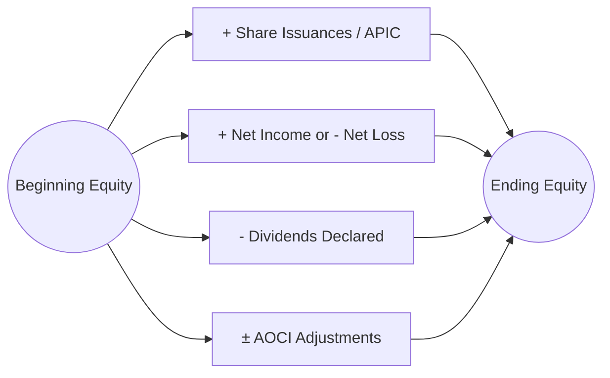

## 3.4 Statement of Changes in Equity (Share Capital, Retained Earnings, Other Equity Items)

A Statement of Changes in Equity (also commonly referred to as the Statement of Shareholders’ Equity or Statement of Stockholders’ Equity) chronicles how and why an entity’s total equity balance evolves over a specific accounting period. It showcases the direct link between (1) net income earned during the period and (2) transactions with the shareholders, such as share issuance or dividends, as well as changes to other equity balances like Accumulated Other Comprehensive Income (AOCI). 

This statement is considered essential for stakeholders, including potential and existing shareholders, creditors, and financial analysts, to understand an organization’s capital transitions and long-term financial well-being. In other words, it clarifies the composition of an entity’s equity at a particular date and sheds light on the transactions and events that have altered it from the start to the end of a reporting period.

----------------------------------------------------------------------------
  
## Purpose and Placement Within Financial Reporting

The Statement of Changes in Equity is one of the core financial statements in the framework of U.S. GAAP. It typically complements the following statements:

• Balance Sheet (Statement of Financial Position)  
• Income Statement (Statement of Operations)  
• Statement of Comprehensive Income  
• Statement of Cash Flows  

While the Income Statement and Cash Flow Statement depict performance and liquidity, respectively, the Statement of Changes in Equity zooms in on owners’ residual interests after all liabilities have been deducted. It is especially useful for:

• Evaluating the business’s ability to raise capital.  
• Understanding dividend and distribution policies.  
• Tracking retained earnings for reinvestment.  
• Monitoring the evolution of equity reserves, including AOCI for items that bypass the Income Statement (e.g., foreign currency translation adjustments, unrealized gains on available-for-sale securities under legacy GAAP treatment, and other comprehensive income components).  

----------------------------------------------------------------------------
  
## Key Components of Equity

Equity (often referred to as “net assets” or “stockholders’ equity” for corporations) represents the residual claim on an entity’s assets after settling all its liabilities. Depending on the structure and jurisdiction, the nomenclature may vary (e.g., “share capital,” “paid-in capital,” “common stock”), but most for-profit entities present broadly similar categories:

### Share Capital (Common Stock and Preferred Stock)
Share capital represents funds raised by issuing shares to investors. Often, there are at least two amounts displayed:

• Common Stock: Also called “Common Shares” or “Ordinary Shares,” these typically carry voting rights and residual claims on the entity’s assets in liquidation.  
• Preferred Stock: Entitled to priority over common stock in receiving dividends and liquidation proceeds, but typically lacks voting rights.

For each share class, the par (or stated) value is reported separately from any capital paid in excess of par. Some jurisdictions do not use par values; in such cases, the total proceeds may be listed wholly under “share capital.”

### Additional Paid-In Capital (APIC)  
Additional Paid-In Capital (APIC) represents the amount shareholders paid in excess of the par or stated value. For instance, if the par value of a share is $1 and it sells for $10, the difference of $9 is credited to APIC. APIC can also present effects from stock-based compensation, warrants, or conversion features of debt into equity.

### Retained Earnings
Retained earnings (RE) comprise the accumulated net income (or losses) of a business since inception, minus distributions (primarily dividends) paid out to shareholders. The balance of retained earnings is a strong indicator of a company’s ability to fund growth or redistribute profits to shareholders. It is adjusted each period for:

• Net Income (increases RE)  
• Net Loss (decreases RE)  
• Dividends declared (decreases RE)  
• Correction of errors or changes in accounting principles that require retrospective application  

### Accumulated Other Comprehensive Income (AOCI)
AOCI captures other comprehensive income (OCI) items that are excluded from net income and recorded directly in equity. These generally include:

• Unrealized gains and losses on certain debt securities designated as available-for-sale under legacy standards (though ASC 326 and other standards have changed some classification aspects for credit losses).  
• Foreign currency translation adjustments for self-sustaining foreign operations.  
• Changes in the fair value of derivative instruments designated as hedges in qualifying hedge relationships.  
• Pension and postretirement plan adjustments (e.g., gains/losses, prior service cost).  

AOCI accumulates these adjustments over time, reflecting the cumulative net effect of specific transactions that bypass the Income Statement but still affect equity.

----------------------------------------------------------------------------
  
## Format and Structure of the Statement of Changes in Equity

In practice, the Statement of Changes in Equity can be presented in either a single statement that merges comprehensive income items (the “single statement approach”) or two separate statements—one for net income and a second for other comprehensive income. Regardless of the method, certain fundamental line items and columns are typically shown:

1. **Beginning Balances**: The opening equity balances for each equity component (e.g., share capital, APIC, retained earnings, AOCI).  
2. **Changes Due to Operations**: Net income (or net loss) flows into retained earnings.  
3. **Issuances of Shares**: Capture and disclose any share issuances, with proceeds separated into par value and APIC.  
4. **Share Repurchases**: Display how repurchased shares (treasury stock) reduce equity.  
5. **Dividends Declared**: Subtract these from retained earnings.  
6. **OCI Items**: Record other comprehensive income adjustments to the appropriate column in AOCI.  
7. **Reclassifications**: In some cases, items that were in AOCI may get reclassified into earnings (e.g., realized gains from the sale of available-for-sale securities).  
8. **Ending Balances**: Summarize the closing balances in each equity account.  

A condensed illustration might look like this (assuming we have common stock, APIC, retained earnings, and AOCI only):

| (in $ millions)                  | Common Stock | APIC  | Retained Earnings | AOCI     | Total Equity |
|---------------------------------|-------------:|------:|------------------:|---------:|-------------:|
| Beginning balances (1/1/20XX)    |      1,000   | 2,500 |            5,400  |    (250) |      8,650   |
| Net Income                       |          –   |    –  |              500  |       –  |        500   |
| Other Comprehensive Income       |          –   |    –  |                –  |     125  |        125   |
| Dividends                        |          –   |    –  |             (200) |       –  |       (200)  |
| Issuance of Common Stock         |         200  |   800 |                –  |       –  |      1,000   |
| Ending balances (12/31/20XX)     |      1,200   | 3,300 |            5,700  |    (125) |     10,075   |

In this simplified example, the entity increased its share capital (common stock + APIC) from $3,500 million to $4,500 million by issuing additional shares, earned net income of $500 million, paid out $200 million in dividends, and recognized a $125 million improvement in AOCI. The resulting total equity at year-end amounted to $10,075 million, up from the beginning total of $8,650 million.

----------------------------------------------------------------------------
  
## Common Transactions Affecting Equity

### Share Issuance  
When a company issues shares, the proceeds from share sales boost the share capital balance (common stock) and potentially APIC. For example, assume an entity issues 10,000 shares at $15 per share, each with a $1 par value:

• Common Stock: Increases by $10,000 × $1 =$ $10,000.  
• APIC: Increases by ($15 – $1) × 10,000 =$ $140,000.  

Thus, the total equity impact is $150,000, reflecting the sum of proceeds received.

### Repurchase of Shares (Treasury Stock)  
If a company repurchases its shares, those shares become treasury stock and reduce total stockholders’ equity. The specifics of the accounting entry differ under the cost method versus the par value method, but generally, treasury stock is shown as a negative component of equity. For example:

• **Treasure Stock – Cost Method**: Debit treasury stock for the total cost of repurchase. Upon reissuance above cost, credit APIC – Treasury Stock for the difference.  

Originally repurchasing shares at $20 each might reflect:

    Treasury Stock          XX
        Cash                    XX

Upon subsequent reissuance at $25 each:

    Cash                    XX
        Treasury Stock          XX  (at historical cost)
        APIC - Treasury Stock   XX  (the ‘gain’ on reissuance)

### Dividends Declared and Paid  
Dividends on common or preferred stock reduce retained earnings when declared. If dividends are declared but not yet paid, they become a liability (“Dividends Payable”) on the Balance Sheet. For example:

    Retained Earnings       XX
        Dividends Payable       XX

When cash is disbursed:

    Dividends Payable       XX
        Cash                    XX

Reducing retained earnings for the declared dividend ensures that the Statement of Changes in Equity reflects the distribution of profits to the shareholders.

### Accumulated Other Comprehensive Income Adjustments  
Items recognized directly in other comprehensive income bypass the traditional Income Statement and flow straight to AOCI. Throughout the year, companies might record:

• Unrealized gains or losses on certain categories of investments.  
• Foreign currency translation adjustments for consolidating foreign subsidiaries.  
• Gains or losses on derivative instruments designated as cash flow hedges.  
• Pension liability adjustments.  

At each reporting period, AOCI is adjusted, and the total in AOCI is displayed in the Statement of Changes in Equity. Subsequent recognition or recycling of these items (for instance, realized gains or losses on the sale of available-for-sale debt securities) will then be reclassified out of AOCI into net income.

### Net Income (or Loss)  
Companies close their net income (or net loss) to retained earnings at period end. This ensures that all revenue and expense items recognized on the Income Statement in the current period are permanently folded into equity. 

----------------------------------------------------------------------------
  
## Illustration via a Mermaid Diagram

Below is a simple flowchart illustrating how key items update the Statement of Changes in Equity—from the opening balance to the closing balance:

This flowchart shows that an entity starts with the beginning equity balance, which is increased by net income or share issuances, and decreased by dividends, treasury stock repurchases, or net losses. Simultaneously, comprehensive income items such as foreign currency translation gains or unrealized investment gains will add to (or subtract from) equity. The result is the ending equity balance, which is then reported in the Balance Sheet.

----------------------------------------------------------------------------
  
## Examples and Case Studies

### Example 1: Small Software Startup
Imagine a small software startup that began the year with the following equity balances:

• Common Stock (1,000,000 shares issued, $1 par): $1,000,000  
• APIC: $4,000,000  
• Retained Earnings: $1,500,000  
• AOCI: $0  

During the year, they:  
1) Issued 200,000 additional shares for $5 per share.  
2) Earned a net income of $800,000.  
3) Declared and paid a cash dividend of $250,000.  
4) Recognized an unrealized loss on a derivative designated as a cash flow hedge of $40,000 (reflected in AOCI).  

The end-of-year Statement of Changes in Equity could appear as follows:

| (in $)                               | Common Stock |   APIC  | Retained Earnings |   AOCI   |   Total  |
|--------------------------------------|------------:|--------:|------------------:|---------:|---------:|
| Beginning Balances                   |   1,000,000 | 4,000,000 |          1,500,000 |        0 | 6,500,000|
| Share Issuance (200,000 shares @ $5) |     200,000 |   800,000 |                –   |        – | 1,000,000|
| Net Income                            |          –   |        – |            800,000 |        – |   800,000|
| Dividends Declared & Paid            |          –   |        – |           (250,000)|        – |  (250,000)|
| Unrealized Loss on Derivative        |          –   |        – |                –   |  (40,000)|   (40,000)|
| Ending Balances                      |  1,200,000  | 4,800,000 |         2,050,000 |  (40,000)| 8,010,000|

At year-end, the total equity is $8,010,000.

### Example 2: Apparel Manufacturer with Treasury Stock
A clothing manufacturer repurchased 50,000 of its common shares at $18 each during the current year. The repurchase transaction reduced equity by $900,000 (50,000 × $18). Later in the same year, 10,000 shares out of these repurchased shares were reissued at $20 each. The incremental $2 increase per share (i.e., $20 – $18) is credited to APIC – Treasury Stock.

These transactions highlight how treasury stock typically reduces total equity until those shares are retired or reissued at which point any excess or shortfall is accounted for in APIC.

----------------------------------------------------------------------------
  
## Accounting and Disclosure Requirements

Under U.S. GAAP, companies must provide sufficient disclosures to enable users of financial statements to understand:

• The nature and purpose of each equity component.  
• Dividend and distribution policies, including the amount, timing, and any restrictions.  
• Share-based payment transactions that impact share capital and APIC.  
• Treasury stock transactions (including average cost and reasons for repurchase, if material).  
• AOCI changes, indicating reclassifications out of AOCI and into earnings, as well as current period OCI items.  
• Any significant changes in ownership interests (e.g., if a parent acquires or loses control over a subsidiary).  

Some entities combine the Statement of Changes in Equity with the Statement of Comprehensive Income into a single financial statement (referred to as the “Statement of Comprehensive Income” under certain presentations). However, the essential details remain consistent across presentation choices.

----------------------------------------------------------------------------
  
## IFRS Considerations (Brief Comparison)

Under IFRS, the statement typically serves a similar function, though certain terminologies differ:

• **Share Capital** often corresponds to Common Stock under U.S. GAAP.  
• **Share Premium** often corresponds to APIC.  
• **Reserves** or “Other Reserves” can incorporate AOCI-like items.  

Both under IFRS and U.S. GAAP, the statement is typically referred to as the “Statement of Changes in Equity” and must present how each component of equity changed during the reporting period. IFRS also requires a reconciliation for each class of contributed equity, plus a reconciliation of retained earnings and each reserve. The fundamental notion—disclosing opening balances, movements, and closing balances for equity—remains largely consistent.

----------------------------------------------------------------------------
  
## Best Practices and Common Pitfalls

• **Always reconcile** the Statement of Changes in Equity with year-end totals on the Balance Sheet. Inconsistencies could indicate an error in posting net income, dividends, or share-based transactions.  
• **Be consistent** with the classification of transactions. For example, reissuing treasury stock at a different price than its acquisition cost can be confusing; carefully track changes in APIC and treasury stock.  
• **Clearly separate** dividends declared from net income. Do not net the two within retained earnings.  
• **Accurately track** AOCI reclassifications. Items initially recognized in OCI may eventually be recycled into net income.  
• **Watch out** for foreign exchange adjustments in consolidated statements, particularly if the entity has multiple functional currencies.  
• **Disclose** the reasons behind major changes in share capital (e.g., stock splits, large share issuances, or conversions of convertible debt).  

----------------------------------------------------------------------------
  
## Practical Tips and Strategies

• **Use software or well-organized spreadsheets** to track equity transactions, ensuring each entry is mapped to the correct equity account.  
• **Regularly reconcile** changes in retained earnings to net income and dividends, verifying no double-counting or omission.  
• **Document** each treasury stock transaction thoroughly, particularly if reissued shares are at prices different from their acquisition price.  
• **Closely monitor** the details underpinning AOCI. This subaccount can include multiple distinct OCI items, each with unique reclassification and disclosure requirements (e.g., pension adjustments vs. cash flow hedge adjustments).  
• **Communicate** with tax advisors on potential impacts of certain equity changes, such as share-based payments and their tax implications, which can lead to deferred tax assets or liabilities.  

----------------------------------------------------------------------------
  
## References for Further Exploration

• FASB Accounting Standards Codification (ASC) 505, “Equity.”  
• FASB ASC 220, “Comprehensive Income.”  
• U.S. Securities and Exchange Commission (SEC) Filings—10-K or 10-Q, which provide real-world examples of equity disclosures.  
• AICPA Guides for corporate accounting and financial statement presentation.  

Those looking to deepen their practical knowledge can also review publicly listed companies’ annual reports. The Statement of Changes in Equity in these fillings is a prime resource for comparing theoretical guidance with real-world execution.

----------------------------------------------------------------------------
  
## SEO-Optimized Quiz: Mastering the Statement of Changes in Equity



### What is the primary purpose of the Statement of Changes in Equity?

- [x] To show the movements of each equity component over a reporting period.  
- [ ] To calculate net cash flows from operating, investing, and financing activities.  
- [ ] To calculate cost of goods sold.  
- [ ] To reconcile inventory valuations from the beginning of the period to the end of the period.  

> **Explanation:** The Statement of Changes in Equity specifically shows how various equity accounts change due to share issuances, net income, dividends, OCI, and other transactions over the reporting period.

### Which of the following items would most likely appear in Accumulated Other Comprehensive Income (AOCI)?

- [x] Foreign currency translation adjustments.  
- [ ] Cash dividends to common shareholders.  
- [ ] Depreciation expense on property, plant, and equipment.  
- [x] Unrealized gains on qualifying derivatives in cash flow hedge relationships.  

> **Explanation:** AOCI includes certain gains or losses excluded from net income, such as foreign currency translation adjustments and unrealized gains or losses on certain qualifying derivatives designated as hedges.

### When a company declares (but has not yet paid) a cash dividend, how is retained earnings affected?

- [x] Retained earnings is reduced on the date of declaration.  
- [ ] Retained earnings remains unchanged until the dividend is actually paid.  
- [ ] Retained earnings only changes at the end of the period.  
- [ ] Retained earnings increases on the date of declaration.  

> **Explanation:** Dividends are recorded as a reduction of retained earnings on the date of declaration and credited to “Dividends Payable,” a liability.

### In the Statement of Changes in Equity, a stock issuance above par value typically increases which accounts?

- [x] Common Stock and Additional Paid-In Capital.  
- [ ] Retained Earnings only.  
- [ ] Accumulated Other Comprehensive Income only.  
- [ ] Common Stock only.  

> **Explanation:** Proceeds from issuing shares above par (or stated) value are split between Common Stock for the par portion and Additional Paid-In Capital (APIC) for the excess.

### How do treasury stock transactions typically affect total equity?

- [x] They reduce total equity when shares are repurchased.  
- [ ] They have no effect on total equity.  
- [x] They affect Additional Paid-In Capital if sold (reissued) above cost.  
- [ ] They permanently reduce Retained Earnings.  

> **Explanation:** Treasury stock reduces equity upon repurchase. If reissued above cost, the difference is credited to APIC – Treasury Stock, thus affecting equity but not directly retained earnings (unless reissued below cost and APIC–TS is insufficient, partially offsetting RE).

### Which of the following represents a common pitfall when preparing the Statement of Changes in Equity?

- [x] Failing to reconcile retained earnings to net income and dividends during the period.  
- [ ] Including OCI in the company’s net income calculation.  
- [ ] Accounting for taxes incorrectly during the period.  
- [ ] Presenting share premium and APIC in separate statements.  

> **Explanation:** One of the most frequent errors is neglecting to tie the beginning retained earnings balance to net income, dividends, and any prior-period adjustment. This can result in discrepancies between Net Income reported and the changes in equity.

### A company’s AOCI account increases by $50,000 from the remeasurement of a pension liability. When would this amount typically be reclassified from AOCI to net income?

- [x] When it is recognized in pension expense in future periods.  
- [ ] Immediately upon remeasurement.  
- [x] It is never reclassified.  
- [ ] During the period in which shares are issued.  

> **Explanation:** Pension-related OCI is amortized into the pension expense over future periods in accordance with the relevant guidance. Sections of pension AOCI (like prior service costs or gains/losses) eventually flow through net income based on amortization parameters.

### Which of the following is TRUE regarding the presentation of the Statement of Changes in Equity?

- [x] It must include beginning balances, movements during the period, and ending balances for each equity component.  
- [ ] It is optional for all entities.  
- [ ] It only includes changes in common stock.  
- [ ] It must be combined with the Income Statement.  

> **Explanation:** U.S. GAAP requires that the statement detail changes in each equity account from beginning to ending balances, providing transparency on all equity components.

### When a company reissues treasury stock at a price higher than its repurchase price, which account is credited for the excess over cost?

- [x] Additional Paid-In Capital – Treasury Stock (APIC – TS).  
- [ ] Retained Earnings.  
- [ ] Common Stock.  
- [ ] Dividends Payable.  

> **Explanation:** The difference between the reissue price and repurchase cost is credited to APIC – Treasury Stock. Retained earnings are typically not impacted by treasury stock transactions unless the repurchase price exceeds the reissue price by more than the balance in APIC – TS.

### True or False: Under both U.S. GAAP and IFRS, the statement providing information on equity changes is referred to as the "Statement of Changes in Equity."

- [x] True  
- [ ] False  

> **Explanation:** Both accounting frameworks use similar naming conventions for the financial statement that details stockholders’ equity movements. Under IFRS, it is also known as the “Statement of Changes in Equity,” although certain line-item titles (Share Premium, Reserves) may differ.



---

## For Additional Practice and Deeper Preparation

[**FAR CPA Hardest Mock Exams: In-Depth & Clear Explanations**](https://www.udemy.com/course/far-cpa-mock-exams/?referralCode=F88050F8D5C76764F6BD)

Financial Accounting and Reporting (FAR) CPA Mocks: 6 Full (1,500 Qs), Harder Than Real! In-Depth & Clear. Crush With Confidence!

• Tackle full-length mock exams designed to mirror real FAR questions.  
• Refine your exam-day strategies with detailed, step-by-step solutions for every scenario.  
• Explore in-depth rationales that reinforce higher-level concepts, giving you an edge on test day.  
• Boost confidence and minimize anxiety by mastering every corner of the FAR blueprint.  
• Perfect for those seeking exceptionally hard mocks and real-world readiness.

_Disclaimer: This course is not endorsed by or affiliated with the AICPA, NASBA, or any official CPA Examination authority. All content is for educational and preparatory purposes only._
