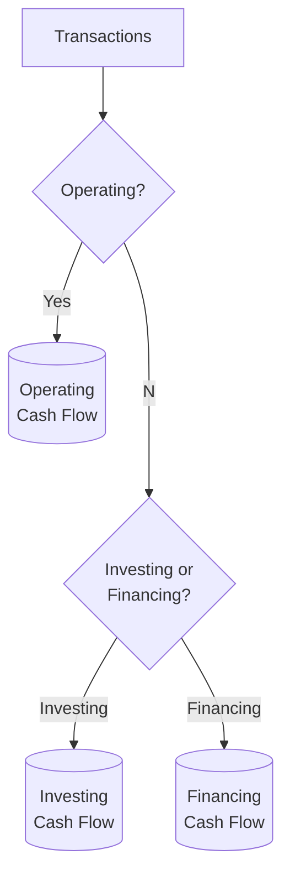

## 3.5 Statement of Cash Flows (Operating, Investing, Financing; Indirect/Direct Methods)

The Statement of Cash Flows (SCF) is a vital component of an entity’s financial statements, offering stakeholders a clear view of how a company generates and deploys its cash resources. The SCF highlights the changes in cash and cash equivalents over a reporting period and is typically divided into three sections:

• Operating Activities  
• Investing Activities  
• Financing Activities  

Under U.S. GAAP (ASC Topic 230), entities can use either the direct or indirect method to present cash flows from operating activities. This section provides an in-depth overview of each approach, clarifies the classification of common transactions, and discusses key reconciliation elements.

A comprehensive understanding of the Statement of Cash Flows is essential for CPA candidates, as it not only serves to clarify a company’s liquidity and solvency but is also tested extensively on the FAR section of the CPA Exam.  

---

### Importance and Purpose of the Statement of Cash Flows

The primary purpose of the Statement of Cash Flows is to reconcile an entity’s beginning and ending cash balances, illustrating how cash is generated (inflows) and used (outflows) throughout the accounting cycle. This statement helps stakeholders:

• Assess the company’s ability to generate positive cash flow in the future.  
• Evaluate the entity’s capacity to meet obligations, pay dividends, and make strategic investments.  
• Understand the relationship of net income to actual cash-based performance.  
• Review major activities in the form of inflows and outflows across operating, investing, and financing categories.

In particular, the operating section is often considered the “lifeblood” of the business, as it shows whether the company’s day-to-day operations can sustain its activities without dependence on capital markets or external financing.

---

### Components of the Statement of Cash Flows

Although the SCF is one cohesive statement, it is separated into three distinct sections that categorize cash transactions based on their nature:

• Operating Activities  
• Investing Activities  
• Financing Activities  

#### Operating Activities
Operating activities relate to transactions that affect net income. Under ASC Topic 230, this includes:

• Cash received from customers.  
• Cash payments to suppliers, employees, and other operating expenses.  
• Other operating cash flows not considered investing or financing.

ASC Topic 230 permits two ways of reporting operating cash flows:

1. Indirect Method  
2. Direct Method  

Ultimately, the total net operating cash flow will be the same under both methods, but the presentation format differs.

#### Investing Activities
Investing activities generally pertain to long-term asset transactions. Typical examples include:

• Purchases of property, plant, and equipment (PP&E).  
• Proceeds from sales of PP&E.  
• Purchases and sales of investments (e.g., stocks and bonds not classified as cash equivalents).  
• Expenditures for long-term projects or acquisitions.

#### Financing Activities
Financing activities capture inflows and outflows related to an entity’s capital structure. Common examples are:

• Proceeds from issuing stocks or bonds.  
• Repayment of bonds or notes payable.  
• Cash dividends paid to shareholders.  
• Treasury stock transactions.  

---

### Operating Activities: Direct vs. Indirect Method

Under the direct method, each major class of operating cash receipts and payments is shown in the operating section. Under the indirect method, net income is reconciled to net cash from operating activities by adjusting for non-cash items and changes in working capital.

Both methods must ultimately disclose the same amount of net cash provided by (or used in) operating activities. However, investors and creditors often favor the direct method for clarity, while many companies prefer the indirect method due to its simplicity and alignment with accrual-based financial statements.

#### Indirect Method

The indirect method starts with net income (accrual basis) and adjusts for:

• Non-cash expenses and revenues (e.g., depreciation, amortization, changes in deferred taxes).  
• Non-operating gains and losses (e.g., gain on sale of equipment).  
• Changes in operating assets and liabilities (e.g., accounts receivable, inventory, accounts payable).  

The formula for net cash flow from operating activities (indirect) can be conceptualized as:

Net Income  
+ Non-Cash Expenses (e.g., depreciation, amortization)  
− Non-Cash Revenues (if any)  
+ Losses on Disposal of Assets  
− Gains on Disposal of Assets  
+ Decreases (− Increases) in Current Assets  
+ Increases (− Decreases) in Current Liabilities  
= Net Cash Flows from Operating Activities  

A simplified flowchart of the indirect method:

```mermaid
flowchart LR
    A[Net Income] --> B[+ Non-cash items (Depreciation, Amortization)]
    B --> C[+/- Changes in Working Capital (Receivables, Payables, Inventory)]
    C --> D[= Net Cash Flow from Operating Activities]
```

#### Direct Method

Under the direct method, the statement explicitly separates cash inflows and outflows related to operating activities:

• Cash received from customers.  
• Cash paid to suppliers.  
• Cash paid for operating expenses, interest, and taxes.  

This approach offers a more transparent view of cash payments and receipts. However, ASC Topic 230 requires companies using the direct method to provide a separate reconciliation of net income to net cash from operating activities (essentially the indirect method) in the footnotes or a supplementary schedule.

An illustrative direct-method approach for the operating section might look like:

• Cash Receipts from Customers  
• Less: Cash Payments to Suppliers and Employees  
• Less: Cash Paid for Operating Expenses (e.g., rent, utilities, R&D)  
• Less: Cash Paid for Interest and Income Taxes  
= Net Cash Provided by (Used in) Operating Activities  

---

### Classification Examples

Below are common transactions and their classification in the Statement of Cash Flows:

• Collection from Customers: Operating Inflow.  
• Sale of Goods or Rendering of Services for Cash: Operating Inflow.  
• Payments to Suppliers or Vendors: Operating Outflow.  
• Payment of Salaries: Operating Outflow.  
• Purchase of Manufacturing Equipment: Investing Outflow.  
• Sale of Equipment or Property: Investing Inflow (any gain or loss is adjusted in operating activities if using the indirect method).  
• Issuance of Common Stock: Financing Inflow.  
• Repayment of Long-Term Debt Principal: Financing Outflow.  
• Payment of Dividends: Financing Outflow (under U.S. GAAP).  
• Acquisition of Another Entity (cash portion): Investing Outflow.  

---

### Detailed Reconciliation Items

Entities using the indirect method must include a reconciliation that aligns net income (reported on an accrual basis) to net operating cash flow (on a cash basis). Key items in this reconciliation:

• Depreciation and Amortization: Added back to net income because these expenses do not involve current cash outflows.  
• Gains and Losses on Disposal: Gains are subtracted (as the cash proceeds go to investing activities), and losses are added (since the non-cash effect is included in accrual-based net income).  
• Changes in Current Assets and Liabilities:  
  - Increases in Accounts Receivable are subtracted (less cash received than revenue recognized).  
  - Decreases in Inventory are added (less cash outflow for production).  
  - Increases in Accounts Payable are added (reflects delayed cash payment).  

#### Common Pitfalls  
• Failing to classify non-cash investing and financing activities—ASC Topic 230 requires separate disclosure for transactions like converting debt to equity or leasing transactions that do not directly impact current cash flows.  
• Misclassifying interest paid. Under U.S. GAAP, interest paid and received is typically operating. Under IFRS, entities have the option to classify interest paid as operating or financing and interest received as operating or investing.  
• Omitting separate disclosure of significant non-cash transactions—these must be disclosed either on the face of the SCF or in a footnote.

---

### Indirect Method: Sample Presentation

Below is a simplified example of the operating section of an indirect-method SCF:

--------------------------------------------------------------------------------
Net Income                                                              $100,000  
Adjustments to reconcile Net Income to Net Cash Provided by Operating Activities:  
  + Depreciation and Amortization                                        20,000  
  − Gain on Sale of Equipment                                            (5,000)  
  + Increase in Accounts Payable                                          7,000  
  − Increase in Accounts Receivable                                     (12,000)  
  + Decrease in Prepaid Expenses                                          2,000  
Net Cash Provided by Operating Activities                              $112,000  
--------------------------------------------------------------------------------

---

### Direct Method: Sample Presentation

Scenario: A company receives $280,000 in cash from customers, pays $100,000 to suppliers and $50,000 in operating expenses, and pays $18,000 in interest.

Operating Activities (Direct Method):

--------------------------------------------------------------------------------
Cash Receipts from Customers                                          $280,000  
Less: Cash Payments to Suppliers                                     (100,000)  
Less: Cash Payments for Operating Expenses                            (50,000)  
Less: Cash Paid for Interest                                         (18,000)  
Net Cash Provided by Operating Activities                            $112,000  
--------------------------------------------------------------------------------

To comply with U.S. GAAP, a separate reconciliation would still be provided to show net income’s relationship to the $112,000 net cash from operating activities.

---

### Investing Activities in Detail

Investing activities center on the acquisition and disposal of long-term assets. Some common inflows and outflows:

• Outflows for purchasing PP&E, intangible assets, or long-term investments.  
• Inflows from selling assets like buildings, machinery, vehicles, or from disposing of equity or debt instruments of other entities (excluding those treated as cash equivalents).  

Key Points to Consider:

• Gains or losses recognized on the sale of equipment are non-cash in nature. They are recognized in the operating section’s reconciliation under the indirect method.  
• Capital expenditures (i.e., purchasing PP&E) are shown as investing outflows.  

---

### Financing Activities in Detail

Financing activities document how a business funds its operations and expansion through external or internal sources of capital. Cash changes in this section may stem from:

• Issuing shares of common or preferred stock.  
• Issuing bonds or other forms of debt.  
• Repaying principal on debt.  
• Paying cash dividends or repurchasing stock (treasury stock).  

Key Points to Keep in Mind:

• Interest paid is classified as operating under U.S. GAAP but can be shown as financing under IFRS.  
• Dividends paid are classified as financing (U.S. GAAP), but IFRS allows dividend payments to appear under operating or financing.  
• Noncash financing (e.g., converting bonds payable to common stock) must be disclosed separately.

---

### Noncash Investing and Financing Activities

Certain transactions do not directly involve cash but affect an entity’s financial position. Under ASC Topic 230, these transactions require disclosure. Examples include:

• Acquiring assets through capital leases.  
• Converting debt to equity.  
• Exchanging assets for other noncash assets.  

While these transactions do not appear in the main SCF sections, they must be disclosed under a separate heading or in a footnote to highlight the noncash impact on the company’s financing or investing decisions.

---

### IFRS Considerations

International Financial Reporting Standards (IFRS), specifically IAS 7 – Statement of Cash Flows, share broad similarities with U.S. GAAP. Key differences:

• IFRS allows companies more flexibility in classifying interest and dividends paid or received. For example, interest paid can be classified as financing (rather than operating), and dividends paid can be treated as financing or operating.  
• The direct method is encouraged under IFRS but not required.  
• Some terminology may differ; however, the fundamental objectives remain consistent—providing stakeholders a transparent view of an entity’s cash generation and utilization.

Understanding these variations is crucial, especially for multinational corporations or CPA candidates who may encounter IFRS-oriented questions.

---

### Practical Examples and Case Studies

Case Study 1: Sale of Equipment  
• The equipment cost $25,000 with accumulated depreciation of $10,000.  
• It is sold for $20,000.  
• Book value = $25,000 − $10,000 = $15,000.  
• Gain on sale = $20,000 − $15,000 = $5,000.

• Under the indirect method:  
  – Add back the loss if any, or deduct the gain from net income in the operating section.  
  – Record $20,000 as an inflow in investing activities.  

Case Study 2: Bond Issuance and Dividend Payment  
• The company issues $100,000 of bonds at par, receiving the full $100,000 in cash (Financing Inflow).  
• Later, it pays cash dividends of $5,000 to shareholders (Financing Outflow).

This scenario demonstrates how concluding the net effect within financing activities can indicate whether the entity is resourcing more capital externally than it is distributing back to investors.

---

### Best Practices and Common Pitfalls

• Always clearly separate operating, investing, and financing activities. This clarity aids both readers of the financial statements and exam graders.  
• Do not overlook significant noncash transactions; they do not appear in the body of the statement but must be disclosed.  
• When in doubt, remember that the operating section generally includes all activities reported in net income, adjusted for noncash items.  
• Resist the urge to overcomplicate direct method calculations. Break down major categories: cash received from customers, cash paid to suppliers, employees, etc.  
• Revisit IFRS differences thoroughly, especially the classification of interest and dividends, if you anticipate IFRS-based questions.  

---

### Diagram: Classification Paths for Cash Flows

Below is a simplified visual representation of the path each major transaction typically follows under U.S. GAAP:



---

### Conclusion

A well-prepared Statement of Cash Flows gives a transparent view of how an entity uses and generates cash. Whether using the direct or indirect method for operating activities, the total net cash flow from operations remains the same. The SCF serves as a pivotal tool for managers, investors, creditors, and regulators to assess the organization’s financial health, liquidity, and future funding needs.

For CPA Exam success, it is essential to confidently classify cash transactions, reconcile net income to operating cash flow, and thoroughly understand the differences between the direct and indirect methods. Proper handling of noncash transactions, IFRS variations, and consistent inclusion of essential disclosures will ensure adherence to U.S. GAAP and equip you with the expertise demanded by the FAR section of the CPA Exam.

---

## Mastering the Statement of Cash Flows: A Comprehensive Quiz



### Which of the following best describes the primary purpose of the Statement of Cash Flows?
- [ ] To reconcile equity transactions for the period.  
- [ ] To show the detailed breakdown of Retained Earnings.  
- [x] To provide information about cash receipts and cash payments during a period.  
- [ ] To provide comparative analysis of income statement fluctuations.  

> **Explanation:** The Statement of Cash Flows details how cash balances change over a period, focusing on cash receipts and payments from operating, investing, and financing activities.

### Which section typically includes cash purchases and sales of PP&E (Property, Plant, and Equipment)?
- [ ] Operating  
- [x] Investing  
- [ ] Financing  
- [ ] Noncash Disclosures  

> **Explanation:** Purchases and sales of PP&E are classified under investing activities. Gains or losses associated with such sales impact net income (indirect method), but the cash flow itself is in the investing section.

### How is a gain on the sale of equipment handled when using the indirect method for operating cash flows?
- [x] It is subtracted from net income.  
- [ ] It is added to net income.  
- [ ] It is ignored.  
- [ ] It is reported under financing activities.  

> **Explanation:** Under the indirect method, a gain on sale is subtracted from net income because it was included as a revenue item in net income but does not represent an operating inflow (the actual cash proceeds go to investing).

### Which of the following is a key distinction between the direct and indirect methods of presenting operating cash flows?
- [ ] Total net cash flows differ between the two methods.  
- [x] The direct method shows major classes of inflows and outflows, while the indirect method starts with net income and adjusts for non-cash items.  
- [ ] Only the direct method is permitted under U.S. GAAP.  
- [ ] The indirect method excludes financing transactions.  

> **Explanation:** Regardless of the method used, the total operating cash flow remains the same. The difference lies in the presentation.

### Under U.S. GAAP, where is interest paid typically reported?
- [x] Operating activities  
- [ ] Investing activities  
- [x] Financing activities  
- [ ] Noncash disclosures  

> **Explanation:** U.S. GAAP typically classifies both interest paid and interest received as operating activities. However, IFRS permits classification as operating or financing for interest paid.

### Which of the following items is added to net income under the indirect method?
- [x] Depreciation expense  
- [ ] Cash received from customers  
- [ ] Paying accounts payable  
- [ ] Purchase of equipment for cash  

> **Explanation:** Depreciation is added back to reconcile net income to cash flows because it is a non-cash expense recognized under accrual accounting.

### When a company issues bonds for cash, where does the cash inflow belong?
- [x] Financing activities  
- [ ] Operating activities  
- [x] Investing activities  
- [ ] Noncash disclosures  

> **Explanation:** Issuing bonds for cash is a financing activity because it involves raising capital by incurring long-term debt.

### Dividends paid are usually presented under which section of the Statement of Cash Flows, according to U.S. GAAP?
- [x] Financing activities  
- [ ] Operating activities  
- [ ] Investing activities  
- [ ] Noncash disclosures  

> **Explanation:** Cash paid for dividends is reported as a financing outflow under U.S. GAAP. IFRS, however, allows different classifications.

### Which of the following is correct regarding noncash investing and financing activities?
- [x] They do not involve current period cash inflows or outflows but must be disclosed separately.  
- [ ] They should be included in the main SCF sections.  
- [ ] They only apply to direct-method presentations.  
- [ ] They must be classified under investing activities.  

> **Explanation:** Noncash transactions, such as converting debt to equity, do not involve actual cash flow but must be disclosed to show their effect on the company’s financial position.

### Under the indirect method, how do changes in current assets and current liabilities affect net cash from operating activities?
- [x] Increases in current assets are subtracted, and increases in current liabilities are added.  
- [ ] Increases in current assets are added, and decreases in current liabilities are added.  
- [ ] Decreases in current assets are subtracted, and increases in current liabilities are subtracted.  
- [ ] Changes in current assets and liabilities have no impact on the reconciliation.  

> **Explanation:** With the indirect method, an increase in current assets means more accrual-based revenue than received cash, thus reducing net cash from operations. An increase in current liabilities indicates an accrual-based expense that hasn’t yet been paid in cash, which boosts operating cash flow.  



---

## For Additional Practice and Deeper Preparation

**[FAR CPA Hardest Mock Exams: In-Depth & Clear Explanations](https://www.udemy.com/course/far-cpa-mock-exams/?referralCode=F88050F8D5C76764F6BD)**  

**Financial Accounting and Reporting (FAR) CPA Mocks:** 6 Full (1,500 Qs), Harder Than Real! In-Depth & Clear. Crush With Confidence!

- Tackle full-length mock exams designed to mirror real FAR questions.  
- Refine your exam-day strategies with detailed, step-by-step solutions for every scenario.  
- Explore in-depth rationales that reinforce higher-level concepts, giving you an edge on test day.  
- Boost confidence and minimize anxiety by mastering every corner of the FAR blueprint.  
- Perfect for those seeking exceptionally hard mocks and real-world readiness.  

_Disclaimer: This course is not endorsed by or affiliated with the AICPA, NASBA, or any official CPA Examination authority. All content is for educational and preparatory purposes only._
