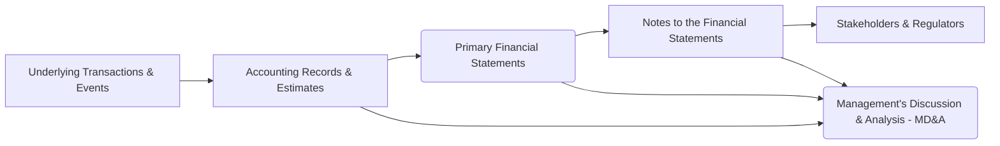

## 3.6 Notes to the Financial Statements (Policies, Related Party Disclosures)

Notes to the financial statements are a critical component of any entity’s general purpose financial reporting package. While the primary statements—such as the balance sheet, income statement, statement of comprehensive income, statement of changes in equity, and statement of cash flows—provide quantitative data, the notes enhance transparency by offering qualitative information, context, and insights into the underlying policies, methods, and circumstances that shape those numbers. In particular, disclosures of significant accounting policies, related party transactions, and areas of risk and uncertainty materially affect users’ understanding of a company’s financial performance and position.

This section outlines the principal disclosures required by U.S. GAAP (with relevant foundational comparisons to IFRS). It explains how these notes integrate with and support the primary financial statements, while highlighting standard best practices, potential challenges, and effective strategies for implementation. A thorough mastery of these disclosures will help aspiring and seasoned CPAs alike in both exam preparation and professional practice.

-------------------------------------------------------------------------------

### The Integral Role of Notes in Financial Reporting

Under U.S. GAAP, notes to the financial statements are considered an essential part of the reporting package, not a supplementary add-on. The objective of these notes is to:

• Provide the framework for how the numbers in the financial statements were derived.  
• Communicate significant judgments, estimates, and assumptions used in preparing the financial statements.  
• Disclose any significant events or transactions that influence users’ assessment of the entity’s financial health.  

Specific disclosures, governed by U.S. GAAP codifications such as FASB Accounting Standards Codification (ASC) 235 (Notes to Financial Statements) and ASC 850 (Related Party Disclosures), help ensure consistency across companies and comparability for investors, creditors, and regulators.

-------------------------------------------------------------------------------

### Summary of Significant Accounting Policies

Perhaps the most foundational section within the notes is the “Summary of Significant Accounting Policies,” which typically appears as the first footnote. This section concisely describes the principles, measurement methods, and accounting choices made by an entity when preparing its financial statements.

Below are some key elements typically disclosed:

• Basis of Presentation (e.g., whether statements are prepared in accordance with U.S. GAAP)  
• Use of Estimates: Companies must explain that financial statements often include estimates and assumptions that affect reported amounts.  
• Revenue Recognition Methods: Whether the entity uses the five-step model under ASC 606, how performance obligations are identified, how variable consideration is determined, etc.  
• Inventory Valuation: Whether FIFO, LIFO, weighted-average, or another method is used, along with the application of lower of cost or net realizable value (or market for LIFO entities).  
• Long-Lived Assets: Depreciation methods, estimated useful lives, and criteria for impairment testing.  
• Intangible Assets and Goodwill: Amortization periods for finite-lived intangibles, impairment approach for indefinite-lived intangibles, and goodwill valuation.  
• Financial Instruments: Recognition and measurement basis (amortized cost, fair value, etc.).  
• Foreign Currency Transactions/Translation: Methods for translating foreign operations, recognition of exchange rate differences.  
• Income Taxes: Recognition of deferred tax assets and liabilities, tax rate used, uncertain tax positions, and intraperiod tax allocations.  
• Leases: Classifications for lessee and lessor accounting, whether finance or operating leases, key assumptions related to discount rates and lease terms.  
• Subsequent Events: The cut-off period and the date through which management evaluated events and transactions.  

By systematically covering these and other essential accounting choices, stakeholders can understand the basis underlying the numbers and compare them meaningfully to other entities.

-------------------------------------------------------------------------------

### Disclosures of Risks and Uncertainties

Under ASC 275 (Risks and Uncertainties), entities must disclose certain major risks and uncertainties that can significantly impact their financial condition or results of operations. These may include:

• Nature of Operations: A description of the entity’s main activities, products, services, and markets.  
• Certain Significant Estimates: For example, the nature and magnitude of major estimates—such as valuations of financial instruments in Level 3 of the fair value hierarchy—along with changes in such estimates that could be material.  
• Current Vulnerabilities Due to Certain Concentrations: Examples include dependency on one major customer, reliance on a single supplier, concentrations in certain geographical areas, or specialized markets that significantly affect the entity’s ability to generate revenues or procure materials.  

These disclosures point readers toward areas where actual results could differ significantly from management’s assumptions, enhancing transparency and cautioning users of the potential volatility in reported figures.

-------------------------------------------------------------------------------

### Related Party Disclosures

#### Overview and Importance

Related party transactions present unique challenges to fair presentation. Such transactions do not always reflect market-based arm’s-length agreements, and there is potential for conflicts of interest and manipulation. Hence, ASC 850 (Related Party Disclosures) mandates that companies clearly disclose the nature of these relationships, the amount of transactions, and the balances due to or from related parties.

#### Identifying Related Parties

Related parties typically include:

• Affiliates and subsidiaries under common ownership or control.  
• Principal owners (e.g., individuals or entities with a controlling interest).  
• Management (both key members and close family members).  
• Board members, along with any entity in which those individuals hold a significant interest.  

In practice, identifying related parties can be complex, requiring a thorough understanding of ownership structures, management’s personal interests, and cross-entity relationships. Entities must carefully track any potential overlap in board membership or shared control to ensure nothing is omitted inadvertently.

#### Disclosure Requirements

Under ASC 850, disclosures should include:

• The nature of the relationship involved.  
• A description of the transactions (such as sales/purchases of goods, intercompany loans, service arrangements, asset transfers, or cost-sharing arrangements).  
• Dollar amounts (and outstanding balances) of the transactions, as well as any payment terms or settlement arrangements (interest rates, maturity dates, collateral).  
• The effect of any nonrecurring or unusual aspects of the related party dealings on the financial statements.  

If an entity cannot easily determine the amounts or properly measure the impact of related party transactions, it must disclose that in the notes.

#### IFRS Comparison

Under IFRS, IAS 24 (Related Party Disclosures) sets forth comparable requirements. The objective is similar: ensuring users of financial statements are aware of the existence, volume, and financial impact of transactions with related persons and entities. IFRS can differ in certain details, such as definitions of key management personnel and disclosure thresholds, but overall, the principle remains aligned with GAAP’s emphasis on transparency.

-------------------------------------------------------------------------------

### Integration of Notes with the Basic Financial Statements

Notes are not stand-alone documents; they are intrinsically linked to the primary financial statements. Each footnote refers to specific line items in the balance sheet, income statement, or other statements, providing the context necessary to interpret those figures. Integration involves:

• Cross-Referencing: Footnotes typically reference note numbers alongside related line items in the statements (e.g., “Refer to Note 5 for additional disclosure on intangible assets”).  
• Consistent Terminology: The language used in the statements and the notes must be consistent for clarity (e.g., using “Trade Receivables” in both places if that is the line item name).  
• Comprehensiveness: Footnotes support amounts in the statements, but also explain underlying judgments, estimates, policies, or events that do not appear directly but can materially alter financial results.  

By weaving the notes seamlessly into the fabric of financial reporting, users gain maximum insight into how each line item has been determined and its potential variability or uncertainty.

-------------------------------------------------------------------------------

### Mermaid Diagram: High-Level Integration of Notes into Financial Reporting

Below is a simplified flowchart illustrating how the notes to the financial statements integrate with the broader financial reporting framework:

Explanation:

• Underlying transactions and events (A) are recorded and estimated (B) using GAAP-based policies.  
• The primary financial statements (C) summarize those recordings in a structured format.  
• The footnotes (D) then expand on the figures, assumptions, and polices behind them.  
• Investors, creditors, regulators, and other stakeholders (E) rely on both (C) and (D) for decision-making.  
• Although not part of the audited financial statements, Management’s Discussion & Analysis (F) in certain public company filings provides additional context and forward-looking statements.

-------------------------------------------------------------------------------

### Practical Examples

1. **Revenue Recognition Policy Footnote**  
   A technology firm explains in its first footnote (Significant Accounting Policies) that it recognizes revenue upon transferring control of software licenses to the customer. The footnote highlights key judgments, such as determining whether each license is distinct, the estimated standalone selling price of performance obligations, and any variable considerations from usage-based fees.

2. **Related Party Loan Disclosures**  
   A retail chain’s CFO holds a substantial ownership stake in a separate manufacturing company that supplies the chain with products. The chain’s note on related parties must reveal the nature of the CFO’s ownership, the price of goods supplied, the loan’s principal amount, and any outstanding balances. If the terms differ from market norms, the note must highlight deviations, such as below-market interest rates or uncollateralized loans.

3. **Concentration Risks**  
   A small biotech firm discloses that 80% of its revenue is derived from a single pharmaceutical partner. If that relationship ceases, a substantial portion of the biotech firm’s revenue would vanish. The footnotes underline the firm’s vulnerability and emphasize the extent of risk facing prospective investors.

4. **Family-Owned Business Transactions**  
   A family-owned construction company enters into cost-plus building agreements with other family-held entities. The note describes the scope of work, pricing, and settlement terms to ensure transparency for lenders who finance the business.

-------------------------------------------------------------------------------

### Best Practices and Common Pitfalls

1. **Thorough Identification of Related Parties**  
   • Best Practice: Maintain a detailed organizational chart and regularly update management’s personal interests and directorships.  
   • Pitfall: Overlooking close family relationships, service contracts, or subcontracts involving directors’ spouses or children can lead to incomplete disclosures.

2. **Clear, Concise Language**  
   • Best Practice: Footnotes should be straightforward and written for clarity. Use bullet points, tables, or headings to break down complex disclosures.  
   • Pitfall: Long, text-heavy paragraphs without structure can mask critical details or confuse readers.

3. **Consistency and Cross-Referencing**  
   • Best Practice: Ensure footnotes tie directly back to specific line items in the financial statements, using a consistent description (e.g., “Note 8—Long-Term Debt”).  
   • Pitfall: Mismatched terminology or references can create confusion and reduce the credibility of the reporting.

4. **Update Disclosures for Changing Circumstances**  
   • Best Practice: Monitor major changes in external conditions (economic crises, board membership changes, new regulatory requirements) and update footnotes accordingly.  
   • Pitfall: Leaving footnotes unchanged for multiple reporting periods can omit newly material information or create the impression of complacency.

5. **Avoid Boilerplate**  
   • Best Practice: Craft disclosures specific to a company’s operations, risks, and unique structure.  
   • Pitfall: Generic, boilerplate language that fails to reflect the company’s actual environment undermines the value of the notes.

-------------------------------------------------------------------------------

### Common Challenges and Strategies for Implementation

• **Complex Ownership Structures:** Large conglomerates and companies with foreign subsidiaries may have intricate ownership webs, making it difficult to identify and track all related parties.  
  → Strategy: Implement robust governance protocols, including mandatory disclosures by executives, board members, and shareholders exceeding certain thresholds.

• **Estimation Uncertainty:** Many line items, especially intangible assets or contingent liabilities, involve management’s assumptions.  
  → Strategy: Document each assumption, cross-verify with third-party data, and ensure at least an annual review for reasonableness.

• **Frequent Standard Updates:** With evolving accounting standards—particularly around revenue, lease accounting, and fair value measurement—notes must be updated in tandem.  
  → Strategy: Assign a designated standard-update team to track new guidance, assess impacts, and revise disclosures as necessary.

-------------------------------------------------------------------------------

### Additional References for Further Exploration

1. **FASB Accounting Standards Codification (ASC)**  
   • ASC 235, “Notes to Financial Statements”  
   • ASC 850, “Related Party Disclosures”  
   • ASC 275, “Risks and Uncertainties”  

2. **IFRS Equivalents**  
   • IAS 1, “Presentation of Financial Statements” – Overall disclosure framework  
   • IAS 24, “Related Party Disclosures” – IFRS counterpart to ASC 850  

3. **Reference Books & Online Resources**  
   • “Wiley CPAexcel Exam Review: Financial Accounting and Reporting”  
   • “Intermediate Accounting” by Kieso, Weygandt, and Warfield  
   • AICPA Online Resources (www.aicpa.org)  
   • FASB Codification (www.fasb.org)  

-------------------------------------------------------------------------------

## Mastering Notes to the Financial Statements: Policies & Related Party Disclosures Quiz



### What is the primary objective of disclosing significant accounting policies in the first footnote of the financial statements?

- [ ] To provide a summary of management’s compensation plans.  
- [x] To explain the methods and assumptions used in preparing the financial statements.  
- [ ] To depict the year-over-year changes in net income.  
- [ ] To substitute the need for internal control disclosures.  

> **Explanation:** The summary of significant accounting policies explains the methods, estimates, and assumptions used in preparing the financial statements, ensuring that users understand how figures are derived.

### Which of the following disclosures is least likely to appear within the summary of significant accounting policies?

- [ ] Methods used for revenue recognition.  
- [x] Annual board meeting minutes detailing director conflicts.  
- [ ] Valuation methodology for intangible assets.  
- [ ] Depreciation methods and estimated useful lives.  

> **Explanation:** While board meeting minutes may reveal discussions about conflicts, they are not typically included in the summary of significant accounting policies. This section focuses on the entity’s key accounting principles and methods.

### Under ASC 850, which relationship would typically require a related party disclosure?

- [ ] A customer that accounts for less than 1% of total sales.  
- [ ] An unrelated supply vendor paid on standard terms.  
- [x] A corporate entity partially owned by the CFO’s spouse.  
- [ ] A small investor who owns only common stock of the entity.  

> **Explanation:** Any entity significantly influenced by management or close family members (including spouses) is considered a related party and requires disclosure under ASC 850.

### Which characteristic differentiates related party transactions from typical arm’s-length transactions?

- [ ] They always result in a gain to the selling party.  
- [x] They may not reflect prevailing market conditions.  
- [ ] They are subject to advanced revenue recognition methods.  
- [ ] They are never permitted under U.S. GAAP.  

> **Explanation:** One of the main concerns of related party transactions is that they may not occur under normal market conditions, potentially obscuring true economic value or cost.

### Select all statements that describe best practices for disclosing significant accounting policies:

- [x] Disclosures should be tailored to the entity’s operations.  
- [ ] Use of boilerplate language is recommended for brevity.  
- [x] Explanations should be kept as clear and concise as possible.  
- [ ] Avoid referencing GAAP sections or codifications.  

> **Explanation:** Best practices include tailoring disclosures to specific operations and keeping explanations clear and concise. Boilerplate language can obscure unique facts, and referencing GAAP standards may help ensure clarity.

### When an entity has a single major customer that constitutes over 70% of its revenue, which of the following is most appropriate?

- [x] Disclose the concentration risk and explain the potential impact on future operations.  
- [ ] Do not disclose to avoid revealing competitive information.  
- [ ] Treat it as an ordinary sales transaction requiring no special note.  
- [ ] Only include the customer’s name in the notes.  

> **Explanation:** ASC 275 requires disclosure of significant concentrations that could materially affect the entity’s future operations. Omitting this information could mislead financial statement users.

### Which of the following is a common pitfall in preparing related party disclosures?

- [x] Failing to identify ownership by extended family members of key management.  
- [x] Using consistent references to line items.  
- [ ] Linking footnotes to specific balances in the statements.  
- [ ] Using bullet points to organize complex disclosures.  

> **Explanation:** Identifying ownership by extended family members can be challenging, and it is a frequent overlooked matter in related party disclosures. Using consistent references, linking footnotes, and organizing information clearly are actually best practices, not pitfalls.

### The section of the notes typically used to highlight potential variability in reported figures due to management estimates is:

- [x] The disclosure of risks, uncertainties, and use of estimates.  
- [ ] The description of intangible assets.  
- [ ] The subsequent events note.  
- [ ] The statement of retained earnings.  

> **Explanation:** Risks, uncertainties, and particularly the use of estimates are typically disclosed in a specific section or within the summary of significant accounting policies. This ensures users are aware of how estimates can affect reported amounts.

### Which item would most likely appear under “Related Party Transactions” in the footnotes?

- [x] Loan receivable from a key officer with below-market interest.  
- [ ] A bank loan payable to a third-party lender.  
- [ ] Standard service contract with an unrelated vendor.  
- [ ] An interest expense disclosure for a publicly traded bond.  

> **Explanation:** Below-market interest loan agreements with key officers are prime examples of related party transactions. They differ significantly from standard market transactions and must be disclosed.

### The notes to the financial statements are considered an integral part of the basic financial statements. True or False?

- [x] True  
- [ ] False  

> **Explanation:** U.S. GAAP stipulates that notes are inextricably linked to the financial statements. They are not optional or peripheral; they provide context and disclosure that complete the financial picture.



-------------------------------------------------------------------------------

## For Additional Practice and Deeper Preparation

**[FAR CPA Hardest Mock Exams: In-Depth & Clear Explanations](https://www.udemy.com/course/far-cpa-mock-exams/?referralCode=F88050F8D5C76764F6BD)**  

**Financial Accounting and Reporting (FAR) CPA Mocks:** 6 Full (1,500 Qs), Harder Than Real! In-Depth & Clear. Crush With Confidence!

- Tackle full-length mock exams designed to mirror real FAR questions.  
- Refine your exam-day strategies with detailed, step-by-step solutions for every scenario.  
- Explore in-depth rationales that reinforce higher-level concepts, giving you an edge on test day.  
- Boost confidence and minimize anxiety by mastering every corner of the FAR blueprint.  
- Perfect for those seeking exceptionally hard mocks and real-world readiness.

_Disclaimer: This course is not endorsed by or affiliated with the AICPA, NASBA, or any official CPA Examination authority. All content is for educational and preparatory purposes only._
