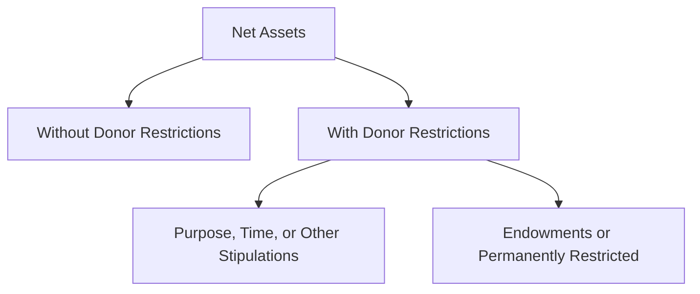

## 4.1 Overview of Not-for-Profit Accounting and Governing Principles

Not-for-profit (NFP) entities serve a fundamental role in society by pursuing missions that provide public benefit, community support, cultural enrichment, or charitable services. From charitable foundations and healthcare organizations to religious institutions, NFPs are entrusted by donors, grantors, community members, and other stakeholders to effectively manage and report their resources. To fulfill these obligations, not-for-profit accounting follows specific standards and guiding principles designed to enhance transparency, accountability, and consistency. This section examines the unique characteristics that shape not-for-profit financial reporting, with a focus on stakeholder expectations, specialized standards, and the classification of net assets.

## Unique Environment of Not-for-Profit Entities

Unlike for-profit organizations driven primarily by profitability and shareholder returns, NFPs exist to further social or philanthropic missions. This core purpose underpins every aspect of their governance, financial reporting, and strategic decisions. Key distinctions often include:

• Mission-Driven Operations: The ultimate goal is to serve a mission rather than to generate profits for distribution.  
• Reliance on Donations and Grants: NFPs commonly receive substantial funding from contributors who expect transparent and mission-focused use of resources.  
• Limited or No Equity Ownership: NFPs have no stockholders. Instead, they are accountable to members, donors, trustees, or boards of directors.  
• Tax-Exempt Status: Many are exempt from certain taxes; however, strict regulations and oversight apply to maintain such status.  

Accounting standards for NFPs aim to reflect these mission-focused attributes and provide clear insights into how resources are acquired, managed, and spent to support organizational objectives.

## Key Stakeholder Expectations

Stakeholders of NFPs require clear, credible information about how effectively funds are used to advance the entity’s mission. While for-profit entities are typically answerable to investors or shareholders, a not-for-profit’s ecosystem of stakeholders extends to:

• Donors, Grantors, and Members: They expect financials to illustrate whether resources flow directly to programs and initiatives rather than administrative or fundraising overhead.  
• Governing Boards and Trustees: Internal leadership and administration need reliable financial reports to make responsible decisions about budgeting, strategic planning, and policy.  
• Regulators and Governmental Authorities: Federal, state, and local agencies demand adherence to legal requirements tied to tax-exempt status and public accountability.  
• Beneficiaries or Program Recipients: The community served by the NFP may seek evidence that programs are functional, impactful, and sufficiently funded.

Meeting these expectations requires compliance with specialized accounting principles and transparent reporting practices that illustrate how resources are allocated in line with an organization’s stated objectives.

## Overview of Not-for-Profit Regulatory and Standard-Setting Bodies

Not-for-profit entities typically follow standards issued by the Financial Accounting Standards Board (FASB). Though there is significant overlap between the accounting practices of for-profit and not-for-profit entities, FASB provides additional NFP-specific guidance under the Accounting Standards Codification (ASC), primarily in:

• ASC 958 – Not-for-Profit Entities: Outlines the core principles and disclosures unique to NFPs, including revenue recognition for contributions and the classification of net assets.  
• ASC 954 – Health Care Entities: Addresses more specialized guidance for NFP healthcare organizations.  

Other relevant regulators include:

• Internal Revenue Service (IRS): Oversees matters related to tax-exempt status and reporting requirements such as Form 990.  
• State Regulators: Some states mandate additional filings, solicitation licenses, and special disclosures.  

In addition to binding standards, NFPs often voluntarily adhere to best-practice guidelines, such as those from the American Institute of Certified Public Accountants (AICPA) or the Governmental Accounting Standards Board (GASB) in rare instances when operating under a government structure. However, nongovernmental NFPs primarily follow FASB’s guidance.

## Governing Principles and Financial Statements

NFP financial reporting seeks to serve users who need insights into an entity’s stewardship of resources, operational effectiveness, and fulfillment of mission-driven programs. The major governing principles for this type of reporting include:

• Net Asset Classification: Resources are classified according to donor-imposed restrictions.  
• Transparency in Fund Usage: Activities and transactions must be transparently presented to reflect whether particular resources are restricted or without restrictions.  
• Emphasis on Accountability: Reporting frameworks highlight stewardship, clarifying whether the organization is effectively using donations and grants for their intended purpose.  
• Consistency and Comparability: Adopting uniform accounting standards allows stakeholders to compare different organizations’ financial positions and performance more readily.

### Core Financial Statements

Following ASC 958, nongovernmental NFPs typically prepare:

• Statement of Financial Position – Similar to a balance sheet, but highlighting net assets under two categories.  
• Statement of Activities – Similar to an income statement, reflecting revenues, expenses, gains, and losses. It differentiates net assets without donor restriction from net assets with donor restriction.  
• Statement of Cash Flows – Follows ASC 230 guidelines but includes unique examples (e.g., classification of donor-restricted contributions for long-term purposes).  
• Statement of Functional Expenses – Often required (particularly for voluntary health and welfare organizations). This statement or its equivalent reporting discloses expenses by both nature (e.g., salaries, rent) and function (program, administrative, fundraising).

## Net Asset Classifications

One of the primary differences between for-profit and not-for-profit reporting lies in the handling of equity or net assets. Because NFPs do not have shareholders, they present their equity section as “net assets,” classified into two main categories:

• Net Assets Without Donor Restrictions (formerly “Unrestricted”) – Funds that may be expended at the discretion of the entity’s governing board or management to support operations and further the mission. These net assets are not restricted by any external parties.  
• Net Assets With Donor Restrictions (formerly a combination of “Temporarily Restricted” and “Permanently Restricted”) – Funds subject to specific donor-imposed stipulations. These may include restrictions on timing (e.g., “use after five years”) or purpose (e.g., “use for scholarships only”).  

NFPs must carefully track and disclose these categories to communicate compliance with donor wishes. When donor restrictions are satisfied, the reclassification from net assets with donor restrictions to net assets without donor restrictions is reported in the Statement of Activities.

Below is a simple diagram illustrating the core net assets classification structure:

This classification helps a broad range of stakeholders understand the availability and intended use of the organization’s resources.

## Specialized Accounting Topics for Not-for-Profit Entities

Not-for-profit environments introduce several specialized accounting considerations:

1. Contribution Revenue vs. Exchange Transactions  
   • Contributions are nonreciprocal transfers of assets or services from a donor to an NFP. Recognized as revenue when promised (conditional vs. unconditional contributions).  
   • Exchange transactions, by contrast, involve quasi-commercial operations where the NFP provides goods or services in return. These follow FASB’s general revenue recognition framework.  

2. Allocation of Expenses by Function  
   • Administrative, fundraising, and program expenditures must be segregated. This functional reporting underscores how effectively the NFP directs resources toward its programs versus overhead or appeals for funding.

3. Endowment Funds  
   • Some donors contribute funds to be invested indefinitely, with only investment income available for current needs. Accounting for endowments is complex, involving policies on spending rates and how realized and unrealized investment gains are classified.

4. In-Kind Contributions  
   • Donations of tangible or intangible goods, professional services, or facilities (e.g., rent-free office space) must be recognized in the financial statements if they meet certain criteria of measurability and relevance.

5. Disclosure Requirements  
   • NFPs disclose information on liquidity, availability of financial assets, and any relevant policies regarding spending reserves. This is especially important for donors evaluating the organization’s sustainability.

## Governance, Oversight, and Ethical Considerations

The governance structure of NFPs is typically overseen by a board of directors or trustees, ensuring that the entity adheres to ethical standards and remains true to its exempt purpose. Key governance factors include:

• Board Fiduciary Duties: Board members owe duties of care, loyalty, and obedience to the organization’s mission.  
• Internal Controls: Developing strong controls is essential due to reliance on donations, volunteer support, and restricted funds.  
• Ethics and Integrity: Maintaining donor confidence often hinges on ethical leadership, accurate reporting, and inclusive disclosures.  
• Conflict of Interest Policies: Transparent policies around potential conflicts (e.g., contracting with board members) are critical for public trust.

## Best Practices and Common Pitfalls

NFPs face unique challenges, particularly in handling restricted funds and meeting donors’ specific expectations. Some best practices and pitfalls include:

• Best Practices:  
  – Implement thorough policies for monitoring donor-imposed restrictions.  
  – Track expenses by function and nature consistently to provide clear insights into program spending.  
  – Adopt advanced accounting software that facilitates separate tracking of restricted and unrestricted net assets.  
  – Provide comprehensive disclosures on liquidity and availability of resources to ensure stakeholders understand the organization’s ability to fund operations.  

• Common Pitfalls:  
  – Mixing restricted funds with general operating assets, leading to potential misapplication of resources.  
  – Failing to reclassify net assets when donor restrictions are met, causing inaccuracies in reported balances.  
  – Inadequate documentation of in-kind contributions.  
  – Lack of robust internal controls over cash and in-kind donations, increasing the risk of misuse.  

## Practical Examples and Case Studies

1. Hospital Endowment Scenario  
   • A well-known children’s hospital receives a $2 million endowment, permanently restricted by the donor to fund research on a specific disease. This donation is recorded within “Net Assets With Donor Restrictions.” Investment income generated from the principal can be used per donor stipulations. Any reclassification occurs only if the donor modifies restrictions or if earnings are spent according to the endowed purpose.

2. Arts Organization With Restricted Time Contribution  
   • A local theater receives a pledge of $500,000 to upgrade its auditorium, payable in two installments over two years. The gift is recognized as a conditional contribution if certain performance conditions exist or an unconditional pledge if the funds are guaranteed, and recorded initially under net assets with donor restrictions (time and purpose).  

3. Educational Institution In-Kind Donations  
   • A private university receives specialized legal services pro bono. If these professional services meet the recognition criteria in ASC 958-605 (they are specialized skills and would otherwise be purchased), they should be reported as a contribution (revenue) and corresponding expense at fair value.

## Encouraging Accountability and Transparent Reporting

Not-for-profit organizations must continually demonstrate responsible stewardship of resources. High-quality, transparent reporting:

• Strengthens donor relationships by proving that management is acting responsibly.  
• Enhances public trust and fosters willingness to contribute to the organization’s program goals.  
• Helps the board and executive team make informed decisions, thereby aligning activities more effectively with the mission.

Ultimately, not-for-profit financial reporting is a powerful tool for demonstrating accountability and sustaining the public’s trust, which is essential for ongoing support of charitable objectives.

## References and Further Exploration

• FASB ASC 958: Not-for-Profit Entities – Primary source for U.S. GAAP requirements.  
• AICPA Audit and Accounting Guide: Not-for-Profit Entities – Offers additional guidance, including illustrations and best practices.  
• IRS Publication 557 – Explains the requirements for tax-exempt status.  
• The National Council of Nonprofits (councilofnonprofits.org) – Offers numerous resources and updates on legal and regulatory matters.  

By mastering the specialized standards, net asset classifications, and key principles of not-for-profit accounting, finance professionals can ensure that mission-driven organizations meet the expectations of their boards, donors, beneficiaries, and communities.

---------------------------------------------------------------------------------

## Test Your Knowledge: Not-for-Profit Accounting Essentials Quiz



### Which of the following describes a primary distinction between not-for-profit and for-profit entities?

- [ ] Not-for-profit entities always generate a significant profit margin.  
- [x] Not-for-profit entities exist primarily to fulfill a mission rather than maximize returns.  
- [ ] Not-for-profit entities report to shareholders with voting rights.  
- [ ] Not-for-profit entities do not prepare financial statements.  

> **Explanation:** Unlike for-profit entities, not-for-profit entities do not exist to provide a return to shareholders. Their primary goal is to serve a social or philanthropic mission.

### Donor-imposed restrictions that specify a purpose for contributed funds would generally place those funds under:

- [ ] Net assets without donor restrictions.  
- [x] Net assets with donor restrictions.  
- [ ] Permanently restricted liabilities.  
- [ ] Unrestricted retained earnings.  

> **Explanation:** Donor-imposed restrictions on how contributions may be used require an NFP to classify these contributions under net assets with donor restrictions.

### What is one key requirement of the Statement of Functional Expenses among not-for-profit entities?

- [x] It must break down expenses by both nature (e.g., salaries, rent) and function (e.g., program, administration).  
- [ ] It only presents cash outflows for program operations.  
- [ ] It is only required if the not-for-profit entity receives federal grant funding.  
- [ ] It merges all expenses in a single line item on the Statement of Financial Position.  

> **Explanation:** ASC 958 requires certain not-for-profit entities to break down expenditures by their nature and functional classification, providing insight into how resources are allocated.

### A donor pledged $100,000 to an NFP to be used next fiscal year for educational programs. Until next fiscal year, this contribution is most likely classified as:

- [ ] Net assets without donor restrictions.  
- [ ] Liabilities.  
- [x] Net assets with donor restrictions (time-restricted).  
- [ ] Board-designated funds.  

> **Explanation:** The pledge is restricted by time (future use), so it is recognized in net assets with donor restrictions until the specified time arrives.

### Which statement regarding in-kind contributions is correct?

- [x] They must be recognized at fair value if they provide specialized skills or meet certain criteria.  
- [ ] They should never be recorded in the financial statements.  
- [x] They always lead to an immediate reclassification from restricted to unrestricted net assets.  
- [ ] They can only be recorded when they exceed $10,000.  

> **Explanation:** In-kind contributions, such as services requiring specialized skills, should be measured at fair value under ASC 958-605. The third choice is also correct: some in-kind donations can immediately be used for unrestricted purposes if no donor-imposed restrictions apply, but this depends on the actual conditions of the contribution.  

(Note: Two correct answers: recognizing specialized skills at fair value and, in certain cases, immediate release from restriction.)

### When a donor restriction expires (e.g., a time restriction passes or a purpose restriction is met), what is the most common reporting treatment?

- [ ] The funds remain indefinitely under net assets with donor restrictions.  
- [ ] The organization refunds the donor.  
- [x] A reclassification is made from net assets with donor restrictions to net assets without donor restrictions.  
- [ ] It is recorded as a gain on the income statement.  

> **Explanation:** ASC 958 requires a reclassification from “with donor restrictions” to “without donor restrictions” once the underlying restriction is satisfied.

### Which organization primarily sets accounting standards for nongovernmental not-for-profit entities in the United States?

- [ ] Governmental Accounting Standards Board (GASB)  
- [x] Financial Accounting Standards Board (FASB)  
- [ ] Internal Revenue Service (IRS)  
- [ ] American Institute of Certified Public Accountants (AICPA)  

> **Explanation:** FASB is responsible for setting U.S. GAAP for nongovernmental entities, including not-for-profit organizations.

### Donations received for a building campaign to be spent over five years are an example of:

- [ ] Restricted exchange transactions.  
- [ ] Board-designated net assets.  
- [x] Time and purpose restricted donations.  
- [ ] Corporate sponsorship revenue.  

> **Explanation:** The donations are restricted for a specific purpose (building) and over a certain time frame (five years). Thus, these funds fall under both time and purpose restrictions.

### Why are net assets reported instead of owner’s equity in a not-for-profit’s Statement of Financial Position?

- [ ] Net assets are only used when the organization is publicly traded.  
- [x] NFPs do not have shareholders, so equity is derived from donor contributions and retained earnings.  
- [ ] It aligns with IFRS requirements for for-profit entities.  
- [ ] Owner’s equity is not recognized under any circumstances.  

> **Explanation:** Because an NFP has no owners or shareholders, the “equity” component is replaced with net assets. This more accurately represents the resources available to the organization and any associated donor restrictions.

### Not-for-profit entities must file periodic information returns with the IRS (e.g., Form 990) primarily to:

- [x] Maintain tax-exempt status and demonstrate accountability.  
- [ ] Generate investment returns for shareholders.  
- [ ] Align with international financial regulations.  
- [ ] Comply with GAAP reporting only.  

> **Explanation:** Filing Form 990 and similar returns is part of maintaining tax-exempt status and providing accountability to the IRS and the public.



---------------------------------------------------------------------------------

## For Additional Practice and Deeper Preparation

**[FAR CPA Hardest Mock Exams: In-Depth & Clear Explanations](https://www.udemy.com/course/far-cpa-mock-exams/?referralCode=F88050F8D5C76764F6BD)**  

**Financial Accounting and Reporting (FAR) CPA Mocks:** 6 Full (1,500 Qs), Harder Than Real! In-Depth & Clear. Crush With Confidence!  

- Tackle full-length mock exams designed to mirror real FAR questions.  
- Refine your exam-day strategies with detailed, step-by-step solutions for every scenario.  
- Explore in-depth rationales that reinforce higher-level concepts, giving you an edge on test day.  
- Boost confidence and minimize anxiety by mastering every corner of the FAR blueprint.  
- Perfect for those seeking exceptionally hard mocks and real-world readiness.  

_Disclaimer: This course is not endorsed by or affiliated with the AICPA, NASBA, or any official CPA Examination authority. All content is for educational and preparatory purposes only._
