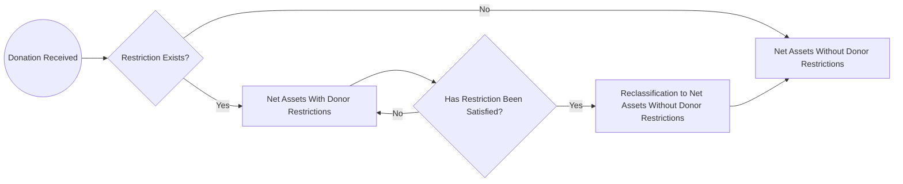

## 4.2 Statement of Financial Position (Net Assets: With/Without Donor Restrictions)

A not-for-profit organization’s (NFP’s) Statement of Financial Position—often referred to as the “balance sheet” in for-profit terminology—provides a snapshot of the entity’s financial health at a given point in time. One of the most distinctive features of an NFP’s balance sheet is the classification of net assets as either “with donor restrictions” or “without donor restrictions.” This classification model, updated under FASB Accounting Standards Update (ASU) 2016-14, streamlines how NFPs present information about donor-imposed limitations on resource use.

This section offers a comprehensive look into the structure of the Statement of Financial Position for NFPs, focusing on net assets with donor restrictions and net assets without donor restrictions. We also explore guidelines related to reclassifications when donor-imposed restrictions expire, illustrative examples, and best practices to ensure transparency and compliance with FASB ASC 958.

--------------------------------------------------------------------------------
### Importance of Net Asset Classifications
Donors often contribute resources with specific conditions or limitations on how or when the funds may be used. Properly segregating net assets informs readers—such as board members, donors, regulators, and creditors—of the extent to which the NFP can direct and deploy its resources. FASB ASC 958-205 requires that net assets be reported broadly under two categories:

• Net Assets Without Donor Restrictions  
• Net Assets With Donor Restrictions  

These classifications replace the previously used three-part model (unrestricted, temporarily restricted, and permanently restricted). Under the revised guidelines, not-for-profit financial statements display a clearer distinction between resources that the organization may use freely and those that have certain conditions placed upon them.

--------------------------------------------------------------------------------
### Net Assets Without Donor Restrictions
Net assets without donor restrictions (often referred to colloquially as “unrestricted” net assets) include any resources that an NFP can use at its discretion. This category may consist of:

1. Undesignated Net Assets:  
   Resources available for everyday operations and to meet ongoing programmatic or administrative needs.

2. Board-Designated Net Assets (Quasi-Endowments):  
   Although these funds do not have a donor restriction, the board of directors or trustees may earmark a portion of net assets for a specific use (e.g., long-term investment, special projects). Board designations are internally imposed and can be reversed by a future board action, differentiating them from donor restrictions that the organization is legally bound to follow.

3. Operating Reserves:  
   Funds set aside to ensure that the organization can meet short-term financial obligations and continue to operate programs without interruption. Although this is not a formal sub-class under GAAP, many NFPs internally track operating reserves to strengthen their financial stability.

• Example – Net Assets Without Donor Restrictions:  
  An NFP health clinic receives $100,000 from a corporate sponsor with no specified purpose. The clinic’s board subsequently decides to set aside $25,000 of these funds to cover future clinic renovations. In the financial statements, the entire $100,000 is reported as net assets without donor restrictions, but $25,000 may be separately disclosed and labeled as board-designated in the footnotes or face of the statement to clarify that the board has internally earmarked those funds for renovations.

--------------------------------------------------------------------------------
### Net Assets With Donor Restrictions
When a donor stipulates that a contribution be used for a particular purpose—or not be used until a specified time—those funds must be reported as net assets with donor restrictions. Donor restrictions can be either temporary or perpetual, but under FASB ASC 958, these sub-classifications are not necessarily shown on the face of the Statement of Financial Position. Instead, details on the nature and duration of donor restrictions are typically disclosed in the footnotes, where they might be explained as one of the following:

1. Purpose Restrictions:  
   The donor specifies that the funds be used for a certain program, project, or initiative (e.g., capital campaign for a new building, research grants restricted for specific diseases, or scholarships).

2. Time Restrictions:  
   The donor might stipulate that resources may not be used until a particular date or until a specified event occurs (e.g., a trust that becomes available at the end of a five-year term).

3. Permanent or Endowment Restrictions:  
   Certain endowment gifts require maintaining the principal in perpetuity. Typically, only the investment returns are available for use (either with or without further restrictions, depending on the donor’s stipulations).

• Example – Net Assets With Donor Restrictions:  
  A donor contributes $500,000 to build a new community library and explicitly states the funds must only be spent on the library construction. Since these resources must be used for that specific purpose, they are reported as net assets with donor restrictions. Once the building is completed and the restriction is satisfied, any unspent portion of the gift or related net assets may be reclassified to “without donor restrictions,” provided the donor’s intention is fulfilled and not limited to an endowment purpose.

--------------------------------------------------------------------------------
### Presentation of Net Assets in the Statement of Financial Position
Although FASB ASC 958-205 only mandates two classifications of net assets on the face of the statement (with and without donor restrictions), many NFPs present more granular breakdowns in accompanying notes. Below is a sample layout that depicts how an NFP might structure its Statement of Financial Position:

--------------------------------------------------------------------------------
Assets  
• Current Assets  
  – Cash and Cash Equivalents  
  – Short-Term Investments  
  – Accounts Receivable  
  – Prepaid Expenses  
• Long-Term Assets  
  – Long-Term Investments  
  – Property and Equipment, Net  
  – Other Long-Term Assets  

Total Assets  

Liabilities  
• Current Liabilities  
  – Accounts Payable and Accrued Expenses  
  – Current Portion of Long-Term Debt  
• Long-Term Liabilities  
  – Long-Term Debt, Net of Current Portion  

Total Liabilities  

Net Assets  
• Net Assets Without Donor Restrictions  
  – Undesignated  
  – Board-Designated (if disclosed separately)  
• Net Assets With Donor Restrictions  

Total Net Assets  

Total Liabilities and Net Assets  
--------------------------------------------------------------------------------

Note that under “Net Assets,” the NFP segregates resources that are freely available from those restricted by donors. Further disaggregation and narrative explanations in the footnotes can illuminate the specific types of donor restrictions, the amount of board-designated funds, and other pertinent details.

--------------------------------------------------------------------------------
### Reclassifications of Net Assets When Restrictions Expire
A donor restriction eventually lifts when its specific criteria are met. At that time, a reclassification (sometimes called a “release from restriction”) occurs, shifting net assets from “with donor restrictions” to “without donor restrictions.” Key situations that trigger reclassifications include:

1. Purpose Fulfillment:  
   Once the funds are spent in accordance with the donor’s specified purpose, or the program or capital project is completed, the associated restricted net assets are considered satisfied.

2. Passage of Time:  
   Where contributors specify that assets must be used after a certain date, the net assets with donor restrictions are reclassified on that date to net assets without donor restrictions.

3. Satisfaction of Other Conditions:  
   If a donation is contingent on an event (e.g., matching requirements or other stipulations), once that condition is resolved, the funds become available without further restriction.

Reclassification entries typically debit Net Assets With Donor Restrictions and credit Net Assets Without Donor Restrictions, indicating that the restricted amount is now available for general use. An example journal entry for the release of a donor restriction might be:

(Dr) Net Assets With Donor Restrictions ………… XX  
(Cr) Net Assets Without Donor Restrictions …… XX  

• Example – Reclassification:
Suppose an NFP youth center spends $50,000 received from a donor to support a new after-school sports program. Having satisfied the purpose restriction outlined by the donor, the organization reclassifies that amount from net assets with donor restrictions to net assets without donor restrictions in the Statement of Activities (and by extension, the Statement of Financial Position). This reclassification does not impact total net assets, but it shifts the composition between the two primary categories.

--------------------------------------------------------------------------------
### Illustrative Mermaid Diagram: Donor Restrictions Lifecycle

Below is a Mermaid.js diagram illustrating the flow of funds from donor-imposed restrictions to final release:

Explanation:  
1. A donation comes in. The organization assesses if there is a restriction.  
2. If no restriction exists, it is classified immediately under net assets without donor restrictions.  
3. If a restriction exists, it is classified under net assets with donor restrictions until the condition (time-based, purpose-based, or other) is met.  
4. Once the restriction is satisfied, the funds are reclassified to net assets without donor restrictions.

--------------------------------------------------------------------------------
### Practical Considerations and Common Pitfalls
1. Tracking Restrictions:  
   Many NFPs struggle to maintain separate records for each restricted gift. Creating detailed subsidiary ledgers or employing robust accounting software helps ensure accurate, up-to-date tracking of donor restrictions.

2. Underestimating Disclosure Requirements:  
   ASU 2016-14 tightened disclosure provisions to highlight liquidity and availability of resources, as well as the nature of donor-imposed restrictions. Failure to provide adequate details about major donor-imposed limitations could result in compliance issues and misinformed users.

3. Handling Multiple Restrictions:  
   Certain gifts come with more than one form of restriction (e.g., time plus purpose). Understanding and consistently applying these layered restrictions is crucial to accurate financial reporting.

4. Reclassifications Timing:  
   If an organization prematurely reclassifies net assets, it risks misstating its financial position. NFPs should ensure that reclassifications happen only after fulfilling all the requisite donor criteria.

5. Lack of Board Oversight:  
   Even if net assets are without donor restrictions, the board may internally designate or earmark funds for strategic initiatives. Although these designations are not legally binding in the same way as donor restrictions, the organization should still track and disclose them to remain transparent.

--------------------------------------------------------------------------------
### Case Study Example
Imagine a community theater receiving multiple contributions over the year:

• $25,000 from a donor, restricted for constructing new stage lighting (on the condition the theater raises matching funds).  
• $80,000 from a foundation, restricted to support a youth arts outreach program over two years.  
• $50,000 from individual donors with no specified purpose.  

At year-end:

• The theater successfully raised matching funds and purchased the lighting equipment for $25,000 → The restriction is satisfied, so those funds are reclassified from donor restricted to without donor restrictions.  
• The $80,000 is partially spent ($40,000) on the youth arts program in the current year, fulfilling half the donor's time restriction. The unspent portion remains in net assets with donor restrictions until the second year’s requirements are met.  
• The $50,000 is reported under net assets without donor restrictions.  

In the Statement of Financial Position, net assets with donor restrictions would show $40,000, and net assets without donor restrictions would include the $50,000 unrestricted gift plus the reclassified $25,000 spent on lighting.

--------------------------------------------------------------------------------
### Best Practices for Presenting Net Assets
1. Use Clear, Descriptive Captions:  
   Label net assets on the face of the statement using straightforward titles such as “Net Assets With Donor Restrictions” or “Net Assets Without Donor Restrictions.” Provide user-friendly note disclosures that highlight type, duration, and nature of restrictions.

2. Employ Subtotals and Supplemental Schedules:  
   While only two main classes of net assets are mandated, an NFP often benefits from providing subtotals in their footnotes (e.g., “endowment funds,” “capital campaign funds”). This approach offers deeper insight while keeping the face of the financial statements uncluttered.

3. Consistency in Applying Donor Restrictions Policies:  
   Outline a clear policy for evaluating and documenting donor-imposed conditions, ensuring consistent classification and release procedures across departments.

4. Robust Internal Controls Over Contributions:  
   Implement strong controls to identify incoming donations, properly classify them, monitor time or purpose hurdles, and process timely reclassifications.

--------------------------------------------------------------------------------
### Suggestions for Further Reading
• FASB ASC 958-205, Presentation of Financial Statements—Not-for-Profit Entities  
• FASB ASU 2016-14, “Presentation of Financial Statements for Not-for-Profit Entities”  
• AICPA Audit & Accounting Guide: Not-for-Profit Entities, which offers illustrative examples and best practices  

--------------------------------------------------------------------------------
### Diagrams, Charts, and Visual Aids
Beyond the Mermaid.js flowchart, organizations often use tables to summarize restricted net assets by purpose or time. Consider creating a simple chart in your record-keeping system to track major categories:

| Donor Restriction | Project/Purpose      | Time Frame        | Amount Pledged | Amount Used | Remaining Balance |
|-------------------|----------------------|-------------------|----------------|------------|-------------------|
| Capital Campaign  | New Theater Lighting | Matching Funds Met| $25,000        | $25,000    | $0               |
| Program Funding   | Youth Arts Outreach  | 2 Years           | $80,000        | $40,000    | $40,000          |

--------------------------------------------------------------------------------
### Conclusion
Effectively classifying, presenting, and disclosing donor restrictions on net assets is critical for not-for-profit organizations. Clarity and transparency in reporting increase stakeholder confidence, ensure regulatory compliance, and help NFPs maintain donor relations. By thoroughly understanding the principles behind net assets with and without donor restrictions—and adhering to best practices—NFPs demonstrate fiscal responsibility and alignment with their stated missions.

--------------------------------------------------------------------------------

## Mastering Net Asset Classifications in Not-for-Profit Financial Statements Quiz



### Which of the following statements is TRUE regarding net assets?
- [ ] Net assets must be classified as unrestricted, temporarily restricted, or permanently restricted.  
- [x] Net assets must be classified as either with donor restrictions or without donor restrictions.  
- [ ] Net assets are classified only when a board-designation is in place.  
- [ ] Net assets are not required to be disclosed on the face of the Statement of Financial Position.  

> **Explanation:** With the implementation of FASB ASU 2016-14, NFPs are required to classify net assets under two categories: with donor restrictions or without donor restrictions.

### What is the main difference between board-designated net assets and donor-restricted net assets?
- [ ] Board-designated net assets must remain intact in perpetuity, while donor-restricted net assets cannot be changed.  
- [ ] There is no difference; both represent legally binding restrictions.  
- [x] Board designations may be reversed by the board, while donor restrictions are legally binding.  
- [ ] Donor restrictions always expire at the fiscal year-end, while board designations do not.  

> **Explanation:** Board-designated funds are internally restricted by the entity’s board; these designations can be modified or removed by future board action. Donor restrictions, however, are legally enforceable.

### Which of the following BEST describes when a reclassification from net assets with donor restrictions to net assets without donor restrictions occurs?
- [ ] When the board decides to change its internal policies.  
- [ ] When management determines that restricted assets would be more useful without restriction.  
- [x] When the donor-imposed restriction has been satisfied (purpose, time, or otherwise).  
- [ ] If the net assets have been unspent for more than 12 months.  

> **Explanation:** Reclassifications (release from restriction) occur only after satisfying the specific purpose or time conditions set by the donor.

### An NFP receives a $100,000 unrestricted donation. The board subsequently votes to devote $30,000 of it to future capital improvements. How should this be reported?
- [x] As net assets without donor restrictions, with $30,000 recognized as board-designated in disclosures.  
- [ ] As net assets with donor restrictions, capital improvements category.  
- [ ] As a split, $70,000 without donor restrictions and $30,000 with donor restrictions.  
- [ ] Not included in the Statement of Financial Position since it’s internally restricted.  

> **Explanation:** Because the donor did not impose restrictions, the gift is classified as net assets without donor restrictions. The $30,000 portion designated by the board is still reported as without donor restrictions but noted separately.

### Which statement best characterizes the purpose of disclosing net assets with donor restrictions in notes?
- [x] It provides transparency about the nature and time horizon of donor-imposed limits.  
- [ ] It allows donors to override board decisions on fund usage.  
- [x] It ensures NFPs pay lower taxes on restricted gifts.  
- [ ] It automatically defers revenue recognition until restrictions are lifted.  

> **Explanation:** Disclosures offer information on the nature, duration, and amount of donor-imposed restrictions, fostering transparency and clarity for internal and external stakeholders. (Note that this question has two correct answers, focusing on the nature and time horizon aspects.)

### What is a common pitfall for NFPs when accounting for restricted gifts?
- [ ] Updating internal policies on time.  
- [ ] Separating the bank accounts for restricted and unrestricted funds.  
- [x] Failing to track and monitor the use of restricted gifts accurately.  
- [ ] Recording every donation as restricted to be conservative.  

> **Explanation:** Perhaps the most frequent challenge is ensuring that restricted funds are tracked adequately to demonstrate compliance with donor specifications and facilitate accurate financial reporting.

### Under ASU 2016-14, how should perpetual endowments be reported in the Statement of Financial Position?
- [x] As net assets with donor restrictions, since the principal is restricted in perpetuity.  
- [ ] As net assets without donor restrictions, given that only the income is restricted.  
- [ ] As deferred inflows of resources.  
- [x] As temporarily restricted net assets for a defined period.  

> **Explanation:** By definition, an endowment requiring the principal be maintained in perpetuity must be classified within net assets with donor restrictions. (There are two correct answers in the sense that endowments’ principal is perpetually restricted, but the last option “temporarily restricted” is an outdated classification under ASU 2016-14. Hence the correct classification is “net assets with donor restrictions.”)

### What happens if an NFP uses donor-restricted funds for a non-specified purpose by mistake?
- [ ] The donor restriction automatically transfers to the next fund cycle.  
- [x] The organization may need to reimburse funds or seek donor approval for the unintended use.  
- [ ] No action is needed if it is a minor amount.  
- [ ] The money is reclassified as net assets without donor restrictions.  

> **Explanation:** If an NFP uses restricted funds improperly, it risks breaching donor intent. It may have to return funds or request forgiveness/approval from the donor to rectify the situation.

### Which of the following should be disclosed separately within net assets without donor restrictions?
- [x] Board-designated funds set aside for a future building project.  
- [ ] Time-restricted contributions from donors.  
- [ ] Endowment corpus from a private donor.  
- [ ] An overfunded pension liability.  

> **Explanation:** Board-designated funds are not donor restricted but are voluntarily segregated by the board for a specific use. Although they remain in “net assets without donor restrictions,” they are typically disclosed separately.

### True or False: Reclassification from net assets with donor restrictions to net assets without donor restrictions has no net effect on total net assets.
- [x] True  
- [ ] False  

> **Explanation:** Reclassifications merely shift the composition of net assets between the two categories. This does not affect total net assets reported on the Statement of Financial Position.



--------------------------------------------------------------------------------

## For Additional Practice and Deeper Preparation

**[FAR CPA Hardest Mock Exams: In-Depth & Clear Explanations](https://www.udemy.com/course/far-cpa-mock-exams/?referralCode=F88050F8D5C76764F6BD)**

**Financial Accounting and Reporting (FAR) CPA Mocks:** 6 Full (1,500 Qs), Harder Than Real! In-Depth & Clear. Crush With Confidence!

- Tackle full-length mock exams designed to mirror real FAR questions.  
- Refine your exam-day strategies with detailed, step-by-step solutions for every scenario.  
- Explore in-depth rationales that reinforce higher-level concepts, giving you an edge on test day.  
- Boost confidence and minimize anxiety by mastering every corner of the FAR blueprint.  
- Perfect for those seeking exceptionally hard mocks and real-world readiness.  

_Disclaimer: This course is not endorsed by or affiliated with the AICPA, NASBA, or any official CPA Examination authority. All content is for educational and preparatory purposes only._
