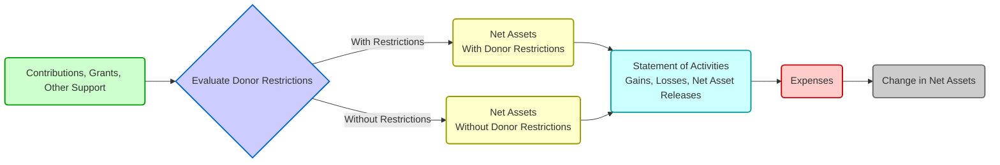

## 4.3 Statement of Activities (Classification of Revenues, Expenses, Support)

The Statement of Activities is one of the key financial statements prepared by nongovernmental not-for-profit (NFP) entities under U.S. GAAP. This statement is central to conveying how a not-for-profit acquires resources (revenues, support) and expends those resources (expenses) for mission-oriented programs and other necessary functions. In this section, we delve deep into how revenues, support, and expenses are classified and presented, illuminating best practices and common pitfalls. You will also discover illustrative examples, diagrams, and references to authoritative guidance under FASB Accounting Standards Codification (ASC) 958.

--------------------------------------------------------------------------------
  
Purposefully designed to meet the unique needs of not-for-profit organizations, the Statement of Activities demonstrates how the entity’s mission is funded and executed over a given reporting period. This is in contrast to for-profit statements, which emphasize profitability, retained earnings, and shareholder equity. Not-for-profits aim to maintain liquidity to further charitable, educational, or other philanthropic missions. Because of these unique objectives, special rules guide the classification of transactions in the Statement of Activities.

This section covers:
• How to report and classify different revenue streams (contributions, grants, and program or service revenues).  
• How support (contributions and other inflows of resources) is presented and distinguished from exchange transactions.  
• How expenses should be displayed, including the requirement to show them by function (program vs. supporting services) and by nature.  
• Best practices in note disclosures and presentation to ensure transparency.

--------------------------------------------------------------------------------

### Core Structure of the Statement of Activities

The fundamental framework of the Statement of Activities revolves around changes in net assets. For not-for-profit entities, net assets are categorized into two primary classes:  
• Net Assets Without Donor Restrictions  
• Net Assets With Donor Restrictions  

Changes in these categories result from the inflow of resources (revenues or support) and outflow through expenses. The net change ultimately impacts the total net asset balance at the end of the period. This statement bears similarities to a for-profit income statement but incorporates unique considerations specific to donations, grants, and donor restrictions.

To paint a clearer picture, consider the schematic diagram using Mermaid.js below, illustrating the logical flow of how resources move into the not-for-profit entity and how they are presented:

In this diagram, note how all inflows (contributions, grants, other support) filter through an assessment process to determine whether they possess donor-imposed restrictions. If so, they first increase “Net Assets With Donor Restrictions”. Over time, as the purpose or time restriction is met, the resources are reclassified (or released) to “Net Assets Without Donor Restrictions,” disclosed in the statement as “net assets released from restrictions.” Eventually, the resources are used for expenses that meet the organization’s mission. This cyclical flow continues each reporting period.

--------------------------------------------------------------------------------

### Classification of Revenues and Other Support

Not-for-profit entities may receive funding from various sources. Understanding how to classify and present these funds is essential for providing an accurate depiction of financial performance. The key classifications typically include:

• Contributions (including pledges)  
• Grants and Contracts  
• Program or Service Revenues (Exchange Transactions)  
• Other Income (e.g., investment income, special events proceeds)

Let’s break down each category in detail.

#### Contributions
A contribution is defined as an unconditional transfer of cash or other assets (or a settlement or cancellation of liabilities) to a not-for-profit entity in a voluntary, nonreciprocal transaction. Examples include donations from individuals, corporations, or foundations. Contributions, which fall under FASB ASC 958-605, are reported as increases in either net assets with or without donor restrictions, depending on donor stipulations. Key considerations include:

• Donor-Imposed Restrictions: Contributions may contain restrictions on use, purpose, or time. If so, the funds should be recorded initially as increases in “Net Assets With Donor Restrictions.” Once the restriction is satisfied, a reclassification (net asset release) is recognized in the statement of activities, transferring the funds to “Net Assets Without Donor Restrictions.”  
• Conditional Contributions: Gifts that include barriers or conditions (e.g., matching requirements or performance-related goals) are not recognized as revenue or support until the condition is substantially met.  
• Unconditional Pledges: These are recognized in the period in which the pledge is made, at fair value. If collection is deferred, a discount to present value might be necessary.  

For example, imagine a donor pledges $100,000 for the specific purpose of funding a new community program, with no further conditions. This inflow is recorded initially as an increase in Net Assets With Donor Restrictions. When the not-for-profit launches the program or meets the budget requirement to use those funds for that specified purpose, the $100,000 is released from restriction and recognized as an increase (or reduction of net assets with donor restrictions and an increase in net assets without donor restrictions).

#### Grants and Contracts
Many not-for-profits receive grants or contracts from governmental agencies or private foundations. The classification often depends on whether the transaction is deemed a “contribution” or an “exchange transaction.” Grants or contracts may be:

• Exchange Transactions: If the grantor or contracting entity receives commensurate value in return for the resources provided (e.g., a direct benefit of goods or services at a fair value), it is recorded as earned revenue.  
• Nonexchange Transactions (i.e., contributions): If the resource provider does not receive commensurate value, then the transaction represents a contribution recorded similarly to donor gifts.  

It is crucial to carefully evaluate the terms of the grant or contract: federal or state grants for providing specific services to the public can be either conditional contributions or exchange transactions. The classification determines whether you record the inflow immediately (in the case of unconditional contributions) or recognize income over time as performance obligations are satisfied (in the case of exchange transactions under ASC 606 or conditional contributions under ASC 958-605).

#### Program and Service Revenues
Program or service revenues stem from exchange transactions in which the not-for-profit entity provides goods or services to beneficiaries or customers who pay directly for them. Common examples include:

• Tuition and fees at educational institutions.  
• Patient service revenue in healthcare.  
• Membership fees with direct benefits.  
• Tickets to cultural events or museum admissions (if the transaction is deemed an exchange).

Revenues from these activities typically increase “Net Assets Without Donor Restrictions,” because they do not involve donor-imposed restrictions. If a not-for-profit charges a fee for a program that is partially subsidized by grants, the fee portion should be recognized as program revenue earned, while the grant portion may be considered a contribution (potentially restricted or unrestricted).

#### Special Events and Auxiliary Activities
Not-for-profit entities frequently host fundraising events such as galas, auctions, or charity runs. Revenue generated from such special events can be categorized into:

• Contribution Component: If attendees pay an amount above the fair value of any direct benefit received (e.g., the ticket price exceeding the approximate value of the meal), the excess is recorded as contribution revenue.  
• Exchange Component: The portion equivalent to the fair value of what donors receive (e.g., dinner, entertainment) is recorded as exchange revenue.  

Allocating proceeds between these two components is crucial for clear financial reporting.

--------------------------------------------------------------------------------

### Classification of Expenses

For not-for-profits, expenses should be reported as decreases in net assets without donor restrictions (unless specifically allowed to be offset against a restricted net asset class, which is rare). Expenses generally fall into two main categories: program services and supporting services. However, FASB requires reporting of both functional and natural classifications. Typically, not-for-profits present natural expenses in the notes or a supplementary statement (Statement of Functional Expenses), while the Statement of Activities displays the functional expense categories and net changes in net assets.

#### Functional Classifications
• Program Services: These are expenses directly associated with carrying out the primary mission, programs, and services for the beneficiaries. For instance, a healthcare charity’s clinical outreach, an art museum’s exhibition costs, or a homeless shelter’s food and housing programs.  
• Supporting Services: These include:  
  – Management and General: Administrative functions necessary for organizational oversight, budgeting, recordkeeping, and compliance.  
  – Fundraising: Activities undertaken to raise resources, such as direct mail campaigns, donor solicitations, marketing for financial support, and special event fundraising expenses.

#### Natural Classifications
On the other hand, expenses must also be broken down by their natural classification (the type of expense). Common natural classifications include:  
• Salaries and Wages  
• Rent and Occupancy  
• Utilities  
• Depreciation and Amortization  
• Professional Fees  
• Supplies  
• Travel and Entertainment  
• Interest Expense  

These expenses should be allocated to the function (program vs. management and general vs. fundraising) based on how they benefit each area. Not-for-profit entities must apply reasonable allocation methodologies to ensure accurate representation of program costs versus supporting services.

To illustrate, an organization that pays $20,000 in rent might allocate $15,000 to programs, $3,500 to management, and $1,500 to fundraising, reflecting the space usage by each function.

--------------------------------------------------------------------------------

### Presentation of Revenues, Expenses, and Support

Below is a simplified example of a Statement of Activities for a not-for-profit entity with both net assets without donor restrictions and with donor restrictions:

--------------------------------------------------------------------------------
  
Statement of Activities (Simplified Example)  
For the Year Ended December 31, 20XX  

(Amounts in thousands)
  
                         Without Donor    With Donor      Total  
                         Restrictions     Restrictions       
----------------------------------------------------------------
Revenues & Support
  Contributions                  $ 500         $ 300        $ 800  
  Grants & Contracts              400           200          600  
  Program Fees                    250             –          250  
  Investment Income                50            20           70  
----------------------------------------------------------------
Total Revenues & Support        1,200           520        1,720  

Net Assets Released from
 Restrictions                     350          (350)           –  
----------------------------------------------------------------
Total Revenues, Support,
 and Releases                   1,550           170        1,720  

Expenses
  Program Services              1,100             –        1,100  
  Management & General            200             –          200  
  Fundraising                     100             –          100  
----------------------------------------------------------------
Total Expenses                  1,400             –        1,400  

Change in Net Assets             150           170          320  
Beginning Net Assets             700           250          950  
----------------------------------------------------------------
Ending Net Assets               $850          $420       $1,270  
----------------------------------------------------------------

In this example:  
• Contributions of $800,000 are divided between $500,000 without donor restrictions and $300,000 with donor restrictions.  
• Net assets with donor restrictions release $350,000 once conditions or purposes are fulfilled, resulting in an equivalent reduction in Net Assets With Donor Restrictions and an increase to Net Assets Without Donor Restrictions.  
• Expenses are only shown in the column for net assets without donor restrictions, which underscores that expenses use resources from the unrestricted pool (or effectively released restricted funds).  

--------------------------------------------------------------------------------

### Special Topic: Transfers Between Net Asset Classes

When a donor restriction is satisfied—e.g., the not-for-profit completes a program funded by a restricted grant—the entity “releases” these net assets to the without donor restrictions column. The Statement of Activities typically shows this activity under “Net Assets Released from Restrictions.” The total net effect on the organization’s net assets might remain the same, but it alters the composition between restricted and unrestricted resources.

Additionally, if a donor changes the restriction or if board designations reclassify certain amounts (a board-imposed designation is not the same as a donor restriction, but the board can set aside funds for a specific reserve), these flows should be clearly disclosed. Transparency around such transfers is crucial to convey whether the restrictions are donor-imposed or internally designated.

--------------------------------------------------------------------------------

### Functional Expense Reporting

Not-for-profit organizations are also required to present a statement of functional expenses or to include a matrix of natural and functional expenses in the notes. This requirement fosters transparency, allowing donors, regulators, and other users to see where money is spent in terms of both type and purpose. The matrix typically has columns for program services, management, and fundraising, and rows for natural classifications such as salaries, benefits, rent, etc.

By requiring both functional and natural expense reporting, standard-setters seek to highlight the extent to which the not-for-profit carries out its mission relative to the administrative and fundraising costs. This provides an essential measure of the efficiency and stewardship of the entity.

--------------------------------------------------------------------------------

### Common Pitfalls and Best Practices

1. Misclassification of Restriction vs. Unrestricted Funds: Errors occur when staff incorrectly record restricted gifts in the without donor restriction column. This compromises the financial portrayal of resources available for general use.  
2. Failing to Recognize Conditional Contributions: Some not-for-profits prematurely recognize conditional contributions as revenue. In reality, no revenue should be recorded until the condition is substantially met.  
3. Overlooking Matching Components in Grants and Contracts: The not-for-profit must carefully read the grant or contract documents to determine if the funds are conditional or if they represent exchange transactions under ASC 606.  
4. Improper Allocation of Expenses: Organizations occasionally allocate too much overhead cost to programs (to demonstrate a high “program services ratio”) or fail to apply a consistent allocation methodology.  
5. Inadequate Disclosure of Net Asset Releases: Transparent documentation and note disclosures about how restrictions have been met is a best practice.  

#### Best Practices
• Maintain thorough documentation on donor intent, including purpose, time, and condition stipulations.  
• Establish robust policies for identifying and releasing restrictions, ensuring timely updates to the accounting system and board oversight.  
• Use a clear and justifiable allocation methodology for expenses based on time, square footage, or other reasonable measures.  
• Provide plain-language disclosures that outline the nature of restrictions and how resources were used.  
• Review FASB ASC 958 guidance regularly to keep up with evolving standards and best practices.  

--------------------------------------------------------------------------------

### Real-World Example

Consider a local community health center that provides discounted or free medical services to low-income residents. The center receives the following support:

• A $200,000 annual grant from a healthcare foundation that requires the center to provide a minimum of 2,000 free patient screenings each year. The grant is conditional if the free screenings are not performed. Initially, the health center does not recognize the full $200,000. Each month, as the center completes a portion of the screenings, it recognizes that portion of the grant revenue and records it in the Statement of Activities (Net Assets Without Donor Restrictions).  
• Individual donor contributions totaling $100,000, half of which is restricted to purchasing medical equipment. The half that is restricted remains with donor restrictions until the center actually purchases equipment.  
• Program service revenue of $150,000 from patients who can pay. This is recognized as exchange revenue under ASC 606 because the center provides healthcare services in exchange for the fees.  
• Fundraising event proceeds of $50,000. Fair value of the dinner provided is $10,000, so $40,000 is classified as contribution revenue, and $10,000 is recognized as exchange revenue.  

At year-end, the center will present a Statement of Activities reflecting these inflows by net asset category, releasing the restricted net assets when the program’s or funder’s conditions are met.

--------------------------------------------------------------------------------

### Putting It All Together

The Statement of Activities for a not-for-profit entity is far more than a simple income statement. It reflects the interplay of donor-intended resources, operational expenditures, and mission-centric activities. By clearly classifying and presenting contributions, grants, program revenues, and related expenses, not-for-profit organizations can enhance transparency, strengthen donor confidence, and maintain compliance with U.S. GAAP.  

A robust understanding of these nuances—supported by practical examples and thoroughly documented policies—empowers not-for-profit management, board members, and stakeholders to fulfill their missions responsibly and effectively.

--------------------------------------------------------------------------------

## Master the Statement of Activities: NFP Revenue and Expense Quiz



### Contributions to a not-for-profit entity are recorded in the Statement of Activities when:
- [x] The not-for-profit receives an unconditional promise or transfer of assets.
- [ ] The donor verbally indicates the intent to donate in the future.
- [ ] Board members vote to accept the donation, regardless of donor intent.
- [ ] They are contingent on certain events that have yet to occur.

> **Explanation:** Contributions are recognized as revenue when they are unconditional or when the not-for-profit obtains control of the asset. Conditional promises are not recognized until conditions are substantially met.

### When a foundation provides funds contingent upon the not-for-profit meeting specific performance barriers, those funds are considered:
- [x] Conditional contributions.
- [ ] Unrestricted contributions.
- [ ] Without donor restrictions.
- [ ] Program revenue.

> **Explanation:** Funds that require performance barriers to be met before the resource is available are classified as conditional contributions; they are not recognized as revenue until conditions are met.

### The main difference between net assets with donor restrictions and net assets without donor restrictions is:
- [x] The presence or absence of explicit donor-imposed stipulations on the use of the assets.
- [ ] The amount of money involved in the contributions.
- [ ] The type of transaction affecting the net assets.
- [ ] Whether they are used for salaries.

> **Explanation:** When a donor imposes time or purpose stipulations, the resource is classified as net assets with donor restrictions. Otherwise, the net assets are without donor restrictions.

### In the Statement of Activities for a not-for-profit, all expenses are shown:
- [x] As decreases in net assets without donor restrictions.
- [ ] Within their respective net asset class, either with donor restrictions or without donor restrictions.
- [ ] Only if the not-for-profit chooses to record them.
- [ ] Interchangeably across both net asset classes.

> **Explanation:** Expenses reduce net assets without donor restrictions unless a specific accounting treatment allows offset against restricted funds. Generally, once restrictions are satisfied, resources are released and then used for expenses.

### Program service revenues:
- [x] Are exchanges of goods or services for payment, recognized in net assets without donor restrictions.
- [ ] Are always classified in net assets with donor restrictions.
- [x] May be applicable when customers or beneficiaries pay for services received.
- [ ] Cannot be reported in not-for-profit statements.

> **Explanation:** Program revenue arises from exchange transactions (e.g., tuition, patient fees) and is typically recognized in net assets without donor restrictions unless a restriction is imposed by the payor.

### Included in a not-for-profit’s Statement of Activities is:
- [x] The total change in net assets for the period.
- [ ] Retained earnings for the period.
- [ ] Stockholders’ equity transactions.
- [ ] A separate statement of realized gains and losses only.

> **Explanation:** Not-for-profit entities track changes in net assets (both with and without restrictions), rather than retained earnings or equity.

### Special event proceeds that exceed the direct benefit provided to the attendee:
- [x] Must be split between the fair value of the benefit and contribution revenue.
- [ ] Are recorded entirely as contribution revenue.
- [x] Might be partially treated as exchange revenue.
- [ ] Are always recognized as program income.

> **Explanation:** Special event revenue typically has two components: the exchange portion for direct benefits (e.g., meals, entertainment) and a contribution portion for any excess payment.

### Net assets released from restrictions:
- [x] Decrease net assets with donor restrictions and increase net assets without donor restrictions.
- [ ] Have no effect on net asset balances.
- [ ] Only occur when the restriction was improperly recorded.
- [ ] Are recorded as losses in the notes.

> **Explanation:** Once a restriction is fulfilled, the related net assets are reclassified from “with donor restrictions” to “without donor restrictions.”

### One key objective of disclosing expenses by nature and function is:
- [x] Enhancing transparency on how resources are used to achieve the not-for-profit’s mission.
- [ ] Eliminating management and general expenses.
- [ ] Reducing the burden of compliance.
- [ ] Displaying investments in operations to potential creditors only.

> **Explanation:** By showing functional and natural classifications, financial statement users gain insight into expense allocation among program, management/general, and fundraising activities, furthering transparency.

### A correct statement regarding a not-for-profit’s Statement of Activities is:
- [x] True
- [ ] False

> **Explanation:** Even though the format may vary, the overarching requirement is to present revenues, expenses, and changes in net assets, distinguishing between net assets with and without donor restrictions.



--------------------------------------------------------------------------------

## For Additional Practice and Deeper Preparation

[**FAR CPA Hardest Mock Exams: In-Depth & Clear Explanations**](https://www.udemy.com/course/far-cpa-mock-exams/?referralCode=F88050F8D5C76764F6BD)

Financial Accounting and Reporting (FAR) CPA Mocks: 6 Full (1,500 Qs), Harder Than Real! In-Depth & Clear. Crush With Confidence!

- Tackle full-length mock exams designed to mirror real FAR questions.  
- Refine your exam-day strategies with detailed, step-by-step solutions for every scenario.  
- Explore in-depth rationales that reinforce higher-level concepts, giving you an edge on test day.  
- Boost confidence and minimize anxiety by mastering every corner of the FAR blueprint.  
- Perfect for those seeking exceptionally hard mocks and real-world readiness.

_Disclaimer: This course is not endorsed by or affiliated with the AICPA, NASBA, or any official CPA Examination authority. All content is for educational and preparatory purposes only._
