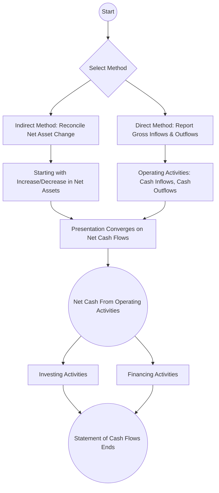

## 4.4 Statement of Cash Flows (Direct vs. Indirect Methods)

The statement of cash flows is a crucial component of financial reporting for all types of organizations, including not-for-profit entities. It provides transparency into how an entity generates and utilizes cash, offering insights into operational effectiveness, liquidity, and adaptability. For not-for-profit (NFP) organizations, the statement of cash flows holds particular importance due to unique funding streams, restricted resources, and the critical role of donor contributions and pledges. This section delves into the concepts, formats, and intricacies of the statement of cash flows for NFPs, with special attention to how pledges and contributions are handled within operating, investing, and financing activities. We also highlight the fundamental differences between the direct and indirect methods, explore best practices, and present illustrative examples to strengthen your understanding.

--------------------------------------------------------------------------------
## Importance of the Statement of Cash Flows for NFPs

Not-for-profit entities typically rely on various revenue sources, including contributions, grants, donations, and program service fees. Because many of these revenue streams come with donor-imposed restrictions or performance requirements, tracking changes in cash becomes vital. The statement of cash flows:

• Helps stakeholders evaluate the NFP’s ability to continue operations.  
• Provides insight into how effectively the organization manages resources and meets its program-related obligations.  
• Highlights both unrestricted and restricted cash flows, essential to donors who want assurance that funds are used appropriately.  
• Improves comparability of information across different NFPs.  

In accordance with the Financial Accounting Standards Board (FASB) guidance, NFPs must prepare a statement of cash flows that presents cash inflows and outflows categorized into three sections: operating, investing, and financing. While these three categories mirror those used in for-profit entities, certain classification nuances exist in the not-for-profit realm—particularly regarding donor-imposed restrictions and how contributions and pledges are reported.

--------------------------------------------------------------------------------
## Operating, Investing, and Financing Activities in NFPs

### Operating Activities
Operating activities reflect the primary mission-related programs, services, and supporting functions (e.g., administration, fundraising) of the not-for-profit. In an NFP, operating activities usually include:

• Cash receipts from tuition and fees for educational institutions.  
• Cash receipts from program service fees, membership dues, or contributions that are not restricted for long-term purposes.  
• Cash payments for operating expenses such as salaries, rent, utilities, and supplies.  
• Cash inflows and outflows related to interest and dividends received, unless restricted for long-term purposes.  

Importantly, it is common for NFPs to receive pledges—promises from donors to give a specified amount in the future. Pledges expected to be collected in the current period or in the near term are generally recognized as receivables, and once received in cash, the proceeds may be reported in the operating section if they are without donor restrictions or intended for general use. If, however, donor restrictions direct the pledged amounts to be used for endowments or acquisition of long-term assets, the ultimate classification of the cash inflow changes, potentially placing such amounts in financing or investing activities.

### Investing Activities
Investing activities consist of purchases and disposals of long-term assets such as property, plant, and equipment (PP&E), as well as investments in debt or equity securities not classified as cash equivalents. Common examples in the not-for-profit context include:

• Buying or selling land, buildings, or equipment used in programmatic or supporting activities.  
• Purchasing or disposing of investment securities and endowment funds.  
• Transaction costs associated with making or liquidating capital investments.  

One unique twist for NFPs is that certain restricted donations intended for constructing a new building or buying equipment might first appear as inflows within financing activities (because they are contributions with a long-term purpose), but the actual spending of those funds (e.g., acquiring the building) would then show up in the investing section. As a result, it is possible to have closely linked inflows presented in the financing section and outflows in the investing section.

### Financing Activities
Financing activities present principals received from and returned to resource providers in a manner akin to equity or debt transactions in for-profit entities. In an NFP, financing can include:

• Proceeds from issuing short-term and long-term debt.  
• Repayments of principal on borrowings.  
• Cash contributions restricted for the acquisition of long-term assets or restricted for an endowment.  

Unlike for-profit companies that classify distributions to owners as financing outflows, a not-for-profit may display certain donor-imposed actions (such as endowment withdrawals) differently, depending on whether those withdrawals represent returns on investment or principal distributions. Additionally, investment income restricted for reinvestment in a permanently restricted endowment (for older standards) or in net assets with donor restrictions (per updated FASB guidance) falls under the financing section once received in cash, given that the donor specification aligns with a financing purpose.

--------------------------------------------------------------------------------
## Direct Method vs. Indirect Method

Organizations can prepare the statement of cash flows using either the direct method or the indirect method. While the ultimate net cash provided (or used) by operating activities remains the same under both methods, how this figure is derived and displayed differs.

### Direct Method Overview
Under the direct method, cash inflows and outflows related to operating activities are presented explicitly based on major classes of gross cash receipts and cash payments. For NFPs, this might look like:

• “Cash receipts from contributions without donor restrictions used for operations.”  
• “Cash receipts from tuition/membership/program fees.”  
• “Cash payments to employees for salaries and benefits.”  
• “Cash payments for supplies and program-related expenses.”  

By offering a clear breakdown of inflows and outflows, the direct method provides a more transparent view of how cash is generated and used, which can be particularly relevant for donors and grantors overseeing specific programmatic uses of funds. Despite its benefits in clarity, the direct method can require significant effort in record-keeping because you need to track the actual cash basis amounts for each operational line item.

#### Example of NFP Direct Method

Below is a simplified illustration of how an NFP might present the operating section of the statement of cash flows under the direct method:

--------------------------------------------------------------------------------

```
Cash Flows from Operating Activities (Direct Method):

  Cash received from donations (unrestricted)                $375,000
  Cash received from grants and contracts                     200,000
  Cash received from program fees and service revenues        150,000
  Dividends and interest received                              10,000
  Cash payments to employees and suppliers                  (600,000)
  Cash payments for interest                                   (5,000)
  Other operating payments                                    (20,000)
                                                            ---------
  Net Cash Provided by Operating Activities                  $110,000
```

--------------------------------------------------------------------------------

### Indirect Method Overview
Under the indirect method, which is more commonly used in practice, the statement of cash flows adjusts the change in net assets (i.e., the not-for-profit analog to “net income” in a for-profit) for non-cash activities, deferrals, and accruals, reconciling back to net cash provided (or used) by operating activities. The sections for investing and financing activities look the same under both methods, but the difference lies in how operating activities are derived.

A typical layout of the operating section under the indirect method starts with the net change in net assets (either total net assets or net assets without donor restrictions, depending on the organization’s preference for disclosure) and then includes adjustments for:

• Depreciation, amortization, and similar non-cash expenses.  
• Gains or losses on disposals of fixed assets.  
• Non-cash donations such as in-kind contributions.  
• Changes in receivables, payables, and other working capital accounts.  
• Recognition of uncollectible pledge allowances.  

#### Example of NFP Indirect Method

Below is a simplified illustration of how an NFP might present the operating section using the indirect method:

--------------------------------------------------------------------------------

```
Cash Flows from Operating Activities (Indirect Method):

  Change in net assets (without donor restrictions)          $ 90,000
  Adjustments to reconcile changes in net assets 
   to net cash provided by operating activities:
     Depreciation expense                      $ 30,000
     Decrease in pledges receivable              10,000
     Increase in accounts payable                20,000
     Decrease in grants receivable               15,000
     Non-cash contribution (equipment)          (25,000)
     Net realized gain on sale of investments    (5,000)
                                               --------
  Total adjustments                                             45,000
                                                            ---------
  Net Cash Provided by Operating Activities                  $135,000
```

--------------------------------------------------------------------------------

### Required Reconciliation
FASB dictates that if an organization opts for the direct method, it must also include a reconciliation of the change in net assets to net cash provided (or used) by operating activities. This reconciliation is essentially the indirect method’s line items. An NFP that consistently chooses to present the direct method must be prepared to furnish both sets of information, though separate statements are not required—an accompanying schedule typically suffices.

--------------------------------------------------------------------------------
## Unique Considerations for NFPs: Pledges & Contributions

### Pledges
Pledges—promises of future gifts—are a distinguishing feature of NFP accounting. Depending on whether the donor imposes conditions or restrictions, an NFP may need to record the pledge receivable when the promise is received, and later classify cash receipts when the pledge is collected. The correct classification in the statement of cash flows often hinges on the pledge’s intended purpose:

• Pledges without donor restrictions for general operations → typically operating activities upon receipt.  
• Pledges intended for building a new facility or acquiring a long-term asset → typically financing inflows upon receipt.  
• Pledges restricted for permanent endowments → typically financing inflows upon receipt.

However, if the donor specifically dictates that the pledge must remain restricted until a future period, the timing of recognition and classification of the ultimate receipt can get more complex. Depending on compliance with the donor stipulations, an NFP may reflect the cash inflow in the financing section or, in rare cases, reclassify amounts between net assets categories if the restriction lapses.

### Contributions
Contributions, both restricted and unrestricted, are the lifeblood of many NFPs, but their classification in the statement of cash flows is not always straightforward:

• Unrestricted contributions available for immediate use in operations → operating inflows.  
• Contributions explicitly restricted by the donor for the purchase or construction of long-term assets → financing inflows.  
• Endowment contributions that must remain in perpetuity → financing inflows.  
• Investment earnings on restricted endowments that can be spent for current operations → operating inflows (once recognized and available for use).  

In practice, clarity and thorough documentation of donor instructions are paramount, as these details drive the clause-by-clause classification on the statement of cash flows.  

--------------------------------------------------------------------------------
## Diagram of Direct vs. Indirect Method (NFP Context)

Below is a simplified Mermaid diagram illustrating the flow of information in preparing a statement of cash flows under the direct and indirect methods for a not-for-profit organization:



• Both the direct and indirect methods ultimately arrive at the same net cash flow from operating activities.  
• The main difference lies in how the operating section is computed and presented.  
• Investing and financing sections are unaffected by the choice of method.  

--------------------------------------------------------------------------------
## Best Practices and Common Pitfalls

### Best Practices
• Maintain Clear Documentation: Especially for donor-restricted contributions and pledges, maintain records detailing donor intent to properly classify inflows and outflows.  
• Consistent Implementation: If you choose the direct method, be consistent from period to period, and ensure you have thorough data to prepare the required reconciliation.  
• Educate Stakeholders: Because many donors and board members may be less familiar with financial statements, provide explanatory notes describing how restricted contributions and pledges affect cash flows.  
• Align With Statement of Activities Disclosures: Present an integrated view of cash flow information that reconciles with net assets without donor restrictions, net assets with donor restrictions, and total net assets.

### Common Pitfalls
• Misclassification of Restricted Cash Flows: Often, NFPs incorrectly lump restricted contributions into operating activities when they should appear in financing.  
• Overlooking Conditional Pledges: A conditional pledge might not be recognized until the condition is substantially met. If incorrectly recognized, you risk misstating both net assets and the cash flow statement.  
• Non-cash Transactions Omitted: Failing to adjust for in-kind donations or this period’s portion of amortized pledge discounts can distort operating activity reconciliation.  
• Omitting Separate Disclosure: If using the direct method, organizations sometimes forget to include the required reconciliation, resulting in incomplete financial statements.

--------------------------------------------------------------------------------
## Illustrative Case Study

Consider Hopeful Minds, a not-for-profit focused on mental health awareness:

• At the start of the year, Hopeful Minds received pledges of $100,000 from various donors. Half of these pledges (i.e., $50,000) were unconditional and intended for general operations, while $50,000 was restricted for establishing a new community outreach center.  
• During the year, the NFP collects $90,000 in cash from these pledges: $40,000 for operations, $50,000 for the outreach center.  
• Meanwhile, Hopeful Minds secures a bank loan of $250,000 for building renovations. They also invest $80,000 in new furniture for the outreach center.  
• At year-end, the journal entries show an increase in net assets without donor restrictions by $30,000 and an increase in net assets with donor restrictions by $50,000.

Here is how the relevant transactions might appear in an indirect-method statement of cash flows:

--------------------------------------------------------------------------------

Operating Activities  
• Start with the change in net assets without donor restrictions (+$30,000).  
• Add back depreciation (for simplicity, assume $10,000).  
• Adjust for changes in pledges receivable. If the opening receivable was $50,000 for operations, and you collected $40,000, the decrease in receivables is $40,000, but $10,000 remains.  
• Other routine changes in payables, accruals, etc.

Investing Activities  
• Purchase of furniture ($80,000) is an outflow.  

Financing Activities  
• Receipt of the restricted pledge ($50,000) for the outreach center, if recognized as “cash restricted for capital project,” becomes a financing inflow.  
• Proceeds from the bank loan ($250,000) is a financing inflow.  

By grouping these transactions in the appropriate sections, stakeholders can see precisely how the organization balances day-to-day obligations, invests in long-term objectives, and finances expansions through a combination of restricted support and debt.

--------------------------------------------------------------------------------
## Practical Tips for Implementation

• Coordinate with Fundraising and Program Teams: Collaboration ensures finance staff knows about restrictions or conditions when pledges are made, preventing last-minute corrections.  
• Track Pledges Separately: Maintain a pledge register with fields for donor restrictions, conditions, collection timelines, and relevant contact information.  
• Use Specialized Software: Accounting systems designed for NFPs can facilitate the classification of pledges and restricted contributions, automating many aspects of the statement of cash flows.  
• Regularly Review Donor Agreements: Especially for multi-year pledges or endowment contributions, confirm that the classification approach remains consistent with the original donor’s intent.  

--------------------------------------------------------------------------------
## References and Further Reading

• FASB Accounting Standards Codification (ASC) 958-205: Presentation of Financial Statements for Not-for-Profit Entities  
• FASB ASC 230: Statement of Cash Flows  
• AICPA Audit & Accounting Guide for Not-for-Profit Entities  
• “Not-for-Profit Financial Reporting Model: Topic 958,” FASB.org  
• NACUBO (National Association of College and University Business Officers) guidelines for higher education institutions  

For deeper comprehension, consult official FASB materials or consider enrolling in specialized courses focused on not-for-profit accounting, ensuring your preparation aligns with professional best practices and up-to-date standards.

--------------------------------------------------------------------------------
## Quiz: Statement of Cash Flows for NFPs



### Which section of the statement of cash flows includes cash inflows from unrestricted, routine contributions in a not-for-profit entity?

- [x] Operating Activities
- [ ] Investing Activities
- [ ] Financing Activities
- [ ] Non-Cash Investing and Financing Transactions

> **Explanation:** Unrestricted contributions for operational use typically appear as operating cash inflows because they support the day-to-day mission of the organization.

### Which approach explicitly reports the major classes of gross cash receipts and gross cash payments in the operating section?

- [x] Direct Method
- [ ] Indirect Method
- [ ] Hybrid Method
- [ ] Consolidated Method

> **Explanation:** Under the direct method, each major category of operating cash flow (e.g., receipts from customers, payments to suppliers) is shown, whereas the indirect method starts with net income (or change in net assets) and adjusts for non-cash items and working capital changes.

### A donor contributes $75,000 specifically to help a not-for-profit purchase new computers for administrative staff. In which section should this cash inflow appear?

- [ ] Operating Activities
- [ ] Investing Activities
- [x] Financing Activities
- [ ] Non-Cash Investing and Financing Transactions

> **Explanation:** When a contribution is restricted by the donor for the acquisition of a long-term asset, the cash inflow is generally classified under financing activities.

### Under the indirect method for NFPs, which of the following adjustments is typically added to the change in net assets to find net cash provided by operating activities?

- [x] Depreciation expense
- [ ] Restricted contributions for endowment
- [ ] Cash proceeds from refinancing
- [ ] Purchase of equipment

> **Explanation:** Depreciation is a non-cash expense and is added back to the change in net assets as part of the reconciliation to convert that change into operating cash flow.

### In not-for-profit accounting, how are pledges for the construction of a new building generally categorized on the statement of cash flows upon receipt?

- [ ] Operating activities
- [x] Financing activities
- [ ] Investing activities
- [ ] Non-Cash Investing and Financing Transactions

> **Explanation:** Pledges restricted for capital projects (e.g., new building construction) are typically treated as financing activities because they relate to the acquisition of long-term assets.

### What is one requirement for an NFP if it opts to present the statement of cash flows using the direct method?

- [x] It must also provide a reconciliation of the change in net assets to net cash from operating activities.
- [ ] It must exclude pledges receivable from its disclosures.
- [ ] It must include an “Analysis of Restricted Funds” in the footnotes.
- [ ] It cannot present investing and financing activities in the same statement.

> **Explanation:** FASB ASC 230 requires a reconciliation of net income (or net assets) to net cash from operating activities if the direct method is used.

### What is the primary impact of donor-imposed restrictions on classifying cash inflows in a statement of cash flows for an NFP?

- [x] They often move cash inflows from operating to financing activities.
- [ ] They have no impact on classification.
- [ ] They convert all cash inflows into investing activities.
- [ ] They must be reported as non-cash transactions.

> **Explanation:** Donor restrictions that require resources to be used for long-term purposes cause the related cash inflows to be classified in financing rather than operating.

### Why might a not-for-profit track pledges separately, rather than combining them with regular contributions?

- [x] To differentiate conditional from unconditional promises and recognize them properly.
- [ ] To keep them off the financial statements.
- [ ] To simplify the budgeting process.
- [ ] Because pledges are only recognized when cash is received.

> **Explanation:** Pledges can be conditional or unconditional, and each carries distinct accounting implications. Tracking them separately aids in correct recognition and ensures compliance with restrictions.

### Which of the following transactions would you expect to see in the investing section of an NFP’s statement of cash flows?

- [x] Purchase or sale of long-term investments
- [ ] Receipt of unrestricted donations
- [ ] Payment of short-term operating expenses
- [ ] Receipt of grants restricted to future operating periods

> **Explanation:** The investing section captures long-term asset activities, including the purchase or sale of securities and property, plant, or equipment.

### A conditional pledge is not recognized as revenue until the condition is met. If this condition is met and the cash is intended for general operations, in which section is this cash reported when received?

- [x] Operating Activities
- [ ] Financing Activities
- [ ] Investing Activities
- [ ] Non-Cash Transactions

> **Explanation:** Once the condition is met and the pledge becomes unconditional, cash received that is unrestricted (general operations) is categorized under operating activities.



--------------------------------------------------------------------------------

## For Additional Practice and Deeper Preparation

**[FAR CPA Hardest Mock Exams: In-Depth & Clear Explanations](https://www.udemy.com/course/far-cpa-mock-exams/?referralCode=F88050F8D5C76764F6BD)**  

**Financial Accounting and Reporting (FAR) CPA Mocks:** 6 Full (1,500 Qs), Harder Than Real! In-Depth & Clear. Crush With Confidence!  

- Tackle full-length mock exams designed to mirror real FAR questions.  
- Refine your exam-day strategies with detailed, step-by-step solutions for every scenario.  
- Explore in-depth rationales that reinforce higher-level concepts, giving you an edge on test day.  
- Boost confidence and minimize anxiety by mastering every corner of the FAR blueprint.  
- Perfect for those seeking exceptionally hard mocks and real-world readiness.  

_Disclaimer: This course is not endorsed by or affiliated with the AICPA, NASBA, or any official CPA Examination authority. All content is for educational and preparatory purposes only._
