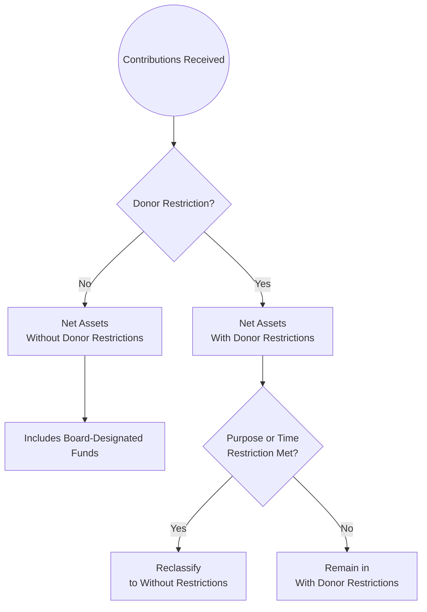

## 4.6 Disclosures and Special Topics in Not-for-Profit Accounting

When preparing financial statements for not-for-profit (NFP) entities, a range of specialized disclosures and advanced considerations come into play. Unlike for-profit entities, NFPs often rely heavily on donor contributions, grants, and endowment funds, which bring about unique financial reporting matters. This chapter will review important disclosure requirements and examine specialized topics such as endowment funds, underwater endowments, donor-imposed restrictions, and split-interest agreements. By the end of this section, you should be able to identify and apply the relevant guidance and best practices in these areas, which appear frequently on the CPA FAR Examination and in real-life not-for-profit accounting.

-------------------------------------------------------------------------------
### Importance of Disclosures in Not-for-Profit Financial Reporting

Not-for-profit organizations serve a mission that extends beyond the pursuit of net income or shareholder returns, and their stakeholders—such as donors, grantors, and the public—have a keen interest in how funds are managed and used. As a result, transparency and detail in financial statements are of the utmost importance. Proper disclosures help:

• Demonstrate accountability for resources entrusted to the organization.  
• Provide clarity regarding the use of donor-restricted and board-designated funds.  
• Support stewardship by highlighting policies, methods, and objectives associated with managing contributions.  
• Comply with relevant accounting standards (ASC 958) and ensure best practices are followed.

In Chapters 4.1 through 4.5, we covered the fundamental financial statements for NFPs—Statement of Financial Position, Statement of Activities, Statement of Cash Flows, and Statement of Functional Expenses. This section provides a deeper exploration of certain topics that require tailored disclosure and complex judgments.

-------------------------------------------------------------------------------
### Key Disclosure Areas and Advanced Topics

Below are the major disclosure areas relevant to not-for-profit entities. While donor restrictions and endowment funds receive much attention, additional considerations such as underwater endowments and split-interest agreements necessitate nuanced disclosures.

#### Endowment Funds

An endowment fund represents resources donated with the intention that the principal be maintained in perpetuity (or for a specified period) while the income generated from investment of the donated amount may be used according to donor stipulations. Endowment funds can be established for scholarships, research, general operating support, or other designated purposes.

##### Endowment Types

• True (Permanent) Endowment: Permanently restricted by donors so that the principal of the gift is never spent. Only investment returns may be available for the not-for-profit’s use, typically as dictated by the donor or the organization’s internal spending policy.  
• Term Endowment: Donor-restricted for a specified period of time. After the term ends, the assets may become available for use without restriction.  
• Board-Designated Endowment (Quasi-Endowment): Funds set aside by the governing board, rather than by an external donor. While internally designated endowments can be reallocated by the board if needed, they function similarly to externally restricted endowments for budgeting and operational purposes.

##### Disclosure Requirements for Endowment Funds

FASB Accounting Standards Codification (ASC) 958-205 outlines disclosure requirements for endowment funds. Not-for-profit entities must disclose:

1. The organization’s interpretation of the laws under which it operates (such as the Uniform Prudent Management of Institutional Funds Act, or UPMIFA, in many U.S. states).  
2. The organization’s endowment spending policy, including how the appropriation for expenditure is determined and approved.  
3. The investment policies in place, detailing the objectives of the endowment, risk management strategies, and asset allocation goals.  
4. The composition of the endowment, typically separating donor-restricted endowments and board-designated endowments.  
5. A reconciliation of the beginning and ending endowment balances, including contributions, investment return, amounts expended, reclassifications, and ending balances by net asset class.

Below is an illustrative flowchart summarizing endowment classification for NFPs.

```mermaid
flowchart LR
    A((Endowment Gift)) --> B[Are restrictions imposed by donor?]
    B -->|Yes| C[Donor Restricted Endowment]
    B -->|No| D[Board-Designated (Quasi-Endowment)]
    C -->|Permanent or Time-based restriction| E[Permanently or Temporarily Restricted Prior to ASU 2016-14<br>With Donor Restrictions thereafter]
    D --> F[Without Donor Restrictions<br>But Internally Designated]
```

#### Underwater Endowments

An underwater endowment occurs when the fair value of an endowment fund—particularly one with donor-imposed restrictions—falls below the original gift (or required level) due to investment losses or market fluctuations. Under ASC 958-205, if an endowment becomes underwater, the entire balance of the fund remains classified in net assets **with donor restrictions**. The NFP does not move the negative portion to net assets without donor restrictions. Instead, certain specific disclosures apply:

1. The fair value of the underwater endowment.  
2. The original amount (or the amount required to be maintained by the donor or by law).  
3. The amount of any deficiencies.  
4. Any policies the organization has in place for continued appropriation when the fund is underwater, including whether it will continue distributing funds or suspend distributions until values recover.  

Underwater endowments reflect critical stewardship responsibilities. Donors and regulators often pay close attention to how the NFP manages flagship endowments to preserve principal and meet spending objectives.

##### Example: Disclosing an Underwater Endowment

Suppose an NFP receives a donation of $1,000,000 that must be invested in perpetuity, with annual income restricted for scholarships. Due to market downturns, the fair value of this endowed fund falls to $900,000. A deficiency of $100,000 between the fair value and the historical gift amount arises. The NFP’s financial statements must disclose the original amount of the gift, the fund’s current fair value, the deficiency of $100,000, and the organization’s policy on whether it continues to disburse scholarship funds or suspends them until the fair value recovers above the gift’s principal.

-------------------------------------------------------------------------------
### Donor-Imposed Restrictions

Donor restrictions significantly influence how an NFP can use contributed resources. These restrictions fall into two broad categories under ASC 958-205 (encompassing ASU 2016-14, the major update):

• **Net Assets With Donor Restrictions:** Resources restricted for a particular purpose or time period, or restricted in perpetuity (e.g., permanent endowments).  
• **Net Assets Without Donor Restrictions:** Resources that are free of donor-imposed limits. These may include board designations, which are internally imposed and can be reversed.

#### Required Disclosures for Donor-Imposed Restrictions

1. **Nature and Amounts of Restrictions:** In the notes, NFPs must detail the nature of donor restrictions and the dollar amounts associated with each significant restriction.  
2. **Policies for Managing Restricted Net Assets:** Descriptions of how the organization monitors and releases donor restrictions, including any clarifications on whether the restriction is for purpose, time, or both.  
3. **Release of Restrictions:** The statements or notes should show how and when restrictions have been satisfied. This is often done via a reclassification line item in the Statement of Activities, indicating that net assets have been “released from restrictions.”  

##### Example: Donor-Imposed Restriction Disclosure

• **Purpose Restriction:** A $500,000 donation can only be used for a capital project to build a new facility. The NFP discloses that the donor’s intention is for the gift to be spent on construction materials and related expenses. Once the facility is completed and the restriction is met, the remaining gift or unspent portion may or may not convert to without donor restrictions depending on donor instructions.  
• **Time Restriction:** A $200,000 donation is available for use only after a specified date, such as the next fiscal year. The NFP discloses the limitation on timing, the amounts subject to time restriction, and clarifies when it anticipates spending funds.

-------------------------------------------------------------------------------
### Split-Interest Agreements

A split-interest agreement is a specialized arrangement involving a donor, a not-for-profit organization, and potentially other beneficiaries. These agreements split the beneficial interests in donated assets between at least two parties. Examples include:

• Charitable Remainder Trust (CRT)  
• Charitable Lead Trust (CLT)  
• Pooled Income Funds  
• Charitable Gift Annuities

For instance, in a Charitable Remainder Trust, a donor transfers assets to a trust, giving a specified beneficiary (often the donor or someone else) an income stream for life or for a set term. At the end of that term, any remaining assets in the trust go to the NFP. In a Charitable Lead Trust, the NFP receives the income stream, and the remainder goes to another beneficiary at the end of the trust term.

#### Recognition and Measurement

The not-for-profit recognizes the present value of its interest (based on discount rates and actuarial assumptions) as a contribution (with or without donor restrictions) at the date of the agreement. Depending on the nature of the arrangement, the organization also records a liability for the obligation or the portion of the agreement that is due to the non-NFP beneficiary.

##### Key Accounting Steps

1. **Determine Fair Value of Donated Assets:** Record the donated asset(s) at fair value on the date of donation.  
2. **Compute the Present Value of the Beneficiary’s Share:** Use appropriate discount rates and actuarial life expectancies for the beneficiaries if the income stream is life-based. Recognize a liability for this share.  
3. **Compute the NFP’s Share:** Recognize the present value of what the NFP expects to receive as contribution revenue with donor restrictions if the remaining interest is restricted by the donor’s instructions.  
4. **Subsequent Adjustments:** Remeasure the liability and the net asset portion at each reporting date, with changes recognized as either contribution/reduction in contribution revenue or changes in liability.  

#### Disclosures for Split-Interest Agreements

1. **Nature and Terms:** Describe each type of split-interest agreement your NFP holds and the general terms (income or lead, lifetime or fixed term, etc.).  
2. **Significant Assumptions:** Disclose the discount rates, mortality tables, or other assumptions used to calculate present values.  
3. **Carrying Amounts of Assets and Liabilities:** Show how the assets are measured on the Statement of Financial Position, and separately disclose the allocated liability.  
4. **Changes in the Value of Split-Interest Agreements:** Communicate any changes in valuation or assumptions material to the reader’s understanding of the arrangement.  

##### Practical Example of a Charitable Remainder Trust

Jane Donor establishes a CRT with $1 million in stocks. The trust pays Jane 5% of the fair value of the trust assets each year for her lifetime, at which point the remainder goes to the NFP. Actuarial calculations indicate the present value of the NFP’s remainder interest is $600,000. Suppose:

• The trust’s assets are reported at fair value of $1 million under the NFP’s stewardship.  
• The NFP records a liability of $400,000 corresponding to the present value of Jane’s income stream.  
• The NFP also recognizes $600,000 in contribution revenue (with donor restrictions if so specified by Jane’s instructions).  

Subsequent changes in the market value of the trust’s assets or changes to life expectancy and discount rates will require the NFP to adjust the trust’s liability and the carrying amount of the NFP’s remainder interest, resulting in periodic revaluation entries.

-------------------------------------------------------------------------------
### Common Challenges and Best Practices

#### 1. Determining and Disclosing Spending Policies
For endowments, a common pitfall occurs when NFPs fail to provide sufficient detail on how they allocate or appropriate funds for use each year. **Best Practice**: Present a clear spending rate (e.g., 4% of the fund’s average market value over 12 trailing quarters) and how that rate aligns with long-term balancing of preservation vs. distribution.

#### 2. Handling Underwater Endowments
Underwater endowments can create donor relationship issues if distributions continue despite the fund’s deficiency. **Best Practice**: Adopt a written policy stating that distributions will be reduced or suspended until the fund regains its value, unless the donor has expressly permitted continued appropriation.

#### 3. Ensuring Proper Classification of Donor-Imposed Restrictions
Errors occur when NFPs inadvertently use funds with donor restrictions for general operating purposes. **Best Practice**: Maintain a robust recording system tracking each restricted contribution separately and release them only upon satisfying the donor’s intended purpose or time frame.

#### 4. Actuarial and Discount Rate Assumptions in Split-Interest Agreements
Small changes in discount rates or life expectancies can markedly shift liabilities and net asset values. **Best Practice**: Document your assumptions thoroughly and re-evaluate them at each reporting period, reflecting new information that could impact the trust’s value.

#### 5. Board-Designated vs. Donor-Imposed Restrictions
Mingling board-designated funds with donor-restricted endowments is a frequent reporting misstep. **Best Practice**: Ensure separate tracking in your accounting system for board-designated endowments. Remember that board designations can be undone or changed by future board actions, while donor restrictions cannot.

-------------------------------------------------------------------------------
### Diagram: Classification of Net Assets and Release of Restrictions

The following diagram offers a condensed visualization of how not-for-profit entities classify and release net assets based on donor-imposed restrictions or board designations:



**Diagram Explanation:**  
• Contributions flow either to net assets without donor restrictions or with donor restrictions, depending on the donor’s instructions.  
• NFPs track board-designated funds separately within net assets without donor restrictions.  
• Donor restrictions remain until the donor-imposed purpose is fulfilled or the time restriction lapses. At that point, a reclassification (commonly labeled “net assets released from restrictions”) moves those funds out of net assets with donor restrictions.

-------------------------------------------------------------------------------
### Practical Tips for Successful NFP Audits and Exam Preparation

1. **Document Everything:** Retain donor correspondences detailing intended uses and restrictions. Ensure that physically supporting documentation is consistent with any note disclosures.  
2. **Review Statutory Requirements:** Familiarize yourself with relevant state regulations if you manage endowments under UPMIFA or less common—but still applicable—governance models.  
3. **Cross-Train Staff:** Accounting personnel, development teams, and program staff should openly communicate. Many issues arise when development offices record gifts differently from the accounting department.  
4. **Regularly Update Actuarial Calculations:** For split-interest agreements, changes in discount rates or beneficiary life expectancies can quickly affect your liability schedule. Evaluate these at each reporting date.  
5. **Model Underwater Scenarios:** Conduct sensitivity analysis for investment returns. NFPs with multiple endowment funds can quickly encounter underwater scenarios after a few months of volatility.  

-------------------------------------------------------------------------------
### Real-World Illustrative Case Study

Imagine a performing arts nonprofit, “Symphony for All,” that manages multiple endowment funds totaling $8 million. Among these, there is a donor-restricted endowment of $2 million to provide music scholarships. Due to significant market downturns, the fair value of this scholarship endowment falls to $1.85 million. “Symphony for All” must now disclose that the fair value of the donor-restricted endowment is below its original gift by $150,000 and that it has a policy allowing continued spending at a reduced rate until the market recovers.

Simultaneously, the board designates $1 million out of net assets without donor restrictions to create a quasi-endowment for orchestral outreach programs. The NFP faces no legal requirement to maintain the principal in perpetuity. The board can, if needed, vote to un-designate these funds. However, in the financial statements, these quasi-endowment funds are separately reported to distinguish them from general operating net assets.

Finally, “Symphony for All” had a donor establish a charitable remainder trust under which the donor (and spouse) receive an annual annuity. The organization recognizes $600,000 as the present value of its remainder interest and $400,000 as a liability reflecting the present value of the annuity payments. In its disclosures, “Symphony for All” explains the trust arrangement, the discount rates used, and the separate classification of the trust assets on its Statement of Financial Position.

-------------------------------------------------------------------------------
### References for Further Exploration

• **FASB ASC 958, Not-for-Profit Entities** – Comprehensive guidance on classification, measurement, and disclosures for not-for-profit accounting.  
• **AICPA Audit and Accounting Guide: Not-for-Profit Entities** – Detailed discussion of best practices and illustrative examples for external reporting and audits.  
• **Uniform Prudent Management of Institutional Funds Act (UPMIFA)** – Provides legal framework for the investment, management, and spending policies for endowment funds if enacted in your state.  
• **IRS Publication 557** – Guidance for organizations seeking tax-exempt status, shedding light on compliance for charitable operations.

-------------------------------------------------------------------------------
### Conclusion

Not-for-profit financial reporting demands specialized diligence, especially when accounting for donations governed by various donor-imposed restrictions and complex endowment or split-interest arrangements. Clear, comprehensive disclosures not only satisfy regulatory requirements but also build trust with donors, regulators, and other stakeholders. By carefully tracking restrictions, maintaining strong governance policies, and remaining transparent about matters such as underwater endowments and split-interest agreements, NFPs can demonstrate robust stewardship of resources, preserve donor relationships, and uphold ethical standards.

---

## Test Your Knowledge: Endowments, Restrictions & Split-Interest Agreements



### An organization has an endowment fund that is permanently restricted by a donor. Which of the following statements is true if the fair value of the fund falls below the original gift amount?

- [x] The entire fund remains classified as net assets with donor restrictions and is disclosed as underwater.  
- [ ] The underwater portion must be reclassified to net assets without donor restrictions.  
- [ ] The underwater portion is recognized as a liability until the fair value is restored.  
- [ ] The NFP is required to liquidate securities to restore the principal immediately.  

> **Explanation:** When the fair value of a donor-restricted endowment falls below the original gift (or required level), it is known as an underwater endowment. Under ASC 958-205, the fund remains in net assets with donor restrictions, and specific disclosures are required on the portion that is underwater.

### Under GAAP, what must a not-for-profit disclose about its endowment funds in the notes to the financial statements?

- [x] Its interpretation of any relevant state laws, composition, changes in endowment net assets by category, and investment/spending policies.  
- [ ] Only the amount of dividends earned each year.  
- [ ] The transcripts of board meetings that authorized endowment funds.  
- [ ] The total number of donors who contributed to the endowment since inception.  

> **Explanation:** GAAP (ASC 958-205) requires comprehensive disclosures for endowments: relevant laws (UPMIFA), composition by net asset class, a reconciliation of beginning and ending balances, and policies on spending and investing.

### In a split-interest agreement, a donor sets up a charitable remainder trust. Which portion is typically recognized immediately as contribution revenue by the NFP?

- [x] The present value of the remainder interest that the NFP expects to receive.  
- [ ] The entire fair value of the trust’s assets.  
- [ ] The donor’s income stream obligation.  
- [ ] No contribution revenue is recognized until the trust terminates.  

> **Explanation:** In a charitable remainder trust, the NFP receives the remainder interest at the end of the trust’s term. Therefore, it recognizes the present value of this remainder as contribution revenue on the date of the gift, with a corresponding liability reflecting the income stream obligation to the donor or other beneficiary.

### An NFP received a $500,000 donation restricted to purchasing new equipment. Where should this contribution be presented on the financial statements initially?

- [x] Net assets with donor restrictions.  
- [ ] Net assets without donor restrictions.  
- [ ] It should be recognized as a liability until equipment is acquired.  
- [ ] It is recognized as a board-designated net asset.  

> **Explanation:** Because a donor specified a particular purpose for the funds, the contribution is classified as net assets with donor restrictions until the NFP uses it for that purpose.

### Which of the following is the best practice for an NFP managing an underwater endowment?

- [x] Disclose the deficiency, fair value, and the organization’s spending policy regarding underwater funds.  
- [ ] Transfer funds from a board-designated endowment to offset the deficiency immediately.  
- [x] Potentially reduce or suspend distributions if the fund remains underwater.  
- [ ] Ignore the shortfall and continue distributions without additional note disclosures.  

> **Explanation:** Best practices include full disclosure of underwater endowments, the amount of deficiency, and spending policies. An NFP may reduce or suspend distributions; however, the regulation or donor instruction can permit continued spending if prudent.

### Under ASU 2016-14 (ASC 958), NFPs classify net assets into which two categories?

- [x] Net assets with donor restrictions and net assets without donor restrictions.  
- [ ] Permanently restricted and temporarily restricted net assets.  
- [ ] Restricted, unrestricted, and quasi-restricted.  
- [ ] Governmental, proprietary, and fiduciary.  

> **Explanation:** ASU 2016-14 streamlined net asset classification for not-for-profit entities into two groups: with donor restrictions and without donor restrictions.

### A donor pledged $300,000 to be used in 2025 for a new youth program. How should this be reported in 2023?

- [x] As a contribution in net assets with donor restrictions, subject to a time restriction.  
- [ ] As a note payable in liabilities until the funds are received.  
- [x] As a footnote disclosure only, with no statement recognition.  
- [ ] As an immediate increase in net assets without donor restrictions.  

> **Explanation:** If the pledge is unconditional, an NFP recognizes it as contribution revenue in net assets with donor restrictions, specifically time-restricted. However, if there is doubt about collectibility, it might need an allowance. Additionally, details regarding timing often appear in the disclosures. (Note that certain NFPs might also require that the contribution is recognized only when conditions are substantially met if the pledge is conditional.)

### During a market downturn, the fair value of a donor-restricted endowment fell by 20%. Which piece of information must be disclosed specifically regarding this underwater endowment?

- [x] The original gift amount or required to be maintained, the fair value, and the deficiency amount.  
- [ ] The social security number of the donor.  
- [ ] The board minutes discussing the investment strategy.  
- [ ] The name of the investment adviser.  

> **Explanation:** An underwater endowment requires specific disclosures about its fair value, original gift amount, and the amount of deficiency, plus any policy on appropriation from underwater funds.

### When preparing disclosures for a split-interest agreement, which of the following elements is essential?

- [x] The discount rates and actuarial assumptions used to estimate the present value of the liability and the remainder interest.  
- [ ] The donor’s entire investment portfolio performance history.  
- [ ] Projected future returns for the next 10 years.  
- [ ] Only the fair value of the assets contributed.  

> **Explanation:** NFPs must disclose key assumptions, such as discount rates and life expectancies, used to calculate the present values for beneficiaries and for the NFP’s interest.

### Split-interest agreements are accounted for as follows:

- [x] True  
- [ ] False  

> **Explanation:** Split-interest agreements require recording the fair value of assets received, recognition of liabilities for other beneficiaries, and recognizing the present value of the NFP’s interest (often with donor restrictions) as contribution revenue.



---

## For Additional Practice and Deeper Preparation

[**FAR CPA Hardest Mock Exams: In-Depth & Clear Explanations**](https://www.udemy.com/course/far-cpa-mock-exams/?referralCode=F88050F8D5C76764F6BD)

Financial Accounting and Reporting (FAR) CPA Mocks: 6 Full (1,500 Qs), Harder Than Real! In-Depth & Clear. Crush With Confidence!

- Tackle full-length mock exams designed to mirror real FAR questions.  
- Refine your exam-day strategies with detailed, step-by-step solutions for every scenario.  
- Explore in-depth rationales that reinforce higher-level concepts, giving you an edge on test day.  
- Boost confidence and minimize anxiety by mastering every corner of the FAR blueprint.  
- Perfect for those seeking exceptionally hard mocks and real-world readiness.

_Disclaimer: This course is not endorsed by or affiliated with the AICPA, NASBA, or any official CPA Examination authority. All content is for educational and preparatory purposes only._
